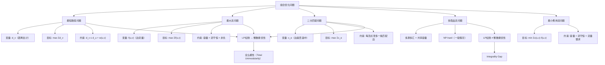

> [!abstract] 概览
> 本节展示如何将若干经典**组合优化问题**表述为**线性规划**（Linear Program, LP）。核心思想是：为问题中的决策量引入**连续变量**，将优化目标写成变量的**线性目标函数**，将问题的约束条件写成变量的**线性不等式或等式**。本节依次讨论了**最短路径**、**最大流**、**二分匹配**、**多商品流**和**最小费用流**五个经典问题的LP表述，并引入了**线性规划松弛**（LP relaxation）这一关键概念——它揭示了LP与整数规划之间的深刻联系，也为近似算法提供了理论基础。

---

## 知识结构总览



本节的知识脉络清晰：从最简单的**最短路径**开始，逐步过渡到**最大流**和**二分匹配**，再到更复杂的**多商品流**和**最小费用流**。前三者的LP松弛天然具有**整数最优性**（最优解恰好是整数），后两者则不一定——这一差异正是理解LP松弛意义的关键。

---

## 核心思想

### 2.1 最短路径问题的LP表述

**问题定义**：给定带权有向图 $G = (V, E)$，源顶点 $s \in V$，边权函数 $w : E \to \mathbb{R}$。目标是找到从 $s$ 到所有其他顶点 $v \in V$ 的**最短路径距离** $\delta(s, v)$。

#### 变量设计

为每个顶点 $v \in V$ 引入一个连续变量 $d_v$，表示从源 $s$ 到顶点 $v$ 的**距离估计值**。注意，这里 $d_v$ 是一个**非负实数**，而非整数。

#### 目标函数

$$\text{maximize} \quad \sum_{v \in V} d_v$$

> [!note] 为什么是最小化路径却用最大化目标？
> 直觉上最短路径应该"最小化"什么。但这里的技巧是：约束限制了每个距离估计不能超过其邻居的估计值加边权。如果目标是最小化所有距离之和，则所有距离估计为 0 就是最优解——这毫无意义。反过来，最大化所有距离之和则迫使每个距离估计尽可能大，而三角不等式约束恰好保证距离估计不会超过真正的最短路径距离。因此最优解中距离估计恰好等于最短路径距离。

#### 约束条件

$$
\begin{aligned}
d_v &\le d_u + w(u, v) & &\text{对所有边 } (u, v) \in E \quad \text{（三角不等式约束）} \\
d_s &= 0 & &\text{（源点距离为零）} \\
d_v &\ge 0 & &\text{对所有 } v \in V \quad \text{（非负约束）}
\end{aligned}
$$

#### 具体数值示例

考虑如下带权有向图，源点为 $s$：

```
    5
s ─────→ a
│        │
│3       │2
│        ↓
└──→ b ──→ c
     ↑    │
     │ 1  │6
     └────┘
```

**图的边集与权值**：

| 边 | 权值 |
|:--:|:----:|
| $(s, a)$ | 5 |
| $(s, b)$ | 3 |
| $(a, c)$ | 2 |
| $(b, c)$ | 1 |
| $(c, b)$ | 6 |

**转化为LP**：

变量：$d_s, d_a, d_b, d_c$

$$
\begin{aligned}
\text{maximize} \quad & d_s + d_a + d_b + d_c \\
\text{subject to} \quad & d_a \le d_s + 5 \\
& d_b \le d_s + 3 \\
& d_c \le d_a + 2 \\
& d_c \le d_b + 1 \\
& d_b \le d_c + 6 \\
& d_s = 0 \\
& d_a, d_b, d_c \ge 0
\end{aligned}
$$

**逐步求解**：

1. 由 $d_s = 0$，代入约束得：
   - $d_a \le 0 + 5 = 5$
   - $d_b \le 0 + 3 = 3$

2. 由 $d_c \le d_a + 2$ 且 $d_a \le 5$，得 $d_c \le 7$
   由 $d_c \le d_b + 1$ 且 $d_b \le 3$，得 $d_c \le 4$

3. 由 $d_b \le d_c + 6$，当 $d_c$ 增大时此约束不限制 $d_b$

4. 最大化目标函数，各变量取上界：
   - $d_a = 5$
   - $d_b = 3$
   - $d_c = 4$（受 $d_c \le d_b + 1 = 4$ 限制）

5. 目标函数值：$0 + 5 + 3 + 4 = 12$

**验证**：$d_s = 0, d_a = 5, d_b = 3, d_c = 4$，对应的最短路径为：
- $\delta(s, a) = 5$（路径 $s \to a$）
- $\delta(s, b) = 3$（路径 $s \to b$）
- $\delta(s, c) = 4$（路径 $s \to b \to c$）

这与 [[第22章_单源最短路径/22.1 Bellman-Ford算法]] 的计算结果一致。

---

### 2.2 最大流问题的LP表述

**问题定义**：给定流网络 $G = (V, E)$，源点 $s$，汇点 $t$，容量函数 $c : E \to \mathbb{R}_{\ge 0}$。目标是找到从 $s$ 到 $t$ 的**最大流量**。详见 [[第24章_最大流/24.1 流网络]]。

#### 变量设计

为每条边 $(u, v) \in E$ 引入一个连续变量 $f(u, v)$，表示该边上的**流量**。

#### 目标函数

$$\text{maximize} \quad \sum_{v : (s, v) \in E} f(s, v)$$

即最大化从源点 $s$ 流出的总流量。

#### 约束条件

$$
\begin{aligned}
f(u, v) &\le c(u, v) & &\text{对所有 } (u, v) \in E \quad \text{（容量约束）} \\
\sum_{v : (u, v) \in E} f(u, v) &= \sum_{v : (v, u) \in E} f(v, u) & &\text{对所有 } u \in V \setminus \{s, t\} \quad \text{（流守恒约束）} \\
f(u, v) &\ge 0 & &\text{对所有 } (u, v) \in E \quad \text{（非负约束）}
\end{aligned}
$$

> [!tip] 流守恒约束的直觉
> 想象水管网络：每个中间节点（非源非汇）流入的水量必须等于流出的水量，水不会凭空产生也不会凭空消失。源点只出不进，汇点只进不出。

**关键性质**：当所有容量 $c(u, v)$ 为整数时，最大流LP的最优解**一定是整数**。这一性质源于约束矩阵的**全幺模性**（Total Unimodularity），后面会详细讨论。

---

### 2.3 二分匹配问题的LP表述

**问题定义**：给定二分图 $G = (L, R, E)$，其中 $L$ 和 $R$ 是两个不相交的顶点集，$E \subseteq L \times R$ 是边集。目标是找到**最大基数匹配**——一个边集 $M \subseteq E$，使得 $M$ 中没有两条边共享端点，且 $|M|$ 最大。

#### 变量设计

为每条边 $e \in E$ 引入一个变量 $x_e \in [0, 1]$，表示边 $e$ 是否被选入匹配。在整数规划版本中，$x_e \in \{0, 1\}$；在LP松弛版本中，允许 $x_e$ 取 $[0, 1]$ 之间的任意实数。

#### 目标函数

$$\text{maximize} \quad \sum_{e \in E} x_e$$

#### 约束条件

$$
\begin{aligned}
\sum_{e \in \delta(v)} x_e &\le 1 & &\text{对所有 } v \in L \cup R \quad \text{（匹配约束）} \\
x_e &\ge 0 & &\text{对所有 } e \in E \quad \text{（非负约束）}
\end{aligned}
$$

其中 $\delta(v) = \{e \in E : v \text{ 是 } e \text{ 的端点}\}$ 表示与顶点 $v$ 关联的边集。

**关键性质**：二分匹配的LP松弛同样具有**整数最优性**——即使允许 $x_e$ 取分数值，最优解中所有 $x_e$ 仍然是 $0$ 或 $1$。这一性质同样源于约束矩阵的全幺模性。

---

### 2.4 多商品流问题的LP表述

**问题定义**：给定流网络 $G = (V, E)$，容量函数 $c : E \to \mathbb{R}_{\ge 0}$，以及 $k$ 个商品（commodity）。每个商品 $i$ 有一个源点 $s_i$、汇点 $t_i$ 和需求量 $d_i$。目标是同时为所有商品分配流量，使得每条边上的总流量不超过容量，且每个商品的流量满足其需求。

#### 变量设计

为每个商品 $i$ 和每条边 $(u, v) \in E$ 引入变量 $f_i(u, v)$，表示商品 $i$ 在边 $(u, v)$ 上的流量。

#### 目标函数

$$\text{maximize} \quad \sum_{i=1}^{k} \sum_{v : (s_i, v) \in E} f_i(s_i, v)$$

#### 约束条件

$$
\begin{aligned}
\sum_{i=1}^{k} f_i(u, v) &\le c(u, v) & &\text{对所有 } (u, v) \in E \quad \text{（共享容量约束）} \\
\sum_{v : (u, v) \in E} f_i(u, v) &= \sum_{v : (v, u) \in E} f_i(v, u) & &\text{对所有 } i, \text{ 对所有 } u \in V \setminus \{s_i, t_i\} \quad \text{（每个商品的流守恒）} \\
f_i(u, v) &\ge 0 & &\text{对所有 } i, (u, v) \in E \quad \text{（非负约束）}
\end{aligned}
$$

> [!warning] 多商品流是NP困难的
> 与单商品最大流不同，多商品流问题（即使只有2个商品）在一般情况下是**NP-hard**的。其LP松弛的最优解通常不是整数解，存在**整数间隙**（integrality gap）。

---

### 2.5 最小费用流问题的LP表述

**问题定义**：给定流网络 $G = (V, E)$，源点 $s$，汇点 $t$，容量函数 $c : E \to \mathbb{R}_{\ge 0}$，费用函数 $a : E \to \mathbb{R}$，以及流量需求 $D$。目标是找到从 $s$ 到 $t$ 的流量恰好为 $D$ 的流，使得**总费用最小**。

#### 变量设计

与最大流相同，为每条边 $(u, v) \in E$ 引入变量 $f(u, v)$。

#### 目标函数

$$\text{minimize} \quad \sum_{(u, v) \in E} a(u, v) \cdot f(u, v)$$

#### 约束条件

$$
\begin{aligned}
f(u, v) &\le c(u, v) & &\text{对所有 } (u, v) \in E \quad \text{（容量约束）} \\
\sum_{v : (u, v) \in E} f(u, v) &= \sum_{v : (v, u) \in E} f(v, u) & &\text{对所有 } u \in V \setminus \{s, t\} \quad \text{（流守恒约束）} \\
\sum_{v : (s, v) \in E} f(s, v) - \sum_{v : (v, s) \in E} f(v, s) &= D & &\text{（流量需求约束）} \\
f(u, v) &\ge 0 & &\text{对所有 } (u, v) \in E \quad \text{（非负约束）}
\end{aligned}
$$

**关键性质**：最小费用流是网络流问题中最一般的**统一模型**——最短路径、最大流、二分匹配都可以看作最小费用流的特例。当所有数据为整数时，最小费用流LP同样具有整数最优性。

---

### 2.6 线性规划松弛（LP Relaxation）

**核心概念**：许多组合优化问题的自然表述是**整数线性规划**（Integer Linear Program, ILP），即要求变量取整数值。**线性规划松弛**就是去掉变量的整数约束，允许变量取连续值，从而得到一个（更容易求解的）普通线性规划。

**形式化说明**：

原始整数规划：
$$
\begin{aligned}
\text{maximize} \quad & \mathbf{c}^T \mathbf{x} \\
\text{subject to} \quad & A\mathbf{x} \le \mathbf{b} \\
& x_i \in \{0, 1\} \quad \text{对所有 } i
\end{aligned}
$$

LP松弛：
$$
\begin{aligned}
\text{maximize} \quad & \mathbf{c}^T \mathbf{x} \\
\text{subject to} \quad & A\mathbf{x} \le \mathbf{b} \\
& 0 \le x_i \le 1 \quad \text{对所有 } i
\end{aligned}
$$

**LP松弛的意义**：

1. **可解性**：线性规划可以在**多项式时间**内求解（如内点法），而整数线性规划一般是**NP-hard**的
2. **上界/下界**：LP松弛的最优值提供了整数最优值的上界（最大化问题）或下界（最小化问题）
3. **近似算法**：通过"舍入"（rounding）LP松弛的分数解，可以得到整数可行解，进而设计近似算法
4. **结构性洞察**：LP松弛帮助我们理解问题的数学结构，判断哪些问题具有"整数最优性"

---

### 2.7 整数线性规划 vs 线性规划

| 对比维度 | 线性规划（LP） | 整数线性规划（ILP） |
|:--------:|:--------------:|:-------------------:|
| 变量域 | 连续实数 | 整数（通常为 $\{0, 1\}$） |
| 求解复杂度 | **P**（多项式时间可解） | **NP-hard**（一般情况） |
| 可行域 | 凸多面体 | 凸多面体内的整数格点 |
| 求解方法 | 单纯形法、内点法 | 分支定界、割平面法 |
| 最优解位置 | 顶点处（基本可行解） | 不一定在顶点处 |

> [!note] 整数最优性的"魔法"
> 对于某些特殊问题（如最大流、二分匹配、最短路径），LP松弛的最优解恰好是整数。这不是巧合，而是因为这些问题的约束矩阵具有**全幺模性**（Total Unimodularity）——矩阵的每个方阵子式的行列式为 0、+1 或 -1。全幺模性保证了LP的基本可行解自动是整数解，因此不需要专门求解整数规划。

---

## 补充理解与拓展

> [!info] LP松弛与整数规划的关系
> **整数间隙（Integrality Gap）**是衡量LP松弛质量的核心指标。对于最小化问题，整数间隙定义为：
> $$\text{IG} = \sup_{I} \frac{\text{OPT}_{\text{LP}}(I)}{\text{OPT}_{\text{ILP}}(I)}$$
> 其中 $\text{OPT}_{\text{LP}}(I)$ 和 $\text{OPT}_{\text{ILP}}(I)$ 分别是实例 $I$ 上LP松弛和整数规划的最优值。
>
> **顶点覆盖（Vertex Cover）**是理解整数间隙的经典案例。给定无向图 $G = (V, E)$，顶点覆盖的ILP为：
> $$\min \sum_{v \in V} x_v \quad \text{s.t.} \quad x_u + x_v \ge 1 \;\; \forall (u,v) \in E, \quad x_v \in \{0,1\}$$
> 其LP松弛将 $x_v \in \{0,1\}$ 放松为 $x_v \in [0,1]$。
>
> - 对于**二分图**，LP松弛具有整数最优性（整数间隙为1）
> - 对于**一般图**，LP松弛的最优解是**半整数**的（每个 $x_v \in \{0, \frac{1}{2}, 1\}$），整数间隙恰好为 $2 - \frac{2}{\chi^f(G)}$，其中 $\chi^f(G)$ 是图的分数色数
> - 基于LP松弛的**舍入算法**可以给出2-近似：将所有 $x_v \ge \frac{1}{2}$ 的顶点选入覆盖
>
> 这一框架由Hochbaum（1982）和Bar-Yehuda & Even（1981）独立提出，是**基于LP的近似算法**的奠基性工作。

> [!info] 最大流的LP表述与Ford-Fulkerson的关系
> 最大流问题可以自然地表述为LP，但实际求解时通常使用**Ford-Fulkerson方法**或其改进版本（如Edmonds-Karp算法、Dinic算法），而非直接调用通用LP求解器。原因在于：
>
> 1. **效率优势**：专用网络流算法的时间复杂度为 $O(VE^2)$（Edmonds-Karp）或 $O(V^2 E)$（Dinic），远快于通用LP求解器
> 2. **整数最优性保证**：当容量为整数时，Ford-Fulkerson方法直接产生整数流，无需额外处理
> 3. **结构利用**：专用算法充分利用了网络的图结构
>
> **全幺模性（Total Unimodularity）**是连接LP表述与整数最优性的数学桥梁。最大流LP的约束矩阵是**网络矩阵**（network matrix），而所有网络矩阵都是全幺模的。全幺模矩阵的定义是：每个方阵子式的行列式为 $0$、$+1$ 或 $-1$。根据Cramer法则，当约束矩阵 $A$ 全幺模且右端向量 $\mathbf{b}$ 为整数时，基本可行解 $\mathbf{x} = B^{-1}\mathbf{b}$ 的每个分量都是整数（因为 $B^{-1} = \frac{\text{adj}(B)}{\det(B)}$，而 $\det(B) = \pm 1$）。
>
> 值得注意的是，**多商品流**的约束矩阵**不是**全幺模的，这也是多商品流问题更加困难（NP-hard）的根本原因之一。

> [!info] 网络流问题的统一LP框架
> **最小费用流问题**（Minimum Cost Flow）是网络流问题中最一般的统一模型。它将最短路径、最大流、二分匹配等问题作为特例包含在内：
>
> | 问题 | 如何归约为最小费用流 |
> |:----:|:---------------------|
> | 最短路径 | 单位容量，费用为边权，流量需求 $D = 1$ |
> | 最大流 | 零费用（或添加虚拟边），最大化流量 |
> | 二分匹配 | 源点连左部顶点（容量1），右部顶点连汇点（容量1），所有边费用为0 |
> | 运输问题 | 无中间节点，供需平衡 |
>
> 最小费用流的LP表述为：
> $$\min \sum_{(u,v) \in E} c(u,v) \cdot f(u,v) \quad \text{s.t.} \quad \text{容量约束} + \text{流守恒} + \text{流量需求}$$
>
> 当所有容量、费用和需求为整数时，最小费用流LP具有**整数最优性**。这一统一框架表明，网络流问题的核心共性在于：约束矩阵都是全幺模的，因此LP松弛自动给出整数最优解。这也解释了为什么网络流问题虽然看似是组合优化问题，却可以在多项式时间内精确求解。

> [!info] 整数规划的实际求解方法
> 由于一般整数规划是NP-hard的，实际求解依赖以下核心方法：
>
> **1. 分支定界法（Branch and Bound）**
> - 将可行域递归地分割为子问题（"分支"）
> - 用LP松弛计算每个子问题的上界（最大化）或下界（最小化）（"定界"）
> - 剪去不可能包含最优解的子问题（"剪枝"）
> - 搜索策略：深度优先（快速找到可行解）、最优优先（快速逼近最优值）、混合策略
>
> **2. 割平面法（Cutting Planes）**
> - **Gomory割**：基于单纯形表的分数部分生成切平面，逐步缩小可行域
> - **Chvatal-Gomory割**：对约束进行非负线性组合后向下取整，得到更紧的有效不等式
> - **覆盖割**：特别适合集合覆盖等组合优化问题
> - **提升投影割（Lift-and-Project）**：从低维有效不等式提升到高维空间
>
> **3. 分支割平面法（Branch and Cut）**
> - 现代整数规划求解器（如CPLEX、Gurobi）的主流方法
> - 在分支定界框架中嵌入割平面生成
> - 割平面的质量直接影响求解效率
> - 对于大规模实际问题，通常能在合理时间内找到最优解或高质量的可行解
>
> **4. 启发式方法**
> - 在分支定界过程中使用贪心或局部搜索快速找到初始可行解
> - 为剪枝提供更好的下界参考

---

## 易混淆点

> [!warning] LP松弛解 vs 整数最优解（整数间隙）
> **误区**：认为LP松弛的最优解"四舍五入"后就是整数最优解。
>
> **纠正**：LP松弛的最优解与整数最优解之间的差距由**整数间隙**（Integrality Gap）衡量。对于某些问题（如最大流、二分匹配），整数间隙为1，LP松弛解恰好是整数解。但对于许多NP-hard问题（如顶点覆盖、最大割），整数间隙严格大于1，简单的舍入可能产生远离最优的解。
>
> **示例**：考虑一个三角形图（3个顶点两两相连）的顶点覆盖问题。ILP最优值为2（任选2个顶点），但LP松弛最优值为 $3/2$（每个变量取 $1/2$）。整数间隙为 $(3/2) / 2 = 3/4$（最小化问题，间隙 $< 1$ 说明LP松弛值更小）。如果直接将 $x_v \ge 1/2$ 的顶点全部选入，得到3个顶点的覆盖——比最优解大了50%。

> [!warning] 等式约束 vs 不等式约束的转换
> **误区**：认为等式约束和不等式约束可以随意互换。
>
> **纠正**：在LP的标准型中，约束统一为 $A\mathbf{x} \le \mathbf{b}$ 的形式。等式约束 $\mathbf{a}^T\mathbf{x} = b$ 等价于两个不等式约束 $\mathbf{a}^T\mathbf{x} \le b$ 和 $\mathbf{a}^T\mathbf{x} \ge b$（即 $-\mathbf{a}^T\mathbf{x} \le -b$）。但在实际建模中，等式约束（如流守恒）比两个不等式约束更紧凑，能帮助求解器更快收敛。
>
> **实用建议**：建模时优先使用等式约束表达精确的平衡关系（如流守恒），使用不等式约束表达上限或下限（如容量约束）。转换为标准型时再按需拆分。

---

## 习题精选

| 题号 | 题目主题 | 难度 | 核心考点 |
|:----:|:--------:|:----:|:--------:|
| 29.2-1 | 最短路径LP转标准型 | ★★☆ | 标准型转换、松弛变量引入 |
| 29.2-3 | 单源最短路径LP表述 | ★★☆ | LP建模、三角不等式约束 |
| 29.2-4 | 最大流LP表述 | ★★★ | 流守恒约束、容量约束 |
| 29.2-6 | 二分匹配LP表述 | ★★★ | 匹配约束、LP松弛的整数性 |

> [!faq]- 29.2-1：将最短路径LP转化为标准型
> **题目**：将单源最短路径问题的LP表述转化为 [[29.1 线性规划的表述与算法]] 中定义的标准型。
>
> **解题思路**：
> 回顾标准型要求：目标为最大化，所有约束为 $\le$ 不等式，所有变量非负。
>
> 原始LP中，$d_s = 0$ 是一个等式约束，需要转化为两个不等式：$d_s \le 0$ 和 $d_s \ge 0$（即 $-d_s \le 0$）。由于已有 $d_s \ge 0$ 的非负约束，等价于只需 $d_s \le 0$ 和 $d_s \ge 0$，即 $d_s = 0$。
>
> **标准答案**：
> $$
> \begin{aligned}
> \text{maximize} \quad & \sum_{v \in V} d_v \\
> \text{subject to} \quad & d_v - d_u \le w(u, v) & &\text{对所有 } (u, v) \in E \\
> & d_s \le 0 \\
> & -d_s \le 0 \\
> & -d_v \le 0 & &\text{对所有 } v \in V
> \end{aligned}
> $$
> 其中，$d_s \le 0$ 与 $-d_s \le 0$ 共同约束 $d_s = 0$，$-d_v \le 0$ 即 $d_v \ge 0$。所有约束均为 $\le$ 形式，所有变量隐含非负，符合标准型要求。

> [!faq]- 29.2-3：单源最短路径的LP表述
> **题目**：解释为什么单源最短路径问题可以表述为线性规划。如果图中存在负权边但无负权回路，LP表述是否仍然正确？
>
> **解题思路**：
> 关键在于三角不等式约束 $d_v \le d_u + w(u, v)$ 是否能正确刻画最短路径。
>
> **标准答案**：
>
> 单源最短路径问题可以表述为LP，因为：
> 1. 三角不等式约束 $d_v \le d_u + w(u, v)$ 对所有边成立，等价于要求 $d_v$ 不超过从 $s$ 到 $v$ 的任何路径长度
> 2. 最大化 $\sum d_v$ 迫使每个 $d_v$ 尽可能大，从而 $d_v = \delta(s, v)$
>
> 当图中存在**负权边但无负权回路**时，LP表述**仍然正确**。原因如下：
> - 无负权回路保证了 $\delta(s, v)$ 是良定义的（有限值）
> - 三角不等式约束仍然有效：如果 $w(u, v) < 0$，则 $d_v \le d_u + w(u, v)$ 是一个更紧的约束
> - 最大化目标仍然迫使 $d_v$ 取到最短路径距离
>
> 但如果存在**负权回路**，则某些 $d_v$ 可以趋向 $-\infty$（沿着负权回路反复走），LP将**无界**（unbounded），这与最短路径距离为 $-\infty$ 的结论一致。

> [!faq]- 29.2-4：最大流的LP表述
> **题目**：给定一个具体的流网络，写出其最大流问题的LP表述，并说明为什么当容量为整数时最优解一定是整数。
>
> **解题思路**：
> 按照最大流LP的三类约束（容量、流守恒、非负）逐条写出。
>
> **标准答案**：
>
> 考虑流网络：$V = \{s, a, b, t\}$，边和容量为 $c(s,a)=3, c(s,b)=2, c(a,b)=1, c(a,t)=2, c(b,t)=3$。
>
> LP表述：
> $$
> \begin{aligned}
> \text{maximize} \quad & f(s,a) + f(s,b) \\
> \text{subject to} \quad
> & f(s,a) \le 3, \quad f(s,b) \le 2, \quad f(a,b) \le 1, \quad f(a,t) \le 2, \quad f(b,t) \le 3 \\
> & f(s,a) = f(a,b) + f(a,t) \quad \text{（节点 } a \text{ 的流守恒）} \\
> & f(s,b) + f(a,b) = f(b,t) \quad \text{（节点 } b \text{ 的流守恒）} \\
> & f(s,a), f(s,b), f(a,b), f(a,t), f(b,t) \ge 0
> \end{aligned}
> $$
>
> 最优解：$f(s,a) = 3, f(s,b) = 2, f(a,b) = 1, f(a,t) = 2, f(b,t) = 3$，最大流值为 $5$。
>
> **整数性论证**：最大流LP的约束矩阵是**网络矩阵**，而所有网络矩阵都是**全幺模**的。根据全幺模性的性质，当约束矩阵 $A$ 全幺模且右端向量 $\mathbf{b}$（此处为容量向量）为整数时，LP的所有基本可行解都是整数向量。因此最优解一定是整数解。

> [!faq]- 29.2-6：二分匹配的LP表述
> **题目**：给定二分图 $G = (L, R, E)$，写出最大二分匹配问题的LP表述。证明当 $G$ 是二分图时，LP松弛的最优解一定是整数。
>
> **解题思路**：
> 按照二分匹配LP的变量、目标、约束写出完整表述。整数性证明需要利用二分图匹配约束矩阵的全幺模性。
>
> **标准答案**：
>
> LP表述：
> $$
> \begin{aligned}
> \text{maximize} \quad & \sum_{e \in E} x_e \\
> \text{subject to} \quad & \sum_{e \in \delta(v)} x_e \le 1 \quad \text{对所有 } v \in L \cup R \\
> & x_e \ge 0 \quad \text{对所有 } e \in E
> \end{aligned}
> $$
>
> **整数性证明**：
>
> 二分匹配LP的约束矩阵是**关联矩阵**（incidence matrix）的转置。对于二分图 $G = (L, R, E)$，其关联矩阵的行对应顶点，列对应边，每列恰好有两个非零元素（一个 $+1$，一个 $-1$，分别对应边的两个端点）。
>
> 由于 $G$ 是二分图，我们可以将顶点集划分为 $L$ 和 $R$ 两部分。将 $L$ 中所有顶点对应的行乘以 $-1$，则约束矩阵变为每列恰好有一个 $+1$ 和一个 $+1$（即两个 $+1$）。这种矩阵是**网络矩阵**的特殊形式，因而是全幺模的。
>
> 【全幺模性（具体细节）】：一个矩阵 $A$ 是全幺模的，当且仅当其每个方阵子式的行列式为 $0$、$+1$ 或 $-1$。对于二分图的关联矩阵，可以通过归纳法证明其全幺模性：任取 $k \times k$ 子矩阵，如果某列只有一个非零元素，则按该列展开，行列式为 $\pm 1$ 乘以 $(k-1) \times (k-1)$ 子矩阵的行列式；如果每列都有两个非零元素，则行和为零，行列式为零。由数学归纳法，所有子式的行列式为 $0$ 或 $\pm 1$。
>
> 因此，二分匹配LP松弛的基本可行解是整数解，即 $x_e \in \{0, 1\}$，恰好对应一个合法的匹配。

---

## 视频学习指南

| 资源 | 讲者/来源 | 主题 | 时长 | 语言 |
|:----:|:---------:|:----:|:----:|:----:|
| MIT 6.046J Lecture 16 | Prof. Erik Demaine | Network Flow and Linear Programming | ~80min | EN |
| CMU 15-451 Lecture 22 | Prof. Anupam Gupta | LP Duality and Applications | ~75min | EN |
| Stanford CS261 Lecture 5 | Prof. Nima Anari | LP Relaxations for Combinatorial Problems | ~60min | EN |
| 慕课网《算法导论精讲》 | — | 第29章：线性规划 | ~45min | ZH |

> [!tip] 视频学习建议
> 建议先观看MIT 6.046J的对应章节，理解LP建模的基本思路。之后观看CMU 15-451的对偶性章节，建立LP建模与对偶理论的联系。最后通过Stanford CS261深入理解LP松弛在近似算法中的应用。

---

## 教材原文

> [!quote] CLRS 第4版 第29.2节
> "In this section, we show how to formulate several combinatorial problems as linear programs. We start with the shortest-path problem, then move on to maximum flow, bipartite matching, multicommodity flow, and minimum-cost flow."
>
> "The key idea is to define variables that represent the decisions to be made, write the objective as a linear function of these variables, and express the constraints as linear inequalities or equalities."

---

## 参见Wiki

- [[离散数学/concepts/最大流]]：最大流问题是本节LP建模的核心案例之一，其LP表述具有整数最优性
- [[离散数学/concepts/二分匹配]]：二分匹配的LP表述利用了关联矩阵的全幺模性
- [[离散数学/concepts/贪心算法]]：某些贪心算法可以看作LP松弛的极端情形（如分数背包问题）
- [[第29章_线性规划/29.1 线性规划的表述与算法]]：标准型与松弛型的定义，是理解本节LP表述的基础
- [[第29章_线性规划/29.3 对偶性]]：LP对偶理论为理解LP松弛的界提供了有力工具
- [[24.1 流网络]]：流网络的定义与性质，是最大流LP建模的图论基础
- [[第22章_单源最短路径/22.1 Bellman-Ford算法]]：最短路径的经典算法，与最短路径LP表述形成对照

---

#学习/算法导论/第29章-线性规划 #学习/算法导论/线性规划/问题建模
