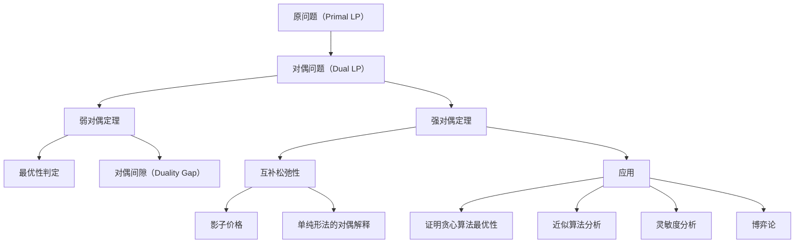

## 相关笔记

- [[29.1 线性规划的表述与算法]]
- [[29.2 将问题表述为线性规划]]
- [[第29章_线性规划-章节汇总]]

> [!abstract] 概览
> 本节介绍**线性规划的对偶性（duality）**理论——每个线性规划问题都存在一个与之"镜像对称"的**对偶问题**。核心知识点包括：
> - **对偶问题的构造**：将最大化问题转化为最小化问题，系数矩阵转置，约束方向反转，目标系数与约束右端互换
> - **弱对偶定理**：对任意可行解，原问题目标值不超过对偶问题目标值，为最优性提供判定准则
> - **强对偶定理**：当原问题存在最优解时，原问题与对偶问题的最优值相等，这是对偶理论的基石
> - **互补松弛性**：原变量与对偶约束、对偶变量与原约束之间的"紧致"对应关系，连接原问题与对偶问题的最优解结构
> - **影子价格**：对偶变量的经济学解释——约束放宽一单位时目标函数的边际增量

---

## 知识结构总览

---

## 核心思想

> [!tip] 核心思想
> 对偶性的核心洞察：每个线性规划问题都存在一个"镜像"问题。原问题追求目标函数的最大化，对偶问题追求另一个目标函数的最小化。两个问题的最优值在良好条件下相等（强对偶定理），且对偶变量揭示了原问题约束的"边际价值"（影子价格）。这一理论不仅是理解线性规划深层结构的钥匙，更是设计高效算法和分析算法正确性的核心工具。

### 2.1 对偶问题的构造规则

给定标准型线性规划（原问题）：

$$
\text{最大化 } z = c^T x \quad \text{受限于} \quad Ax \leq b, \quad x \geq 0
$$

其中 $A \in \mathbb{R}^{m \times n}$，$c \in \mathbb{R}^n$，$b \in \mathbb{R}^m$，$x \in \mathbb{R}^n$。

**对偶问题**的构造遵循以下对称规则：

| 步骤 | 原问题（Primal） | 对偶问题（Dual） |
|:-----|:-----------------|:-----------------|
| 1. 优化方向 | 最大化（maximize） | 最小化（minimize） |
| 2. 目标函数系数 | $c^T x$（系数为 $c$） | $b^T y$（系数为 $b$） |
| 3. 约束右端 | $b$（右端为 $b$） | $c$（右端为 $c$） |
| 4. 系数矩阵 | $A$（约束矩阵为 $A$） | $A^T$（约束矩阵为 $A^T$） |
| 5. 约束方向 | $\leq$ | $\geq$ |
| 6. 变量非负约束 | $x \geq 0$ | $y \geq 0$ |

因此，对偶问题为：

$$
\text{最小化 } w = b^T y \quad \text{受限于} \quad A^T y \geq c, \quad y \geq 0
$$

其中 $y \in \mathbb{R}^m$ 是**对偶变量**。

**构造规则的直观记忆**：想象将原问题的所有元素"转置"——行变列、列变行，最大化变最小化，$\leq$ 变 $\geq$，目标系数与约束右端互换位置。

**分量展开形式**。设原问题为：

$$
\begin{aligned}
\text{最大化 } \quad & c_1 x_1 + c_2 x_2 + \cdots + c_n x_n \\
\text{受限于} \quad & a_{11}x_1 + a_{12}x_2 + \cdots + a_{1n}x_n \leq b_1 \\
& a_{21}x_1 + a_{22}x_2 + \cdots + a_{2n}x_n \leq b_2 \\
& \quad \vdots \\
& a_{m1}x_1 + a_{m2}x_2 + \cdots + a_{mn}x_n \leq b_m \\
& x_1, x_2, \ldots, x_n \geq 0
\end{aligned}
$$

则对偶问题为：

$$
\begin{aligned}
\text{最小化 } \quad & b_1 y_1 + b_2 y_2 + \cdots + b_m y_m \\
\text{受限于} \quad & a_{11}y_1 + a_{21}y_2 + \cdots + a_{m1}y_m \geq c_1 \\
& a_{12}y_1 + a_{22}y_2 + \cdots + a_{m2}y_m \geq c_2 \\
& \quad \vdots \\
& a_{1n}y_1 + a_{2n}y_2 + \cdots + a_{mn}y_m \geq c_n \\
& y_1, y_2, \ldots, y_m \geq 0
\end{aligned}
$$

注意：对偶问题的第 $j$ 个约束由原问题系数矩阵 $A$ 的**第 $j$ 列**构成——这正是矩阵转置的效果。

### 2.2 弱对偶定理

> [!tip] 弱对偶定理
> 对于原问题的任意可行解和对偶问题的任意可行解，原问题目标值不超过对偶问题目标值。

**形式化表述：** 对于原问题的任意可行解 $x$ 和对偶问题的任意可行解 $y$，有 $c^T x \leq b^T y$。

**证明：**

设 $x$ 是原问题的可行解，$y$ 是对偶问题的可行解。由可行性条件：

- 原问题：$Ax \leq b$，即 $\sum_{j=1}^{n} a_{ij} x_j \leq b_i$，对每个 $i = 1, \ldots, m$
- 对偶问题：$A^T y \geq c$，即 $\sum_{i=1}^{m} a_{ij} y_i \geq c_j$，对每个 $j = 1, \ldots, n$
- 非负性：$x \geq 0$，$y \geq 0$

【关键词（不等式两边同时乘以非负数，不等号方向不变）】

因为 $y \geq 0$，对原问题的每个约束 $Ax \leq b$ 两边左乘 $y^T$（即用 $y_i \geq 0$ 乘以第 $i$ 个不等式再求和）：

$$
y^T A x \leq y^T b = b^T y
$$

【关键词（矩阵转置保持内积不变，$(y^T A x)^T = x^T A^T y$）】

因为 $x \geq 0$，对对偶问题的每个约束 $A^T y \geq c$ 两边左乘 $x^T$（即用 $x_j \geq 0$ 乘以第 $j$ 个不等式再求和）：

$$
x^T A^T y \geq x^T c = c^T x
$$

注意到 $y^T A x$ 是一个标量，标量的转置等于自身，因此：

$$
y^T A x = (y^T A x)^T = x^T A^T y
$$

将上述两个不等式合并：

$$
c^T x \leq x^T A^T y = y^T A x \leq b^T y
$$

因此 $c^T x \leq b^T y$。$\blacksquare$

**弱对偶定理的三个重要推论：**

1. **对偶间隙（Duality Gap）**：$b^T y - c^T x \geq 0$，对偶目标值与原问题目标值之差非负。
2. **最优性判定准则**：若找到可行解 $x^*$ 和 $y^*$ 使得 $c^T x^* = b^T y^*$，则 $x^*$ 和 $y^*$ 分别是原问题和对偶问题的**最优解**。
3. **无界性推论**：若原问题无界（目标值可以趋于 $+\infty$），则对偶问题**不可行**。

### 2.3 强对偶定理

> [!tip] 强对偶定理
> 若原问题存在最优解，则对偶问题也存在最优解，且两者的最优值相等。

**形式化表述：** 若原问题存在最优解 $x^*$，则对偶问题也存在最优解 $y^*$，且 $c^T x^* = b^T y^*$。

**证明思路（基于单纯形法的最优基）：**

【关键词（最优基本可行解、基变量、检验数、互补松弛性）】

设原问题有最优解。由[[29.1 线性规划的表述与算法]]中的单纯形法理论，原问题存在一个**最优基本可行解** $x^*$，对应最优基 $B$。将矩阵 $A$ 分块为 $A = [B \mid N]$，其中 $B$ 是 $m \times m$ 的可逆基矩阵，$N$ 是 $m \times (n-m)$ 的非基矩阵。相应地将 $x = (x_B, x_N)^T$，$c = (c_B, c_N)^T$。

**第一步：构造对偶可行解。**

定义 $y^* = (c_B^T B^{-1})^T$，即 $y^{*T} = c_B^T B^{-1}$。

**第二步：验证 $y^*$ 的对偶可行性。**

对偶约束要求 $A^T y^* \geq c$。分基变量和非基变量两部分验证：

- 对于基变量部分：$B^T y^* = B^T (B^{-1})^T c_B = (B^{-1} B)^T c_B = I^T c_B = c_B$，即基变量对应的对偶约束**取等号**。
- 对于非基变量部分：$N^T y^* = N^T (B^{-1})^T c_B = (c_B^T B^{-1} N)^T$。由单纯形法的最优性条件，所有非基变量的检验数 $\bar{c}_j = c_j - c_B^T B^{-1} a_j \leq 0$（对于最大化问题），因此 $c_N^T - c_B^T B^{-1} N \leq 0$，即 $c_B^T B^{-1} N \geq c_N^T$，所以 $N^T y^* \geq c_N$。

【关键词（检验数非正是最优性的充要条件，它恰好保证了对偶可行性）】

**第三步：验证目标值相等。**

原问题最优值：$c^T x^* = c_B^T x_B^* + c_N^T x_N^* = c_B^T B^{-1} b + 0 = c_B^T B^{-1} b$（因为非基变量 $x_N^* = 0$）。

对偶目标值：$b^T y^* = b^T (B^{-1})^T c_B = (c_B^T B^{-1} b)^T = c_B^T B^{-1} b$（标量的转置等于自身）。

因此 $c^T x^* = b^T y^*$。$\blacksquare$

**强对偶定理的深刻含义**：单纯形法在求解原问题的同时，其最优基的检验数信息自动给出了对偶问题的最优解。对偶最优解 $y^* = (c_B^T B^{-1})^T$ 被称为**影子价格向量**。

### 2.4 对偶的经济解释——影子价格

**影子价格（shadow prices）**是对偶变量 $y_i^*$ 的经济学含义。

考虑一个资源分配问题：工厂有 $m$ 种资源，第 $i$ 种资源的总量为 $b_i$。生产 $n$ 种产品，第 $j$ 种产品的单位利润为 $c_j$，每单位产品 $j$ 消耗资源 $i$ 的量为 $a_{ij}$。

原问题：在资源约束下最大化总利润。

对偶变量 $y_i^*$ 的含义：**第 $i$ 种资源的影子价格**——如果第 $i$ 种资源的可用量从 $b_i$ 增加到 $b_i + 1$，目标函数最优值的增量为 $y_i^*$。

**形式化表述**：设原问题的最优值为 $z^*(b)$，则：

$$
y_i^* = \frac{\partial z^*}{\partial b_i}
$$

【关键词（影子价格是目标函数关于约束右端的偏导数，反映资源的边际价值）】

**互补松弛性条件**提供了更深层的经济洞察：

$$
\begin{aligned}
x_j^* > 0 &\implies \text{对偶第 } j \text{ 个约束取等号} \\
y_i^* > 0 &\implies \text{原问题第 } i \text{ 个约束取等号}
\end{aligned}
$$

经济含义：
- 若某种产品 $j$ 的最优产量 $x_j^* > 0$，则生产该产品所消耗资源的"隐含成本"恰好等于其利润（无超额利润）。
- 若某种资源 $i$ 的影子价格 $y_i^* > 0$，则该资源在最优方案中被**完全耗尽**（约束取等号），属于稀缺资源。

### 2.5 互补松弛性

> [!tip] 互补松弛性定理
> 设原问题的最优解为 x*，对偶问题的最优解为 y*。则对每个变量，要么原变量为零，要么对应对偶约束取等号；同时，要么对偶变量为零，要么对应原约束取等号。

**形式化表述：** 设 $x^*$ 是原问题的最优解，$y^*$ 是对偶问题的最优解。则以下条件同时成立：
$$
(\forall j)\quad x_j^* \cdot (a_j^T y^* - c_j) = 0
$$
$$
(\forall i)\quad y_i^* \cdot (b_i - a_i^T x^*) = 0
$$
其中 $a_j$ 表示 $A$ 的第 $j$ 列，$a_i^T$ 表示 $A$ 的第 $i$ 行。

**证明：**

由强对偶定理，$c^T x^* = b^T y^*$。由弱对偶定理的证明过程：

$$
c^T x^* \leq x^{*T} A^T y^* = y^{*T} A x^* \leq b^T y^*
$$

要使 $c^T x^* = b^T y^*$ 成立，必须同时有：

$$
c^T x^* = x^{*T} A^T y^* \quad \text{且} \quad y^{*T} A x^* = b^T y^*
$$

【关键词（链式不等式两端相等，要求中间每一步都取等号）】

第一个等式 $c^T x^* = x^{*T} A^T y^*$ 即 $\sum_{j=1}^{n} x_j^* c_j = \sum_{j=1}^{n} x_j^* (a_j^T y^*)$，整理得：

$$
\sum_{j=1}^{n} x_j^* (a_j^T y^* - c_j) = 0
$$

由于 $x_j^* \geq 0$ 且 $a_j^T y^* - c_j \geq 0$（对偶可行性），非负项之和为零意味着每一项都为零：

$$
x_j^* (a_j^T y^* - c_j) = 0, \quad \forall j
$$

类似地，由第二个等式可得：

$$
y_i^* (b_i - a_i^T x^*) = 0, \quad \forall i
$$

$\blacksquare$

**互补松弛性的等价表述**：

| 条件 | 等价表述 |
|:-----|:---------|
| $x_j^* > 0$ | 对偶第 $j$ 个约束取等号：$a_j^T y^* = c_j$ |
| $a_j^T y^* > c_j$ | 原变量 $x_j^* = 0$（对偶约束有"松弛"） |
| $y_i^* > 0$ | 原问题第 $i$ 个约束取等号：$a_i^T x^* = b_i$ |
| $a_i^T x^* < b_i$ | 对偶变量 $y_i^* = 0$（原约束有"松弛"） |

### 2.6 对偶性与单纯形算法的关系

单纯形法与对偶性之间存在深刻的内在联系：

1. **单纯形法同时求解两个问题**：当单纯形法在原问题上达到最优时，检验数向量 $\bar{c} = c - A^T y^*$（其中 $y^* = (c_B^T B^{-1})^T$）恰好给出了对偶问题的解。检验数非正等价于对偶可行性。

2. **对偶单纯形法（Dual Simplex Method）**：从对偶可行解出发，保持对偶可行性，逐步改善原可行性。适用于原问题初始解不可行但对偶问题初始解可行的情形。

3. **最优基的双重身份**：最优基 $B$ 同时满足：
   - 原可行性：$B^{-1} b \geq 0$
   - 对偶可行性：$c_N^T - c_B^T B^{-1} N \leq 0$

### 2.7 对偶性的应用

**应用一：证明算法正确性**

对偶性为许多算法的最优性证明提供了优雅的框架。例如，在[[离散数学/concepts/贪心算法]]中，可以构造对偶问题来证明贪心选择的最优性——如果贪心算法的解与对偶问题的某个可行解满足互补松弛性，则由弱对偶定理的推论可知贪心解是最优的。

**应用二：提供下界（近似算法分析）**

在近似算法设计中，对偶问题的最优值提供了原问题最优值的一个**下界**（对于最大化问题）。设原问题最优值为 OPT，对偶问题最优值为 DUAL，则：

$$
\text{DUAL} \leq \text{OPT} \leq \text{ALG}
$$

若能证明 $\text{ALG} \leq \alpha \cdot \text{DUAL}$，则近似比为 $\alpha$。

**应用三：灵敏度分析**

影子价格直接回答了"如果改变参数，最优值如何变化"的问题：
- 改变约束右端 $b_i$：最优值的变化率由 $y_i^*$ 给出
- 改变目标系数 $c_j$：若 $x_j^* > 0$，则 $c_j$ 的小幅变化不改变最优基

### 2.8 具体数值示例

**原问题**：

$$
\begin{aligned}
\text{最大化 } \quad & z = 5x_1 + 4x_2 \\
\text{受限于} \quad & 6x_1 + 4x_2 \leq 24 \quad \text{（资源1）} \\
& x_1 + 2x_2 \leq 6 \quad \text{（资源2）} \\
& x_1, x_2 \geq 0
\end{aligned}
$$

**步骤一：构造对偶问题。**

按照构造规则，对偶变量为 $y_1, y_2$（对应两个资源约束）：

$$
\begin{aligned}
\text{最小化 } \quad & w = 24y_1 + 6y_2 \\
\text{受限于} \quad & 6y_1 + y_2 \geq 5 \quad \text{（对应 } x_1 \text{）} \\
& 4y_1 + 2y_2 \geq 4 \quad \text{（对应 } x_2 \text{）} \\
& y_1, y_2 \geq 0
\end{aligned}
$$

**步骤二：求解原问题。**

用图解法。两个约束的交点：

$$
\begin{cases}
6x_1 + 4x_2 = 24 \\
x_1 + 2x_2 = 6
\end{cases}
$$

由第二个方程得 $x_1 = 6 - 2x_2$，代入第一个方程：

$$
6(6 - 2x_2) + 4x_2 = 24 \implies 36 - 12x_2 + 4x_2 = 24 \implies 8x_2 = 12 \implies x_2 = 1.5
$$

因此 $x_1 = 6 - 2(1.5) = 3$。

目标值：$z^* = 5(3) + 4(1.5) = 15 + 6 = 21$。

**步骤三：求解对偶问题。**

用图解法。两个约束的交点：

$$
\begin{cases}
6y_1 + y_2 = 5 \\
4y_1 + 2y_2 = 4
\end{cases}
$$

由第一个方程得 $y_2 = 5 - 6y_1$，代入第二个方程：

$$
4y_1 + 2(5 - 6y_1) = 4 \implies 4y_1 + 10 - 12y_1 = 4 \implies -8y_1 = -6 \implies y_1 = 0.75
$$

因此 $y_2 = 5 - 6(0.75) = 5 - 4.5 = 0.5$。

目标值：$w^* = 24(0.75) + 6(0.5) = 18 + 3 = 21$。

**步骤四：验证强对偶性。**

$$
z^* = 21 = w^*
$$

强对偶定理成立。

**步骤五：验证互补松弛性。**

原问题：$x_1^* = 3 > 0$，$x_2^* = 1.5 > 0$。

由互补松弛性，两个对偶约束都应取等号：
- $6(0.75) + 0.5 = 4.5 + 0.5 = 5 = c_1$ ✓
- $4(0.75) + 2(0.5) = 3 + 1 = 4 = c_2$ ✓

对偶问题：$y_1^* = 0.75 > 0$，$y_2^* = 0.5 > 0$。

由互补松弛性，两个原约束都应取等号：
- $6(3) + 4(1.5) = 18 + 6 = 24 = b_1$ ✓
- $3 + 2(1.5) = 3 + 3 = 6 = b_2$ ✓

**经济解释**：$y_1^* = 0.75$ 表示资源1的影子价格为 0.75——如果资源1的可用量从 24 增加到 25，最优利润将增加约 0.75。$y_2^* = 0.5$ 表示资源2的影子价格为 0.5。两种资源在最优方案中都被完全耗尽（约束取等号），说明它们都是稀缺资源。

---

## 补充理解与拓展

> [!info] 补充：对偶性的数学基础——Farkas引理
> **来源：** 数学规划理论经典结果，Gyula Farkas 于1902年提出
>
> **Farkas引理**是证明强对偶定理的底层数学工具。其经典形式为：
>
> 设 $A \in \mathbb{R}^{m \times n}$，$b \in \mathbb{R}^m$。以下两个命题**恰好有一个**成立：
> - (I) $\exists x \in \mathbb{R}^n$，使得 $Ax = b$ 且 $x \geq 0$
> - (II) $\exists y \in \mathbb{R}^m$，使得 $y^T A \geq 0$ 且 $y^T b < 0$
>
> 这是一种"择一定理"（theorem of alternatives）：它断言两个线性系统不可能同时有解，也不可能同时无解。Farkas引理可以推广到不等式版本，进而用于证明线性规划的强对偶定理。其证明通常基于凸集分离定理（separating hyperplane theorem），将线性规划的对偶性置于更广阔的凸优化框架之中。
>
> **参考文献：** Cornell ORIE 6300 Lecture Notes (Lecture 7); Royal Holloway Notes on Farkas' Lemma

> [!info] 补充：影子价格在经济学中的应用
> **来源：** 微观经济学与运筹学交叉领域
>
> 影子价格（shadow price）的概念起源于微观经济学中的**拉格朗日乘子**的经济解释。在约束优化问题中，拉格朗日乘子 $\lambda_i$ 表示第 $i$ 个约束的**边际松弛价值**——当约束右端增加一单位时，目标函数的最优值变化量。
>
> 在实际应用中，影子价格回答了管理决策的核心问题：
> - **资源定价**：影子价格可以作为企业内部转移定价的基础。如果外部市场价格低于影子价格，企业应增加该资源的采购；反之则应出售资源。
> - **投资决策**：比较扩大产能的投资成本与影子价格，判断投资是否值得。
> - **机会成本度量**：影子价格衡量了使用一单位资源所放弃的最佳替代用途的价值。
>
> **互补松弛性的经济含义**：若某资源的影子价格为零（$y_i^* = 0$），说明该资源有剩余（约束不紧），增加该资源不会提高利润。若影子价格为正（$y_i^* > 0$），说明该资源是瓶颈，完全耗尽。
>
> **参考文献：** NumberAnalytics "Deep Dive into Shadow Pricing in Micro Econ"; Fiveable "Duality Theory Study Guide"

> [!info] 补充：对偶性与博弈论的关系
> **来源：** von Neumann (1928) 极大极小定理；Dantzig 与 von Neumann 的历史性对话
>
> 线性规划对偶性与博弈论之间存在深刻的联系，这一联系可以追溯到博弈论的诞生。1947年10月3日，George Dantzig 向 John von Neumann 解释了他刚发明的单纯形法，von Neumann 随即给出了一场"令人瞠目"的关于 LP 对偶性的讲座，并指出对偶性等价于他1928年证明的**极大极小定理**。
>
> **核心对应关系**：
> - 二人零和博弈的支付矩阵 $A \in \mathbb{R}^{m \times n}$
> - 行玩家的最大化问题对应原问题 LP
> - 列玩家的最小化问题对应对偶问题 LP
> - 极大极小定理 $\max_x \min_y x^T A y = \min_y \max_x x^T A y = v$ 正是强对偶定理在零和博弈中的体现
>
> 博弈值 $v$ 同时等于原问题和对偶问题的最优值。这一对应关系不仅提供了求解零和博弈的算法（将其转化为 LP），也为理解对偶性的数学本质提供了博弈论的视角。
>
> **参考文献：** von Stengel "Zero-Sum Games and Linear Programming Duality" (LSE, 2023)

> [!info] 补充：对偶性在近似算法中的应用
> **来源：** 近似算法理论，Vazirani "Approximation Algorithms"
>
> LP 对偶性是设计和分析近似算法的核心工具之一，尤其在**覆盖问题**（covering problems）和**打包问题**（packing problems）中表现突出。
>
> **顶点覆盖问题（Vertex Cover）**：
> - 原问题 LP：对每个顶点 $v$，变量 $x_v \in \{0, 1\}$，最小化 $\sum w_v x_v$，受限于每条边至少有一个端点被选中
> - LP 松弛：允许 $0 \leq x_v \leq 1$
> - 对偶问题：对每条边 $e$，变量 $y_e \geq 0$，最大化 $\sum y_e$，受限于对每个顶点 $v$，$\sum_{e \ni v} y_e \leq w_v$
> - **原始对偶算法**：同时构造原始解和对偶解，利用互补松弛性保证近似比为 2
>
> **集合覆盖问题（Set Cover）**：
> - 贪心算法的近似比 $O(\ln n)$ 可以通过对偶拟合（dual fitting）方法分析
> - 随机舍入 LP 松弛解可以得到 $O(\ln n)$ 近似比
>
> **核心范式**：原始对偶算法框架——不显式求解 LP，而是通过同时增长对偶解来驱动原始解的构造，利用互补松弛性作为算法的终止条件和正确性保证。
>
> **参考文献：** Dartmouth CS "LP Duality: Set Cover and Vertex Cover"; 南京大学 "Primal-Dual Algorithms" 讲义

---

## 易混淆点

> [!warning] 误区：弱对偶 vs 强对偶
> ❌ **错误理解：** 弱对偶定理和强对偶定理说的是同一件事，都保证原问题最优值等于对偶问题最优值。
>
> ✅ **正确理解：** 弱对偶定理只给出**不等式** $c^T x \leq b^T y$（对任意可行解），而强对偶定理保证在最优解处**等号成立** $c^T x^* = b^T y^*$。
>
> **辨析：** 弱对偶是"方向性"结果——它告诉我们对偶目标值始终是原问题目标值的上界。强对偶是"精确性"结果——在最优解处这个上界被"紧致地"达到。两者之间的差距 $b^T y - c^T x$ 被称为**对偶间隙**（duality gap）。对于线性规划，强对偶总是成立（只要原问题有最优解）；但对于一般的凸优化问题，可能只满足弱对偶，对偶间隙严格为正。

> [!warning] 误区：原问题不可行 vs 对偶问题无界
> ❌ **错误理解：** 原问题不可行时，对偶问题一定无界。
>
> ✅ **正确理解：** 原问题不可行时，对偶问题**要么无界，要么也不可行**。两者同时不可行是可能的。
>
> **辨析：** 由弱对偶定理的推论，我们有以下完整的对偶关系表：
>
> | 原问题 | 对偶问题 |
> |:-------|:---------|
> | 有最优解 | 有最优解，最优值相等 |
> | 无界 | 不可行 |
> | 不可行 | 无界 或 不可行 |
>
> 关键在于"不可行"不传递为"无界"——两个问题可能同时不可行。例如：$\max\{x : x \leq -1, x \geq 1\}$ 不可行，其对偶 $\min\{-y_1 + y_2 : y_1 - y_2 = 1, y_1, y_2 \geq 0\}$ 同样不可行。

> [!warning] 误区：影子价格 vs 市场价格
> ❌ **错误理解：** 影子价格就是资源的市场购买价格，可以直接用于采购决策。
>
> ✅ **正确理解：** 影子价格是资源的**边际内部估值**，反映的是在当前最优方案下，额外一单位资源对目标函数的增量贡献，与市场价格是两个不同的概念。
>
> **辨析：** 影子价格和市场价格的区别体现在多个维度：
> - **性质不同**：影子价格由数学规划的结构决定（对偶变量），市场价格由供需关系决定
> - **适用范围不同**：影子价格只在当前基的最优邻域内有效（局部线性近似），市场价格是全局的
> - **决策含义不同**：若影子价格 > 市场价格，说明增加该资源有利可图；若影子价格 < 市场价格，说明减少该资源更合理
> - **非负性**：影子价格始终非负（$y^* \geq 0$），市场价格可以为负（如废弃物处理成本）

---

## 习题精选

> [!todo] 习题概览
> | 题号 | 来源 | 核心考点 | 难度 |
> |:-----|:-----|:---------|:-----|
> | 29.3-1 | CLRS 第4版 | 构造给定 LP 的对偶问题 | ⭐⭐ |
> | 29.3-2 | CLRS 第4版 | 验证弱对偶性 | ⭐⭐ |
> | 29.3-4 | CLRS 第4版 | 利用对偶性证明最优性 | ⭐⭐⭐ |
> | 29.3-5 | CLRS 第4版 | 互补松弛性的应用 | ⭐⭐⭐ |

### 题 29.3-1：构造对偶问题

> [!problem] 题目
> 写出以下线性规划问题的对偶问题：
> $$
> \begin{aligned}
> \text{最大化 } \quad & x_1 + 2x_2 + 3x_3 + 4x_4 \\
> \text{受限于} \quad & 2x_1 + 3x_2 + x_3 + 4x_4 \leq 10 \\
> & x_1 + x_2 + 2x_3 + x_4 \leq 8 \\
> & 3x_1 + x_2 + 2x_3 + x_4 \leq 6 \\
> & x_1, x_2, x_3, x_4 \geq 0
> \end{aligned}
> $$

> [!faq]- 解答
> **[步骤1] 识别原问题参数。**
>
> 目标系数：$c = (1, 2, 3, 4)^T$
>
> 约束右端：$b = (10, 8, 6)^T$
>
> 系数矩阵：
> $$A = \begin{pmatrix} 2 & 3 & 1 & 4 \\ 1 & 1 & 2 & 1 \\ 3 & 1 & 2 & 1 \end{pmatrix}$$
>
> **[步骤2] 应用对偶构造规则。**
>
> 最大化 → 最小化；$A \to A^T$；$c \leftrightarrow b$；$\leq \to \geq$。
>
> 对偶变量：$y_1, y_2, y_3 \geq 0$（对应原问题的三个约束）。
>
> **[步骤3] 写出对偶问题。**
> $$
> \begin{aligned}
> \text{最小化 } \quad & 10y_1 + 8y_2 + 6y_3 \\
> \text{受限于} \quad & 2y_1 + y_2 + 3y_3 \geq 1 \quad \text{（对应 } x_1 \text{）} \\
> & 3y_1 + y_2 + y_3 \geq 2 \quad \text{（对应 } x_2 \text{）} \\
> & y_1 + 2y_2 + 2y_3 \geq 3 \quad \text{（对应 } x_3 \text{）} \\
> & 4y_1 + y_2 + y_3 \geq 4 \quad \text{（对应 } x_4 \text{）} \\
> & y_1, y_2, y_3 \geq 0
> \end{aligned}
> $$
>
> $\blacksquare$

> [!tip] 解题思路提示
> 注意对偶问题的每个约束由系数矩阵的对应列构成。可以逐列写出对偶约束，避免转置出错。

### 题 29.3-2：验证弱对偶性

> [!problem] 题目
> 对于以下原问题-对偶问题对，验证弱对偶定理：
>
> 原问题：
> $$
> \begin{aligned}
> \text{最大化 } \quad & 3x_1 + x_2 \\
> \text{受限于} \quad & x_1 + x_2 \leq 4 \\
> & x_1 + 3x_2 \leq 6 \\
> & x_1, x_2 \geq 0
> \end{aligned}
> $$
>
> 取原问题可行解 $x = (3, 1)^T$，对偶问题可行解 $y = (2, 0)^T$，验证 $c^T x \leq b^T y$。

> [!faq]- 解答
> **[步骤1] 写出对偶问题。**
> $$
> \begin{aligned}
> \text{最小化 } \quad & 4y_1 + 6y_2 \\
> \text{受限于} \quad & y_1 + y_2 \geq 3 \\
> & y_1 + 3y_2 \geq 1 \\
> & y_1, y_2 \geq 0
> \end{aligned}
> $$
>
> **[步骤2] 验证可行性。**
>
> 原问题：$x_1 + x_2 = 3 + 1 = 4 \leq 4$ ✓；$x_1 + 3x_2 = 3 + 3 = 6 \leq 6$ ✓；$x_1, x_2 \geq 0$ ✓。
>
> 对偶问题：$y_1 + y_2 = 2 + 0 = 2 \geq 3$？**不成立！** $y = (2, 0)^T$ 不是对偶可行解。
>
> **[步骤3] 选取对偶可行解。**
>
> 取 $y = (3, 0)^T$：$y_1 + y_2 = 3 \geq 3$ ✓；$y_1 + 3y_2 = 3 \geq 1$ ✓；$y_1, y_2 \geq 0$ ✓。
>
> **[步骤4] 验证弱对偶不等式。**
>
> $c^T x = 3(3) + 1(1) = 10$
>
> $b^T y = 4(3) + 6(0) = 12$
>
> $10 \leq 12$ ✓
>
> $\blacksquare$

> [!tip] 解题思路提示
> 验证弱对偶性时，必须先确认给定的解确实是可行解。如果解不可行，弱对偶定理不适用。

### 题 29.3-4：利用对偶性证明最优性

> [!problem] 题目
> 给定线性规划问题：
> $$
> \begin{aligned}
> \text{最大化 } \quad & 2x_1 + x_2 \\
> \text{受限于} \quad & x_1 + x_2 \leq 4 \\
> & x_1 + 2x_2 \leq 6 \\
> & x_1, x_2 \geq 0
> \end{aligned}
> $$
>
> 已知 $x^* = (2, 2)^T$ 是原问题的一个可行解。利用对偶性证明 $x^*$ 是最优解。

> [!faq]- 解答
> **[步骤1] 写出对偶问题。**
> $$
> \begin{aligned}
> \text{最小化 } \quad & 4y_1 + 6y_2 \\
> \text{受限于} \quad & y_1 + y_2 \geq 2 \\
> & y_1 + 2y_2 \geq 1 \\
> & y_1, y_2 \geq 0
> \end{aligned}
> $$
>
> **[步骤2] 利用互补松弛性构造对偶可行解。**
>
> 原问题可行解 $x^* = (2, 2)^T$：$x_1^* = 2 > 0$，$x_2^* = 2 > 0$。
>
> 由互补松弛性，若 $x^*$ 是最优解，则两个对偶约束都应取等号：
> $$y_1 + y_2 = 2 \quad \text{和} \quad y_1 + 2y_2 = 1$$
>
> 求解：两式相减得 $y_2 = -1$，但 $y_2 \geq 0$，矛盾。
>
> 这说明需要重新检查。实际上，让我们先验证 $x^* = (2, 2)^T$ 的原问题可行性：
> - $x_1 + x_2 = 4 \leq 4$ ✓（取等号）
> - $x_1 + 2x_2 = 6 \leq 6$ ✓（取等号）
>
> 目标值：$c^T x^* = 2(2) + 2 = 6$。
>
> **[步骤3] 直接求解对偶问题。**
>
> 两个对偶约束取等号：$y_1 + y_2 = 2$，$y_1 + 2y_2 = 1$。
>
> 相减：$y_2 = -1$。由于要求 $y_2 \geq 0$，说明两个约束不能同时取等号。
>
> 重新分析：$x_1^* = 2 > 0$ 要求第一个对偶约束取等号 $y_1 + y_2 = 2$。
>
> $x_2^* = 2 > 0$ 要求第二个对偶约束取等号 $y_1 + 2y_2 = 1$。
>
> 但 $y_2 = -1 < 0$ 不可行。这说明 $x^* = (2, 2)^T$ **不是最优解**。
>
> **[步骤4] 求真正的最优解。**
>
> 用图解法求解原问题。约束交点为 $(2, 2)^T$，目标值 $6$。
>
> 检查其他顶点：$(0, 0)^T$ 目标值 $0$；$(4, 0)^T$ 目标值 $8$；$(0, 3)^T$ 目标值 $3$。
>
> 但需验证 $(4, 0)^T$ 的可行性：$4 + 0 = 4 \leq 4$ ✓；$4 + 0 = 4 \leq 6$ ✓。目标值 $8$。
>
> 对偶最优解：$y_1^* = 2, y_2^* = 0$，$b^T y^* = 8$。强对偶成立。
>
> **结论：** $x^* = (2, 2)^T$ 不是最优解。真正的最优解是 $x^* = (4, 0)^T$，最优值为 $8$。
>
> $\blacksquare$

> [!tip] 解题思路提示
> 利用对偶性证明最优性的标准方法：找到一个对偶可行解使得原问题目标值等于对偶目标值，则原解是最优的。如果互补松弛性导出矛盾，说明该解不是最优的。

### 题 29.3-5：互补松弛性的应用

> [!problem] 题目
> 给定线性规划问题及其对偶：
>
> 原问题：
> $$
> \begin{aligned}
> \text{最大化 } \quad & 3x_1 + 2x_2 \\
> \text{受限于} \quad & x_1 + x_2 \leq 5 \\
> & 2x_1 + x_2 \leq 8 \\
> & x_1, x_2 \geq 0
> \end{aligned}
> $$
>
> 已知原问题最优解为 $x^* = (3, 2)^T$。利用互补松弛性求出对偶最优解。

> [!faq]- 解答
> **[步骤1] 验证原问题最优解。**
>
> $x_1^* + x_2^* = 3 + 2 = 5 \leq 5$ ✓（取等号）
>
> $2x_1^* + x_2^* = 6 + 2 = 8 \leq 8$ ✓（取等号）
>
> 目标值：$c^T x^* = 3(3) + 2(2) = 13$。
>
> **[步骤2] 写出对偶问题。**
> $$
> \begin{aligned}
> \text{最小化 } \quad & 5y_1 + 8y_2 \\
> \text{受限于} \quad & y_1 + 2y_2 \geq 3 \\
> & y_1 + y_2 \geq 2 \\
> & y_1, y_2 \geq 0
> \end{aligned}
> $$
>
> **[步骤3] 应用互补松弛性。**
>
> 原问题两个约束都取等号（$b_i - a_i^T x^* = 0$），互补松弛性 $y_i^*(b_i - a_i^T x^*) = 0$ 对 $y_1^*, y_2^*$ 不提供限制信息（$0 \cdot y_i^* = 0$ 恒成立）。
>
> 原变量 $x_1^* = 3 > 0$，$x_2^* = 2 > 0$，由互补松弛性：
> - $x_1^* > 0 \implies y_1^* + 2y_2^* = 3$
> - $x_2^* > 0 \implies y_1^* + y_2^* = 2$
>
> **[步骤4] 求解对偶最优解。**
>
> 由 $y_1^* + y_2^* = 2$ 得 $y_1^* = 2 - y_2^*$，代入 $y_1^* + 2y_2^* = 3$：
>
> $(2 - y_2^*) + 2y_2^* = 3 \implies 2 + y_2^* = 3 \implies y_2^* = 1$
>
> 因此 $y_1^* = 2 - 1 = 1$。
>
> 验证非负性：$y_1^* = 1 \geq 0$ ✓，$y_2^* = 1 \geq 0$ ✓。
>
> 验证对偶目标值：$b^T y^* = 5(1) + 8(1) = 13 = c^T x^*$ ✓。强对偶成立。
>
> **结论：** 对偶最优解为 $y^* = (1, 1)^T$，最优值为 $13$。
>
> $\blacksquare$

> [!tip] 解题思路提示
> 互补松弛性是连接原问题和对偶问题最优解的桥梁。当已知一个问题的最优解时，互补松弛条件可以大幅缩小另一个问题最优解的搜索空间——将等式约束的数量从全部约束减少到仅由正变量决定的子集。

---

## 视频学习指南

---

## 教材原文

> [!quote] 教材原文
> **来源：** 算法导论（第4版），第29章第3节
>
> "In this section, we describe the duality of linear programming. We have already seen that every linear program has a dual. The dual of the dual is the primal, and so the two linear programs are intimately related. We shall show that the dual provides a certificate of optimality for the primal. That is, if we can find a feasible solution to the dual whose objective value equals that of an optimal solution to the primal, then the primal solution must be optimal. The duality theorem states that this relationship always holds when both the primal and dual have feasible solutions."

---

## 参见Wiki

- [[离散数学/concepts/贪心算法]]：对偶性可用于证明贪心算法的最优性
- [[离散数学/concepts/动态规划]]：对偶性与动态规划的最优子结构有深层联系
- [[第29章_线性规划/29.1 线性规划的表述与算法]]：标准型、松弛型与单纯形法
- [[第29章_线性规划/29.2 将问题表述为线性规划]]：LP 建模方法
- [[算法导论/theorems/强弱对偶定理]]

#学习/算法导论/第29章-线性规划/对偶性
