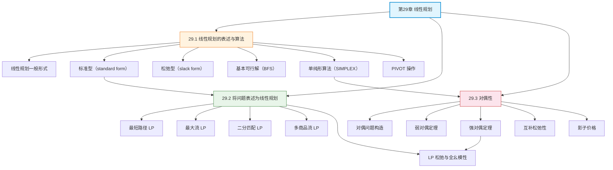

## 相关笔记

**本章节笔记：**
- [[29.1 线性规划的表述与算法]] — 标准型、松弛型、单纯形算法（PIVOT + SIMPLEX）
- [[29.2 将问题表述为线性规划]] — 最短路径、最大流、二分匹配、多商品流的 LP 建模
- [[29.3 对偶性]] — 弱/强对偶定理、互补松弛性、影子价格

**前置章节汇总：**
- [[第28章_矩阵运算-章节汇总]] — 矩阵运算（线性方程组求解是 LP 的数学基础）
- [[第24章_最大流-章节汇总]] — 最大流（LP 表述的经典应用）
- [[第22章_单源最短路径-章节汇总]] — 最短路径（LP 表述的经典应用）

**后续章节：**
- [[第30章_多项式与FFT-章节汇总]] — 第30章多项式与FFT（待学习）

---

> [!abstract] 概览
> 第29章系统介绍了==线性规划==（Linear Programming）的理论与方法。全章以==单纯形算法==为核心求解工具，从线性规划的基本表述出发，展示如何将经典组合优化问题建模为线性规划，最后通过对偶理论揭示线性规划的深层结构。
>
> 三节内容从理论到应用再到深层理论：(1) 29.1 节介绍线性规划的标准型与松弛型，以及==单纯形算法==（Simplex Algorithm）的完整流程——PIVOT 操作和 SIMPLEX 主循环，并分析其正确性与复杂度；(2) 29.2 节展示如何将最短路径、最大流、二分匹配、多商品流等问题表述为线性规划，引入==LP 松弛==（LP relaxation）和==全幺模性==（total unimodularity）的概念；(3) 29.3 节介绍==对偶性==理论——弱对偶定理、强对偶定理、互补松弛性条件，以及==影子价格==的经济解释。

---

## 知识结构总览

---

## 核心概念回顾

### 三节内容对比

| 维度 | 29.1 线性规划的表述与算法 | 29.2 将问题表述为线性规划 | 29.3 对偶性 |
|:---|:---|:---|:---|
| **核心问题** | 如何求解线性规划 | 如何将实际问题建模为 LP | LP 的深层理论结构 |
| **核心方法** | 单纯形算法 | LP 建模技巧 | 对偶理论 |
| **关键概念** | 标准型、松弛型、BFS | LP 松弛、全幺模性 | 弱/强对偶、互补松弛性 |
| **复杂度** | 最坏指数级，实际多项式 | 取决于具体问题 | — |
| **应用场景** | 通用 LP 求解 | 组合优化问题 | 算法分析、经济学 |

> [!note] 算法选型指南
> - **中小规模 LP**：单纯形法（实际效率高，商用求解器 CPLEX/Gurobi 的核心）
> - **大规模 LP**：内点法（理论多项式时间，适合大规模稀疏问题）
> - **整数约束问题**：先尝试 LP 松弛，若约束矩阵全幺模则自动得到整数解；否则使用分支定界/割平面法
> - **需要下界证明**：构造对偶问题，利用弱对偶定理提供下界
> - **灵敏度分析**：利用影子价格分析参数变化对最优解的影响

> [!def] 核心定理汇总
> 1. **基本定理**：若 LP 有最优解，则必存在一个基本可行解是最优解
> 2. **PIVOT 等价性**（Lemma 29.2）：PIVOT 操作保持松弛型的等价性
> 3. **基本解唯一性**（Lemma 29.3）：给定一组基本/非基本变量，基本解唯一
> 4. **目标值单调性**（Lemma 29.4）：SIMPLEX 每次迭代不减少目标值
> 5. **弱对偶定理**：对任意可行解 x 和 y，$c^T x \leq b^T y$
> 6. **强对偶定理**：若原问题有最优解，则对偶问题也有最优解，且最优值相等
> 7. **互补松弛性**：$x_j^* > 0 \Rightarrow$ 第 j 个对偶约束取等号

---

## 跨章关联

### 与第24章（最大流）的关系

- [[24.1 流网络]] 和 [[24.2 Ford-Fulkerson方法]] 中的最大流问题可以用 LP 表述
- 最大流 LP 的约束矩阵具有全幺模性，因此 LP 松弛自动给出整数最优解
- Ford-Fulkerson 方法是最大流 LP 的一种高效组合算法

### 与第22章（单源最短路径）的关系

- [[22.1 Bellman-Ford算法]] 和 [[22.3 Dijkstra算法]] 求解的最短路径问题可以用 LP 表述
- 最短路径 LP 的约束 $d_v \leq d_u + w(u,v)$ 本质上就是松弛操作
- 对偶问题揭示了最短路径的"势函数"结构

### 与第25章（二部图匹配）的关系

- [[25.1 最大二部图匹配]] 可以用 LP 表述，且 LP 松弛自动给出整数解
- 匈牙利算法可以视为对偶单纯形法的特化版本
- König-Egerváry 定理（最大匹配 = 最小顶点覆盖）是对偶性的直接推论

### 与第28章（矩阵运算）的关系

- 单纯形算法中的 PIVOT 操作本质上是高斯消元法的变体
- LP 的标准型 $Ax \leq b, x \geq 0$ 涉及矩阵运算
- 对偶问题的构造依赖矩阵转置

### 与第15章（贪心算法）的关系

- LP 松弛为贪心算法的正确性提供了理论框架
- 某些贪心算法的最优性可以通过对偶性证明

---

## 综合复习题

> [!faq]- Q1：给定一个线性规划问题，如何判断应该使用单纯形法还是内点法？两者的优缺点分别是什么？
>
> **解答：**
>
> **选择标准：**
> - **问题规模**：中小规模（变量和约束数 < 10,000）→ 单纯形法；大规模（> 10,000）→ 内点法
> - **是否需要灵敏度分析**：单纯形法天然提供基信息（影子价格），内点法需要额外计算
> - **是否需要一系列相关解**：参数规划/灵敏度分析 → 单纯形法（warm-start 能力强）
> - **理论保证**：内点法有严格的多项式时间保证，单纯形法最坏指数级
>
> **单纯形法优点**：实际效率高、提供基信息、warm-start 快、商用实现成熟
> **单纯形法缺点**：最坏情况指数级（Klee-Minty 反例）
>
> **内点法优点**：理论多项式时间、适合大规模稀疏问题
> **内点法缺点**：不提供基信息、warm-start 较难、每次迭代计算量大

> [!faq]- Q2：为什么最大流和最短路径问题的 LP 松弛自动给出整数最优解？这一性质对所有组合优化问题都成立吗？
>
> **解答：**
>
> **原因：全幺模性（Total Unimodularity）。**
>
> 最大流和最短路径问题的约束矩阵是全幺模的，即每个方阵子式的行列式为 0、+1 或 -1。全幺模性保证了：
> 1. LP 的每个基本可行解都是整数解
> 2. 因此 LP 松弛的最优解自动是整数规划的最优解
>
> **并非所有组合优化问题都满足全幺模性。** 反例：
> - 顶点覆盖问题（Vertex Cover）的 LP 松弛不一定给出整数解
> - 集合覆盖问题（Set Cover）的 LP 松弛存在整数间隙（integrality gap）
> - 旅行商问题（TSP）的 LP 松弛远非整数解
>
> 全幺模性的判定本身是多项式时间的，但构造全幺模矩阵需要问题特定的分析。

> [!faq]- Q3：利用对偶性证明：对于二分图的最大匹配问题，最大匹配数等于最小顶点覆盖数（König-Egerváry 定理）。
>
> **解答：**
>
> **证明思路（利用 LP 对偶性）：**
>
> 1. 二分匹配的 LP 表述：$\max \sum x_e$ subject to $\sum_{e \ni v} x_e \leq 1$（对所有 $v$），$x_e \geq 0$
>
> 2. 对偶问题：$\min \sum y_v$ subject to $y_u + y_v \geq 1$（对所有边 $(u,v)$），$y_v \geq 0$
>
> 3. 对偶问题的可行解对应==顶点覆盖==：$y_v \in \{0, 1\}$ 时，$y_v = 1$ 表示顶点 $v$ 在覆盖中
>
> 4. 由强对偶定理：$\max \sum x_e = \min \sum y_v$，即最大匹配 = 最小顶点覆盖
>
> 5. 由于约束矩阵全幺模，最优解自动是整数，因此对偶最优解中 $y_v \in \{0, 1\}$，确实对应一个顶点覆盖

---

## 常见误区

> [!warning] 误区1：单纯形法是多项式时间算法
> 单纯形法在最坏情况下是==指数级==的（Klee-Minty 立方体反例）。虽然实际中单纯形法通常非常高效（平均迭代次数为 $O(m)$ 到 $O(m+n)$），但它不是多项式时间算法。内点法（如 Karmarkar 算法）才是多项式时间的 LP 求解算法。

> [!warning] 误区2：LP 松弛的最优解四舍五入就是整数最优解
> 只有当约束矩阵具有全幺模性时，LP 松弛的最优解才是整数。对于一般问题，四舍五入 LP 解可能得到不可行解或远非最优的解。正确做法是使用整数规划求解器（分支定界/割平面法）。

> [!warning] 误区3：对偶问题总是有有限最优解
> 对偶问题可能有三种情况：(1) 有有限最优解（当原问题也有有限最优解时）；(2) 无界（当原问题不可行时）；(3) 不可行（当原问题无界时）。原问题和对偶问题的可行性/有界性存在对偶关系。

> [!warning] 误区4：线性规划只能处理线性目标函数和约束
> 这是线性规划的定义限制。对于非线性问题，需要使用二次规划、凸优化或一般非线性规划方法。但许多非线性问题可以通过线性化技巧近似为 LP。

---

## 学习要点总结

| 学习目标 | 掌握程度 | 对应笔记 |
|:---|:---:|:---|
| 理解线性规划的一般形式和标准型 | ★★★★★ | [[29.1 线性规划的表述与算法]] |
| 掌握松弛型的定义和基本可行解的概念 | ★★★★★ | [[29.1 线性规划的表述与算法]] |
| 掌握单纯形算法的执行流程（PIVOT + SIMPLEX） | ★★★★★ | [[29.1 线性规划的表述与算法]] |
| 理解单纯形法的正确性证明 | ★★★★☆ | [[29.1 线性规划的表述与算法]] |
| 了解 Klee-Minty 反例和内点法 | ★★★☆☆ | [[29.1 线性规划的表述与算法]] |
| 掌握最短路径/最大流/二分匹配的 LP 表述 | ★★★★★ | [[29.2 将问题表述为线性规划]] |
| 理解 LP 松弛和全幺模性 | ★★★★☆ | [[29.2 将问题表述为线性规划]] |
| 掌握对偶问题的构造规则 | ★★★★★ | [[29.3 对偶性]] |
| 掌握弱对偶定理和强对偶定理 | ★★★★★ | [[29.3 对偶性]] |
| 理解互补松弛性和影子价格 | ★★★★☆ | [[29.3 对偶性]] |
| 了解对偶性在算法分析中的应用 | ★★★☆☆ | [[29.3 对偶性]] |

---

## 参见Wiki

- [[离散数学/concepts/贪心算法]] — LP 松弛为贪心算法提供理论框架
- [[离散数学/concepts/动态规划]] — 某些 DP 问题可以用 LP 表述
- [[离散数学/concepts/最大流]] — 最大流的 LP 表述
- [[离散数学/concepts/二分匹配]] — 二分匹配的 LP 表述
- [[离散数学/concepts/矩阵乘法]] — 单纯形法中的矩阵运算

---

#学习/算法导论/第29章-线性规划 #学习/算法导论/线性规划/章节汇总
