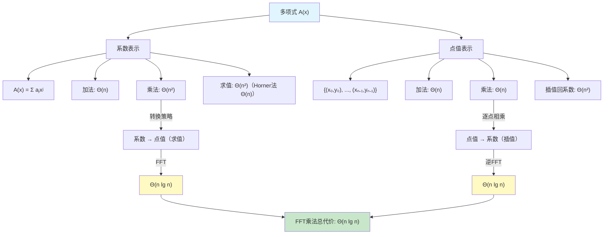

> [!abstract] 概览
> 本节介绍多项式的两种基本表示方法——**系数表示**（coefficient representation）与**点值表示**（point-value representation），并分析它们对多项式运算（尤其是乘法）效率的深刻影响。系数表示下多项式乘法需要 $\Theta(n^2)$ 时间，而通过"系数→点值→逐点相乘→插值→系数"的策略，借助 [[30.2 DFT与FFT|快速傅里叶变换（FFT）]] 可将乘法降至 $\Theta(n \lg n)$。本节是理解整个 FFT 算法体系的基石。

---

## 知识结构总览

---

## 核心思想

### 2.1 多项式的基本概念

**多项式**（polynomial）是代数学中最基本的对象之一。一个 degree-bound 为 $n$ 的多项式 $A(x)$ 可以写成如下形式：

$$
A(x) = \sum_{j=0}^{n-1} a_j x^j
$$

其中 $a_0, a_1, \ldots, a_{n-1}$ 是**系数**（coefficients），取自某个域（如实数域 $\mathbb{R}$ 或复数域 $\mathbb{C}$）。系数向量 $\mathbf{a} = (a_0, a_1, \ldots, a_{n-1})$ 完全确定了该多项式。

> [!def] degree-bound $n$
> 给定多项式 $A(x) = \sum_{j=0}^{n-1} a_j x^j$，我们称 $n$ 为该多项式的 **degree-bound**（度上界）。它表示系数下标的取值范围是 $\{0, 1, \ldots, n-1\}$，即多项式的**最高可能次数**为 $n - 1$。degree-bound 与多项式的**度**（degree，即最高非零系数对应的幂次）不同——当 $a_{n-1} = 0$ 时，度严格小于 degree-bound。

**degree-bound 与 degree 的区别**：
- **degree**（度）：多项式中最高次非零项的幂次。例如 $A(x) = 3x^2 + 1$ 的 degree 为 $2$。
- **degree-bound**（度上界）：系数向量的长度，即 $n$。即使 $a_{n-1} = 0$，degree-bound 仍然是 $n$。

degree-bound 的概念在后续 FFT 算法中至关重要，因为我们需要对多项式进行**零填充**（zero-padding），使两个 degree-bound 为 $n$ 的多项式乘积的 degree-bound 恰好为 $2n$。

### 2.2 系数表示

**系数表示**（coefficient representation）是最自然的表示方式：直接存储多项式的系数向量。

$$
A(x) = \sum_{j=0}^{n-1} a_j x^j \quad \longleftrightarrow \quad \mathbf{a} = (a_0, a_1, \ldots, a_{n-1})
$$

**系数表示下的运算复杂度**：

| 运算 | 复杂度 | 说明 |
|:---:|:---:|:---|
| 加法 $A(x) + B(x)$ | $\Theta(n)$ | 逐系数相加 |
| 乘法 $A(x) \cdot B(x)$ | $\Theta(n^2)$ | 每对系数交叉相乘 |
| 在一点求值 $A(x_0)$ | $\Theta(n)$（Horner 法则） | $A(x_0) = a_0 + x_0(a_1 + x_0(\cdots + x_0 \cdot a_{n-1}))$ |

**Horner 法则**（Horner's rule）是高效求值的经典方法。将多项式重写为嵌套形式：

$$
A(x) = a_0 + x(a_1 + x(a_2 + \cdots + x \cdot a_{n-1}))
$$

这样只需要 $n$ 次乘法和 $n$ 次加法，即 $\Theta(n)$ 时间。

**系数表示下乘法的瓶颈**：两个 degree-bound 为 $n$ 的多项式相乘，乘积的 degree-bound 为 $2n$。乘积的第 $k$ 个系数为：

$$
c_k = \sum_{j=0}^{k} a_j \cdot b_{k-j}
$$

这个公式正是**离散卷积**（discrete convolution）的定义。计算所有 $2n$ 个系数需要 $\Theta(n^2)$ 次乘法——当 $n$ 很大时（如密码学中 $n$ 可达数万），这个代价是不可接受的。

### 2.3 点值表示

**点值表示**（point-value representation）用 $n$ 个不同的点上的取值来表示一个 degree-bound 为 $n$ 的多项式：

$$
A(x) \quad \longleftrightarrow \quad \{(x_0, y_0), (x_1, y_1), \ldots, (x_{n-1}, y_{n-1})\}
$$

其中 $x_0, x_1, \ldots, x_{n-1}$ 是 $n$ 个**互不相同**的求值点（sample points），$y_k = A(x_k)$。

**点值表示下的运算复杂度**：

| 运算 | 复杂度 | 说明 |
|:---:|:---:|:---|
| 加法 $A(x) + B(x)$ | $\Theta(n)$ | 在相同点上逐点相加 $y_k + z_k$ |
| 乘法 $A(x) \cdot B(x)$ | $\Theta(n)$ | 在相同点上逐点相乘 $y_k \cdot z_k$ |
| 求值 | $O(1)$（已存储） | 直接读取对应 $y_k$ |

点值表示下乘法从 $\Theta(n^2)$ 降到了 $\Theta(n)$，这是巨大的效率提升。但问题在于：**如何将系数表示转换为点值表示（求值），以及如何将点值表示转换回系数表示（插值）？**

### 2.4 唯一性定理

> [!def] 定理 30.1（点值表示的唯一性）
> 对于任意 $n$ 个互不相同的点 $x_0, x_1, \ldots, x_{n-1}$ 和任意 $n$ 个值 $y_0, y_1, \ldots, y_{n-1}$，存在**唯一**一个 degree-bound 为 $n$ 的多项式 $A(x)$，使得对所有 $k = 0, 1, \ldots, n-1$，有 $A(x_k) = y_k$。

**证明**：

将条件 $A(x_k) = y_k$ 展开为线性方程组：

$$
\begin{pmatrix}
1 & x_0 & x_0^2 & \cdots & x_0^{n-1} \\
1 & x_1 & x_1^2 & \cdots & x_1^{n-1} \\
\vdots & \vdots & \vdots & \ddots & \vdots \\
1 & x_{n-1} & x_{n-1}^2 & \cdots & x_{n-1}^{n-1}
\end{pmatrix}
\begin{pmatrix} a_0 \\ a_1 \\ \vdots \\ a_{n-1} \end{pmatrix}
=
\begin{pmatrix} y_0 \\ y_1 \\ \vdots \\ y_{n-1} \end{pmatrix}
$$

即 $V \cdot \mathbf{a} = \mathbf{y}$，其中 $V$ 是**范德蒙德矩阵**（Vandermonde matrix）。

**【关键词（范德蒙德矩阵非奇异）】**：范德蒙德矩阵的行列式为：

$$
\det(V) = \prod_{0 \le j < k \le n-1} (x_k - x_j)
$$

由于所有 $x_k$ 互不相同，每个因子 $x_k - x_j \neq 0$，因此 $\det(V) \neq 0$。这意味着 $V$ 是**非奇异矩阵**（nonsingular matrix），方程组 $V \cdot \mathbf{a} = \mathbf{y}$ 有唯一解 $\mathbf{a} = V^{-1} \mathbf{y}$。

因此，$n$ 个点值对唯一确定一个 degree-bound 为 $n$ 的多项式。$\blacksquare$

这个定理保证了两种表示之间的等价性：**系数表示和点值表示包含完全相同的信息量**，只是信息的组织方式不同。

### 2.5 多项式乘法的转换策略

核心思想是利用两种表示各自的优势：

$$
\boxed{\text{系数表示} \xrightarrow{\text{求值}} \text{点值表示} \xrightarrow{\text{逐点相乘}} \text{乘积的点值} \xrightarrow{\text{插值}} \text{乘积的系数表示}}
$$

**具体步骤**：

1. **求值**（Evaluation）：将 $A(x)$ 和 $B(x)$ 从系数表示转换为点值表示
2. **逐点相乘**（Pointwise multiplication）：在相同的 $2n$ 个点上，$C(x_k) = A(x_k) \cdot B(x_k)$
3. **插值**（Interpolation）：将 $C(x)$ 的点值表示转换回系数表示

**复杂度分析**：

| 步骤 | 朴素方法 | FFT 加速 |
|:---:|:---:|:---:|
| 求值（$A$ 和 $B$） | $\Theta(n^2)$ | $\Theta(n \lg n)$ |
| 逐点相乘 | $\Theta(n)$ | $\Theta(n)$ |
| 插值（$C$） | $\Theta(n^2)$ | $\Theta(n \lg n)$ |
| **总计** | **$\Theta(n^2)$** | **$\Theta(n \lg n)$** |

FFT 的关键在于：选择**单位根**（roots of unity）作为求值点，利用其特殊的代数结构，通过 [[离散数学/concepts/分治法]] 将求值和插值过程从 $\Theta(n^2)$ 优化到 $\Theta(n \lg n)$。这正是 [[30.2 DFT与FFT]] 的核心内容。

### 2.6 拉格朗日插值公式

**拉格朗日插值**（Lagrange interpolation）给出了一种显式的插值公式，将点值表示转换回系数表示：

$$
A(x) = \sum_{k=0}^{n-1} y_k \cdot l_k(x)
$$

其中 $l_k(x)$ 是第 $k$ 个**拉格朗日基多项式**（Lagrange basis polynomial）：

$$
l_k(x) = \prod_{\substack{j=0 \\ j \ne k}}^{n-1} \frac{x - x_j}{x_k - x_j}
$$

**基多项式的关键性质**：

$$
l_k(x_i) = \begin{cases} 1 & \text{若 } i = k \\ 0 & \text{若 } i \ne k \end{cases}
$$

这保证了 $A(x_i) = \sum_{k=0}^{n-1} y_k \cdot l_k(x_i) = y_i$，即插值多项式确实通过所有给定的点。

**拉格朗日插值的复杂度**：直接计算需要 $\Theta(n^2)$ 时间（每个基多项式需要 $\Theta(n)$，共 $n$ 个基多项式），这与直接求解范德蒙德方程组的复杂度相同。要实现 $\Theta(n \lg n)$ 的插值，需要借助 FFT 和单位根的特殊性质。

### 2.7 具体数值示例

以 $A(x) = 7x^3 - x^2 + x - 10$ 与 $B(x) = 8x^3 - 6x + 3$ 的乘法为例，完整演示两种表示下的乘法过程。

**系数表示**：

$$
\mathbf{a} = (-10, 1, -1, 7), \quad \mathbf{b} = (3, -6, 0, 8)
$$

degree-bound $n = 4$，乘积的 degree-bound 为 $2n = 8$。通过卷积计算乘积系数：

$$
c_k = \sum_{j=0}^{k} a_j \cdot b_{k-j}
$$

逐步计算：

$$
\begin{aligned}
c_0 &= a_0 b_0 = (-10)(3) = -30 \\
c_1 &= a_0 b_1 + a_1 b_0 = (-10)(-6) + (1)(3) = 60 + 3 = 63 \\
c_2 &= a_0 b_2 + a_1 b_1 + a_2 b_0 = (-10)(0) + (1)(-6) + (-1)(3) = 0 - 6 - 3 = -9 \\
c_3 &= a_0 b_3 + a_1 b_2 + a_2 b_1 + a_3 b_0 = (-10)(8) + (1)(0) + (-1)(-6) + (7)(3) \\
    &= -80 + 0 + 6 + 21 = -53 \\
c_4 &= a_1 b_3 + a_2 b_2 + a_3 b_1 = (1)(8) + (-1)(0) + (7)(-6) = 8 + 0 - 42 = -34 \\
c_5 &= a_2 b_3 + a_3 b_2 = (-1)(8) + (7)(0) = -8 + 0 = -8 \\
c_6 &= a_3 b_3 = (7)(8) = 56 \\
c_7 &= 0
\end{aligned}
$$

因此：

$$
C(x) = A(x) \cdot B(x) = 56x^6 - 8x^5 - 34x^4 - 53x^3 - 9x^2 + 63x - 30
$$

**点值表示演示**（选取 4 个求值点）：

选取 $x_0 = 0, x_1 = 1, x_2 = -1, x_3 = 2$。

对 $A(x)$ 求值：

$$
\begin{aligned}
A(0)  &= 7(0)^3 - (0)^2 + 0 - 10 = -10 \\
A(1)  &= 7(1)^3 - (1)^2 + 1 - 10 = 7 - 1 + 1 - 10 = -3 \\
A(-1) &= 7(-1)^3 - (-1)^2 + (-1) - 10 = -7 - 1 - 1 - 10 = -19 \\
A(2)  &= 7(8) - 4 + 2 - 10 = 56 - 4 + 2 - 10 = 44
\end{aligned}
$$

对 $B(x)$ 求值：

$$
\begin{aligned}
B(0)  &= 8(0)^3 - 6(0) + 3 = 3 \\
B(1)  &= 8(1)^3 - 6(1) + 3 = 8 - 6 + 3 = 5 \\
B(-1) &= 8(-1)^3 - 6(-1) + 3 = -8 + 6 + 3 = 1 \\
B(2)  &= 8(8) - 6(2) + 3 = 64 - 12 + 3 = 55
\end{aligned}
$$

逐点相乘得到 $C(x)$ 的点值表示：

$$
\begin{aligned}
C(0)  &= A(0) \cdot B(0) = (-10)(3) = -30 \\
C(1)  &= A(1) \cdot B(1) = (-3)(5) = -15 \\
C(-1) &= A(-1) \cdot B(-1) = (-19)(1) = -19 \\
C(2)  &= A(2) \cdot B(2) = (44)(55) = 2420
\end{aligned}
$$

验证：将 $C(x) = 56x^6 - 8x^5 - 34x^4 - 53x^3 - 9x^2 + 63x - 30$ 代入各点：

$$
\begin{aligned}
C(0)  &= -30 \quad \checkmark \\
C(1)  &= 56 - 8 - 34 - 53 - 9 + 63 - 30 = -15 \quad \checkmark \\
C(-1) &= 56 + 8 - 34 + 53 - 9 - 63 - 30 = -19 \quad \checkmark \\
C(2)  &= 56(64) - 8(32) - 34(16) - 53(8) - 9(4) + 63(2) - 30 \\
      &= 3584 - 256 - 544 - 424 - 36 + 126 - 30 = 2420 \quad \checkmark
\end{aligned}
$$

所有点值一致，验证了乘法的正确性。注意：这里我们只用了 4 个点，但乘积 $C(x)$ 的 degree-bound 是 $8$，要唯一确定 $C(x)$ 需要 8 个点值对。在实际的 FFT 方案中，我们会选择 $2n = 8$ 个求值点（通常是 8 次单位根）。

---

## 补充理解

> [!info] 多项式在信号处理中的应用
> 多项式乘法与**数字信号处理**（Digital Signal Processing, DSP）有着深刻的联系。在信号处理中，一个离散信号可以表示为多项式的系数序列，而信号的**卷积**（convolution）恰好对应多项式乘法。
>
> 具体而言，有限长信号 $u = (u_0, u_1, \ldots, u_{M-1})$ 与滤波器 $v = (v_0, v_1, \ldots, v_{N-1})$ 的线性卷积定义为：
>
> $$(u * v)_k = \sum_{j} u_j \cdot v_{k-j}$$
>
> 这正是多项式 $U(x) = \sum u_j x^j$ 与 $V(x) = \sum v_j x^j$ 乘积的系数公式。FFT 在信号处理中的核心应用包括：
> - **频谱分析**：通过 DFT 将时域信号转换为频域表示，分析信号的频率成分
> - **快速滤波**：利用卷积定理 $\mathcal{F}(u * v) = \mathcal{F}(u) \cdot \mathcal{F}(v)$，将时域卷积转化为频域逐点相乘
> - **音频压缩**（MP3）、**图像压缩**（JPEG）、**音高识别**等均依赖 FFT 的高效计算
>
> 可以说，理解多项式乘法是理解现代数字信号处理的数学基础。

> [!info] 拉格朗日插值的数值稳定性
> 拉格朗日插值虽然形式优美，但在实际数值计算中存在严重的**稳定性问题**。
>
> **龙格现象**（Runge's phenomenon）：当使用**等距节点**（equally spaced nodes）对某些光滑函数进行高次多项式插值时，插值多项式在区间端点附近会出现剧烈的**振荡**（oscillation）。经典例子是对 $f(x) = \frac{1}{1 + 25x^2}$ 在 $[-1, 1]$ 上进行等距插值——随着次数 $n$ 增大，端点附近的误差反而趋于无穷。
>
> **解决方案**：
> - 使用**切比雪夫节点**（Chebyshev nodes）：$x_k = \cos\left(\frac{(2k+1)\pi}{2n}\right)$，这些节点在端点附近更密集，能有效抑制振荡
> - 采用**样条插值**（spline interpolation）：用分段低次多项式代替全局高次多项式
> - 使用**牛顿插值**（Newton interpolation）的差商形式，便于递推添加新节点
>
> 在算法导论的 FFT 语境中，我们使用的是**单位根**作为求值点，这些点均匀分布在复平面单位圆上，配合 FFT 的代数结构，不存在龙格现象的问题。

> [!info] 多项式乘法与大整数乘法的关系
> 多项式乘法算法可以直接应用于**大整数乘法**，这是计算数论和密码学中的核心问题。
>
> **基本思路**：将一个 $n$ 位十进制整数 $d = d_{n-1}d_{n-2}\cdots d_1 d_0$ 表示为以 $x = 10$（或 $x = 2^w$，其中 $w$ 为字长）为基底的多项式：
>
> $$D(x) = d_0 + d_1 x + d_2 x^2 + \cdots + d_{n-1} x^{n-1}$$
>
> 两个大整数的乘积就对应两个多项式在 $x = 10$ 处的求值之积。通过 FFT 加速多项式乘法，可以将大整数乘法从 $\Theta(n^2)$ 降至 $\Theta(n \lg n)$。
>
> **Schönhage-Strassen 算法**（1971）：利用数论变换（Number Theoretic Transform, NTT）在有限域上实现 FFT，避免了浮点精度问题，复杂度为 $O(n \log n \log \log n)$。该算法长期是实际最快的大整数乘法算法，被 GMP（GNU Multiple Precision Arithmetic Library）广泛采用。
>
> **后续进展**：2007 年 Fürer 算法达到 $O(n \log n \cdot 2^{O(\log^* n)})$；2019 年 Harvey 和 van der Hoeven 最终实现了 $O(n \log n)$ 的大整数乘法，证明了 Schönhage 和 Strassen 在 1971 年提出的猜想。

> [!info] 卷积定理（Convolution Theorem）
> **卷积定理**是连接多项式乘法与傅里叶变换的桥梁，也是 FFT 加速多项式乘法的理论基础。
>
> **定理（卷积定理）**：设 $\mathbf{a}$ 和 $\mathbf{b}$ 是长度为 $n$ 的向量，$\mathcal{F}$ 表示离散傅里叶变换（DFT），$\mathcal{F}^{-1}$ 表示逆 DFT，$\odot$ 表示逐点相乘（Hadamard 积），$\ast$ 表示循环卷积，则：
>
> $$\mathcal{F}(\mathbf{a} \ast \mathbf{b}) = \mathcal{F}(\mathbf{a}) \odot \mathcal{F}(\mathbf{b})$$
>
> 等价地：
>
> $$\mathbf{a} \ast \mathbf{b} = \mathcal{F}^{-1}\bigl(\mathcal{F}(\mathbf{a}) \odot \mathcal{F}(\mathbf{b})\bigr)$$
>
> **直观理解**：时域（或系数域）中的卷积运算，等价于频域（或点值域）中的逐点相乘。这正是本节"系数→点值→逐点相乘→插值→系数"策略的数学本质。
>
> **注意**：DFT 直接计算的是**循环卷积**（circular convolution），而多项式乘法对应的是**线性卷积**（linear convolution）。要使用 DFT 计算多项式乘法，需要先将两个多项式**零填充**（zero-pad）到长度 $2n$，使线性卷积等价于循环卷积。这一细节将在 [[30.2 DFT与FFT]] 中详细讨论。

---

## 易混淆点

> [!warning] degree 与 degree-bound 的区别
> - **degree**（度）：多项式中**最高次非零项**的幂次。例如 $A(x) = 3x^5 + 0x^4 + 2x^2 + 1$ 的 degree 为 $5$。
> - **degree-bound**（度上界）：系数向量的**长度** $n$，即系数下标的取值范围是 $\{0, 1, \ldots, n-1\}$。即使 $a_{n-1} = 0$，degree-bound 仍为 $n$。
>
> 在 CLRS 中统一使用 degree-bound $n$ 来描述多项式，这是因为算法的复杂度取决于系数向量的长度，而非实际度数。两个 degree-bound 为 $n$ 的多项式相乘，乘积的 degree-bound 为 $2n$（需要零填充），无论实际度数是多少。

> [!warning] 系数表示唯一 vs 点值表示不唯一
> - **系数表示是唯一的**：给定 degree-bound $n$，系数向量 $(a_0, a_1, \ldots, a_{n-1})$ 与多项式一一对应。
> - **点值表示取决于求值点的选取**：同一多项式在不同求值点集上产生不同的点值对。例如 $A(x) = x^2$ 在 $\{(0,0), (1,1), (2,4)\}$ 和 $\{(3,9), (5,25), (7,49)\}$ 上都是合法的点值表示，但它们看起来完全不同。
>
> 定理 30.1 保证的是：给定固定的 $n$ 个互不相同的求值点和 $n$ 个值，存在唯一的多项式通过这些点。但不同的求值点集对应不同的点值表示，它们表示的可能是同一个多项式。

> [!warning] 插值与曲线拟合的区别
> - **插值**（interpolation）：要求多项式**精确通过**所有给定的数据点。当数据点数为 $n$ 时，使用 degree-bound 为 $n$ 的多项式可以精确通过所有点（定理 30.1）。
> - **曲线拟合/回归**（curve fitting / regression）：当数据点很多或含有噪声时，不要求多项式精确通过每个点，而是寻找一个**低次多项式**最小化某种误差度量（如最小二乘法）。
>
> 在本节的语境中，我们只讨论插值问题。插值要求点数等于 degree-bound，而曲线拟合通常在点数远大于多项式度数时使用。

---

## 习题精选

### 习题 1：系数表示与点值表示的转换

给定多项式 $A(x) = 2x^2 + 3x + 1$，求其在 $x_0 = 0, x_1 = 1, x_2 = 2$ 处的点值表示。

> [!faq]- 解答
> 直接代入求值：
>
> $$
> \begin{aligned}
> A(0) &= 2(0)^2 + 3(0) + 1 = 1 \\
> A(1) &= 2(1)^2 + 3(1) + 1 = 2 + 3 + 1 = 6 \\
> A(2) &= 2(4) + 3(2) + 1 = 8 + 6 + 1 = 15
> \end{aligned}
> $$
>
> 点值表示为 $\{(0, 1), (1, 6), (2, 15)\}$。

### 习题 2：点值表示下的多项式乘法

已知 $A(x)$ 和 $B(x)$ 在 $x_0 = 1, x_1 = 2, x_2 = 3$ 处的点值表示分别为：

$$
A: \{(1, 3), (2, 7), (3, 13)\}, \quad B: \{(1, 2), (2, 5), (3, 10)\}
$$

求 $C(x) = A(x) \cdot B(x)$ 在相同点上的点值表示。

> [!faq]- 解答
> 逐点相乘：
>
> $$
> \begin{aligned}
> C(1) &= A(1) \cdot B(1) = 3 \times 2 = 6 \\
> C(2) &= A(2) \cdot B(2) = 7 \times 5 = 35 \\
> C(3) &= A(3) \cdot B(3) = 13 \times 10 = 130
> \end{aligned}
> $$
>
> $C(x)$ 的点值表示为 $\{(1, 6), (2, 35), (3, 130)\}$。
>
> 注意：$C(x)$ 的 degree-bound 为 $4$（两个 degree-bound 为 $3$ 的多项式之积），但这里只有 $3$ 个点值对，不足以唯一确定 $C(x)$。要完整恢复 $C(x)$ 的系数表示，需要 $4$ 个点值对。

### 习题 3：拉格朗日插值

利用拉格朗日插值公式，从点值表示 $\{(0, 1), (1, 3), (2, 7)\}$ 恢复多项式 $A(x)$ 的系数表示。

> [!faq]- 解答
> 使用拉格朗日插值公式 $A(x) = \sum_{k=0}^{2} y_k \cdot l_k(x)$。
>
> 计算各基多项式：
>
> $$
> \begin{aligned}
> l_0(x) &= \frac{(x - x_1)(x - x_2)}{(x_0 - x_1)(x_0 - x_2)} = \frac{(x - 1)(x - 2)}{(0 - 1)(0 - 2)} = \frac{(x-1)(x-2)}{2} \\
> l_1(x) &= \frac{(x - x_0)(x - x_2)}{(x_1 - x_0)(x_1 - x_2)} = \frac{(x - 0)(x - 2)}{(1 - 0)(1 - 2)} = \frac{x(x-2)}{-1} = -x(x-2) \\
> l_2(x) &= \frac{(x - x_0)(x - x_1)}{(x_2 - x_0)(x_2 - x_1)} = \frac{(x - 0)(x - 1)}{(2 - 0)(2 - 1)} = \frac{x(x-1)}{2}
> \end{aligned}
> $$
>
> 因此：
>
> $$
> \begin{aligned}
> A(x) &= 1 \cdot \frac{(x-1)(x-2)}{2} + 3 \cdot (-x(x-2)) + 7 \cdot \frac{x(x-1)}{2} \\
>       &= \frac{x^2 - 3x + 2}{2} - 3x^2 + 6x + \frac{7x^2 - 7x}{2} \\
>       &= \frac{x^2 - 3x + 2 - 6x^2 + 12x + 7x^2 - 7x}{2} \\
>       &= \frac{2x^2 + 2x + 2}{2} \\
>       &= x^2 + x + 1
> \end{aligned}
> $$
>
> 验证：$A(0) = 1$，$A(1) = 1 + 1 + 1 = 3$，$A(2) = 4 + 2 + 1 = 7$。$\checkmark$

### 习题 4：范德蒙德矩阵与唯一性

给定求值点 $x_0 = -1, x_1 = 0, x_2 = 1$，写出范德蒙德矩阵 $V$，计算 $\det(V)$，并说明为什么这保证了点值表示的唯一性。

> [!faq]- 解答
> 范德蒙德矩阵为：
>
> $$
> V = \begin{pmatrix} 1 & x_0 & x_0^2 \\ 1 & x_1 & x_1^2 \\ 1 & x_2 & x_2^2 \end{pmatrix} = \begin{pmatrix} 1 & -1 & 1 \\ 1 & 0 & 0 \\ 1 & 1 & 1 \end{pmatrix}
> $$
>
> 行列式为：
>
> $$
> \det(V) = (x_1 - x_0)(x_2 - x_0)(x_2 - x_1) = (0 - (-1))(1 - (-1))(1 - 0) = 1 \times 2 \times 1 = 2 \ne 0
> $$
>
> 由于 $\det(V) \ne 0$，矩阵 $V$ 非奇异，方程组 $V\mathbf{a} = \mathbf{y}$ 对任意 $\mathbf{y}$ 都有唯一解。这意味着任意给定 $3$ 个值 $y_0, y_1, y_2$，都存在唯一的 degree-bound 为 $3$ 的多项式通过 $(-1, y_0), (0, y_1), (1, y_2)$。

---

## 视频学习指南

| 资源 | 链接 | 说明 |
|:---|:---|:---|
| MIT 6.046J Lecture 9 | [YouTube](https://www.youtube.com/watch?v=iRnBrk5tjLg) | Erik Demaine 讲解多项式乘法与 FFT |
| 3Blue1Brown: But what is the Fourier Transform? | [YouTube](https://www.youtube.com/watch?v=spUNpyF58BY) | 傅里叶变换的直觉理解 |
| reducible: FFT | [YouTube](https://www.youtube.com/watch?v=h7apO7q16V0) | FFT 的可视化讲解，从多项式乘法动机出发 |
| Andrej Karpathy: Neural Networks: Zero to Hero | [YouTube](https://www.youtube.com/watch?v=VMj-3S1tku0) | 从信号处理角度理解 FFT |

---

## 教材原文

> [!quote] CLRS 第4版 30.1节
> A polynomial $A(x)$ of degree-bound $n$ is a function of the form
>
> $$A(x) = \sum_{j=0}^{n-1} a_j x^j$$
>
> We call the values $a_0, a_1, \ldots, a_{n-1}$ the **coefficients** of the polynomial. A polynomial is **represented** by its coefficients.
>
> ...
>
> The **point-value representation** of a polynomial $A(x)$ of degree-bound $n$ is a set of $n$ point-value pairs
>
> $$\{(x_0, y_0), (x_1, y_1), \ldots, (x_{n-1}, y_{n-1})\}$$
>
> such that for $k = 0, 1, \ldots, n-1$, we have $y_k = A(x_k)$.
>
> ...
>
> The product $C(x)$ of two polynomials $A(x)$ and $B(x)$ of degree-bound $n$ is a polynomial $C(x)$ of degree-bound $2n$ such that $C(x) = A(x) \cdot B(x)$ for all $x$.

---

## 参见Wiki

- **前置知识**：[[第04章_分治策略/4.1 矩阵乘法]]（多项式乘法与卷积的矩阵视角）、[[第29章_线性规划-章节汇总]]（前一章内容）
- **同章笔记**：[[第30章_多项式与FFT/30.2 DFT与FFT]]、[[第30章_多项式与FFT/30.3 高效FFT实现]]
- **章节汇总**：[[第30章_多项式与FFT-章节汇总]]
- **关联概念**：[[离散数学/concepts/分治法]]、[[离散数学/concepts/主定理]]

---

#学习/算法导论/第30章-多项式与FFT #学习/算法导论/多项式与FFT/多项式表示
