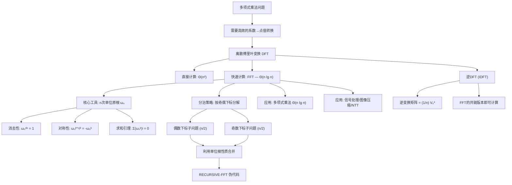

# 30.2 DFT与FFT

> [!abstract] 概览
> 本节是第30章的核心，介绍**离散傅里叶变换（Discrete Fourier Transform, DFT）**的定义及其**快速计算算法——快速傅里叶变换（Fast Fourier Transform, FFT）**。DFT将多项式从[[30.1 多项式的表示|系数表示]]转换为[[30.1 多项式的表示|点值表示]]，直接计算需要 $\Theta(n^2)$ 时间。FFT利用**单位根（root of unity）**的特殊代数性质，采用[[离散数学/concepts/分治法]]策略将问题分解为两个规模减半的子问题，将时间复杂度降至 $\Theta(n \lg n)$。本节还介绍逆DFT（IDFT），完成系数表示与点值表示之间的双向转换，为[[30.3 高效FFT实现|30.3节的高效FFT实现]]奠定理论基础。

---

## 知识结构总览



---

## 核心思想

### 2.1 DFT的定义

在[[30.1 多项式的表示|30.1节]]中，我们已经知道多项式有两种等价表示：**系数表示**和**点值表示**。为了高效地执行多项式乘法，我们需要一种快速的方法将多项式从系数表示转换为点值表示。

**离散傅里叶变换（DFT）**正是完成这一转换的标准方法。给定一个 $n-1$ 次多项式（假设 $n$ 为2的幂）：

$$A(x) = \sum_{j=0}^{n-1} a_j x^j$$

其DFT定义为在 $n$ 个特殊的求值点——$n$ 次单位根——上对 $A(x)$ 求值，得到输出向量 $\mathbf{y} = (y_0, y_1, \ldots, y_{n-1})$，其中：

$$y_k = A(\omega_n^k) = \sum_{j=0}^{n-1} a_j \omega_n^{jk}, \quad k = 0, 1, \ldots, n-1$$

这里 $\omega_n$ 是**$n$ 次单位原根**（principal $n$th root of unity），其定义如下：

> [!def] n次单位原根（principal nth root of unity）
> 满足 $\omega_n^n = 1$ 的复数 $\omega_n$ 称为 $n$ 次**单位根**（root of unity）。其中
> $$\omega_n = e^{2\pi i / n}$$
> 称为 $n$ 次**单位原根**。由它生成的 $n$ 个幂次 $\omega_n^0, \omega_n^1, \ldots, \omega_n^{n-1}$ 恰好是方程 $x^n = 1$ 的全部 $n$ 个不同复数根，它们在复平面上**均匀分布在单位圆上**。

**几何直观**：$\omega_n = e^{2\pi i / n} = \cos(2\pi/n) + i\sin(2\pi/n)$。在复平面上，$\omega_n$ 对应单位圆上从正实轴开始逆时针旋转 $2\pi/n$ 弧度的点。$\omega_n^0, \omega_n^1, \ldots, \omega_n^{n-1}$ 这 $n$ 个点将单位圆 $n$ 等分。例如，$n=4$ 时，$\omega_4 = i$，四个单位根分别为 $1, i, -1, -i$，对应复平面上的上、右、下、左四个方向。

**直接计算DFT的代价**：对每个 $y_k$ 需要执行 $n$ 次乘法和加法，共 $n$ 个输出，总计 $\Theta(n^2)$ 次运算。FFT的核心贡献在于将这一代价降低到 $\Theta(n \lg n)$。

---

### 2.2 单位根的三个关键性质

FFT算法的魔力完全依赖于单位根的三个代数性质。下面逐一给出完整证明。

#### 性质一：消去性（Cancellation Lemma）

> [!def] 引理 30.3（消去性）
> 对任意整数 $n \geq 1$、$d \geq 0$ 和 $k \geq 0$，有
> $$\omega_{dn}^{dk} = \omega_n^k$$

**证明**：

由单位原根的定义出发：

$$\omega_{dn}^{dk} = \left(e^{2\pi i / (dn)}\right)^{dk} = e^{2\pi i \cdot dk / (dn)} = e^{2\pi i \cdot k / n} = \omega_n^k$$

每一步推导：
1. 将 $\omega_{dn}$ 展开为指数形式 $e^{2\pi i/(dn)}$
2. 对其取 $dk$ 次幂，指数相乘得 $2\pi i \cdot dk/(dn)$
3. 分子分母约去 $d$，得到 $e^{2\pi i \cdot k/n}$
4. 由定义，这正是 $\omega_n^k$

**【关键词：指数约分】**——消去性的本质是指数中 $d$ 的约分，使得 $\omega_{dn}$ 的 $dk$ 次幂恰好等于 $\omega_n$ 的 $k$ 次幂。这一性质确保了当我们将DFT问题规模从 $n$ 缩小到 $n/2$ 时，子问题中使用的单位根 $\omega_{n/2}$ 与原问题中 $\omega_n$ 的偶数次幂完全一致。

**直观理解**：$\omega_{dn}$ 将单位圆分成 $dn$ 等份，取其第 $d$ 个、第 $2d$ 个、第 $3d$ 个……点，恰好等同于将单位圆分成 $n$ 等份后取第 $1$ 个、第 $2$ 个、第 $3$ 个……点。

---

#### 性质二：对称性（Halving Lemma）

> [!def] 引理 30.4（对称性）
> 对任意偶数 $n \geq 1$ 和整数 $k \geq 0$，有
> $$\omega_n^{k + n/2} = -\omega_n^k$$

**证明**：

$$\omega_n^{k + n/2} = \omega_n^k \cdot \omega_n^{n/2}$$

现在计算 $\omega_n^{n/2}$：

$$\omega_n^{n/2} = \left(e^{2\pi i / n}\right)^{n/2} = e^{2\pi i \cdot (n/2) / n} = e^{\pi i} = \cos\pi + i\sin\pi = -1$$

因此：

$$\omega_n^{k + n/2} = \omega_n^k \cdot (-1) = -\omega_n^k \quad \blacksquare$$

**【关键词：半圆取反】**——$\omega_n^{n/2}$ 对应复平面上单位圆上旋转半圈的位置，即 $-1$。因此，在单位根序列中，位置相差 $n/2$ 的两个根互为相反数。

**直观理解**：在单位圆上，$\omega_n^k$ 和 $\omega_n^{k+n/2}$ 位于直径的两端，它们关于原点对称，所以互为相反数。例如 $n=8$ 时，$\omega_8^0 = 1$ 与 $\omega_8^4 = -1$ 互为相反数，$\omega_8^1$ 与 $\omega_8^5$ 互为相反数。

**这一性质对FFT至关重要**：它意味着我们只需要计算前 $n/2$ 个DFT值，后 $n/2$ 个可以通过取反直接得到，从而将计算量减半。

---

#### 性质三：求和引理（Summation Lemma）

> [!def] 引理 30.5（求和引理）
> 对任意整数 $n \geq 1$ 和不能被 $n$ 整除的整数 $k$，有
> $$\sum_{j=0}^{n-1} (\omega_n^k)^j = 0$$

**证明**：

当 $k \not\equiv 0 \pmod{n}$ 时，$\omega_n^k \neq 1$（因为 $\omega_n$ 是 $n$ 次原根，其 $k$ 次幂等于1当且仅当 $n \mid k$）。利用**等比数列求和公式**：

$$\sum_{j=0}^{n-1} (\omega_n^k)^j = \frac{(\omega_n^k)^n - 1}{\omega_n^k - 1}$$

计算分子：

$$(\omega_n^k)^n = (\omega_n^n)^k = 1^k = 1$$

因此分子为 $1 - 1 = 0$。又因为 $k \not\equiv 0 \pmod{n}$，分母 $\omega_n^k - 1 \neq 0$。所以：

$$\sum_{j=0}^{n-1} (\omega_n^k)^j = \frac{0}{\omega_n^k - 1} = 0 \quad \blacksquare$$

**【关键词：等比数列求和 + 原根条件】**——求和引理的本质是：$n$ 个不同的 $n$ 次单位根之和为零。几何上，这 $n$ 个向量在复平面上均匀分布，它们的**向量和为零**（对称性使得所有分量相互抵消）。

**当 $k \equiv 0 \pmod{n}$ 时**，$\omega_n^k = 1$，此时求和结果为 $\sum_{j=0}^{n-1} 1 = n$。这一特殊情况在证明逆DFT时将发挥关键作用。

---

### 2.3 DFT的矩阵表示

DFT可以用矩阵乘法来表示。定义 **DFT矩阵（也叫范德蒙德矩阵）** $V_n$ 为：

$$(V_n)_{jk} = \omega_n^{jk}, \quad j, k = 0, 1, \ldots, n-1$$

即：

$$V_n = \begin{pmatrix} 1 & 1 & 1 & \cdots & 1 \\ 1 & \omega_n & \omega_n^2 & \cdots & \omega_n^{n-1} \\ 1 & \omega_n^2 & \omega_n^4 & \cdots & \omega_n^{2(n-1)} \\ \vdots & \vdots & \vdots & \ddots & \vdots \\ 1 & \omega_n^{n-1} & \omega_n^{2(n-1)} & \cdots & \omega_n^{(n-1)^2} \end{pmatrix}$$

则DFT可以写为：

$$\mathbf{y} = V_n \mathbf{a}$$

其中 $\mathbf{a} = (a_0, a_1, \ldots, a_{n-1})^T$ 是系数向量，$\mathbf{y} = (y_0, y_1, \ldots, y_{n-1})^T$ 是输出向量。

**矩阵视角的代价**：直接计算矩阵-向量乘积 $V_n \mathbf{a}$ 需要 $O(n^2)$ 次运算。FFT的实质就是利用 $V_n$ 的特殊结构（单位根的性质），找到一种 $\Theta(n \lg n)$ 的方法来计算这个矩阵-向量乘积。

**范德蒙德矩阵**：$V_n$ 的第 $k$ 列是 $(1, \omega_n^k, \omega_n^{2k}, \ldots, \omega_n^{(n-1)k})^T$，这正是多项式 $x^k$ 在 $\omega_n^0, \omega_n^1, \ldots, \omega_n^{n-1}$ 处的求值结果。因此 $V_n$ 是一个以 $\omega_n^0, \omega_n^1, \ldots, \omega_n^{n-1}$ 为基底的范德蒙德矩阵。

---

### 2.4 FFT算法

#### 2.4.1 分治思想

FFT的核心洞察是：**利用单位根的性质，将DFT分解为两个规模减半的子DFT**。

给定多项式 $A(x) = \sum_{j=0}^{n-1} a_j x^j$（$n$ 为2的幂），按奇偶下标将其分解为两个子多项式：

$$A(x) = A^{[0]}(x^2) + x \cdot A^{[1]}(x^2)$$

其中：
- $A^{[0]}(x) = a_0 + a_2 x + a_4 x^2 + \cdots + a_{n-2} x^{n/2-1}$（偶数下标系数）
- $A^{[1]}(x) = a_1 + a_3 x + a_5 x^2 + \cdots + a_{n-1} x^{n/2-1}$（奇数下标系数）

**为什么这样分解有效？** 因为当我们在 $\omega_n^k$ 处求值时：

$$A(\omega_n^k) = A^{[0]}((\omega_n^k)^2) + \omega_n^k \cdot A^{[1]}((\omega_n^k)^2) = A^{[0]}(\omega_n^{2k}) + \omega_n^k \cdot A^{[1]}(\omega_n^{2k})$$

关键观察：$(\omega_n^k)^2 = \omega_n^{2k} = \omega_{n/2}^k$（由消去性引理，取 $d=2$）。

这意味着 $A^{[0]}$ 和 $A^{[1]}$ 只需要在 $\omega_{n/2}^0, \omega_{n/2}^1, \ldots, \omega_{n/2}^{n/2-1}$ 这 $n/2$ 个点上求值——这正是两个规模为 $n/2$ 的DFT！

进一步利用**对称性**，对于 $k = 0, 1, \ldots, n/2 - 1$：

$$y_k = A(\omega_n^k) = A^{[0]}(\omega_{n/2}^k) + \omega_n^k \cdot A^{[1]}(\omega_{n/2}^k)$$

$$y_{k+n/2} = A(\omega_n^{k+n/2}) = A^{[0]}(\omega_{n/2}^k) - \omega_n^k \cdot A^{[1]}(\omega_{n/2}^k)$$

第二个等式利用了对称性 $\omega_n^{k+n/2} = -\omega_n^k$ 以及 $(\omega_n^{k+n/2})^2 = \omega_n^{2k+n} = \omega_n^{2k} = \omega_{n/2}^k$。

> [!tip] FFT执行流程
> 以下流程图展示了FFT递归计算的核心步骤（不涉及具体数学公式）：
>
> ```mermaid
> flowchart TD
>     START["输入: 系数向量 a₀, a₁, ..., aₙ₋₁ (n为2的幂)"]
>     SPLIT["按奇偶下标拆分"]
>     SPLIT --> EVEN["偶数下标: a₀, a₂, ..., aₙ₋₂"]
>     SPLIT --> ODD["奇数下标: a₁, a₃, ..., aₙ₋₁"]
>
>     EVEN --> RECUR_E["递归计算 FFT (偶数部分)"]
>     ODD --> RECUR_O["递归计算 FFT (奇数部分)"]
>
>     RECUR_E --> RESULT_E["得到 y₀⁽ᵉ⁾, y₁⁽ᵉ⁾, ..., yₙ/₂₋₁⁽ᵉ⁾"]
>     RECUR_O --> RESULT_O["得到 y₀⁽ᵒ⁾, y₁⁽ᵒ⁾, ..., yₙ/₂₋₁⁽ᵒ⁾"]
>
>     RESULT_E --> MERGE["合并: 利用蝶形运算"]
>     RESULT_O --> MERGE
>
>     MERGE --> LOOP{"对 k = 0 到 n/2-1"}
>     LOOP --> TOP["yₖ = yₖ⁽ᵉ⁾ + ωₙᵏ · yₖ⁽ᵒ⁾"]
>     LOOP --> BOT["yₖ₊ₙ/₂ = yₖ⁽ᵉ⁾ - ωₙᵏ · yₖ⁽ᵒ⁾"]
>     TOP --> OUTPUT["输出: y₀, y₁, ..., yₙ₋₁"]
>     BOT --> OUTPUT
>
>     BASE["基线情形: n=1 时直接返回 a₀"] --> OUTPUT
> ```

#### 2.4.2 RECURSIVE-FFT 伪代码

```
RECURSIVE-FFT(a)
1  n ← length[a]              // n 必须是 2 的幂
2  if n = 1 then
3      return a               // 基线情形：0次多项式，DFT就是自身
4  ωₙ ← e^(2πi/n)            // n次单位原根
5  ω ← 1                     // 当前单位根的幂次，初始为 ωₙ⁰ = 1
6  a⁽⁰⁾ ← [a₀, a₂, a₄, ..., aₙ₋₂]    // 偶数下标系数
7  a⁽¹⁾ ← [a₁, a₃, a₅, ..., aₙ₋₁]    // 奇数下标系数
8  y⁽⁰⁾ ← RECURSIVE-FFT(a⁽⁰⁾)        // 递归求解偶数部分
9  y⁽¹⁾ ← RECURSIVE-FFT(a⁽¹⁾)        // 递归求解奇数部分
10 for k ← 0 to n/2 - 1 do
11     yₖ        ← yₖ⁽⁰⁾ + ω · yₖ⁽¹⁾       // 蝶形运算上半
12     yₖ₊ₙ/₂    ← yₖ⁽⁰⁾ - ω · yₖ⁽¹⁾       // 蝶形运算下半
13     ω         ← ω · ωₙ                    // 更新单位根幂次
14 return y
```

**逐行解读**：

- **第1-3行**：基线情形。当 $n=1$ 时，多项式是常数 $a_0$，在任何点的值都是 $a_0$，DFT结果就是 $[a_0]$。
- **第4-5行**：初始化 $n$ 次单位原根 $\omega_n$ 和当前幂次 $\omega = \omega_n^0 = 1$。
- **第6-7行**：按奇偶下标将系数分为两个子向量，每个长度为 $n/2$。这一步需要 $\Theta(n)$ 时间。
- **第8-9行**：递归地对两个子向量分别执行FFT，各得到 $n/2$ 个输出值。这一步对应两个规模为 $n/2$ 的子问题。
- **第10-13行**：合并阶段。对每个 $k = 0, 1, \ldots, n/2-1$，利用蝶形运算（butterfly operation）将两个子问题的结果合并为完整的DFT输出。每次迭代执行2次复数乘法和2次复数加法，共 $\Theta(n)$ 时间。
- **第14行**：返回完整的DFT结果向量。

#### 2.4.3 正确性证明

**定理**：`RECURSIVE-FFT` 正确地计算了输入向量 $\mathbf{a}$ 的DFT。

**证明（归纳法）**：

对 $n = 2^m$（$m \geq 0$）进行数学归纳。

**基线情形**（$n = 1$）：多项式 $A(x) = a_0$，DFT只有一个值 $y_0 = A(\omega_1^0) = A(1) = a_0$。算法第2-3行直接返回 $[a_0]$，正确。

**归纳步骤**：假设算法对长度为 $n/2$ 的输入正确。考虑长度为 $n$ 的输入 $\mathbf{a}$。

由归纳假设，第8行得到的 $y^{[0]}$ 满足：

$$y_k^{[0]} = A^{[0]}(\omega_{n/2}^k), \quad k = 0, 1, \ldots, n/2 - 1$$

第9行得到的 $y^{[1]}$ 满足：

$$y_k^{[1]} = A^{[1]}(\omega_{n/2}^k), \quad k = 0, 1, \ldots, n/2 - 1$$

**【关键词（奇偶分解+单位根性质）】**——对于 $k = 0, 1, \ldots, n/2 - 1$，算法第11行计算：

$$y_k = y_k^{[0]} + \omega_n^k \cdot y_k^{[1]} = A^{[0]}(\omega_{n/2}^k) + \omega_n^k \cdot A^{[1]}(\omega_{n/2}^k)$$

由消去性（引理30.3），$\omega_{n/2}^k = \omega_n^{2k}$，因此：

$$y_k = A^{[0]}(\omega_n^{2k}) + \omega_n^k \cdot A^{[1]}(\omega_n^{2k}) = A(\omega_n^k)$$

这正是DFT的定义。

对于 $y_{k+n/2}$（第12行），算法计算：

$$y_{k+n/2} = y_k^{[0]} - \omega_n^k \cdot y_k^{[1]} = A^{[0]}(\omega_{n/2}^k) - \omega_n^k \cdot A^{[1]}(\omega_{n/2}^k)$$

利用对称性（引理30.4），$\omega_n^{k+n/2} = -\omega_n^k$，以及 $(\omega_n^{k+n/2})^2 = \omega_n^{2k+n} = \omega_n^{2k} \cdot \omega_n^n = \omega_n^{2k} = \omega_{n/2}^k$，因此：

$$y_{k+n/2} = A^{[0]}(\omega_{n/2}^k) + \omega_n^{k+n/2} \cdot A^{[1]}(\omega_{n/2}^k) = A(\omega_n^{k+n/2})$$

这也正是DFT的定义。因此对所有 $k = 0, 1, \ldots, n-1$，$y_k = A(\omega_n^k)$，算法正确。 $\blacksquare$

---

#### 2.4.4 复杂度分析

FFT的运行时间由以下[[离散数学/concepts/递归关系式]]刻画：

$$T(n) = \begin{cases} \Theta(1) & \text{若 } n = 1 \\ 2T(n/2) + \Theta(n) & \text{若 } n = 2^m, \, m \geq 1 \end{cases}$$

**分析**：
- **两个子问题**：第8-9行分别对长度为 $n/2$ 的向量递归调用FFT，贡献 $2T(n/2)$。
- **合并代价**：第6-7行的奇偶拆分和第10-13行的蝶形合并各需要 $\Theta(n)$ 时间，合计 $\Theta(n)$。
- **基线情形**：$n=1$ 时只需常数时间。

应用[[离散数学/concepts/主定理]]（Master Theorem），$a = 2$，$b = 2$，$f(n) = \Theta(n)$。计算 $n^{\log_b a} = n^{\log_2 2} = n$。由于 $f(n) = \Theta(n) = \Theta(n^{\log_b a})$，属于主定理的情形2，因此：

$$T(n) = \Theta(n \lg n)$$

**与直接计算的对比**：

| 方法 | 时间复杂度 | $n = 1024$ 时的运算量 |
|------|-----------|---------------------|
| 直接计算DFT | $\Theta(n^2)$ | $\approx 10^6$ |
| FFT | $\Theta(n \lg n)$ | $\approx 10^4$ |

当 $n = 2^{20} \approx 10^6$ 时，FFT比直接计算快约 $50000$ 倍。这一巨大的加速使得FFT成为20世纪最重要的算法之一。

---

### 2.5 逆DFT（IDFT）

DFT将系数表示转换为点值表示，而**逆DFT（Inverse DFT, IDFT）**完成反向转换：从点值表示恢复系数表示。

**IDFT公式**：

$$a_j = \frac{1}{n} \sum_{k=0}^{n-1} y_k \omega_n^{-jk}, \quad j = 0, 1, \ldots, n-1$$

**证明**：

将 $y_k = \sum_{l=0}^{n-1} a_l \omega_n^{lk}$ 代入IDFT公式：

$$\frac{1}{n} \sum_{k=0}^{n-1} y_k \omega_n^{-jk} = \frac{1}{n} \sum_{k=0}^{n-1} \left(\sum_{l=0}^{n-1} a_l \omega_n^{lk}\right) \omega_n^{-jk} = \frac{1}{n} \sum_{l=0}^{n-1} a_l \sum_{k=0}^{n-1} \omega_n^{(l-j)k}$$

由求和引理（引理30.5）：
- 当 $l \neq j$ 时，$l - j \not\equiv 0 \pmod{n}$，故 $\sum_{k=0}^{n-1} \omega_n^{(l-j)k} = 0$
- 当 $l = j$ 时，$\sum_{k=0}^{n-1} \omega_n^{0} = \sum_{k=0}^{n-1} 1 = n$

因此内层求和只有 $l = j$ 的项非零，结果为 $n$，所以：

$$\frac{1}{n} \sum_{l=0}^{n-1} a_l \cdot n \cdot [l = j] = a_j \quad \blacksquare$$

**【关键词：求和引理的正交性】**——IDFT的证明核心在于求和引理提供的"正交性"：不同频率的单位根序列内积为零，只有同频率时内积为 $n$。这与线性代数中正交矩阵的性质完全一致。

---

### 2.6 DFT与IDFT的关系

从矩阵视角看，DFT为 $\mathbf{y} = V_n \mathbf{a}$，IDFT为 $\mathbf{a} = V_n^{-1} \mathbf{y}$。

**逆变换矩阵**：

$$V_n^{-1} = \frac{1}{n} V_n^*$$

其中 $V_n^*$ 是 $V_n$ 的**共轭转置**（conjugate transpose，也叫Hermitian转置），即 $(V_n^*)_{jk} = \overline{(V_n)_{kj}} = \overline{\omega_n^{kj}} = \omega_n^{-kj}$。

验证：$(V_n^* V_n)_{jl} = \sum_{k=0}^{n-1} \omega_n^{-kj} \omega_n^{kl} = \sum_{k=0}^{n-1} \omega_n^{(l-j)k}$

- 当 $j = l$ 时，和为 $n$
- 当 $j \neq l$ 时，由求和引理，和为 $0$

因此 $V_n^* V_n = nI$，即 $V_n^{-1} = \frac{1}{n} V_n^*$。 $\blacksquare$

**实用意义**：IDFT的计算与DFT几乎相同——只需将输入向量取共轭，执行FFT，再将结果取共轭后除以 $n$。这意味着我们只需要实现一个FFT程序，就能同时完成正向和逆向变换。

---

### 2.7 具体数值示例：4点DFT

下面用向量 $\mathbf{a} = (1, 2, 3, 4)$ 完整演示4点DFT的计算过程。

**步骤1：确定单位根**

$n = 4$，$\omega_4 = e^{2\pi i / 4} = e^{\pi i / 2} = \cos(\pi/2) + i\sin(\pi/2) = i$

四个单位根：$\omega_4^0 = 1$，$\omega_4^1 = i$，$\omega_4^2 = -1$，$\omega_4^3 = -i$

**步骤2：直接计算DFT**

$$y_0 = 1 \cdot 1 + 2 \cdot 1 + 3 \cdot 1 + 4 \cdot 1 = 10$$

$$y_1 = 1 \cdot 1 + 2 \cdot i + 3 \cdot (-1) + 4 \cdot (-i) = (1 - 3) + (2 - 4)i = -2 - 2i$$

$$y_2 = 1 \cdot 1 + 2 \cdot (-1) + 3 \cdot 1 + 4 \cdot (-1) = 1 - 2 + 3 - 4 = -2$$

$$y_3 = 1 \cdot 1 + 2 \cdot (-i) + 3 \cdot (-1) + 4 \cdot i = (1 - 3) + (-2 + 4)i = -2 + 2i$$

**结果**：$\mathbf{y} = (10, \, -2-2i, \, -2, \, -2+2i)$

**步骤3：用FFT递归计算（验证）**

按奇偶下标分解：
- $a^{[0]} = (a_0, a_2) = (1, 3)$，对应多项式 $A^{[0]}(x) = 1 + 3x$
- $a^{[1]} = (a_1, a_3) = (2, 4)$，对应多项式 $A^{[1]}(x) = 2 + 4x$

**递归计算 $y^{[0]}$**（2点DFT，$\omega_2 = e^{\pi i} = -1$）：

$$y_0^{[0]} = A^{[0]}(\omega_2^0) = A^{[0]}(1) = 1 + 3 = 4$$

$$y_1^{[0]} = A^{[0]}(\omega_2^1) = A^{[0]}(-1) = 1 - 3 = -2$$

**递归计算 $y^{[1]}$**（2点DFT）：

$$y_0^{[1]} = A^{[1]}(\omega_2^0) = A^{[1]}(1) = 2 + 4 = 6$$

$$y_1^{[1]} = A^{[1]}(\omega_2^1) = A^{[1]}(-1) = 2 - 4 = -2$$

**合并**（$\omega_4 = i$，$\omega = 1$ 初始）：

$k=0$：$\omega = \omega_4^0 = 1$
- $y_0 = y_0^{[0]} + 1 \cdot y_0^{[1]} = 4 + 6 = 10$ ✓
- $y_2 = y_0^{[0]} - 1 \cdot y_0^{[1]} = 4 - 6 = -2$ ✓

$k=1$：$\omega = \omega_4^1 = i$
- $y_1 = y_1^{[0]} + i \cdot y_1^{[1]} = -2 + i \cdot (-2) = -2 - 2i$ ✓
- $y_3 = y_1^{[0]} - i \cdot y_1^{[1]} = -2 - i \cdot (-2) = -2 + 2i$ ✓

FFT递归计算结果与直接计算完全一致。

**步骤4：验证IDFT**

用IDFT公式恢复原始向量：

$$a_0 = \frac{1}{4}(10 \cdot 1 + (-2-2i) \cdot 1 + (-2) \cdot 1 + (-2+2i) \cdot 1) = \frac{1}{4}(10 - 2 - 2i - 2 - 2 + 2i) = \frac{1}{4} \cdot 4 = 1$$ ✓

$$a_1 = \frac{1}{4}(10 \cdot 1 + (-2-2i) \cdot (-i) + (-2) \cdot (-1) + (-2+2i) \cdot i)$$
$$= \frac{1}{4}(10 + (-2-2i)(-i) + 2 + (-2+2i)i)$$
$$= \frac{1}{4}(10 + 2i + 2i^2 + 2 + (-2i + 2i^2))$$
$$= \frac{1}{4}(10 + 2i - 2 + 2 - 2i - 2) = \frac{1}{4} \cdot 8 = 2$$ ✓

（类似地可验证 $a_2 = 3$，$a_3 = 4$。）

---

## 补充理解

> [!info] Cooley-Tukey FFT算法的历史
> FFT的故事是科学史上"重新发现"的经典案例。1965年，IBM的James Cooley和普林斯顿大学的John Tukey在《Mathematics of Computation》上发表了仅有5页的论文"An Algorithm for the Machine Calculation of Complex Fourier Series"，这篇论文正式提出了Cooley-Tukey FFT算法。然而，这一分治思想的历史远比1965年更为久远。
>
> **高斯的先驱工作**：早在1805年左右，数学王子卡尔·弗里德里希·高斯在研究天体力学中的插值问题时，就已经发展出了与FFT本质上相同的算法。高斯的手稿中清晰地展示了按奇偶下标分解的策略，但他从未公开发表这一方法。直到1866年，高斯的遗稿被整理出版后，这一成果才为人所知。
>
> **多次独立发现**：在Cooley和Tukey之前，Runge（1903/1924）、Danielson与Lanczos（1942）都曾独立发现过类似的算法。但这些工作大多被遗忘在专业文献中，未能得到广泛应用。
>
> **历史的转折**：1960年代，美国肯尼迪总统的科学顾问Richard Garwin在研究核试验监测问题时，需要高效计算傅里叶变换。他带着问题找到了Tukey，Tukey给出了核心算法思路，Cooley则负责将其实现为可运行的程序。这篇1965年的论文恰逢计算机技术快速发展的时期，立即引发了轰动，FFT迅速成为数字信号处理、数值分析等领域的基石算法。
>
> Heideman, Johnson和Burris在1984年发表了详细的考证论文"Gauss and the History of the Fast Fourier Transform"，系统梳理了FFT从高斯到现代的完整历史脉络。

> [!info] FFT在信号处理中的应用
> FFT是现代数字信号处理（DSP）的基石算法，其应用几乎渗透到每一个涉及波形数据的领域：
>
> **音频处理**：FFT将音频信号从时域转换到频域，使得频谱分析、均衡器调节、噪声消除、音高检测等操作成为可能。音乐软件中的频谱可视化、自动调音（auto-tune）、降噪耳机都依赖FFT。MP3等音频压缩格式利用修改后的傅里叶变换（MDCT）将信号分解为频率分量，去除人耳不敏感的频率成分以实现压缩。
>
> **图像处理**：二维FFT将图像从空间域转换到频率域。JPEG图像压缩使用离散余弦变换（DCT，FFT的实数变体）将图像分解为不同频率的成分，量化并丢弃高频细节以实现高压缩比。图像滤波（如模糊、锐化）、边缘检测等操作在频域中可以通过简单的乘法实现，比空间域的卷积运算高效得多。
>
> **通信系统**：WiFi（802.11）、4G/5G移动通信、DSL等技术使用**正交频分复用（OFDM）**，其核心就是FFT/IFFT。OFDM将高速数据流分解为多个低速子载波，每个子载波通过FFT并行处理，极大提高了频谱利用率和抗多径衰落能力。
>
> **科学计算**：地震数据分析（油气勘探）、雷达/声纳信号处理、医学成像（MRI、CT重建）、天文信号处理等领域都广泛使用FFT进行频谱分析和滤波。

> [!info] 数论变换（NTT）
> **数论变换（Number Theoretic Transform, NTT）**是DFT在有限域上的类比。标准FFT在复数域上运算，存在浮点精度误差；NTT在模素数 $p$ 的有限域 $\mathbb{Z}_p$ 上运算，所有计算都是精确的整数运算。
>
> **核心思想**：在模 $p$ 下寻找一个"原根"$g$，使其满足 $g^N \equiv 1 \pmod{p}$（其中 $N$ 是变换长度）。这个 $g$ 扮演了单位根 $\omega_n$ 的角色，满足类似的消去性、对称性和求和引理，因此FFT的分治策略完全适用。
>
> **典型参数选择**：取素数 $p = 998244353$（满足 $p - 1 = 2^{23} \times 7 \times 17$），其原根 $g = 3$。$g$ 的 $2^{23}$ 次幂可以作为长度高达 $2^{23}$ 的NTT的单位根。
>
> **应用场景**：
> - **多项式乘法**：在算法竞赛中，NTT是计算大整数乘法和多项式乘法的标准工具，避免了浮点精度问题
> - **后量子密码学**：格密码（如Kyber/ML-KEM）的核心运算就是NTT，用于高效的多项式乘法
> - **同态加密**：CKKS/BFV等方案的编码和运算依赖NTT实现高效的多项式运算
>
> **NTT vs FFT**：NTT的优势是精确无误差，劣势是模数大小限制了数值范围，且需要特殊构造的素数。当数值范围较大时，可能需要使用中国剩余定理（CRT）组合多个NTT。

> [!info] FFT的蝶形运算直觉
> **蝶形运算（butterfly operation）**是FFT中最基本的计算单元，得名于其信号流图的形状酷似蝴蝶展翅。
>
> **基本蝶形**：在FFT的合并阶段，每一对输出 $(y_k, y_{k+n/2})$ 由同一对输入 $(y_k^{[0]}, y_k^{[1]})$ 通过以下运算得到：
> - $y_k = y_k^{[0]} + \omega \cdot y_k^{[1]}$（上臂：加法路径）
> - $y_{k+n/2} = y_k^{[0]} - \omega \cdot y_k^{[1]}$（下臂：减法路径）
>
> 这两个运算共享中间结果 $\omega \cdot y_k^{[1]}$，因此只需一次复数乘法（而非两次），加上两次复数加/减法。
>
> **Radix-2 DIT（按时间抽取）**：CLRS中的RECURSIVE-FFT属于DIT（Decimation-In-Time）变体——先按输入的时间下标（奇偶）分解，再合并输出。对应的信号流图中，输入需要按**位反转排列**（bit-reversal permutation），输出按自然顺序排列。
>
> **蝶形网络的全貌**：对于 $n = 8$ 的FFT，共有 $\lg n = 3$ 级蝶形运算，每级有 $n/2 = 4$ 个蝶形。总计算量为 $\frac{n}{2} \lg n$ 次复数乘法和 $n \lg n$ 次复数加法。蝶形图直观地展示了数据如何通过逐级组合从输入流向输出，是理解FFT并行化和硬件实现的关键。

---

## 易混淆点

> [!warning] DFT vs DTFT vs CTFT——三种傅里叶变换的区别
> 这三种变换容易混淆，它们分别作用于不同类型的信号：
>
> | 变换 | 全称 | 输入信号 | 频谱 |
> |------|------|---------|------|
> | **CTFT** | 连续时间傅里叶变换 | 连续、非周期 | 连续、非周期 |
> | **DTFT** | 离散时间傅里叶变换 | 离散、非周期 | 连续、周期 |
> | **DFT** | 离散傅里叶变换 | 离散、周期 | 离散、周期 |
>
> **CTFT**（$X(f) = \int_{-\infty}^{+\infty} x(t) e^{-2\pi i ft} dt$）处理的是连续时间信号，频谱也是连续的。这是傅里叶分析最基本的形式。
>
> **DTFT**对离散（采样）信号做变换，但频谱仍然是连续的。它适用于理论分析，但不适合计算机直接计算。
>
> **DFT**（以及FFT）处理的是有限长度的离散信号，频谱也是离散的。DFT本质上是对DTFT频谱的等间隔采样，是唯一能直接在计算机上实现的傅里叶变换形式。本节讨论的FFT就是DFT的快速算法。
>
> **记忆口诀**：时域离散→频谱周期；时域周期→频谱离散；时域既离散又周期→频谱既周期又离散（即DFT）。

> [!warning] FFT只是DFT的一种快速算法，不是新的变换
> 一个常见的误解是认为FFT是一种独立于DFT的新变换。实际上：
>
> - **DFT是一种数学变换**，定义了一组输入到一组输出的映射关系。无论用何种算法计算，DFT的输入和输出是唯一确定的。
> - **FFT是一族快速算法**，用于高效地**计算**DFT。FFT的输出与DFT的输出完全相同，只是计算过程更快。
>
> 类比：DFT像是"两个矩阵相乘"这个数学问题，FFT像是"Strassen算法"这种快速矩阵乘法——问题的答案不变，只是求解过程更高效。
>
> 除了本节介绍的Cooley-Tukey（radix-2）算法外，FFT家族还包括：Split-radix FFT、Bluestein's algorithm（适用于任意长度的DFT）、Rader's algorithm（适用于素数长度）等。它们计算的都是同一个DFT，只是采用了不同的分治或变换策略。

> [!warning] 单位根 ωₙ 在复平面上的几何意义
> 理解单位根的几何意义对掌握FFT至关重要，但初学者常有以下困惑：
>
> **困惑1**：为什么选择单位根作为求值点？
> 单位根并非随意选择。DFT选择单位根作为求值点的根本原因是：单位根满足消去性、对称性和求和引理这三个关键性质，使得分治策略能够成立。如果选择其他 $n$ 个点，递归分解后子问题的求值点与原问题不匹配，分治策略将失效。
>
> **困惑2**：$\omega_n^k$ 和 $\omega_n^{k+n/2}$ 的关系？
> 它们位于单位圆上直径的两端（相差 $180°$），互为相反数。这是对称性的几何表述。在蝶形运算中，这一关系使得上半臂和下半臂共享同一个旋转因子 $\omega_n^k$，只需一次乘法。
>
> **困惑3**：为什么 $\omega_{n/2}^k = \omega_n^{2k}$？
> $\omega_{n/2}$ 将单位圆分成 $n/2$ 等份，$\omega_n$ 将单位圆分成 $n$ 等份。$\omega_n^{2k}$ 是在 $n$ 等份中每隔一个取点，效果等同于在 $n/2$ 等份中取第 $k$ 个点。这就是消去性的几何含义——更细的划分中隔点选取等价于更粗的划分中逐点选取。

---

## 习题精选

### 习题1：DFT矩阵计算

给定向量 $\mathbf{a} = (1, 0, -1, 0)$，计算其4点DFT。

> [!faq]- 解答
> $n = 4$，$\omega_4 = i$。
>
> $$y_0 = 1 \cdot 1 + 0 \cdot 1 + (-1) \cdot 1 + 0 \cdot 1 = 0$$
>
> $$y_1 = 1 \cdot 1 + 0 \cdot i + (-1) \cdot (-1) + 0 \cdot (-i) = 1 + 0 + 1 + 0 = 2$$
>
> $$y_2 = 1 \cdot 1 + 0 \cdot (-1) + (-1) \cdot 1 + 0 \cdot (-1) = 1 + 0 - 1 + 0 = 0$$
>
> $$y_3 = 1 \cdot 1 + 0 \cdot (-i) + (-1) \cdot (-1) + 0 \cdot i = 1 + 0 + 1 + 0 = 2$$
>
> **结果**：$\mathbf{y} = (0, 2, 0, 2)$。
>
> **验证**：多项式 $A(x) = 1 - x^2 = (1-x)(1+x)$，在 $x = 1, i, -1, -i$ 处的值分别为 $0, 2, 0, 2$，一致。

### 习题2：FFT递归过程

用RECURSIVE-FFT算法计算向量 $\mathbf{a} = (1, 1, 1, 1)$ 的4点DFT，写出完整的递归过程。

> [!faq]- 解答
> **第一层**：$a^{[0]} = (1, 1)$，$a^{[1]} = (1, 1)$
>
> **第二层**（递归，$n=2$，$\omega_2 = -1$）：
> - 对 $a^{[0]} = (1, 1)$：$y_0^{[0]} = 1 + 1 = 2$，$y_1^{[0]} = 1 - 1 = 0$
> - 对 $a^{[1]} = (1, 1)$：$y_0^{[1]} = 1 + 1 = 2$，$y_1^{[1]} = 1 - 1 = 0$
>
> **合并**（$\omega_4 = i$）：
> - $k=0$：$y_0 = 2 + 1 \cdot 2 = 4$，$y_2 = 2 - 1 \cdot 2 = 0$
> - $k=1$：$y_1 = 0 + i \cdot 0 = 0$，$y_3 = 0 - i \cdot 0 = 0$
>
> **结果**：$\mathbf{y} = (4, 0, 0, 0)$。
>
> **直觉验证**：常数多项式 $A(x) = 1 + x + x^2 + x^3$ 的DFT只在零频（$y_0$）处有值，其余频率分量为零，符合常数信号的频谱特征。

### 习题3：证明题——DFT矩阵的可逆性

利用求和引理（引理30.5），证明 $V_n^{-1} = \frac{1}{n} V_n^*$，即验证 $V_n^* V_n = nI$。

> [!faq]- 解答
> 计算 $(V_n^* V_n)_{jl}$（第 $j$ 行第 $l$ 列的元素）：
>
> $$(V_n^*)_{jk} = \overline{(V_n)_{kj}} = \overline{\omega_n^{kj}} = \omega_n^{-kj}$$
>
> $$(V_n^* V_n)_{jl} = \sum_{k=0}^{n-1} (V_n^*)_{jk} \cdot (V_n)_{kl} = \sum_{k=0}^{n-1} \omega_n^{-kj} \cdot \omega_n^{kl} = \sum_{k=0}^{n-1} \omega_n^{(l-j)k}$$
>
> **情形1**（$j = l$）：$\omega_n^{(l-j)k} = \omega_n^0 = 1$，求和为 $\sum_{k=0}^{n-1} 1 = n$。
>
> **情形2**（$j \neq l$）：$l - j \not\equiv 0 \pmod{n}$，由求和引理（引理30.5），$\sum_{k=0}^{n-1} \omega_n^{(l-j)k} = 0$。
>
> 因此 $(V_n^* V_n)_{jl} = n \cdot \delta_{jl}$（$\delta_{jl}$ 为Kronecker delta），即 $V_n^* V_n = nI$。
>
> 两边左乘 $\frac{1}{n}$ 得 $\frac{1}{n} V_n^* V_n = I$，所以 $V_n^{-1} = \frac{1}{n} V_n^*$。 $\blacksquare$

### 习题4：多项式乘法

使用FFT方法计算多项式 $A(x) = 1 + 2x$ 与 $B(x) = 3 + 4x$ 的乘积。

> [!faq]- 解答
> **步骤1**：将多项式系数扩展到长度 $n = 4$（乘积次数最多为2，需要 $2 \times 2 = 4$ 个点）。
>
> $\mathbf{a} = (1, 2, 0, 0)$，$\mathbf{b} = (3, 4, 0, 0)$
>
> **步骤2**：计算DFT。
>
> 对 $\mathbf{a}$：$\omega_4 = i$
> - $y_0^A = 1 + 2 + 0 + 0 = 3$
> - $y_1^A = 1 + 2i + 0 + 0 = 1 + 2i$
> - $y_2^A = 1 - 2 + 0 + 0 = -1$
> - $y_3^A = 1 - 2i + 0 + 0 = 1 - 2i$
>
> 对 $\mathbf{b}$：
> - $y_0^B = 3 + 4 + 0 + 0 = 7$
> - $y_1^B = 3 + 4i + 0 + 0 = 3 + 4i$
> - $y_2^B = 3 - 4 + 0 + 0 = -1$
> - $y_3^B = 3 - 4i + 0 + 0 = 3 - 4i$
>
> **步骤3**：逐点相乘。
> - $c_0 = 3 \times 7 = 21$
> - $c_1 = (1+2i)(3+4i) = 3 + 4i + 6i + 8i^2 = 3 + 10i - 8 = -5 + 10i$
> - $c_2 = (-1)(-1) = 1$
> - $c_3 = (1-2i)(3-4i) = 3 - 4i - 6i + 8i^2 = 3 - 10i - 8 = -5 - 10i$
>
> **步骤4**：对 $\mathbf{c} = (21, -5+10i, 1, -5-10i)$ 做IDFT。
>
> $$a_0 = \frac{1}{4}(21 + (-5+10i) + 1 + (-5-10i)) = \frac{1}{4} \cdot 12 = 3$$
>
> $$a_1 = \frac{1}{4}(21 + (-5+10i)(-i) + 1 \cdot (-1) + (-5-10i) \cdot i)$$
> $$= \frac{1}{4}(21 + 5i - 10i^2 - 1 - 5i - 10i^2) = \frac{1}{4}(21 + 5i + 10 - 1 - 5i + 10) = \frac{1}{4} \cdot 40 = 10$$
>
> $$a_2 = \frac{1}{4}(21 + (-5+10i)(-1) + 1 \cdot 1 + (-5-10i)(-1))$$
> $$= \frac{1}{4}(21 + 5 - 10i + 1 + 5 + 10i) = \frac{1}{4} \cdot 32 = 8$$
>
> $$a_3 = \frac{1}{4}(21 + (-5+10i)(i) + 1 \cdot (-1) + (-5-10i)(-i))$$
> $$= \frac{1}{4}(21 - 5i + 10i^2 - 1 + 5i + 10i^2) = \frac{1}{4}(21 - 5i - 10 - 1 + 5i - 10) = \frac{1}{4} \cdot 0 = 0$$
>
> **结果**：$C(x) = 3 + 10x + 8x^2$。
>
> **验证**：$(1 + 2x)(3 + 4x) = 3 + 4x + 6x + 8x^2 = 3 + 10x + 8x^2$ ✓

---

## 视频学习指南

| 视频 | 讲者 | 时长 | 重点内容 |
|------|------|------|---------|
| MIT 6.046J Lecture 9: FFT | Erik Demaine | ~75min | DFT定义、单位根性质、FFT递归算法、多项式乘法应用 |
| 3Blue1Brown: But what is the Fourier Transform? | 3Blue1Brown | ~20min | 傅里叶变换的直觉与几何理解（非算法视角，但有助于建立直觉） |
| Reducible: FFT - The Fast Fourier Transform | Reducible | ~25min | FFT的动画可视化、蝶形运算图解、多项式乘法完整流程 |
| Stanford CS161: FFT | Mary Wootters | ~60min | FFT的递归与迭代实现、主定理分析、逆FFT |

**推荐学习路径**：先看3Blue1Brown建立几何直觉 → 再看Reducible理解算法流程 → 最后看MIT 6.046J掌握严谨证明。

---

## 教材原文

> [!quote] CLRS第4版 30.2节原文摘录
> "The DFT of the coefficient vector $\mathbf{a} = (a_0, a_1, \ldots, a_{n-1})$ is the vector $\mathbf{y} = (y_0, y_1, \ldots, y_{n-1})$ defined by
> $$y_k = \sum_{j=0}^{n-1} a_j \omega_n^{jk}, \quad k = 0, 1, \ldots, n-1$$
> where $\omega_n$ is the principal $n$th root of unity."
>
> "The FFT method relies on the properties of the complex roots of unity. Using the divide-and-conquer strategy, we can compute the DFT of an $n$-element vector in $\Theta(n \lg n)$ time."
>
> "The FFT procedure operates as follows. It divides the coefficient vector of the input polynomial into the even-indexed elements and the odd-indexed elements. It then recursively computes the DFT of each of the resulting $(n/2)$-dimensional vectors. Finally, it combines the results of the two recursive FFTs using the properties of the roots of unity."

---

## 参见Wiki

- **前置知识**：[[第30章_多项式与FFT/30.1 多项式的表示]] | [[第04章_分治策略/4.2 Strassen算法]]
- **同章笔记**：[[第30章_多项式与FFT/30.1 多项式的表示]] | [[第30章_多项式与FFT/30.3 高效FFT实现]] | [[第30章_多项式与FFT-章节汇总]]
- **关联概念**：[[离散数学/concepts/分治法]] | [[离散数学/concepts/主定理]] | [[离散数学/concepts/递归关系式]] | [[离散数学/concepts/范德蒙德矩阵]] | [[离散数学/concepts/多项式乘法]]

---

#学习/算法导论/第30章-多项式与FFT #学习/算法导论/多项式与FFT/FFT算法
