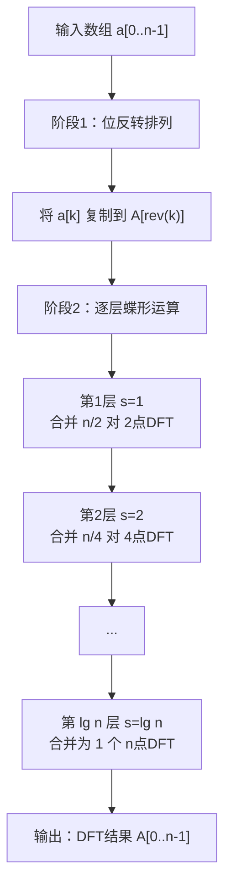

## 相关笔记

- [[30.1 多项式的表示]]
- [[30.2 DFT与FFT]]
- [[离散数学/concepts/分治法]]

> [!abstract] 概览
> 本节将 [[30.2 DFT与FFT]] 中的递归 FFT 算法改造为**迭代版本**，消除递归调用的函数开销，使算法更适合实际工程部署。核心改造包含三个关键组件：**位反转排列**（bit-reversal permutation）负责将输入数组重排为正确的初始顺序；**蝶形运算**（butterfly operation）作为每轮合并的基本计算单元，具有**原地计算**（in-place）的特性；以及**旋转因子**（twiddle factor）的预计算优化。最终得到的 ITERATIVE-FFT 算法在 $\Theta(n \lg n)$ 时间内完成 $n$ 点 DFT，且仅需 $O(1)$ 额外空间（不含输入输出数组本身）。从电路视角看，FFT 对应一个深度为 $\Theta(\lg n)$、宽度为 $O(n)$ 的计算网络，每一级包含 $n/2$ 个蝶形运算。

---

## 知识结构总览

```mermaid
flowchart TD
    A["30.3 高效FFT实现"] --> B["递归FFT → 迭代FFT的转换动机"]
    A --> C["位反转排列 Bit-Reversal Permutation"]
    A --> D["蝶形运算 Butterfly Operation"]
    A --> E["ITERATIVE-FFT 伪代码"]
    A --> F["原地计算与空间优化"]
    A --> G["旋转因子预计算"]
    A --> H["FFT电路视角"]
    A --> I["8点FFT数值示例"]

    B --> B1["消除递归函数调用开销"]
    B --> B2["自底向上替代自顶向下"]
    B --> B3["时间复杂度不变 Theta(n lg n)"]

    C --> C1["rev(k) 二进制位反转函数"]
    C --> C2["BIT-REVERSE-COPY 伪代码"]
    C --> C3["仅对 n = 2^l 成立"]

    D --> D1["y_k = a_k + omega^r b_k"]
    D --> D2["y_{k+n/2} = a_k - omega^r b_k"]
    D --> D3["几何直觉：旋转与叠加"]

    E --> E1["外层循环：s = 1, 2, ..., lg n"]
    E --> E2["内层循环：k = 0, 1, ..., 2^{s-1}-1"]
    E --> E3["蝶形运算合并"]

    F --> F1["蝶形运算的原地性质"]
    F --> F2["仅需 O(1) 额外空间"]

    G --> G1["omega_n^r = e^{2 pi i r / n}"]
    G --> G2["预计算避免重复三角函数调用"]

    H --> H1["对数级深度 lg n 层"]
    H --> H2["线性宽度 n 个节点"]
    H --> H3["每层 n/2 个蝶形运算"]

    I --> I1["输入数组位反转重排"]
    I --> I2["第1层：4个2点蝶形"]
    I --> I3["第2层：2个4点蝶形"]
    I --> I4["第3层：1个8点蝶形"]
```



---

## 核心思想

### 2.1 从递归FFT到迭代FFT的转换动机

[[30.2 DFT与FFT]] 中的递归 FFT 算法基于 [[离散数学/concepts/分治法]]，将 $n$ 点 DFT 分解为两个 $n/2$ 点 DFT，再通过 $O(n)$ 的合并步骤得到最终结果。递归关系为 $T(n) = 2T(n/2) + \Theta(n) = \Theta(n \lg n)$。

递归实现虽然简洁优雅，但在实际运行中存在以下开销：

1. **函数调用开销**：每次递归调用需要保存和恢复栈帧（返回地址、局部变量、参数等），对于深度为 $\lg n$ 的递归树，共产生 $2n - 1$ 次函数调用
2. **临时数组分配**：递归的每一层都需要分配临时数组来存储奇偶分组的结果，总空间开销为 $O(n \lg n)$
3. **缓存不友好**：递归的访问模式对 CPU 缓存不够友好，频繁的小数组分配导致缓存命中率下降

**核心改造思路**：将递归的"自顶向下"分解过程反转为"自底向上"的合并过程。递归 FFT 先分解到最小子问题（2 点 DFT），再逐层向上合并；迭代 FFT 直接从最小子问题出发，逐层执行合并，最终得到完整的 $n$ 点 DFT。

**生活化类比**：递归 FFT 像是一个管理者把任务层层分解给下属（自顶向下），每个人完成后再层层汇报汇总。迭代 FFT 则是所有基层员工先各自完成最小任务，然后两两配对汇总，再逐级向上合并（自底向上）。后者省去了层层下达指令的开销，直接从最底层开始工作。

### 2.2 迭代FFT执行流程

> [!tip] 迭代FFT执行流程
> 迭代 FFT 的执行分为两个阶段：首先通过位反转排列将输入数组重排为正确的初始顺序，然后通过若干轮蝶形运算逐层合并，最终得到完整的 DFT 结果。



### 2.3 位反转排列（Bit-Reversal Permutation）

#### 定义

设 $n = 2^l$，对于索引 $k$（$0 \leq k < n$），将 $k$ 表示为 $l$ 位二进制数 $(b_{l-1} b_{l-2} \cdots b_1 b_0)_2$，则 $k$ 的**位反转**定义为：

$$
\text{rev}(k) = (b_0 b_1 \cdots b_{l-2} b_{l-1})_2
$$

即把 $k$ 的二进制表示的各位顺序完全颠倒。

**位反转排列**将数组中位置 $k$ 的元素移动到位置 $\text{rev}(k)$。例如，当 $n = 8$（$l = 3$）时：

| $k$ | 二进制 $(b_2 b_1 b_0)$ | $\text{rev}(k)$ | 二进制 $(b_0 b_1 b_2)$ |
|:---:|:---:|:---:|:---:|
| 0 | 000 | 0 | 000 |
| 1 | 001 | 4 | 100 |
| 2 | 010 | 2 | 010 |
| 3 | 011 | 6 | 110 |
| 4 | 100 | 1 | 001 |
| 5 | 101 | 5 | 101 |
| 6 | 110 | 3 | 011 |
| 7 | 111 | 7 | 111 |

#### 位反转排列的作用

递归 FFT 的分解过程自然地将输入按奇偶分组：第一层按最低位 $b_0$ 分组（$b_0 = 0$ 为偶数索引，$b_0 = 1$ 为奇数索引），第二层按次低位 $b_1$ 分组，依此类推。最终，递归到达叶节点时，元素的排列顺序恰好是按二进制位反转后的顺序。

迭代 FFT 需要直接从叶节点开始合并，因此必须先将输入数组按照位反转顺序重排，使每个蝶形运算的两个输入恰好位于正确的位置。

**直观理解**：递归 FFT 的分解过程像是一副扑克牌不断按"奇偶位置"交替分牌——先按第1位分，再按第2位分，最后按第 $l$ 位分。最终每张牌的位置就是将其原始编号的二进制位全部翻转后的结果。

#### BIT-REVERSE-COPY 伪代码

```
BIT-REVERSE-COPY(a, A)

1  n ← length[a]
2  for k ← 0 to n - 1
3      A[rev(k)] ← a[k]
```

其中 $\text{rev}(k)$ 可以通过以下方式高效计算：

```
REV(k, l)

1  r ← 0
2  for j ← 0 to l - 1
3      r ← 2 · r + (k mod 2)
4      k ← ⌊k / 2⌋
5  return r
```

该过程的时间复杂度为 $O(l) = O(\lg n)$，因此 BIT-REVERSE-COPY 的总时间为 $O(n \lg n)$。通过查表法可以进一步优化到 $O(n)$。

### 2.4 蝶形运算（Butterfly Operation）

#### 定义

蝶形运算是迭代 FFT 中每一层合并的基本计算单元。给定两个输入 $a_k$ 和 $b_k$，以及旋转因子 $\omega_n^r$（其中 $n$ 为当前合并的 DFT 长度，$r$ 为对应的旋转因子指数），蝶形运算计算两个输出：

$$
y_k = a_k + \omega_n^r \cdot b_k
$$

$$
y_{k + n/2} = a_k - \omega_n^r \cdot b_k
$$

其中 $a_k$ 和 $b_k$ 分别来自当前层的上半部分和下半部分。

#### 几何直觉

蝶形运算的名称来源于其信号流图的形状——两条输入线经过一个交叉点后变成两条输出线，形似蝴蝶的翅膀。

从几何角度看，$\omega_n^r = e^{2\pi i r / n}$ 是复平面单位圆上的一个点，表示角度为 $2\pi r / n$ 的旋转。蝶形运算的含义是：

- **上输出** $y_k$：将 $b_k$ 旋转角度 $2\pi r / n$ 后加到 $a_k$ 上——"同相叠加"
- **下输出** $y_{k+n/2}$：将 $b_k$ 旋转后从 $a_k$ 中减去——"反相叠加"

这恰好对应了 DFT 合并公式中 $A[k] + \omega_n^k B[k]$ 和 $A[k] - \omega_n^k B[k]$ 的计算。

**生活化类比**：想象两个人站在圆心两侧，各自手持一根绳子的一端。蝶形运算就像是将其中一人的位置沿圆周旋转一定角度后，分别计算两人位置的"和"与"差"——和代表同向共振，差代表反向抵消。

### 2.5 ITERATIVE-FFT 伪代码

```
ITERATIVE-FFT(a)

1  n ← length[a]                    // n 必须为 2 的幂
2  BIT-REVERSE-COPY(a, A)           // 位反转排列，结果存入 A
3
4  for s ← 1 to lg n                // 共 lg n 层，每层合并更大的 DFT
5      m ← 2^s                      // 当前合并的 DFT 长度
6      ω_m ← e^{2πi/m}              // 当前层的主根
7      for k ← 0 to n - 1 by m      // 遍历每个 m 点 DFT 块
8          ω ← 1                    // 旋转因子初始化为 1
9          for j ← 0 to m/2 - 1     // 块内执行 m/2 个蝶形运算
10             t ← ω · A[k + j + m/2]   // 旋转后的下半部分
11             u ← A[k + j]              // 上半部分
12             A[k + j] ← u + t          // 蝶形上输出（原地）
13             A[k + j + m/2] ← u - t    // 蝶形下输出（原地）
14             ω ← ω · ω_m              // 更新旋转因子
15
16 return A
```

**逐行解析**：

- **第1行**：获取输入数组长度 $n$，要求 $n = 2^l$
- **第2行**：通过位反转排列将输入复制到工作数组 $A$，使得后续蝶形运算的输入对齐正确
- **第4行**：外层循环变量 $s$ 从 $1$ 到 $\lg n$，表示当前正在执行第 $s$ 层合并
- **第5行**：$m = 2^s$ 是当前层每个 DFT 块的大小（第1层 $m = 2$，第2层 $m = 4$，...）
- **第6行**：计算当前层的主 $m$ 次单位根 $\omega_m = e^{2\pi i / m}$
- **第7行**：以步长 $m$ 遍历所有 DFT 块的起始位置 $k$
- **第8行**：每个块内的旋转因子从 $\omega = \omega_m^0 = 1$ 开始
- **第9-14行**：在块内执行 $m/2$ 个蝶形运算，每次使用当前的旋转因子 $\omega$
- **第14行**：旋转因子递推更新 $\omega \leftarrow \omega \cdot \omega_m$，避免重复调用三角函数

### 2.6 原地计算

迭代 FFT 的一个关键优势是**原地计算**：蝶形运算的两个输出可以直接覆盖两个输入所在的存储位置。

观察蝶形运算的计算过程：

$$
A[k + j] \leftarrow A[k + j] + \omega \cdot A[k + j + m/2]
$$

$$
A[k + j + m/2] \leftarrow A[k + j] - \omega \cdot A[k + j + m/2]
$$

这里有一个微妙但关键的问题：在计算第二个赋值时，$A[k + j]$ 的原始值已经被第一个赋值修改了。因此实际实现中必须使用临时变量：

```
t ← ω · A[k + j + m/2]    // 先保存旋转后的值
u ← A[k + j]               // 保存原始的 A[k+j]
A[k + j] ← u + t           // 蝶形上输出
A[k + j + m/2] ← u - t     // 蝶形下输出（使用保存的原始值 u）
```

由于蝶形运算是一对一的映射（两个输入产生两个输出，且输出恰好写入输入的位置），整个算法除了输入数组 $A$ 之外，只需要 $O(1)$ 的额外空间（几个临时变量 $t, u, \omega$）。

**原地性质的正确性**：在同一层（同一个 $s$ 值）中，不同的蝶形运算读写的是数组中不相交的位置对。具体来说，对于步长为 $m$ 的第 $k$ 个块，蝶形运算只访问 $A[k + j]$ 和 $A[k + j + m/2]$（$0 \leq j < m/2$），这些位置对不同的 $k$ 值不会重叠。因此同一层内的蝶形运算可以按任意顺序执行，不存在写后读的数据冒险。

### 2.7 旋转因子（Twiddle Factor）的预计算优化

旋转因子 $\omega_m^r = e^{2\pi i r / m}$ 的计算涉及三角函数 $\cos(2\pi r / m)$ 和 $\sin(2\pi r / m)$，在浮点运算中代价较高。ITERATIVE-FFT 伪代码中采用了**递推更新**策略来避免重复计算：

$$
\omega \leftarrow \omega \cdot \omega_m
$$

即每次将当前的旋转因子乘以主根 $\omega_m$，得到下一个旋转因子。这种递推方式避免了在内层循环中反复调用 $\cos$ 和 $\sin$ 函数。

然而，递推更新在浮点运算中会引入**累积舍入误差**：经过多次递推后，$\omega$ 的值可能逐渐偏离精确值。对于 $n$ 较大的情况，这种误差可能变得不可忽略。

**更稳健的替代方案**是预计算所有需要的旋转因子，存储在查表中：

```
// 预计算阶段
for r ← 0 to n/2 - 1
    twiddle[r] ← e^{2πi·r/n}

// 使用阶段（替代内层循环中的递推更新）
t ← twiddle[r] · A[k + j + m/2]    // r 与 j 和 s 的对应关系需要映射
```

预计算方案的时间复杂度仍为 $O(n)$，空间开销为 $O(n)$，但消除了递推累积误差，在大规模 FFT 中精度更高。

### 2.8 FFT电路视角

将迭代 FFT 的计算过程用信号流图表示，可以得到一个经典的 **FFT 电路**（也称为 FFT 信号流图或蝶形图）。

**电路结构特征**：

- **深度**（depth）：$\lg n$ 层，对应 $\lg n$ 轮蝶形运算。信号从输入到输出经过 $\lg n$ 级处理。
- **宽度**（width）：$n$ 个节点，每层有 $n$ 条水平线（对应数组的 $n$ 个元素）。
- **每层蝶形数**：第 $s$ 层（$1 \leq s \leq \lg n$）包含 $n / 2^s$ 个 DFT 块，每块 $2^{s-1}$ 个蝶形，共 $n/2$ 个蝶形运算。
- **连线模式**：同一层内的连线跨越 $m/2 = 2^{s-1}$ 的距离，形成规则的交叉模式。

**总运算量**：$\lg n$ 层，每层 $n/2$ 个蝶形运算，每个蝶形运算包含 1 次复数乘法和 2 次复数加法。总计：

$$
\text{复数乘法次数} = \frac{n}{2} \lg n
$$

$$
\text{复数加法次数} = n \lg n
$$

（注意：第1层 $s = 1$ 时 $\omega_2^0 = 1$，蝶形运算退化为简单的加减法，无需乘法。精确计数为 $(n/2) \lg n - n + 1$ 次复数乘法，但渐近量级为 $\Theta(n \lg n)$。）

### 2.9 具体数值示例：8点迭代FFT的逐步执行

设输入数组为 $a = (a_0, a_1, a_2, a_3, a_4, a_5, a_6, a_7)$，$n = 8$，$\lg n = 3$。

#### 阶段1：位反转排列

根据 2.3 节的位反转表，将 $a[k]$ 复制到 $A[\text{rev}(k)]$：

| $k$ | $\text{rev}(k)$ | 操作 |
|:---:|:---:|------|
| 0 | 0 | $A[0] \leftarrow a_0$ |
| 1 | 4 | $A[4] \leftarrow a_1$ |
| 2 | 2 | $A[2] \leftarrow a_2$ |
| 3 | 6 | $A[6] \leftarrow a_3$ |
| 4 | 1 | $A[1] \leftarrow a_4$ |
| 5 | 5 | $A[5] \leftarrow a_5$ |
| 6 | 3 | $A[3] \leftarrow a_6$ |
| 7 | 7 | $A[7] \leftarrow a_7$ |

位反转后的数组：

$$
A = (a_0, a_4, a_2, a_6, a_1, a_5, a_3, a_7)
$$

#### 阶段2：逐层蝶形运算

**第1层**（$s = 1$，$m = 2$，$\omega_2 = e^{2\pi i / 2} = e^{\pi i} = -1$）：

共 4 个 DFT 块（$k = 0, 2, 4, 6$），每块 1 个蝶形运算（$j = 0$）。

| 块起始 $k$ | $u = A[k]$ | $t = \omega \cdot A[k+1]$ | $A[k] \leftarrow u + t$ | $A[k+1] \leftarrow u - t$ |
|:---:|:---:|:---:|:---:|:---:|
| 0 | $a_0$ | $1 \cdot a_4 = a_4$ | $a_0 + a_4$ | $a_0 - a_4$ |
| 2 | $a_2$ | $1 \cdot a_6 = a_6$ | $a_2 + a_6$ | $a_2 - a_6$ |
| 4 | $a_1$ | $1 \cdot a_5 = a_5$ | $a_1 + a_5$ | $a_1 - a_5$ |
| 6 | $a_3$ | $1 \cdot a_7 = a_7$ | $a_3 + a_7$ | $a_3 - a_7$ |

第1层完成后（注意 $\omega_2^0 = 1$，所以旋转因子为 1）：

$$
A = (a_0 + a_4, \; a_0 - a_4, \; a_2 + a_6, \; a_2 - a_6, \; a_1 + a_5, \; a_1 - a_5, \; a_3 + a_7, \; a_3 - a_7)
$$

**第2层**（$s = 2$，$m = 4$，$\omega_4 = e^{2\pi i / 4} = e^{\pi i / 2} = i$）：

共 2 个 DFT 块（$k = 0, 4$），每块 2 个蝶形运算（$j = 0, 1$）。

块 $k = 0$（使用 $A[0..3]$）：

| $j$ | $\omega = \omega_4^j$ | $u = A[j]$ | $t = \omega \cdot A[j+2]$ | 新 $A[j]$ | 新 $A[j+2]$ |
|:---:|:---:|:---:|:---:|:---:|:---:|
| 0 | $\omega_4^0 = 1$ | $a_0 + a_4$ | $1 \cdot (a_2 + a_6)$ | $(a_0+a_4)+(a_2+a_6)$ | $(a_0+a_4)-(a_2+a_6)$ |
| 1 | $\omega_4^1 = i$ | $a_0 - a_4$ | $i \cdot (a_2 - a_6)$ | $(a_0-a_4)+i(a_2-a_6)$ | $(a_0-a_4)-i(a_2-a_6)$ |

块 $k = 4$（使用 $A[4..7]$）：

| $j$ | $\omega = \omega_4^j$ | $u = A[4+j]$ | $t = \omega \cdot A[4+j+2]$ | 新 $A[4+j]$ | 新 $A[4+j+2]$ |
|:---:|:---:|:---:|:---:|:---:|:---:|
| 0 | $\omega_4^0 = 1$ | $a_1 + a_5$ | $1 \cdot (a_3 + a_7)$ | $(a_1+a_5)+(a_3+a_7)$ | $(a_1+a_5)-(a_3+a_7)$ |
| 1 | $\omega_4^1 = i$ | $a_1 - a_5$ | $i \cdot (a_3 - a_7)$ | $(a_1-a_5)+i(a_3-a_7)$ | $(a_1-a_5)-i(a_3-a_7)$ |

第2层完成后：

$$
A = \begin{pmatrix}
(a_0+a_4)+(a_2+a_6) \\
(a_0-a_4)+i(a_2-a_6) \\
(a_0+a_4)-(a_2+a_6) \\
(a_0-a_4)-i(a_2-a_6) \\
(a_1+a_5)+(a_3+a_7) \\
(a_1-a_5)+i(a_3-a_7) \\
(a_1+a_5)-(a_3+a_7) \\
(a_1-a_5)-i(a_3-a_7)
\end{pmatrix}
$$

**第3层**（$s = 3$，$m = 8$，$\omega_8 = e^{2\pi i / 8} = e^{\pi i / 4} = \frac{\sqrt{2}}{2}(1 + i)$）：

共 1 个 DFT 块（$k = 0$），4 个蝶形运算（$j = 0, 1, 2, 3$）。

令 $W = \omega_8 = e^{\pi i / 4}$，则 $\omega_8^0 = 1$，$\omega_8^1 = W$，$\omega_8^2 = i$，$\omega_8^3 = W^3 = -\frac{\sqrt{2}}{2}(1 - i)$。

| $j$ | $\omega$ | $u = A[j]$（第2层结果） | $t = \omega \cdot A[j+4]$ | 新 $A[j]$ = $u + t$ | 新 $A[j+4]$ = $u - t$ |
|:---:|:---:|:---:|:---:|:---:|:---:|
| 0 | $1$ | $(a_0+a_4)+(a_2+a_6)$ | $1 \cdot [(a_1+a_5)+(a_3+a_7)]$ | $y_0$ | $y_4$ |
| 1 | $W$ | $(a_0-a_4)+i(a_2-a_6)$ | $W \cdot [(a_1-a_5)+i(a_3-a_7)]$ | $y_1$ | $y_5$ |
| 2 | $i$ | $(a_0+a_4)-(a_2+a_6)$ | $i \cdot [(a_1+a_5)-(a_3+a_7)]$ | $y_2$ | $y_6$ |
| 3 | $W^3$ | $(a_0-a_4)-i(a_2-a_6)$ | $W^3 \cdot [(a_1-a_5)-i(a_3-a_7)]$ | $y_3$ | $y_7$ |

其中 $y_0, y_1, \ldots, y_7$ 即为输入多项式系数 $(a_0, a_1, \ldots, a_7)$ 在 8 个 8 次单位根处的求值结果——也就是 8 点 DFT 的输出。

最终输出 $A = (y_0, y_1, y_2, y_3, y_4, y_5, y_6, y_7)$ 即为所求的 DFT 结果。

---

## 补充理解与拓展

> [!info] FFTW库的设计哲学
> **FFTW**（Fastest Fourier Transform in the West）是由 MIT 的 Matteo Frigo 和 Steven G. Johnson 开发的开源 FFT 库，其名称本身就是对性能的宣言。FFTW 的核心设计哲学是**"规划器"（planner）模式**：在首次执行变换前，FFTW 会运行一个自动优化阶段，针对当前硬件平台（CPU 缓存大小、SIMD 指令集支持、内存带宽等）和数据特征（变换大小、数据类型），从多种算法变体中选择最优的执行计划。
>
> FFTW 内部实现了多种 FFT 算法变体，包括：
> - **Cooley-Tukey 分解**（即本节介绍的基-2/基-4 迭代 FFT）
> - **Split-radix 算法**（减少乘法次数的混合基算法）
> - **Rader 算法**（适用于素数长度的 FFT）
> - **Bluestein 算法**（适用于任意长度的 FFT，通过卷积转化为幂-of-2 的 FFT）
> - **素因子算法**（Prime Factor Algorithm, PFA）
>
> FFTW 3.x 版本（发表于 *Proceedings of the IEEE*, 2005）引入了更先进的代码生成技术，能够针对特定变换大小动态生成优化的 C 代码，充分利用 CPU 的 SIMD 向量指令（如 SSE、AVX）。FFTW 是科学计算领域使用最广泛的 FFT 库之一，被 NumPy、MATLAB、GNU Octave 等主流工具作为默认 FFT 后端。

> [!info] Split-Radix FFT算法
> **Split-radix FFT** 是由 P. Duhamel 和 H. Hollmann 于 1984 年独立提出的一种 FFT 变体，其核心思想是在基-2 分解的基础上进行**不对称分解**：将 $n$ 点 DFT 分解为一个 $n/2$ 点 DFT（偶数索引部分）加上两个 $n/4$ 点 DFT（奇数索引部分进一步按 $4k+1$ 和 $4k+3$ 分解）。
>
> 与标准基-2 FFT 相比，split-radix 算法的优势在于**减少了复数乘法的次数**：
> - 基-2 FFT：约 $n \lg n$ 次复数乘法
> - Split-radix FFT：约 $n \lg n - 3n + 4$ 次实数乘法（等价于约 $(n/2) \lg n$ 次复数乘法）
>
> 2007 年，Johnson 和 Frigo（即 FFTW 的作者）发表了一篇改进的 split-radix 算法，将算术运算次数进一步降低到约 $4n \lg n - 6n + 8$ 次实数加法和约 $n \lg n - 3n + 4$ 次实数乘法，打破了 Yavne 在 1968 年设立的长达近 40 年的运算量记录。
>
> Split-radix 算法的缺点是数据访问模式不如基-2 FFT 规则，在硬件实现（如 FPGA、ASIC）中流水线设计更为复杂。因此在软件库（如 FFTW）中广泛使用，而在专用硬件加速器中基-2/基-4 FFT 仍然更常见。

> [!info] 实际FFT实现中的精度问题
> 在浮点运算中实现 FFT 时，**舍入误差**（rounding error）的累积是一个不可忽视的问题。每个蝶形运算包含 1 次复数乘法和 2 次复数加法，每次运算都可能引入 $O(\epsilon_{\text{mach}})$（机器精度）的相对误差。
>
> 理论分析表明，$n$ 点 FFT 的**总相对误差上界**为 $O(\epsilon_{\text{mach}} \cdot \sqrt{\lg n})$（由 Gentleman 和 Sande 在 1966 年首次推导），这意味着 FFT 的数值稳定性优于朴素的 $O(n^2)$ DFT 算法（后者的误差上界为 $O(\epsilon_{\text{mach}} \cdot n)$）。
>
> 实际工程中影响 FFT 精度的主要因素包括：
> - **旋转因子递推误差**：本节提到的递推更新 $\omega \leftarrow \omega \cdot \omega_m$ 在经过 $O(n)$ 次递推后可能产生显著的累积误差。对于 $n > 2^{20}$ 的大规模 FFT，建议使用预计算查表而非递推
> - **大数吃小数**：当输入数据的动态范围较大时，蝶形运算中的加法可能导致小数值被大数值的舍入误差淹没
> - **中间结果溢出**：在定点数实现中，蝶形运算的中间结果可能超出表示范围，需要仔细设计缩放策略
>
> 常用的缓解措施包括：使用双精度浮点数（64 位）替代单精度（32 位）、采用预计算旋转因子查表、以及在定点数实现中引入逐级缩放（block floating-point scaling）。

> [!info] 多维FFT
> **二维 DFT**（2D-DFT）是一维 DFT 在二维平面上的直接扩展，广泛应用于数字图像处理中。对于 $M \times N$ 的图像矩阵 $f(x, y)$，其 2D-DFT 定义为：
>
> $$
> F(u, v) = \sum_{x=0}^{M-1} \sum_{y=0}^{N-1} f(x, y) \cdot e^{-2\pi i (ux/M + vy/N)}
> $$
>
> 2D-DFT 的一个关键性质是**可分离性**（separability）：二维变换可以分解为两次一维变换的级联——先对每一行执行 $M$ 点 1D-FFT（共 $N$ 次），再对每一列执行 $N$ 点 1D-FFT（共 $M$ 次）。总计算量为 $O(MN \cdot \lg M + MN \cdot \lg N) = O(MN \cdot \lg(MN))$。
>
> 对于 $1024 \times 1024$ 的图像，直接计算 2D-DFT 需要 $O((MN)^2) \approx 10^{12}$ 次运算，而利用可分离性和 1D-FFT 只需约 $MN \lg(MN) \approx 2 \times 10^7$ 次运算，加速比高达数万倍。
>
> 多维 FFT 的典型应用包括：
> - **图像滤波**：在频域中通过乘法实现卷积滤波（如高斯模糊、边缘检测）
> - **图像压缩**：JPEG 格式使用二维离散余弦变换（DCT），与 DFT 密切相关
> - **医学成像**：MRI 和 CT 扫描的图像重建依赖二维/三维 FFT
> - **偏微分方程求解**：谱方法利用 FFT 在频域中高效求解泊松方程等 PDE

---

## 易混淆点

> [!warning] 递归FFT vs 迭代FFT
> 递归 FFT 和迭代 FFT 计算**完全相同的 DFT 结果**，区别仅在于实现方式：
>
> | 特征 | 递归 FFT | 迭代 FFT |
> |------|---------|---------|
> | 计算范式 | 自顶向下分解 | 自底向上合并 |
> | 函数调用 | $O(n)$ 次递归调用 | 无递归，纯循环 |
> | 额外空间 | $O(n \lg n)$（临时数组） | $O(1)$（原地计算） |
> | 输入预处理 | 无需位反转 | 需要位反转排列 |
> | 时间复杂度 | $\Theta(n \lg n)$ | $\Theta(n \lg n)$ |
> | 缓存友好性 | 较差（频繁小数组分配） | 较好（顺序访问大数组） |
>
> 递归 FFT 更适合教学和理解算法原理，迭代 FFT 更适合实际工程部署。两者输出的 DFT 结果在数学上完全等价。

> [!warning] DIT（Decimation-in-Time）vs DIF（Decimation-in-Frequency）
> 本节介绍的迭代 FFT 属于 **DIT**（按时间抽取）变体。FFT 算法还有另一种等价形式——**DIF**（按频率抽取）：
>
> - **DIT**：输入端按奇偶索引分组（"抽取时间"），输出端按自然顺序排列。位反转排列作用于**输入**。
> - **DIF**：输出端按奇偶频率分组（"抽取频率"），输入端按自然顺序排列。位反转排列作用于**输出**。
>
> 两者的蝶形运算结构互为转置（transpose）：DIT 的蝶形图上下翻转后就是 DIF 的蝶形图。计算复杂度完全相同，均为 $\Theta(n \lg n)$。在实际 FFT 库中，DIT 更为常见，但某些硬件实现（如 FPGA 中的流式 FFT）倾向于使用 DIF，因为其输出可以自然地按频率顺序产生。
>
> **记忆口诀**：DIT = 输入乱序（位反转），输出有序；DIF = 输入有序，输出乱序（位反转）。

> [!warning] 位反转排列只对 n = 2^l 成立
> 位反转排列的定义依赖于 $n$ 是 $2$ 的整数幂这一前提条件。当 $n = 2^l$ 时，每个索引 $k$ 可以用恰好 $l$ 位二进制数表示，位反转操作 $\text{rev}(k)$ 是良定义的。
>
> 当 $n$ 不是 $2$ 的幂时：
> - 索引的二进制表示位数不统一，位反转操作没有自然定义
> - 标准 Cooley-Tukey FFT 算法不直接适用
> - 需要使用其他算法处理，如 **Bluestein 算法**（将任意长度 $n$ 的 DFT 转化为 $2^m \geq 2n-1$ 的卷积）或 **Rader 算法**（适用于 $n$ 为素数的情况）
>
> 实际的通用 FFT 库（如 FFTW）会自动检测输入长度，对 $2$ 的幂使用高效的基-2 FFT，对其他长度自动选择合适的替代算法。

---

## 习题精选

| 题号 | 题目内容 | 考察知识点 | 难度 |
|:----:|---------|-----------|:----:|
| 30.3-1 | 证明位反转排列满足 rev(rev(k)) = k | 位反转排列的性质 | 低 |
| 30.3-2 | 对 n=16 的输入数组写出位反转后的顺序 | 位反转排列的计算 | 中 |
| 30.3-3 | 修改 ITERATIVE-FFT 使其计算逆 FFT | 逆 FFT 的迭代实现 | 中 |
| 30.3-4 | 分析蝶形运算中原地计算的正确性条件 | 原地蝶形运算的数据依赖 | 高 |

> [!faq]- 习题 30.3-1：证明位反转排列满足 rev(rev(k)) = k
> **题目**：设 $n = 2^l$，证明对任意 $0 \leq k < n$，有 $\text{rev}(\text{rev}(k)) = k$。
>
> **解题思路提示**：
> 1. 将 $k$ 表示为 $l$ 位二进制数 $(b_{l-1} b_{l-2} \cdots b_1 b_0)_2$
> 2. 计算 $\text{rev}(k)$ 的二进制表示
> 3. 再对 $\text{rev}(k)$ 执行一次位反转
>
> **标准答案**：
>
> 【目标（证明两次位反转恢复原值）】
>
> 设 $k$ 的 $l$ 位二进制表示为 $(b_{l-1} b_{l-2} \cdots b_1 b_0)_2$。
>
> 【前提（位反转的定义）】
>
> 由位反转的定义：
> $$
> \text{rev}(k) = (b_0 b_1 \cdots b_{l-2} b_{l-1})_2
> $$
>
> 【推导（对 rev(k) 再次执行位反转）】
>
> 对 $\text{rev}(k)$ 的二进制表示 $(b_0 b_1 \cdots b_{l-2} b_{l-1})_2$ 再次执行位反转，将各位顺序颠倒：
> $$
> \text{rev}(\text{rev}(k)) = (b_{l-1} b_{l-2} \cdots b_1 b_0)_2 = k
> $$
>
> 【结论（位反转是自逆运算）】
>
> 因此 $\text{rev}(\text{rev}(k)) = k$ 对所有 $0 \leq k < n$ 成立。这说明位反转排列是一个**对合**（involution），即它自身的逆就是它自己。$\blacksquare$

> [!faq]- 习题 30.3-2：对 n=16 的输入数组写出位反转后的顺序
> **题目**：设 $n = 16$（$l = 4$），对输入数组 $(a_0, a_1, \ldots, a_{15})$，写出经过位反转排列后的数组顺序。
>
> **解题思路提示**：
> 1. 对每个 $k \in \{0, 1, \ldots, 15\}$，写出其 4 位二进制表示
> 2. 将二进制位反转，得到 $\text{rev}(k)$
> 3. 按 $\text{rev}(k)$ 的顺序排列
>
> **标准答案**：
>
> | $k$ | 二进制 | $\text{rev}(k)$ | 二进制（反转后） |
> |:---:|:---:|:---:|:---:|
> | 0 | 0000 | 0 | 0000 |
> | 1 | 0001 | 8 | 1000 |
> | 2 | 0010 | 4 | 0100 |
> | 3 | 0011 | 12 | 1100 |
> | 4 | 0100 | 2 | 0010 |
> | 5 | 0101 | 10 | 1010 |
> | 6 | 0110 | 6 | 0110 |
> | 7 | 0111 | 14 | 1110 |
> | 8 | 1000 | 1 | 0001 |
> | 9 | 1001 | 9 | 1001 |
> | 10 | 1010 | 5 | 0101 |
> | 11 | 1011 | 13 | 1101 |
> | 12 | 1100 | 3 | 0011 |
> | 13 | 1101 | 11 | 1011 |
> | 14 | 1110 | 7 | 0111 |
> | 15 | 1111 | 15 | 1111 |
>
> 位反转后的数组顺序为：
> $$
> (a_0, a_8, a_4, a_{12}, a_2, a_{10}, a_6, a_{14}, a_1, a_9, a_5, a_{13}, a_3, a_{11}, a_7, a_{15})
> $$

> [!faq]- 习题 30.3-3：修改 ITERATIVE-FFT 使其计算逆 FFT
> **题目**：修改 ITERATIVE-FFT 伪代码，使其计算逆离散傅里叶变换（IDFT）。提示：逆 DFT 可以通过将 FFT 中的 $\omega_n$ 替换为 $\omega_n^{-1}$，并在最后除以 $n$ 来实现。
>
> **解题思路提示**：
> 1. 回顾逆 DFT 公式：$a_k = \frac{1}{n} \sum_{j=0}^{n-1} y_j \omega_n^{-kj}$
> 2. 与正 DFT 公式对比，差异在于 $\omega_n$ 变为 $\omega_n^{-1}$，以及最后的 $1/n$ 缩放
> 3. 修改 ITERATIVE-FFT 中主根的计算和最终输出
>
> **标准答案**：
>
> 【目标（将正 FFT 改造为逆 FFT）】
>
> 逆 DFT 公式为：
> $$
> a_k = \frac{1}{n} \sum_{j=0}^{n-1} y_j \cdot \omega_n^{-kj}
> $$
>
> 【前提（正 FFT 使用 $\omega_n = e^{2\pi i / n}$，逆 FFT 使用 $\omega_n^{-1} = e^{-2\pi i / n}$）】
>
> 对比正 DFT 公式 $y_k = \sum_{j=0}^{n-1} a_j \omega_n^{kj}$，逆 DFT 仅在两处不同：
> 1. 旋转因子从 $\omega_n$ 变为 $\omega_n^{-1}$
> 2. 最终结果需要除以 $n$
>
> 【推导（修改伪代码）】
>
> 只需对 ITERATIVE-FFT 做两处修改：
>
> ```
> ITERATIVE-INVERSE-FFT(y)
>
> 1  n ← length[y]
> 2  BIT-REVERSE-COPY(y, A)        // 位反转排列（与正FFT相同）
> 3
> 4  for s ← 1 to lg n
> 5      m ← 2^s
> 6      ω_m ← e^{-2πi/m}           // 修改1：使用逆主根 ω_m^{-1}
> 7      for k ← 0 to n - 1 by m
> 8          ω ← 1
> 9          for j ← 0 to m/2 - 1
> 10             t ← ω · A[k + j + m/2]
> 11             u ← A[k + j]
> 12             A[k + j] ← u + t
> 13             A[k + j + m/2] ← u - t
> 14             ω ← ω · ω_m
> 15
> 16 for k ← 0 to n - 1             // 修改2：除以 n
> 17     A[k] ← A[k] / n
> 18
> 19 return A
> ```
>
> 【结论（逆 FFT 与正 FFT 的复杂度相同）】
>
> 修改后的 ITERATIVE-INVERSE-FFT 的时间复杂度仍为 $\Theta(n \lg n)$，空间复杂度仍为 $O(1)$（原地计算）。$\blacksquare$

> [!faq]- 习题 30.3-4：分析蝶形运算中原地计算的正确性条件
> **题目**：证明在 ITERATIVE-FFT 的同一层（同一个 $s$ 值）内，不同的蝶形运算不会产生数据冲突，即任意两个蝶形运算的读写位置集不相交。
>
> **解题思路提示**：
> 1. 固定 $s$，分析内层循环中每个蝶形运算访问的数组位置
> 2. 证明对于不同的 $k$ 值，对应的蝶形运算访问的位置集合不相交
> 3. 证明对于同一个 $k$ 值但不同的 $j$ 值，访问的位置也不相交
>
> **标准答案**：
>
> 【目标（证明同层蝶形运算无数据冲突）】
>
> 固定第 $s$ 层（$m = 2^s$），考虑外层循环中步长为 $m$ 的两个不同起始位置 $k_1$ 和 $k_2$（$k_1 \neq k_2$，且 $k_1 \equiv k_2 \pmod{m}$ 不成立）。
>
> 【前提（蝶形运算访问的位置对）】
>
> 对于起始位置 $k$，内层循环中第 $j$ 个蝶形运算访问的位置对为：
> $$
> \{k + j, \; k + j + m/2\}, \quad j = 0, 1, \ldots, m/2 - 1
> $$
>
> 因此起始位置 $k$ 对应的所有访问位置为：
> $$
> S_k = \{k, k+1, \ldots, k + m/2 - 1, \; k + m/2, k + m/2 + 1, \ldots, k + m - 1\} = \{k, k+1, \ldots, k+m-1\}
> $$
>
> 【推导（不同 k 值的位置集不相交）】
>
> 对于 $k_1 \neq k_2$ 且 $k_1 \not\equiv k_2 \pmod{m}$，由于外层循环的步长为 $m$，有 $k_2 = k_1 + qm$（$q \geq 1$）。
>
> $S_{k_1}$ 中的最大元素为 $k_1 + m - 1$，$S_{k_2}$ 中的最小元素为 $k_2 = k_1 + qm \geq k_1 + m$。
>
> 因此 $S_{k_1} \cap S_{k_2} = \emptyset$。
>
> 对于同一个 $k$ 值内不同的 $j$ 值：蝶形运算 $j$ 访问 $\{k+j, k+j+m/2\}$，蝶形运算 $j'$ 访问 $\{k+j', k+j'+m/2\}$。当 $j \neq j'$ 时，由于 $0 \leq j, j' < m/2$，这四个位置两两不同。
>
> 【结论（同层蝶形运算可安全并行或任意顺序执行）】
>
> 因此同一层内的所有蝶形运算访问的位置集两两不相交，不存在数据冲突。这意味着蝶形运算可以按任意顺序执行，也可以并行执行，不影响结果的正确性。$\blacksquare$

---

## 视频学习指南

| 资源 | 讲者/来源 | 内容 | 链接 |
|------|----------|------|------|
| MIT 6.046J Lecture 12 | Erik Demaine | FFT 高效实现、蝶形运算 | [YouTube](https://www.youtube.com/watch?v=iRnDk5T12YA) |
| 3Blue1Brown: But What Is the Fourier Transform? | 3Blue1Brown | 傅里叶变换的直觉理解 | [YouTube](https://www.youtube.com/watch?v=spUNpyF58BY) |
| Reducible: FFT 详解 | Reducible | 迭代FFT、蝶形图动画演示 | [YouTube](https://www.youtube.com/watch?v=h7apO7q16V0) |
| CP-Algorithms: FFT | cp-algorithms.com | 迭代FFT实现代码与技巧 | [cp-algorithms](https://cp-algorithms.com/algebra/fft.html) |

---

## 教材原文

> [!quote] CLRS 第4版 第30.3节
> "We now present an efficient, iterative version of the FFT that runs in Θ(n lg n) time. The iterative version uses the bit-reversal permutation to rearrange the input array, and then performs lg n iterations of butterfly operations. Each iteration combines pairs of DFTs of half the size into DFTs of the full size."
>
> "The key observation is that the butterfly operation can be performed in place: the two outputs of a butterfly overwrite the two inputs. This property allows the iterative FFT to use only O(1) extra space beyond the input and output arrays."
>
> "The bit-reversal permutation arises naturally from the recursive decomposition of the FFT. When we recursively split the input into even-indexed and odd-indexed subsequences, the resulting order of elements at the leaves of the recursion tree corresponds to the bit-reversal of the original indices."

---

## 参见Wiki

- [[第30章_多项式与FFT/30.1 多项式的表示]]：多项式的系数表示与点值表示，FFT 的应用背景
- [[第30章_多项式与FFT/30.2 DFT与FFT]]：递归 FFT 算法，迭代 FFT 的基础
- [[离散数学/concepts/分治法]]：FFT 的核心算法设计范式
- [[离散数学/concepts/主定理]]：分析递归 FFT 时间复杂度 $T(n) = 2T(n/2) + \Theta(n)$ 的工具
- [[第30章_多项式与FFT-章节汇总]]：第30章完整知识框架

---

#学习/算法导论/第30章-多项式与FFT
#学习/算法导论/多项式与FFT/FFT实现
