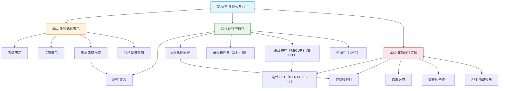

## 相关笔记

**本章节笔记：**
- [[30.1 多项式的表示]] — 系数表示 vs 点值表示、多项式乘法策略、拉格朗日插值
- [[30.2 DFT与FFT]] — 离散傅里叶变换、单位根性质、递归FFT算法、逆DFT
- [[30.3 高效FFT实现]] — 迭代FFT、位反转排列、蝶形运算、旋转因子优化

**前置章节汇总：**
- [[第29章_线性规划-章节汇总]] — 线性规划（前一章）
- [[第04章_分治策略-章节汇总]] — 分治策略（FFT的核心思想）

**后续章节：**
- [[第31章_数论算法-章节汇总]] — 第31章数论算法（待学习）

---

> [!abstract] 概览
> 第30章系统介绍了==多项式==的表示方法与==快速傅里叶变换==（FFT）算法。全章以"如何高效计算多项式乘法"为核心问题，从多项式的两种表示出发，引入离散傅里叶变换（DFT）作为系数表示与点值表示之间的桥梁，最终通过分治策略将 DFT 的计算复杂度从 $\Theta(n^2)$ 降至 $\Theta(n \lg n)$。
>
> 三节内容层层递进：(1) 30.1 节介绍多项式的==系数表示==与==点值表示==，提出"系数→点值→逐点相乘→插值→系数"的乘法策略框架；(2) 30.2 节定义==DFT==，利用==n次单位原根==的代数性质（消去性、对称性、求和引理），设计递归 FFT 算法并证明其正确性；(3) 30.3 节将递归 FFT 改造为==迭代版本==，引入==位反转排列==和==蝶形运算==，实现原地计算和工程级优化。

---

## 知识结构总览

---

## 核心概念回顾

### 三节内容对比

| 维度 | 30.1 多项式的表示 | 30.2 DFT与FFT | 30.3 高效FFT实现 |
|:---|:---|:---|:---|
| **核心问题** | 如何表示多项式 | 如何快速计算DFT | 如何高效实现FFT |
| **核心方法** | 系数表示/点值表示 | 分治 + 单位根性质 | 迭代 + 位反转 + 蝶形运算 |
| **复杂度** | 乘法 Θ(n²) 朴素 | DFT Θ(n lg n) | DFT Θ(n lg n) 原地 |
| **关键概念** | degree-bound、插值 | 单位根、范德蒙德矩阵 | 位反转排列、twiddle factor |
| **空间** | O(n) | O(n lg n) 递归栈 | O(1) 额外（原地） |

> [!note] 多项式乘法的完整流程
> 1. **零填充**：将两个 degree-bound n 的多项式扩展为 degree-bound 2n（尾部补零）
> 2. **求值（DFT）**：对两个多项式分别计算 2n 点 DFT → 点值表示
> 3. **逐点相乘**：对应位置的值相乘 → 乘积多项式的点值表示
> 4. **插值（IDFT）**：对乘积的点值表示计算逆 DFT → 系数表示
>
> 总时间：2 × O(n lg n) + O(n) + O(n lg n) = O(n lg n)

> [!def] 核心定理汇总
> 1. **定理30.1**（插值唯一性）：n 个不同的点值对唯一确定一个 degree-bound n 的多项式
> 2. **消去性**（Lemma 30.3）：$(\omega_n^d)^k = \omega_{n/d}^k$
> 3. **对称性**（Lemma 30.4）：$\omega_n^{k+n/2} = -\omega_n^k$
> 4. **求和引理**（Lemma 30.5）：$\sum_{j=0}^{n-1}(\omega_n^k)^j = 0$（当 $k \neq 0 \pmod{n}$ 时）
> 5. **DFT矩阵可逆性**（Corollary 30.4）：$V_n^{-1} = \frac{1}{n}V_n^*$
> 6. **FFT 复杂度**：$T(n) = 2T(n/2) + \Theta(n) = \Theta(n \lg n)$

---

## 跨章关联

### 与第4章（分治策略）的关系

- FFT 是[[离散数学/concepts/分治法]]的经典应用：将 n 点 DFT 分解为两个 n/2 点 DFT
- FFT 的递推关系 $T(n) = 2T(n/2) + \Theta(n)$ 与[[离散数学/concepts/主定理]]的情况1完全吻合
- [[离散数学/concepts/Strassen算法]]同样利用分治将矩阵乘法从 $O(n^3)$ 优化到 $O(n^{2.81})$，两者思想相通

### 与第28章（矩阵运算）的关系

- DFT 可以表示为矩阵-向量乘法 $y = V_n a$，其中 $V_n$ 是范德蒙德矩阵
- 逆 DFT 本质上是求解线性方程组 $V_n a = y$，即 $a = V_n^{-1} y$
- FFT 算法等价于利用范德蒙德矩阵的特殊结构加速矩阵-向量乘法

### 与第29章（线性规划）的关系

- 多项式乘法可以表述为线性规划的特例（卷积约束）
- 对偶性理论可以用于分析多项式逼近问题

### 与第31章（数论算法）的关系

- 数论变换（NTT）是 FFT 在有限域上的推广，依赖第31章的模运算理论
- NTT 避免了浮点数精度问题，在大整数乘法中广泛应用

---

## 综合复习题

> [!faq]- Q1：为什么 FFT 选择单位根作为求值点？如果选择其他 n 个不同的点，还能达到 $\Theta(n \lg n)$ 的乘法速度吗？
>
> **解答：**
>
> 选择单位根的关键原因有三个：
> 1. **对称性**（Lemma 30.4）：$\omega_n^{k+n/2} = -\omega_n^k$，使得奇偶分解后的两个子问题共享相同的旋转因子，将合并步骤从 $\Theta(n^2)$ 降到 $\Theta(n)$
> 2. **消去性**（Lemma 30.3）：$\omega_n^{2k} = \omega_{n/2}^k$，保证子问题的旋转因子恰好是父问题旋转因子的子集
> 3. **求和引理**（Lemma 30.5）：保证逆变换的正确性
>
> 如果选择其他 n 个不同的点（如随机点），虽然理论上仍可以在 $\Theta(n^2)$ 时间内完成求值和插值，但无法利用上述代数结构进行分治加速。只有单位根（或其等价物，如有限域中的原根）才能实现 $\Theta(n \lg n)$ 的乘法。

> [!faq]- Q2：递归 FFT 和迭代 FFT 计算的结果是否完全相同？为什么实际工程中几乎都使用迭代版本？
>
> **解答：**
>
> **结果完全相同。** 两种算法执行的是完全相同的运算，只是执行顺序不同：
> - 递归 FFT：自顶向下分解，先处理左半部分（偶数下标），再处理右半部分（奇数下标）
> - 迭代 FFT：自底向上合并，从最小的 2 点 DFT 开始，逐层构建
>
> **实际工程中使用迭代版本的原因：**
> 1. **消除递归开销**：每次递归调用需要保存/恢复栈帧，迭代版本避免了 $O(\lg n)$ 的栈空间
> 2. **原地计算**：迭代 FFT 利用蝶形运算的原地性质，仅需 $O(1)$ 额外空间；递归版本需要 $O(n \lg n)$ 的临时数组
> 3. **缓存友好**：迭代版本的内存访问模式更规律，有利于 CPU 缓存利用
> 4. **并行化**：每一层的蝶形运算相互独立，适合 SIMD 指令和多线程并行

> [!faq]- Q3：如何利用 FFT 计算两个大整数的乘法？与 Schönhage-Strassen 算法有什么关系？
>
> **解答：**
>
> **FFT 大整数乘法的基本思路：**
> 1. 将两个 n 位大整数表示为多项式：$A = \sum_{i=0}^{n-1} a_i 10^i$，$B = \sum_{i=0}^{n-1} b_i 10^i$
> 2. 用 FFT 计算多项式乘积 $C = A \times B$（时间 $O(n \lg n)$）
> 3. 处理进位，恢复为整数表示（时间 $O(n)$）
>
> 总时间：$O(n \lg n)$，远优于朴素乘法的 $O(n^2)$。
>
> **Schönhage-Strassen 算法**（1971）进一步将大整数乘法优化到 $O(n \lg n \lg \lg n)$，其核心思想是使用数论变换（NTT）代替复数 FFT，在有限域 $\mathbb{Z}_{2^n+1}$ 上进行计算，完全避免了浮点数精度问题。2024年，Harvey 和 van der Hoeven 发明了 $O(n \lg n)$ 的大整数乘法算法，这是该问题的理论最优复杂度。

---

## 常见误区

> [!warning] 误区1：FFT 是一种新的数学变换
> FFT 不是新的变换，而是 DFT 的一种==快速计算方法==。DFT（离散傅里叶变换）是数学变换本身，定义了输入向量到输出向量的映射关系。FFT 是利用 DFT 的特殊代数结构（单位根性质），通过分治策略将计算量从 $\Theta(n^2)$ 降到 $\Theta(n \lg n)$ 的算法。

> [!warning] 误区2：FFT 只能处理长度为 2 的幂的输入
> 基本的 Cooley-Tukey FFT 确实要求 $n = 2^k$。但存在多种推广：(1) 混合基 FFT（radix-4、radix-8、split-radix）适用于 $n = 2^a 3^b 5^c$ 等形式；(2) Bluestein 算法（chirp-z transform）可以将任意长度的 DFT 转化为卷积，再用 FFT 计算；(3) 素数长度 DFT 可以用 Rader 算法处理。

> [!warning] 误区3：多项式乘法可以直接用 DFT 计算
> 直接用 n 点 DFT 计算两个 degree-bound n 的多项式乘法会得到==循环卷积==而非线性卷积，导致高位系数"绕回"低位。正确做法是先零填充到长度 2n，使线性卷积等价于循环卷积，然后再用 2n 点 FFT 计算。

---

## 学习要点总结

| 学习目标 | 掌握程度 | 对应笔记 |
|:---|:---:|:---|
| 理解系数表示与点值表示的优劣 | ★★★★★ | [[30.1 多项式的表示]] |
| 掌握多项式乘法的"求值-相乘-插值"策略 | ★★★★★ | [[30.1 多项式的表示]] |
| 理解插值唯一性定理 | ★★★★☆ | [[30.1 多项式的表示]] |
| 掌握 DFT 的定义与矩阵表示 | ★★★★★ | [[30.2 DFT与FFT]] |
| 掌握单位根的三个关键性质及证明 | ★★★★★ | [[30.2 DFT与FFT]] |
| 掌握递归 FFT 算法及正确性证明 | ★★★★★ | [[30.2 DFT与FFT]] |
| 理解逆 DFT 的构造方法 | ★★★★☆ | [[30.2 DFT与FFT]] |
| 掌握迭代 FFT 的执行流程 | ★★★★★ | [[30.3 高效FFT实现]] |
| 理解位反转排列的作用与实现 | ★★★★☆ | [[30.3 高效FFT实现]] |
| 掌握蝶形运算的定义与原地性质 | ★★★★★ | [[30.3 高效FFT实现]] |
| 了解 FFT 电路视角和工程优化 | ★★★☆☆ | [[30.3 高效FFT实现]] |

---

## 参见Wiki

- [[离散数学/concepts/分治法]] — FFT 的核心设计思想
- [[离散数学/concepts/主定理]] — FFT 复杂度分析的工具
- [[离散数学/concepts/递归关系式]] — FFT 的递推关系
- [[离散数学/concepts/矩阵乘法]] — DFT 的矩阵表示视角

---

#学习/算法导论/第30章-多项式与FFT #学习/算法导论/多项式与FFT/章节汇总
