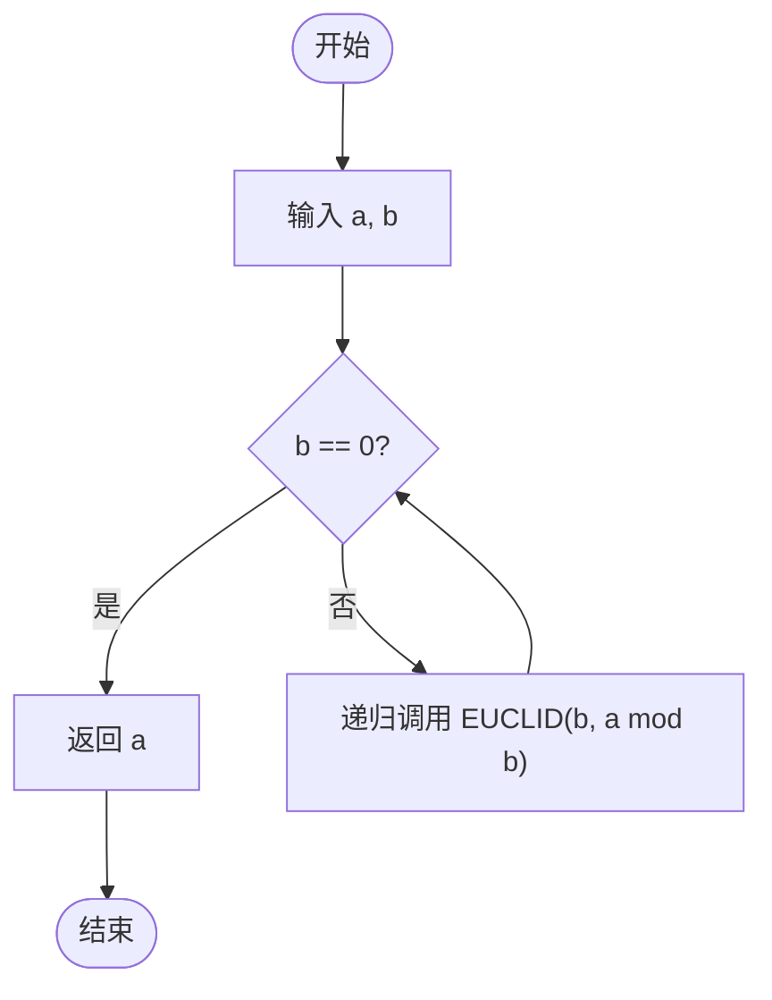
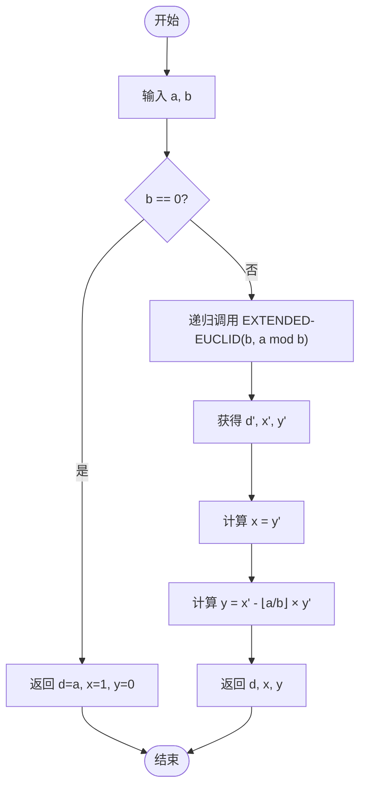

---

## 相关笔记
- 前置笔记：[[第30章_多项式与FFT-章节汇总]]
- 关联概念：[[离散数学/concepts/整除]]、[[离散数学/concepts/最大公约数]]、[[离散数学/concepts/欧几里得算法]]、[[离散数学/concepts/贝祖定理]]、[[离散数学/concepts/素数]]、[[离散数学/concepts/算术基本定理]]
- 章节汇总：[[第31章_数论算法-章节汇总]]

---

> [!abstract] 概览
> 本节涵盖CLRS第31章前两节的核心内容，为数论算法奠定数学基础。
>
> **31.1 初等数论概念**：建立整除性（divisibility）、素数与合数（prime/composite）、算术基本定理（fundamental theorem of arithmetic）等基本概念，并定义最大公约数（greatest common divisor, GCD）与最小公倍数（least common multiple, LCM）。
>
> **31.2 最大公约数**：介绍==欧几里得算法（Euclidean algorithm）==——人类历史上最古老的算法之一，通过==辗转相除==高效计算GCD；进而介绍==扩展欧几里得算法（extended Euclidean algorithm）==，不仅求出GCD，还求出满足==贝祖恒等式（Bézout identity）==的系数；最后给出==Lamé定理==，分析欧几里得算法的最坏情况复杂度。
>
> **核心要点**：
> - 整除性是所有数论概念的基石
> - 算术基本定理保证素因数分解的唯一性
> - 欧几里得算法基于 $\gcd(a, b) = \gcd(b, a \bmod b)$ 的递归关系
> - 扩展欧几里得算法可同时求出贝祖系数，是密码学中计算模逆元的关键工具
> - Lamé定理表明最坏情况下除法次数不超过较小数十进制位数的5倍

---

```mermaid flowchart TD
    A["31.1 初等数论概念"] --> B["整除性 Divisibility"]
    A --> C["素数与合数 Prime & Composite"]
    A --> D["算术基本定理 FTA"]
    A --> E["GCD 与 LCM"]

    B --> B1["定义：d|a ⟺ ∃k: a = dk"]
    B --> B2["性质：传递性、线性组合封闭性"]

    C --> C1["素数：仅有1和自身两个正因子"]
    C --> C2["合数：存在非平凡因子"]

    D --> D1["每个 n > 1 可唯一分解为素数之积"]
    D --> D2["标准形式：n = p₁^e₁ · p₂^e₂ ··· p_k^e_k"]

    E --> E1["gcd(a,b)：最大公共正因子"]
    E --> E2["lcm(a,b)：最小公共正倍数"]
    E --> E3["gcd × lcm = |ab|"]

    F["31.2 最大公约数"] --> G["欧几里得算法 EUCLID"]
    F --> H["扩展欧几里得算法 EXTENDED-EUCLID"]
    F --> I["Lamé定理"]

    G --> G1["核心递归：gcd(a,b) = gcd(b, a mod b)"]
    G --> G2["终止条件：gcd(a,0) = a"]

    H --> H1["返回 (d, x, y) 满足 d = ax + by"]
    H --> H2["贝祖恒等式 Bézout Identity"]

    I --> I1["最坏情况：连续Fibonacci数"]
    I --> I2["除法次数 ≤ 5d（d为十进制位数）"]
```

---

## 核心思想

### 31.1 初等数论概念

#### 整除性（Divisibility）

整除性是数论中最基本的关系。设 $a$ 和 $b$ 为整数，其中 $b > 0$。如果存在某个整数 $k$ 使得 $a = kb$，则称 **$b$ 整除 $a$**（$b$ divides $a$），记作 $b \mid a$。此时也称 $b$ 是 $a$ 的一个**约数**（divisor）或**因子**（factor），$a$ 是 $b$ 的一个**倍数**（multiple）。

如果 $b$ 不能整除 $a$，则记作 $b \nmid a$。

**整除性的基本性质**（以下均设 $a, b, c$ 为整数，且 $d > 0$）：

1. **自反性**：若 $d \mid a$ 且 $d \mid b$，则 $d \mid (a + b)$ 且 $d \mid (a - b)$。
   - 证明：由 $d \mid a$ 知 $a = k_1 d$，由 $d \mid b$ 知 $b = k_2 d$，故 $a + b = (k_1 + k_2)d$，即 $d \mid (a + b)$。同理 $a - b = (k_1 - k_2)d$。

2. **传递性**：若 $a \mid b$ 且 $b \mid c$，则 $a \mid c$。
   - 证明：$b = k_1 a$，$c = k_2 b = k_2 k_1 a$，故 $a \mid c$。

3. **线性组合封闭性**：若 $d \mid a$ 且 $d \mid b$，则对任意整数 $x, y$，有 $d \mid (ax + by)$。
   - 证明：$a = k_1 d$，$b = k_2 d$，故 $ax + by = (k_1 x + k_2 y)d$。

4. **比较性质**：若 $d \mid a$ 且 $a \neq 0$，则 $|d| \leq |a|$。
   - 证明：$a = kd$ 且 $k \neq 0$（否则 $a = 0$），故 $|a| = |k| \cdot |d| \geq |d|$。

5. **整除等价**：$d \mid a$ 当且仅当 $(-d) \mid a$，当且仅当 $d \mid (-a)$。
   - 证明：$a = kd \Leftrightarrow a = (-k)(-d) \Leftrightarrow -a = (-k)d$。

**除法基本定理（Division Theorem）**：对任意整数 $a$ 和正整数 $n$，存在唯一整数对 $(q, r)$ 使得

$$a = nq + r, \quad 0 \leq r < n$$

其中 $q = \lfloor a/n \rfloor$ 称为**商**（quotient），$r = a \bmod n$ 称为**余数**（remainder）。

**唯一性的证明**：假设存在两组 $(q_1, r_1)$ 和 $(q_2, r_2)$ 都满足条件，则 $nq_1 + r_1 = nq_2 + r_2$，即 $n(q_1 - q_2) = r_2 - r_1$。由于 $0 \leq r_1, r_2 < n$，故 $|r_2 - r_1| < n$。而 $n(q_1 - q_2)$ 是 $n$ 的倍数，唯一满足 $|n(q_1 - q_2)| < n$ 的整数是 $0$，故 $q_1 = q_2$，$r_1 = r_2$。

#### 素数与合数（Prime and Composite Numbers）

**素数**（prime number）是大于1的正整数 $p$，其正因子只有1和 $p$ 本身。前几个素数为：2, 3, 5, 7, 11, 13, 17, 19, 23, 29, ...

**合数**（composite number）是大于1的非素数正整数，即存在某个整数 $a$（$1 < a < n$）使得 $a \mid n$。

**关键性质**：

- **素数有无穷多个**：这是欧几里得在《几何原本》第九卷命题20中证明的。证明采用反证法：假设素数只有有限个 $p_1, p_2, \ldots, p_k$，考虑 $N = p_1 p_2 \cdots p_k + 1$。$N$ 要么本身是素数（不在列表中），要么有一个素因子不在列表中（因为 $N$ 除以任何 $p_i$ 余1），矛盾。

- **素因子性质**：若 $p$ 为素数且 $p \mid ab$，则 $p \mid a$ 或 $p \mid b$。
  - 证明思路：若 $p \nmid a$，则 $\gcd(p, a) = 1$，由贝祖恒等式存在 $x, y$ 使得 $px + ay = 1$，两边乘以 $b$ 得 $pbx + aby = b$。由于 $p \mid ab$，故 $p \mid (pbx + aby) = b$。

#### 算术基本定理（Fundamental Theorem of Arithmetic）

**定理**：每个大于1的整数 $n$ 都可以唯一地表示为素数的乘积（不计因子的排列顺序），即

$$n = p_1^{e_1} \cdot p_2^{e_2} \cdots p_k^{e_k}$$

其中 $p_1 < p_2 < \cdots < p_k$ 为素数，$e_i \geq 1$ 为正整数指数。这称为 $n$ 的**标准素因数分解**（canonical prime factorization）。

**唯一性的证明思路**（反证法）：

【反证法（最小反例法）】：假设存在大于1的整数可以以不止一种方式分解为素数之积。令 $n$ 为最小的这样的整数。

1. 若 $n$ 是素数，则只有一种分解方式（自身），矛盾。
2. 故 $n$ 是合数。设 $n = p_1 p_2 \cdots p_r = q_1 q_2 \cdots q_s$ 是两种不同的素因数分解。
3. 由于 $p_1 \mid n = q_1 q_2 \cdots q_s$，由素因子性质，$p_1$ 必整除某个 $q_j$。
4. 由于 $q_j$ 也是素数，故 $p_1 = q_j$。
5. 两边除以 $p_1$，得到 $n/p_1$ 有两种不同的素因数分解，但 $n/p_1 < n$，与 $n$ 的最小性矛盾。

**推论**：利用标准素因数分解，可以方便地计算GCD和LCM。若

$$a = p_1^{e_1} p_2^{e_2} \cdots p_k^{e_k}, \quad b = p_1^{f_1} p_2^{f_2} \cdots p_k^{f_k}$$

（允许某些指数为0），则

$$\gcd(a, b) = \prod_{i=1}^{k} p_i^{\min(e_i, f_i)}, \quad \text{lcm}(a, b) = \prod_{i=1}^{k} p_i^{\max(e_i, f_i)}$$

#### 最大公约数与最小公倍数（GCD and LCM）

**最大公约数**（Greatest Common Divisor, GCD）：两个不全为零的整数 $a$ 和 $b$ 的最大公约数 $\gcd(a, b)$ 是能同时整除 $a$ 和 $b$ 的最大正整数。

**最小公倍数**（Least Common Multiple, LCM）：两个正整数 $a$ 和 $b$ 的最小公倍数 $\text{lcm}(a, b)$ 是同时被 $a$ 和 $b$ 整除的最小正整数。

**GCD与LCM的核心关系**：

$$\gcd(a, b) \times \text{lcm}(a, b) = |ab|$$

**证明**：利用素因数分解，对每个素因子 $p_i$，其在 $\gcd$ 中的指数为 $\min(e_i, f_i)$，在 $\text{lcm}$ 中的指数为 $\max(e_i, f_i)$，而 $\min(e_i, f_i) + \max(e_i, f_i) = e_i + f_i$，故乘积恢复为 $p_i^{e_i + f_i}$，即 $ab$ 的素因数分解。

**互素**（Relatively Prime / Coprime）：若 $\gcd(a, b) = 1$，则称 $a$ 和 $b$ 互素。

**素因数分解实例**：

- $60 = 2^2 \times 3 \times 5$
- $84 = 2^2 \times 3 \times 7$
- $\gcd(60, 84) = 2^{\min(2,2)} \times 3^{\min(1,1)} \times 5^{\min(1,0)} \times 7^{\min(0,1)} = 2^2 \times 3 = 12$
- $\text{lcm}(60, 84) = 2^{\max(2,2)} \times 3^{\max(1,1)} \times 5^{\max(1,0)} \times 7^{\max(0,1)} = 2^2 \times 3 \times 5 \times 7 = 420$
- 验证：$\gcd(60, 84) \times \text{lcm}(60, 84) = 12 \times 420 = 5040 = 60 \times 84$。$\checkmark$

**GCD的等价定义**：$\gcd(a, b)$ 也可以定义为 $a$ 和 $b$ 的所有线性组合 $\{ax + by : x, y \in \mathbb{Z}\}$ 中的最小正元素。这一定义直接联系到贝祖恒等式，也是扩展欧几里得算法的理论基础。

---

### 31.2 最大公约数

#### 欧几里得算法（Euclidean Algorithm）

欧几里得算法基于以下关键定理：

**定理（GCD递归性质）**：对任意非负整数 $a$ 和正整数 $b$，

$$\gcd(a, b) = \gcd(b, a \bmod b)$$

**证明**：

设 $d = \gcd(a, b)$。需要证明 $d$ 也是 $\gcd(b, a \bmod b)$，即证明两个集合的正因子相同。

1. 由除法基本定理，$a = bq + r$，其中 $r = a \bmod b$，$0 \leq r < b$。
2. 若 $d \mid a$ 且 $d \mid b$，则 $d \mid (a - bq) = r$，故 $d \mid b$ 且 $d \mid r$，即 $d$ 是 $b$ 和 $r$ 的公因子。
3. 反之，若 $d' \mid b$ 且 $d' \mid r$，则 $d' \mid (bq + r) = a$，故 $d'$ 也是 $a$ 和 $b$ 的公因子。
4. 因此 $a$ 和 $b$ 的公因子集合与 $b$ 和 $r$ 的公因子集合完全相同，它们的最大值自然相等。

**伪代码**（CLRS风格，使用Unicode符号）：

```
EUCLID(a, b)
1  if b == 0
2      return a
3  else return EUCLID(b, a mod b)
```

**执行流程图：**



**逐步执行实例**：计算 $\gcd(30, 21)$

| 调用 | a | b | a mod b | 返回值 |
|------|---|---|---------|--------|
| EUCLID(30, 21) | 30 | 21 | 9 | EUCLID(21, 9) |
| EUCLID(21, 9) | 21 | 9 | 3 | EUCLID(9, 3) |
| EUCLID(9, 3) | 9 | 3 | 0 | EUCLID(3, 0) |
| EUCLID(3, 0) | 3 | 0 | — | 3 |

因此 $\gcd(30, 21) = 3$。

**再计算一个实例**：$\gcd(270, 192)$

| 调用 | a | b | a mod b |
|------|-----|-----|---------|
| EUCLID(270, 192) | 270 | 192 | 78 |
| EUCLID(192, 78) | 192 | 78 | 36 |
| EUCLID(78, 36) | 78 | 36 | 6 |
| EUCLID(36, 6) | 36 | 6 | 0 |
| EUCLID(6, 0) | 6 | 0 | — |

因此 $\gcd(270, 192) = 6$。

#### 扩展欧几里得算法（Extended Euclidean Algorithm）

扩展欧几里得算法不仅计算 $\gcd(a, b)$，还找出整数 $x$ 和 $y$（称为**贝祖系数**，Bézout coefficients），使得

$$ax + by = \gcd(a, b)$$

这个等式称为**贝祖恒等式**（Bézout identity）。

**定理（贝祖定理）**：对任意整数 $a$ 和 $b$（不全为零），存在整数 $x$ 和 $y$ 使得 $ax + by = \gcd(a, b)$。

**证明思路**（基于欧几里得算法的回代）：

欧几里得算法产生一系列等式：

$$a = bq_1 + r_1$$
$$b = r_1 q_2 + r_2$$
$$r_1 = r_2 q_3 + r_3$$
$$\vdots$$
$$r_{k-2} = r_{k-1} q_k + r_k$$
$$r_{k-1} = r_k q_{k+1} + 0$$

其中 $r_k = \gcd(a, b)$。从倒数第二个等式开始，将 $r_k$ 表示为 $r_{k-2}$ 和 $r_{k-1}$ 的线性组合，再逐步回代，最终得到 $r_k = ax + by$。

**伪代码**：

```
EXTENDED-EUCLID(a, b)
1  if b == 0
2      return (a, 1, 0)
3  else (d', x', y') ← EXTENDED-EUCLID(b, a mod b)
4      (d, x, y) ← (d', y', x' - ⌊a/b⌋ · y')
5      return (d, x, y)
```

**执行流程图：**



算法返回三元组 $(d, x, y)$，其中 $d = \gcd(a, b)$，且 $d = ax + by$。

**正确性证明**：

【数学归纳法（对递归深度）】：

- **基础情况**：当 $b = 0$ 时，返回 $(a, 1, 0)$。此时 $\gcd(a, 0) = a$，且 $a \cdot 1 + 0 \cdot 0 = a$，正确。
- **归纳步骤**：假设递归调用 `EXTENDED-EUCLID(b, a mod b)` 正确返回 $(d', x', y')$，满足 $d' = bx' + (a \bmod b) \cdot y'$。由于 $d' = \gcd(b, a \bmod b) = \gcd(a, b) = d$，且 $a \bmod b = a - \lfloor a/b \rfloor \cdot b$，代入得：
  $$d = bx' + (a - \lfloor a/b \rfloor \cdot b) \cdot y' = a y' + b(x' - \lfloor a/b \rfloor \cdot y')$$
  令 $x = y'$，$y = x' - \lfloor a/b \rfloor \cdot y'$，则 $d = ax + by$，正确。

**逐步执行实例**：计算 $\gcd(30, 21)$ 及贝祖系数

```
EXTENDED-EUCLID(30, 21)
  → EXTENDED-EUCLID(21, 9)
    → EXTENDED-EUCLID(9, 3)
      → EXTENDED-EUCLID(3, 0)
        → 返回 (3, 1, 0)
      → d'=3, x'=1, y'=0
      → x = y' = 0, y = x' - ⌊9/3⌋·y' = 1 - 3·0 = 1
      → 返回 (3, 0, 1)
    → d'=3, x'=0, y'=1
    → x = y' = 1, y = x' - ⌊21/9⌋·y' = 0 - 2·1 = -2
    → 返回 (3, 1, -2)
  → d'=3, x'=1, y'=-2
  → x = y' = -2, y = x' - ⌊30/21⌋·y' = 1 - 1·(-2) = 3
  → 返回 (3, -2, 3)
```

验证：$30 \times (-2) + 21 \times 3 = -60 + 63 = 3 = \gcd(30, 21)$。正确。

**再计算一个实例**：$\text{EXTENDED-EUCLID}(99, 78)$

```
EXTENDED-EUCLID(99, 78)
  → EXTENDED-EUCLID(78, 21)
    → EXTENDED-EUCLID(21, 15)
      → EXTENDED-EUCLID(15, 6)
        → EXTENDED-EUCLID(6, 3)
          → EXTENDED-EUCLID(3, 0)
            → 返回 (3, 1, 0)
          → x=0, y=1-⌊6/3⌋·0=1 → 返回 (3, 0, 1)
        → x=1, y=0-⌊15/6⌋·1=0-2=-2 → 返回 (3, 1, -2)
      → x=-2, y=1-⌊21/15⌋·(-2)=1-1·(-2)=3 → 返回 (3, -2, 3)
    → x=3, y=-2-⌊78/21⌋·3=-2-3·3=-11 → 返回 (3, 3, -11)
  → x=-11, y=3-⌊99/78⌋·(-11)=3-1·(-11)=14 → 返回 (3, -11, 14)
```

验证：$99 \times (-11) + 78 \times 14 = -1089 + 1092 = 3 = \gcd(99, 78)$。正确。

**贝祖恒等式的推论与应用**：

1. **GCD的线性组合刻画**：$\gcd(a, b)$ 是所有形如 $ax + by$（$x, y \in \mathbb{Z}$）的数中最小的正整数。任何 $a$ 和 $b$ 的公因子都整除 $\gcd(a, b)$。
2. **互素的等价条件**：$\gcd(a, b) = 1$ 当且仅当存在整数 $x, y$ 使得 $ax + by = 1$。这一等价条件在后续的模线性方程求解中至关重要。
3. **模逆元的存在性**：若 $\gcd(a, n) = 1$，则 $a$ 在模 $n$ 下存在乘法逆元 $a^{-1}$，满足 $a \cdot a^{-1} \equiv 1 \pmod{n}$。该逆元可通过扩展欧几里得算法求得。

#### Lamé定理

**定理（Lamé, 1844）**：对于 $k \geq 1$，若欧几里得算法对整数 $a > b > 0$ 执行了恰好 $k$ 次除法（递归调用），且 $a$ 是满足此条件的最小值，则

$$a = F_{k+2}, \quad b = F_{k+1}$$

其中 $\{F_i\}$ 是**斐波那契数列**（Fibonacci sequence），定义为 $F_0 = 0$，$F_1 = 1$，$F_i = F_{i-1} + F_{i-2}$（$i \geq 2$）。

**推论**：对任意 $a > b > 0$，设 $b$ 的十进制位数为 $d$，则欧几里得算法的除法次数不超过 $5d$。

**证明思路**：

【利用Fibonacci数列的增长速度】：

1. 由Lamé定理，执行 $k$ 次除法需要 $b \geq F_{k+1}$。
2. Fibonacci数列的增长满足 $F_{k+1} \geq \phi^{k-1}$（其中 $\phi = (1+\sqrt{5})/2 \approx 1.618$ 为黄金比例）。
3. 因此 $k - 1 \leq \log_\phi b$，即 $k \leq \log_\phi b + 1$。
4. 由于 $\log_\phi b = \ln b / \ln \phi \approx 2.078 \ln b$，而 $b$ 有 $d$ 位十进制数意味着 $b \geq 10^{d-1}$。
5. 故 $k \leq \log_\phi(10^d) + 1 = d \cdot \log_\phi 10 + 1 \approx d \cdot 4.785 + 1 < 5d$（当 $d \geq 1$ 时）。

**最坏情况实例**：计算 $\gcd(F_{k+2}, F_{k+1})$

以 $\gcd(21, 13)$（$F_8 = 21$，$F_7 = 13$）为例：

| 调用 | a | b | a mod b |
|------|----|----|---------|
| EUCLID(21, 13) | 21 | 13 | 8 |
| EUCLID(13, 8) | 13 | 8 | 5 |
| EUCLID(8, 5) | 8 | 5 | 3 |
| EUCLID(5, 3) | 5 | 3 | 2 |
| EUCLID(3, 2) | 3 | 2 | 1 |
| EUCLID(2, 1) | 2 | 1 | 0 |
| EUCLID(1, 0) | 1 | 0 | — |

共执行6次除法。$b = 13$ 有 $d = 2$ 位，$5d = 10 \geq 6$，满足Lamé定理的界。

**欧几里得算法的迭代版本**：

除了递归版本，欧几里得算法也可以写成迭代形式。迭代版本避免了递归调用的开销，在实际编程中更为常用：

```
ITERATIVE-EUCLID(a, b)
1  while b ≠ 0
2      (a, b) ← (b, a mod b)
3  return a
```

**迭代版本执行实例**：计算 $\gcd(30, 21)$

| 步骤 | a | b | a mod b |
|------|----|----|---------|
| 初始 | 30 | 21 | — |
| 第1次 | 21 | 9 | 30 mod 21 = 9 |
| 第2次 | 9 | 3 | 21 mod 9 = 3 |
| 第3次 | 3 | 0 | 9 mod 3 = 0 |
| 返回 | 3 | — | — |

**欧几里得算法的复杂度分析**：

- **时间复杂度**：由Lamé定理，除法次数为 $O(\log b)$，其中 $b$ 为较小数。由于每次除法运算的时间为 $O(1)$（假设整数运算为常数时间），总时间复杂度为 $O(\log b)$。若考虑大整数的实际运算成本，使用标准除法时为 $O(\beta^2 \log b)$，其中 $\beta$ 为表示 $a$ 和 $b$ 所需的位数。
- **空间复杂度**：递归版本需要 $O(\log b)$ 的栈空间；迭代版本仅需 $O(1)$ 的额外空间。

---

> [!info] 欧几里得算法的历史渊源
> 欧几里得算法是已知最古老的算法之一，可追溯至约公元前300年。它首次出现在欧几里得的《几何原本》（*Elements*）第七卷命题2中。欧几里得以几何的方式描述该算法——通过"反复从较大数中减去较小数"来寻找两个数的"公度"（common measure）。有趣的是，中国古代数学典籍《九章算术》中也独立出现了类似的"更相减损术"。该算法历经2300余年仍被广泛使用，堪称算法史上最伟大的成就之一。
> - 来源：[Euclid - Number Theory | Britannica](https://www.britannica.com/science/number-theory/Euclid#ref796461)

> [!info] Lamé定理与Fibonacci数列
> 法国数学家Gabriel Lamé于1844年证明了欧几里得算法的最坏情况分析，这是Fibonacci数列在算法分析中的首次应用。Lamé证明了：若欧几里得算法需要 $k$ 次除法，则输入的两个数至少分别为 $F_{k+2}$ 和 $F_{k+1}$。这意味着连续的Fibonacci数对构成了欧几里得算法的最坏情况输入。Knuth后来给出了更精确的界：对于 $0 < u, v < N$，除法次数不超过 $\lceil \log_\phi(\sqrt{5}N) \rceil - 2$。
> - 来源：[Lamé's Theorem - Cut the Knot](https://www.cut-the-knot.org/blue/LamesTheorem.shtml)

> [!info] 扩展欧几里得算法在密码学中的应用
> 扩展欧几里得算法是现代密码学的核心工具之一。在RSA加密系统中，生成密钥时需要计算公钥指数 $e$ 在模 $\phi(n)$ 下的**模逆元**（modular inverse）$d$，即求 $d$ 使得 $ed \equiv 1 \pmod{\phi(n)}$，这正是扩展欧几里得算法求解贝祖恒等式的直接应用。在Diffie-Hellman密钥交换协议中，扩展欧几里得算法同样用于确保共享密钥的正确计算。几乎所有依赖模运算的公钥密码系统都离不开这一算法。
> - 来源：[The Extended Euclidean Algorithm | Cryptography Academy](https://cryptographyacademy.com/diffie-hellman/)

> [!info] 算术基本定理的唯一性
> 算术基本定理（又称唯一分解定理）断言每个大于1的整数都可以唯一地表示为素数的乘积。这一定理的本质可追溯到欧几里得《几何原本》第七卷命题32和第九卷命题14。Gauss在1801年的《算术研究》（*Disquisitiones Arithmeticae*）中首次给出了符合现代严格标准的证明。该定理是数论的基石之一，它保证了素数确实是整数世界的"原子"——所有整数都由素数唯一构建而成。
> - 来源：[Fundamental Theorem of Arithmetic | Britannica](https://www.britannica.com/science/number-theory/Euclid#ref796461)

---

> [!warning] GCD与LCM的关系容易记混
> GCD取的是每个素因子指数的**最小值**，LCM取的是**最大值**。一个常见的错误是混淆两者。记住：GCD是"公约数"（共同的约数），所以取"较小"的指数；LCM是"公倍数"（共同的倍数），所以取"较大"的指数。恒等式 $\gcd(a,b) \times \text{lcm}(a,b) = |ab|$ 可以帮助验证计算结果。例如 $\gcd(12, 18) = 6$，$\text{lcm}(12, 18) = 36$，$6 \times 36 = 216 = 12 \times 18$。

> [!warning] 素数与不可约数的区别
> 在整数环 $\mathbb{Z}$ 中，"素数"（prime）和"不可约数"（irreducible）是等价的概念。但在更一般的整环中，两者可能不同。一个元素 $p$ 是**素元**（prime）如果 $p \mid ab$ 推出 $p \mid a$ 或 $p \mid b$；$p$ 是**不可约元**（irreducible）如果 $p = ab$ 推出 $a$ 或 $b$ 是单位。在 $\mathbb{Z}$ 中两者等价，但在 $\mathbb{Z}[\sqrt{-5}]$ 等环中，存在不可约但非素的元素。算术基本定理依赖于素元与不可约元的等价性，这也是唯一分解整环（UFD）的核心特征。

> [!warning] 扩展欧几里得算法返回的贝祖系数可以是负数
> EXTENDED-EUCLID 返回的 $x$ 和 $y$ 不一定是正数。例如 $\text{EXTENDED-EUCLID}(30, 21)$ 返回 $(-2, 3)$，其中 $x = -2$ 是负数。这在密码学中计算模逆元时需要注意：若求 $a$ 在模 $n$ 下的逆元，得到 $x$ 后需要取 $x \bmod n$ 确保结果为正。例如若扩展欧几里得返回 $x = -11$，模 $n = 78$ 的逆元为 $-11 \bmod 78 = 67$，验证 $99 \times 67 \bmod 78 = 6633 \bmod 78 = 1$。

---

## 习题精选

| 题号 | 题目描述 | 难度 |
|------|---------|------|
| 31.1-1 | 证明：若 $a \mid b$ 且 $b \mid a$，则 $a = b$ 或 $a = -b$（假设 $a, b \neq 0$） | ★☆☆ |
| 31.1-5 | 证明：若 $a, b$ 为正整数且 $a \mid b$，则 $\gcd(a, b) = a$ | ★☆☆ |
| 31.1-6 | 证明：$\gcd(a, b, c) = \gcd(\gcd(a, b), c)$，推广GCD到多个参数 | ★★☆ |
| 31.2-2 | 手动执行 EXTENDED-EUCLID(252, 198)，验证贝祖恒等式 | ★★☆ |

> [!faq]- 31.1-1 解答
> **证明**：由 $a \mid b$ 知存在整数 $k_1$ 使得 $b = k_1 a$。由 $b \mid a$ 知存在整数 $k_2$ 使得 $a = k_2 b$。
>
> 将 $b = k_1 a$ 代入 $a = k_2 b$，得 $a = k_2 k_1 a$。由于 $a \neq 0$，两边除以 $a$ 得 $k_1 k_2 = 1$。
>
> 由于 $k_1, k_2$ 都是整数，满足 $k_1 k_2 = 1$ 的整数对只有 $(1, 1)$ 和 $(-1, -1)$。
>
> - 若 $k_1 = 1$，则 $b = a$。
> - 若 $k_1 = -1$，则 $b = -a$。
>
> 因此 $a = b$ 或 $a = -b$。$\blacksquare$

> [!faq]- 31.1-5 解答
> **证明**：由于 $a \mid b$，存在整数 $k$ 使得 $b = ka$。
>
> 设 $d = \gcd(a, b)$。由于 $d \mid a$（因为 $d$ 是 $a$ 和 $b$ 的公因子），且 $a \mid b$，由整除的传递性得 $d \mid b$。
>
> 另一方面，$a$ 本身就是 $a$ 和 $b$ 的公因子（因为 $a \mid a$ 且 $a \mid b$）。
>
> 因此 $d$ 是 $a$ 和 $b$ 的最大公因子，而 $a$ 也是公因子，故 $d \geq a$。同时 $d \mid a$ 意味着 $d \leq |a| = a$（因为 $a > 0$）。
>
> 故 $d = a$，即 $\gcd(a, b) = a$。$\blacksquare$

> [!faq]- 31.1-6 解答
> **证明**：令 $d = \gcd(a, b, c)$，$d' = \gcd(\gcd(a, b), c)$。需要证明 $d = d'$。
>
> **第一部分**：$d \mid d'$。
> - $d$ 是 $a, b, c$ 的公因子，故 $d \mid a$ 且 $d \mid b$，因此 $d \mid \gcd(a, b)$。
> - 又 $d \mid c$，故 $d$ 是 $\gcd(a, b)$ 和 $c$ 的公因子，因此 $d \mid \gcd(\gcd(a, b), c) = d'$。
>
> **第二部分**：$d' \mid d$。
> - $d' = \gcd(\gcd(a, b), c)$，故 $d' \mid \gcd(a, b)$ 且 $d' \mid c$。
> - 由 $d' \mid \gcd(a, b)$ 知 $d' \mid a$ 且 $d' \mid b$。
> - 因此 $d'$ 是 $a, b, c$ 的公因子，故 $d' \mid \gcd(a, b, c) = d$。
>
> 由 $d \mid d'$ 和 $d' \mid d$，且 $d, d' > 0$，得 $d = d'$。$\blacksquare$

> [!faq]- 31.2-2 解答
> **执行 EXTENDED-EUCLID(252, 198)**：
>
> ```
> EXTENDED-EUCLID(252, 198)
>   → EXTENDED-EUCLID(198, 54)       // 252 = 198·1 + 54
>     → EXTENDED-EUCLID(54, 36)       // 198 = 54·3 + 36
>       → EXTENDED-EUCLID(36, 18)     // 54 = 36·1 + 18
>         → EXTENDED-EUCLID(18, 0)    // 36 = 18·2 + 0
>           → 返回 (18, 1, 0)
>         → x=0, y=1-⌊36/18⌋·0=1 → 返回 (18, 0, 1)
>       → x=1, y=0-⌊54/36⌋·1=0-1=-1 → 返回 (18, 1, -1)
>     → x=-1, y=1-⌊198/54⌋·(-1)=1-3·(-1)=4 → 返回 (18, -1, 4)
>   → x=4, y=-1-⌊252/198⌋·4=-1-1·4=-5 → 返回 (18, 4, -5)
> ```
>
> **结果**：$\gcd(252, 198) = 18$，贝祖系数 $x = 4$，$y = -5$。
>
> **验证**：$252 \times 4 + 198 \times (-5) = 1008 - 990 = 18 = \gcd(252, 198)$。$\blacksquare$

**补充练习**：利用扩展欧几里得算法求 $35$ 在模 $12$ 下的逆元。

> [!faq]- 补充练习解答
> 执行 $\text{EXTENDED-EUCLID}(35, 12)$：
>
> ```
> EXTENDED-EUCLID(35, 12)
>   → EXTENDED-EUCLID(12, 11)        // 35 = 12·2 + 11
>     → EXTENDED-EUCLID(11, 1)        // 12 = 11·1 + 1
>       → EXTENDED-EUCLID(1, 0)       // 11 = 1·11 + 0
>         → 返回 (1, 1, 0)
>       → x=0, y=1-⌊11/1⌋·0=1 → 返回 (1, 0, 1)
>     → x=1, y=0-⌊12/11⌋·1=0-1=-1 → 返回 (1, 1, -1)
>   → x=-1, y=1-⌊35/12⌋·(-1)=1-2·(-1)=3 → 返回 (1, -1, 3)
> ```
>
> $\gcd(35, 12) = 1$，贝祖系数 $x = -1$，$y = 3$。
>
> $35$ 在模 $12$ 下的逆元为 $-1 \bmod 12 = 11$。
>
> 验证：$35 \times 11 = 385 = 32 \times 12 + 1$，故 $35 \times 11 \equiv 1 \pmod{12}$。$\blacksquare$

---

## 视频学习指南

以下视频资源按推荐学习顺序排列，从基础概念到进阶应用：

| 资源名称 | 讲者/平台 | 内容 | 链接 |
|---------|----------|------|------|
| MIT 6.046J Lecture 11: Integer Arithmetic | Prof. Erik Demaine | GCD、欧几里得算法、扩展欧几里得算法的系统讲解 | [YouTube](https://www.youtube.com/watch?v=7sAUZ0dKr-4) |
| 3Blue1Brown: The Fibonacci sequence and the Euclidean algorithm | 3Blue1Brown | 可视化展示Fibonacci数列与欧几里得算法最坏情况的联系 | [YouTube](https://www.youtube.com/watch?v=QvX0_KA7kH0) |
| Khan Academy: Euclidean algorithm | Khan Academy | 欧几里得算法的基础讲解与练习 | [Khan Academy](https://www.khanacademy.org/computing/computer-science/cryptography/modarithmetic/a/the-euclidean-algorithm) |
| Michael Penn: The Extended Euclidean Algorithm | Michael Penn | 扩展欧几里得算法的详细推导与实例 | [YouTube](https://www.youtube.com/watch?v=Z8h2LQSm4jM) |

**学习建议**：建议先观看Khan Academy的基础视频建立直觉，再通过3Blue1Brown的可视化理解Fibonacci数列与最坏情况的联系，最后通过MIT OCW课程获得严谨的理论框架。

---

> [!quote] CLRS教材原文
> **关于整除性的定义**（31.1节）：
> "We say that $b \mid a$ if there exists an integer $k$ such that $a = kb$. We also say that $b$ divides $a$, $b$ is a divisor of $a$, and $a$ is a multiple of $b$."
>
> **关于算术基本定理**（31.1节）：
> "A composite number can be factored uniquely into prime numbers. More precisely, theorem 31.9 states that every integer greater than $1$ can be written uniquely as a product of primes in nondecreasing order."
>
> **关于欧几里得算法**（31.2节）：
> "The Euclidean algorithm is based on the following theorem: For any nonnegative integer $a$ and any positive integer $b$, $\gcd(a, b) = \gcd(b, a \bmod b)$."
>
> **关于扩展欧几里得算法**（31.2节）：
> "The EXTENDED-EUCLID procedure is a variation of the Euclidean algorithm. In addition to computing $\gcd(a, b)$, it also computes integers $x$ and $y$ satisfying the equation $d = ax + by$."

---

## 参见Wiki

- [[离散数学/concepts/整除]] — 整除性的定义与性质
- [[离散数学/concepts/素数]] — 素数的定义、判定与素数定理
- [[离散数学/concepts/算术基本定理]] — 唯一素因数分解定理
- [[离散数学/concepts/最大公约数]] — GCD的定义、性质与计算
- [[离散数学/concepts/欧几里得算法]] — 辗转相除法的详细分析
- [[离散数学/concepts/贝祖定理]] — 贝祖恒等式及其应用
- [[离散数学/concepts/模运算]] — 模运算的基本定义与性质
- [[离散数学/concepts/模逆元]] — 模逆元的定义、存在条件与计算
- [[第31章_数论算法-章节汇总]] — 第31章完整内容汇总
- [[第31章_数论算法/31.2 模运算与中国剩余定理]] — 下一节：模运算与中国剩余定理

#学习/算法导论/第31章-数论算法
