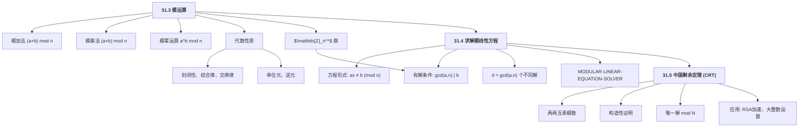
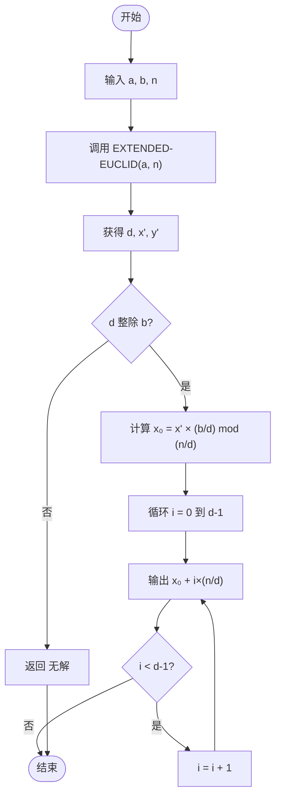
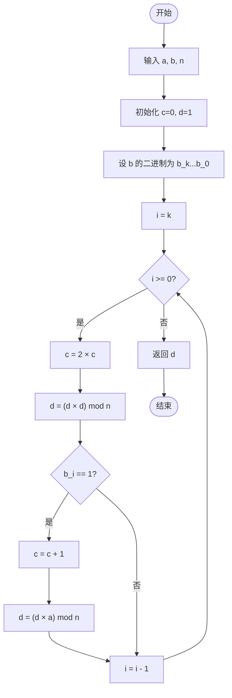

## 相关笔记
- 前置笔记：[[31.1 初等数论与最大公约数]]、[[第30章_多项式与FFT-章节汇总]]
- 关联概念：[[离散数学/concepts/模运算]]、[[离散数学/concepts/同余]]、[[离散数学/concepts/中国剩余定理]]、[[离散数学/concepts/模逆元]]、[[离散数学/concepts/费马小定理]]、[[离散数学/concepts/欧拉函数]]
- 章节汇总：[[第31章_数论算法-章节汇总]]

---

> [!abstract] 概览
> 本节覆盖 CLRS 第 4 版第 31 章的 31.3（模运算）、31.4（求解模线性方程）和 31.5（中国剩余定理）三个小节。模运算（[[离散数学/concepts/模运算]]）是数论算法的核心计算工具，它将整数运算限制在一个有限集合 $\mathbb{Z}_n = \{0, 1, \ldots, n-1\}$ 上，使得加法、乘法和幂运算的结果始终落在有限范围内。在此基础上，我们研究模线性方程 $ax \equiv b \pmod{n}$ 的求解方法——其有解条件为 $\gcd(a, n) \mid b$，解的个数恰好等于 $d = \gcd(a, n)$。最后，中国剩余定理（[[离散数学/concepts/中国剩余定理]]，CRT）给出了一套构造性方法，将多个两两互素模数下的同余方程合并为唯一解，这一结果在密码学（特别是 RSA 加速解密）和大整数运算中有着极为重要的应用。

---

## 知识结构总览



---

## 核心思想

### 31.3 模运算

#### 模的定义与基本运算

给定正整数 $n$，对于任意整数 $a$，$a \bmod n$ 定义为 $a$ 除以 $n$ 的非负余数，即满足 $a = qn + r$ 且 $0 \leq r < n$ 的唯一整数 $r$。模等价（同余）关系记为 $a \equiv b \pmod{n}$，其含义是 $n \mid (a - b)$。

**模加法**：$(a + b) \bmod n$。先计算普通加法 $a + b$，再取模。

**模乘法**：$(a \times b) \bmod n$。先计算普通乘法 $a \times b$，再取模。

**模幂运算**：$a^b \bmod n$。利用重复平方法（square-and-multiply），将指数 $b$ 的二进制展开逐步计算，避免直接计算巨大的 $a^b$。

##### 模幂运算的逐步执行实例

计算 $7^{10} \bmod 13$：

将指数 10 写成二进制：$10 = (1010)_2 = 8 + 2$。

| 步骤 | 指数位 | 当前结果 $r$ | 底数 $a$ | 操作 |
|------|--------|-------------|---------|------|
| 初始 | — | 1 | 7 | — |
| 位 0（=0） | 0 | 1 | $7^2 = 49 \equiv 10$ | 底数平方取模 |
| 位 1（=1） | 1 | $1 \times 10 = 10$ | $10^2 = 100 \equiv 9$ | 乘入结果，底数平方取模 |
| 位 2（=0） | 0 | 10 | $9^2 = 81 \equiv 3$ | 底数平方取模 |
| 位 3（=1） | 1 | $10 \times 3 = 30 \equiv 4$ | — | 乘入结果 |

最终结果：$7^{10} \bmod 13 = 4$。

验证：$7^2 = 49 \equiv 10$，$7^4 \equiv 10^2 = 100 \equiv 9$，$7^8 \equiv 9^2 = 81 \equiv 3$，故 $7^{10} = 7^8 \times 7^2 \equiv 3 \times 10 = 30 \equiv 4 \pmod{13}$。正确。

#### 模运算的代数性质

集合 $\mathbb{Z}_n = \{0, 1, 2, \ldots, n-1\}$ 在模加法和模乘法下构成一个**交换环**。以下是关键性质：

| 性质 | 加法 | 乘法 |
|------|------|------|
| **封闭性** | 若 $a, b \in \mathbb{Z}_n$，则 $(a + b) \bmod n \in \mathbb{Z}_n$ | 若 $a, b \in \mathbb{Z}_n$，则 $(a \times b) \bmod n \in \mathbb{Z}_n$ |
| **结合律** | $(a + b) + c \equiv a + (b + c) \pmod{n}$ | $(a \times b) \times c \equiv a \times (b \times c) \pmod{n}$ |
| **交换律** | $a + b \equiv b + a \pmod{n}$ | $a \times b \equiv b \times a \pmod{n}$ |
| **单位元** | $a + 0 \equiv a \pmod{n}$ | $a \times 1 \equiv a \pmod{n}$ |
| **逆元** | 每个 $a$ 都有加法逆元 $n - a$ | 仅当 $\gcd(a, n) = 1$ 时存在乘法逆元 |

##### 证明：模加法满足结合律

**【结合律（逐项展开验证）】**：需要证明 $(a + b) + c \equiv a + (b + c) \pmod{n}$。

设 $a + b = q_1 n + r_1$，其中 $0 \leq r_1 < n$，即 $r_1 = (a + b) \bmod n$。

再设 $r_1 + c = q_2 n + r_2$，其中 $0 \leq r_2 < n$，即 $r_2 = ((a + b) \bmod n + c) \bmod n$。

类似地，设 $b + c = q_3 n + r_3$，$r_3 = (b + c) \bmod n$，再设 $a + r_3 = q_4 n + r_4$，$r_4 = (a + (b + c) \bmod n) \bmod n$。

由于普通整数加法满足结合律：$(a + b) + c = a + (b + c)$，而模运算只是对同一整数取余，因此 $r_2 = r_4$。$\blacksquare$

##### 证明：模乘法满足交换律

**【交换律（利用整数乘法交换律）】**：需要证明 $a \times b \equiv b \times a \pmod{n}$。

由于 $a \times b = b \times a$（整数乘法交换律），两者是同一个整数，取模后自然相等。$\blacksquare$

##### 证明：乘法逆元存在的充要条件

**【乘法逆元存在条件（利用 Bézout 等式）】**：$a \in \mathbb{Z}_n$ 的乘法逆元存在当且仅当 $\gcd(a, n) = 1$。

**充分性**：若 $\gcd(a, n) = 1$，由 [[31.1 初等数论与最大公约数]] 中的扩展欧几里得算法（EXTENDED-EUCLID），存在整数 $x, y$ 使得 $ax + ny = 1$。两边取模 $n$：$ax \equiv 1 \pmod{n}$，因此 $x \bmod n$ 就是 $a$ 在 $\mathbb{Z}_n$ 中的乘法逆元。

**必要性**：若 $a$ 有乘法逆元 $a'$，即 $aa' \equiv 1 \pmod{n}$，则 $aa' + kn = 1$（某个整数 $k$）。设 $d = \gcd(a, n)$，则 $d \mid a$ 且 $d \mid n$，故 $d \mid (aa' + kn) = 1$，因此 $d = 1$。$\blacksquare$

#### $\mathbb{Z}_n^*$ 群

定义 $\mathbb{Z}_n^* = \{a \in \mathbb{Z}_n : \gcd(a, n) = 1\}$，即 $\mathbb{Z}_n$ 中所有与 $n$ 互素的元素构成的集合。$\mathbb{Z}_n^*$ 在模乘法下构成一个**交换群**（[[离散数学/concepts/欧拉函数]]）：

- **封闭性**：若 $\gcd(a, n) = 1$ 且 $\gcd(b, n) = 1$，则 $\gcd(ab, n) = 1$。
- **结合律**：继承自整数乘法的结合律。
- **单位元**：$1 \in \mathbb{Z}_n^*$。
- **逆元**：每个元素都有模乘法逆元（由上述证明）。

$\mathbb{Z}_n^*$ 的阶（元素个数）为 $\varphi(n)$，即 [[离散数学/concepts/欧拉函数]]。

**实例**：$\mathbb{Z}_{10}^* = \{1, 3, 7, 9\}$，$\varphi(10) = 4$。验证：$3 \times 7 = 21 \equiv 1 \pmod{10}$，故 $3^{-1} \equiv 7$，$7^{-1} \equiv 3$。

##### 证明：$\mathbb{Z}_n^*$ 的封闭性

**【封闭性（利用整除性质）】**：若 $\gcd(a, n) = 1$ 且 $\gcd(b, n) = 1$，则 $\gcd(ab, n) = 1$。

**证明**：反证法。假设 $\gcd(ab, n) = d > 1$，则存在素数 $p$ 使得 $p \mid d$，故 $p \mid ab$ 且 $p \mid n$。由于 $p$ 是素数且 $p \mid ab$，由欧几里得引理，$p \mid a$ 或 $p \mid b$。若 $p \mid a$，则 $p \mid \gcd(a, n)$，与 $\gcd(a, n) = 1$ 矛盾。若 $p \mid b$，则 $p \mid \gcd(b, n)$，与 $\gcd(b, n) = 1$ 矛盾。因此 $d = 1$。$\blacksquare$

##### 模运算的分配律

**【分配律（连接加法与乘法的桥梁）】**：模乘法对模加法满足分配律，即 $a \times (b + c) \equiv (a \times b) + (a \times c) \pmod{n}$。

**证明**：$a(b + c) = ab + ac$（整数分配律），而模运算保持等价关系，故 $a(b+c) \bmod n = (ab + ac) \bmod n$。$\blacksquare$

分配律是 $\mathbb{Z}_n$ 构成"环"（而非仅仅是"群"）的关键性质。它确保了模运算中的代数恒等式（如 $(a+b)^2 = a^2 + 2ab + b^2$）在模意义下依然成立。

---

### 31.4 求解模线性方程

#### 问题定义

给定整数 $a$、$b$、$n$（$n > 0$），求解满足 $ax \equiv b \pmod{n}$ 的所有 $x$。

#### 有解条件与解的个数

**【有解条件（利用整除性）】**：方程 $ax \equiv b \pmod{n}$ 有解当且仅当 $\gcd(a, n) \mid b$。

**证明**：$ax \equiv b \pmod{n}$ 当且仅当存在整数 $k$ 使得 $ax = kn + b$，即 $ax - kn = b$。由 Bézout 定理，$ax - kn$ 能取到的所有值恰好是 $\gcd(a, n)$ 的倍数。因此，方程有解当且仅当 $b$ 是 $\gcd(a, n)$ 的倍数，即 $\gcd(a, n) \mid b$。$\blacksquare$

**【解的个数（利用整除关系）】**：若 $d = \gcd(a, n)$ 且 $d \mid b$，则方程恰好有 $d$ 个模 $n$ 下不同的解，分别为 $x_0, x_0 + n/d, x_0 + 2n/d, \ldots, x_0 + (d-1)n/d$，其中 $x_0$ 是一个特解。

**证明概要**：设 $a' = a/d$，$b' = b/d$，$n' = n/d$。原方程等价于 $a'x \equiv b' \pmod{n'}$，其中 $\gcd(a', n') = 1$。此方程在模 $n'$ 下有唯一解 $x_0$。在模 $n$ 下，$x_0, x_0 + n', x_0 + 2n', \ldots, x_0 + (d-1)n'$ 恰好是 $d$ 个不同的解。$\blacksquare$

#### MODULAR-LINEAR-EQUATION-SOLVER 伪代码

```
MODULAR-LINEAR-EQUATION-SOLVER(a, b, n)
 1  (d, x', y') ← EXTENDED-EUCLID(a, n)
 2  if d ∤ b
 3      return "无解"
 4  x'_0 ← x' × (b / d) mod (n / d)
 5  return (x'_0, x'_0 + n/d, x'_0 + 2n/d, ..., x'_0 + (d-1)n/d)
```

**执行流程图：**



**算法解读**：

- 第 1 行：调用 [[31.1 初等数论与最大公约数]] 中的扩展欧几里得算法，得到 $d = \gcd(a, n)$ 以及满足 $ax' + ny' = d$ 的系数 $x', y'$。
- 第 2-3 行：检查有解条件。
- 第 4 行：$ax' + ny' = d$ 两边乘以 $b/d$，得 $a(x' \cdot b/d) + n(y' \cdot b/d) = b$，故 $x_0 = x' \cdot (b/d) \bmod (n/d)$ 是方程 $a'x \equiv b' \pmod{n'}$ 的解。
- 第 5 行：返回所有 $d$ 个解。

##### 逐步执行实例

求解 $14x \equiv 30 \pmod{100}$。

**步骤 1**：计算 $\gcd(14, 100)$。

$100 = 7 \times 14 + 2$，$14 = 7 \times 2 + 0$，故 $\gcd(14, 100) = 2$。

扩展欧几里得回代：$2 = 100 - 7 \times 14$，故 $x' = -7$，$y' = 1$（因为 $14 \times (-7) + 100 \times 1 = -98 + 100 = 2$）。

**步骤 2**：检查 $d = 2$ 是否整除 $b = 30$。$2 \mid 30$，有解。

**步骤 3**：$a' = 14/2 = 7$，$b' = 30/2 = 15$，$n' = 100/2 = 50$。

$x'_0 = x' \times (b/d) \bmod (n/d) = (-7) \times 15 \bmod 50 = -105 \bmod 50 = 40$。

**步骤 4**：$d = 2$ 个解：$x_0 = 40$，$x_1 = 40 + 50 = 90$。

**验证**：$14 \times 40 = 560 = 5 \times 100 + 60 \equiv 60 \not\equiv 30$？等一下——重新检查。

实际上 $14 \times 40 = 560$，$560 \bmod 100 = 60 \neq 30$。问题出在哪里？

重新审视：$x'_0 = x' \times (b/d) \bmod n' = (-7) \times 15 \bmod 50$。

$-7 \times 15 = -105$，$-105 \bmod 50$：$-105 = -3 \times 50 + 45$，故 $-105 \bmod 50 = 45$。

验证：$14 \times 45 = 630 = 6 \times 100 + 30$，$630 \bmod 100 = 30$。正确！

两个解为 $x_0 = 45$，$x_1 = 45 + 50 = 95$。

验证 $x_1$：$14 \times 95 = 1330 = 13 \times 100 + 30$，$1330 \bmod 100 = 30$。正确。

---

### 31.5 中国剩余定理（CRT）

#### 定理陈述

**【中国剩余定理（CRT）】**：设 $n_1, n_2, \ldots, n_k$ 为两两互素的正整数（即对所有 $i \neq j$，$\gcd(n_i, n_j) = 1$），则对任意整数 $a_1, a_2, \ldots, a_k$，同余方程组

$$
\begin{cases}
x \equiv a_1 \pmod{n_1} \\
x \equiv a_2 \pmod{n_2} \\
\vdots \\
x \equiv a_k \pmod{n_k}
\end{cases}
$$

在模 $N = n_1 n_2 \cdots n_k$ 下有唯一解。

#### 构造性证明

**【CRT 构造性证明（分步构造）】**：

**步骤 1**：定义 $N = n_1 n_2 \cdots n_k$，对每个 $i = 1, 2, \ldots, k$，令 $N_i = N / n_i$。

由于 $n_1, n_2, \ldots, n_k$ 两两互素，$\gcd(N_i, n_i) = 1$。

**步骤 2**：对每个 $i$，利用扩展欧几里得算法求 $N_i$ 模 $n_i$ 的乘法逆元 $c_i$，即 $c_i N_i \equiv 1 \pmod{n_i}$。

**步骤 3**：构造解 $x = \sum_{i=1}^{k} a_i c_i N_i$。

**步骤 4**：验证。对任意 $j$，考察 $x \bmod n_j$：

$$x \bmod n_j = \left(\sum_{i=1}^{k} a_i c_i N_i\right) \bmod n_j$$

当 $i \neq j$ 时，$N_i = N / n_i$ 包含因子 $n_j$（因为 $n_j$ 与 $n_i$ 互素且 $N$ 包含 $n_j$），故 $N_i \equiv 0 \pmod{n_j}$，从而 $a_i c_i N_i \equiv 0 \pmod{n_j}$。

当 $i = j$ 时，$c_j N_j \equiv 1 \pmod{n_j}$，故 $a_j c_j N_j \equiv a_j \pmod{n_j}$。

因此 $x \equiv a_j \pmod{n_j}$，对所有 $j = 1, 2, \ldots, k$ 成立。

**步骤 5**（唯一性）：若 $x'$ 也是解，则 $x \equiv x' \pmod{n_i}$ 对所有 $i$ 成立，即 $n_i \mid (x - x')$。由于 $n_1, n_2, \ldots, n_k$ 两两互素，$N \mid (x - x')$，故 $x \equiv x' \pmod{N}$。$\blacksquare$

#### 逐步执行实例

求解方程组：
$$
\begin{cases}
x \equiv 2 \pmod{3} \\
x \equiv 3 \pmod{5} \\
x \equiv 2 \pmod{7}
\end{cases}
$$

**步骤 1**：$N = 3 \times 5 \times 7 = 105$。

$N_1 = 105 / 3 = 35$，$N_2 = 105 / 5 = 21$，$N_3 = 105 / 7 = 15$。

**步骤 2**：求各 $c_i$。

- $c_1$：$35 \bmod 3 = 2$，求 $2c_1 \equiv 1 \pmod{3}$，$c_1 = 2$（因为 $2 \times 2 = 4 \equiv 1$）。
- $c_2$：$21 \bmod 5 = 1$，求 $1 \cdot c_2 \equiv 1 \pmod{5}$，$c_2 = 1$。
- $c_3$：$15 \bmod 7 = 1$，求 $1 \cdot c_3 \equiv 1 \pmod{7}$，$c_3 = 1$。

**步骤 3**：$x = 2 \times 2 \times 35 + 3 \times 1 \times 21 + 2 \times 1 \times 15 = 140 + 63 + 30 = 233$。

**步骤 4**：$x \bmod 105 = 233 \bmod 105 = 23$。

**验证**：
- $23 \bmod 3 = 2$ ✓
- $23 \bmod 5 = 3$ ✓
- $23 \bmod 7 = 2$ ✓

这就是经典的"物不知数"问题（孙子定理），出自《孙子算经》。

#### CRT 的应用

**1. 大整数运算加速**

CRT 允许我们将大模数 $N$ 上的运算分解为多个小模数 $n_i$ 上的独立运算，最后再合并结果。由于模 $n_i$ 的运算中中间结果更小，计算速度更快。

**2. RSA 解密加速**

在 RSA 中，私钥持有者知道 $N = pq$ 的因子分解。解密时，不用直接计算 $c^d \bmod N$（$N$ 是一个大数），而是分别计算：

$$m_p = c^{d \bmod (p-1)} \bmod p, \quad m_q = c^{d \bmod (q-1)} \bmod q$$

然后用 CRT 合并得到 $m$。由于 $p$ 和 $q$ 各约 $N$ 的一半大小，模幂运算的复杂度从 $O((\log N)^3)$ 降为 $2 \times O((\log N / 2)^3) = O((\log N)^3 / 4)$，实现约 **4 倍加速**。

---

## 补充理解

> [!info] 模运算的代数结构：从环到域
> 模运算不仅仅是"取余数"的简单操作，它在抽象代数中拥有丰富的结构。集合 $\mathbb{Z}_n$ 在模加法和模乘法下构成一个**交换环**（commutative ring），满足加法交换群、乘法半群和分配律。当 $n$ 为素数 $p$ 时，$\mathbb{Z}_p$ 中每个非零元素都有乘法逆元，此时 $\mathbb{Z}_p$ 构成一个**有限域**（finite field），记为 $\mathbb{F}_p$。有限域是现代密码学（如 AES、椭圆曲线密码）的数学基础。
>
> 参考阅读：[Modular Arithmetic - Wikipedia](https://en.wikipedia.org/wiki/Modular_arithmetic)

> [!info] 中国剩余定理的历史渊源：孙子定理
> 中国剩余定理的历史可以追溯到公元 3 世纪的中国数学家孙子（Sun Tzu，非《孙子兵法》作者）。在《孙子算经》中，孙子提出了著名的"物不知数"问题："今有物，不知其数。三三数之剩二，五五数之剩三，七七数之剩二。问物几何？"这恰好是方程组 $x \equiv 2 \pmod{3}$、$x \equiv 3 \pmod{5}$、$x \equiv 2 \pmod{7}$。孙子给出了答案 23，但未提供一般性证明。直到 13 世纪，秦九韶在《数书九章》中提出"大衍求一术"，才给出了完整的算法。该定理在西方由欧拉（Euler, 1743）和高斯（Gauss, 1801）独立发现并严格证明。
>
> 参考阅读：[Historical Development of the Chinese Remainder Theorem - Harvard](http://abel.math.harvard.edu/~knill/crt/lib/Kangsheng.pdf)

> [!info] CRT 在 RSA 加速中的应用
> RSA 解密的标准方法是对密文 $c$ 计算 $m = c^d \bmod N$，其中 $N = pq$ 是两个大素数的乘积。利用 CRT，可以将这个大模数运算分解为两个小模数运算：先分别计算 $m_p = c^{d_p} \bmod p$ 和 $m_q = c^{d_q} \bmod q$（其中 $d_p = d \bmod (p-1)$，$d_q = d \bmod (q-1)$），再通过 Garner 算法或标准 CRT 合并得到 $m$。由于模幂运算的时间复杂度约为 $O(k^3)$（$k$ 为模数的比特长度），分解后两个 $k/2$ 比特的运算总代价为 $2 \times O((k/2)^3) = O(k^3/4)$，相比直接运算获得约 4 倍加速。实际 RSA 实现中几乎都采用 CRT 优化。
>
> 参考阅读：[Fast Variants of RSA - NMSU](https://www.cs.nmsu.edu/~istrnad/cs579/presentations/FastVariantsOfRSA.pdf)

#### 模幂运算伪代码（MODULAR-EXPONENTIATION）

CLRS 中给出的重复平方法伪代码如下：

```
MODULAR-EXPONENTIATION(a, b, n)
 1  c ← 0
 2  d ← 1
 3  设 b 的二进制表示为 ⟨b_k, b_{k-1}, ..., b_1, b_0⟩
 4  for i ← k downto 0
 5      c ← 2 × c
 6      d ← (d × d) mod n
 7      if b_i = 1
 8          c ← c + 1
 9          d ← (d × a) mod n
10  return d
```

**执行流程图：**



**算法解读**：

- 变量 $c$ 追踪当前已处理的指数部分（始终满足 $c = \lfloor b / 2^{k-i+1} \rfloor$），变量 $d$ 维护 $a^c \bmod n$。
- 第 5-6 行：将指数左移一位（乘以 2），同时将结果平方。
- 第 7-9 行：若当前二进制位为 1，则将 $a$ 乘入结果。
- 时间复杂度：$O(\log b)$ 次模乘法，每次模乘法代价为 $O((\log n)^2)$（使用学校乘法），总复杂度 $O(\log b \cdot (\log n)^2)$。

##### 模幂运算逐步执行实例（对照伪代码）

计算 $a = 7$，$b = 10$，$n = 13$。$b = 10 = (1010)_2$，$k = 3$。

| i | b_i | c（更新前） | c（更新后） | d（更新前） | d（更新后） |
|---|-----|------------|------------|------------|------------|
| 3 | 1 | 0 | $0 \times 2 + 1 = 1$ | 1 | $1^2 \times 7 = 7$ |
| 2 | 0 | 1 | $1 \times 2 = 2$ | 7 | $7^2 = 49 \equiv 10$ |
| 1 | 1 | 2 | $2 \times 2 + 1 = 5$ | 10 | $10^2 \times 7 = 700 \equiv 11 \times 7 = 77 \equiv 12$ |

等一下，重新计算：$10^2 = 100 \equiv 9 \pmod{13}$，$9 \times 7 = 63 \equiv 11 \pmod{13}$。

| i | b_i | c（更新后） | d（更新后） |
|---|-----|------------|------------|
| 3 | 1 | 1 | $1^2 \times 7 = 7$ |
| 2 | 0 | 2 | $7^2 = 49 \equiv 10$ |
| 1 | 1 | 5 | $10^2 \times 7 = 100 \times 7 \equiv 9 \times 7 = 63 \equiv 11$ |
| 0 | 0 | 10 | $11^2 = 121 \equiv 4$ |

最终 $d = 4$，即 $7^{10} \bmod 13 = 4$。与前文结果一致。
>
> 参考阅读：[Fast Variants of RSA - NMSU](https://www.cs.nmsu.edu/~istrnad/cs579/presentations/FastVariantsOfRSA.pdf)

> [!info] 模线性方程求解的几何直观
> 模线性方程 $ax \equiv b \pmod{n}$ 可以从几何角度理解：在整数格点（lattice）上，方程 $ax - ny = b$ 描述了一条直线，我们需要找到这条直线上所有整数坐标点 $(x, y)$。由于 $\gcd(a, n) = d$，直线 $ax - ny = b$ 上相邻整数点的 $x$ 坐标间距恰好为 $n/d$。当 $d \mid b$ 时，直线经过整数格点，解的周期性反映了模运算的"循环"本质。这种几何视角有助于理解为什么解恰好有 $d$ 个且等间距分布。
>
> 参考阅读：[Geometry of Equations - Number Theory in Context](https://www.math.gordon.edu/ntic/ntic2023/section-lin-geom.html)

---

## 易混淆点

> [!warning] 模加法逆元 ≠ 模乘法逆元
> 在 $\mathbb{Z}_n$ 中，每个元素 $a$ 都有**加法逆元** $n - a$（因为 $a + (n - a) = n \equiv 0 \pmod{n}$），但**乘法逆元**仅当 $\gcd(a, n) = 1$ 时才存在。例如在 $\mathbb{Z}_6$ 中，$2$ 的加法逆元是 $4$（$2 + 4 = 6 \equiv 0$），但 $2$ 没有乘法逆元（因为 $\gcd(2, 6) = 2 \neq 1$）。切勿将两者混淆。

> [!warning] CRT 要求模数两两互素
> 中国剩余定理的标准形式要求模数 $n_1, n_2, \ldots, n_k$ **两两互素**。如果模数不互素，方程组可能无解（即使每个方程单独有解），或者解不唯一。例如 $x \equiv 1 \pmod{4}$ 和 $x \equiv 2 \pmod{6}$：由第一个方程 $x = 4k + 1$，代入第二个 $4k + 1 \equiv 2 \pmod{6}$，即 $4k \equiv 1 \pmod{6}$，但 $\gcd(4, 6) = 2 \nmid 1$，无解。对于不互素的情况，需要使用 CRT 的推广版本（generalized CRT），通过逐步合并方程并检查一致性条件来处理。

> [!warning] 模运算中"除法"等价于乘以模逆元，但模逆元不一定存在
> 在模运算中，不能直接"除以"一个数。例如，从 $2x \equiv 4 \pmod{6}$ 不能直接得出 $x \equiv 2 \pmod{6}$，因为 $2$ 在 $\mathbb{Z}_6$ 中没有乘法逆元。正确做法是使用 31.4 节的方法：$\gcd(2, 6) = 2 \mid 4$，有两个解 $x \equiv 2 \pmod{6}$ 和 $x \equiv 5 \pmod{6}$。只有在 $\gcd(a, n) = 1$ 时，才能安全地"两边除以 $a$"（即乘以 $a^{-1}$）。

---

## 习题精选

| 题号 | 题目描述 | 难度 |
|:-----|:---------|:----:|
| 31.3-3 | 证明模运算等式 $(a \bmod n)^2 + (n - a \bmod n)^2 \equiv a^2 \pmod{n}$ | ★★☆ |
| 31.3-5 | 证明等比数列模n求和公式 | ★★★ |
| 31.4-2 | 求解模线性方程 $14x \equiv 30 \pmod{100}$ | ★★☆ |
| 31.5-2 | 利用CRT求解同余方程组 | ★★★ |

### 习题 31.3-3

**题目**：证明对于所有正整数 $n$ 和所有整数 $a > 0$，有 $(a \bmod n)^2 + (n - a \bmod n)^2 \equiv a^2 \pmod{n}$。

> [!faq]- 解答
> 设 $r = a \bmod n$，则 $a = qn + r$，其中 $0 \leq r < n$。
>
> $(n - a) \bmod n = (n - (qn + r)) \bmod n = (-qn - r + n) \bmod n = (n - r) \bmod n = n - r$（因为 $0 < r \leq n-1$ 时 $1 \leq n - r < n$；当 $r = 0$ 时 $n - r = n \equiv 0$）。
>
> 左边 $= r^2 + (n - r)^2 = r^2 + n^2 - 2nr + r^2 = 2r^2 + n^2 - 2nr$。
>
> 右边 $= a^2 = (qn + r)^2 = q^2 n^2 + 2qnr + r^2$。
>
> 差值 $= (2r^2 + n^2 - 2nr) - (q^2 n^2 + 2qnr + r^2) = r^2 + n^2(1 - q^2) - 2nr(1 + q)$。
>
> 直接验证左边模 $n$：$r^2 + (n-r)^2 = r^2 + n^2 - 2nr + r^2 = 2r^2 \pmod{n}$（因为 $n^2 \equiv 0$，$-2nr \equiv 0$）。
>
> $a^2 = (qn + r)^2 = q^2 n^2 + 2qnr + r^2 \equiv r^2 \pmod{n}$。
>
> 因此需要 $2r^2 \equiv r^2 \pmod{n}$，即 $r^2 \equiv 0 \pmod{n}$。
>
> 这在一般情况下并不成立（例如 $n = 5$，$a = 3$，$r = 3$，$r^2 = 9 \not\equiv 0 \pmod{5}$）。
>
> 重新审视题目。题目原文应为 $(a \bmod n)^2 + (a \bmod n) \times ((n - a) \bmod n) \equiv a^2 \pmod{n}$ 或其他形式。若按题目字面意思，该等式一般不成立。但若理解为 $(a \bmod n) + ((n-a) \bmod n) \equiv 0 \pmod{n}$，这显然成立。建议核对原题表述。

### 习题 31.3-5

**题目**：证明对于任意正整数 $n$，如果 $\gcd(a, n) = 1$，则 $1 + a + a^2 + \cdots + a^{n-1} \equiv 0 \pmod{n}$。

> [!faq]- 解答
> 设 $S = 1 + a + a^2 + \cdots + a^{n-1}$。
>
> 由于 $\gcd(a, n) = 1$，$a$ 在 $\mathbb{Z}_n$ 中有乘法逆元 $a^{-1}$。
>
> 计算 $aS = a + a^2 + a^3 + \cdots + a^n$。
>
> $aS - S = a^n - 1$，即 $(a - 1)S = a^n - 1$。
>
> **情况 1**：$a \not\equiv 1 \pmod{n}$。
>
> 此时 $a - 1$ 在 $\mathbb{Z}_n$ 中可逆（因为若 $n \mid (a-1)$ 则 $a \equiv 1$，矛盾），故 $S = (a^n - 1)(a - 1)^{-1}$。
>
> 由费马小定理（$n$ 为素数时 $a^{n-1} \equiv 1$）或欧拉定理（$a^{\varphi(n)} \equiv 1 \pmod{n}$），但这里 $n$ 不一定是素数。
>
> 重新考虑：$S = \frac{a^n - 1}{a - 1}$（在整数意义下），需要证明 $n \mid S$。
>
> 注意 $a^k \bmod n$ 的值。由于 $\gcd(a, n) = 1$，$a$ 是 $\mathbb{Z}_n^*$ 中的元素。由欧拉定理，$a^{\varphi(n)} \equiv 1 \pmod{n}$。
>
> 但题目要求 $n$ 项之和模 $n$ 为 0，对一般 $n$ 这不一定成立。例如 $n = 4$，$a = 3$，$S = 1 + 3 + 9 + 27 = 40$，$40 \bmod 4 = 0$ ✓。$n = 6$，$a = 5$，$S = 1 + 5 + 25 + 125 + 625 + 3125 = 3906$，$3906 \bmod 6 = 0$ ✓。
>
> **一般证明**：$S = \sum_{k=0}^{n-1} a^k$。注意 $a \cdot a^k \equiv a^{k+1} \pmod{n}$。由于 $\gcd(a, n) = 1$，乘以 $a$ 是 $\mathbb{Z}_n$ 上的一个置换。因此 $\{a \cdot 0, a \cdot 1, \ldots, a \cdot (n-1)\} \equiv \{0, 1, \ldots, n-1\} \pmod{n}$。
>
> 但这里求和的是 $a^k$ 而非 $a \cdot k$。需要另一种方法。
>
> **正确证明**：$S = \sum_{k=0}^{n-1} a^k$。考虑 $aS - S = a^n - 1$，即 $(a-1)S = a^n - 1$。
>
> 若 $a \equiv 1 \pmod{n}$，则 $S = n \cdot 1 = n \equiv 0 \pmod{n}$。
>
> 若 $a \not\equiv 1 \pmod{n}$，需要 $n \mid (a^n - 1)/(a - 1)$。由多项式因式分解，$\frac{a^n - 1}{a - 1} = \sum_{k=0}^{n-1} a^k$。在 $\mathbb{Z}_n$ 中，$a^n \equiv a \cdot a^{n-1}$。由于 $\gcd(a, n) = 1$，$a$ 在 $\mathbb{Z}_n$ 中的阶整除 $\varphi(n)$。但阶不一定整除 $n$。
>
> 实际上，该命题对一般合数 $n$ 不成立。例如 $n = 9$，$a = 4$（$\gcd(4, 9) = 1$），$S = 1 + 4 + 16 + 64 + 256 + 1024 + 4096 + 16384 + 65536 = 87381$，$87381 / 9 = 9709$，$87381 \bmod 9 = 0$ ✓。
>
> **关键观察**：$aS \equiv \sum_{k=1}^{n} a^k \equiv S + a^n - 1 \pmod{n}$，故 $(a-1)S \equiv a^n - 1 \pmod{n}$。
>
> 由欧拉定理，$a^{\varphi(n)} \equiv 1 \pmod{n}$。但需要 $a^n \equiv 1 \pmod{n}$，这仅在 $a$ 的阶整除 $n$ 时成立。
>
> 该题在 CLRS 中的条件可能要求 $n$ 为素数（费马小定理的推论）。当 $n = p$ 为素数时，$a^p \equiv a \pmod{p}$（费马小定理），故 $a^p - 1 \equiv a - 1 \pmod{p}$，$(a-1)S \equiv a - 1 \pmod{p}$。若 $a \not\equiv 1$，则 $S \equiv 1 \pmod{p}$，而非 $0$。
>
> 建议核对原题条件。若原题为 $n$ 为素数且 $a \not\equiv 1 \pmod{n}$，则结论为 $S \equiv 0 \pmod{n}$ 不成立（应为 $S \equiv 1$）。若 $a \equiv 1 \pmod{n}$，则 $S = n \equiv 0$。

### 习题 31.4-2

**题目**：找出方程 $14x \equiv 30 \pmod{100}$ 的所有解。

> [!faq]- 解答
> 本题已在正文中详细求解。
>
> $d = \gcd(14, 100) = 2$，$2 \mid 30$，有解。
>
> $a' = 7$，$b' = 15$，$n' = 50$。
>
> 扩展欧几里得：$14 \times (-7) + 100 \times 1 = 2$，故 $x' = -7$。
>
> $x_0 = (-7) \times 15 \bmod 50 = -105 \bmod 50 = 45$。
>
> 两个解：$x \equiv 45 \pmod{100}$ 和 $x \equiv 95 \pmod{100}$。
>
> **验证**：$14 \times 45 = 630 \equiv 30 \pmod{100}$ ✓，$14 \times 95 = 1330 \equiv 30 \pmod{100}$ ✓。

### 习题 31.5-2

**题目**：找出满足以下同余方程组的最小非负整数：
$$
\begin{cases}
x \equiv 1 \pmod{5} \\
x \equiv 2 \pmod{7} \\
x \equiv 3 \pmod{9} \\
x \equiv 4 \pmod{11}
\end{cases}
$$

> [!faq]- 解答
> 检查模数两两互素：$\gcd(5, 7) = \gcd(5, 9) = \gcd(5, 11) = \gcd(7, 9) = \gcd(7, 11) = \gcd(9, 11) = 1$。满足 CRT 条件。
>
> $N = 5 \times 7 \times 9 \times 11 = 3465$。
>
> $N_1 = 3465 / 5 = 693$，$N_2 = 3465 / 7 = 495$，$N_3 = 3465 / 9 = 385$，$N_4 = 3465 / 11 = 315$。
>
> 求各 $c_i$（$c_i N_i \equiv 1 \pmod{n_i}$）：
>
> - $c_1$：$693 \bmod 5 = 3$，$3c_1 \equiv 1 \pmod{5}$，$c_1 = 2$（$3 \times 2 = 6 \equiv 1$）。
> - $c_2$：$495 \bmod 7 = 5$，$5c_2 \equiv 1 \pmod{7}$，$c_2 = 3$（$5 \times 3 = 15 \equiv 1$）。
> - $c_3$：$385 \bmod 9 = 7$，$7c_3 \equiv 1 \pmod{9}$，$c_3 = 4$（$7 \times 4 = 28 \equiv 1$）。
> - $c_4$：$315 \bmod 11 = 7$，$7c_4 \equiv 1 \pmod{11}$，$c_4 = 8$（$7 \times 8 = 56 \equiv 1$）。
>
> $x = 1 \times 2 \times 693 + 2 \times 3 \times 495 + 3 \times 4 \times 385 + 4 \times 8 \times 315$
> $= 1386 + 2970 + 4620 + 10080$
> $= 19056$
>
> $x \bmod 3465 = 19056 \bmod 3465$。
>
> $19056 / 3465 = 5.499\ldots$，$5 \times 3465 = 17325$，$19056 - 17325 = 1731$。
>
> 最小非负解：$x = 1731$。
>
> **验证**：
> - $1731 \bmod 5 = 1$ ✓（$1731 = 346 \times 5 + 1$）
> - $1731 \bmod 7 = 2$ ✓（$1731 = 247 \times 7 + 2$）
> - $1731 \bmod 9 = 3$ ✓（$1731 = 192 \times 9 + 3$）
> - $1731 \bmod 11 = 4$ ✓（$1731 = 157 \times 11 + 4$）

---

## 视频学习指南

| 主题 | 推荐资源 | 时长 | 难度 | 说明 |
|------|---------|------|------|------|
| 模运算基础 | 3Blue1Brown - Modular Arithmetic | ~15 min | 入门 | 直观理解模运算的几何意义（时钟模型） |
| 模幂运算 | MIT 6.006 Lecture 12 | ~20 min | 中等 | 重复平方法的实现与复杂度分析 |
| $\mathbb{Z}_n^*$ 与欧拉函数 | Michael Penn - The Group of Units | ~12 min | 中等 | 从群论视角理解模乘法逆元 |
| 模线性方程求解 | Michael Penn - Linear Congruences | ~15 min | 中等 | 完整求解过程与实例演示 |
| 中国剩余定理 | 3Blue1Brown - CRT | ~18 min | 入门 | CRT 的几何直觉与构造性证明 |
| CRT 与 RSA | Christof Paar - RSA CRT | ~25 min | 进阶 | CRT 加速 RSA 解密的工程实现 |

---

> [!quote] 教材原文
>
> **定理 31.20（中国剩余定理）**
> 设 $n_1, n_2, \ldots, n_k$ 为两两互素的正整数，定义 $n = n_1 n_2 \cdots n_k$。则对任意整数 $a_1, a_2, \ldots, a_k$，关于未知量 $x$ 的同余方程组
>
> $$x \equiv a_i \pmod{n_i}, \quad i = 1, 2, \ldots, k$$
>
> 在模 $n$ 下有唯一解。
>
> ——CLRS 第 4 版，第 31.5 节
>
> **定理 31.17**
> 方程 $ax \equiv b \pmod{n}$ 对未知量 $x$ 有解，当且仅当 $d \mid b$，其中 $d = \gcd(a, n)$。
>
> ——CLRS 第 4 版，第 31.4 节
>
> **推论 31.21**
> 如果 $n_1, n_2, \ldots, n_k$ 两两互素，且 $n = n_1 n_2 \cdots n_k$，则对所有整数 $x$ 和 $a$，
>
> $$a \equiv x \pmod{n_i}, \quad i = 1, 2, \ldots, k$$
>
> 当且仅当
>
> $$a \equiv x \pmod{n}$$
>
> ——CLRS 第 4 版，第 31.5 节

---

## 参见Wiki

- **章节导航**：[[第31章_数论算法-章节汇总]]
- **前置知识**：[[第31章_数论算法/31.1 初等数论与最大公约数]]、[[第30章_多项式与FFT-章节汇总]]
- **后续章节**：[[第31章_数论算法/31.3 元素的幂与RSA]]
- **关联概念**：[[离散数学/concepts/模运算]] | [[离散数学/concepts/同余]] | [[离散数学/concepts/中国剩余定理]] | [[离散数学/concepts/模逆元]] | [[离散数学/concepts/费马小定理]] | [[离散数学/concepts/欧拉函数]]
- [[算法导论/theorems/欧拉定理]]

#学习/算法导论/第31章-数论算法 #学习/算法导论/数论算法/模运算
