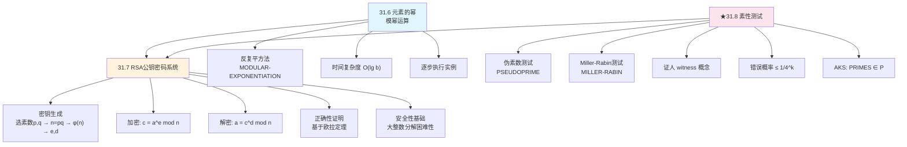
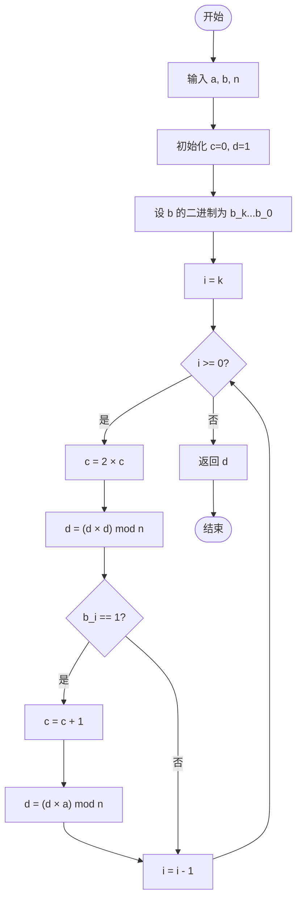
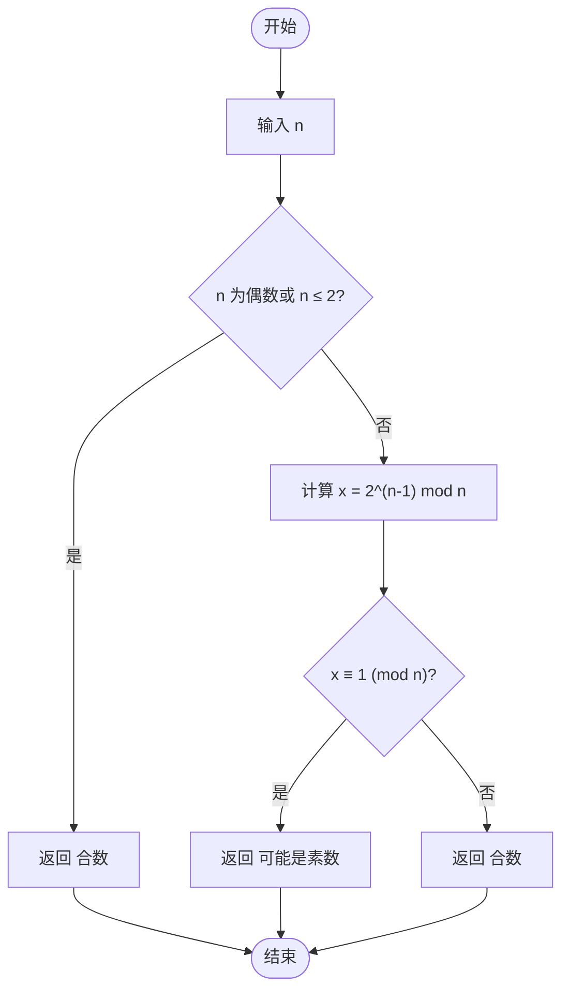
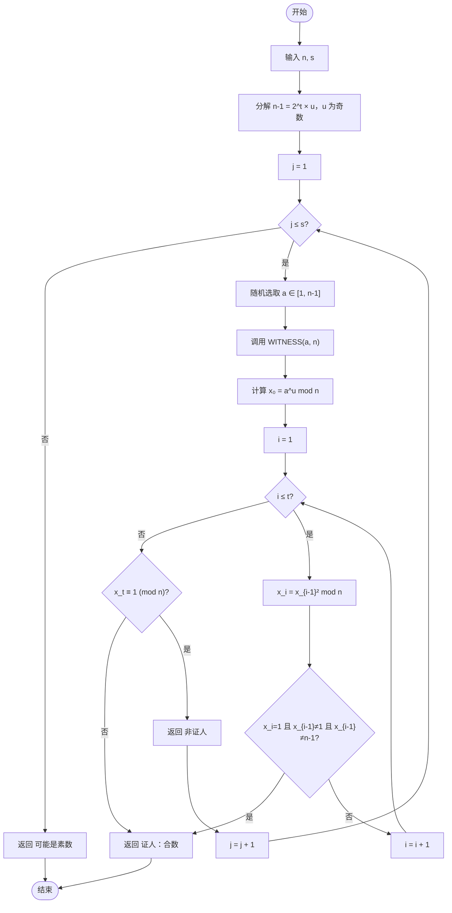

## 相关笔记
- 前置笔记：[[31.2 模运算与中国剩余定理]]、[[31.1 初等数论与最大公约数]]
- 关联概念：[[离散数学/concepts/快速幂]]、[[离散数学/concepts/RSA密码系统]]、[[离散数学/concepts/公钥密码学]]、[[离散数学/concepts/费马小定理]]、[[离散数学/concepts/欧拉函数]]、[[离散数学/concepts/原根]]
- 章节汇总：[[第31章_数论算法-章节汇总]]

> [!abstract] 概览
> 本节涵盖CLRS第4版第31章的最后三个小节，构成了**数论算法在密码学中的核心应用链条**：
>
> - **31.6 元素的幂**：介绍**反复平方法（repeated squaring）**，在 $O(\lg b)$ 时间内计算 $a^b \bmod n$，是RSA加密与解密的底层计算引擎。
> - **31.7 RSA公钥密码系统**：完整阐述RSA方案的密钥生成、加密、解密流程，以及基于**欧拉定理**的正确性证明。RSA的安全性依赖于**大整数分解问题的计算困难性**。
> - **★31.8 素性测试**：从**伪素数测试**出发，引入**Miller-Rabin随机化素性测试**，通过"证人"（witness）概念以 $\leq 1/4^k$ 的错误概率判定素性，并简要提及**AKS确定性多项式时间算法**的理论意义。
>
> 这三节形成了一条清晰的逻辑链：**模幂运算**是计算工具 → **RSA**是应用场景 → **素性测试**是RSA密钥生成的前提条件。

## 知识结构总览



## 核心思想

### 31.6 元素的幂（Modular Exponentiation）

#### 问题定义

给定整数 $a$、非负整数 $b$ 和正整数 $n$，计算 $a^b \bmod n$。

朴素方法需要 $b-1$ 次乘法，当 $b$ 很大时（例如RSA中 $b$ 可达数百位十进制数），计算量不可接受。

#### 反复平方法的核心思想

反复平方法利用了指数的二进制表示。设 $b$ 的二进制为 $b_k b_{k-1} \cdots b_1 b_0$，则：

$$a^b = a^{\sum_{i=0}^{k} b_i \cdot 2^i} = \prod_{i=0}^{k} (a^{2^i})^{b_i}$$

关键观察：
- $a^{2^i}$ 可以通过反复平方得到：$a^{2^0} = a$，$a^{2^1} = (a^{2^0})^2$，$a^{2^2} = (a^{2^1})^2$，以此类推
- 只需对二进制位为 $1$ 的位置累乘对应值

#### MODULAR-EXPONENTIATION 伪代码

```
MODULAR-EXPONENTIATION(a, b, n)
1  c ← 0
2  d ← 1
3  设 b_k b_{k-1} ... b_1 b_0 为 b 的二进制表示
4  for i ← k downto 0
5      c ← 2c
6      d ← (d × d) mod n
7      if b_i = 1
8          c ← c + 1
9          d ← (d × a) mod n
10 return d
```

**执行流程图：**



**变量含义**：
- `c`：维护当前已处理的二进制前缀对应的整数值
- `d`：维护 $a^c \bmod n$ 的当前值

#### 时间复杂度分析

循环执行 $k+1 = \lfloor \lg b \rfloor + 1$ 次，每次循环内：
- 第5-6行各执行一次乘法（常数次基本运算）
- 第8-9行仅在 $b_i = 1$ 时额外执行一次乘法

因此总乘法次数不超过 $2(\lfloor \lg b \rfloor + 1) = O(\lg b)$。

#### 逐步执行实例

计算 $a = 7$，$b = 560$，$n = 561$ 时 $a^b \bmod n$ 的值。

$b = 560$ 的二进制表示为 $1000110000_2$（共10位，$k = 9$）。

| i | $b_i$ | 操作 | c（十进制） | d = $7^c \bmod 561$ |
|---|-------|------|-------------|---------------------|
| 9 | 1 | c←0+1=1, d←(1×7) mod 561 | 1 | 7 |
| 8 | 0 | c←2, d←(7×7) mod 561 | 2 | 49 |
| 7 | 0 | c←4, d←(49×49) mod 561 | 4 | 49² mod 561 = 2401 mod 561 = 157 |
| 6 | 0 | c←8, d←(157×157) mod 561 | 8 | 157² mod 561 = 24649 mod 561 = 526 |
| 5 | 1 | c←16+1=17, d←(526²×7) mod 561 | 17 | 526² mod 561 = 160 |
| 4 | 1 | c←34+1=35, d←(160²×7) mod 561 | 35 | 160² mod 561 = 241 |
| 3 | 0 | c←70, d←(241×241) mod 561 | 70 | 241² mod 561 = 166 |
| 2 | 0 | c←140, d←(166×166) mod 561 | 140 | 166² mod 561 = 67 |
| 1 | 0 | c←280, d←(67×67) mod 561 | 280 | 67² mod 561 = 1 |
| 0 | 0 | c←560, d←(1×1) mod 561 | 560 | 1 |

**结果**：$7^{560} \bmod 561 = 1$。

这个结果值得注意：$561 = 3 \times 11 \times 17$ 是一个合数，但 $7^{560} \bmod 561 = 1$ 仍然成立。这正是**伪素数**现象的体现，也是31.8节素性测试要解决的核心问题。

---

### 31.7 RSA公钥密码系统

#### 背景与动机

RSA（Rivest-Shamir-Adleman）是1977年由MIT三位学者提出的**公钥密码系统**。在公钥密码学中，每个参与者拥有一对密钥：
- **公钥（public key）**：公开给所有人，用于加密
- **私钥（private key）**：仅自己持有，用于解密

RSA的安全性基于一个核心数论事实：**已知两个大素数的乘积 $n = pq$ 时，求 $p$ 和 $q$（即大整数分解）在计算上是困难的**。

#### RSA完整流程

##### 第一步：密钥生成

1. **选取两个大素数** $p$ 和 $q$（实际应用中各约1024位，即约300位十进制数）
2. **计算模数** $n = p \times q$
3. **计算欧拉函数值** $\phi(n) = (p-1)(q-1)$
4. **选取公钥指数** $e$，满足 $1 < e < \phi(n)$ 且 $\gcd(e, \phi(n)) = 1$
5. **计算私钥指数** $d$，使得 $d \times e \equiv 1 \pmod{\phi(n)}$，即 $d$ 是 $e$ 在模 $\phi(n)$ 下的**乘法逆元**

**公钥**：$(n, e)$
**私钥**：$(d)$（或 $(n, d)$）

##### 第二步：加密

发送方使用接收方的公钥 $(n, e)$ 对明文 $a$（$0 \leq a < n$）加密：

$$c = a^e \bmod n$$

密文 $c$ 通过公开信道传输。

##### 第三步：解密

接收方使用自己的私钥 $d$ 对密文 $c$ 解密：

$$a = c^d \bmod n$$

#### RSA正确性证明

RSA解密能正确恢复明文的核心在于以下定理：

**定理（RSA正确性）**：对于所有 $a \in \mathbb{Z}_n$，有 $(a^e)^d \equiv a \pmod{n}$。

**证明**：

因为 $ed \equiv 1 \pmod{\phi(n)}$，所以存在整数 $k$ 使得 $ed = 1 + k\phi(n)$。

因此 $(a^e)^d = a^{ed} = a^{1 + k\phi(n)} = a \cdot (a^{\phi(n)})^k$。

分两种情况讨论：

**情况一**：$\gcd(a, n) = 1$。

由【欧拉定理（若 $\gcd(a,n)=1$，则 $a^{\phi(n)} \equiv 1 \pmod{n}$）】，得：

$$a^{ed} = a \cdot (a^{\phi(n)})^k \equiv a \cdot 1^k = a \pmod{n}$$

**情况二**：$\gcd(a, n) \neq 1$。

由于 $n = pq$，且 $0 \leq a < n$，$\gcd(a, n) \neq 1$ 意味着 $a$ 是 $p$ 或 $q$ 的倍数。

不失一般性，设 $a$ 是 $p$ 的倍数但不是 $q$ 的倍数（即 $a \equiv 0 \pmod{p}$，$a \not\equiv 0 \pmod{q}$）。

- 模 $p$：$a^{ed} \equiv 0^{ed} \equiv 0 \equiv a \pmod{p}$ ✓
- 模 $q$：由【费马小定理（若 $q$ 为素数且 $q \nmid a$，则 $a^{q-1} \equiv 1 \pmod{q}$）】，有 $a^{q-1} \equiv 1 \pmod{q}$，因此：
  $$a^{ed} = a^{1 + k(p-1)(q-1)} = a \cdot (a^{q-1})^{k(p-1)} \equiv a \cdot 1^{k(p-1)} = a \pmod{q}$$ ✓

由【中国剩余定理（若 $a \equiv b \pmod{p}$ 且 $a \equiv b \pmod{q}$，则 $a \equiv b \pmod{pq}$）】，得 $a^{ed} \equiv a \pmod{n}$。

**证毕**。

#### 逐步执行实例

**密钥生成**：
1. 选 $p = 61$，$q = 53$
2. $n = p \times q = 61 \times 53 = 3233$
3. $\phi(n) = (61-1)(53-1) = 60 \times 52 = 3120$
4. 选 $e = 17$（验证 $\gcd(17, 3120) = 1$ ✓）
5. 计算 $d$：$d \times 17 \equiv 1 \pmod{3120}$，使用扩展欧几里得算法得 $d = 2753$

**公钥**：$(n=3233, e=17)$
**私钥**：$(d=2753)$

**加密**：明文 $a = 65$（对应字母 'A' 的ASCII码）

$$c = 65^{17} \bmod 3233$$

使用反复平方法：
- $65^1 \bmod 3233 = 65$
- $65^2 \bmod 3233 = 4225 \bmod 3233 = 992$
- $65^4 \bmod 3233 = 992^2 \bmod 3233 = 984064 \bmod 3233 = 2678$
- $65^8 \bmod 3233 = 2678^2 \bmod 3233 = 7171684 \bmod 3233 = 196$
- $65^{16} \bmod 3233 = 196^2 \bmod 3233 = 38416 \bmod 3233 = 2785$

$17 = 16 + 1$，所以：

$$c = 65^{17} \bmod 3233 = (65^{16} \times 65^1) \bmod 3233 = (2785 \times 65) \bmod 3233 = 181025 \bmod 3233 = 2790$$

**解密**：

$$a = 2790^{2753} \bmod 3233$$

使用反复平方法计算（过程较长，此处省略中间步骤），最终结果为 $65$，成功恢复明文。

#### RSA安全性分析

RSA的安全性依赖于以下计算困难性假设：

- **大整数分解问题**：给定 $n = pq$（$p$、$q$ 为大素数），求 $p$ 和 $q$ 在计算上是困难的
- 已知最快的通用分解算法（**普通数域筛法**，GNFS）的时间复杂度约为 $O(e^{(1.923 + o(1))(\ln n)^{1/3}(\ln \ln n)^{2/3}})$，对于2048位的 $n$，在当前计算能力下不可行

**注意**：RSA的安全性基于大整数分解困难性，**并非**基于离散对数问题。离散对数问题是Diffie-Hellman密钥交换和ElGamal密码系统的安全基础。

#### RSA的数学结构深入分析

RSA方案涉及以下关键数学量之间的关系：

$$\begin{cases} n = p \times q \\ \phi(n) = (p-1)(q-1) \\ e \times d \equiv 1 \pmod{\phi(n)} \end{cases}$$

从安全性角度，需要确保：

1. **$p$ 和 $q$ 的选择**：两个素数应大小相近但差距足够大（避免Fermat分解法），且 $p-1$ 和 $q-1$ 应有大素因子（避免Pollard的 $p-1$ 分解法）
2. **$e$ 的选择**：$e$ 不能太小（$e = 3$ 时，若 $m^3 < n$，可直接开立方根恢复明文），常用值为 $e = 65537 = 2^{16} + 1$（二进制仅两个1，加密效率高）
3. **$n$ 的位长**：当前推荐至少2048位，安全级别约112位对称密钥等价强度

#### RSA与反复平方法的联系

RSA的加密 $c = a^e \bmod n$ 和解密 $a = c^d \bmod n$ 都需要计算模幂。当 $n$ 为2048位数时，$e$ 和 $d$ 也接近2048位，朴素方法需要约 $2^{2048}$ 次乘法——完全不可行。反复平方法将乘法次数降至约 $2 \times 2048 = 4096$ 次，使RSA在工程上变得可行。这就是31.6节的内容作为31.7节前置条件的根本原因。

---

### ★31.8 素性测试（Primality Testing）

RSA的密钥生成需要选取大素数，因此**高效判定一个数是否为素数**是RSA系统的关键前置步骤。

#### 伪素数测试（Pseudoprime Test）

**费马小定理**告诉我们：若 $p$ 为素数且 $\gcd(a, p) = 1$，则 $a^{p-1} \equiv 1 \pmod{p}$。

其逆否命题为：若 $a^{p-1} \not\equiv 1 \pmod{p}$，则 $p$ 一定不是素数。

但原命题的逆命题**不成立**：$a^{n-1} \equiv 1 \pmod{n}$ 并不保证 $n$ 是素数。

**定义**：若合数 $n$ 满足 $a^{n-1} \equiv 1 \pmod{n}$，则称 $n$ 是以 $a$ 为底的**伪素数（pseudoprime）**。

##### PSEUDOPRIME 伪代码

```
PSEUDOPRIME(n)
1  if MODULAR-EXPONENTIATION(2, n-1, n) ≠ 1
2      return COMPOSITE       // 一定是合数
3  else
4      return PRIME           // 可能是素数，也可能是伪素数
```

**执行流程图：**



**局限性**：伪素数测试可能将合数误判为素数。例如 $561 = 3 \times 11 \times 17$ 是以2为底的伪素数，因为 $2^{560} \bmod 561 = 1$。

更严重的是，存在**Carmichael数**——对所有与 $n$ 互素的 $a$ 都满足 $a^{n-1} \equiv 1 \pmod{n}$ 的合数。最小的Carmichael数是 $561$。Carmichael数虽然稀少，但已被证明有无穷多个。

##### Carmichael数的结构特征

**Korselt准则**：正整数 $n$ 是Carmichael数当且仅当：
1. $n$ 是合数
2. $n$ 是**无平方因子**的（即 $n$ 的素因数分解中每个素因数的指数都是1）
3. 对 $n$ 的每个素因数 $p$，都有 $(p - 1) \mid (n - 1)$

以 $561 = 3 \times 11 \times 17$ 为例验证：
- $561$ 是合数 ✓
- $561$ 无平方因子 ✓
- $(3-1) = 2 \mid 560$ ✓，$(11-1) = 10 \mid 560$ ✓，$(17-1) = 16 \mid 560$ ✓

因此 $561$ 确实是Carmichael数。

Carmichael数的存在说明了伪素数测试的根本局限：无论选择哪个底 $a$，都无法通过费马测试可靠地检测出Carmichael数。这正是需要更强大的Miller-Rabin测试的原因。

#### Miller-Rabin素性测试

Miller-Rabin测试通过引入**二次探测定理**来弥补伪素数测试的不足。

**引理（二次探测定理）**：若 $p$ 为奇素数，且 $x^2 \equiv 1 \pmod{p}$，则 $x \equiv 1 \pmod{p}$ 或 $x \equiv -1 \pmod{p}$。

这个引理的含义是：在模素数下，$1$ 的**平方根只有 $\pm 1$**。但对于合数，$1$ 可能有更多的平方根。

##### Miller-Rabin 的核心思想

给定奇数 $n > 2$，将 $n-1$ 分解为 $n - 1 = 2^s \cdot d$，其中 $d$ 为奇数。

根据费马小定理，若 $n$ 为素数，则 $a^{n-1} = a^{2^s \cdot d} \equiv 1 \pmod{n}$。

考察序列 $a^d, a^{2d}, a^{4d}, \ldots, a^{2^{s-1}d}, a^{2^s d}$（最后一个值即 $a^{n-1}$）：
- 若 $n$ 为素数，这个序列中**第一个等于 $1$ 的元素的前一个元素**必须等于 $-1$（由二次探测定理）
- 若序列中出现了既不是 $1$ 也不是 $n-1$（即 $-1$）的元素，且后续元素变成了 $1$，则 $n$ 一定是合数

##### 证人（Witness）的定义

**定义**：若 $a$ 能提供 $n$ 为合数的证据（即上述序列出现异常），则称 $a$ 是 $n$ 的一个**证人（witness）**。

若 $a$ 不是证人，则称 $a$ 是 $n$ 的**强伪素数之谎（strong liar）**。

**关键定理**：若 $n$ 是奇合数，则在 $\mathbb{Z}_n^*$ 中至少有 $3(n-1)/4$ 个元素是 $n$ 的证人。

这意味着：随机选取 $a \in \{1, 2, \ldots, n-1\}$，$a$ 是证人的概率至少为 $3/4$。

##### MILLER-RABIN 伪代码

```
MILLER-RABIN(n, s)
1  for j ← 1 to s
2      a ← RANDOM(1, n-1)
3      if WITNESS(a, n)
4          return COMPOSITE
5  return PRIME
```

```
WITNESS(a, n)
1  设 n - 1 = 2^t × u，其中 u 为奇数
2  x_0 ← MODULAR-EXPONENTIATION(a, u, n)
3  for i ← 1 to t
4      x_i ← x_{i-1}^2 mod n
5      if x_i = 1 且 x_{i-1} ≠ 1 且 x_{i-1} ≠ n-1
6          return TRUE        // a 是 n 的证人
7  if x_t ≠ 1
8      return TRUE            // a 是 n 的证人
9  return FALSE               // a 不是证人
```

**执行流程图：**



##### 错误概率分析

每次独立测试中，将合数误判为素数的概率不超过 $1/4$。

进行 $s$ 次独立测试后，错误概率不超过：

$$\Pr[\text{误判}] \leq \left(\frac{1}{4}\right)^s$$

| 测试次数 $s$ | 错误概率 |
|:---:|:---:|
| 1 | $\leq 25\%$ |
| 5 | $\leq 0.1\%$ |
| 10 | $\leq 10^{-6}$ |
| 40 | $\leq 10^{-24}$ |
| 50 | $\leq 10^{-30}$ |

实际应用中，$s = 40$ 或 $s = 50$ 的错误概率已远低于硬件故障率。

##### 逐步执行实例

**测试 $n = 221$ 是否为素数**（$221 = 13 \times 17$，是合数）。

$n - 1 = 220 = 2^2 \times 55$，所以 $t = 2$，$u = 55$。

**第一次测试**：随机选 $a = 174$。

- $x_0 = 174^{55} \bmod 221$
  - $174^2 \bmod 221 = 30276 \bmod 221 = 190$
  - $174^4 \bmod 221 = 190^2 \bmod 221 = 36100 \bmod 221 = 47$
  - $174^8 \bmod 221 = 47^2 \bmod 221 = 2209 \bmod 221 = 4$
  - $174^{16} \bmod 221 = 4^2 \bmod 221 = 16$
  - $174^{32} \bmod 221 = 16^2 \bmod 221 = 256 \bmod 221 = 35$
  - $174^{55} = 174^{32+16+4+2+1} \bmod 221 = (35 \times 16 \times 47 \times 190 \times 174) \bmod 221 = 187$
- $x_0 = 187$
- $x_1 = 187^2 \bmod 221 = 34969 \bmod 221 = 220 = n - 1$
- $x_2 = 220^2 \bmod 221 = 48400 \bmod 221 = 1$

检查：$x_2 = 1$，且 $x_1 = 220 = n - 1$，不满足证人条件（第5行要求 $x_{i-1} \neq n-1$）。$x_2 = 1$，满足第7行条件。因此 $a = 174$ **不是证人**。

**第二次测试**：随机选 $a = 137$。

- $x_0 = 137^{55} \bmod 221$
  - $137^2 \bmod 221 = 18769 \bmod 221 = 118$
  - $137^4 \bmod 221 = 118^2 \bmod 221 = 13924 \bmod 221 = 197$
  - $137^8 \bmod 221 = 197^2 \bmod 221 = 38809 \bmod 221 = 1$
  - $137^{16} \bmod 221 = 1^2 \bmod 221 = 1$
  - $137^{32} \bmod 221 = 1$
  - $137^{55} = 137^{32+16+4+2+1} \bmod 221 = (1 \times 1 \times 197 \times 118 \times 137) \bmod 221 = 137$
- $x_0 = 137$
- $x_1 = 137^2 \bmod 221 = 118$
- $x_2 = 118^2 \bmod 221 = 197$

检查：$x_2 = 197 \neq 1$，触发第7行条件，$a = 137$ **是证人**。

**结论**：$n = 221$ 被判定为**合数**（正确）。

#### 与AKS算法的关系

2002年，Agrawal、Kayal和Saxena三位印度计算机科学家证明了**PRIMES ∈ P**，即素性测试存在确定性多项式时间算法。AKS算法的意义在于：
- 它是**确定性**的（不依赖随机性），不像Miller-Rabin有概率性错误
- 它的运行时间为 $\tilde{O}(\lg^6 n)$（后续改进至 $\tilde{O}(\lg^3 n)$）
- 但实际运行速度远慢于Miller-Rabin，因此在工程实践中仍广泛使用Miller-Rabin

**Miller-Rabin vs AKS 对比**：

| 特性 | Miller-Rabin | AKS |
|------|-------------|-----|
| 确定性 | 随机化（有错误概率） | 确定性（无错误） |
| 时间复杂度 | $O(k \lg^3 n)$ | $\tilde{O}(\lg^6 n)$ |
| 实际速度 | 快（工程标准） | 慢（理论意义为主） |
| 正确性保证 | 概率性 | 无条件正确 |
| 工程应用 | 广泛使用（OpenSSL等） | 极少使用 |

在实际的RSA实现中（如OpenSSL），密钥生成阶段使用Miller-Rabin测试配合一定的确定性检查（如对小素数先试除），在安全性和效率之间取得了最佳平衡。

## 补充理解

> [!info] RSA的发明历史
> RSA算法由MIT的三位学者Ron Rivest、Adi Shamir和Len Adleman于1977年提出。其前身是1976年Whitfield Diffie和Martin Hellman发表的"New Directions in Cryptography"论文，首次提出了公钥密码学的概念。Rivest在1977年4月的逾越节晚宴后灵感突发，经过一夜思考写出了RSA的核心算法。1977年，Martin Gardner在《Scientific American》杂志的"Mathematical Games"专栏中公开了一个RSA挑战——用129位密钥加密的消息，直到1994年才被一个分布式计算项目破解。
>
> 参考：[The Early Days of RSA - MIT CSAIL](https://people.csail.mit.edu/rivest/pubs/ARS03.rivest-slides.pdf) | [MIT News: Rivest unlocks cryptography's past](https://news.mit.edu/2011/rivest-unlocks-cryptographys-past-looks-toward-future)

> [!info] Miller-Rabin测试的数学基础
> Miller-Rabin素性测试建立在费马小定理和二次探测定理之上。费马小定理提供素数的必要条件，二次探测定理则通过检验"1的平方根在模素数下只有±1"这一性质来排除伪素数。1976年，Gary L. Miller提出了一个基于广义黎曼猜想的确定性版本；1979年，Michael O. Rabin去除了黎曼猜想的依赖，给出了随机化版本。Miller-Rabin测试的时间复杂度为 $O(k \lg^3 n)$，其中 $k$ 为测试轮数。
>
> 参考：[The Miller-Rabin Randomized Primality Test - Cornell](https://cs.cornell.edu/courses/cs4820/2010sp/handouts/MillerRabin.pdf) | [The Miller-Rabin Test - Keith Conrad](https://kconrad.math.uconn.edu/blurbs/ugradnumthy/millerrabin.pdf)

> [!info] AKS确定性素性测试
> 2002年8月，Manindra Agrawal、Neeraj Kayal和Nitinin Saxena在论文"PRIMES is in P"中给出了第一个无条件确定性多项式时间素性测试算法，发表在《Annals of Mathematics》上。该算法的核心思想是将素性测试转化为多项式恒等检验：$n$ 为素数当且仅当 $(x + a)^n \equiv x^n + a \pmod{n}$ 对所有 $a \in \{0, 1, \ldots, n-1\}$ 成立。AKS算法通过限制 $a$ 的范围和利用多项式模运算实现了多项式时间。这一成果被认为是21世纪最重要的理论计算机科学突破之一。
>
> 参考：[PRIMES is in P - Annals of Mathematics](http://annals.math.princeton.edu/wp-content/uploads/annals-v160-n2-p12.pdf) | [Testing Primality in Polynomial Time - Univ. Bremen](https://www.informatik.uni-bremen.de/tdki/lehre/ss18/kt/primes_in_p_4.pdf)

> [!info] 反复平方法的广泛应用
> 反复平方法（又称二进制幂算法、快速幂）是计算模幂的高效算法，时间复杂度 $O(\lg b)$。它不仅是RSA加密解密的核心计算引擎，也是Diffie-Hellman密钥交换、数字签名算法（DSA）、椭圆曲线密码学（ECC）等众多密码协议的基础运算。在区块链和加密货币中，椭圆曲线数字签名算法（ECDSA）同样依赖模幂运算。反复平方法的高效性使得大数模幂运算在工程上变得可行。
>
> 参考：[Modular Exponentiation: Fast Power Algorithm - CodeLucky](https://codelucky.com/modular-exponentiation/) | [模重复平方算法在Diffie-Hellman中的应用 - CSDN](https://wenku.csdn.net/doc/3u3het61cm)

## 易混淆点

> [!warning] RSA安全性基于大整数分解，而非离散对数
> RSA的安全性基础是**大整数分解问题**的困难性：给定 $n = pq$，求 $p$ 和 $q$。这与**离散对数问题**（DLP）不同。离散对数问题是：给定素数 $p$、生成元 $g$ 和 $y = g^x \bmod p$，求 $x$。Diffie-Hellman密钥交换和ElGamal密码系统的安全性基于DLP。虽然两者都涉及模运算和数论，但底层的困难性假设完全不同。混淆这两者会导致对密码系统安全性的错误分析。

> [!warning] 伪素数（Pseudoprime）与Carmichael数的区别
> **伪素数**（pseudoprime）是指对某个特定底 $a$ 满足 $a^{n-1} \equiv 1 \pmod{n}$ 的合数 $n$。例如561是以2为底的伪素数。**Carmichael数**则更强：它是对**所有**与 $n$ 互素的 $a$ 都满足 $a^{n-1} \equiv 1 \pmod{n}$ 的合数。Carmichael数是伪素数测试的根本性缺陷——无论选哪个底，都无法通过费马测试检测出它是合数。Miller-Rabin测试通过引入二次探测有效克服了Carmichael数的问题，因为Carmichael数在Miller-Rabin测试中仍然可以被检测出来。

> [!warning] RSA中 e 和 d 的选择约束
> RSA要求公钥指数 $e$ 满足 $\gcd(e, \phi(n)) = 1$（即 $e$ 与 $\phi(n)$ 互素），私钥指数 $d$ 满足 $ed \equiv 1 \pmod{\phi(n)}$。常见错误包括：(1) 认为 $e$ 可以任意选择——实际上 $e$ 必须与 $\phi(n)$ 互素；(2) 认为 $d$ 可以直接计算为 $d = 1/e$——实际上 $d$ 是模 $\phi(n)$ 意义下的乘法逆元，需要使用[[31.1 初等数论与最大公约数|扩展欧几里得算法]]计算；(3) 忽略 $e$ 和 $d$ 的选择对安全性的影响——过小的 $e$（如 $e = 3$）在某些攻击场景下可能不安全，过小的 $d$ 则可能被Wiener攻击破解。

## 习题精选

| 题号 | 题目描述 | 难度 |
|:-----|:---------|:----:|
| 31.6-2 | MODULAR-EXPONENTIATION逐步执行 | ★★☆ |
| 31.7-1 | RSA小实例计算 | ★★★ |
| 31.7-4 | RSA正确性证明 | ★★★★ |
| 31.8-2 | Miller-Rabin测试执行 | ★★★ |

> [!faq]- 习题 31.6-2
> **题目**：计算 $a = 2$，$b = 13$，$n = 67$ 时 $\text{MODULAR-EXPONENTIATION}(2, 13, 67)$ 的逐步执行过程。
>
> **解题思路提示**：将 $b = 13$ 写成二进制 $1101_2$，然后按照伪代码逐步执行。
>
> **答案**：
> $13 = 1101_2$，$k = 3$。
>
> | i | $b_i$ | c | d |
> |---|-------|---|---|
> | 3 | 1 | 1 | $2^1 \bmod 67 = 2$ |
> | 2 | 1 | 3 | $(2^2 \times 2) \bmod 67 = 8$ |
> | 1 | 0 | 6 | $8^2 \bmod 67 = 64$ |
> | 0 | 1 | 13 | $(64^2 \times 2) \bmod 67 = (4096 \times 2) \bmod 67 = 8192 \bmod 67 = 8192 - 122 \times 67 = 8192 - 8174 = 18$ |
>
> 结果：$2^{13} \bmod 67 = 18$。
>
> 验证：$2^{13} = 8192$，$8192 = 122 \times 67 + 18$ ✓

> [!faq]- 习题 31.7-1
> **题目**：考虑一个RSA公钥密码系统，其中 $p = 17$，$q = 23$，$e = 3$。求 $n$、$\phi(n)$、$d$，并对明文 $a = 12$ 进行加密和解密。
>
> **解题思路提示**：按照RSA密钥生成流程逐步计算，$d$ 需要用扩展欧几里得算法求解 $3d \equiv 1 \pmod{352}$。
>
> **答案**：
> 1. $n = 17 \times 23 = 391$
> 2. $\phi(n) = (17-1)(23-1) = 16 \times 22 = 352$
> 3. 求 $d$：$3d \equiv 1 \pmod{352}$
>    - $352 = 117 \times 3 + 1$
>    - $3 = 3 \times 1 + 0$
>    - 回代：$1 = 352 - 117 \times 3$，所以 $d = -117 \equiv 235 \pmod{352}$
> 4. 加密：$c = 12^3 \bmod 391 = 1728 \bmod 391 = 1728 - 4 \times 391 = 1728 - 1564 = 164$
> 5. 解密：$a = 164^{235} \bmod 391 = 12$（使用反复平方法验证）
>
> 结果：加密得 $c = 164$，解密恢复 $a = 12$ ✓

> [!faq]- 习题 31.7-4
> **题目**：证明：若Alice的公钥是 $(n, e)$，私钥是 $d$，则对任意 $a \in \mathbb{Z}_n$，有 $(a^e)^d \equiv a \pmod{n}$。要求分别讨论 $\gcd(a, n) = 1$ 和 $\gcd(a, n) \neq 1$ 两种情况。
>
> **解题思路提示**：当 $\gcd(a, n) = 1$ 时直接用欧拉定理；当 $\gcd(a, n) \neq 1$ 时，利用 $n = pq$ 的结构分别模 $p$ 和模 $q$ 讨论，再用中国剩余定理合并。
>
> **答案**：
> 因为 $ed \equiv 1 \pmod{\phi(n)}$，存在整数 $k$ 使 $ed = 1 + k\phi(n)$。
>
> **情况一**：$\gcd(a, n) = 1$。
> 由欧拉定理，$a^{\phi(n)} \equiv 1 \pmod{n}$，故 $a^{ed} = a \cdot (a^{\phi(n)})^k \equiv a \cdot 1^k = a \pmod{n}$。
>
> **情况二**：$\gcd(a, n) \neq 1$。
> 因为 $n = pq$，$a$ 必为 $p$ 或 $q$ 的倍数。设 $p \mid a$ 但 $q \nmid a$。
> - 模 $p$：$a \equiv 0 \pmod{p}$，故 $a^{ed} \equiv 0 \equiv a \pmod{p}$。
> - 模 $q$：$\gcd(a, q) = 1$，由费马小定理 $a^{q-1} \equiv 1 \pmod{q}$，故 $a^{ed} = a^{1+k(p-1)(q-1)} = a \cdot (a^{q-1})^{k(p-1)} \equiv a \pmod{q}$。
> - 由中国剩余定理，$a^{ed} \equiv a \pmod{pq} = a \pmod{n}$。
>
> **证毕**。

> [!faq]- 习题 31.8-2
> **题目**：使用MILLER-RABIN过程对 $n = 1729$ 进行素性测试。$1729$ 是素数还是合数？如果是合数，找出它的因子。
>
> **解题思路提示**：$1729$ 是著名的**Ramanujan数**（Hardy-Ramanujan数），它等于 $10^3 + 9^3 = 12^3 + 1^3 = 1729$。先用Miller-Rabin测试，再尝试分解。
>
> **答案**：
> $1729 = 7 \times 13 \times 19$，是合数。
>
> 使用Miller-Rabin测试：$n - 1 = 1728 = 2^6 \times 27$，所以 $t = 6$，$u = 27$。
>
> 选 $a = 2$：
> - $x_0 = 2^{27} \bmod 1729$
> - $2^5 = 32$，$2^{10} = 1024$，$2^{20} = 1024^2 \bmod 1729 = 1048576 \bmod 1729 = 645$
> - $2^{27} = 2^{20} \times 2^7 \bmod 1729 = 645 \times 128 \bmod 1729 = 82560 \bmod 1729 = 82560 - 47 \times 1729 = 82560 - 81263 = 1297$
> - $x_0 = 1297$
> - $x_1 = 1297^2 \bmod 1729 = 1682209 \bmod 1729 = 1682209 - 973 \times 1729 = 1682209 - 1682417 = -208$，即 $1729 - 208 = 1521$
> - $x_2 = 1521^2 \bmod 1729 = 2313441 \bmod 1729 = 2313441 - 1338 \times 1729 = 2313441 - 2313342 = 99$
> - $x_3 = 99^2 \bmod 1729 = 9801 \bmod 1729 = 9801 - 5 \times 1729 = 9801 - 8645 = 1156$
> - $x_4 = 1156^2 \bmod 1729 = 1336336 \bmod 1729 = 1336336 - 773 \times 1729 = 1336336 - 1336517 = -181$，即 $1548$
> - $x_5 = 1548^2 \bmod 1729 = 2396304 \bmod 1729 = 2396304 - 1386 \times 1729 = 2396304 - 2396394 = -90$，即 $1639$
> - $x_6 = 1639^2 \bmod 1729 = 2686321 \bmod 1729 = 2686321 - 1554 \times 1729 = 2686321 - 2686466 = -145$，即 $1584$
>
> $x_6 = 1584 \neq 1$，且检查过程中没有出现 $x_i = 1$ 且 $x_{i-1} \neq \pm 1$ 的情况。但 $x_6 \neq 1$，所以 $a = 2$ 是 $1729$ 的证人。
>
> **结论**：$1729$ 被判定为**合数**，其因子为 $1729 = 7 \times 13 \times 19$。

## 视频学习指南

| 主题 | 推荐资源 | 时长 | 难度 | 说明 |
|------|----------|------|------|------|
| 反复平方法 | MIT 6.046J Lecture 12 | ~15min | ★★☆ | 从二进制分解角度讲解模幂运算 |
| 快速幂详解 | 哔哩哔哩 "快速幂算法" | ~12min | ★★☆ | 中文讲解，配合大量实例演示 |
| RSA原理 | 3Blue1Brown "RSA加密算法" | ~10min | ★★☆ | 动画演示RSA的密钥生成、加密、解密全过程 |
| RSA正确性证明 | MIT 6.046J Lecture 12 | ~20min | ★★★ | 详细证明RSA解密的正确性 |
| RSA工程实现 | 哔哩哔哩 "RSA加密算法详解" | ~25min | ★★★ | 包含Python代码实现与数值实例 |
| Miller-Rabin测试 | MIT 6.046J Lecture 13 | ~25min | ★★★ | 从费马测试到Miller-Rabin的演进过程 |
| 素性测试综述 | 哔哩哔哩 "素性测试算法" | ~18min | ★★★ | 对比试除法、费马测试、Miller-Rabin |
| AKS算法 | CMU 15-451 Lecture | ~30min | ★★★★ | AKS算法的核心思想和多项式恒等检验 |
| RSA安全性 | Stanford CS255 (Cryptography) | ~40min | ★★★★ | 大整数分解困难性及RSA攻击方法综述 |
| 密码学数学基础 | Khan Academy "Cryptography" | ~60min | ★★★ | 系统性复习模运算、欧拉定理等前置知识 |

## 教材原文

> [!quote] CLRS第4版 31.6节原文摘录
> "We now consider the problem of finding the value of $a^b \bmod n$ for given positive integers $a$、$b$、and $n$. The most straightforward method is to compute $a^b$ directly, multiplying by $a$ a total of $b - 1$ times. This method requires $O(b)$ multiplications and is infeasible for large values of $b$. The repeated-squaring method uses the binary representation of $b$ to compute $a^b \bmod n$ efficiently."

> [!quote] CLRS第4版 31.7节原文摘录
> "The RSA public-key cryptosystem is based on the dramatic difference between the ease of finding large prime numbers and the difficulty of factoring the product of two large primes. In this section, we describe the RSA system and examine why it works."

> [!quote] CLRS第4版 31.8节原文摘录
> "This section presents a procedure for finding large prime numbers. The procedure is based on a randomized primality test that always provides the correct answer when it declares that a number is composite, but has only a small probability of error when it declares that a number is prime. The procedure uses the Miller-Rabin test, which is based on Fermat's Little Theorem from elementary number theory."

## 参见Wiki

- **算法概念**：[[算法导论/concepts/分治法]]、[[算法导论/concepts/随机化算法]]
- **数论基础**：[[离散数学/concepts/费马小定理]]、[[离散数学/concepts/欧拉函数]]、[[离散数学/concepts/模运算]]、[[离散数学/concepts/同余]]
- **密码学**：[[离散数学/concepts/RSA密码系统]]、[[离散数学/concepts/公钥密码学]]、[[离散数学/concepts/快速幂]]
- **前置章节**：[[第31章_数论算法/31.2 模运算与中国剩余定理]]、[[第31章_数论算法/31.1 初等数论与最大公约数]]
- [[算法导论/theorems/RSA正确性定理]]

### 三节内容的内在联系总结

本笔记覆盖的三节内容构成了一个自洽的**数论-密码学闭环**：

1. **计算基础**（31.6）：反复平方法提供了高效模幂运算能力，时间复杂度 $O(\lg b)$，是整个闭环的计算引擎
2. **核心应用**（31.7）：RSA利用模幂运算实现公钥加密，其正确性依赖于欧拉定理，安全性依赖于大整数分解困难性
3. **前置条件**（31.8）：RSA的密钥生成需要大素数，Miller-Rabin测试以极低的错误概率高效判定素性，是RSA系统的基石

理解这三节内容的关键在于把握它们之间的**依赖关系**：没有高效模幂运算就没有实用的RSA，没有素性测试就无法生成RSA密钥。

#学习/算法导论/第31章-数论算法
#学习/算法导论/数论算法/RSA
