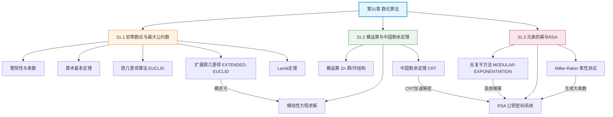

## 相关笔记

**本章节笔记：**
- [[31.1 初等数论与最大公约数]] — 整除性、素数、算术基本定理、欧几里得算法、扩展欧几里得算法、Lamé定理
- [[31.2 模运算与中国剩余定理]] — 模运算代数结构、模线性方程求解、中国剩余定理（CRT）
- [[31.3 元素的幂与RSA]] — 反复平方法、RSA公钥密码系统、Miller-Rabin素性测试

**前置章节汇总：**
- [[第30章_多项式与FFT-章节汇总]] — 多项式与FFT（前一章）
- [[第05章_概率分析与随机化算法-章节汇总]] — 概率分析与随机化算法（Miller-Rabin的理论基础）

**后续章节：**
- 第32章 字符串匹配（待学习）

---

> [!abstract] 概览
> 第31章系统介绍了==数论算法==的核心内容，从初等数论的基本概念出发，逐步构建起==模运算==、==同余方程求解==、==模幂运算==的完整工具链，最终将这些工具汇聚于==RSA公钥密码系统==这一经典应用。全章以"如何为密码学提供数学基础"为核心线索，展示了数论从纯数学到工程应用的完整路径。
>
> 三篇笔记层层递进：(1) 31.1节建立==整除性==、==素数==、==算术基本定理==等基础概念，介绍==欧几里得算法==及其扩展版本，为后续所有数论运算奠定基础；(2) 31.2节引入==模运算==的代数结构，研究==模线性方程==的求解方法，并给出==中国剩余定理==这一强大的同余方程组合并工具；(3) 31.3节介绍==反复平方法==实现高效模幂运算，完整阐述==RSA==的密钥生成、加密、解密流程及正确性证明，并以==Miller-Rabin素性测试==作为RSA密钥生成的前提条件。

---

## 知识结构总览

---

## 核心概念回顾

### 三篇笔记内容对比

| 维度 | 31.1 初等数论与最大公约数 | 31.2 模运算与中国剩余定理 | 31.3 元素的幂与RSA |
|:---|:---|:---|:---|
| **核心问题** | 如何高效计算GCD | 如何在有限域上运算与求解方程 | 如何实现公钥密码系统 |
| **核心方法** | 辗转相除、扩展欧几里得 | 模运算性质、CRT构造 | 反复平方法、RSA、Miller-Rabin |
| **复杂度** | EUCLID: O(lg min(a,b)) | 方程求解: O(lg n + gcd(a,n)) | 模幂: O(lg b)、MR: O(k lg³n) |
| **关键概念** | 整除性、Bézout恒等式 | Zn*群、模逆元、CRT | 欧拉定理、证人witness、φ(n) |
| **应用场景** | 密码学基础工具 | 大整数运算、密码学 | RSA加密/解密、素数生成 |

> [!def] 核心定理汇总
> 1. **算术基本定理**（Thm 31.9）：每个大于1的整数都可以唯一地表示为素数的乘积（不计顺序）
> 2. **Bézout恒等式**（Thm 31.2）：对所有整数a和b，存在整数x和y使得 ax + by = gcd(a,b)
> 3. **Lamé定理**（Thm 31.11）：EUCLID(a,b)的递归调用次数 ≤ 5d，其中d为a的十进制位数
> 4. **模线性方程有解条件**（Thm 31.17）：ax ≡ b (mod n) 有解 ⟺ gcd(a,n) | b
> 5. **中国剩余定理**（Thm 31.20）：两两互素模数的同余方程组在模n下有唯一解
> 6. **欧拉定理**（Thm 31.31）：对任意与n互素的a，a^φ(n) ≡ 1 (mod n)
> 7. **RSA正确性**（Thm 31.36）：对任意 0 ≤ a < n，(a^e)^d ≡ a (mod n)
> 8. **Miller-Rabin错误概率**（Thm 31.38）：若n为奇合数，至少3/4的 a ∈ {1,...,n-1} 是证人

---

## 跨章关联

### 与第5章（概率分析与随机化算法）的关系

- Miller-Rabin素性测试是==随机化算法==的经典应用，其错误概率分析依赖[[离散数学/concepts/概率分析]]
- Miller-Rabin的错误概率 ≤ 1/4^k 可通过重复独立试验降至任意小，体现了[[离散数学/concepts/指示器随机变量]]的思想
- RSA密钥生成中随机选择大素数，也需要概率分析保证素数密度足够

### 与第30章（多项式与FFT）的关系

- 数论变换（NTT）是FFT在有限域上的推广，依赖本章的模运算理论
- NTT使用模p下的原根代替复数单位根，避免了浮点数精度问题
- 大整数乘法（Schönhage-Strassen算法）使用NTT实现 O(n lg n lg lg n) 的复杂度

### 与第28章（矩阵运算）的关系

- 扩展欧几里得算法可以视为求解 2×1 线性方程组 [a b][x y]^T = gcd(a,b)
- 模逆元计算等价于求解 1×1 线性方程组 ax ≡ 1 (mod n)

### 与第29章（线性规划）的关系

- 模运算的线性性质（分配律、结合律）与线性规划中的线性约束有结构上的相似性
- 某些密码协议的安全性证明可以归约为线性规划的对偶问题

---

## 综合复习题

> [!faq]- Q1：为什么RSA选择e=65537作为常用公钥指数？这个选择有什么数学和工程上的优势？
>
> **解答：**
>
> e = 65537 = 2^16 + 1 是一个==费马素数==（F₄），选择它的原因包括：
>
> 1. **数学优势**：65537是素数，满足 gcd(e, φ(n)) = 1 的条件（只要p和q不等于65537）
> 2. **二进制表示简洁**：65537 = 10000000000000001₂，只有两个1位，因此用反复平方法计算 a^65537 mod n 只需17次平方和1次乘法，加密效率极高
> 3. **安全性**：e不能太小（e=3时，若m^3 < n，则可直接开立方根解密），65537足够大避免了这类攻击
> 4. **标准化**：几乎所有TLS/SSL库、OpenSSL、GPG等默认使用e=65537，已成为事实标准

> [!faq]- Q2：Miller-Rabin素性测试与AKS素性测试的本质区别是什么？为什么实际中仍然使用Miller-Rabin？
>
> **解答：**
>
> **本质区别：**
> - **Miller-Rabin**：==随机化算法==，可能将合数误判为素数（错误概率 ≤ 1/4^k），但绝不会将素数误判为合数（one-sided error）。时间复杂度 O(k lg³n)，其中k为测试轮数
> - **AKS**：==确定性算法==，对任何输入都给出正确答案，无需依赖随机性。时间复杂度 O(lg⁶n)（原始版本），后续优化到 O(lg³n)
>
> **实际中仍使用Miller-Rabin的原因：**
> 1. **效率**：对于2048位RSA密钥（n ≈ 2^2048），Miller-Rabin只需约40轮（错误概率 < 2^-80），每轮O(lg³n) ≈ O(2048³) ≈ 8.6×10⁹次运算；AKS的常数因子极大，实际运行远慢于Miller-Rabin
> 2. **工程成熟度**：Miller-Rabin已被OpenSSL、GMP等库深度优化，支持多精度运算和批处理
> 3. **错误概率可控**：通过增加轮数，错误概率可以降到任意小（如2^-128），在实践中等同于确定性

> [!faq]- Q3：中国剩余定理（CRT）如何加速RSA解密？加速比是多少？
>
> **解答：**
>
> **CRT加速RSA解密的基本思路：**
>
> 不直接计算 c^d mod n（其中n = pq），而是分别计算：
> 1. m₁ = c^d mod p（模p下的解密）
> 2. m₂ = c^d mod q（模q下的解密）
> 3. 用CRT合并：m = CRT(m₁, m₂, p, q)
>
> **加速比分析：**
> - 不用CRT：模n的乘法涉及2k位数（k为密钥长度的一半），每次乘法O(k²)，共O(lg d)次乘法，总计O(k² lg d)
> - 用CRT：模p和模q的乘法只涉及k位数，每次乘法O(k²/4)，共O(lg d)次乘法，总计O(k² lg d / 4)
> - **理论加速比约为4倍**（基于朴素乘法）；使用Karatsuba乘法时加速比约为3倍
>
> 这是实际RSA实现（如OpenSSL）中几乎必用的优化。

---

## 常见误区

> [!warning] 误区1：RSA的安全性依赖于"大素数"的保密性
> RSA的安全性依赖于==大整数n = pq的分解困难性==，而非素数p和q本身的保密性。事实上，在RSA公钥系统中，n是公开的（作为公钥的一部分），但p和q是保密的（作为私钥的一部分）。攻击者知道n但无法在合理时间内分解它得到p和q，因此无法计算φ(n) = (p-1)(q-1)，也就无法从公钥e推导出私钥d。

> [!warning] 误区2：模运算中的"除法"总是可以做的
> 在模n运算中，"除以a"等价于"乘以a的模逆元a⁻¹"。但a⁻¹存在的前提是gcd(a, n) = 1。当gcd(a, n) > 1时，a在模n下没有乘法逆元，此时"除法"无意义。例如，在模6下，2没有逆元（因为gcd(2,6) = 2 ≠ 1），所以方程 2x ≡ 1 (mod 6) 无解。

> [!warning] 误区3：欧几里得算法的最坏情况是两个相邻Fibonacci数
> 虽然Lamé定理证明了最坏情况出现在连续Fibonacci数上（EUCLID(F_{k+1}, F_k)恰好执行k-1次递归调用），但这并不意味着实际应用中经常遇到最坏情况。对于随机选择的大整数，欧几里得算法的期望调用次数远小于最坏情况，约为 O(lg min(a,b)) 的常数倍。

---

## 学习要点总结

| 学习目标 | 掌握程度 | 对应笔记 |
|:---|:---:|:---|
| 理解整除性、素数、算术基本定理 | ★★★★★ | [[31.1 初等数论与最大公约数]] |
| 掌握欧几里得算法及正确性证明 | ★★★★★ | [[31.1 初等数论与最大公约数]] |
| 掌握扩展欧几里得算法及Bézout恒等式 | ★★★★★ | [[31.1 初等数论与最大公约数]] |
| 理解Lamé定理与Fibonacci最坏情况 | ★★★★☆ | [[31.1 初等数论与最大公约数]] |
| 掌握模运算的代数性质（群/环结构） | ★★★★★ | [[31.2 模运算与中国剩余定理]] |
| 掌握模线性方程的求解方法 | ★★★★★ | [[31.2 模运算与中国剩余定理]] |
| 掌握中国剩余定理及其构造性证明 | ★★★★★ | [[31.2 模运算与中国剩余定理]] |
| 掌握反复平方法（MODULAR-EXPONENTIATION） | ★★★★★ | [[31.3 元素的幂与RSA]] |
| 理解RSA的密钥生成、加密、解密流程 | ★★★★★ | [[31.3 元素的幂与RSA]] |
| 掌握RSA正确性证明（基于欧拉定理） | ★★★★☆ | [[31.3 元素的幂与RSA]] |
| 理解Miller-Rabin素性测试及错误概率分析 | ★★★★★ | [[31.3 元素的幂与RSA]] |
| 了解AKS确定性素性测试的意义 | ★★★☆☆ | [[31.3 元素的幂与RSA]] |

---

## 参见Wiki

- [[离散数学/concepts/整除]] — 整除性的定义与性质
- [[离散数学/concepts/最大公约数]] — GCD的定义与计算
- [[离散数学/concepts/欧几里得算法]] — 辗转相除法
- [[离散数学/concepts/贝祖定理]] — Bézout恒等式
- [[离散数学/concepts/模运算]] — 模运算的基本定义
- [[离散数学/concepts/中国剩余定理]] — CRT定理
- [[离散数学/concepts/费马小定理]] — Fermat小定理
- [[离散数学/concepts/欧拉函数]] — Euler函数φ(n)
- [[离散数学/concepts/RSA密码系统]] — RSA密码系统
- [[离散数学/concepts/公钥密码学]] — 公钥密码学
- [[离散数学/concepts/快速幂]] — 快速幂算法
- [[离散数学/concepts/原根]] — 原根

---

#学习/算法导论/第31章-数论算法 #学习/算法导论/数论算法/章节汇总
