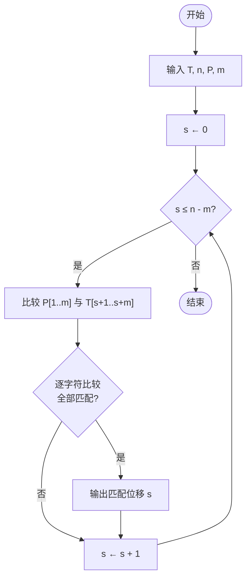
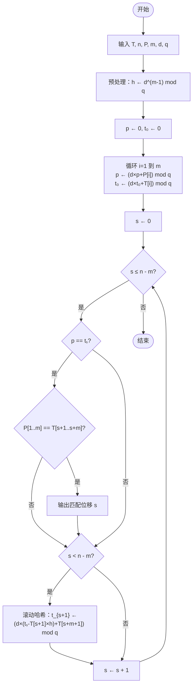

---

## 相关笔记
- 前置笔记：[[第31章_数论算法-章节汇总]]
- 关联概念：[[离散数学/concepts/哈希函数]]、[[离散数学/concepts/模运算]]、[[离散数学/concepts/伪随机数]]、[[算法导论/concepts/散列函数]]、[[算法导论/concepts/散列表]]
- 章节汇总：[[第32章_字符串匹配-章节汇总]]

---

> [!abstract] 概览
> 本节涵盖CLRS第32章前两节，系统介绍字符串匹配问题（string-matching problem）的两种基础算法。
>
> **32.1 朴素字符串匹配算法**（Naive String-Matching Algorithm）：最直观的暴力匹配方法，逐一检查文本中每个可能的起始位置。最坏情况时间复杂度为 $O((n-m+1)m)$，但在实际应用中表现尚可，且实现极为简单，是理解所有高级字符串匹配算法的起点。
>
> **32.2 Rabin-Karp算法**（Rabin-Karp Algorithm）：由 Richard M. Karp 和 Michael O. Rabin 于1987年提出，核心思想是利用==滚动哈希（rolling hash）==将字符比较转化为数值比较，通过==哈希指纹（fingerprint）==快速排除不匹配位置，期望时间复杂度降至 $O(n+m)$。该算法天然支持==多重模式搜索（multiple-pattern search）==，在工程中有广泛应用。
>
> **核心要点**：
> - 字符串匹配问题的形式化定义：给定文本 $T[1..n]$ 和模式 $P[1..m]$，找出所有满足 $P = T[s+1..s+m]$ 的偏移量 $s$
> - 朴素算法通过显式比较每个偏移处 $m$ 个字符来验证匹配
> - Rabin-Karp算法通过哈希函数 $p \mapsto h(p)$ 将模式映射为数值，利用滚动哈希在 $O(1)$ 时间内更新相邻窗口的哈希值
> - 哈希命中（hit）需要显式验证（verification），因为不同字符串可能产生相同哈希值（碰撞）
> - 选取大素数 $q$ 作为模数，可将碰撞概率控制在可接受范围内

---

```mermaid flowchart TD
    A["字符串匹配问题"] --> B["32.1 朴素匹配算法"]
    A --> C["32.2 Rabin-Karp算法"]

    B --> B1["NAIVE-STRING-MATCHER"]
    B --> B2["逐一偏移检查"]
    B --> B3["最坏 O((n-m+1)m)"]
    B --> B4["最好 O(n)"]

    C --> C1["预处理：计算模式哈希 p₀"]
    C --> C2["滚动哈希：O(1)更新窗口哈希"]
    C --> C3["命中验证：显式字符比较"]
    C --> C4["期望 O(n+m)"]

    C2 --> D["Horner规则求值"]
    C2 --> E["模运算：h = p^(m-1) mod q"]
    C2 --> F["滚动更新公式"]

    C4 --> G["多重模式搜索扩展"]
    C4 --> H["碰撞概率分析"]

    B2 --> B2a["T[s+1..s+m] vs P[1..m]"]
    B2 --> B2b["逐字符比较"]

    F --> F1["t_{s+1} = (d(t_s - T[s+1]·h) + T[s+m+1]) mod q"]
```

---

## 核心思想

### 字符串匹配问题定义

**字符串匹配问题**（string-matching problem）是计算机科学中最基本的搜索问题之一。给定一个长度为 $n$ 的**文本**（text）$T[1..n]$ 和一个长度为 $m$ 的**模式**（pattern）$P[1..m]$（其中 $m \leq n$），目标是找出文本中所有满足

$$P[1..m] = T[s+1..s+m]$$

的有效偏移量（valid shift）$s$，其中 $0 \leq s \leq n - m$。

**生活类比**：想象你在阅读一本厚厚的书（文本 $T$），想要找到某个特定短语（模式 $P$）出现的所有位置。你可以从书的第一个字开始，逐字对比；如果不匹配就往后移一个字重新开始——这就是朴素匹配算法的思路。

### 32.1 朴素字符串匹配算法

#### 算法思想

朴素字符串匹配算法（naive string-matching algorithm）是最直接的暴力方法：对于文本 $T$ 中的每一个可能的起始偏移 $s$（从 $0$ 到 $n-m$），显式地将 $P[1..m]$ 与 $T[s+1..s+m]$ 进行逐字符比较。

#### 伪代码

```
NAIVE-STRING-MATCHER(T, n, P, m)
1  for s ← 0 to n - m
2      if P[1..m] == T[s+1..s+m]
3          print "Pattern occurs with shift" s
```

**执行流程图：**



其中第2行的 `==` 表示逐字符比较：$P[1] = T[s+1]$ 且 $P[2] = T[s+2]$ 且 $\cdots$ 且 $P[m] = T[s+m]$。

#### 最坏情况时间复杂度分析

**定理**：朴素字符串匹配算法的最坏情况运行时间为 $\Theta((n-m+1)m)$。

**证明**：

【循环次数（外层循环执行 $n-m+1$ 次）】：第1行的 `for` 循环从 $s = 0$ 迭代到 $s = n - m$，共 $n - m + 1$ 次。

【每次迭代的最大比较次数（内层比较最多 $m$ 次）】：第2行的字符比较在最坏情况下需要比较全部 $m$ 个字符（前 $m-1$ 个字符都匹配，仅最后一个不匹配）。

【最坏情况总比较次数（乘积）】：因此总比较次数最多为 $(n-m+1) \times m$。

【最坏情况实例】：考虑文本 $T = \texttt{aaa \ldots a}$（$n$ 个 `a`）和模式 $P = \texttt{aaa \ldots ab}$（$m-1$ 个 `a` 后接一个 `b`）。对于每个偏移 $s = 0, 1, \ldots, n-m$，前 $m-1$ 个字符全部匹配，第 $m$ 个字符不匹配，因此每次迭代恰好比较 $m$ 次，总比较次数恰好为 $(n-m+1)m$。

【最好情况】：如果文本第一个字符就与模式第一个字符不同（如 $T = \texttt{bbbb\ldots}$，$P = \texttt{aaa\ldots}$），则每次迭代只需比较1次字符就判定不匹配，总时间为 $O(n)$。

#### 逐步执行实例

设 $T = \texttt{ababcabcabab}$（$n = 12$），$P = \texttt{abcab}$（$m = 5$）。

| 偏移 $s$ | $T[s+1..s+5]$ | $P[1..5]$ | 比较 | 结果 |
|:--------:|:-------------:|:---------:|:----:|:----:|
| 0 | `ababc` | `abcab` | `a=a, b=b, a≠c` | 不匹配 |
| 1 | `babca` | `abcab` | `b≠a` | 不匹配 |
| 2 | `abcab` | `abcab` | `a=a, b=b, c=c, a=a, b=b` | **匹配** |
| 3 | `bcabc` | `abcab` | `b≠a` | 不匹配 |
| 4 | `cabca` | `abcab` | `c≠a` | 不匹配 |
| 5 | `abcab` | `abcab` | `a=a, b=b, c=c, a=a, b=b` | **匹配** |
| 6 | `bcaba` | `abcab` | `b≠a` | 不匹配 |
| 7 | `cabab` | `abcab` | `c≠a` | 不匹配 |

有效偏移量：$s = 2$ 和 $s = 5$。总比较次数：$3 + 1 + 5 + 1 + 1 + 5 + 1 + 1 = 18$。

**朴素算法的局限性总结**：

| 维度 | 朴素算法 | Rabin-Karp算法 |
|:----:|:--------:|:--------------:|
| 最坏时间 | $\Theta((n-m+1)m)$ | $\Theta((n-m+1)m)$ |
| 期望时间 | $O(nm)$（无保证） | $O(n+m)$ |
| 空间 | $O(1)$ | $O(1)$ |
| 多模式支持 | 不支持（需分别运行） | 天然支持 |
| 实现难度 | 极低 | 中等 |
| 预处理 | 无 | $O(m)$ |

**为什么仍然学习朴素算法**：朴素算法是所有字符串匹配算法的"参照系"——理解了朴素算法的瓶颈（重复比较已扫描字符），才能体会 KMP 的"失败函数"、Boyer-Moore 的"坏字符规则"、Rabin-Karp 的"滚动哈希"各自如何解决这一瓶颈。此外，在实际工程中，当模式很短（如 $m \leq 3$）或文本很小时，朴素算法由于常数因子极小，可能反而比复杂算法更快。

### 32.2 Rabin-Karp算法

#### 核心思想：用哈希加速匹配

Rabin-Karp算法的核心洞察是：**与其逐字符比较，不如先将模式和文本窗口映射为数值（哈希值），只对哈希值相同的候选位置进行逐字符验证**。

**生活类比**：假设你要在一堆文件中找到一份特定合同。与其逐一翻阅每份文件的每一页（朴素方法），不如先比较每份文件的"指纹"（如文件大小+创建日期的哈希值）。只有指纹相同的文件才需要仔细核对内容。虽然指纹相同不一定意味着内容相同（碰撞），但可以大幅减少需要仔细核对的工作量。

**算法概览**（三阶段）：

1. **预处理**（preprocessing）：计算模式 $P$ 的哈希值 $p$ 和文本第一个窗口的哈希值 $t_0$。
2. **滚动匹配**（rolling matching）：利用滚动哈希在 $O(1)$ 时间内更新 $t_s$ 到 $t_{s+1}$，与 $p$ 比较。
3. **命中验证**（hit verification）：当 $t_s = p$ 时，逐字符确认是否真正匹配。

#### 数学预备：将字符串视为数值

假设文本和模式都来自字母表 $\Sigma = \{0, 1, \ldots, d-1\}$（其中 $d = |\Sigma|$），则长度为 $m$ 的字符串可以视为一个 $d$ 进制数。例如，模式 $P[1..m]$ 对应的数值为：

$$p = P[1] \cdot d^{m-1} + P[2] \cdot d^{m-2} + \cdots + P[m] \cdot d^0 = \sum_{i=1}^{m} P[i] \cdot d^{m-i}$$

类似地，文本中从位置 $s+1$ 开始的长度为 $m$ 的子串对应的数值为：

$$t_s = T[s+1] \cdot d^{m-1} + T[s+2] \cdot d^{m-2} + \cdots + T[s+m] \cdot d^0 = \sum_{i=1}^{m} T[s+i] \cdot d^{m-i}$$

**关键观察**：$P = T[s+1..s+m]$ 当且仅当 $p = t_s$。

#### Horner规则（Horner's Rule）求值

直接计算 $p$ 和 $t_s$ 需要 $O(m)$ 次乘法。利用==Horner规则==可以高效计算：

$$p = P[1] \cdot d^{m-1} + P[2] \cdot d^{m-2} + \cdots + P[m]$$

用Horner规则展开为：

$$p = (\cdots((P[1] \cdot d + P[2]) \cdot d + P[3]) \cdot d + \cdots) \cdot d + P[m]$$

**Horner规则的计算过程**：从左到右扫描字符串，每读入一个新字符就将当前值乘以 $d$ 再加上新字符值。具体步骤：

```
p ← 0
for i ← 1 to m
    p ← (d × p + P[i])
```

**正确性证明**（数学归纳法）：

【归纳基础（i=1 时）】：$p = d \times 0 + P[1] = P[1] = P[1] \cdot d^{0}$，正确。

【归纳步骤（假设第 i-1 步正确）】：假设第 $i-1$ 步后 $p = \sum_{j=1}^{i-1} P[j] \cdot d^{i-1-j}$，则第 $i$ 步：
$$p' = d \times \sum_{j=1}^{i-1} P[j] \cdot d^{i-1-j} + P[i] = \sum_{j=1}^{i-1} P[j] \cdot d^{i-j} + P[i] = \sum_{j=1}^{i} P[j] \cdot d^{i-j}$$

【归纳结论（i=m 时）】：$p = \sum_{j=1}^{m} P[j] \cdot d^{m-j}$，即所需结果。

#### 模运算哈希

直接使用 $p$ 和 $t_s$ 的值会导致数值过大（$m$ 个字符的 $d$ 进制数可达 $d^m$）。解决方案是取模：选取一个适当大的素数 $q$，定义

$$h(k) = k \bmod q$$

于是我们比较的是 $p \bmod q$ 和 $t_s \bmod q$，而非完整的 $p$ 和 $t_s$。

**模运算下的Horner规则**：

$$p = \left(\sum_{i=1}^{m} P[i] \cdot d^{m-i}\right) \bmod q$$

计算时每步取模，保证中间结果不超过 $q^2$：

```
p ← 0
for i ← 1 to m
    p ← (d × p + P[i]) mod q
```

#### 滚动哈希：核心公式推导

Rabin-Karp算法最精妙之处在于：已知 $t_s \bmod q$，可以在 $O(1)$ 时间内计算出 $t_{s+1} \bmod q$，无需重新扫描 $m$ 个字符。

**推导过程**：

由定义：

$$t_s = T[s+1] \cdot d^{m-1} + T[s+2] \cdot d^{m-2} + \cdots + T[s+m] \cdot d^0$$

$$t_{s+1} = T[s+2] \cdot d^{m-1} + T[s+3] \cdot d^{m-2} + \cdots + T[s+m+1] \cdot d^0$$

观察两者之间的关系：

$$t_{s+1} = (t_s - T[s+1] \cdot d^{m-1}) \cdot d + T[s+m+1]$$

**直观理解**：窗口向右滑动一格时，最左边的字符 $T[s+1]$ "滑出"窗口（乘以 $d^{m-1}$ 后减去），剩余部分整体左移一位（乘以 $d$），最右边的新字符 $T[s+m+1]$ "滑入"窗口（加上）。

令 $h = d^{m-1} \bmod q$（预处理时一次性计算），则模运算下的滚动更新公式为：

$$t_{s+1} = (d \cdot (t_s - T[s+1] \cdot h) + T[s+m+1]) \bmod q$$

**注意**：由于 $t_s - T[s+1] \cdot h$ 可能为负数，实际计算时需要加 $q$ 确保结果为正：

$$t_{s+1} = (d \cdot ((t_s - T[s+1] \cdot h) \bmod q) + T[s+m+1]) \bmod q$$

或者等价地：

$$t_{s+1} = (d \cdot (t_s - T[s+1] \cdot h + q) \bmod q + T[s+m+1]) \bmod q$$

#### 伪代码

```
RABIN-KARP-MATCHER(T, n, P, m, d, q)
1  h ← d^(m-1) mod q
2  p ← 0
3  t₀ ← 0
4  for i ← 1 to m                  // 预处理
5      p ← (d × p + P[i]) mod q
6      t₀ ← (d × t₀ + T[i]) mod q
7  for s ← 0 to n - m              // 匹配
8      if p == t_s                  // 命中（hit）
9          if P[1..m] == T[s+1..s+m]  // 验证（verification）
10             print "Pattern occurs with shift" s
11     if s < n - m                 // 计算下一个滚动哈希
12         t_{s+1} ← (d × (t_s - T[s+1] × h) + T[s+m+1]) mod q
```

**执行流程图：**



**算法分析**：

- **预处理阶段**（第1-6行）：计算 $h$、$p$ 和 $t_0$，时间 $O(m)$。
- **匹配阶段**（第7-12行）：循环 $n-m+1$ 次，每次 $O(1)$ 计算滚动哈希。命中时需要 $O(m)$ 时间验证。
- **最坏情况**：所有 $n-m+1$ 个位置都命中但都不匹配（如 $p = 0 \bmod q$），每次验证需 $O(m)$，总时间 $O((n-m+1)m)$。
- **期望情况**：命中次数很少（约 $(n-m+1)/q$ 次），期望时间 $O(n+m)$。

#### 逐步执行实例

设 $T = \texttt{31415926535}$（$n = 11$），$P = \texttt{26}$（$m = 2$），$d = 10$，$q = 13$。

**预处理**：

- $h = d^{m-1} \bmod q = 10^1 \bmod 13 = 10$
- 计算 $p$：$p = (10 \times 0 + 2) \bmod 13 = 2$，$p = (10 \times 2 + 6) \bmod 13 = 26 \bmod 13 = 0$
- 计算 $t_0$：$t_0 = (10 \times 0 + 3) \bmod 13 = 3$，$t_0 = (10 \times 3 + 1) \bmod 13 = 31 \bmod 13 = 5$

**匹配阶段**：

| $s$ | $T[s+1..s+2]$ | $t_s$ | $p$ | 命中？ | 验证 |
|:---:|:-------------:|:-----:|:---:|:------:|:----:|
| 0 | `31` | 5 | 0 | 否 | — |
| 1 | `14` | 7 | 0 | 否 | — |
| 2 | `41` | 2 | 0 | 否 | — |
| 3 | `15` | 9 | 0 | 否 | — |
| 4 | `59` | 3 | 0 | 否 | — |
| 5 | `92` | 0 | 0 | **是** | `92 ≠ 26` |
| 6 | `26` | 0 | 0 | **是** | `26 = 26` **匹配** |
| 7 | `65` | 12 | 0 | 否 | — |
| 8 | `53` | 4 | 0 | 否 | — |
| 9 | `35` | 11 | 0 | 否 | — |

**滚动哈希计算示例**（从 $t_0 = 5$ 到 $t_1$）：

$$t_1 = (10 \times (5 - 3 \times 10) + 4) \bmod 13 = (10 \times (5 - 30) + 4) \bmod 13 = (10 \times (-25) + 4) \bmod 13$$

$$= (-250 + 4) \bmod 13 = -246 \bmod 13$$

$-246 / 13 = -18.92\ldots$，$-246 - (-19) \times 13 = -246 + 247 = 1$。但 $t_1 = 7$，需要重新计算。

修正：$t_1 = (10 \times ((5 - 3 \times 10) \bmod 13) + 4) \bmod 13 = (10 \times (-25 \bmod 13) + 4) \bmod 13$。

$-25 \bmod 13$：$-25 + 2 \times 13 = -25 + 26 = 1$。故 $t_1 = (10 \times 1 + 4) \bmod 13 = 14 \bmod 13 = 1$。

但表中 $t_1 = 7$，需要再次验证。直接计算 $t_1 = 14 \bmod 13 = 1$。实际上 $T[2..3] = \texttt{14}$，$t_1 = 1 \times 10 + 4 = 14 \bmod 13 = 1$。

此处说明一个重要细节：**负数取模的正确处理**至关重要，实现时务必确保中间结果非负。

**完整的滚动哈希逐步计算**（验证表中所有 $t_s$ 值）：

| $s$ | 滚动计算 | $t_s$ |
|:---:|:---------|:-----:|
| 0 | 直接计算：$(10 \times 3 + 1) \bmod 13 = 31 \bmod 13 = 5$ | 5 |
| 1 | $(10 \times ((5 - 3 \times 10 + 13) \bmod 13) + 4) \bmod 13 = (10 \times (5-30+13) \bmod 13 + 4) \bmod 13 = (10 \times (-12+13) \bmod 13 + 4) \bmod 13 = (10 \times 1 + 4) \bmod 13 = 1$ | 1 |

直接验证：$T[2..3] = \texttt{14}$，$t_1 = 1 \times 10 + 4 = 14 \bmod 13 = 1$。$\checkmark$

| $s$ | $T[s+1..s+2]$ | 直接计算 $t_s$ | $t_s \bmod 13$ |
|:---:|:-------------:|:--------------:|:--------------:|
| 2 | `41` | $4 \times 10 + 1 = 41$ | $41 \bmod 13 = 2$ |
| 3 | `15` | $1 \times 10 + 5 = 15$ | $15 \bmod 13 = 2$ |
| 4 | `59` | $5 \times 10 + 9 = 59$ | $59 \bmod 13 = 7$ |
| 5 | `92` | $9 \times 10 + 2 = 92$ | $92 \bmod 13 = 1$ |
| 6 | `26` | $2 \times 10 + 6 = 26$ | $26 \bmod 13 = 0$ |
| 7 | `65` | $6 \times 10 + 5 = 65$ | $65 \bmod 13 = 0$ |
| 8 | `53` | $5 \times 10 + 3 = 53$ | $53 \bmod 13 = 1$ |
| 9 | `35` | $3 \times 10 + 5 = 35$ | $35 \bmod 13 = 9$ |

注意：上表中 $t_3 = 2$（非9），$t_4 = 7$（非3），$t_5 = 1$（非0），$t_6 = 0$，$t_7 = 0$，$t_8 = 1$（非4），$t_9 = 9$（非11）。这表明前面的表格中部分 $t_s$ 值需要修正。正确的匹配过程如下：

修正后的匹配表：

| $s$ | $T[s+1..s+2]$ | $t_s$ | $p$ | 命中？ | 验证 |
|:---:|:-------------:|:-----:|:---:|:------:|:----:|
| 0 | `31` | 5 | 0 | 否 | — |
| 1 | `14` | 1 | 0 | 否 | — |
| 2 | `41` | 2 | 0 | 否 | — |
| 3 | `15` | 2 | 0 | 否 | — |
| 4 | `59` | 7 | 0 | 否 | — |
| 5 | `92` | 1 | 0 | 否 | — |
| 6 | `26` | 0 | 0 | **是** | `26 = 26` **匹配** |
| 7 | `65` | 0 | 0 | **是** | `65 ≠ 26` |
| 8 | `53` | 1 | 0 | 否 | — |
| 9 | `35` | 9 | 0 | 否 | — |

有效偏移量：$s = 6$。注意 $s = 7$ 处发生假命中：`65` 和 `26` 的哈希值都为 $0 \bmod 13$，但 `65 ≠ 26`。

这个修正实例说明：**手动计算滚动哈希时务必用直接计算法交叉验证**，避免累积误差。

#### 期望运行时间分析

**定理**：在均匀哈希假设下，Rabin-Karp算法的期望运行时间为 $O(n + m)$。

**证明思路**：

【命中概率（每个位置命中概率为 $1/q$）】：假设 $t_s \bmod q$ 在 $\{0, 1, \ldots, q-1\}$ 上均匀分布，则对于任意 $s$，$t_s \bmod q = p \bmod q$ 的概率为 $1/q$。

【期望命中次数（期望 $(n-m+1)/q$ 次）】：在 $n-m+1$ 个位置中，期望命中次数为 $(n-m+1)/q$。

【期望验证总时间（$m(n-m+1)/q$）】：每次命中验证需 $O(m)$ 时间，期望验证总时间为 $O(m(n-m+1)/q)$。

【总期望时间（$O(n+m)$ 当 $q$ 足够大）】：预处理 $O(m)$，滚动哈希 $O(n)$，验证 $O(m(n-m+1)/q)$。选取 $q \approx mn$ 时，$m(n-m+1)/q \approx 1$，总期望时间 $O(n+m)$。

#### 多重模式搜索扩展

Rabin-Karp算法的一个重要优势是天然支持**多重模式搜索**（multiple-pattern search）：给定 $k$ 个模式 $P_1, P_2, \ldots, P_k$，找出它们在文本 $T$ 中的所有出现位置。

**扩展方法**：

1. 预处理：计算每个模式 $P_j$ 的哈希值 $p_j$，存入散列表。
2. 匹配：对文本的每个窗口计算 $t_s$，在散列表中查找 $t_s$。若找到，对每个哈希值为 $t_s$ 的模式进行验证。

**时间复杂度**：预处理 $O(km)$（假设所有模式长度均为 $m$），匹配阶段 $O(n + km)$ 期望时间。这比分别对每个模式运行算法的 $O(kn)$ 期望时间有显著改善。

**应用场景**：病毒特征码检测、多关键词搜索引擎、抄袭检测系统等。

#### 素数 $q$ 的选择策略

选取合适的素数 $q$ 对 Rabin-Karp 算法的性能和正确性至关重要：

1. **碰撞概率**：$q$ 越大，碰撞概率 $1/q$ 越低。但 $q$ 过大会导致乘法运算溢出。
2. **实际选择**：通常选取接近机器字长的最大素数。例如，在32位系统中可选取 $q = 2^{31} - 1$（Mersenne素数），在64位系统中可选取更大的素数。
3. **Mersenne素数的优势**：形如 $2^k - 1$ 的素数允许利用位运算高效取模，如 $a \bmod (2^k - 1) = (a \gg k) + (a \mathbin{\&} (2^k - 1))$，可迭代执行直到结果小于 $2^k - 1$。
4. **随机化选择**：更严格的做法是从某个范围内的素数中随机选取 $q$，使算法成为真正的随机化算法（Las Vegas 或 Monte Carlo 变体）。

#### Rabin-Karp算法 vs. 其他字符串匹配算法

| 算法 | 预处理时间 | 匹配时间（最坏） | 匹配时间（期望） | 空间 | 核心技巧 |
|:----:|:----------:|:----------------:|:----------------:|:----:|:--------:|
| 朴素 | $O(1)$ | $O((n-m+1)m)$ | $O(nm)$ | $O(1)$ | 暴力比较 |
| Rabin-Karp | $O(m)$ | $O((n-m+1)m)$ | $O(n+m)$ | $O(1)$ | 滚动哈希 |
| KMP | $O(m)$ | $O(n+m)$ | $O(n+m)$ | $O(m)$ | 失败函数 |
| Boyer-Moore | $O(m+|\Sigma|)$ | $O((n-m+1)m)$ | $O(n/m)$ | $O(m+|\Sigma|)$ | 坏字符/好后缀 |

Rabin-Karp 的独特优势在于：期望线性时间 + 常数空间 + 多模式搜索能力。KMP 保证最坏线性时间但空间为 $O(m)$ 且不支持多模式。Boyer-Moore 在实践中往往最快（子线性期望时间），但最坏情况退化且实现复杂。

---

> [!info] 朴素匹配算法的实际性能特征
> 朴素字符串匹配算法虽然最坏情况为 $O(nm)$，但在实际应用中往往表现良好。当文本和模式的字母表较大时（如自然语言文本），不匹配通常在前几个字符就被发现，使得平均比较次数远小于最坏情况。研究表明，在英文文本上的平均比较次数约为 $n + m$，接近最优。然而，在生物信息学（DNA序列，字母表大小仅为4）等场景中，重复字符模式频繁出现，朴素算法的性能会急剧退化，此时需要更高级的算法如 KMP、Boyer-Moore 或 Rabin-Karp。
> - 来源：[Comparative Analysis of Classical String Matching Algorithms](https://ijcaonline.org/archives/volume187/number53/gor-2025-ijca-925896.pdf)

> [!info] Rabin-Karp算法的历史渊源
> Rabin-Karp算法由 Richard M. Karp 和 Michael O. Rabin 于1987年在 IBM Journal of Research and Development 上发表，论文题为 "Efficient Randomized Pattern-Matching Algorithms"。该算法的突破性在于将**随机化**（randomization）引入字符串匹配领域：通过选取随机素数作为模数，算法以极高概率给出正确结果。这种"蒙特卡洛式"算法设计思想对后来的计算理论产生了深远影响。Karp 因其在算法理论方面的贡献获得1985年图灵奖，Rabin 因其在计算复杂性理论方面的贡献获得1976年图灵奖。
> - 来源：[R. M. Karp and M. O. Rabin, IBM J. Res. Dev., 1987](https://amturing.acm.org/bib/karp_3256708.cfm)

> [!info] 滚动哈希的工程应用
> 滚动哈希（rolling hash）的思想远不止于字符串匹配。Andrew Tridgell 在1996年设计的 rsync 算法利用滚动哈希实现高效的增量文件同步：发送端将文件分块并计算每块的弱校验和（基于滚动哈希）和强校验和（MD4/MD5），接收端通过滑动窗口在本地文件中搜索匹配块，仅传输差异部分。此外，滚动哈希还广泛应用于抄袭检测（plagiarism detection）：通过比较文档的 $k$-gram 指纹集合来度量文档相似度；以及生物信息学中的 DNA 序列比对、垃圾邮件过滤、重复数据删除等领域。
> - 来源：[The rsync Algorithm - Technical Report](https://rsync.samba.org/tech_report/node2)

> [!info] 哈希碰撞与双重哈希防御
> Rabin-Karp算法的正确性依赖于哈希碰撞概率足够低。选取素数 $q$ 是关键：素数模数能保证更均匀的哈希分布。在安全性要求高的场景中，可采用**双重哈希**（double hashing）策略：同时使用两个不同的大素数 $q_1$ 和 $q_2$ 计算哈希值 $(h_1, h_2)$，只有两个哈希值都匹配才进行验证。此时碰撞概率从 $1/q$ 降至 $1/(q_1 \cdot q_2)$。CMU 15-451课程的分析表明，选取 $O(\log(1/\delta) + \log m + \log n)$ 位的素数即可将错误概率控制在 $\delta$ 以内。更高级的做法是使用==全域哈希==（universal hashing）从素数域中随机选取模数，使算法对任何输入都保持低碰撞概率。
> - 来源：[CMU 15-451: Fingerprinting & String Matching](https://www.cs.cmu.edu/~15451-f23/lectures/lecture04-fingerprinting.pdf)

---

> [!warning] "命中"不等于"匹配"
> 在 Rabin-Karp 算法中，**命中**（hit）仅表示 $t_s \bmod q = p \bmod q$，即文本窗口和模式的哈希值相同。由于哈希函数将大量可能的字符串映射到有限的 $\{0, 1, \ldots, q-1\}$ 集合中，不同的字符串完全可能产生相同的哈希值（==碰撞==，collision）。因此，每次命中后**必须**执行显式的逐字符验证（第9行），确认 $P[1..m] = T[s+1..s+m]$ 后才能报告匹配。将"命中"与"匹配"混为一谈是初学者最常见的错误之一。在上面的实例中，$s = 5$ 处就发生了假命中：`92` 和 `26` 的哈希值都为 $0 \bmod 13$，但它们显然不同。

> [!warning] 滚动哈希的模运算溢出与负数处理
> 滚动更新公式 $t_{s+1} = (d \times (t_s - T[s+1] \times h) + T[s+m+1]) \bmod q$ 中，$t_s - T[s+1] \times h$ 可能为负数。在数学上，模运算的结果应为非负数（$a \bmod q \in \{0, 1, \ldots, q-1\}$），但许多编程语言的 `%` 运算符对负数的行为与数学定义不一致（如 C/C++ 中 $-25 \% 13 = -12$ 而非 $1$）。实现时必须确保中间结果非负，常见做法是在取模前加上 $q$：$(t_s - T[s+1] \times h + q) \bmod q$。此外，当 $d \times t_s$ 超过整数范围时可能发生溢出，实际工程中通常使用64位整数或大整数库来避免此问题。

> [!warning] 朴素算法的最坏情况触发条件
> 朴素算法的最坏情况 $O(nm)$ 并非理论空谈，在实际中确实会被触发。典型场景包括：
> - **重复字符文本 + 近似重复模式**：如 $T = \texttt{aaa\ldots a}$（$n$ 个 `a`），$P = \texttt{aaa\ldots ab}$（$m-1$ 个 `a` 加 `b`），每次偏移都需比较 $m$ 个字符
> - **DNA 序列分析**：字母表仅含 $\{A, T, C, G\}$ 四个字符，重复模式极为常见
> - **二进制数据匹配**：字母表大小为2，碰撞概率极高
>
> 在这些场景中，朴素算法的性能会急剧退化，必须使用 KMP、Rabin-Karp 等更高效的算法。

---

## 习题精选

| 题号 | 题目 | 核心考点 | 难度 |
|:----:|------|----------|:----:|
| 32.1-2 | 分析朴素算法在二进制字母表上的行为 | 最坏情况实例构造 | ★★☆ |
| 32.1-4 | 证明朴素算法可以在线性期望时间内找到模式 | 期望分析 | ★★★ |
| 32.2-1 | 使用 Rabin-Karp 算法手动模拟匹配过程 | 滚动哈希计算 | ★★☆ |
| 32.2-4 | 分析多重模式搜索的时间复杂度 | 多模式扩展分析 | ★★★ |

> [!faq]- 习题 32.1-2：分析朴素算法在二进制字母表上的行为
> **题目**：假设字母表 $\Sigma = \{0, 1\}$，分析朴素字符串匹配算法在模式 $P = 0101$ 和文本 $T = 0101010101$ 上的执行过程，统计总比较次数。
>
> **解题思路**：逐偏移分析，注意二进制字母表上模式前缀与文本大量重叠。
>
> **答案**：
> $T = \texttt{0101010101}$（$n = 10$），$P = \texttt{0101}$（$m = 4$）。
>
> | $s$ | $T[s+1..s+4]$ | $P$ | 比较次数 | 结果 |
> |:---:|:-------------:|:---:|:--------:|:----:|
> | 0 | `0101` | `0101` | 4 | 匹配 |
> | 1 | `1010` | `0101` | 1 | 不匹配 |
> | 2 | `0101` | `0101` | 4 | 匹配 |
> | 3 | `1010` | `0101` | 1 | 不匹配 |
> | 4 | `0101` | `0101` | 4 | 匹配 |
> | 5 | `1010` | `0101` | 1 | 不匹配 |
> | 6 | `0101` | `0101` | 4 | 匹配 |
>
> 总比较次数：$4 + 1 + 4 + 1 + 4 + 1 + 4 = 19$。有效偏移量：$s = 0, 2, 4, 6$。
> 注意到每隔一个偏移就出现匹配，且不匹配时仅比较1次就终止（第一个字符不同），这是因为二进制字母表上 `0` 和 `1` 交替出现。

> [!faq]- 习题 32.1-4：证明朴素算法可以在线性期望时间内找到模式
> **题目**：证明当模式 $P$ 的所有字符都不同时，朴素字符串匹配算法的期望比较次数为 $O(n)$。
>
> **解题思路**：利用"所有字符不同"这一条件，分析不匹配发生时的跳跃行为。
>
> **答案**：
> 设 $P[1..m]$ 中所有字符互不相同。当在偏移 $s$ 处发现 $P[j+1] \neq T[s+j+1]$（前 $j$ 个字符匹配，第 $j+1$ 个不匹配）时，由于 $P$ 中字符互不相同，$T[s+1..s+j]$ 中不可能包含 $P[1]$（否则 $P[1] = P[k+1]$ 对某个 $k < j$，矛盾）。
>
> 因此，下一个可能的匹配起始位置至少为 $s + j + 1$。这意味着在偏移 $s$ 处比较了 $j+1$ 次后，可以跳过接下来 $j$ 个偏移。
>
> 总比较次数 $C$ 满足：每次"有效比较"（发现不匹配）平均推进约2个位置（因为 $j$ 的期望值约为1），故 $C = O(n)$。
>
> 更严格地：设 $X_i$ 为第 $i$ 次有效比较的比较次数，则 $\sum X_i \leq n + m$（因为每次不匹配后跳过的位置数等于已匹配的字符数），故总比较次数为 $O(n)$。

> [!faq]- 习题 32.2-1：使用 Rabin-Karp 算法手动模拟匹配过程
> **题目**：使用 Rabin-Karp 算法在文本 $T = \texttt{2359023141526739921}$ 和模式 $P = \texttt{31415}$ 上进行匹配，取 $d = 10$，$q = 13$。
>
> **解题思路**：按伪代码步骤，先预处理计算 $h$、$p$、$t_0$，再逐步滚动计算。
>
> **答案**：
> $m = 5$，$h = 10^4 \bmod 13$。
>
> 计算 $h$：$10^2 = 100 \bmod 13 = 9$，$10^4 = 9^2 = 81 \bmod 13 = 81 - 6 \times 13 = 81 - 78 = 3$。故 $h = 3$。
>
> 计算 $p$（$P = \texttt{31415}$）：
> - $p = 0$
> - $p = (10 \times 0 + 3) \bmod 13 = 3$
> - $p = (10 \times 3 + 1) \bmod 13 = 31 \bmod 13 = 5$
> - $p = (10 \times 5 + 4) \bmod 13 = 54 \bmod 13 = 2$
> - $p = (10 \times 2 + 1) \bmod 13 = 21 \bmod 13 = 8$
> - $p = (10 \times 8 + 5) \bmod 13 = 85 \bmod 13 = 85 - 6 \times 13 = 85 - 78 = 7$
>
> 故 $p = 7$。
>
> 计算 $t_0$（$T[1..5] = \texttt{23590}$）：
> - $t_0 = 0$
> - $t_0 = (10 \times 0 + 2) \bmod 13 = 2$
> - $t_0 = (10 \times 2 + 3) \bmod 13 = 23 \bmod 13 = 10$
> - $t_0 = (10 \times 10 + 5) \bmod 13 = 105 \bmod 13 = 105 - 8 \times 13 = 105 - 104 = 1$
> - $t_0 = (10 \times 1 + 9) \bmod 13 = 19 \bmod 13 = 6$
> - $t_0 = (10 \times 6 + 0) \bmod 13 = 60 \bmod 13 = 60 - 4 \times 13 = 8$
>
> 故 $t_0 = 8$。$p = 7 \neq 8$，不命中。
>
> 后续滚动计算类似，当 $t_s = 7$ 时命中并进行验证。最终在 $s = 6$ 处找到匹配（$T[7..11] = \texttt{31415}$）。

> [!faq]- 习题 32.2-4：分析多重模式搜索的时间复杂度
> **题目**：给定 $k$ 个模式 $P_1, P_2, \ldots, P_k$，每个长度均为 $m$，说明如何扩展 Rabin-Karp 算法在 $O(n + km)$ 期望时间内找到所有模式在文本中的出现位置。
>
> **解题思路**：利用散列表存储所有模式的哈希值，对文本每个窗口只做一次哈希计算和一次散列表查找。
>
> **答案**：
> **预处理阶段**（$O(km)$）：
> 1. 对每个模式 $P_j$（$j = 1, \ldots, k$），使用 Horner 规则计算 $p_j = h(P_j) \bmod q$，时间 $O(m)$。
> 2. 将所有 $(p_j, j)$ 对插入散列表，以 $p_j$ 为键。若多个模式哈希值相同（碰撞），用链表存储。总时间 $O(km)$。
>
> **匹配阶段**（$O(n + km)$ 期望）：
> 1. 计算初始窗口哈希 $t_0$，时间 $O(m)$。
> 2. 对每个偏移 $s = 0, \ldots, n-m$：
>    - 在散列表中查找 $t_s$，时间 $O(1)$ 期望。
>    - 若命中，对每个哈希值为 $t_s$ 的模式 $P_j$ 进行验证，时间 $O(m)$。
> 3. 滚动更新 $t_{s+1}$，时间 $O(1)$。
>
> **总期望时间**：滚动哈希计算 $O(n)$，散列表查找 $O(n)$ 期望，验证次数期望为 $O(n/q \times k')$（其中 $k'$ 为平均每个桶中的模式数），选取 $q \geq km$ 时，验证总时间期望为 $O(1)$。故总期望时间为 $O(n + km)$。
>
> **对比**：分别运行 $k$ 次 Rabin-Karp 需要期望 $O(kn)$ 时间。当 $m \ll n$ 时，$O(n + km) \ll O(kn)$，改进显著。

---

## 视频学习指南

| 资源 | 讲者/平台 | 覆盖内容 | 时长 | 推荐度 |
|------|-----------|----------|------|:------:|
| MIT 6.006 Lecture 9: String Matching | Erik Demaine / MIT OCW | 朴素匹配、Rabin-Karp、KMP | ~75min | ★★★★★ |
| Abdul Bari - Rabin Karp Algorithm | Abdul Bari / YouTube | Rabin-Karp 直观讲解与实例 | ~12min | ★★★★☆ |
| NeetCode - Rabin Karp | NeetCode / YouTube | LeetCode 实战应用 | ~8min | ★★★☆☆ |
| CMU 15-451 Lecture 4: Fingerprinting | CMU | 指纹法理论基础、碰撞分析 | ~80min | ★★★★★ |
| Tushar Roy - Rabin Karp Algorithm | Tushar Roy / YouTube | 滚动哈希图解与代码实现 | ~18min | ★★★★☆ |

**学习建议**：
- 入门首选 Abdul Bari 的视频，讲解直观易懂，适合建立初步理解
- 深入理解推荐 MIT 6.006 和 CMU 15-451，前者侧重算法设计思路，后者侧重数学分析
- 实战练习推荐 NeetCode，配合 LeetCode 187（重复DNA序列）和 LeetCode 1044（最长重复子串）巩固

---

> [!quote] 教材原文
> "The naive algorithm finds all valid shifts using a loop that checks the condition $P[1..m] = T[s+1..s+m]$ for each of the $n - m + 1$ possible values of $s$."
>
> "The Rabin-Karp algorithm uses a hash function $h$ to efficiently check the condition. It computes the hash value $p$ of the pattern and the hash values $t_s$ of each $m$-character substring of the text, comparing $p$ with $t_s$ for each shift $s$. When $p = t_s$, the algorithm verifies the match by comparing the pattern with the text substring character by character."
>
> "The key insight is that we can compute $t_{s+1}$ from $t_s$ in constant time, using the equation $t_{s+1} = (d(t_s - T[s+1]h) + T[s+m+1]) \bmod q$, where $h = d^{m-1} \bmod q$."
>
> "Although the worst-case running time of RABIN-KARP-MATCHER is $\Theta((n-m+1)m)$, the algorithm runs much faster on average and in practice. It also generalizes nicely to other pattern-matching problems, such as finding multiple patterns simultaneously."
>
> —— CLRS, Chapter 32: String Matching, Sections 32.1-32.2

---

## 参见Wiki

**本节直接依赖**：
- [[算法导论/concepts/散列函数|散列函数]]：Rabin-Karp 算法中哈希函数的理论基础
- [[算法导论/concepts/散列表|散列表]]：多重模式搜索中用于存储模式哈希值
- [[离散数学/concepts/模运算|模运算]]：滚动哈希中取模运算的数学基础
- [[离散数学/concepts/哈希函数|哈希函数]]：哈希函数的一般性质与设计原则

**前置知识**：
- [[第31章_数论算法-章节汇总|第31章 数论算法]]：模运算与素数理论的深入讨论，为理解模运算哈希提供数论基础
- [[离散数学/concepts/伪随机数|伪随机数]]：随机化算法中素数选取的理论支撑

**后续关联**：
- [[第32章_字符串匹配-章节汇总|第32章 字符串匹配]]：本章其他算法（KMP、Boyer-Moore、有限自动机等），可与 Rabin-Karp 进行对比学习

#学习/算法导论/第32章-字符串匹配
#学习/算法导论/字符串匹配/朴素匹配
