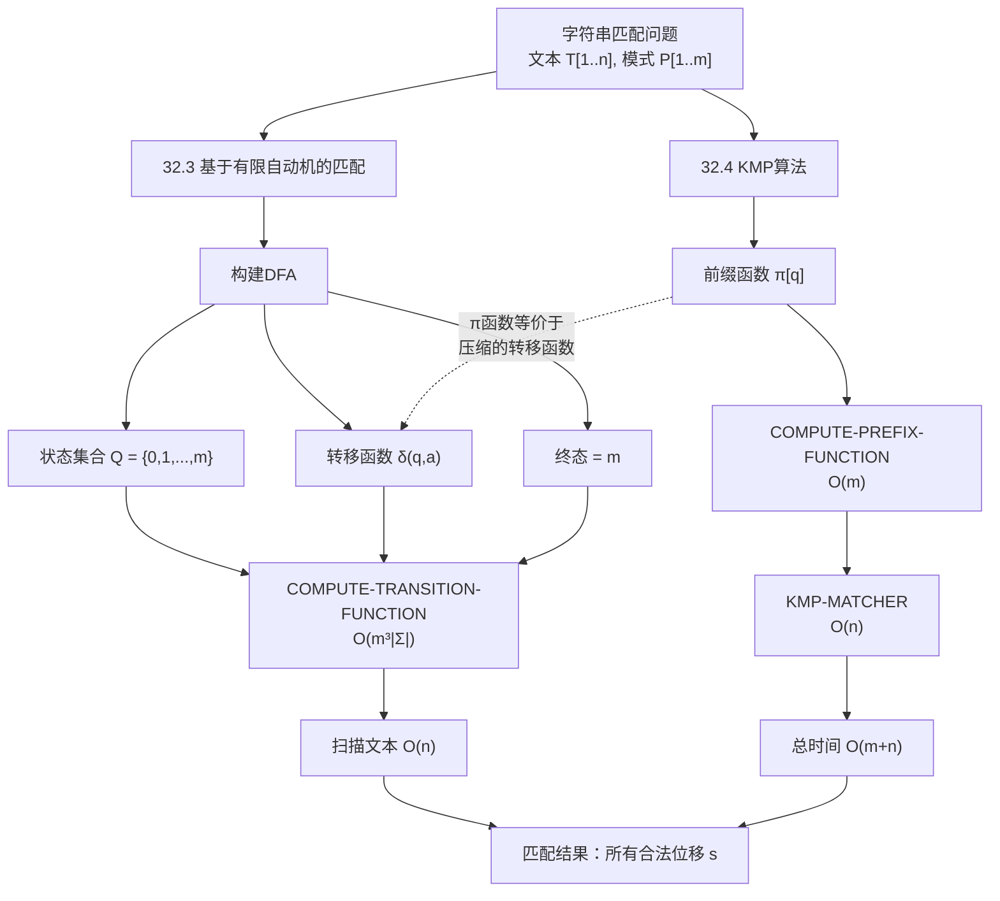
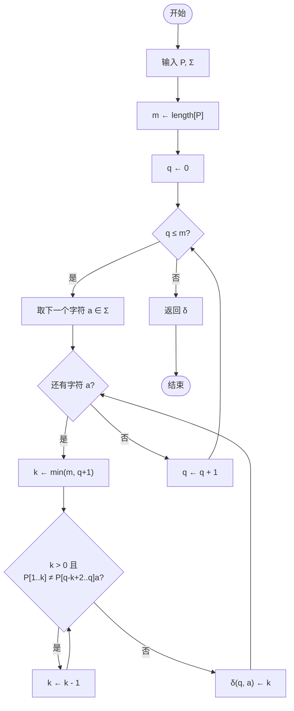
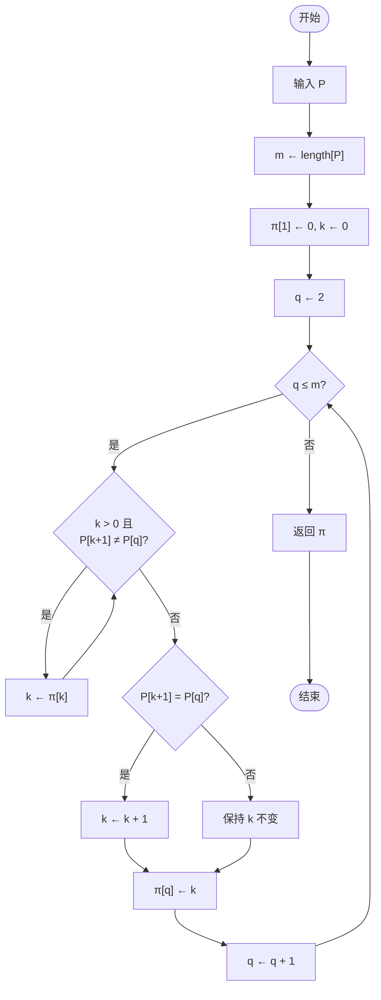
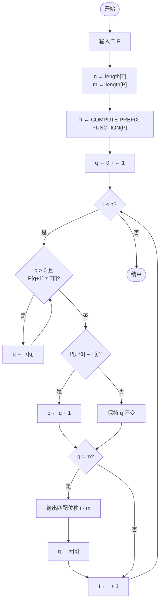

## 相关笔记
- 前置笔记：[[32.1 朴素匹配与Rabin-Karp算法]]、[[第31章_数论算法-章节汇总]]
- 关联概念：[[离散数学/concepts/算法]]、[[离散数学/concepts/递归定义]]、[[离散数学/concepts/字典序]]、[[算法导论/concepts/分治法]]、[[算法导论/concepts/动态规划]]
- 章节汇总：[[第32章_字符串匹配-章节汇总]]

> [!abstract] 概览
> 本节研究两种基于有限自动机思想的字符串匹配方法。**32.3节**介绍如何为模式串 $P$ 构造一个**确定性有限自动机（DFA）**，利用状态转移函数 $\delta(q,a)$ 在 $O(n)$ 时间内扫描文本 $T$ 完成匹配，但预处理代价为 $O(m^3|\Sigma|)$。**32.4节**介绍 **Knuth-Morris-Pratt（KMP）算法**，通过**前缀函数** $\pi[q]$（又称 failure function）巧妙地避免显式构建完整的DFA转移表，将预处理降至 $O(m)$，匹配保持 $O(n)$，总时间 $O(m+n)$。KMP算法是字符串匹配领域的里程碑成果，由 Knuth、Morris 和 Pratt 三位科学家于1977年联合提出。

## 知识结构总览



## 核心思想

### 32.3 字符串匹配的有限自动机

#### 32.3.1 有限自动机的基本概念

**确定性有限自动机（DFA）** 是一个五元组 $(Q, q_0, A, \Sigma, \delta)$，其中：

- $Q$ 是**有限状态集合**
- $q_0 \in Q$ 是**初始状态**
- $A \subseteq Q$ 是**接受状态集合**（终态集合）
- $\Sigma$ 是**输入字母表**
- $\delta: Q \times \Sigma \to Q$ 是**状态转移函数**

对于字符串匹配问题，我们为模式 $P[1..m]$ 构造一个特殊的DFA，使得该自动机在扫描文本 $T$ 的过程中，能够识别出 $P$ 在 $T$ 中的所有出现位置。

#### 32.3.2 字符串匹配自动机的构造

**状态集合**：$Q = \{0, 1, 2, \ldots, m\}$，共 $m+1$ 个状态。

- 状态 $q$ 的含义：当前已经成功匹配了模式 $P$ 的前 $q$ 个字符，即 $P[1..q]$ 是已扫描文本后缀的最长前缀匹配。
- 状态 $0$：初始状态，尚未匹配任何字符。
- 状态 $m$：**终态（接受状态）**，表示完整的模式 $P$ 已被匹配。

**状态转移函数** $\delta(q, a)$ 的定义：

$$\delta(q, a) = \sigma(P_{q}a)$$

其中 $P_q$ 表示模式 $P$ 的长度为 $q$ 的前缀（即 $P[1..q]$），$\sigma(x)$ 表示字符串 $x$ 的**最长后缀**同时也是 $P$ 的**前缀**的长度。

【**状态转移函数的直觉**】：当自动机处于状态 $q$（已匹配 $P[1..q]$）并读入字符 $a$ 时，需要确定新的匹配长度。如果 $P[q+1] = a$，则匹配长度增加到 $q+1$；如果 $P[q+1] \neq a$，则需要"回退"——找到 $P_q a$ 的最长后缀，使得该后缀同时也是 $P$ 的前缀。这个回退过程本质上就是在寻找模式自身的**自相似结构**。

**终态识别**：当自动机到达状态 $m$ 时，说明模式 $P$ 的全部 $m$ 个字符都已被成功匹配，此时报告一次匹配成功。

#### 32.3.3 COMPUTE-TRANSITION-FUNCTION 伪代码

```
COMPUTE-TRANSITION-FUNCTION(P, Σ)
1  m ← length[P]
2  for q ← 0 to m
3      for each character a ∈ Σ
4          k ← min(m, q + 1)
5          while k > 0 AND P[1..k] ≠ P[q-k+2..q]a
                // P[1..k] 不是 P[q-k+2..q]a 的后缀
6              k ← k - 1
7          δ(q, a) ← k
8  return δ
```

**执行流程图：**



**逐行解析**：

- **第1行**：获取模式 $P$ 的长度 $m$。
- **第2行**：遍历所有状态 $q = 0, 1, \ldots, m$。
- **第3行**：对每个状态，遍历字母表 $\Sigma$ 中的所有字符 $a$。
- **第4行**：初始化 $k$ 为 $\min(m, q+1)$，这是可能的匹配长度的上界——最多匹配到 $q+1$ 个字符（前 $q$ 个加上新字符 $a$），但不能超过模式长度 $m$。
- **第5-6行**：逐步减小 $k$，直到找到最大的 $k$ 使得 $P[1..k]$ 等于 $P[q-k+2..q]a$ 的后缀。条件 $P[1..k] \neq P[q-k+2..q]a$ 的含义是：模式的前 $k$ 个字符不等于"当前已匹配的 $q$ 个字符中去掉前面部分后再加上新字符 $a$"所形成的字符串的后缀。
- **第7行**：将转移结果记录到 $\delta(q, a)$ 中。

#### 32.3.4 预处理时间复杂度分析

**定理**：COMPUTE-TRANSITION-FUNCTION 的运行时间为 $O(m^3|\Sigma|)$。

**证明思路**：

- 外层循环遍历 $m+1$ 个状态，内层循环遍历 $|\Sigma|$ 个字符，共 $(m+1)|\Sigma|$ 次迭代。
- 每次迭代中，while 循环最多执行 $O(m)$ 次（$k$ 从 $\min(m,q+1)$ 递减到 $0$）。
- 每次比较 $P[1..k]$ 与 $P[q-k+2..q]a$ 需要比较 $k$ 个字符，代价为 $O(k) = O(m)$。
- 因此每次迭代代价为 $O(m^2)$，总代价为 $O(m^3|\Sigma|)$。$\blacksquare$

【**关键结论（预处理代价高昂）**】：虽然匹配阶段只需 $O(n)$ 时间，但预处理阶段 $O(m^3|\Sigma|)$ 的代价在实际应用中非常昂贵，特别是当字母表 $|\Sigma|$ 很大时（例如 Unicode 字符集）。这正是 KMP 算法要解决的核心问题。

#### 32.3.5 有限自动机匹配过程

```
FINITE-AUTOMATON-MATCHER(T, δ, m)
1  n ← length[T]
2  q ← 0
3  for i ← 1 to n
4      q ← δ(q, T[i])
5      if q = m
6          print "Pattern occurs with shift" i - m
```

匹配过程非常简洁：从初始状态 $q=0$ 开始，逐个读取文本字符，根据转移函数更新状态。一旦到达终态 $m$，就报告一次匹配。整个匹配过程只遍历文本一次，时间为 $O(n)$。

#### 32.3.6 逐步执行实例

**例**：设模式 $P = \text{ababaca}$，字母表 $\Sigma = \{a, b, c\}$。

我们构造部分状态转移表 $\delta(q, a)$：

| 状态 $q$ | $\delta(q,a)$ | $\delta(q,b)$ | $\delta(q,c)$ |
|:--------:|:------------:|:------------:|:------------:|
| 0 | 1 | 0 | 0 |
| 1 | 1 | 2 | 0 |
| 2 | 3 | 0 | 0 |
| 3 | 1 | 4 | 0 |
| 4 | 5 | 0 | 0 |
| 5 | 1 | 4 | 6 |
| 6 | 7 | 0 | 0 |
| 7 | 1 | 2 | 0 |

**部分转移的计算过程**：

- $\delta(0, a) = 1$：$P_0 a = a$，$a$ 的最长后缀同时也是 $P$ 的前缀的长度为 $1$（$P[1] = a$）。
- $\delta(0, b) = 0$：$P_0 b = b$，$b$ 不是 $P$ 的前缀，长度为 $0$。
- $\delta(1, a) = 1$：$P_1 a = aa$，最长后缀同时也是 $P$ 前缀的是 $a$（长度 $1$）。
- $\delta(1, b) = 2$：$P_1 b = ab$，$ab$ 正好是 $P[1..2]$，长度为 $2$。
- $\delta(2, a) = 3$：$P_2 a = aba$，$aba$ 正好是 $P[1..3]$，长度为 $3$。
- $\delta(2, b) = 0$：$P_2 b = abb$，没有任何非空前缀匹配。
- $\delta(3, a) = 1$：$P_3 a = abaa$，最长后缀同时也是 $P$ 前缀的是 $a$（长度 $1$）。
- $\delta(3, b) = 4$：$P_3 b = abab$，$abab$ 正好是 $P[1..4]$，长度为 $4$。
- $\delta(4, a) = 5$：$P_4 a = ababa$，$ababa$ 正好是 $P[1..5]$，长度为 $5$。
- $\delta(5, a) = 1$：$P_5 a = ababaa$，最长后缀同时也是 $P$ 前缀的是 $a$（长度 $1$）。
- $\delta(5, b) = 4$：$P_5 b = ababab$，最长后缀同时也是 $P$ 前缀的是 $abab$（长度 $4$）。
- $\delta(5, c) = 6$：$P_5 c = ababac$，$ababac$ 正好是 $P[1..6]$，长度为 $6$。
- $\delta(6, a) = 7$：$P_6 a = ababaca$，$ababaca$ 正好是 $P[1..7]$，长度为 $7$（终态）。

**状态转移图**（文字描述）：

```
状态0 --a--> 状态1 --b--> 状态2 --a--> 状态3 --b--> 状态4
                                                              |
状态1 <--a-- 状态3                                    a      v
  |                  状态0 <--b-- 状态2            状态5 --c--> 状态6
  |                      |                          ^            |
  b                      c                          b            a
  v                      v                          |            v
状态0                  状态0                    状态4      状态7（终态）
                                                    ^            |
                                                    |            a
                                              状态5 --b--+
```

**匹配实例**：设文本 $T = \text{abababaca}$

| 步骤 $i$ | $T[i]$ | 状态 $q$（转移后） | 说明 |
|:--------:|:------:|:-----------------:|:----:|
| 0 | - | 0 | 初始状态 |
| 1 | a | 1 | $\delta(0,a)=1$ |
| 2 | b | 2 | $\delta(1,b)=2$ |
| 3 | a | 3 | $\delta(2,a)=3$ |
| 4 | b | 4 | $\delta(3,b)=4$ |
| 5 | a | 5 | $\delta(4,a)=5$ |
| 6 | b | 4 | $\delta(5,b)=4$，回退！ |
| 7 | a | 5 | $\delta(4,a)=5$ |
| 8 | c | 6 | $\delta(5,c)=6$ |
| 9 | a | 7 | $\delta(6,a)=7$，匹配成功！ |

匹配位移 $s = 9 - 7 = 2$，即 $P$ 在 $T$ 中从位置 $3$ 开始出现（位移 $s=2$，CLRS 使用 $0$-indexed 位移）。

---

### 32.4 Knuth-Morris-Pratt 算法

#### 32.4.1 从有限自动机到 KMP 的动机

32.3节的有限自动机方法虽然匹配阶段高效（$O(n)$），但预处理代价高达 $O(m^3|\Sigma|)$。关键观察是：**大多数转移 $\delta(q,a)$ 在实际匹配中根本不会被用到**。KMP 算法的核心洞察是：我们不需要预先计算所有 $(q, a)$ 对的转移，只需要在匹配过程中**按需计算**那些真正需要的转移。

进一步分析发现，当匹配失败时（即读入字符 $a \neq P[q+1]$），状态回退只取决于**模式 $P$ 自身的结构**，与当前读入的具体字符无关。因此，我们可以预计算一个**前缀函数** $\pi[q]$，记录当状态 $q$ 匹配失败时应回退到哪个状态。

#### 32.4.2 前缀函数 $\pi[q]$ 的定义

**定义**：对于模式 $P[1..m]$，前缀函数 $\pi[q]$（$1 \leq q \leq m$）定义为 $P[1..q]$ 的**最长真前缀**的长度，该真前缀同时也是 $P[1..q]$ 的**后缀**。

用数学语言表达：

$$\pi[q] = \max\{k : k < q \text{ 且 } P[1..k] = P[q-k+1..q]\}$$

如果不存在这样的 $k$，则 $\pi[q] = 0$。

【**前缀函数的直觉**】：想象你在读一本重复章节的小说。当你读到第 $q$ 章发现内容对不上时，$\pi[q]$ 告诉你：往前回退多少章，可以从一个你已经熟悉的开头重新开始比对，而不需要从头来过。$\pi[q]$ 本质上编码了模式串自身的**自重复结构**——哪些前缀会作为后缀再次出现。

**例**：$P = \text{ababaca}$，计算 $\pi$ 函数：

| $q$ | 1 | 2 | 3 | 4 | 5 | 6 | 7 |
|:---:|:-:|:-:|:-:|:-:|:-:|:-:|:-:|
| $P[q]$ | a | b | a | b | a | c | a |
| $P[1..q]$ | a | ab | aba | abab | ababa | ababac | ababaca |
| $\pi[q]$ | 0 | 0 | 1 | 2 | 3 | 0 | 1 |

**逐步计算过程**：

- $\pi[1] = 0$：$P[1..1] = a$，没有真前缀等于后缀。
- $\pi[2] = 0$：$P[1..2] = ab$，真前缀 $\{a\}$，真后缀 $\{b\}$，无公共元素。
- $\pi[3] = 1$：$P[1..3] = aba$，真前缀 $\{a, ab\}$，真后缀 $\{a, ba\}$，最长公共者为 $a$，长度 $1$。
- $\pi[4] = 2$：$P[1..4] = abab$，真前缀 $\{a, ab, aba\}$，真后缀 $\{b, ab, bab\}$，最长公共者为 $ab$，长度 $2$。
- $\pi[5] = 3$：$P[1..5] = ababa$，真前缀 $\{a, ab, aba, abab\}$，真后缀 $\{a, ba, aba, baba\}$，最长公共者为 $aba$，长度 $3$。
- $\pi[6] = 0$：$P[1..6] = ababac$，真前缀 $\{a, ab, aba, abab, ababa\}$，真后缀 $\{c, ac, bac, abac, babac\}$，无公共元素。
- $\pi[7] = 1$：$P[1..7] = ababaca$，真前缀 $\{a, ab, \ldots, ababac\}$，真后缀 $\{a, ca, \ldots, babaca\}$，最长公共者为 $a$，长度 $1$。

#### 32.4.3 COMPUTE-PREFIX-FUNCTION 伪代码

```
COMPUTE-PREFIX-FUNCTION(P)
1  m ← length[P]
2  π[1] ← 0
3  k ← 0
4  for q ← 2 to m
5      while k > 0 AND P[k+1] ≠ P[q]
6          k ← π[k]
7      if P[k+1] = P[q]
8          k ← k + 1
9      π[q] ← k
10 return π
```

**执行流程图：**



**逐行解析**：

- **第1行**：获取模式长度 $m$。
- **第2行**：$\pi[1] = 0$，单个字符没有真前缀等于后缀的情况。
- **第3行**：$k$ 表示当前已知的最长匹配前缀长度，初始化为 $0$。
- **第4行**：从 $q=2$ 开始逐个计算 $\pi[q]$。
- **第5-6行**：**核心回退机制**。当 $P[k+1] \neq P[q]$ 时，说明当前候选前缀无法扩展。此时利用 $\pi[k]$ 回退到更短的前缀继续尝试。这就像剥洋葱一样，一层一层地缩短候选前缀，直到找到能匹配的或者退到 $0$。
- **第7-8行**：如果 $P[k+1] = P[q]$，说明当前候选前缀可以扩展一个字符，$k$ 增加 $1$。
- **第9行**：记录 $\pi[q]$ 的值。

**逐步执行实例**：$P = \text{ababaca}$

| $q$ | $P[q]$ | 循环前 $k$ | while 执行 | $P[k+1]=P[q]$? | 循环后 $k$ | $\pi[q]$ |
|:---:|:------:|:---------:|:---------:|:-------------:|:---------:|:-------:|
| 2 | b | 0 | 不执行（$k=0$） | $P[1]=a \neq b$ | 0 | 0 |
| 3 | a | 0 | 不执行（$k=0$） | $P[1]=a = a$ | 1 | 1 |
| 4 | b | 1 | 不执行（$P[2]=b = P[4]=b$） | 是 | 2 | 2 |
| 5 | a | 2 | 不执行（$P[3]=a = P[5]=a$） | 是 | 3 | 3 |
| 6 | c | 3 | $k=3$: $P[4]=b \neq c$, $k←\pi[3]=1$; $k=1$: $P[2]=b \neq c$, $k←\pi[1]=0$; $k=0$: 停止 | $P[1]=a \neq c$ | 0 | 0 |
| 7 | a | 0 | 不执行（$k=0$） | $P[1]=a = a$ | 1 | 1 |

最终 $\pi = [0, 0, 1, 2, 3, 0, 1]$。

#### 32.4.4 KMP-MATCHER 伪代码

```
KMP-MATCHER(T, P)
1  n ← length[T]
2  m ← length[P]
3  π ← COMPUTE-PREFIX-FUNCTION(P)
4  q ← 0                    // 已匹配的字符数
5  for i ← 1 to n           // 扫描文本
6      while q > 0 AND P[q+1] ≠ T[i]
7          q ← π[q]         // 利用前缀函数回退
8      if P[q+1] = T[i]
9          q ← q + 1        // 匹配成功，扩展
10     if q = m             // 整个模式已匹配
11         print "Pattern occurs with shift" i - m
12         q ← π[q]         // 继续寻找下一个匹配
```

**执行流程图：**



**逐行解析**：

- **第1-2行**：获取文本和模式的长度。
- **第3行**：预处理阶段，计算前缀函数，时间 $O(m)$。
- **第4行**：$q$ 为当前已匹配的字符数，初始为 $0$。
- **第5行**：从左到右逐个扫描文本字符。
- **第6-7行**：**匹配失败时的回退**。当 $P[q+1] \neq T[i]$ 时，利用 $\pi[q]$ 回退到更短的匹配前缀。这个回退过程与 COMPUTE-PREFIX-FUNCTION 中的回退逻辑完全对称。
- **第8-9行**：**匹配成功时扩展**。当前字符匹配，$q$ 增加 $1$。
- **第10-11行**：如果 $q = m$，说明完整匹配，报告位移 $s = i - m$。
- **第12行**：匹配成功后，利用 $\pi[m]$ 回退，继续寻找可能的下一个匹配（处理重叠匹配的情况）。

**逐步执行实例**：$T = \text{abababaca}$，$P = \text{ababaca}$，$\pi = [0, 0, 1, 2, 3, 0, 1]$

| $i$ | $T[i]$ | 循环前 $q$ | while 回退 | $P[q+1]=T[i]$? | 循环后 $q$ | 输出 |
|:---:|:------:|:---------:|:---------:|:-------------:|:---------:|:----:|
| 1 | a | 0 | 无 | $P[1]=a=a$ | 1 | - |
| 2 | b | 1 | 无 | $P[2]=b=b$ | 2 | - |
| 3 | a | 2 | 无 | $P[3]=a=a$ | 3 | - |
| 4 | b | 3 | 无 | $P[4]=b=b$ | 4 | - |
| 5 | a | 4 | 无 | $P[5]=a=a$ | 5 | - |
| 6 | b | 5 | $P[6]=c \neq b$, $q←\pi[5]=3$; $P[4]=b=b$, 停止 | 是 | 4 | - |
| 7 | a | 4 | 无 | $P[5]=a=a$ | 5 | - |
| 8 | c | 5 | 无 | $P[6]=c=c$ | 6 | - |
| 9 | a | 6 | 无 | $P[7]=a=a$ | 7 | shift 2 |

输出：Pattern occurs with shift 2（即 $P$ 出现在 $T[3..9]$）。

**回退细节（第6步）**：当 $i=6$，$T[6]=b$，$q=5$ 时，$P[6]=c \neq b$，执行 $q ← \pi[5] = 3$。此时 $P[4]=b = T[6]=b$，匹配成功，$q$ 增加到 $4$。注意文本指针 $i$ 始终没有回退——这正是 KMP 的精髓所在。

#### 32.4.5 KMP 算法的正确性：循环不变式分析

**引理**（KMP-MATCHER 的循环不变式）：在第5行 for 循环每次迭代开始时，$q = \sigma(T_i)$，即 $q$ 等于文本前缀 $T[1..i-1]$ 的最长后缀同时也是 $P$ 的前缀的长度。

**初始化**：第一次迭代前，$i=1$，$T[1..0]$ 为空串，其最长后缀同时也是 $P$ 前缀的长度为 $0$，而 $q=0$。不变式成立。

**维持**：假设第 $i$ 次迭代开始时 $q = \sigma(T_i)$ 成立。需要证明迭代结束后 $q = \sigma(T_{i+1})$。

- while 循环（第6-7行）的作用：不断将 $q$ 减小为 $\pi[q]$，直到 $P[q+1] = T[i]$ 或 $q = 0$。由 $\pi$ 的定义，每次回退后 $q$ 仍然是 $T[1..i-1]$ 的某个后缀同时也是 $P$ 前缀的长度，只是越来越短。
- if 判断（第8-9行）：如果 $P[q+1] = T[i]$，则 $P[1..q+1]$ 既是 $T[1..i]$ 的后缀，也是 $P$ 的前缀。此时 $q$ 增加 $1$，恰好等于 $\sigma(T_{i+1})$。
- 如果 $P[q+1] \neq T[i]$ 且 $q = 0$，则 $\sigma(T_{i+1}) = 0 = q$。

【**关键结论（不变式维持）**】：无论匹配成功还是失败，迭代结束后 $q = \sigma(T_{i+1})$ 始终成立。

**终止**：for 循环结束时 $i = n+1$，$q = \sigma(T_{n+1})$。在整个过程中，每当 $q = m$ 时（第10行），说明 $\sigma(T_{i+1}) \geq m$，即 $P$ 完整出现在 $T$ 中，位移为 $i - m$。$\blacksquare$

#### 32.4.6 O(m+n) 线性时间证明

**定理**：KMP-MATCHER 的总运行时间为 $O(m + n)$。

**证明**：

分两部分分析：

**第一部分：COMPUTE-PREFIX-FUNCTION 的 $O(m)$ 时间**

使用**势能分析法**。定义势函数 $\Phi_q = k$（第4行 for 循环第 $q$ 次迭代开始时的 $k$ 值）。

- $k$ 的值始终满足 $0 \leq k \leq q - 1$。
- 第5-6行 while 循环每次执行使 $k$ 至少减少 $1$（因为 $\pi[k] < k$）。
- 第8行使 $k$ 最多增加 $1$。
- 在整个 for 循环中，$k$ 的总增加量不超过 $m$ 次（每次迭代最多增加 $1$），而 $k$ 不能为负数，因此 while 循环的总执行次数不超过 $m$ 次。
- 总时间 = $O(m)$（for 循环 $m-1$ 次 + while 循环总共不超过 $m$ 次）。$\blacksquare$

**第二部分：KMP-MATCHER 的 $O(n)$ 匹配时间**

同样使用势能分析法。定义势函数 $\Phi_i = q$（第5行 for 循环第 $i$ 次迭代开始时的 $q$ 值）。

- $q$ 的值始终满足 $0 \leq q \leq m$。
- 第6-7行 while 循环每次执行使 $q$ 至少减少 $1$（因为 $\pi[q] < q$）。
- 第9行使 $q$ 最多增加 $1$。
- 在整个 for 循环中，$q$ 的总增加量不超过 $n$ 次，因此 while 循环的总执行次数不超过 $n$ 次。
- 总时间 = $O(n)$。$\blacksquare$

【**关键结论（总线性时间）**】：预处理 $O(m)$ + 匹配 $O(n)$ = $O(m+n)$。KMP 算法在所有情况下都保证线性时间复杂度，不依赖于字母表大小 $|\Sigma|$。

#### 32.4.7 $\pi$ 函数与有限自动机的关系

KMP 的前缀函数 $\pi$ 与有限自动机的转移函数 $\delta$ 之间存在深刻的联系：

**命题**：对于任意状态 $q$ 和字符 $a$，如果 $a = P[q+1]$，则 $\delta(q, a) = q + 1$；如果 $a \neq P[q+1]$，则 $\delta(q, a) = \delta(\pi[q], a)$。

**直觉解释**：

- 当匹配的下一个字符恰好是 $P[q+1]$ 时，状态自然前进到 $q+1$。
- 当匹配失败时，状态回退到 $\pi[q]$，然后从回退后的状态继续尝试匹配字符 $a$。这等价于在有限自动机中直接查询 $\delta(q, a)$。

**推论**：$\pi$ 函数编码了DFA转移函数的**压缩表示**。KMP 算法在匹配过程中通过 $\pi$ 函数**按需恢复**所需的转移，避免了预先计算完整的 $(m+1) \times |\Sigma|$ 转移表。这就是为什么 KMP 的预处理时间是 $O(m)$ 而不是 $O(m^3|\Sigma|)$。

用生活类比来说：有限自动机方法像是提前为所有可能的岔路口都画好了地图（转移表），而 KMP 方法只记住了一个"回退规则"（$\pi$ 函数），走到死胡同时根据规则自动找到上一个岔路口重新出发。

> [!info] KMP算法的历史渊源
> KMP算法由 Donald E. Knuth、James H. Morris 和 Vaughan R. Pratt 三位计算机科学家于1977年在 SIAM Journal on Computing 上联合发表，论文题为 "Fast Pattern Matching in Strings"。该算法的提出源于一个实际问题：Knuth 在为文本编辑器实现正则表达式匹配时，发现朴素匹配在最坏情况下效率极低。三位作者独立地发现了相同的核心思想——利用模式串自身的重复结构来避免冗余比较。这篇论文被认为是字符串匹配领域最具影响力的工作之一，奠定了线性时间字符串匹配的理论基础。
>
> 参考链接：[Fast Pattern Matching in Strings (SIAM, 1977)](https://www.semanticscholar.org/paper/Fast-Pattern-Matching-in-Strings-Knuth-Morris/5253fead88bfeaaa2930daccb7324a264cb681a9)

> [!info] 前缀函数与Z函数的等价关系
> **前缀函数**（prefix function, $\pi$）和 **Z函数**（Z-function, $Z$）是字符串算法中两个核心工具，它们在表达能力上完全等价。Z函数 $Z[i]$ 定义为字符串 $S$ 从位置 $i$ 开始的子串与 $S$ 的最长公共前缀的长度。给定 $\pi$ 函数可以在 $O(n)$ 时间内构造 $Z$ 函数，反之亦然。两者在字符串匹配、周期检测、字符串压缩等问题中可以互相替代。在实际应用中，Z函数的实现通常更简洁直观，而前缀函数在KMP算法的框架下更为自然。USACO Guide 提供了两者关系的详细对比和练习。
>
> 参考链接：[String Searching - USACO Guide](https://usaco.guide/adv/string-search)

> [!info] 有限自动机与Aho-Corasick多模式匹配
> 基于有限自动机的字符串匹配思想可以自然地推广到**多模式匹配**场景。Aho-Corasick 算法（1975）是这一推广的经典成果，它为多个模式串同时构建一个有限状态机（在 Trie 树的基础上添加 failure 指针），能够在 $O(n + z)$ 时间内找到文本中所有模式串的所有出现（$z$ 为匹配总数）。Aho-Corasick 算法可以看作是 KMP 算法向多模式情形的直接推广——KMP 的 $\pi$ 函数对应 Aho-Corasick 中的 failure 指针。该算法广泛应用于入侵检测系统（IDS）、生物信息学和搜索引擎中。
>
> 参考链接：[String-Matching with Automata (NYU, Mohri)](https://cs.nyu.edu/~mohri/pub/njc.pdf)

> [!info] 经典字符串匹配算法的性能对比
> 在实际应用中，KMP、Boyer-Moore 和 Rabin-Karp 三种算法各有优劣。Boyer-Moore 算法通过从右向左扫描模式串，利用"坏字符规则"和"好后缀规则"实现大跨度跳跃，在实际文本中通常比 KMP 更快（亚线性时间）。Rabin-Karp 算法基于滚动哈希，在多模式匹配场景下具有天然优势。KMP 的优势在于**最坏情况保证**——无论文本和模式的内容如何，KMP 始终在 $O(m+n)$ 时间内完成匹配。基准测试表明，在随机文本上 Boyer-Moore 通常快 3-5 倍，但在退化输入（如 $T = aaaaa\ldots a$，$P = aaaab$）上 KMP 表现更稳定。
>
> 参考链接：[String Matching Algorithm Analysis (GitHub)](https://github.com/Karol2905/string-matching-algorithm-analysis/blob/main/analysis.ipynb)

> [!warning] 前缀函数 $\pi[q]$ 的精确定义
> $\pi[q]$ 是 $P[1..q]$ 的**最长真前缀**（proper prefix，即长度严格小于 $q$）的长度，该真前缀同时也是 $P[1..q]$ 的**后缀**。注意两个关键限定词：
> - **"真"**：前缀长度必须严格小于 $q$，因此 $\pi[q] < q$ 恒成立。$\pi[q]$ 不可能是 $q$ 本身。
> - **"最长"**：如果有多个满足条件的前缀，取最长的一个。
>
> 常见错误是把 $\pi[q]$ 理解为"最长公共前后缀的长度"而忽略了"真前缀"的限制。例如对于 $P[1..q] = \text{aaa}$，$\pi[3] = 2$（真前缀 $\text{aa}$），而不是 $3$。

> [!warning] 有限自动机预处理的高昂代价
> COMPUTE-TRANSITION-FUNCTION 的时间复杂度为 $O(m^3|\Sigma|)$。当字母表很大时（例如 ASCII 有 128 个字符，Unicode 有超过 14 万个字符），这个预处理代价在实际中是不可接受的。KMP 算法通过 $\pi$ 函数巧妙地避免了显式构建 $(m+1) \times |\Sigma|$ 的完整转移表，将预处理降至 $O(m)$。这是 KMP 相对于朴素有限自动机方法的核心优势。在实际工程中，几乎不会直接使用完整的DFA转移表进行字符串匹配。

> [!warning] KMP 与 Boyer-Moore 的实际性能差异
> 虽然 KMP 保证最坏情况 $O(m+n)$ 的时间复杂度，但在实际应用中，Boyer-Moore 算法通常表现更好。原因在于 Boyer-Moore 从右向左扫描模式串，利用"坏字符规则"可以跳过大量不必要的比较，在英文文本等自然语言场景下平均只需检查 $O(n/m)$ 个字符。然而，Boyer-Moore 的最坏时间复杂度为 $O(nm)$，在退化输入（如重复字符）上可能表现很差。选择哪种算法取决于具体场景：需要最坏情况保证时选 KMP，追求实际平均性能时选 Boyer-Moore。

## 习题精选

| 题号 | 题目描述 | 难度 |
|:-----|:---------|:----:|
| 32.3-1 | 为模式构造有限自动机状态转移表 | ★★★ |
| 32.3-2 | 模拟有限自动机匹配过程 | ★★☆ |
| 32.4-1 | 计算模式的前缀函数π | ★★★ |
| 32.4-5 | 利用前缀函数高效计算转移函数 | ★★★★ |

> [!faq]- 习题 32.3-1：构造有限自动机
> **题目**：为模式 $P = \text{aabb}$ 构造字符串匹配有限自动机的状态转移表 $\delta$，字母表 $\Sigma = \{a, b\}$。画出状态转移图。
>
> **解题思路**：模式长度 $m=4$，状态集合 $\{0,1,2,3,4\}$。对每个状态 $q$ 和每个字符 $a \in \{a,b\}$，计算 $\delta(q,a) = \sigma(P_q a)$。
>
> **答案**：
>
> 状态转移表：
>
> | 状态 $q$ | $\delta(q,a)$ | $\delta(q,b)$ |
> |:--------:|:------------:|:------------:|
> | 0 | 1 | 0 |
> | 1 | 2 | 0 |
> | 2 | 2 | 3 |
> | 3 | 1 | 4 |
> | 4 | 1 | 0 |
>
> 部分计算说明：
> - $\delta(0,a)=1$：$P_0 a = a$，$a$ 是 $P$ 的前缀，长度 $1$。
> - $\delta(0,b)=0$：$P_0 b = b$，$b$ 不是 $P$ 的前缀。
> - $\delta(1,a)=2$：$P_1 a = aa$，$aa$ 是 $P[1..2]$，长度 $2$。
> - $\delta(1,b)=0$：$P_1 b = ab$，$ab$ 的后缀 $\{b\}$ 不是 $P$ 的前缀。
> - $\delta(2,a)=2$：$P_2 a = aab$ 后缀加 $a$ = $aaba$，最长后缀同时也是 $P$ 前缀的是 $a$（$P[1]=a$），但注意 $P_2 = aa$，$P_2 a = aaa$，最长后缀同时也是 $P$ 前缀的是 $aa$（$P[1..2]$），长度 $2$。
> - $\delta(2,b)=3$：$P_2 b = aab$，$aab = P[1..3]$，长度 $3$。
> - $\delta(3,a)=1$：$P_3 a = aabb$ 后缀加 $a$ = $aabba$，最长后缀同时也是 $P$ 前缀的是 $a$，长度 $1$。
> - $\delta(3,b)=4$：$P_3 b = aabb$，$aabb = P[1..4]$，长度 $4$（终态）。
>
> 状态转移图：
> ```
> 状态0 --a--> 状态1 --a--> 状态2 --b--> 状态3 --b--> 状态4（终态）
>   ^              |              |              |              |
>   |              b              a              a              a
>   |              v              |              v              v
>   +------------ 状态0            +---------- 状态1          状态1
> ```

> [!faq]- 习题 32.3-2：有限自动机匹配过程
> **题目**：使用上题构造的有限自动机，在文本 $T = \text{aabbaabb}$ 中查找模式 $P = \text{aabb}$。给出每一步的状态变化。
>
> **解题思路**：从状态 $q=0$ 开始，逐个字符输入自动机，记录状态转移过程。
>
> **答案**：
>
> | 步骤 $i$ | $T[i]$ | 转移前 $q$ | $\delta(q, T[i])$ | 转移后 $q$ | 说明 |
> |:--------:|:------:|:---------:|:-----------------:|:---------:|:----:|
> | 1 | a | 0 | $\delta(0,a)$ | 1 | - |
> | 2 | a | 1 | $\delta(1,a)$ | 2 | - |
> | 3 | b | 2 | $\delta(2,b)$ | 3 | - |
> | 4 | b | 3 | $\delta(3,b)$ | 4 | 匹配！shift 0 |
> | 5 | a | 4 | $\delta(4,a)$ | 1 | 回退 |
> | 6 | a | 1 | $\delta(1,a)$ | 2 | - |
> | 7 | b | 2 | $\delta(2,b)$ | 3 | - |
> | 8 | b | 3 | $\delta(3,b)$ | 4 | 匹配！shift 4 |
>
> 输出：Pattern occurs with shift 0 和 shift 4。

> [!faq]- 习题 32.4-1：计算前缀函数
> **题目**：计算模式 $P = \text{abababb}$ 的前缀函数 $\pi$。给出每一步的详细计算过程。
>
> **解题思路**：使用 COMPUTE-PREFIX-FUNCTION 逐个计算 $\pi[q]$，$q = 1, 2, \ldots, 7$。
>
> **答案**：
>
> | $q$ | $P[q]$ | $P[1..q]$ | $\pi[q]$ | 说明 |
> |:---:|:------:|:---------:|:-------:|:----:|
> | 1 | a | a | 0 | 无真前缀 |
> | 2 | b | ab | 0 | 前缀 $\{a\}$，后缀 $\{b\}$，无交集 |
> | 3 | a | aba | 1 | $a$ 既是前缀也是后缀 |
> | 4 | b | abab | 2 | $ab$ 既是前缀也是后缀 |
> | 5 | a | ababa | 3 | $aba$ 既是前缀也是后缀 |
> | 6 | b | ababab | 4 | $abab$ 既是前缀也是后缀 |
> | 7 | b | abababb | 0 | 前缀 $\{a,ab,aba,abab,ababa,ababab\}$，后缀 $\{b,bb,abb,babb,ababb,bababb\}$，无交集 |
>
> 最终 $\pi = [0, 0, 1, 2, 3, 4, 0]$。
>
> 用算法逐步验证 $\pi[7]$ 的计算：
> - $q=7$，$k=4$（上一步的值），$P[5]=a \neq P[7]=b$，$k ← \pi[4]=2$
> - $k=2$，$P[3]=a \neq P[7]=b$，$k ← \pi[2]=0$
> - $k=0$，while 结束。$P[1]=a \neq P[7]=b$，$k$ 保持 $0$
> - $\pi[7] = 0$ ✓

> [!faq]- 习题 32.4-5：利用前缀函数高效计算转移函数
> **题目**：说明如何利用前缀函数 $\pi$ 在 $O(m|\Sigma|)$ 时间内计算有限自动机的转移函数 $\delta$，而不是使用 COMPUTE-TRANSITION-FUNCTION 的 $O(m^3|\Sigma|)$ 时间。
>
> **解题思路**：利用 $\pi$ 函数与 $\delta$ 函数的关系。对于状态 $q$ 和字符 $a$：
> - 如果 $a = P[q+1]$，则 $\delta(q,a) = q+1$。
> - 如果 $a \neq P[q+1]$，则递归地查找 $\delta(\pi[q], a)$，直到找到匹配或回退到状态 $0$。
>
> **答案**：
>
> 改进的计算方法：
> ```
> IMPROVED-COMPUTE-TRANSITION-FUNCTION(P, Σ)
> 1  m ← length[P]
> 2  π ← COMPUTE-PREFIX-FUNCTION(P)
> 3  for q ← 0 to m
> 4      for each character a ∈ Σ
> 5          if q = m
> 6              k ← π[q]
> 7          else if a = P[q+1]
> 8              k ← q + 1
> 9          else
> 10             k ← δ(π[q], a)    // 递归查找，利用已计算的结果
> 11         δ(q, a) ← k
> 12 return δ
> ```
>
> **复杂度分析**：
> - 外层循环 $(m+1)|\Sigma|$ 次迭代。
> - 第10行的递归查找利用了**动态规划**的思想：$\delta(\pi[q], a)$ 在之前的迭代中已经被计算过（因为 $\pi[q] < q$），因此可以直接查表，时间为 $O(1)$。
> - 总时间 = $O(m|\Sigma|)$（外层循环）+ $O(m)$（计算 $\pi$ 函数）= $O(m|\Sigma|)$。
>
> 这比原始的 $O(m^3|\Sigma|)$ 有了巨大改进。不过注意，这仍然依赖于字母表大小 $|\Sigma|$，而 KMP-MATCHER 完全不需要枚举字母表，这才是 KMP 真正的优势所在。

## 视频学习指南

| 视频来源 | 标题 | 时长 | 覆盖内容 | 推荐度 |
|:-------:|:----:|:---:|:-------:|:-----:|
| MIT 6.006 | Lecture 12: String Matching | ~75min | 有限自动机、KMP算法、Rabin-Karp | ★★★★★ |
| Abudula(算法竞赛) | KMP算法详解 | ~40min | 前缀函数推导、代码实现、例题 | ★★★★☆ |
| Karpathy | Building a Regex Engine | ~60min | 有限自动机在正则表达式中的应用 | ★★★★☆ |
| CP-Algorithms | Prefix Function | ~25min | $\pi$ 函数的严格证明与应用 | ★★★★★ |
| 王道考研 | KMP算法 | ~50min | next数组、匹配过程、考研题型 | ★★★☆☆ |

> [!quote] 教材原文
> "We now show how to construct, in $O(m)$ time, a table $\pi$ that allows the KMP matcher to run in $O(n)$ time. The table $\pi$ is called the **prefix function**. The prefix function $\pi$ for a pattern encapsulates information about how the pattern matches against shifts of itself."
>
> "The KMP algorithm does not need to compute the full transition function $\delta$. It uses the prefix function $\pi$ to compute the transition function on the fly, as needed during the matching process."
>
> "The key observation is that the information needed to compute $\delta(q, a)$ is already contained in the prefix function. Specifically, if $a \neq P[q+1]$, then $\delta(q, a) = \delta(\pi[q], a)$, and we can apply this identity repeatedly until we find a state where the transition is defined."
>
> —— CLRS, Introduction to Algorithms, 4th Edition, Section 32.4

## 参见Wiki

- [String matching algorithm - Wikipedia](https://en.wikipedia.org/wiki/String-searching_algorithm)
- [Knuth-Morris-Pratt algorithm - Wikipedia](https://en.wikipedia.org/wiki/Knuth%E2%80%93Morris%E2%80%93Pratt_algorithm)
- [Aho-Corasick algorithm - Wikipedia](https://en.wikipedia.org/wiki/Aho%E2%80%93Corasick_algorithm)

---

#学习/算法导论/第32章-字符串匹配 #学习/算法导论/字符串匹配/KMP
