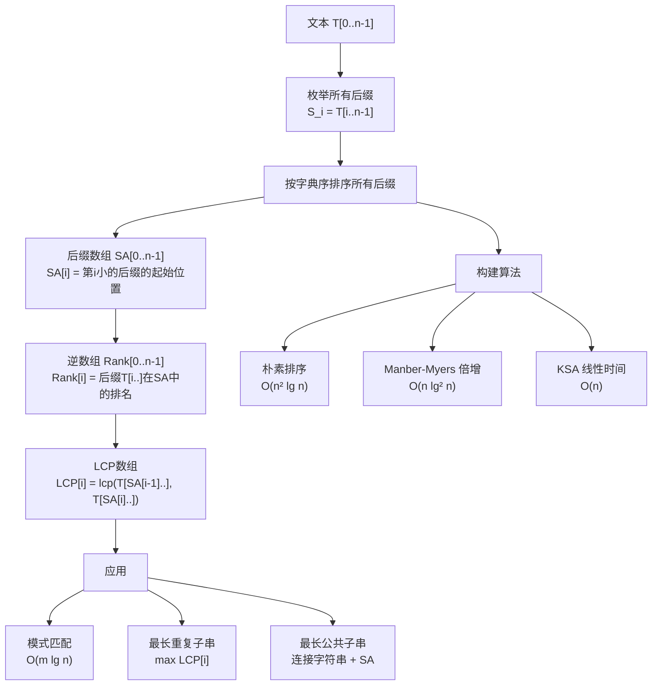
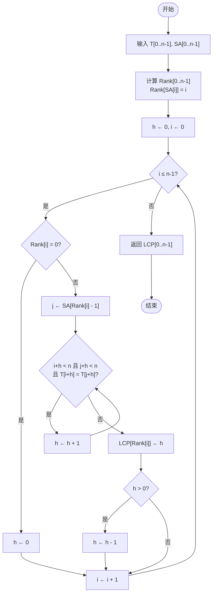

## 相关笔记
- 前置笔记：[[32.2 有限自动机与KMP算法]]、[[32.1 朴素匹配与Rabin-Karp算法]]
- 关联概念：[[离散数学/concepts/字典序]]、[[离散数学/concepts/算法]]、[[算法导论/concepts/分治法]]、[[算法导论/concepts/动态规划]]
- 章节汇总：[[第32章_字符串匹配-章节汇总]]

> [!abstract] 概览
> 后缀数组（Suffix Array, SA）是字符串处理中一种轻量级的索引数据结构，它将文本的所有后缀按字典序排列，并记录每个后缀的起始位置。与后缀树相比，后缀数组占用更少的内存（仅需 $O(n)$ 空间存储整数数组），且构建算法相对简洁。配合最长公共前缀数组（LCP Array），后缀数组可以实现模式匹配、最长重复子串查找、最长公共子串计算等多种字符串操作。本节将系统讲解后缀数组的定义、构建方法（从朴素排序到线性时间算法）、LCP数组的构建，以及它们在实际问题中的应用。



## 核心思想

### 32.5.1 后缀数组的定义

给定长度为 $n$ 的文本 $T[0..n-1]$（假设末尾有一个特殊的哨兵字符 `$`，其字典序小于所有其他字符），文本共有 $n$ 个后缀：

$$S_0 = T[0..n-1], \quad S_1 = T[1..n-1], \quad \ldots, \quad S_{n-1} = T[n-1..n-1]$$

**后缀数组** $\text{SA}[0..n-1]$ 是一个整数数组，满足：将所有后缀按字典序从小到大排列后，$\text{SA}[i]$ 记录排名为 $i$ 的后缀的**起始位置**。

**逆后缀数组**（Rank 数组）$\text{Rank}[0..n-1]$ 是后缀数组的逆映射：$\text{Rank}[i]$ 表示后缀 $T[i..n-1]$ 在字典序中的排名。

两者满足互逆关系：
$$\text{Rank}[\text{SA}[i]] = i, \quad \text{SA}[\text{Rank}[i]] = i$$

#### 逐步构建实例

以文本 $T = \text{``abab\$''}$（长度 $n = 5$）为例，逐步构建后缀数组。

**第一步：枚举所有后缀**

| 索引 $i$ | 后缀 $T[i..4]$ |
|:--------:|:--------------:|
| 0 | `abab$` |
| 1 | `bab$` |
| 2 | `ab$` |
| 3 | `b$` |
| 4 | `$` |

**第二步：按字典序排序**

字典序比较规则：逐字符比较，遇到第一个不同的字符时，ASCII 码较小者排在前面。哨兵字符 `$` 的 ASCII 码为 36，小于字母 `a`（97）和 `b`（98），因此 `$` 排在最前。

排序过程：
- `$` 最小（只有哨兵字符）
- `ab$` < `abab$`（比较到第3个字符：`$` < `a`）
- `bab$` < `b$`（比较到第2个字符：`a` < `$`... 不对，重新比较）

重新仔细排序：
- `$`：只有1个字符，最小
- `ab$`：第1字符 `a`，第2字符 `b`，第3字符 `$`
- `abab$`：第1字符 `a`，第2字符 `b`，第3字符 `a`... 与 `ab$` 比较：前2字符相同，第3字符 `a` > `$`，所以 `ab$` < `abab$`
- `b$`：第1字符 `b`，第2字符 `$`
- `bab$`：第1字符 `b`，第2字符 `a`... 与 `b$` 比较：第1字符相同，第2字符 `a` < `$`... 不对，`a`(97) > `$`(36)

修正：`$` 的 ASCII 码是 36，`a` 是 97，`b` 是 98。所以 `a` > `$`。

- `$` < `ab$` < `abab$` < `b$` < `bab$`

验证 `b$` vs `bab$`：第1字符都是 `b`，第2字符 `$`(36) < `a`(97)，所以 `b$` < `bab$`。

**第三步：得到后缀数组**

| 排名 $i$ | 后缀 | 起始位置 $\text{SA}[i]$ |
|:--------:|:----:|:-----------------------:|
| 0 | `$` | 4 |
| 1 | `ab$` | 2 |
| 2 | `abab$` | 0 |
| 3 | `b$` | 3 |
| 4 | `bab$` | 1 |

因此 $\text{SA} = [4, 2, 0, 3, 1]$。

**第四步：得到 Rank 数组**

| 起始位置 $i$ | 排名 $\text{Rank}[i]$ |
|:------------:|:---------------------:|
| 0 | 2 |
| 1 | 4 |
| 2 | 1 |
| 3 | 3 |
| 4 | 0 |

因此 $\text{Rank} = [2, 4, 1, 3, 0]$。

验证互逆关系：$\text{Rank}[\text{SA}[0]] = \text{Rank}[4] = 0$ ✓，$\text{SA}[\text{Rank}[0]] = \text{SA}[2] = 0$ ✓。

---

### 32.5.2 LCP 数组的定义

**LCP 数组** $\text{LCP}[0..n-1]$ 记录后缀数组中相邻两个后缀的最长公共前缀长度：

$$\text{LCP}[i] = |\text{lcp}(T[\text{SA}[i-1]..n-1],\; T[\text{SA}[i]..n-1])|, \quad i = 1, 2, \ldots, n-1$$

约定 $\text{LCP}[0] = 0$（或未定义），因为第一个后缀没有前驱。

#### 逐步构建实例

继续以 $T = \text{``abab\$''}$，$\text{SA} = [4, 2, 0, 3, 1]$ 为例：

| $i$ | $\text{SA}[i-1]$ | $\text{SA}[i]$ | 后缀1 | 后缀2 | 公共前缀 | $\text{LCP}[i]$ |
|:---:|:-----------------:|:---------------:|:-----:|:-----:|:--------:|:---------------:|
| 0 | — | 4 | — | `$` | — | 0 |
| 1 | 4 | 2 | `$` | `ab$` | 无 | 0 |
| 2 | 2 | 0 | `ab$` | `abab$` | `ab` | 2 |
| 3 | 0 | 3 | `abab$` | `b$` | 无 | 0 |
| 4 | 3 | 1 | `b$` | `bab$` | `b` | 1 |

因此 $\text{LCP} = [0, 0, 2, 0, 1]$。

**LCP 数组的关键性质**：对于任意 $1 \le i < j \le n-1$，后缀 $\text{SA}[i]$ 与 $\text{SA}[j]$ 的最长公共前缀长度等于 $\text{LCP}$ 数组在区间 $[i+1, j]$ 上的最小值：

$$|\text{lcp}(T[\text{SA}[i]..], T[\text{SA}[j]..])| = \min\{\text{LCP}[i+1], \text{LCP}[i+2], \ldots, \text{LCP}[j]\}$$

这一性质是后缀数组能够高效支持各种查询的理论基础。它本质上反映了字典序排序的结构特征：两个后缀在排序后相距越远，它们的最长公共前缀越短。

**证明思路**：设在字典序中，后缀 $A = T[\text{SA}[i]..]$ 排在 $B = T[\text{SA}[j]..]$ 前面，中间的后缀序列为 $A = S_{k_0}, S_{k_1}, \ldots, S_{k_m} = B$。由于字典序的传递性，$A$ 与 $B$ 的公共前缀不可能超过 $A$ 与 $S_{k_1}$ 的公共前缀，以此类推，公共前缀长度受限于路径上所有相邻对 LCP 的最小值。同时，这个最小值一定能达到，因为公共前缀在排序过程中只能逐步缩短或保持，不会出现先缩短再增长的情况。【关键词：字典序传递性、RMQ（区间最小值查询）】

---

### 32.5.3 后缀数组的应用

#### 应用一：模式匹配 —— $O(m \lg n)$

**问题**：给定模式 $P[0..m-1]$ 和文本 $T[0..n-1]$，找出 $P$ 在 $T$ 中的所有出现位置。

**方法**：在后缀数组上执行**二分查找**。

后缀数组将所有后缀按字典序排列，而模式 $P$ 可以视为一个"虚拟后缀"。通过二分查找，可以在 $O(\lg n)$ 次比较内定位 $P$ 在排序序列中的位置范围，每次比较需要 $O(m)$ 时间（逐字符比较），总时间 $O(m \lg n)$。

**利用 LCP 加速**：在二分查找过程中，利用已计算的 LCP 信息可以跳过已经确认相同的字符前缀，避免重复比较。具体地，维护一个变量 `lcp_lo` 和 `lcp_hi`，分别记录当前搜索区间左端点和右端点与 $P$ 的已知公共前缀长度。每次比较时，只需从已确认的公共前缀之后继续比较即可。这一优化将均摊比较次数降低，使得总比较次数为 $O(m + \lg n)$。

**逐步执行实例**

在 $T = \text{``abab\$''}$ 中查找 $P = \text{``ab''}$。

$\text{SA} = [4, 2, 0, 3, 1]$，对应后缀为 `$`, `ab$`, `abab$`, `b$`, `bab$`。

**二分查找过程**：

初始区间 $\text{lo} = 0$，$\text{hi} = 4$。

- **第1轮**：$\text{mid} = 2$，$\text{SA}[2] = 0$，后缀为 `abab$`。比较 $P = \text{``ab''}$ 与 `abab$`：前2个字符相同，$P$ 较短，视为 $P \le$ `abab$`。令 $\text{hi} = 2$。
- **第2轮**：$\text{mid} = 1$，$\text{SA}[1] = 2$，后缀为 `ab$`。比较 $P = \text{``ab''}$ 与 `ab$`：前2个字符相同，$P$ 较短，视为 $P \le$ `ab$`。令 $\text{hi} = 1$。
- **第3轮**：$\text{mid} = 0$，$\text{SA}[0] = 4$，后缀为 `$`。比较 $P = \text{``ab''}$ 与 `$`：`a` > `$`，$P >$ `$`。令 $\text{lo} = 1$。

此时 $\text{lo} = 1$，$\text{hi} = 1$，找到下界。$P$ 作为前缀出现在 $\text{SA}[1] = 2$ 对应的后缀 `ab$` 中。

继续查找上界：在 $[1, 4]$ 中二分查找 $P$ 的上界。

- $\text{mid} = 2$，`abab$` 以 `ab` 开头，$P$ 是其前缀。令 $\text{lo} = 3$。
- $\text{mid} = 3$，`b$` 不以 `ab` 开头。令 $\text{hi} = 3$。

上界为 3。因此 $P$ 出现在 $\text{SA}[1] = 2$ 和 $\text{SA}[2] = 0$ 对应的位置。

**结果**：$P = \text{``ab''}$ 在 $T$ 中的出现位置为 **0** 和 **2**。

验证：$T[0..1] = \text{``ab''}$ ✓，$T[2..3] = \text{``ab''}$ ✓。

#### 应用二：最长重复子串 —— $O(n)$

**问题**：找出文本 $T$ 中出现至少两次的最长子串。

**方法**：最长重复子串一定是后缀数组中某两个相邻后缀的公共前缀。因此只需找到 $\text{LCP}$ 数组中的最大值。

$$\text{最长重复子串长度} = \max_{1 \le i \le n-1} \text{LCP}[i]$$

对应的子串为 $T[\text{SA}[k].. \text{SA}[k] + \text{LCP}[k] - 1]$，其中 $k = \arg\max_i \text{LCP}[i]$。

**实例**：$T = \text{``abab\$''}$，$\text{LCP} = [0, 0, 2, 0, 1]$。

最大 $\text{LCP}$ 值为 2，出现在 $i = 2$。$\text{SA}[2] = 0$，最长重复子串为 $T[0..1] = \text{``ab''}$。

验证：`ab` 在 $T$ 中出现在位置 0 和位置 2，确实是出现至少两次的最长子串。

#### 应用三：最长公共子串 —— $O(n)$

**问题**：给定两个字符串 $S$ 和 $T$，找出它们的最长公共子串。

**方法**：
1. 用一个不出现在 $S$ 和 $T$ 中的特殊字符（如 `#`）连接：$S' = S + \text{``\#''} + T + \text{``\$''}$。
2. 对 $S'$ 构建后缀数组和 LCP 数组。
3. 扫描 LCP 数组，找到满足 $\text{SA}[i-1]$ 和 $\text{SA}[i]$ 分别来自 $S$ 和 $T$（即分属 `#` 两侧）的最大 $\text{LCP}[i]$ 值。

**实例**：$S = \text{``ab''}$，$T = \text{``ba''}$。

连接后 $S' = \text{``ab\#ba\$''}$（长度 7）。

后缀列表：
| 索引 | 后缀 | 来源 |
|:----:|:----:|:----:|
| 0 | `ab#ba$` | S |
| 1 | `b#ba$` | S |
| 2 | `#ba$` | 分隔 |
| 3 | `ba$` | T |
| 4 | `a$` | T |
| 5 | `$` | 哨兵 |

排序后：`$` < `#ba$` < `a$` < `ab#ba$` < `ba$` < `b#ba$`

$\text{SA} = [5, 2, 4, 0, 3, 1]$

计算 LCP：
- LCP[1] = lcp(`$`, `#ba$`) = 0
- LCP[2] = lcp(`#ba$`, `a$`) = 0
- LCP[3] = lcp(`a$`, `ab#ba$`) = 1（公共前缀 `a`）
- LCP[4] = lcp(`ab#ba$`, `ba$`) = 0
- LCP[5] = lcp(`ba$`, `b#ba$`) = 1（公共前缀 `b`）

检查跨字符串的 LCP：
- LCP[3] = 1：SA[2]=4（来自T），SA[3]=0（来自S），跨字符串 ✓
- LCP[5] = 1：SA[4]=3（来自T），SA[5]=1（来自S），跨字符串 ✓

最大跨字符串 LCP 为 1，最长公共子串长度为 1，子串为 `a` 或 `b`。

---

### 32.5.4 构建算法概述

#### 算法一：朴素排序 —— $O(n^2 \lg n)$

**思路**：直接将所有 $n$ 个后缀视为字符串，使用通用排序算法（如快速排序或归并排序）按字典序排列。

**复杂度分析**：
- 共有 $n$ 个后缀需要排序。
- 每次比较两个后缀需要 $O(n)$ 时间（最坏情况下需要比较全部字符）。
- 排序需要 $O(n \lg n)$ 次比较。
- 总时间：$O(n^2 \lg n)$。

**逐步执行实例**

对 $T = \text{``abab\$''}$ 朴素排序：

所有后缀：`abab$`(0), `bab$`(1), `ab$`(2), `b$`(3), `$`(4)。

比较过程（归并排序示意）：
1. 分组比较：`abab$` vs `bab$` → `a` < `b`，`abab$` < `bab$`；`ab$` vs `b$` → `a` < `b`，`ab$` < `b$`。
2. 合并：`abab$`, `ab$` vs `bab$`, `b$` → `ab$` < `abab$`（第3字符 `$` < `a`），`b$` < `bab$`（第2字符 `$` < `a`）。
3. 插入 `$`：`$` 最小。

最终排序结果：`$`(4), `ab$`(2), `abab$`(0), `b$`(3), `bab$`(1)。

$\text{SA} = [4, 2, 0, 3, 1]$ ✓

#### 算法二：Manber-Myers 倍增排序 —— $O(n \lg^2 n)$

**核心思想**：利用【关键词：倍增（doubling）】策略，逐步扩大比较的窗口大小。第 $k$ 轮比较前 $2^k$ 个字符的排名，利用第 $k-1$ 轮的结果在 $O(1)$ 时间内完成第 $k$ 轮的比较。

**算法流程**：

1. **初始化**（$k = 0$）：按每个后缀的第1个字符排序，得到初始排名。
2. **倍增**（$k = 1, 2, \ldots, \lceil \lg n \rceil$）：
   - 第 $k$ 轮中，每个后缀用二元组 $(\text{rank}_k[i],\; \text{rank}_k[i + 2^{k-1}])$ 作为排序键。
   - 这个二元组完整编码了前 $2^k$ 个字符的字典序信息。
   - 使用基于键值的稳定排序（如基数排序），在 $O(n)$ 时间内完成排序。
3. 当所有排名互不相同时，排序完成。

**复杂度分析**：
- 共 $\lceil \lg n \rceil$ 轮。
- 每轮排序 $O(n)$（基数排序）或 $O(n \lg n)$（比较排序）。
- 使用基数排序时总时间为 $O(n \lg n)$；使用比较排序时为 $O(n \lg^2 n)$。

**逐步执行实例**

对 $T = \text{``abab\$''}$ 执行倍增排序。

**第0轮**（$k = 0$，比较前 $2^0 = 1$ 个字符）：

| 索引 $i$ | 字符 $T[i]$ | 初始排名 |
|:--------:|:-----------:|:--------:|
| 0 | `a` | 1 |
| 1 | `b` | 2 |
| 2 | `a` | 1 |
| 3 | `b` | 2 |
| 4 | `$` | 0 |

排名数组 $\text{rank}_0 = [1, 2, 1, 2, 0]$。

**第1轮**（$k = 1$，比较前 $2^1 = 2$ 个字符）：

排序键为 $(\text{rank}_0[i],\; \text{rank}_0[i + 1])$（超出范围时排名记为 $-1$）：

| 索引 $i$ | 排序键 | 新排名 |
|:--------:|:------:|:------:|
| 4 | $(0, -1)$ | 0 |
| 0 | $(1, 2)$ | 2 |
| 2 | $(1, 2)$ | 2 |
| 1 | $(2, 1)$ | 3 |
| 3 | $(2, -1)$ | 1 |

排名数组 $\text{rank}_1 = [2, 3, 2, 1, 0]$。

注意：索引 0 和 2 的排序键相同（都是 $(1, 2)$），说明前 2 个字符无法区分它们，需要继续倍增。

**第2轮**（$k = 2$，比较前 $2^2 = 4$ 个字符）：

排序键为 $(\text{rank}_1[i],\; \text{rank}_1[i + 2])$：

| 索引 $i$ | 排序键 | 新排名 |
|:--------:|:------:|:------:|
| 4 | $(0, 2)$ | 0 |
| 2 | $(2, -1)$ | 1 |
| 0 | $(2, 1)$ | 2 |
| 3 | $(1, -1)$ | 3 |
| 1 | $(3, -1)$ | 4 |

排名数组 $\text{rank}_2 = [2, 4, 1, 3, 0]$。

所有排名互不相同，排序完成。$\text{SA} = [4, 2, 0, 3, 1]$ ✓

**正确性证明要点**：【关键词：二元组编码、字典序等价性】

引理：若两个后缀的前 $2^{k-1}$ 个字符的排名分别为 $r_1$ 和 $r_1'$，后 $2^{k-1}$ 个字符的排名分别为 $r_2$ 和 $r_2'$，则前 $2^k$ 个字符的字典序比较等价于二元组 $(r_1, r_2)$ 与 $(r_1', r_2')$ 的字典序比较。

证明：设后缀 $A = T[i..]$ 和 $B = T[j..]$。若前 $2^{k-1}$ 个字符不同，则 $r_1 \ne r_1'$，二元组比较直接给出结果，与逐字符比较一致。若前 $2^{k-1}$ 个字符相同，则比较结果取决于从位置 $i + 2^{k-1}$ 和 $j + 2^{k-1}$ 开始的后 $2^{k-1}$ 个字符，这正是 $r_2$ 与 $r_2'$ 的比较。因此二元组比较完全等价于前 $2^k$ 个字符的字典序比较。

#### 算法三：KSA 线性时间构建 —— $O(n)$

**Kärkkäinen-Sanders 算法（KSA）** 是第一个概念简洁的线性时间后缀数组构建算法（2003年）。

**核心思想**：基于【关键词：分治法（divide and conquer）】和【关键词：诱导排序（induced sorting）】。

**算法流程**：

1. **采样**：从文本中取出所有位置 $i$ 满足 $i \bmod 3 \ne 0$ 的字符，构成子序列 $T'$。
2. **递归排序**：对子序列 $T'$ 递归构建后缀数组。由于 $T'$ 的长度约为 $\frac{2n}{3}$，递归深度有限。
3. **诱导排序**：利用 $T'$ 的排序结果，推导出所有位置（包括 $i \bmod 3 = 0$ 的位置）的完整排序。

**复杂度分析**：

设 $T(n)$ 为长度 $n$ 的文本的排序时间：
$$T(n) = T\left(\frac{2n}{3}\right) + O(n)$$

由主定理，$T(n) = O(n)$。

**正确性证明要点**：【关键词：三分采样、递归归约、诱导排序正确性】

关键引理：若已知所有 $i \bmod 3 \ne 0$ 位置的后缀排序，则可以在 $O(n)$ 时间内确定所有 $i \bmod 3 = 0$ 位置的后缀排序。

证明思路：对于 $i \bmod 3 = 0$ 的位置 $i$，其后缀 $T[i..]$ 的第一个字符是 $T[i]$，之后紧跟的是位置 $i+1$ 的后缀。由于 $i+1 \bmod 3 \ne 0$，位置 $i+1$ 的后缀排名已经已知。因此 $T[i..]$ 的排序可以视为先按 $T[i]$ 分组，再按位置 $i+1$ 的后缀排名排序，这可以在 $O(n)$ 时间内通过基数排序完成。

#### 算法四：Kasai 算法构建 LCP 数组 —— $O(n)$

**Kasai 算法**（2001年）利用后缀数组和逆数组，在 $O(n)$ 时间内构建 LCP 数组。

**核心思想**：利用【关键词：LCP 单调性（monotonicity property）】——若后缀 $T[i..]$ 与其在前一个排名的后缀的 LCP 长度为 $h$，则后缀 $T[i+1..]$ 与其对应前驱的 LCP 长度至少为 $h - 1$。

**形式化表述**：设 $\text{Rank}[i] = k$，即 $T[i..]$ 在后缀数组中排名第 $k$。令 $j = \text{SA}[k-1]$，则 $\text{LCP}[k] = |\text{lcp}(T[i..], T[j..])|$。对于后缀 $T[i+1..]$，设其排名为 $k' = \text{Rank}[i+1]$，前驱为 $j' = \text{SA}[k'-1]$，则：

$$|\text{lcp}(T[i+1..], T[j'..])| \ge |\text{lcp}(T[i..], T[j..])| - 1$$

**证明**：$T[i+1..]$ 是 $T[i..]$ 去掉首字符后的子串，$T[j+1..]$ 是 $T[j..]$ 去掉首字符后的子串。若 $T[i..]$ 和 $T[j..]$ 有 $h$ 个公共前缀字符，则 $T[i+1..]$ 和 $T[j+1..]$ 至少有 $h - 1$ 个公共前缀字符。而 $T[j+1..]$ 在字典序中位于 $T[j'..]$ 的某个位置，$T[j'..]$ 是 $T[i+1..]$ 在排序中的直接前驱，所以 $T[i+1..]$ 与 $T[j'..]$ 的公共前缀长度不小于 $T[i+1..]$ 与 $T[j+1..]$ 的公共前缀长度，即不小于 $h - 1$。【关键词：前驱的LCP下界、字符移位不变性】

**算法伪代码**：

```
KASAI-BUILD-LCP(T[0..n-1], SA[0..n-1]):
    计算 Rank[0..n-1]  // Rank[SA[i]] = i
    h ← 0
    for i ← 0 to n-1 do
        if Rank[i] = 0 then
            h ← 0
        else
            j ← SA[Rank[i] - 1]  // 前驱后缀的起始位置
            while i + h < n 且 j + h < n 且 T[i+h] = T[j+h] do
                h ← h + 1
            LCP[Rank[i]] ← h
            if h > 0 then
                h ← h - 1  // 利用单调性
    return LCP[0..n-1]
```

**执行流程图：**



**逐步执行实例**

对 $T = \text{``abab\$''}$，$\text{SA} = [4, 2, 0, 3, 1]$，$\text{Rank} = [2, 4, 1, 3, 0]$。

初始化：$h = 0$，$\text{LCP} = [0, 0, 0, 0, 0]$。

| 步骤 | $i$ | $\text{Rank}[i]$ | $j = \text{SA}[\text{Rank}[i]-1]$ | 比较过程 | $h$ | $\text{LCP}[\text{Rank}[i]]$ |
|:----:|:---:|:----------------:|:----------------------------------:|:--------:|:---:|:---------------------------:|
| 1 | 0 | 2 | $\text{SA}[1] = 2$ | $T[0]=a, T[2]=a$ → $T[1]=b, T[3]=b$ → $T[2]=a, T[4]=\$$ → 不同 | 2 | $\text{LCP}[2] = 2$ |
| 2 | 1 | 4 | $\text{SA}[3] = 3$ | $h$ 从 $2-1=1$ 开始：$T[2]=a, T[4]=\$$ → 不同，$h$ 退为 0 → $T[1]=b, T[3]=b$ → $T[2]=a, T[4]=\$$ → 不同 | 1 | $\text{LCP}[4] = 1$ |
| 3 | 2 | 1 | $\text{SA}[0] = 4$ | $h$ 从 $1-1=0$ 开始：$T[2]=a, T[4]=\$$ → 不同 | 0 | $\text{LCP}[1] = 0$ |
| 4 | 3 | 3 | $\text{SA}[2] = 0$ | $h$ 从 $0$ 开始：$T[3]=b, T[0]=a$ → 不同 | 0 | $\text{LCP}[3] = 0$ |
| 5 | 4 | 0 | — | $\text{Rank}[4] = 0$，跳过 | 0 | — |

最终 $\text{LCP} = [0, 0, 2, 0, 1]$ ✓

**复杂度分析**：变量 $h$ 在整个算法执行过程中最多增加 $n$ 次（每次 while 循环 $h$ 加 1），最多减少 $n$ 次（每次 $h \leftarrow h - 1$）。因此 while 循环的总执行次数为 $O(n)$，加上外层 for 循环的 $O(n)$，总时间为 $O(n)$。

---

### 32.5.5 后缀数组构建算法总结

| 算法 | 时间复杂度 | 空间复杂度 | 核心策略 |
|:----:|:----------:|:----------:|:--------:|
| 朴素排序 | $O(n^2 \lg n)$ | $O(n)$ | 直接排序所有后缀 |
| Manber-Myers | $O(n \lg^2 n)$ | $O(n)$ | 倍增 + 基数排序 |
| DC3/KSA | $O(n)$ | $O(n)$ | 三分采样 + 递归 + 诱导排序 |
| SA-IS | $O(n)$ | $O(n)$ | 诱导排序（非递归） |

其中 SA-IS（2009年）是实际应用中最快的线性时间算法，它基于诱导排序但不使用递归，常数因子更小。

---

## 补充理解

> [!info] 后缀数组构建算法的历史演进
> 后缀数组由 Manber 和 Myers 于 1990 年首次提出，最初的构建算法时间为 $O(n \lg n)$。2003 年，Kärkkäinen 和 Sanders 提出了 DC3 算法（也称 KSA），首次实现了概念简洁的 $O(n)$ 线性时间构建。随后 Kim 等人（2005）和 Ko 与 Aluru（2005）独立提出了不同的线性时间算法。2009 年，Nong 等人提出了 SA-IS 算法，基于诱导排序框架且无需递归，成为实际应用中最快的线性时间后缀数组构建算法。
> 参考：https://dl.acm.org/doi/pdf/10.1145/1217856.1217858

> [!info] 后缀数组 vs 后缀树：时空权衡
> 后缀树（Suffix Tree）是最强大的字符串索引结构，支持 $O(m)$ 时间的模式匹配和各种复杂的字符串查询。然而后缀树的空间开销较大，实际实现中每个节点需要存储多个指针，常数因子高。后缀数组仅存储两个整数数组（SA 和 LCP），空间开销约为后缀树的 1/3 到 1/5。在查询时间上，后缀数组需要 $O(m \lg n)$（或利用 LCP 加速到 $O(m + \lg n)$），比后缀树的 $O(m)$ 略慢，但空间优势使其更适合处理大规模文本数据。
> 参考：https://mpop.gitbook.io/bioinformatics-lecture-notes/string-indexing/suffix-arrays

> [!info] 后缀数组在生物信息学中的应用
> 后缀数组是现代基因组序列比对工具的核心数据结构。BWA（Burrows-Wheeler Aligner）使用基于后缀数组的 FM-index 实现高效短读段比对，Bowtie 和 Bowtie2 同样基于后缀数组构建索引。在人类基因组（约 30 亿碱基对）规模上，后缀数组的内存效率使其成为实际可用的索引方案。后缀数组还被广泛应用于基因组重复序列检测、全基因组比对、以及变异检测等任务中。
> 参考：https://academic.oup.com/bioinformatics/article-pdf/30/23/3396/48931347/btu553.pdf

> [!info] Kasai 算法：线性时间 LCP 数组构建
> Kasai 算法由 Kasai、Lee、Arimura、Arikawa 和 Park 于 2001 年提出，是第一个线性时间 LCP 数组构建算法。其核心洞察是 LCP 值的单调性：相邻后缀的 LCP 值在按起始位置顺序扫描时，每次最多减少 1。这一性质保证了总比较次数为 $O(n)$。Kasai 算法简洁优雅，是后缀数组工具链中不可或缺的组成部分。
> 参考：https://www.cs.ucr.edu/~rakthant/cs234/01_KLAAP_Linear%20time%20LCP.PDF

---

## 易混淆点

> [!warning] 后缀数组的索引是起始位置，不是后缀本身
> 后缀数组 $\text{SA}[i]$ 存储的是**整数**，表示排名第 $i$ 的后缀在原文本中的**起始下标**，而非后缀字符串本身。例如 $\text{SA}[0] = 4$ 表示排名第 0 的后缀从位置 4 开始，即 $T[4..] = \text{``\$''}$。初学者容易混淆 $\text{SA}[i]$ 的值与后缀的内容，需要牢记 SA 是一个整数索引数组。

> [!warning] LCP[i] 的定义涉及 SA 中相邻位置，不是 Rank 的相邻
> $\text{LCP}[i]$ 定义的是后缀数组中**排名第 $i-1$** 和**排名第 $i$** 的两个后缀的最长公共前缀长度，即 $\text{LCP}[i] = |\text{lcp}(T[\text{SA}[i-1]..], T[\text{SA}[i]..])|$。它不是按起始位置相邻的后缀对计算的。例如在 $T = \text{``abab\$''}$ 中，$\text{LCP}[2] = 2$ 对应的是 $\text{SA}[1]=2$ 和 $\text{SA}[2]=0$ 这两个后缀（即 `ab$` 和 `abab$`），而非起始位置 1 和 2 的后缀。

> [!warning] 后缀数组 + LCP 不等于后缀树，但查询能力等价
> 后缀数组配合 LCP 数组可以实现后缀树的大部分查询功能（模式匹配、最长重复子串、最长公共子串等），且空间更省、构建更简单。但后缀树支持一些动态操作（如在线插入）和更直观的树形遍历，在某些特定场景下仍有优势。选择哪种结构取决于具体应用场景的需求：若内存受限且不需要动态更新，后缀数组是更优选择。

---

## 习题精选

| 题号 | 题目描述 | 难度 |
|:-----|:---------|:----:|
| 32.5-1 | 手动构建后缀数组和Rank数组 | ★★☆ |
| 32.5-2 | 构建LCP数组 | ★★★ |
| 32.5-3 | 利用后缀数组找最长重复子串 | ★★★ |
| 32.5-4 | Kasai算法手动模拟 | ★★★★ |

> [!faq]- 习题 32.5-1：手动构建后缀数组
> **题目**：给定文本 $T = \text{``banana\$''}$，手动构建后缀数组 SA 和 Rank 数组。
>
> **解题思路**：枚举所有后缀，按字典序排序，记录起始位置。
>
> **答案**：
>
> 所有后缀：
> | 索引 | 后缀 |
> |:----:|:----:|
> | 0 | `banana$` |
> | 1 | `anana$` |
> | 2 | `nana$` |
> | 3 | `ana$` |
> | 4 | `na$` |
> | 5 | `a$` |
> | 6 | `$` |
>
> 按字典序排序：`$`(6) < `a$`(5) < `ana$`(3) < `anana$`(1) < `banana$`(0) < `na$`(4) < `nana$`(2)
>
> $\text{SA} = [6, 5, 3, 1, 0, 4, 2]$
>
> $\text{Rank} = [4, 3, 6, 2, 5, 1, 0]$

> [!faq]- 习题 32.5-2：构建 LCP 数组
> **题目**：对上题中 $T = \text{``banana\$''}$ 的后缀数组，构建 LCP 数组。
>
> **解题思路**：对 SA 中相邻的后缀对，逐字符比较求最长公共前缀。
>
> **答案**：
>
> | $i$ | $\text{SA}[i-1]$ | $\text{SA}[i]$ | 后缀1 | 后缀2 | $\text{LCP}[i]$ |
> |:---:|:-----------------:|:---------------:|:-----:|:-----:|:---------------:|
> | 0 | — | 6 | — | `$` | 0 |
> | 1 | 6 | 5 | `$` | `a$` | 0 |
> | 2 | 5 | 3 | `a$` | `ana$` | 1 |
> | 3 | 3 | 1 | `ana$` | `anana$` | 3 |
> | 4 | 1 | 0 | `anana$` | `banana$` | 0 |
> | 5 | 0 | 4 | `banana$` | `na$` | 0 |
> | 6 | 4 | 2 | `na$` | `nana$` | 2 |
>
> $\text{LCP} = [0, 0, 1, 3, 0, 0, 2]$

> [!faq]- 习题 32.5-3：最长重复子串
> **题目**：利用后缀数组和 LCP 数组，找出 $T = \text{``banana\$''}$ 的最长重复子串。
>
> **解题思路**：最长重复子串对应 LCP 数组中的最大值。
>
> **答案**：
>
> $\text{LCP} = [0, 0, 1, 3, 0, 0, 2]$，最大值为 3，出现在 $i = 3$。
>
> $\text{SA}[3] = 1$，最长重复子串为 $T[1..1+3-1] = T[1..3] = \text{``ana''}$。
>
> 验证：`ana` 在 `banana$` 中出现在位置 1（`ana$` 的一部分）和位置 3（`ana$` 本身）。

> [!faq]- 习题 32.5-4：Kasai 算法手动模拟
> **题目**：对 $T = \text{``banana\$''}$，$\text{SA} = [6, 5, 3, 1, 0, 4, 2]$，手动执行 Kasai 算法构建 LCP 数组。
>
> **解题思路**：按起始位置 $i = 0, 1, \ldots, 6$ 的顺序扫描，利用 LCP 单调性。
>
> **答案**：
>
> $\text{Rank} = [4, 3, 6, 2, 5, 1, 0]$，初始 $h = 0$。
>
> | $i$ | $\text{Rank}[i]$ | $j$ | 比较过程 | $h$ | $\text{LCP}[\text{Rank}[i]]$ |
> |:---:|:----------------:|:---:|:--------:|:---:|:---------------------------:|
> | 0 | 4 | $\text{SA}[3]=1$ | $T[0]=b \ne T[1]=a$ | 0 | $\text{LCP}[4]=0$ |
> | 1 | 3 | $\text{SA}[2]=3$ | $T[1]=a=T[3]=a \to T[2]=n=T[4]=n \to T[3]=a=T[5]=a$ | 3 | $\text{LCP}[3]=3$ |
> | 2 | 6 | $\text{SA}[5]=4$ | $h$ 从 $3-1=2$ 开始：$T[2]=n=T[4]=n \to T[3]=a=T[5]=a \to T[4]=n \ne T[6]=\$$ | 2 | $\text{LCP}[6]=2$ |
> | 3 | 2 | $\text{SA}[1]=5$ | $h$ 从 $2-1=1$ 开始：$T[3]=a=T[5]=a \to T[4]=n \ne T[6]=\$$ | 1 | $\text{LCP}[2]=1$ |
> | 4 | 5 | $\text{SA}[4]=0$ | $h$ 从 $1-1=0$ 开始：$T[4]=n \ne T[0]=b$ | 0 | $\text{LCP}[5]=0$ |
> | 5 | 1 | $\text{SA}[0]=6$ | $h$ 从 0 开始：$T[5]=a \ne T[6]=\$$ | 0 | $\text{LCP}[1]=0$ |
> | 6 | 0 | — | 跳过 | 0 | — |
>
> $\text{LCP} = [0, 0, 1, 3, 0, 0, 2]$ ✓

---

## 视频学习指南

| 视频资源 | 讲者/来源 | 覆盖内容 | 时长 | 难度 | 推荐指数 |
|:--------:|:---------:|:--------:|:----:|:----:|:--------:|
| Suffix Arrays | William F. Smyth (York University) | 后缀数组基础理论、构建算法、应用 | ~60 min | ★★★☆☆ | ★★★★☆ |
| Suffix Array Construction | Ben Langmein (JHU) | 后缀数组与后缀树对比、生物信息学应用 | ~45 min | ★★★☆☆ | ★★★★★ |
| Suffix Array | VisuAlgo | 后缀数组交互式可视化、Kasai 算法演示 | ~15 min | ★★☆☆☆ | ★★★★☆ |
| Advanced Suffix Array | Dan Gusfield (UC Davis) | LCP 数组、RMQ、后缀数组高级应用 | ~90 min | ★★★★★ | ★★★★☆ |
| 后缀数组专题 | 竞赛算法讲解（中文） | 倍增法构建、Kasai 算法、经典题目 | ~40 min | ★★★☆☆ | ★★★★☆ |

---

## 教材原文

> [!quote] CLRS 第4版 32.5节 后缀数组（英文原文摘录）
> "A **suffix array** for a text $T$ is an array of the starting positions of all suffixes of $T$, sorted in lexicographic order. Given a suffix array, we can efficiently answer many string-processing queries. For example, we can find all occurrences of a pattern $P$ in $T$ in $O(m \lg n)$ time using binary search on the suffix array, where $m = |P|$ and $n = |T|$."
>
> "The **LCP array** stores the lengths of the longest common prefixes between consecutive suffixes in the suffix array. Combined with the suffix array, the LCP array enables efficient computation of the longest repeated substring, the longest common substring of two strings, and many other string-processing problems."

---

## 参见Wiki

- [[第32章_字符串匹配-章节汇总]]
- [[第32章_字符串匹配/32.1 朴素匹配与Rabin-Karp算法]]
- [[第32章_字符串匹配/32.2 有限自动机与KMP算法]]
- [[算法导论/concepts/分治法]]
- [[算法导论/concepts/动态规划]]

#学习/算法导论/第32章-字符串匹配 #学习/算法导论/字符串匹配/后缀数组
