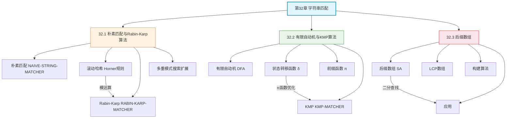

## 相关笔记

**本章节笔记：**
- [[32.1 朴素匹配与Rabin-Karp算法]] — 朴素字符串匹配、滚动哈希、Rabin-Karp算法、多重模式搜索
- [[32.2 有限自动机与KMP算法]] — 字符串匹配有限自动机、前缀函数、KMP算法、O(m+n)线性时间证明
- [[32.3 后缀数组]] — 后缀数组定义与构建、LCP数组、模式匹配应用、Kasai算法

**前置章节汇总：**
- [[第31章_数论算法-章节汇总]] — 数论算法（前一章，Rabin-Karp的模运算基础）
- [[第05章_概率分析与随机化算法-章节汇总]] — 概率分析与随机化算法（Rabin-Karp期望分析的理论基础）

**后续章节：**
- 第33章 计算几何（待学习）

---

> [!abstract] 概览
> 第32章系统介绍了==字符串匹配==问题的多种算法解决方案，从最直观的朴素匹配出发，逐步引入==滚动哈希==、==有限自动机==、==前缀函数==等高级技术，最终延伸到==后缀数组==这一强大的字符串索引结构。全章以"如何高效地在文本中查找模式"为核心线索，展示了从==二次时间==到==线性时间==的算法优化路径。
>
> 三篇笔记层层递进：(1) 32.1节介绍朴素匹配算法及其局限性，32.2节引入==Rabin-Karp算法==，通过==滚动哈希==将模式比较转化为哈希比较，实现期望O(n+m)的多模式匹配；(2) 32.3节从==有限自动机==理论出发，建立字符串匹配的形式化框架，32.4节在此基础上导出==KMP算法==，通过==前缀函数==避免不必要的回溯，保证最坏情况O(m+n)；(3) 32.5节（第4版新增）介绍==后缀数组==，将文本预处理为有序后缀索引，支持O(m lg n)的模式匹配以及最长重复子串、最长公共子串等高级查询。

---

## 知识结构总览

---

## 核心概念回顾

### 三篇笔记内容对比

| 维度 | 32.1 朴素匹配与Rabin-Karp | 32.2 有限自动机与KMP | 32.3 后缀数组 |
|:---|:---|:---|:---|
| **核心问题** | 如何快速比较文本窗口与模式 | 如何避免不必要的字符比较 | 如何预处理文本以支持高效查询 |
| **核心方法** | 滚动哈希、模运算 | 有限自动机、前缀函数 | 后缀排序、LCP数组 |
| **预处理时间** | O(m) | O(m)（KMP） | O(n lg n)~O(n) |
| **匹配时间** | 期望O(n+m) | O(n) | O(m lg n) |
| **最坏匹配时间** | O(nm) | O(n) | O(m lg n) |
| **多模式支持** | ✅ 天然支持 | ❌ 需扩展为Aho-Corasick | ❌ 需重建 |
| **关键概念** | 滚动哈希、哈希碰撞 | 前缀函数π、状态转移 | 字典序、LCP |

> [!def] 核心定理汇总
> 1. **朴素匹配最坏情况**（Thm 32.1）：NAIVE-STRING-MATCHER的最坏情况时间为O((n-m+1)m)
> 2. **Rabin-Karp期望时间**（Thm 32.2）：在均匀哈希假设下，期望匹配时间为O(n+m)
> 3. **有限自动机正确性**（Thm 32.4）：FA-STRING-MATCHER正确识别所有出现位置
> 4. **KMP线性时间**（Thm 32.6）：COMPUTE-PREFIX-FUNCTION和KMP-MATCHER均运行于Θ(m)和Θ(n)时间
> 5. **后缀数组模式匹配**（Thm 32.10）：利用SA可在O(m lg n)时间内完成模式匹配

---

## 跨章关联

### 与第31章（数论算法）的关系

- Rabin-Karp算法的==滚动哈希==依赖模运算（[[离散数学/concepts/模运算]]），哈希函数的设计直接使用了第31章的模幂运算技术
- 哈希素数q的选择需要满足==大素数==条件，与第31章的素性测试（Miller-Rabin）相关
- 多重模式搜索的期望分析使用了第5章的==概率分析==技术

### 与第10章（散列表）的关系

- Rabin-Karp的哈希函数设计与散列表的==散列函数==（[[算法导论/concepts/散列函数]]）原理相同
- 哈希碰撞处理策略（双重哈希、开放寻址）与散列表的碰撞解决方法一致
- 除法散列法与Rabin-Karp的模q哈希本质上是同一思想

### 与第14章（动态规划）的关系

- KMP前缀函数的计算过程具有==最优子结构==性质：π[q]的值依赖于π[q-1]的值
- 最长公共子串问题可以通过后缀数组+LCP数组高效求解，也可以用动态规划在O(mn)时间内求解（[[算法导论/concepts/最长公共子序列]]）

### 与第30章（多项式与FFT）的关系

- 某些高级字符串匹配算法（如2D模式匹配）可以利用FFT加速卷积运算
- 字符串匹配问题可以转化为多项式乘法问题，FFT提供O(n lg n)的解决方案

---

## 综合复习题

> [!faq]- Q1：在什么场景下应该选择Rabin-Karp而不是KMP？在什么场景下应该选择KMP而不是Rabin-Karp？
>
> **解答：**
>
> **选择Rabin-Karp的场景：**
> 1. **多模式匹配**：Rabin-Karp天然支持同时搜索多个模式（只需为每个模式计算哈希，然后在一次文本扫描中比较所有哈希），而KMP需要为每个模式分别构建前缀函数
> 2. **模式长度变化频繁**：Rabin-Karp的预处理只需O(m)，模式变化时代价小
> 3. **2D模式匹配**：Rabin-Karp可以自然推广到二维模式匹配（图像搜索），而KMP难以推广
>
> **选择KMP的场景：**
> 1. **需要最坏情况保证**：KMP保证O(m+n)，而Rabin-Karp最坏情况为O(nm)
> 2. **单模式长时间匹配**：如网络入侵检测系统中固定签名的持续匹配
> 3. **流式数据匹配**：KMP不需要回溯文本指针，适合处理流式输入
>
> **实际工程中**：Boyer-Moore及其变种（如Boyer-Moore-Horspool）通常是首选，因为实际文本中"坏字符规则"的跳跃效果显著。

> [!faq]- Q2：后缀数组与后缀树相比有什么优势和劣势？为什么CLRS第4版选择引入后缀数组？
>
> **解答：**
>
> **后缀数组（SA）的优势：**
> 1. **空间效率**：SA只需O(n)空间（一个整数数组），而后缀树需要O(n)空间但常数因子较大（每个节点需要指针、标签等），实际中SA的空间约为后缀树的1/3到1/5
> 2. **构建简单**：SA的构建算法（如KSA）比后缀树的构建算法（如Ukkonen）更容易实现和调试
> 3. **缓存友好**：SA是连续数组，缓存命中率高；后缀树是指针密集型结构，缓存不友好
>
> **后缀数组（SA）的劣势：**
> 1. **查询较慢**：SA的模式匹配需要O(m lg n)，后缀树可以在O(m)时间内完成
> 2. **某些操作不便**：后缀树可以直接遍历获取所有出现位置，SA需要额外的LCP信息
>
> **CLRS第4版引入SA的原因：** SA在工程实践中（特别是生物信息学领域）已成为主流选择，BWA、Bowtie等主流序列比对工具都基于SA而非后缀树。

> [!faq]- Q3：如何理解KMP前缀函数π[q]的本质含义？它与有限自动机的状态转移函数δ有什么关系？
>
> **解答：**
>
> **π[q]的本质含义：**
> π[q] = P[1..q]的最长==真前缀==的长度k，使得该前缀同时也是P[1..q]的==后缀==。因此，当匹配到P[q]发生失配时，已知匹配了P[1..q-1]的后缀等于P[1..k-1]的前缀，可以直接跳转到P[k]继续匹配，无需回溯文本指针。
>
> **与δ的关系：**
> 有限自动机的转移函数δ(q, a)给出"当前匹配了q个字符，下一个文本字符是a时，应该匹配多少个字符"。KMP的关键洞察是：
>
> $$\delta(q, a) = \begin{cases} q+1 & \text{若 } a = P[q+1] \\ \delta(\pi[q], a) & \text{若 } a \neq P[q+1] \text{ 且 } q > 0 \\ 0 & \text{若 } q = 0 \text{ 且 } a \neq P[1] \end{cases}$$
>
> 这意味着KMP通过π函数==隐式地编码了整个状态转移函数==，避免了O(m³|Σ|)的预处理代价，同时保持O(n)的匹配时间。

---

## 常见误区

> [!warning] 误区1：Rabin-Karp的哈希命中意味着找到了匹配
> Rabin-Karp算法中，==哈希命中（hit）≠ 实际匹配（match）==。当两个不同字符串的哈希值相同时（哈希碰撞），会产生"伪命中"（spurious hit）。因此每次哈希命中后，必须执行显式的字符串比较来验证。在素数q足够大时，伪命中的期望数量为O(n/q)，可以忽略不计。

> [!warning] 误区2：KMP算法总是比朴素算法快
> KMP的优势在于==最坏情况==的保证（O(m+n) vs O(nm)），但在==平均情况==下，朴素算法的实际性能可能并不差（特别是当文本中模式出现频率很低时，朴素算法的内部循环很快）。KMP的常数因子较大（前缀函数的计算、跳转逻辑），在短模式、短文本的场景下可能比朴素算法更慢。

> [!warning] 误区3：后缀数组只能用于精确字符串匹配
> 后缀数组的应用远不止精确匹配。通过结合LCP数组，后缀数组可以高效解决：==最长重复子串==（max LCP值）、==最长公共子串==（连接两字符串+SA）、==不同子串计数==（n(n+1)/2 - ΣLCP[i]）、==文本压缩==（LZ77/LZ78的变种）等。后缀数组本质上是一种==全文索引==结构，支持各种基于子串的查询。

---

## 学习要点总结

| 学习目标 | 掌握程度 | 对应笔记 |
|:---|:---:|:---|
| 理解字符串匹配问题的形式化定义 | ★★★★★ | [[32.1 朴素匹配与Rabin-Karp算法]] |
| 掌握朴素匹配算法及其最坏情况分析 | ★★★★★ | [[32.1 朴素匹配与Rabin-Karp算法]] |
| 掌握Rabin-Karp算法的滚动哈希机制 | ★★★★★ | [[32.1 朴素匹配与Rabin-Karp算法]] |
| 理解Rabin-Karp的期望时间分析 | ★★★★☆ | [[32.1 朴素匹配与Rabin-Karp算法]] |
| 理解字符串匹配有限自动机的构造 | ★★★★☆ | [[32.2 有限自动机与KMP算法]] |
| 掌握KMP前缀函数π的计算 | ★★★★★ | [[32.2 有限自动机与KMP算法]] |
| 掌握KMP-MATCHER的执行流程 | ★★★★★ | [[32.2 有限自动机与KMP算法]] |
| 理解KMP的O(m+n)线性时间证明 | ★★★★☆ | [[32.2 有限自动机与KMP算法]] |
| 理解后缀数组的定义与构建 | ★★★★★ | [[32.3 后缀数组]] |
| 掌握LCP数组及其构建（Kasai算法） | ★★★★☆ | [[32.3 后缀数组]] |
| 掌握后缀数组在模式匹配中的应用 | ★★★★★ | [[32.3 后缀数组]] |
| 了解后缀数组的高级应用 | ★★★☆☆ | [[32.3 后缀数组]] |

---

## 参见Wiki

- [[离散数学/concepts/哈希函数]] — 哈希函数的基本概念
- [[离散数学/concepts/模运算]] — 模运算的定义与性质
- [[离散数学/concepts/字典序]] — 字典序的定义
- [[离散数学/concepts/算法]] — 算法的基本概念
- [[算法导论/concepts/散列函数]] — 散列函数设计
- [[算法导论/concepts/散列表]] — 散列表
- [[算法导论/concepts/分治法]] — 分治法
- [[算法导论/concepts/动态规划]] — 动态规划
- [[算法导论/concepts/随机化算法]] — 随机化算法

---

#学习/算法导论/第32章-字符串匹配 #学习/算法导论/字符串匹配/章节汇总
