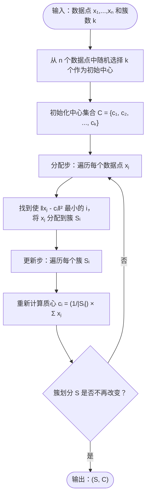

---

## 相关笔记
- 前置笔记：[[第32章_字符串匹配-章节汇总]]、[[第27章_在线算法-章节汇总]]
- 关联概念：[[算法导论/concepts/机器学习与算法]]、[[算法导论/concepts/数据科学]]、[[离散数学/concepts/蒙特卡洛方法]]、[[离散数学/concepts/概率]]、[[离散数学/concepts/贝叶斯定理]]
- 章节汇总：[[第33章_机器学习算法-章节汇总]]

---

> [!abstract] 概览
> 本节涵盖CLRS第33章第1节，系统介绍==聚类（clustering）==问题与==k-means算法==（k-means algorithm）。
>
> **聚类问题**是==无监督学习（unsupervised learning）==的核心任务之一：给定一组数据点，将它们划分为若干簇（cluster），使得同一簇内的点彼此"相似"，不同簇的点彼此"不相似"。聚类不需要预先标注的训练数据，因此属于无监督学习范畴。
>
> **k-means算法**（又称==Lloyd过程==，Lloyd's procedure）是解决聚类问题最经典、最广泛使用的启发式算法。其核心思想是交替执行两个步骤：==分配步（assignment step）==将每个点分配到最近的中心，==更新步（update step）==重新计算每个簇的中心（质心，centroid）。该算法由Stuart Lloyd于1957年在贝尔实验室提出，但直到1982年才公开发表。
>
> **核心要点**：
> - 每个数据点用一个==特征向量（feature vector）==表示，点之间的不相似度用==平方欧几里得距离（squared Euclidean distance）==度量
> - ==k-聚类（k-clustering）==将 $n$ 个点划分为 $k$ 个簇，每个簇有一个中心
> - ==最近中心规则（nearest-center rule）==要求每个点属于距其最近的中心所在的簇
> - k-means的目标函数 $f(S,C)$ 是所有点到其所属簇中心的平方距离之和
> - 精确求解k-means问题是==NP-hard==的，Lloyd过程只能保证收敛到局部最优
> - Lloyd过程的每次迭代使目标函数值单调递减，因此一定收敛

---

```mermaid flowchart TD
    A["聚类问题（Clustering）"] --> B["问题定义"]
    A --> C["k-means算法"]
    A --> D["理论分析"]

    B --> B1["特征向量 x ∈ R^d"]
    B --> B2["不相似度 Δ(x,y)"]
    B --> B3["k-聚类 (S, C)"]
    B --> B4["最近中心规则"]

    C --> C1["初始化：选择k个中心"]
    C --> C2["分配步：按最近中心分配"]
    C --> C3["更新步：重算质心"]
    C --> C4["收敛判定"]

    C1 --> C1a["随机选择"]
    C1 --> C1b["k-means++初始化"]

    C4 --> C5["目标函数 f(S,C) 单调递减"]
    C4 --> C6["收敛到局部最优"]

    D --> D1["NP-hard性"]
    D --> D2["质心最优性证明"]
    D --> D3["收敛性分析"]

    D2 --> D2a["固定S时C的最优选择"]
    D2 --> D2b["固定C时S的最优选择"]
```

---

## 核心思想

### 特征向量与不相似度

在聚类问题中，每个数据对象被表示为一个==特征向量（feature vector）==。假设我们有 $n$ 个数据点 $x_1, x_2, \ldots, x_n$，每个点 $x_i$ 是一个 $d$ 维实数向量，即 $x_i \in \mathbb{R}^d$。例如，在客户分群场景中，每个客户可以用一个包含年龄、收入、消费频率等属性的特征向量来描述。

为了衡量两个数据点之间的"不相似程度"，我们需要定义一个==不相似度度量（dissimilarity measure）==。k-means算法使用==平方欧几里得距离（squared Euclidean distance）==作为不相似度度量。对于两个特征向量 $x, y \in \mathbb{R}^d$，其平方欧几里得距离定义为：

$$\Delta(x, y) = \|x - y\|^2 = \sum_{j=1}^{d} (x_j - y_j)^2$$

其中 $x_j$ 和 $y_j$ 分别是 $x$ 和 $y$ 的第 $j$ 个分量。选择平方距离而非普通欧几里得距离，是因为平方距离在数学推导中更加简洁（不需要开方运算），且不会改变最近邻关系的判定结果——如果 $\|x - y\|^2 < \|x - z\|^2$，那么 $\|x - y\| < \|x - z\|$ 也成立。

> **生活化类比**：想象你站在一个城市广场上，广场上有许多行人。你想找到离你最近的人。你不需要精确计算每步的距离，只需要比较谁看起来更近。平方距离就像是比较"看起来多远"的简化版本——虽然数值不同，但谁近谁远的判断结果完全一致。

### k-聚类定义

给定 $n$ 个数据点和一个正整数 $k$，一个==k-聚类（k-clustering）==由以下两个部分组成：

1. **簇的划分** $S = \{S_1, S_2, \ldots, S_k\}$：将 $n$ 个数据点划分为 $k$ 个不相交的子集（簇），即 $S_1 \cup S_2 \cup \cdots \cup S_k = \{x_1, \ldots, x_n\}$，且对于 $i \neq j$，有 $S_i \cap S_j = \emptyset$。
2. **中心集合** $C = \{c_1, c_2, \ldots, c_k\}$：每个簇 $S_i$ 对应一个中心 $c_i \in \mathbb{R}^d$。

==最近中心规则（nearest-center rule）==要求：对于每个数据点 $x_j$，它所属的簇 $S_i$ 必须满足 $c_i$ 是所有中心中距离 $x_j$ 最近的那个。形式化地：

$$x_j \in S_i \iff \|x_j - c_i\|^2 \leq \|x_j - c_l\|^2, \quad \forall\ l = 1, 2, \ldots, k$$

当多个中心与 $x_j$ 的距离相等时，可以任意选择其中一个。这个规则确保了每个点都被分配到"最合适"的簇中。

### k-means目标函数

k-means算法的目标是找到一个k-聚类 $(S, C)$，使得所有数据点到其所属簇中心的平方距离之和最小化。这个目标函数定义为：

$$f(S, C) = \sum_{i=1}^{k} \sum_{x_j \in S_i} \|x_j - c_i\|^2$$

展开平方距离：

$$f(S, C) = \sum_{i=1}^{k} \sum_{x_j \in S_i} \sum_{l=1}^{d} (x_{j,l} - c_{i,l})^2$$

目标函数 $f(S, C)$ 度量了聚类的"紧密程度"——值越小，说明每个簇内的点越集中在中心周围，聚类效果越好。这个目标函数也被称为==簇内平方和（within-cluster sum of squares, WCSS）==。

**目标函数的等价形式**：利用一个重要的代数恒等式，WCSS也可以用簇内点对的距离来表示。对于每个簇 $S_i$，有：

$$|S_i| \sum_{x_j \in S_i} \|x_j - \mu_i\|^2 = \frac{1}{2} \sum_{x_j, x_l \in S_i} \|x_j - x_l\|^2$$

其中 $\mu_i$ 是簇 $S_i$ 的质心。这个恒等式的直觉是：簇内所有点到质心的距离之和，恰好等于簇内所有点对之间距离之和的一半。因此，最小化WCSS等价于最小化簇内点对的平均距离。

此外，由于总平方和（所有点到全局质心的距离之和）是常数，最小化簇内平方和（WCSS）等价于最大化==簇间平方和（between-cluster sum of squares, BCSS）==。这一关系与概率论中的==方差分解公式（law of total variance）==完全对应：总方差 = 簇内方差 + 簇间方差。

### k-means是NP-hard的

一个自然的问题是：能否高效地找到使 $f(S, C)$ 最小的k-聚类？遗憾的是，答案是否定的。即使对于 $k = 2$（即二聚类）的情况，在一般维度 $d$ 下，精确求解k-means问题也是==NP-hard==的。

这一结论的证明思路是将一个已知的NP-hard问题（如3-SAT或图划分问题）通过多项式时间归约（polynomial-time reduction）转化为k-means问题。具体而言，给定一个3-SAT实例，可以构造一组数据点，使得这些点的最优k-聚类对应于3-SAT实例的一个可满足赋值。由于3-SAT是NP完全的，k-means的最优解问题至少与3-SAT一样困难。

归约证明的关键在于：将3-SAT的每个变量和子句编码为空间中的数据点，通过精心设计点的位置，使得"变量取真/假"的选择对应于"将点分配到不同簇"，而"子句被满足"对应于"簇内距离较小"。这种构造需要确保归约是多项式时间的，且正确性可以严格验证。

> **关键结论**：【NP-hard性（即使在欧几里得平面上、k=2时，精确求解k-means也是NP-hard的，这意味着不存在多项式时间的精确算法，除非P=NP）】

这一结论的实际意义在于：我们不应期望找到一个总是返回全局最优解的高效算法。因此，实践中广泛使用的是Lloyd过程这样的启发式算法，它能在合理时间内找到一个"足够好"的解。

值得注意的是，虽然精确求解是NP-hard的，但存在多项式时间的==近似算法（approximation algorithm）==可以在一定近似比内逼近最优解。例如，k-means++初始化配合Lloyd过程可以保证 $O(\log k)$ 的近似比。此外，对于固定的小 $k$ 值（如 $k=2$），存在运行时间为 $O(n^{dk+1})$ 的精确算法，当 $d$ 和 $k$ 都很小时是实用的。

### Lloyd过程

==Lloyd过程（Lloyd's procedure）==（又称Lloyd算法）是求解k-means问题最经典的启发式方法。该算法交替执行两个步骤，直到聚类结果不再发生变化。

#### 伪代码

```
LLOYD(x₁, x₂, ..., xₙ, k)
1  从 n 个数据点中随机选择 k 个作为初始中心
2  C ← {c₁, c₂, ..., cₖ}          // 初始中心集合
3  repeat
4      for j ← 1 to n do           // 分配步
5          找到使 ‖xⱼ - cᵢ‖² 最小的 i
6          将 xⱼ 分配到簇 Sᵢ
7      end for
8      for i ← 1 to k do           // 更新步
9          cᵢ ← (1/|Sᵢ|) × Σ xⱼ   // 重算质心
10             (对所有 xⱼ ∈ Sᵢ 求和)
11     end for
12 until 簇划分 S 不再改变
13 return (S, C)
```

**执行流程图：**



**算法详解**：

- **第1-2行（初始化）**：从 $n$ 个数据点中随机选取 $k$ 个不同的点作为初始中心。初始化的选择对最终结果有重要影响，后续会详细讨论。
- **第4-6行（分配步，assignment step）**：遍历所有数据点，将每个点分配到距其最近的中心所在的簇。这一步实现了最近中心规则。对于每个点 $x_j$，需要计算它与所有 $k$ 个中心的距离，因此分配步的时间复杂度为 $O(nkd)$。
- **第8-10行（更新步，update step）**：对每个簇 $S_i$，重新计算其中心 $c_i$ 为该簇内所有点的==质心（centroid/mean）==。质心的计算公式为 $c_i = \frac{1}{|S_i|} \sum_{x_j \in S_i} x_j$。更新步需要遍历每个簇中的所有点，时间复杂度为 $O(nd)$。
- **第12行（收敛判定）**：当一次完整的分配步+更新步之后，簇划分 $S$ 没有发生任何变化时，算法终止。

> **生活化类比**：假设你是一个班主任，要把班上50个学生分成4个学习小组。你的做法是：先随便指定4个学生当"组长"（初始化）；然后让每个学生选择离自己座位最近的组长（分配步）；接着重新计算每个小组的中心位置，把"组长"的座位移到该组所有学生的平均位置（更新步）；重复这个过程，直到每个学生所属的小组不再变化。最终，座位相近的学生会被分到同一组。

### 质心最优性证明

Lloyd过程的更新步选择质心作为新的中心，这一选择有严格的数学依据。我们需要证明：**给定固定的簇划分 $S$，使目标函数 $f(S, C)$ 最小的中心集合 $C$ 恰好是各簇的质心**。

**定理（质心最优性）**：设簇划分 $S = \{S_1, \ldots, S_k\}$ 固定。对于每个簇 $S_i$，令 $\mu_i = \frac{1}{|S_i|} \sum_{x_j \in S_i} x_j$ 为 $S_i$ 的质心。则对于任意中心 $c_i \in \mathbb{R}^d$，有：

$$\sum_{x_j \in S_i} \|x_j - \mu_i\|^2 \leq \sum_{x_j \in S_i} \|x_j - c_i\|^2$$

等号成立当且仅当 $c_i = \mu_i$。

**证明**：

考虑单个簇 $S_i$（为简化记号，省略下标 $i$）。设簇中有 $m$ 个点 $x_1, \ldots, x_m$，质心为 $\mu = \frac{1}{m} \sum_{j=1}^{m} x_j$。对于任意中心 $c$，我们需要证明：

$$\sum_{j=1}^{m} \|x_j - \mu\|^2 \leq \sum_{j=1}^{m} \|x_j - c\|^2$$

展开右边的平方距离：

$$\sum_{j=1}^{m} \|x_j - c\|^2 = \sum_{j=1}^{m} \|x_j - \mu + \mu - c\|^2$$

利用恒等式 $\|a + b\|^2 = \|a\|^2 + 2\langle a, b\rangle + \|b\|^2$（其中 $\langle \cdot, \cdot \rangle$ 为内积）：

$$= \sum_{j=1}^{m} \left( \|x_j - \mu\|^2 + 2\langle x_j - \mu, \mu - c\rangle + \|\mu - c\|^2 \right)$$

$$= \sum_{j=1}^{m} \|x_j - \mu\|^2 + 2\langle \mu - c, \sum_{j=1}^{m}(x_j - \mu)\rangle + m\|\mu - c\|^2$$

由于 $\sum_{j=1}^{m}(x_j - \mu) = \sum_{j=1}^{m} x_j - m\mu = m\mu - m\mu = 0$，中间项消失：

$$= \sum_{j=1}^{m} \|x_j - \mu\|^2 + m\|\mu - c\|^2$$

因为 $m\|\mu - c\|^2 \geq 0$，且等号成立当且仅当 $c = \mu$，所以：

$$\sum_{j=1}^{m} \|x_j - c\|^2 = \sum_{j=1}^{m} \|x_j - \mu\|^2 + m\|\mu - c\|^2 \geq \sum_{j=1}^{m} \|x_j - \mu\|^2$$

> **证明关键步骤**：【利用内积展开 $\|a+b\|^2$，然后利用质心定义使交叉项 $\sum(x_j - \mu)$ 消为零，最终得到额外的非负项 $m\|\mu-c\|^2$】

这一证明的核心洞察是：质心恰好是使簇内平方和最小的点。任何偏离质心的中心选择都会增加一个与偏差大小成正比的非负项。

### 收敛性分析

Lloyd过程的一个重要性质是：**每次迭代都不会使目标函数值增大**。更准确地说，目标函数值是单调递减的。

**定理（单调递减性）**：设 $f^{(t)}$ 为Lloyd过程第 $t$ 次迭代后的目标函数值。则对于所有 $t \geq 0$：

$$f^{(t+1)} \leq f^{(t)}$$

**证明**：

Lloyd过程的每次迭代由两步组成：分配步和更新步。我们分别分析每一步对目标函数的影响。

**分配步的效果**：在分配步中，中心集合 $C^{(t)}$ 保持不变，但每个点被重新分配到最近的中心。对于任意数据点 $x_j$，设它在第 $t$ 次迭代属于簇 $S_p$，在第 $t+1$ 次迭代被重新分配到簇 $S_q$。根据最近中心规则：

$$\|x_j - c_q^{(t)}\|^2 \leq \|x_j - c_p^{(t)}\|^2$$

因此，分配步不会增加任何单个点的贡献，也就不会增加总目标函数值。

**更新步的效果**：在更新步中，簇划分 $S^{(t+1)}$ 保持不变，但每个簇的中心被更新为该簇的质心。根据质心最优性定理，对于固定的簇划分，质心是最优的中心选择。因此：

$$\sum_{x_j \in S_i^{(t+1)}} \|x_j - \mu_i\|^2 \leq \sum_{x_j \in S_i^{(t+1)}} \|x_j - c_i^{(t)}\|^2$$

更新步同样不会增加目标函数值。

综合两步的效果：$f^{(t+1)} \leq f^{(t)}$。 $\blacksquare$

> **证明关键步骤**：【分配步利用最近中心规则保证每个点的距离不增；更新步利用质心最优性定理保证固定划分下目标函数不增；两步联合保证了单调递减性】

**推论（收敛性）**：由于目标函数 $f(S, C)$ 的取值范围是有限的（最多有 $k^n$ 种可能的簇划分），且每次迭代 $f$ 值严格递减或保持不变，Lloyd过程一定在有限步内终止。

需要注意的是，"收敛"仅意味着算法终止（簇划分不再变化），并不保证收敛到全局最优解。算法可能收敛到一个==局部最优解（local optimum）==——即在该解的邻域内不存在更好的解，但全局范围内存在更优的聚类方案。

### 逐步执行实例

下面通过一个具体的例子来演示Lloyd过程的执行过程。

**例题**：给定6个二维数据点，使用k-means算法（$k=2$）进行聚类。

数据点：
| 点 | 坐标 |
|---|---|
| $x_1$ | (1, 1) |
| $x_2$ | (2, 1) |
| $x_3$ | (1, 2) |
| $x_4$ | (5, 5) |
| $x_5$ | (6, 5) |
| $x_6$ | (5, 6) |

**第0次迭代（初始化）**：随机选择 $x_1 = (1,1)$ 和 $x_4 = (5,5)$ 作为初始中心。
- $c_1^{(0)} = (1, 1)$，$c_2^{(0)} = (5, 5)$

**第1次迭代**：

*分配步*：计算每个点到两个中心的平方距离。

| 点 | 到 $c_1$ 的距离² | 到 $c_2$ 的距离² | 分配 |
|---|---|---|---|
| $x_1$(1,1) | 0 | 32 | $S_1$ |
| $x_2$(2,1) | 1 | 25 | $S_1$ |
| $x_3$(1,2) | 1 | 25 | $S_1$ |
| $x_4$(5,5) | 32 | 0 | $S_2$ |
| $x_5$(6,5) | 41 | 1 | $S_2$ |
| $x_6$(5,6) | 41 | 1 | $S_2$ |

$S_1 = \{x_1, x_2, x_3\}$，$S_2 = \{x_4, x_5, x_6\}$

$f^{(0)} = 0 + 1 + 1 + 0 + 1 + 1 = 4$

*更新步*：重新计算质心。
- $c_1^{(1)} = \frac{1}{3}((1,1) + (2,1) + (1,2)) = \frac{1}{3}(4, 4) = (4/3, 4/3)$
- $c_2^{(1)} = \frac{1}{3}((5,5) + (6,5) + (5,6)) = \frac{1}{3}(16, 16) = (16/3, 16/3)$

**第2次迭代**：

*分配步*：

| 点 | 到 $c_1^{(1)}$ 的距离² | 到 $c_2^{(1)}$ 的距离² | 分配 |
|---|---|---|---|
| $x_1$(1,1) | $(1-4/3)^2 + (1-4/3)^2 = 2/9$ | $(1-16/3)^2 + (1-16/3)^2 = 450/9$ | $S_1$ |
| $x_2$(2,1) | $(2-4/3)^2 + (1-4/3)^2 = 5/9$ | $(2-16/3)^2 + (1-16/3)^2 = 373/9$ | $S_1$ |
| $x_3$(1,2) | $(1-4/3)^2 + (2-4/3)^2 = 5/9$ | $(1-16/3)^2 + (2-16/3)^2 = 401/9$ | $S_1$ |
| $x_4$(5,5) | $(5-4/3)^2 + (5-4/3)^2 = 338/9$ | $(5-16/3)^2 + (5-16/3)^2 = 2/9$ | $S_2$ |
| $x_5$(6,5) | $(6-4/3)^2 + (5-4/3)^2 = 493/9$ | $(6-16/3)^2 + (5-16/3)^2 = 5/9$ | $S_2$ |
| $x_6$(5,6) | $(5-4/3)^2 + (6-4/3)^2 = 401/9$ | $(5-16/3)^2 + (6-16/3)^2 = 5/9$ | $S_2$ |

簇划分未变：$S_1 = \{x_1, x_2, x_3\}$，$S_2 = \{x_4, x_5, x_6\}$

$f^{(1)} = 2/9 + 5/9 + 5/9 + 2/9 + 5/9 + 5/9 = 24/9 = 8/3 \approx 2.667$

由于簇划分不再变化，算法终止。最终目标函数值 $f^* = 8/3$，小于初始的 $f^{(0)} = 4$，验证了单调递减性。

### 选择k值：肘部法则与轮廓分析

k-means算法要求预先指定簇数 $k$，但实际应用中我们往往不知道数据应该分成多少个簇。这是一个模型选择问题。以下是两种常用的确定 $k$ 值的方法。

#### 肘部法则（Elbow Method）

肘部法则的核心思想是：随着 $k$ 的增大，目标函数 $f(S, C)$ 会单调递减（因为更多的簇意味着每个簇更紧凑）。但当 $k$ 增大到一定程度后，$f$ 值的下降速度会明显放缓。这个"拐点"就是合适的 $k$ 值。

具体步骤：
1. 对 $k = 1, 2, \ldots, k_{\max}$ 分别运行k-means，记录每个 $k$ 对应的最终目标函数值 $f_k^*$
2. 绘制 $k$ 与 $f_k^*$ 的关系图
3. 寻找曲线上的"肘部"——即 $f_k^*$ 下降速率发生显著变化的拐点

> **生活化类比**：想象你在拧一条毛巾。一开始拧得越紧，毛巾里的水流出得越快（目标函数快速下降）；但拧到一定程度后，再怎么用力也只能挤出极少量的水（目标函数下降放缓）。那个"再怎么用力也没太大改善"的转折点，就是合适的 $k$ 值。

#### 轮廓系数法（Silhouette Analysis）

轮廓系数法通过计算每个数据点的轮廓分数来评估当前 $k$ 值下的聚类质量，然后选择使平均轮廓系数最大的 $k$。

对于数据点 $x_j$，设它属于簇 $S_i$，定义：
- $a(x_j) = \frac{1}{|S_i| - 1} \sum_{x_l \in S_i, l \neq j} \|x_j - x_l\|^2$（簇内平均距离）
- $b(x_j) = \min_{m \neq i} \frac{1}{|S_m|} \sum_{x_l \in S_m} \|x_j - x_l\|^2$（到最近异簇的平均距离）
- $s(x_j) = \frac{b(x_j) - a(x_j)}{\max(a(x_j), b(x_j))}$

$s(x_j)$ 的取值范围为 $[-1, 1]$：接近1表示 $x_j$ 被很好地分配到了正确的簇；接近0表示 $x_j$ 位于两个簇的边界；接近-1表示 $x_j$ 可能被分配到了错误的簇。

### k-means与Voronoi图的关系

k-means算法的分配步实际上是在计算一组中心点所生成的==Voronoi图（Voronoi diagram）==。给定 $k$ 个中心 $c_1, \ldots, c_k$，Voronoi图将 $\mathbb{R}^d$ 空间划分为 $k$ 个区域（称为Voronoi单元），每个区域 $V_i$ 包含所有满足 $\|x - c_i\| \leq \|x - c_j\|$（对所有 $j \neq i$）的点 $x$。

在k-means的每次分配步中，每个数据点被分配到它所在的Voronoi单元对应的簇。因此，k-means的一次迭代可以理解为：先根据当前中心计算Voronoi图，然后根据Voronoi图划分数据点，最后在每个Voronoi单元内重新计算质心。

这一几何视角揭示了k-means的一个隐含特性：簇之间的决策边界是线性的（具体地，是两个中心连线的垂直平分面）。这意味着k-means只能产生线性可分的簇边界，对于需要非线性决策边界的聚类问题无能为力。

### 空簇问题及其处理

在Lloyd过程的执行过程中，可能出现某个簇在分配步后没有分配到任何数据点的情况，即 $S_i = \emptyset$。这种情况称为==空簇（empty cluster）==问题。

空簇通常发生在以下情况：
- 初始中心选择不当，某个中心远离所有数据点
- 更新步后某个质心移动到了数据稀疏区域，导致下一轮分配步中没有任何点选择它

处理空簇的常见策略包括：
1. **重新选择中心**：从当前最大的簇中随机选择一个点，将其分裂为两个簇
2. **选择距离最远的点**：选择距离其所属簇中心最远的点，将其重新分配到空簇作为新中心
3. **保留空簇**：保持空簇的中心不变，等待后续迭代中可能有数据点被分配过来

### 数据预处理：缩放与归一化

在实际应用k-means之前，通常需要对数据进行==缩放（scaling）==或==归一化（normalization）==处理。这是因为k-means使用欧几里得距离，而不同特征的量纲和取值范围可能差异巨大。

例如，假设我们用两个特征来描述客户："年收入（元）"和"月均消费次数"。年收入的取值范围可能是数万到数十万，而月均消费次数可能只有0到50。如果不做缩放，年收入特征将在距离计算中占据绝对主导地位，月均消费次数的影响几乎被忽略。

常用的预处理方法包括：

1. **最小-最大归一化（Min-Max Normalization）**：将每个特征线性映射到 $[0, 1]$ 区间。
$$x'_j = \frac{x_j - \min_j}{\max_j - \min_j}$$

2. **Z-score标准化（Standardization）**：将每个特征变换为均值为0、标准差为1的分布。
$$x'_j = \frac{x_j - \mu_j}{\sigma_j}$$

其中 $\mu_j$ 和 $\sigma_j$ 分别是第 $j$ 个特征的均值和标准差。

> **生活化类比**：假设你要比较两个人的"综合实力"，一个指标是身高（单位：厘米，范围150-200），另一个指标是年薪（单位：万元，范围5-500）。如果不做处理，年薪的数值差异会完全淹没身高的影响。标准化就像是将所有指标都转换成"百分制"的评分，使得每个指标在比较中拥有公平的权重。

---

## 补充理解

> [!info] k-means算法的历史渊源
> k-means算法的思想最早可追溯到Hugo Steinhaus于1956年的工作。Stuart Lloyd于1957年在贝尔实验室提出了标准的迭代算法（Lloyd过程），但该工作直到1982年才作为论文"Least Squares Quantization in PCM"发表在IEEE Transactions on Information Theory上。Edward W. Forgy于1965年独立发表了几乎相同的方法，因此该算法有时也被称为Lloyd-Forgy算法。术语"k-means"则是由James MacQueen于1967年首次使用的。
>
> 参考来源：[Wikipedia - k-means clustering](https://en.wikipedia.org/wiki/K-means_clustering)、[Lloyd 1982原文](http://www.stat.yale.edu/~hz68/Lloyd.pdf)

> [!info] k-means++：更智能的初始化策略
> 由于k-means对初始中心的选择敏感，David Arthur和Sergei Vassilvitskii于2007年提出了k-means++初始化方法。其核心思想是：第一个中心从数据点中均匀随机选取；此后每个新中心以与当前最近距离的平方成正比的概率被选中。这种"谨慎播种"（careful seeding）策略保证了初始聚类的期望代价不超过最优解的 $O(\log k)$ 倍，大幅提升了聚类质量。
>
> **k-means++初始化的具体步骤**：
> 1. 从数据点中均匀随机选择第一个中心 $c_1$
> 2. 对于每个数据点 $x$，计算 $D(x)^2 = \min_{i=1,\ldots,t} \|x - c_i\|^2$（到已选中心的最近距离的平方）
> 3. 以概率 $\frac{D(x)^2}{\sum_{y} D(y)^2}$ 选择下一个中心
> 4. 重复步骤2-3直到选出 $k$ 个中心
> 5. 用选出的 $k$ 个中心作为Lloyd过程的初始中心
>
> 参考来源：[k-means++: The Advantages of Careful Seeding (Stanford)](https://theory.stanford.edu/~sergei/papers/kMeansPP-soda.pdf)

> [!info] k-means的NP-hard性证明
> k-means问题的NP-hard性经历了逐步严格化的过程。早期结果在一般维度下证明了NP-hard性。Mahajan、Nimbhorkar和Varadarajan于2012年证明了即使在欧几里得平面上（$d=2$），k-means问题也是NP-hard的，这一结果发表在Theoretical Computer Science上。该证明通过从平面3-SAT问题进行归约，构造了一组平面上的数据点，使得最优k-聚类对应于3-SAT实例的可满足赋值。
>
> 参考来源：[The planar k-means problem is NP-hard (NSTL)](https://sjz.nstl.gov.cn/paper_detail.html?id=7282251ac820d04dabaf9172081244a3)

> [!info] 聚类评估指标：轮廓系数与Davies-Bouldin指数
> 由于k-means是无监督学习，没有"标准答案"可以直接对比，因此需要使用内部评估指标来衡量聚类质量。==轮廓系数（Silhouette Coefficient）==由Peter Rousseeuw于1987年提出，对每个数据点计算其与同簇其他点的平均距离（凝聚度 $a$）和与最近异簇所有点的平均距离（分离度 $b$），轮廓系数 $s = (b-a)/\max(a,b)$，取值范围为 $[-1, 1]$，值越大表示聚类效果越好。==Davies-Bouldin指数（DB Index）==则基于簇间距离与簇内直径的比值来评估聚类质量，值越小表示聚类效果越好。
>
> 参考来源：[Silhouette (clustering) - Wikipedia](https://en.wikipedia.org/wiki/Silhouette_(clustering))、[Evaluation Metrics for Unsupervised Learning (Fiveable)](https://library.fiveable.me/modern-statistical-prediction-and-machine-learning/unit-14/evaluation-metrics-unsupervised-learning-clustering/study-guide/UuzjLvrGcbnj7uhw)

---

## 易混淆点

> [!warning] Lloyd过程找到的是局部最优，不保证全局最优
> Lloyd过程通过交替执行分配步和更新步来优化目标函数，每次迭代都使目标函数值单调递减。然而，这只能保证算法收敛到==局部最优解（local optimum）==，而非==全局最优解（global optimum）==。不同的初始中心选择可能导致算法收敛到不同的局部最优解，质量差异可能很大。
>
> **缓解策略**：
> - 多次随机初始化：运行Lloyd过程多次（如10-50次），每次使用不同的随机种子，取目标函数值最小的结果
> - 使用k-means++初始化：通过"谨慎播种"策略选择初始中心，大幅降低陷入较差局部最优的概率
> - 结合其他优化方法：如模拟退火（simulated annealing）或遗传算法（genetic algorithm）来跳出局部最优

> [!warning] k-means对初始中心的选择高度敏感
> 初始中心的选取直接影响Lloyd过程的收敛速度和最终聚类质量。如果初始中心选取不当（例如多个初始中心落在同一个密集区域），算法可能产生非常不理想的聚类结果。极端情况下，可能出现"空簇"（empty cluster）——某个簇在分配步后没有分配到任何数据点。解决方法包括：(1) 使用k-means++初始化；(2) 多次运行取最优；(3) 遇到空簇时重新选择中心。

> [!warning] k-means假设簇是凸形的（球形），对非凸形状数据效果差
> k-means使用平方欧几里得距离作为不相似度度量，这意味着它隐含假设每个簇在空间中呈现==凸形（convex shape）==，近似球形分布。对于==非凸形状==的数据分布（如环形、月牙形、细长条形等），k-means往往无法正确识别簇的边界。例如，两个同心圆环的数据点会被k-means错误地沿径向切割，而非按圆环分离。对于这类数据，应考虑使用DBSCAN、谱聚类（spectral clustering）等不依赖凸性假设的算法。

---

## 习题精选

| 题号 | 题目描述 | 核心考点 |
|------|---------|---------|
| 33.1-1 | 给定一组二维点和初始中心，手动执行Lloyd过程的若干次迭代 | Lloyd过程的分配步与更新步 |
| 33.1-2 | 证明质心最优性：固定簇划分时，质心使簇内平方和最小 | 质心最优性定理的证明 |
| 33.1-4 | 分析Lloyd过程的时间复杂度 | 每次迭代的计算量分析 |
| 33.1-5 | 构造一个Lloyd过程收敛到非全局最优解的例子 | 局部最优与全局最优的区别 |

> [!faq]- 习题 33.1-1：手动执行Lloyd过程
> **题目**：给定5个二维数据点 $A(0,0)$、$B(0,1)$、$C(1,0)$、$D(4,4)$、$E(5,5)$，设 $k=2$，初始中心为 $c_1 = A(0,0)$ 和 $c_2 = E(5,5)$。执行Lloyd过程直到收敛。
>
> **解题思路**：按照分配步→更新步的顺序迭代，每次计算所有点到各中心的平方距离，按最近中心规则分配，然后重算质心。注意验证目标函数值的单调递减性。
>
> **答案**：
>
> *第1次迭代 - 分配步*：
> - $A(0,0)$：到 $c_1$ 距离² = 0，到 $c_2$ 距离² = 50 → $S_1$
> - $B(0,1)$：到 $c_1$ 距离² = 1，到 $c_2$ 距离² = 41 → $S_1$
> - $C(1,0)$：到 $c_1$ 距离² = 1，到 $c_2$ 距离² = 41 → $S_1$
> - $D(4,4)$：到 $c_1$ 距离² = 32，到 $c_2$ 距离² = 2 → $S_2$
> - $E(5,5)$：到 $c_1$ 距离² = 50，到 $c_2$ 距离² = 0 → $S_2$
>
> $S_1 = \{A, B, C\}$，$S_2 = \{D, E\}$
>
> 目标函数值 $f^{(0)} = 0 + 1 + 1 + 2 + 0 = 4$
>
> *第1次迭代 - 更新步*：
> - $c_1 = \frac{1}{3}((0,0)+(0,1)+(1,0)) = (1/3, 1/3)$
> - $c_2 = \frac{1}{2}((4,4)+(5,5)) = (9/2, 9/2)$
>
> *第2次迭代 - 分配步*：重新计算距离后，簇划分不变。
>
> 目标函数值 $f^{(1)} = 2/9 + 2/9 + 4/9 + 1/4 + 1/4 = 8/9 + 1/2 = 25/18 \approx 1.389$
>
> 注意 $f^{(1)} = 25/18 < f^{(0)} = 4$，验证了单调递减性。
>
> 算法收敛。最终聚类：$S_1 = \{A, B, C\}$，$S_2 = \{D, E\}$。

> [!faq]- 习题 33.1-2：质心最优性证明
> **题目**：证明对于固定的簇划分 $S = \{S_1, \ldots, S_k\}$，使目标函数 $f(S, C) = \sum_{i=1}^{k}\sum_{x_j \in S_i}\|x_j - c_i\|^2$ 最小的中心集合 $C$ 中，每个 $c_i$ 必须是 $S_i$ 的质心。
>
> **解题思路**：对单个簇 $S_i$ 进行分析，利用内积展开 $\|x_j - c_i\|^2$，利用质心定义使交叉项为零。
>
> **答案**：
>
> 对单个簇 $S_i$（含 $m$ 个点），令 $\mu = \frac{1}{m}\sum_{j=1}^{m} x_j$。对任意 $c$：
>
> $\sum_{j=1}^{m}\|x_j - c\|^2 = \sum_{j=1}^{m}\|(x_j - \mu) + (\mu - c)\|^2$
>
> $= \sum_{j=1}^{m}\|x_j - \mu\|^2 + 2\langle\mu - c, \sum_{j}(x_j - \mu)\rangle + m\|\mu - c\|^2$
>
> $= \sum_{j=1}^{m}\|x_j - \mu\|^2 + m\|\mu - c\|^2 \geq \sum_{j=1}^{m}\|x_j - \mu\|^2$
>
> 等号成立当且仅当 $c = \mu$。因此质心是最优中心。

> [!faq]- 习题 33.1-4：Lloyd过程的时间复杂度分析
> **题目**：分析Lloyd过程单次迭代的时间复杂度，并讨论影响总运行时间的因素。
>
> **解题思路**：分别分析分配步和更新步的计算量，然后考虑迭代次数。
>
> **答案**：
>
> 设 $n$ 为数据点数，$k$ 为簇数，$d$ 为特征维度。
>
> - **分配步**：对每个点计算到 $k$ 个中心的距离，每次距离计算需要 $O(d)$ 时间。总时间：$O(nkd)$。
> - **更新步**：对每个簇遍历其所有点计算质心，总遍历量为 $n$ 个点，每个点 $d$ 维。总时间：$O(nd)$。
> - **单次迭代总时间**：$O(nkd)$（当 $k \leq n$ 时，分配步主导）。
>
> **总运行时间**取决于迭代次数。由于可能的簇划分数为 $k^n$（上界），最坏情况下迭代次数可以是指数级的。但在实践中，Lloyd过程通常在很少的迭代次数（几十到几百次）内收敛。使用k-d树等数据结构可以加速分配步中的最近邻搜索，将单次迭代降至接近 $O(n \log n)$（当 $d$ 较小时）。

> [!faq]- 习题 33.1-5：构造局部最优的例子
> **题目**：构造一组二维数据点和初始中心，使得Lloyd过程收敛到的解不是全局最优解。
>
> **解题思路**：设计一组数据点，使得"自然的"聚类与"算法陷入的"聚类不同。关键在于初始中心的选择使算法进入一个较差的局部最优。需要验证两种聚类方案的目标函数值差异。
>
> **答案**：
>
> 考虑4个二维数据点：$A(0,0)$、$B(1,0)$、$C(5,5)$、$D(6,5)$，设 $k=2$。
>
> **全局最优聚类**：$S_1 = \{A, B\}$，$S_2 = \{C, D\}$。
> - 质心 $c_1 = (0.5, 0)$，$c_2 = (5.5, 5)$
> - $f = \|A - c_1\|^2 + \|B - c_1\|^2 + \|C - c_2\|^2 + \|D - c_2\|^2$
> - $= 0.25 + 0.25 + 0.25 + 0.25 = 1$
>
> **较差的局部最优聚类**：$S_1 = \{A, C\}$，$S_2 = \{B, D\}$。
> - 质心 $c_1 = (2.5, 2.5)$，$c_2 = (3.5, 2.5)$
> - $f = \|A - c_1\|^2 + \|C - c_1\|^2 + \|B - c_2\|^2 + \|D - c_2\|^2$
> - $= 12.5 + 6.25 + 7.25 + 6.25 = 32.25$
>
> 如果初始中心选择为 $c_1 = (2.5, 2.5)$ 和 $c_2 = (3.5, 2.5)$（即较差聚类的质心），则：
> - 分配步：$A$ 到 $c_1$ 距离² = 12.5，到 $c_2$ 距离² = 18.5 → $S_1$
> - $B$ 到 $c_1$ 距离² = 7.25，到 $c_2$ 距离² = 7.25 → 平局，假设选 $S_2$
> - $C$ 到 $c_1$ 距离² = 6.25，到 $c_2$ 距离² = 6.25 → 平局，假设选 $S_1$
> - $D$ 到 $c_1$ 距离² = 12.25，到 $c_2$ 距离² = 6.25 → $S_2$
>
> 簇划分不变，算法立即收敛到这个较差的局部最优解。$f = 32.25 \gg 1$（全局最优），差距巨大。这充分说明了初始中心选择的重要性，以及Lloyd过程不保证全局最优的性质。

---

## 视频学习指南

| 视频 | 讲者/来源 | 时长 | 核心内容 | 推荐指数 |
|------|----------|------|---------|---------|
| K-means Clustering | Victor Lavrenko (YouTube) | ~16min | k-means算法原理、动画演示、肘部法则选k | ★★★★★ |
| StatQuest: K-means | Josh Starmer (YouTube) | ~19min | 直观讲解k-means，配合可视化动画 | ★★★★★ |
| MIT 6.0002 Lecture 14 | MIT OpenCourseWare | ~50min | 聚类概念、k-means实现与应用案例 | ★★★★☆ |
| Lloyd's Algorithm for k-means | NPTEL (YouTube) | ~30min | Lloyd过程的数学分析、收敛性证明 | ★★★★☆ |
| k-means++ 原理讲解 | 王木头 (B站) | ~15min | k-means++初始化策略的中文讲解 | ★★★☆☆ |
| 15.1 Clustering (MIT 6.006) | Erik Demaine (YouTube) | ~80min | 聚类问题形式化定义、k-means与k-center对比 | ★★★★☆ |

**观看建议**：建议先观看StatQuest或Victor Lavrenko的视频建立直观理解，然后观看MIT 6.0002的课程了解实现细节，最后观看NPTEL的视频深入理解数学证明。对于中文学习者，王木头的视频是很好的入门补充。

---

## 教材原文

> [!quote] CLRS第4版 第33章 第1节
> 聚类（clustering）是将一组数据点划分为若干组（称为簇，cluster）的问题，使得同一簇内的数据点彼此相似，而不同簇的数据点彼此不相似。k-means算法是解决聚类问题最常用的方法之一。给定 $n$ 个 $d$ 维数据点和一个正整数 $k$，k-means算法的目标是找到 $k$ 个中心 $c_1, c_2, \ldots, c_k$ 和一个将数据点分配到各簇的划分，使得所有数据点到其所属簇中心的平方距离之和最小。Lloyd过程通过交替执行分配步（将每个点分配到最近的中心）和更新步（将每个簇的中心重新计算为该簇内所有点的质心）来迭代优化这个目标函数。由于精确求解k-means问题是NP-hard的，Lloyd过程只能保证收敛到局部最优解。

---

## 参见Wiki

- [Wikipedia: k-means clustering](https://en.wikipedia.org/wiki/K-means_clustering)
- [Wikipedia: Lloyd's algorithm](https://en.wikipedia.org/wiki/Lloyd%27s_algorithm)
- [Wikipedia: Cluster analysis](https://en.wikipedia.org/wiki/Cluster_analysis)
- [Wikipedia: Silhouette (clustering)](https://en.wikipedia.org/wiki/Silhouette_(clustering))
- [Wikipedia: Voronoi diagram](https://en.wikipedia.org/wiki/Voronoi_diagram)
- [Wikipedia: k-means++](https://en.wikipedia.org/wiki/K-means%2B%2B)

---

#学习/算法导论/第33章-机器学习算法 #学习/算法导论/机器学习算法/聚类
