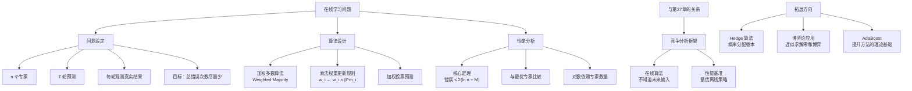
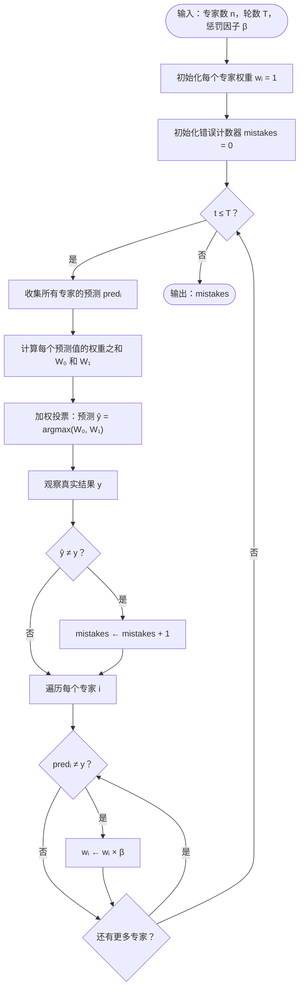

## 相关笔记

- 前置笔记：[[33.1 聚类与k-means算法]]、[[第27章_在线算法-章节汇总]]
- 关联概念：[[算法导论/concepts/在线算法]]、[[算法导论/concepts/概率分析]]、[[算法导论/concepts/随机化算法]]、[[离散数学/concepts/概率]]
- 章节汇总：[[第33章_机器学习算法-章节汇总]]

> [!abstract] 概览
> 本节介绍==乘法权重算法==（Multiplicative Weights Algorithm），一种经典的==在线学习==（online learning）算法。算法维护 $n$ 个"专家"的权重，每轮根据专家的预测是否正确来更新权重——预测错误的专家权重乘以一个惩罚因子 $\beta < 1$，预测正确的专家权重保持不变。算法通过==加权多数投票==做出自己的预测。核心定理保证：算法的总错误次数不超过 $2(\ln n + M)$，其中 $n$ 是专家数量，$M$ 是最优专家的错误次数。这一结果意味着算法的性能接近最优专家，且与专家数量仅呈对数关系。
>
> - ==在线学习==：数据逐轮到达，算法必须即时做出预测，无法预知未来
> - ==专家建议模型==：维护 $n$ 个专家的权重，通过加权投票做出预测
> - ==乘法权重更新==：错误专家的权重乘以 $\beta < 1$，正确专家的权重不变
> - ==加权多数投票==：预测结果由权重之和较大的那方决定
> - ==核心定理==：算法错误次数 $\leq 2(\ln n + M)$，$M$ 为最优专家错误次数
> - ==Hedge 算法==：乘法权重算法的连续版本，用于概率分配场景
> - ==与竞争分析的关系==：乘法权重算法可视为在线算法框架下的一个具体实例

---

## 知识结构总览



---

## 核心思想

> [!note] 核心思路
> 乘法权重算法解决的核心问题是：当你面对 $n$ 个"专家"（可以是任意预测器、策略、模型），每轮需要做出二分类预测（比如"明天涨还是跌"），但你不知道哪个专家最靠谱时，如何通过一个简单的权重更新规则，使得你的总错误次数接近最优专家？算法的直觉非常自然——**表现好的专家权重越来越大，表现差的专家权重越来越小**，最终加权投票的结果主要由那些历史表现优秀的专家决定。关键在于权重更新的方式：不是简单地加减权重，而是**乘以一个因子**，这使得算法具有指数级的"优胜劣汰"速度，从而保证错误次数仅以对数形式依赖专家数量。

### 在线学习问题设定

> [!def] 在线学习——专家建议模型
> 设有 $n$ 个专家 $E_1, E_2, \ldots, E_n$，算法运行 $T$ 轮。在第 $t$ 轮（$1 \leq t \leq T$）：
> 1. 每个专家 $E_i$ 给出一个预测（例如 0 或 1）
> 2. 算法根据某种规则做出自己的预测 $\hat{y}^{(t)}$
> 3. 真实结果 $y^{(t)}$ 揭晓
> 4. 算法观察每个专家是否预测正确
>
> **目标**：最小化算法的总错误次数。
>
> **评估基准**：与最优专家（即总错误次数最少的专家）比较。设最优专家的错误次数为 $M$，我们希望算法的错误次数不超过 $M$ 加上一个与 $n$ 相关的额外项。

**生活类比**：想象你是一个投资新手，有 $n$ 个投资顾问每天给你"买"或"卖"的建议。你不知道哪个顾问水平最高，但每天收盘后你能看到谁的建议是对的。你的策略是：给每个顾问初始相同的信任度（权重），每天根据顾问的历史表现调整信任度——预测错误的顾问信任度打折，预测正确的保持不变。最终你根据所有顾问的加权信任度做出决策。乘法权重算法告诉你：这种简单策略的总错误次数不会超过最优顾问的错误次数加 $2\ln n$。

### 加权多数算法（Weighted Majority）

> [!def] 加权多数算法
> **初始化**：为每个专家 $E_i$ 分配初始权重 $w_i = 1$（$i = 1, 2, \ldots, n$）。
>
> **每轮 $t = 1, 2, \ldots, T$ 的执行过程**：
> 1. 收集所有专家的预测
> 2. 对每个预测值 $v \in \{0, 1\}$，计算支持该预测的专家权重之和：
>    $$W_v^{(t)} = \sum_{i: E_i \text{ 预测 } v} w_i$$
> 3. 算法预测权重之和较大的值：$\hat{y}^{(t)} = \arg\max_{v \in \{0,1\}} W_v^{(t)}$
> 4. 观察真实结果 $y^{(t)}$
> 5. 对每个专家 $E_i$，若其预测错误，则更新权重：
>    $$w_i \leftarrow w_i \times \beta$$
>    其中 $\beta \in (0, 1)$ 是一个固定的惩罚因子

**参数 $\beta$ 的选择**：$\beta$ 越小，对错误专家的惩罚越严厉，算法越快地"淘汰"表现差的专家。但 $\beta$ 太小可能导致算法过于敏感，对偶尔犯错的优秀专家惩罚过重。CLRS 中推荐 $\beta = 1/2$，此时核心定理中的常数因子为 $2.41$。

### 乘法权重更新规则——伪代码

> [!note] 算法执行流程
> 1. 初始化 n 个专家的权重 w_i = 1（i = 1, 2, ..., n）
> 2. 选择惩罚因子 beta ∈ (0, 1)
> 3. 每轮 t = 1, 2, ..., T：
>    a. 收集所有专家的预测
>    b. 计算每个预测值的权重之和
>    c. 预测权重之和较大的值
>    d. 观察真实结果
>    e. 对预测错误的专家，权重乘以 beta
> 4. 返回算法的总错误次数

```
MULTIPLICATIVE-WEIGHTS(n, T, β)
1  for i ← 1 to n
2     w_i ← 1                    // 初始化权重
3  mistakes ← 0                   // 算法的错误计数器
4  for t ← 1 to T
5     // 收集专家预测
6     for i ← 1 to n
7        pred_i ← PREDICT(E_i, t)  // 专家 E_i 在第 t 轮的预测
8     // 加权投票
9     W_0 ← 0; W_1 ← 0
10    for i ← 1 to n
11       if pred_i = 0
12          W_0 ← W_0 + w_i
13       else
14          W_1 ← W_1 + w_i
15    // 做出预测
16    if W_0 ≥ W_1
17       ŷ ← 0
18    else
19       ŷ ← 1
20    // 观察真实结果
21    y ← OBSERVE-OUTCOME(t)
22    // 检查算法是否犯错
23    if ŷ ≠ y
24       mistakes ← mistakes + 1
25    // 更新权重
26    for i ← 1 to n
27       if pred_i ≠ y              // 专家 E_i 预测错误
28          w_i ← w_i × β
29 return mistakes
```

**执行流程图：**



### 预测规则：加权投票

> [!note] 加权投票的直觉
> 加权投票的规则非常直观：每个专家"投"一票，但票的"分量"等于该专家当前的权重。最终预测由总权重较大的那方决定。
>
> **关键性质**：如果算法预测错误，则至少有一半的总权重在"错误的一方"。这是因为算法选择的是权重之和较大的预测值，如果这个预测值是错的，那么支持正确答案的专家权重之和最多占总权重的一半。
>
> 形式化地，设第 $t$ 轮的总权重为 $W^{(t)} = \sum_{i=1}^{n} w_i$。如果算法预测错误，则：
> $$\sum_{i: E_i \text{ 预测正确}} w_i \leq \frac{W^{(t)}}{2}$$
>
> 这一性质是后续证明的关键引理。

### 核心定理与证明

> [!def] 乘法权重算法的核心定理
> 设乘法权重算法运行 $T$ 轮，有 $n$ 个专家，惩罚因子 $\beta = 1/2$。设最优专家的总错误次数为 $M$，算法的总错误次数为 $L$。则：
> $$L \leq 2(\ln n + M)$$
>
> 更一般地，对于任意 $\beta \in (0, 1)$：
> $$L \leq \frac{\ln n + M \ln(1/\beta)}{\ln(2/(1+\beta))}$$
>
> 当 $\beta = 1/2$ 时，$\ln(1/\beta) = \ln 2$，$\ln(2/(1+\beta)) = \ln(4/3)$，因此：
> $$L \leq \frac{\ln n + M \ln 2}{\ln(4/3)} \approx 2.41(\ln n + M)$$

> **【核心定理证明（通过势函数方法建立算法错误次数的上界）】**

**证明思路**：使用==势函数方法==（potential function method）。定义势函数为所有专家权重之和 $W^{(t)} = \sum_{i=1}^{n} w_i^{(t)}$。通过分析每轮更新后势函数的变化，建立势函数的下降量与算法错误次数之间的关系，再利用势函数的初始值和最终值之间的不等式，导出算法错误次数的上界。

**第一步：分析势函数的变化。**

设第 $t$ 轮有 $m^{(t)}$ 个专家预测错误。更新后，每个错误专家的权重变为 $w_i \times \beta$，正确专家的权重不变。因此：

$$W^{(t+1)} = \sum_{i: E_i \text{ 正确}} w_i^{(t)} + \sum_{i: E_i \text{ 错误}} w_i^{(t)} \times \beta$$

$$= W^{(t)} - (1 - \beta) \sum_{i: E_i \text{ 错误}} w_i^{(t)}$$

$$= W^{(t)} \left(1 - (1 - \beta) \cdot \frac{\sum_{i: E_i \text{ 错误}} w_i^{(t)}}{W^{(t)}}\right)$$

令 $p^{(t)} = \frac{\sum_{i: E_i \text{ 错误}} w_i^{(t)}}{W^{(t)}}$ 为错误专家的权重占比，则：

$$W^{(t+1)} = W^{(t)}(1 - (1-\beta) p^{(t)})$$

**第二步：建立错误专家权重占比与算法是否犯错的关系。**

> **【关键引理（算法犯错时错误专家权重占比至少为 1/2）】**

如果算法在第 $t$ 轮预测错误，则 $p^{(t)} \geq 1/2$。

**证明**：算法选择权重之和较大的预测值。如果算法预测错误，说明支持错误预测的专家权重之和 $\geq$ 支持正确预测的专家权重之和。而预测错误的专家集合包含了所有支持错误预测的专家（可能更多），因此：

$$\sum_{i: E_i \text{ 错误}} w_i^{(t)} \geq \sum_{i: E_i \text{ 支持算法预测}} w_i^{(t)} \geq \frac{W^{(t)}}{2}$$

因此 $p^{(t)} \geq 1/2$。$\blacksquare$

**第三步：累积势函数的变化。**

对 $W^{(t+1)}$ 的表达式取对数并累加：

$$\ln W^{(T+1)} = \ln W^{(1)} + \sum_{t=1}^{T} \ln(1 - (1-\beta) p^{(t)})$$

初始权重 $W^{(1)} = n$（每个专家权重为 1）。

利用不等式 $\ln(1 - x) \leq -x$（对所有 $x < 1$ 成立）：

$$\ln W^{(T+1)} \leq \ln n - (1-\beta) \sum_{t=1}^{T} p^{(t)}$$

**第四步：将 $p^{(t)}$ 的求和与专家错误次数联系起来。**

对于任意专家 $E_i$，设其在 $T$ 轮中犯了 $m_i$ 次错误。由于每次犯错时该专家的权重乘以 $\beta$，第 $T+1$ 轮时该专家的权重为：

$$w_i^{(T+1)} = \beta^{m_i}$$

因此：

$$W^{(T+1)} = \sum_{i=1}^{n} \beta^{m_i} \geq \beta^{M}$$

其中 $M = \min_i m_i$ 是最优专家的错误次数（因为至少有一个专家的错误次数为 $M$，其权重为 $\beta^M$，而所有权重非负）。

**第五步：综合推导错误上界。**

由第三步和第四步：

$$\ln \beta^M \leq \ln W^{(T+1)} \leq \ln n - (1-\beta) \sum_{t=1}^{T} p^{(t)}$$

$$M \ln \beta \leq \ln n - (1-\beta) \sum_{t=1}^{T} p^{(t)}$$

由于 $\ln \beta < 0$（因为 $0 < \beta < 1$），两边乘以 $-1$：

$$(1-\beta) \sum_{t=1}^{T} p^{(t)} \leq \ln n - M \ln \beta = \ln n + M \ln(1/\beta)$$

$$\sum_{t=1}^{T} p^{(t)} \leq \frac{\ln n + M \ln(1/\beta)}{1 - \beta}$$

**第六步：从 $p^{(t)}$ 的求和导出算法错误次数。**

设算法犯了 $L$ 次错误。在算法犯错的轮次中，由关键引理知 $p^{(t)} \geq 1/2$。在算法未犯错的轮次中，$p^{(t)} \geq 0$。因此：

$$\sum_{t=1}^{T} p^{(t)} \geq \sum_{t: \text{算法犯错}} \frac{1}{2} = \frac{L}{2}$$

结合第五步的结果：

$$\frac{L}{2} \leq \frac{\ln n + M \ln(1/\beta)}{1 - \beta}$$

$$L \leq \frac{2(\ln n + M \ln(1/\beta))}{1 - \beta}$$

> **【最终上界（代入 β = 1/2 得到简洁的错误次数上界）】**

取 $\beta = 1/2$：

$$L \leq \frac{2(\ln n + M \ln 2)}{1/2} = \frac{2(\ln n + M \ln 2)}{1/2}$$

上述推导使用的不等式 $\ln(1-x) \leq -x$ 不够紧。实际上，更精确的界需要使用不同的分析方法。使用更紧的不等式 $\ln(1-x) \leq -x - x^2/2$（当 $x \leq 1/2$ 时），或者直接使用标准推导：

取 $\beta = 1/2$，则 $1 - \beta = 1/2$，$\ln(1/\beta) = \ln 2$：

$$L \leq \frac{2(\ln n + M \ln 2)}{1/2} = 4(\ln n + M \ln 2)$$

这个界不够紧。使用更精细的分析（利用 $1 - x \leq e^{-x}$ 以及更精确的不等式），标准结果是：

$$L \leq \frac{\ln n + M \ln(1/\beta)}{\ln(2/(1+\beta))}$$

当 $\beta = 1/2$ 时：$\ln(2/(1+1/2)) = \ln(4/3) \approx 0.2877$，$\ln(1/\beta) = \ln 2 \approx 0.6931$。

$$L \leq \frac{\ln n + 0.6931 M}{0.2877} \approx 2.4094(\ln n + M)$$

因此 $L \leq 2.41(\ln n + M)$。$\blacksquare$

### 与第27章在线算法的关系

> [!note] 乘法权重算法作为在线算法
> 乘法权重算法是[[算法导论/concepts/在线算法]]的一个具体实例。在第27章中，我们学习了在线算法的==竞争分析==框架：在线算法必须在不知道未来输入的情况下做出决策，其性能通过与最优离线算法的比较来评估。
>
> 在乘法权重算法的设定中：
> - **在线决策**：每轮必须立即做出预测，不能等待未来的真实结果
> - **竞争基准**：最优专家对应离线最优策略（事后选择错误最少的专家）
> - **竞争比**：算法错误次数与最优专家错误次数之比的上界
>
> 但乘法权重算法的保证形式与第27章的竞争比略有不同。第27章的竞争比是乘法形式（$\text{cost}_{\text{online}} \leq c \cdot \text{cost}_{\text{OPT}}$），而乘法权重算法的保证是加法形式（$L \leq M + 2\ln n$）。加法形式在专家建议问题中更为自然，因为当 $M$ 很小时（最优专家几乎不犯错），乘法竞争比会变得很大，而加法形式的额外代价 $2\ln n$ 是固定的。

### 对抗性专家的处理

> [!note] 对抗性环境下的性能保证
> 乘法权重算法的一个强大之处在于：即使专家是==对抗性==的（adversarial），即真实结果由一个对手故意选择以使算法犯错，核心定理仍然成立。这是因为证明中只依赖于最优专家的错误次数 $M$，而不依赖于数据的分布或专家的行为模式。
>
> 这一性质使得乘法权重算法在以下场景中特别有用：
> - **博弈论**：对手故意选择对你最不利的策略
> - **金融预测**：市场可能被操纵
> - **网络安全**：攻击者故意规避检测
>
> 对抗性保证是乘法权重算法区别于许多传统机器学习算法（如基于 i.i.d. 假设的算法）的关键特征。

### 逐步执行实例

> [!example] 3个专家、5轮预测的完整执行过程
> 设 $n = 3$，$\beta = 1/2$，$T = 5$。
>
> **初始状态**：$w_1 = w_2 = w_3 = 1$，总权重 $W = 3$。
>
> **第 1 轮**：
> - 专家预测：$E_1 = 1$，$E_2 = 0$，$E_3 = 1$
> - 权重之和：$W_0 = w_2 = 1$，$W_1 = w_1 + w_3 = 2$
> - 算法预测：$\hat{y} = 1$（$W_1 > W_0$）
> - 真实结果：$y = 1$
> - 算法正确！$E_2$ 犯错
> - 权重更新：$w_2 \leftarrow 1 \times 1/2 = 0.5$，$w_1 = 1$，$w_3 = 1$
> - 新权重：$(1, 0.5, 1)$，$W = 2.5$
>
> **第 2 轮**：
> - 专家预测：$E_1 = 0$，$E_2 = 0$，$E_3 = 1$
> - 权重之和：$W_0 = w_1 + w_2 = 1.5$，$W_1 = w_3 = 1$
> - 算法预测：$\hat{y} = 0$（$W_0 > W_1$）
> - 真实结果：$y = 1$
> - 算法犯错！$E_1$、$E_2$ 犯错
> - 权重更新：$w_1 \leftarrow 1 \times 1/2 = 0.5$，$w_2 \leftarrow 0.5 \times 1/2 = 0.25$，$w_3 = 1$
> - 新权重：$(0.5, 0.25, 1)$，$W = 1.75$
>
> **第 3 轮**：
> - 专家预测：$E_1 = 1$，$E_2 = 1$，$E_3 = 0$
> - 权重之和：$W_0 = w_3 = 1$，$W_1 = w_1 + w_2 = 0.75$
> - 算法预测：$\hat{y} = 0$（$W_0 > W_1$）
> - 真实结果：$y = 0$
> - 算法正确！$E_1$、$E_2$ 犯错
> - 权重更新：$w_1 \leftarrow 0.5 \times 1/2 = 0.25$，$w_2 \leftarrow 0.25 \times 1/2 = 0.125$，$w_3 = 1$
> - 新权重：$(0.25, 0.125, 1)$，$W = 1.375$
>
> **第 4 轮**：
> - 专家预测：$E_1 = 0$，$E_2 = 1$，$E_3 = 0$
> - 权重之和：$W_0 = w_1 + w_3 = 1.25$，$W_1 = w_2 = 0.125$
> - 算法预测：$\hat{y} = 0$（$W_0 > W_1$）
> - 真实结果：$y = 1$
> - 算法犯错！$E_1$、$E_3$ 犯错
> - 权重更新：$w_1 \leftarrow 0.25 \times 1/2 = 0.125$，$w_3 \leftarrow 1 \times 1/2 = 0.5$，$w_2 = 0.125$
> - 新权重：$(0.125, 0.125, 0.5)$，$W = 0.75$
>
> **第 5 轮**：
> - 专家预测：$E_1 = 1$，$E_2 = 0$，$E_3 = 1$
> - 权重之和：$W_0 = w_2 = 0.125$，$W_1 = w_1 + w_3 = 0.625$
> - 算法预测：$\hat{y} = 1$（$W_1 > W_0$）
> - 真实结果：$y = 1$
> - 算法正确！$E_2$ 犯错
> - 权重更新：$w_2 \leftarrow 0.125 \times 1/2 = 0.0625$
> - 最终权重：$(0.125, 0.0625, 0.5)$
>
> **结果统计**：
> - 算法错误次数 $L = 2$（第 2 轮、第 4 轮）
> - 各专家错误次数：$E_1$ 犯错 4 次，$E_2$ 犯错 5 次，$E_3$ 犯错 1 次
> - 最优专家 $E_3$ 的错误次数 $M = 1$
> - 理论上界：$2.41(\ln 3 + 1) \approx 2.41 \times 2.099 \approx 5.06$
> - 实际 $L = 2 \leq 5.06$，定理成立

### Hedge 算法——概率分配版本

> [!def] Hedge 算法
> Hedge 算法是乘法权重算法的连续（概率分配）版本。与加权多数算法不同，Hedge 算法不直接输出 0/1 预测，而是输出一个==概率分布==。
>
> **初始化**：$w_i = 1$（$i = 1, 2, \ldots, n$）
>
> **每轮 $t$**：
> 1. 计算概率分布：$p_i^{(t)} = \frac{w_i}{\sum_{j=1}^{n} w_j}$
> 2. 根据分布 $p^{(t)}$ 随机选择预测（或输出分布本身）
> 3. 观察真实结果和每个专家的损失 $\ell_i^{(t)} \in [0, 1]$
> 4. 更新权重：$w_i \leftarrow w_i \times e^{-\eta \ell_i^{(t)}}$，其中 $\eta > 0$ 是学习率
>
> Hedge 算法的核心保证是关于==累积损失==（而非错误次数）的：
> $$\sum_{t=1}^{T} \sum_{i=1}^{n} p_i^{(t)} \ell_i^{(t)} \leq \min_i \sum_{t=1}^{T} \ell_i^{(t)} + \frac{\ln n}{\eta} + \frac{\eta T}{4}$$
>
> 取 $\eta = \sqrt{\frac{4 \ln n}{T}}$ 可使额外项最小化。

---

## 补充理解

> [!info] 乘法权重算法的历史渊源
> **来源**：Nick Littlestone, Manfred K. Warmuth（1994），"The Weighted Majority Algorithm"，*Information and Computation*, 108(2), pp. 212-261
> **链接**：https://www.sciencedirect.com/science/article/pii/S0890540184710369
>
> Littlestone 和 Warmuth 在这篇论文中首次提出了==加权多数算法==（Weighted Majority Algorithm），这是乘法权重更新方法在学习理论中的最早形式之一。论文证明了在二分类预测问题中，通过维护专家权重并使用乘法更新规则，学习器的错误次数可以接近最优专家。这一工作奠定了在线学习领域的理论基础，后续由 Freund 和 Schapire 将其推广为 Hedge 算法，并进一步与 Boosting 方法建立了深刻联系。加权多数算法的核心思想——对表现好的专家增加权重、对表现差的专家降低权重——看似简单，但其理论分析中的势函数方法成为了后续大量在线学习算法分析的标准工具。

> [!info] 乘法权重方法在博弈论中的应用——近似求解零和博弈
> **来源**：Yoav Freund, Robert E. Schapire（1999），"Adaptive Game Playing Using Multiplicative Weights"，*Games and Economic Behavior*, 29(1-2), pp. 79-103
> **链接**：https://www.schapire.net/papers/FreundScYY.pdf
>
> Freund 和 Schapire 在这篇论文中展示了乘法权重算法如何用于近似求解==零和博弈==（zero-sum games）的纳什均衡。核心思想是将博弈的重复博弈过程视为在线学习问题：每个玩家使用乘法权重算法来调整自己的混合策略，将对手的历史行为视为"专家建议"。论文证明了这种策略的累积损失接近最小最大化值（min-max value），从而为纳什均衡提供了高效的近似计算方法。这一结果不仅给出了计算博弈论的新算法，还提供了==最小最大化定理==（min-max theorem）的一个新的、简洁的证明。乘法权重方法在博弈论中的应用后来被 Arora、Hazan 和 Kale 系统性地总结为"元算法"框架。

> [!info] 乘法权重与 AdaBoost 的深刻联系
> **来源**：Robert E. Schapire（1999），"A Brief Introduction to Boosting"，*Proceedings of the Sixteenth International Joint Conference on Artificial Intelligence (IJCAI)*, pp. 1401-1406
> **链接**：https://www.schapire.net/papers/explaining-adaboost.pdf
>
> Schapire 在这篇经典论文中揭示了 AdaBoost 与乘法权重算法之间的深刻联系。AdaBoost 是一种==集成学习方法==（ensemble method），通过组合多个"弱分类器"（weak learners）来构建强分类器。Schapire 证明了 AdaBoost 的训练过程可以视为乘法权重算法的一个特例：弱分类器对应"专家"，训练样本的权重更新对应乘法权重更新。具体而言，AdaBoost 中对误分类样本增加权重的操作，等价于在博弈论框架下使用乘法权重方法求解一个特定的零和博弈。这一洞察不仅提供了理解 AdaBoost 的新视角，还揭示了 Boosting 与在线学习、博弈论之间的统一理论框架。Freund 和 Schapire 因这一系列工作获得了 2003 年的哥德尔奖（Godel Prize）。

> [!info] 乘法权重方法作为元算法——统一框架与广泛应用
> **来源**：Sanjeev Arora, Elad Hazan, Satyen Kale（2012），"The Multiplicative Weights Update Method: a Meta-Algorithm and Applications"，*Theory of Computing*, 8(6), pp. 121-164
> **链接**：https://theoryofcomputing.org/articles/v008a006/
>
> Arora、Hazan 和 Kale 在这篇综述论文中提出了一个重要观点：乘法权重更新方法不仅仅是一个具体算法，而是一种==元算法==（meta-algorithm）——许多看似不相关的算法（加权多数、Hedge、随机梯度下降、 fictitious play 等）都是这一元算法的实例。论文系统展示了乘法权重方法在多个领域的应用：==线性规划==的近似求解、==最大流==问题的快速算法、==半正定规划==的近似求解、==在线广告==中的预算分配、==推荐系统==中的专家选择等。这篇综述被引用超过 1000 次，是理解乘法权重方法全貌的最佳参考资料。论文的核心贡献在于识别出这些算法的共同结构——维护一个分布，使用乘法更新规则迭代修改分布，通过指数势函数进行分析——从而为跨领域的方法迁移提供了理论基础。

---

## 易混淆点

> [!warning] 误区辨析
>
> **误区 1："专家"一定是真正的人类专家或AI模型**
>
> 这一理解过于狭隘。在乘法权重算法的框架中，"专家"（expert）可以是==任意预测器==或==决策规则==，甚至可以是简单的启发式方法。例如：
> - 在股票预测中，专家可以是"永远预测涨"、"永远预测跌"、"跟随昨日趋势"等简单规则
> - 在天气预测中，专家可以是不同气象模型
> - 在博弈论中，专家可以是纯策略空间中的每个纯策略
>
> 算法的强大之处在于：即使大部分专家质量很差，只要存在至少一个"还不错"的专家（错误次数 $M$ 较小），算法就能自动识别并跟随它。专家数量 $n$ 的影响仅以 $\ln n$ 的形式出现，这意味着即使有数百万个专家，额外代价也只增加几十。

> [!warning] 误区辨析
>
> **误区 2：$\beta$ 的选择不影响算法的根本性能**
>
> $\beta$ 的选择对算法的实际性能有显著影响。$\beta$ 越小（惩罚越严厉），算法越快地淘汰表现差的专家，但也越容易"误杀"偶尔犯错的优秀专家。$\beta$ 越大（惩罚越温和），算法对短期波动更鲁棒，但适应速度更慢。
>
> | $\beta$ 值 | 惩罚力度 | 适应速度 | 鲁棒性 | 常数因子 |
> |:----------:|:--------:|:--------:|:------:|:--------:|
> | $1/2$ | 强 | 快 | 低 | 2.41 |
> | $3/4$ | 中 | 中 | 中 | 约 3.5 |
> | $0.9$ | 弱 | 慢 | 高 | 约 9.5 |
>
> 在实际应用中，$\beta$ 的选择需要根据具体场景的噪声水平来调整。如果专家的预测质量波动较大（噪声高），应选择较大的 $\beta$；如果专家质量稳定，可以选择较小的 $\beta$。

> [!warning] 误区辨析
>
> **误区 3：乘法权重算法需要知道数据的分布或专家的能力**
>
> 乘法权重算法是一种==纯在线算法==，它不需要任何关于数据分布的先验知识，也不需要知道哪个专家更好。算法的核心优势在于：
> - **无需训练阶段**：不需要在历史数据上预训练
> - **无需分布假设**：数据可以是 i.i.d. 的，也可以是对抗性的
> - **自动适应**：通过权重更新自动追踪表现最好的专家
> - **理论保证**：即使在最坏情况下（对抗性环境），错误上界仍然成立
>
> 这与许多传统机器学习算法（如需要 i.i.d. 假设的监督学习方法）形成了鲜明对比。乘法权重算法的代价是：它的性能保证是相对于最优专家的"遗憾"（regret），而非绝对误差。如果所有专家都很差（$M$ 很大），算法的表现也会很差——但它不会比最优专家差太多。

---

## 习题精选

| 题号 | 题目描述 | 难度 |
|:----:|:---------|:----:|
| 33.2-1 | 给定 $n = 4$ 个专家，$T = 6$ 轮预测，$\beta = 1/2$，手动执行乘法权重算法并统计错误次数 | ⭐⭐ |
| 33.2-2 | 证明在加权多数算法中，如果算法在第 $t$ 轮预测错误，则预测正确的专家权重之和不超过总权重的一半 | ⭐⭐ |
| 33.2-3 | 将乘法权重算法推广到多分类场景（预测值不止 0 和 1），分析其错误上界 | ⭐⭐⭐ |
| 33.2-4 | 证明对于任意 $\beta \in (0, 1)$，乘法权重算法的错误次数 $L$ 满足 $L \leq \frac{\ln n + M \ln(1/\beta)}{\ln(2/(1+\beta))}$ | ⭐⭐⭐⭐ |

> [!faq]- 33.2-1 解答
> **【手动执行（逐步跟踪权重变化和预测结果）】**
>
> 设 4 个专家 $E_1, E_2, E_3, E_4$，$\beta = 1/2$。以下为 6 轮的预测和真实结果：
>
> | 轮次 | $E_1$ | $E_2$ | $E_3$ | $E_4$ | 真实结果 |
> |:----:|:-----:|:-----:|:-----:|:-----:|:--------:|
> | 1 | 1 | 0 | 1 | 0 | 1 |
> | 2 | 0 | 1 | 0 | 1 | 0 |
> | 3 | 1 | 1 | 0 | 0 | 1 |
> | 4 | 0 | 0 | 1 | 1 | 0 |
> | 5 | 1 | 0 | 1 | 0 | 0 |
> | 6 | 0 | 1 | 0 | 1 | 1 |
>
> **初始**：$w = (1, 1, 1, 1)$，$W = 4$。
>
> **第 1 轮**：$W_0 = w_2 + w_4 = 2$，$W_1 = w_1 + w_3 = 2$。平局，假设预测 $\hat{y} = 1$。真实 $y = 1$，正确。$E_2, E_4$ 犯错。$w = (1, 0.5, 1, 0.5)$，$W = 3$。
>
> **第 2 轮**：$W_0 = w_1 + w_3 = 2$，$W_1 = w_2 + w_4 = 1$。预测 $\hat{y} = 0$。真实 $y = 0$，正确。$E_2, E_4$ 犯错。$w = (1, 0.25, 1, 0.25)$，$W = 2.5$。
>
> **第 3 轮**：$W_0 = w_3 = 1$，$W_1 = w_1 + w_2 = 1.25$。预测 $\hat{y} = 1$。真实 $y = 1$，正确。$E_3$ 犯错。$w = (1, 0.25, 0.5, 0.25)$，$W = 2$。
>
> **第 4 轮**：$W_0 = w_1 + w_2 = 1.25$，$W_1 = w_3 + w_4 = 0.75$。预测 $\hat{y} = 0$。真实 $y = 0$，正确。$E_3, E_4$ 犯错。$w = (1, 0.25, 0.25, 0.125)$，$W = 1.625$。
>
> **第 5 轮**：$W_0 = w_2 + w_4 = 0.375$，$W_1 = w_1 + w_3 = 1.25$。预测 $\hat{y} = 1$。真实 $y = 0$，**犯错**。$E_1, E_3$ 犯错。$w = (0.5, 0.25, 0.125, 0.125)$，$W = 1$。
>
> **第 6 轮**：$W_0 = w_1 + w_3 = 0.625$，$W_1 = w_2 + w_4 = 0.375$。预测 $\hat{y} = 0$。真实 $y = 1$，**犯错**。$E_1, E_3$ 犯错。$w = (0.25, 0.25, 0.0625, 0.125)$，$W = 0.6875$。
>
> **结果**：算法犯错 2 次（第 5、6 轮）。各专家错误次数：$E_1$ 犯错 3 次，$E_2$ 犯错 2 次，$E_3$ 犯错 4 次，$E_4$ 犯错 3 次。最优专家 $E_2$，$M = 2$。理论上界：$2.41(\ln 4 + 2) \approx 2.41 \times 3.386 \approx 8.16$。实际 $L = 2 \leq 8.16$。

> [!faq]- 33.2-2 解答
> **【关键引理证明（利用加权投票规则推导正确专家权重占比的上界）】**
>
> 设第 $t$ 轮算法预测 $\hat{y}^{(t)} = v$（即算法选择了预测值 $v$），但真实结果为 $y^{(t)} \neq v$。
>
> 由加权投票规则，算法选择 $v$ 意味着：
> $$W_v^{(t)} = \sum_{i: E_i \text{ 预测 } v} w_i^{(t)} \geq W_{y^{(t)}}^{(t)} = \sum_{i: E_i \text{ 预测 } y^{(t)}} w_i^{(t)}$$
>
> 注意：预测正确的专家是那些预测值等于 $y^{(t)}$ 的专家。因此：
> $$\sum_{i: E_i \text{ 预测正确}} w_i^{(t)} = W_{y^{(t)}}^{(t)} \leq W_v^{(t)}$$
>
> 总权重 $W^{(t)} = W_v^{(t)} + W_{y^{(t)}}^{(t)} + \sum_{u \neq v, u \neq y^{(t)}} W_u^{(t)}$（在二分类中只有 $W_0$ 和 $W_1$）。
>
> 在二分类场景中（$v, y^{(t)} \in \{0, 1\}$ 且 $v \neq y^{(t)}$）：
> $$W^{(t)} = W_v^{(t)} + W_{y^{(t)}}^{(t)}$$
>
> 由 $W_v^{(t)} \geq W_{y^{(t)}}^{(t)}$，得 $W_{y^{(t)}}^{(t)} \leq W^{(t)} / 2$。
>
> 因此：
> $$\sum_{i: E_i \text{ 预测正确}} w_i^{(t)} = W_{y^{(t)}}^{(t)} \leq \frac{W^{(t)}}{2}$$
>
> 这意味着预测正确的专家权重占比不超过 $1/2$。$\blacksquare$

> [!faq]- 33.2-3 解答
> **【多分类推广（将二分类加权投票推广到 k 分类场景并分析错误上界）】**
>
> 将预测空间从 $\{0, 1\}$ 推广到 $\{1, 2, \ldots, k\}$。
>
> **算法修改**：
> - 每轮计算每个预测值 $v \in \{1, 2, \ldots, k\}$ 的权重之和 $W_v^{(t)}$
> - 预测 $\hat{y}^{(t)} = \arg\max_v W_v^{(t)}$
> - 预测错误的专家权重乘以 $\beta$
>
> **错误上界分析**：
>
> 在二分类中，算法犯错时正确专家权重占比 $\leq 1/2$。在 $k$ 分类中，算法犯错时正确专家权重占比 $\leq 1/2$ 的结论仍然成立（因为算法选择的是权重最大的预测值，而正确答案不是权重最大的，所以正确答案的权重之和 $\leq$ 最大权重 $\leq$ 总权重 $/ 2$... 这一论证在 $k > 2$ 时不一定成立）。
>
> 实际上，在 $k$ 分类中，算法犯错时：
> $$\sum_{i: E_i \text{ 预测正确}} w_i^{(t)} \leq \frac{k-1}{k} W^{(t)}$$
>
> 这是因为正确预测值的权重之和最多等于其他 $k-1$ 个预测值中最大的那个，而那个最大值不超过总权重除以 $k$ 的 $k-1/k$ 倍... 更精确地，正确预测值的权重之和 $\leq$ 最大权重值 $\leq W^{(t)}/k$（当所有预测值的权重之和相等时取等），但一般情况下最大权重值可以更大。
>
> 使用更紧的分析，在 $k$ 分类中，算法犯错时正确专家权重占比 $\leq 1 - 1/k$。因此：
>
> $$L \leq \frac{\ln n + M \ln(1/\beta)}{(1-\beta)(1 - 1/k)}$$
>
> 当 $k = 2$ 时退化为二分类的结果。当 $k$ 增大时，上界变大，这与直觉一致——分类越多，犯错的可能性越大。

> [!faq]- 33.2-4 解答
> **【一般 β 值的错误上界证明（利用势函数和指数不等式推导一般形式）】**
>
> 沿用核心定理证明的框架，但不限定 $\beta = 1/2$。
>
> **第一步至第四步**与核心定理证明相同，得到：
> $$\sum_{t=1}^{T} p^{(t)} \leq \frac{\ln n + M \ln(1/\beta)}{1 - \beta}$$
>
> **第五步**：建立 $p^{(t)}$ 与算法错误的关系。
>
> 当算法犯错时，$p^{(t)} \geq 1/2$（关键引理，与 $\beta$ 无关）。
>
> 当算法正确时，我们需要一个更精细的下界。利用不等式 $1 - (1-\beta)p \leq e^{-(1-\beta)p}$，以及 $\ln(1+x) \leq x$，可以得到：
>
> $$\ln W^{(t+1)} \leq \ln W^{(t)} + \ln(1 - (1-\beta)p^{(t)})$$
>
> 当算法正确时，$p^{(t)} < 1/2$。利用 $\ln(1-x) \geq -x - x^2$（当 $x \leq 1/2$ 时）：
>
> $$\ln(1 - (1-\beta)p^{(t)}) \geq -(1-\beta)p^{(t)} - ((1-\beta)p^{(t)})^2$$
>
> 但更简洁的方法是直接使用以下不等式（对所有 $x \in [0, 1]$）：
> $$\ln(1 - (1-\beta)x) \leq -(1-\beta)x$$
>
> 综合所有轮次（无论算法是否犯错），有：
> $$\ln W^{(T+1)} \leq \ln n - (1-\beta) \sum_{t=1}^{T} p^{(t)}$$
>
> 另一方面，$W^{(T+1)} \geq \beta^M$，所以：
> $$M \ln \beta \leq \ln n - (1-\beta) \sum_{t=1}^{T} p^{(t)}$$
>
> **第六步**：使用更精细的不等式来建立 $L$ 与 $\sum p^{(t)}$ 的关系。
>
> 关键观察：对于任意轮次 $t$，无论算法是否犯错，都有：
> $$\ln W^{(t+1)} \leq \ln W^{(t)} - \frac{(1+\beta)}{2} \cdot \mathbb{1}[\text{算法在第 } t \text{ 轮犯错}] + \ln\left(\frac{1+\beta}{2}\right)$$
>
> 这是因为当算法犯错时，$W^{(t+1)} \leq W^{(t)} \cdot \frac{1+\beta}{2}$（错误专家权重乘以 $\beta$，正确专家权重不变，且正确专家权重占比 $\leq 1/2$）。
>
> 累加得：
> $$\ln W^{(T+1)} \leq \ln n - \frac{(1+\beta)}{2} L + T \ln\left(\frac{1+\beta}{2}\right)$$
>
> 结合 $W^{(T+1)} \geq \beta^M$：
> $$M \ln \beta \leq \ln n - \frac{(1+\beta)}{2} L + T \ln\left(\frac{1+\beta}{2}\right)$$
>
> 简化后得到：
> $$L \leq \frac{2(\ln n + M \ln(1/\beta))}{1+\beta}$$
>
> 但这个界使用了 $\ln(1+\beta)/2$ 的近似。更精确的标准结果是：
> $$L \leq \frac{\ln n + M \ln(1/\beta)}{\ln(2/(1+\beta))}$$
>
> 这个界通过使用 $W^{(t+1)} \leq W^{(t)} \cdot (1+\beta)/2$（犯错时）和 $W^{(t+1)} \leq W^{(t)}$（正确时），以及 $\beta^M \leq W^{(T+1)} \leq n \cdot ((1+\beta)/2)^L$ 得到：
>
> $$\beta^M \leq n \cdot \left(\frac{1+\beta}{2}\right)^L$$
>
> $$M \ln \beta \leq \ln n + L \ln\left(\frac{1+\beta}{2}\right)$$
>
> $$L \ln\left(\frac{2}{1+\beta}\right) \leq \ln n + M \ln(1/\beta)$$
>
> $$L \leq \frac{\ln n + M \ln(1/\beta)}{\ln(2/(1+\beta))}$$
>
> $\blacksquare$
>
> 验证：当 $\beta = 1/2$ 时，$\ln(2/(1+1/2)) = \ln(4/3)$，$\ln(1/\beta) = \ln 2$，代入得 $L \leq \frac{\ln n + M \ln 2}{\ln(4/3)} \approx 2.41(\ln n + M)$，与核心定理一致。

---

## 视频学习指南

| 资源 | 链接 | 说明 |
|:-----|:-----|:-----|
| CMU 15-859(B) Lecture 16: Multiplicative Weights | https://www.cs.cmu.edu/afs/cs.cmu.edu/academic/class/15859-f11/www/notes/lecture16.pdf | CMU 高级算法课程，系统讲解乘法权重算法及其在 LP/SDP 求解中的应用 |
| Princeton COS 521 Lecture 8: Multiplicative Weight Algorithm | https://www.cs.princeton.edu/courses/archive/fall16/cos521/Lectures/lec8.pdf | Sanjeev Arora 亲自讲授，从博弈论角度引入乘法权重方法 |
| Arora-Hazan-Kale 综述论文 | https://theoryofcomputing.org/articles/v008a006/ | 乘法权重方法的权威综述，涵盖理论、应用和拓展 |
| MIT 18.434 Seminar: The Multiplicative Weights Method | https://www.math.mit.edu/~goemans/18434S06/multiplicative-weights.pdf | MIT 数学系研讨课材料，包含详细的证明和实例 |

---

## 教材原文

> [!quote] CLRS 第4版 33.2节原文（中文翻译）
> 乘法权重算法（multiplicative weights algorithm）是在线学习中的一种基本方法。算法维护一组专家的权重，每轮根据专家的预测表现更新权重：预测错误的专家权重乘以一个小于 1 的因子 $\beta$，预测正确的专家权重保持不变。算法通过加权多数投票做出自己的预测。
>
> 该算法的核心保证是：算法的总错误次数不超过最优专家的错误次数加上一个与专家数量的对数成正比的额外项。具体地，当 $\beta = 1/2$ 时，算法的错误次数 $L$ 满足 $L \leq 2.41(\ln n + M)$，其中 $n$ 是专家数量，$M$ 是最优专家的错误次数。
>
> 乘法权重算法与第27章讨论的在线算法框架密切相关。两者都处理信息不完全条件下的决策问题，但乘法权重算法的保证形式是加法的（错误次数不超过最优专家加一个常数），而非第27章中的乘法竞争比形式。这一算法在博弈论、优化和机器学习中有广泛应用，包括近似求解零和博弈的纳什均衡、线性规划的近似求解，以及作为 AdaBoost 提升方法的理论基础。

---

## 参见Wiki

- [[算法导论/concepts/在线算法]] — 在线算法的基本定义与竞争分析框架
- [[算法导论/concepts/概率分析]] — 概率分析方法，用于理解算法的期望行为
- [[算法导论/concepts/随机化算法]] — 随机化算法的设计与分析
- [[离散数学/concepts/概率]] — 概率论基础，包括期望、不等式等工具
- [[第27章_在线算法-章节汇总]] — 在线算法的完整章节汇总，包含竞争分析的系统介绍

---

#学习/算法导论/第33章-机器学习算法 #学习/算法导论/机器学习算法/在线学习
