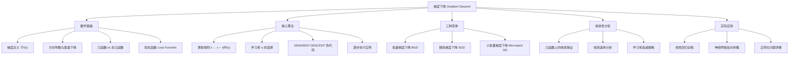
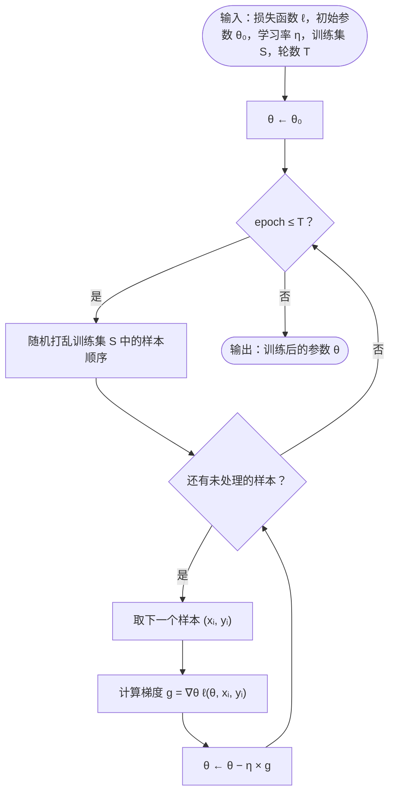
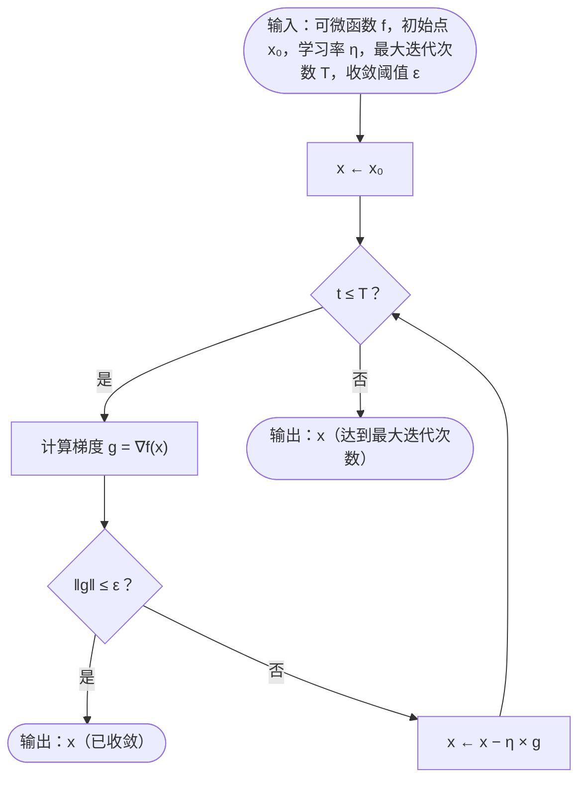

## 相关笔记
- 前置笔记：[[33.2 乘法权重算法]]、[[33.1 聚类与k-means算法]]
- 关联概念：[[算法导论/concepts/分治法]]、[[算法导论/concepts/动态规划]]、[[离散数学/concepts/算法]]、[[离散数学/concepts/概率]]
- 章节汇总：[[第33章_机器学习算法-章节汇总]]

> [!abstract] 概览
> 梯度下降（Gradient Descent）是一阶迭代优化算法，用于寻找可微函数的局部最小值。其核心策略是：在每一步迭代中，沿函数**梯度（gradient）的负方向**移动参数，因为负梯度方向是该点处函数值下降最快的方向。梯度下降是现代机器学习和深度学习中最基础的优化方法，几乎所有训练神经网络、拟合回归模型、求解正则化问题的算法都以梯度下降或其变体（SGD、Adam、RMSProp等）作为底层优化引擎。本节从数学基础出发，系统讲解梯度下降的基本原理、更新规则、学习率选择、批量/随机/小批量三种变体，以及收敛性分析，帮助读者建立对优化算法的完整认知。



## 核心思想

### 33.3.1 梯度下降的基本直觉

梯度下降的核心思想可以用一个日常生活中的场景来理解：假设你被蒙上眼睛站在一座山的某个位置，目标是走到山谷的最低点。你无法看到全局地形，但脚下的地面有一定的坡度。最合理的策略是——每一步都朝着脚下最陡峭的下坡方向走。如果你一直坚持这个策略，最终会到达一个局部最低点（山谷底部）。

在数学上，"脚下的坡度"就是函数的**梯度（gradient）**，"最陡峭的下坡方向"就是梯度的**负方向**。梯度下降算法正是将这一直觉形式化为一个可计算的迭代过程。

### 33.3.2 梯度的数学定义

设 $f: \mathbb{R}^d \to \mathbb{R}$ 是一个可微函数，$f$ 在点 $\mathbf{x} = (x_1, x_2, \ldots, x_d)$ 处的**梯度**定义为：

$$\nabla f(\mathbf{x}) = \left( \frac{\partial f}{\partial x_1}, \frac{\partial f}{\partial x_2}, \ldots, \frac{\partial f}{\partial x_d} \right)$$

梯度是一个与 $\mathbf{x}$ 同维度的向量，其第 $i$ 个分量是 $f$ 对第 $i$ 个自变量的偏导数。梯度具有以下关键性质：

**性质1（方向性）**：梯度 $\nabla f(\mathbf{x})$ 的方向是函数 $f$ 在点 $\mathbf{x}$ 处**值增长最快**的方向。

**性质2（增长率）**：沿梯度方向移动单位距离，函数值的增长率等于梯度的范数 $\|\nabla f(\mathbf{x})\|$。

**性质3（负梯度下降）**：沿负梯度方向 $-\nabla f(\mathbf{x})$ 移动，函数值下降最快，下降速率也等于 $\|\nabla f(\mathbf{x})\|$。

这三个性质的严格推导基于**方向导数**的概念。对于任意单位向量 $\mathbf{u}$（即 $\|\mathbf{u}\| = 1$），$f$ 在 $\mathbf{x}$ 处沿方向 $\mathbf{u}$ 的方向导数为：

$$D_{\mathbf{u}} f(\mathbf{x}) = \nabla f(\mathbf{x}) \cdot \mathbf{u} = \|\nabla f(\mathbf{x})\| \|\mathbf{u}\| \cos\theta = \|\nabla f(\mathbf{x})\| \cos\theta$$

其中 $\theta$ 是 $\nabla f(\mathbf{x})$ 与 $\mathbf{u}$ 之间的夹角。当 $\theta = 0$（即 $\mathbf{u}$ 与梯度同向）时，方向导数取最大值 $\|\nabla f(\mathbf{x})\|$；当 $\theta = \pi$（即 $\mathbf{u}$ 与梯度反向）时，方向导数取最小值 $-\|\nabla f(\mathbf{x})\|$。这就严格证明了【负梯度方向（$\theta = \pi$）是函数值下降最快的方向】。

### 33.3.3 梯度下降的更新规则

梯度下降的更新规则非常简洁：

$$\mathbf{x}^{(t+1)} = \mathbf{x}^{(t)} - \eta \nabla f(\mathbf{x}^{(t)})$$

其中：
- $\mathbf{x}^{(t)}$ 是第 $t$ 次迭代时的参数向量
- $\eta > 0$ 是**学习率（learning rate）**，也称步长（step size）
- $\nabla f(\mathbf{x}^{(t)})$ 是函数在当前点的梯度

这个规则的含义是：从当前位置出发，沿负梯度方向走一小步（步长为 $\eta$），到达新的位置。重复这一过程，直到满足终止条件（如梯度接近零、达到最大迭代次数等）。

**更新规则的几何意义**：在二维情况下，等高线图上的梯度方向垂直于等高线，指向函数值增大的方向。梯度下降的每一步都是横穿等高线，朝着函数值更低的等高线方向移动。

### 33.3.4 学习率的选择

学习率 $\eta$ 是梯度下降中最重要的超参数，它直接决定了算法的行为：

| 学习率大小 | 行为描述 | 后果 |
|:---:|:---|:---|
| $\eta$ 太大 | 每步跨越太大，可能"跳过"最小值 | 在最小值附近来回震荡，甚至发散到无穷远 |
| $\eta$ 适中 | 稳定地逐步逼近最小值 | 收敛到局部最小值（凸函数时为全局最小值） |
| $\eta$ 太小 | 每步移动极微 | 收敛速度极慢，需要大量迭代，可能陷入数值精度问题 |

**学习率选择的经验法则**：
- 通常从 $\eta = 0.01$ 或 $\eta = 0.001$ 开始尝试
- 观察损失函数的变化曲线：如果损失振荡则减小 $\eta$，如果下降极慢则增大 $\eta$
- 实际应用中常采用**学习率衰减（learning rate decay）**策略：随迭代进行逐步减小 $\eta$，初期快速逼近，后期精细调整

**常见的学习率衰减策略**：

| 策略 | 公式 | 特点 |
|:---|:---|:---|
| 逆时衰减 | $\eta_t = \eta_0 / (1 + \alpha t)$ | 衰减平缓，适合长训练过程 |
| 指数衰减 | $\eta_t = \eta_0 \cdot \alpha^t$ | 衰减迅速，需仔细选择 $\alpha$ |
| 余弦退火 | $\eta_t = \eta_{\min} + \frac{1}{2}(\eta_0 - \eta_{\min})(1 + \cos(\pi t / T))$ | 周期性变化，配合重启（SGDR）效果更好 |
| 预热+衰减 | 前 $t_w$ 步线性增大，之后按上述策略衰减 | 避免初始阶段因学习率过大导致不稳定 |

**学习率衰减的直观理解**：训练初期，参数离最优解较远，需要大步长快速逼近；训练后期，参数已接近最优解，需要小步长精细调整。这与"开车"类似——高速公路上快速行驶，接近目的地时减速慢行。

### 33.3.5 凸函数与非凸函数

**凸函数（Convex Function）**：函数 $f$ 是凸函数，当且仅当其定义域上任意两点 $\mathbf{x}, \mathbf{y}$ 和任意 $\lambda \in [0, 1]$，满足：

$$f(\lambda \mathbf{x} + (1 - \lambda) \mathbf{y}) \leq \lambda f(\mathbf{x}) + (1 - \lambda) f(\mathbf{y})$$

凸函数的关键性质是：**任何局部最小值都是全局最小值**。这意味着在凸函数上运行梯度下降，只要收敛，就一定找到全局最优解。

**非凸函数（Non-convex Function）**：不满足凸性条件的函数。非凸函数可能存在多个局部最小值和鞍点。梯度下降在非凸函数上只能保证找到局部最小值，不保证找到全局最小值。

**实际意义**：线性回归的均方误差损失函数是凸函数，梯度下降能找到全局最优解。而神经网络的损失函数通常是非凸的，训练结果受初始化影响，可能收敛到不同的局部最小值。

**判断凸性的实用方法**：
- **二阶条件**：如果 $f$ 二阶可微，则 $f$ 是凸函数当且仅当 Hessian 矩阵 $\nabla^2 f(\mathbf{x})$ 在定义域上处处半正定（即所有特征值 $\geq 0$）。如果 Hessian 矩阵处处正定（所有特征值 $> 0$），则 $f$ 是严格凸函数。
- **常见凸函数**：$f(x) = x^2$（严格凸）、$f(x) = e^x$（严格凸）、$f(x) = |x|$（凸但非严格凸）、$f(\mathbf{x}) = \|\mathbf{x}\|^2$（严格凸）
- **凸函数的运算保持凸性**：两个凸函数的和仍为凸函数；凸函数的非负加权求和仍为凸函数；凸函数与仿射变换的复合仍为凸函数

### 33.3.6 损失函数（Loss Function）

在机器学习中，梯度下降的目标是最小化**损失函数**，损失函数衡量模型预测值与真实值之间的差距。

**均方误差（Mean Squared Error, MSE）**是最基本的损失函数之一。对于 $n$ 个训练样本 $(x_i, y_i)$，线性模型 $h_\theta(x) = \theta_0 + \theta_1 x$ 的 MSE 为：

$$J(\theta_0, \theta_1) = \frac{1}{2n} \sum_{i=1}^{n} (h_\theta(x_i) - y_i)^2$$

其中系数 $\frac{1}{2}$ 是为了后续求导时消去常数因子，不影响最优解的位置。

对 $\theta_0$ 和 $\theta_1$ 分别求偏导：

$$\frac{\partial J}{\partial \theta_0} = \frac{1}{n} \sum_{i=1}^{n} (h_\theta(x_i) - y_i)$$

$$\frac{\partial J}{\partial \theta_1} = \frac{1}{n} \sum_{i=1}^{n} (h_\theta(x_i) - y_i) \cdot x_i$$

这两个偏导数构成了梯度 $\nabla J(\theta_0, \theta_1)$，代入更新规则即可迭代求解最优参数。

**其他常见损失函数**：

| 损失函数 | 公式 | 适用场景 |
|:---|:---|:---|
| 均方误差（MSE） | $\frac{1}{n}\sum(y_i - \hat{y}_i)^2$ | 回归问题 |
| 平均绝对误差（MAE） | $\frac{1}{n}\sum|y_i - \hat{y}_i|$ | 对异常值鲁棒的回归 |
| 交叉熵（Cross-Entropy） | $-\sum y_i \log \hat{y}_i$ | 分类问题 |
| Hinge Loss | $\sum \max(0, 1 - y_i \hat{y}_i)$ | 支持向量机 |

不同损失函数的梯度计算方式不同，但梯度下降的更新框架是通用的——只要损失函数可微，就可以用梯度下降来优化。

### 33.3.7 三种梯度下降变体

根据每次迭代使用的训练样本数量，梯度下降分为三种变体：

**1. 批量梯度下降（Batch Gradient Descent, BGD）**

每次迭代使用**全部 $n$ 个训练样本**计算梯度：

$$\theta \leftarrow \theta - \eta \cdot \frac{1}{n} \sum_{i=1}^{n} \nabla_\theta \ell(h_\theta(x_i), y_i)$$

- 优点：梯度估计准确，收敛路径稳定
- 缺点：当 $n$ 很大时，每次迭代的计算成本极高，无法用于大规模数据集

**2. 随机梯度下降（Stochastic Gradient Descent, SGD）**

每次迭代**随机选取一个样本** $i$ 计算梯度：

$$\theta \leftarrow \theta - \eta \cdot \nabla_\theta \ell(h_\theta(x_i), y_i)$$

- 优点：每次迭代计算量极小（$O(d)$），适合大规模数据集
- 缺点：梯度估计有噪声，收敛路径不规则，可能在最优解附近震荡

**3. 小批量梯度下降（Mini-batch Gradient Descent）**

每次迭代使用**一小批 $b$ 个样本**（$1 < b \ll n$）计算梯度：

$$\theta \leftarrow \theta - \eta \cdot \frac{1}{b} \sum_{j=1}^{b} \nabla_\theta \ell(h_\theta(x_{i_j}), y_{i_j})$$

- 优点：兼顾 BGD 的稳定性和 SGD 的效率，可以利用矩阵运算加速（GPU并行）
- 缺点：需要选择合适的批量大小 $b$（常见取值：32、64、128、256）

**三者的关系**：BGD 是 $b = n$ 的特例，SGD 是 $b = 1$ 的特例。Mini-batch GD 是实践中最常用的变体。

**随机梯度下降（SGD）的伪代码**：

```
STOCHASTIC-GRADIENT-DESCENT(ℓ, θ₀, η, S, T)
输入：损失函数 ℓ，初始参数 θ₀，学习率 η，训练集 S = {(x₁,y₁),...,(xₙ,yₙ)}，轮数 T
输出：训练后的参数 θ

1  θ ← θ₀                          // 初始化参数
2  for epoch ← 1 to T do            // 遍历 T 轮
3      随机打乱 S 中的样本顺序        // 每轮重新打乱，确保随机性
4      for i ← 1 to n do            // 遍历每个样本
5          g ← ∇θ ℓ(θ, xᵢ, yᵢ)      // 计算单个样本的梯度
6          θ ← θ − η × g            // 用单个样本的梯度更新参数
7  return θ                          // 返回训练后的参数
```

**执行流程图：**



**逐行解析**：
- 第1行：初始化模型参数 $\theta$
- 第2行：外层循环控制训练轮数（epoch），一轮表示遍历整个训练集一次
- 第3行：每轮开始前随机打乱样本顺序，这是 SGD 的关键步骤——确保样本的随机性，避免系统性偏差
- 第4行：内层循环逐个处理每个训练样本
- 第5行：计算当前样本 $(x_i, y_i)$ 上的梯度，注意这里只使用一个样本，计算量为 $O(d)$
- 第6行：立即用该梯度更新参数，不需要等待处理完所有样本
- 第7行：返回训练后的参数

**SGD 与 BGD 的关键区别**：BGD 在第6行之前需要先累加所有 $n$ 个样本的梯度再更新，而 SGD 每处理一个样本就立即更新一次参数。因此 SGD 在一轮（epoch）内更新 $n$ 次参数，而 BGD 只更新1次。

### 33.3.8 GRADIENT-DESCENT 伪代码

以下是批量梯度下降的通用伪代码：

```
GRADIENT-DESCENT(f, x₀, η, T, ε)
输入：可微函数 f，初始点 x₀，学习率 η，最大迭代次数 T，收敛阈值 ε
输出：近似最小值点 x*

1  x ← x₀                    // 初始化参数
2  for t ← 1 to T do         // 迭代 T 次
3      g ← ∇f(x)             // 计算当前点的梯度
4      if ‖g‖ ≤ ε then       // 梯度接近零，已收敛
5          return x           // 返回当前点作为解
6      x ← x − η × g         // 沿负梯度方向更新参数
7  return x                   // 达到最大迭代次数，返回当前点
```

**执行流程图：**



**逐行解析**：
- 第1行：将初始点 $\mathbf{x}_0$ 赋值给当前参数 $\mathbf{x}$
- 第2行：设置最大迭代次数 $T$ 作为安全终止条件
- 第3行：计算函数 $f$ 在当前点 $\mathbf{x}$ 处的梯度向量 $\mathbf{g}$
- 第4-5行：检查收敛条件——当梯度的范数 $\|\mathbf{g}\|$ 小于阈值 $\varepsilon$ 时，说明已到达（或非常接近）驻点，算法终止
- 第6行：执行核心更新操作，将 $\mathbf{x}$ 沿负梯度方向移动 $\eta$ 步长
- 第7行：如果达到最大迭代次数仍未收敛，返回当前点作为近似解

### 33.3.9 逐步执行实例

**实例1：一维函数最小化**

考虑函数 $f(x) = x^2 + 2x + 1 = (x+1)^2$，显然最小值在 $x^* = -1$ 处，最小值为 $f(-1) = 0$。

梯度为 $f'(x) = 2x + 2$。设初始点 $x^{(0)} = 3$，学习率 $\eta = 0.1$。

| 迭代 $t$ | $x^{(t)}$ | $f'(x^{(t)}) = 2x + 2$ | $x^{(t+1)} = x - 0.1 \times f'(x)$ |
|:---:|:---:|:---:|:---:|
| 0 | 3.000 | 8.000 | 3.000 − 0.800 = 2.200 |
| 1 | 2.200 | 6.400 | 2.200 − 0.640 = 1.560 |
| 2 | 1.560 | 5.120 | 1.560 − 0.512 = 1.048 |
| 3 | 1.048 | 4.096 | 1.048 − 0.410 = 0.638 |
| 4 | 0.638 | 3.276 | 0.638 − 0.328 = 0.310 |
| 5 | 0.310 | 2.620 | 0.310 − 0.262 = 0.048 |
| 10 | ≈−0.698 | 0.604 | ≈−0.758 |
| 20 | ≈−0.988 | 0.024 | ≈−0.990 |

可以看到 $x^{(t)}$ 逐步逼近 $-1$。由于 $f(x) = (x+1)^2$ 是严格的凸函数，梯度下降保证收敛到全局最小值。

**实例2：二维函数最小化**

考虑函数 $f(x_1, x_2) = x_1^2 + 3x_2^2$，最小值在 $(0, 0)$ 处。

梯度为 $\nabla f = (2x_1, 6x_2)$。设初始点 $(x_1^{(0)}, x_2^{(0)}) = (3, 2)$，学习率 $\eta = 0.1$。

| 迭代 $t$ | $x_1^{(t)}$ | $x_2^{(t)}$ | $\partial f/\partial x_1$ | $\partial f/\partial x_2$ | $x_1^{(t+1)}$ | $x_2^{(t+1)}$ |
|:---:|:---:|:---:|:---:|:---:|:---:|:---:|
| 0 | 3.000 | 2.000 | 6.000 | 12.000 | 2.400 | 0.800 |
| 1 | 2.400 | 0.800 | 4.800 | 4.800 | 1.920 | 0.320 |
| 2 | 1.920 | 0.320 | 3.840 | 1.920 | 1.536 | 0.128 |
| 3 | 1.536 | 0.128 | 3.072 | 0.768 | 1.229 | 0.051 |
| 5 | 0.983 | 0.021 | 1.966 | 0.123 | 0.786 | 0.008 |

注意 $x_2$ 方向的收敛速度明显快于 $x_1$ 方向，这是因为 $x_2$ 方向的曲率（二阶导数 = 6）更大，梯度分量也更大。这种现象在非球形等高线函数中很常见，也是后续动量法和自适应学习率方法要解决的问题。

**实例3：线性回归的梯度下降求解**

给定训练数据：$(x_1, y_1) = (1, 2)$，$(x_2, y_2) = (2, 3)$，$(x_3, y_3) = (3, 5)$。使用模型 $h_\theta(x) = \theta_0 + \theta_1 x$，以 MSE 为损失函数。

$$J(\theta_0, \theta_1) = \frac{1}{2 \times 3} \sum_{i=1}^{3} (\theta_0 + \theta_1 x_i - y_i)^2$$

展开计算：

$$J = \frac{1}{6} [(\theta_0 + \theta_1 - 2)^2 + (\theta_0 + 2\theta_1 - 3)^2 + (\theta_0 + 3\theta_1 - 5)^2]$$

偏导数为：

$$\frac{\partial J}{\partial \theta_0} = \frac{1}{3} [(\theta_0 + \theta_1 - 2) + (\theta_0 + 2\theta_1 - 3) + (\theta_0 + 3\theta_1 - 5)] = \theta_0 + 2\theta_1 - \frac{10}{3}$$

$$\frac{\partial J}{\partial \theta_1} = \frac{1}{3} [(\theta_0 + \theta_1 - 2) + 2(\theta_0 + 2\theta_1 - 3) + 3(\theta_0 + 3\theta_1 - 5)] = 2\theta_0 + \frac{14}{3}\theta_1 - \frac{23}{3}$$

设初始值 $\theta_0^{(0)} = 0$，$\theta_1^{(0)} = 0$，学习率 $\eta = 0.1$。

| 迭代 $t$ | $\theta_0$ | $\theta_1$ | $\partial J/\partial \theta_0$ | $\partial J/\partial \theta_1$ | $\theta_0^{(t+1)}$ | $\theta_1^{(t+1)}$ |
|:---:|:---:|:---:|:---:|:---:|:---:|:---:|
| 0 | 0.000 | 0.000 | −3.333 | −7.667 | 0.333 | 0.767 |
| 1 | 0.333 | 0.767 | −1.733 | −3.511 | 0.507 | 1.118 |
| 2 | 0.507 | 1.118 | −0.923 | −1.642 | 0.599 | 1.282 |
| 5 | ≈0.698 | ≈1.444 | −0.079 | −0.074 | ≈0.706 | ≈1.451 |
| 10 | ≈0.714 | ≈1.457 | ≈−0.002 | ≈−0.001 | ≈0.714 | ≈1.457 |

精确解（令两个偏导数为零联立求解）：$\theta_0^* = 1/7 \approx 0.714$，$\theta_1^* = 10/7 \approx 1.429$。梯度下降逐步逼近精确解。

### 33.3.10 收敛性分析

**定理（凸函数上的收敛性）**：设 $f: \mathbb{R}^d \to \mathbb{R}$ 是 $L$-光滑的凸函数（即梯度满足 $L$-Lipschitz连续条件），则梯度下降以学习率 $\eta = 1/L$ 运行 $T$ 步后，满足：

$$f(\mathbf{x}^{(T)}) - f(\mathbf{x}^*) \leq \frac{L \|\mathbf{x}^{(0)} - \mathbf{x}^*\|^2}{2T}$$

其中 $\mathbf{x}^*$ 是全局最小值点。

**证明要点**：

**第一步**：利用 $L$-光滑性条件。对任意 $\mathbf{x}, \mathbf{y}$，有：

$$f(\mathbf{y}) \leq f(\mathbf{x}) + \nabla f(\mathbf{x})^\top (\mathbf{y} - \mathbf{x}) + \frac{L}{2} \|\mathbf{y} - \mathbf{x}\|^2$$

**第二步**：将 $\mathbf{y} = \mathbf{x}^{(t+1)} = \mathbf{x}^{(t)} - \eta \nabla f(\mathbf{x}^{(t)})$ 代入上式，展开并化简：

$$f(\mathbf{x}^{(t+1)}) \leq f(\mathbf{x}^{(t)}) - \eta \|\nabla f(\mathbf{x}^{(t)})\|^2 + \frac{L\eta^2}{2} \|\nabla f(\mathbf{x}^{(t)})\|^2$$

$$= f(\mathbf{x}^{(t)}) - \eta \left(1 - \frac{L\eta}{2}\right) \|\nabla f(\mathbf{x}^{(t)})\|^2$$

**第三步**：选择 $\eta = 1/L$，使得 $(1 - L\eta/2) = 1/2$，得到：

$$f(\mathbf{x}^{(t+1)}) \leq f(\mathbf{x}^{(t)}) - \frac{1}{2L} \|\nabla f(\mathbf{x}^{(t)})\|^2$$

这表明每一步迭代函数值都在减小（或不变），即【函数值序列 $\{f(\mathbf{x}^{(t)})\}$ 是单调不增的】。

**第四步**：利用凸函数的性质 $\|\nabla f(\mathbf{x})\|^2 \geq 2L(f(\mathbf{x}) - f(\mathbf{x}^*))$，代入得：

$$f(\mathbf{x}^{(t+1)}) - f(\mathbf{x}^*) \leq f(\mathbf{x}^{(t)}) - f(\mathbf{x}^*) - \frac{1}{L}(f(\mathbf{x}^{(t)}) - f(\mathbf{x}^*)) = \left(1 - \frac{1}{L}\right)(f(\mathbf{x}^{(t)}) - f(\mathbf{x}^*))$$

**第五步**：对 $T$ 步迭代进行累加（telescoping sum），最终得到 $O(1/T)$ 的收敛速率。

**收敛速率总结**：
- 凸函数：$O(1/T)$——次线性收敛
- $\mu$-强凸函数：$O((1 - \mu/L)^T)$——线性收敛（指数级衰减）
- 非凸函数：只能保证收敛到驻点（梯度为零的点），不保证是最小值

### 33.3.11 强凸函数上的线性收敛

当函数 $f$ 满足 $\mu$-**强凸性**条件（$\mu > 0$），即对任意 $\mathbf{x}, \mathbf{y}$：

$$f(\mathbf{y}) \geq f(\mathbf{x}) + \nabla f(\mathbf{x})^\top (\mathbf{y} - \mathbf{x}) + \frac{\mu}{2} \|\mathbf{y} - \mathbf{x}\|^2$$

此时梯度下降的收敛速率可以从 $O(1/T)$ 提升到**线性收敛**（linear convergence），即函数值误差按指数级衰减：

$$f(\mathbf{x}^{(T)}) - f(\mathbf{x}^*) \leq \left(1 - \frac{\mu}{L}\right)^T (f(\mathbf{x}^{(0)}) - f(\mathbf{x}^*))$$

**证明要点**：

**第一步**：将 $L$-光滑性和 $\mu$-强凸性结合。$L$-光滑性给出函数值的上界（如前所述），$\mu$-强凸性给出梯度的下界：

$$\|\nabla f(\mathbf{x})\|^2 \geq 2\mu (f(\mathbf{x}) - f(\mathbf{x}^*))$$

**第二步**：将此下界代入 $L$-光滑性推导中的不等式：

$$f(\mathbf{x}^{(t+1)}) \leq f(\mathbf{x}^{(t)}) - \frac{1}{2L} \|\nabla f(\mathbf{x}^{(t)})\|^2 \leq f(\mathbf{x}^{(t)}) - \frac{\mu}{L}(f(\mathbf{x}^{(t)}) - f(\mathbf{x}^*))$$

**第三步**：整理得：

$$f(\mathbf{x}^{(t+1)}) - f(\mathbf{x}^*) \leq \left(1 - \frac{\mu}{L}\right)(f(\mathbf{x}^{(t)}) - f(\mathbf{x}^*))$$

**第四步**：递推 $T$ 步，得到【误差以压缩比 $(1 - \mu/L) < 1$ 指数衰减】的结论。

**条件数的影响**：比值 $\kappa = L/\mu$ 称为**条件数（condition number）**。条件数越大，压缩比 $(1 - 1/\kappa)$ 越接近1，收敛越慢；条件数越小（接近1），收敛越快。条件数反映了函数等高线的"椭球程度"——条件数大意味着等高线是狭长的椭圆，梯度下降会在"峡谷"中来回震荡，收敛缓慢。

### 33.3.12 鞍点问题

在高维非凸优化中（如深度学习），**鞍点（saddle point）** 是比局部最小值更常见的障碍。鞍点是梯度为零但既非最小值也非最大值的点。

**鞍点的数学定义**：$\mathbf{x}^*$ 是鞍点，如果 $\nabla f(\mathbf{x}^*) = \mathbf{0}$，但 Hessian 矩阵 $\nabla^2 f(\mathbf{x}^*)$ 既有正特征值也有负特征值。沿正特征值对应的方向，$\mathbf{x}^*$ 是局部最小值；沿负特征值对应的方向，$\mathbf{x}^*$ 是局部最大值。

**高维空间中鞍点的普遍性**：考虑一个 $d$ 维函数，在驻点处 Hessian 矩阵有 $d$ 个特征值。要成为局部最小值，所有 $d$ 个特征值都必须为正；而只要有一个特征值为负，就是鞍点。随着维度 $d$ 增大，所有特征值恰好为正的概率急剧降低，因此在高维空间中鞍点的数量远多于局部最小值。

**梯度下降在鞍点附近的行为**：由于鞍点处梯度为零，梯度下降在鞍点附近会减速。但严格鞍点（strict saddle）的不稳定流形使得随机扰动或 SGD 的噪声有较大概率将参数推出鞍点区域。这是 SGD 在深度学习训练中表现优于纯 BGD 的原因之一。

> [!info] 梯度下降的历史渊源
> 梯度下降的思想最早由法国数学家 **Augustin-Louis Cauchy** 于 **1847年** 在其论文 *Methode generale pour la resolution des systemes d'equations simultanees* 中提出。Cauchy 的原始动机是求解非线性方程组，他提出了一种迭代方法：通过减去偏导数的正倍数来更新变量，这等价于我们今天所称的梯度下降。这一方法后来被称为"最速下降法"（steepest descent method），是最优化领域最古老也最基础的迭代算法之一。
>
> 参考阅读：Cauchy 梯度下降的历史与数学基础 —— https://www.juancmeza.com/s/steepest-descent.pdf

> [!info] 随机梯度下降的理论起源
> 随机梯度下降（SGD）的理论基础可追溯到 **Robbins 和 Monro** 在 **1951年** 发表的经典论文 *A Stochastic Approximation Method*。他们提出了一种随机逼近框架，用于在只能观测到带噪声的函数值的情况下迭代求解根寻找问题。随后 **Kiefer 和 Wolfowitz（1952）** 发展了无梯度变体。这些工作奠定了 SGD 的概率论和算法基础。在后续几十年中，SGD 在不同社区被多次独立发明，曾以"最小均方"（LMS）、"反向传播"（backpropagation）、"在线学习"（online learning）等名称出现。
>
> 参考阅读：Robbins-Monro 随机逼近方法与 SGD 理论 —— https://people.eecs.berkeley.edu/~brecht/opt4ml_book/O4MD_05_SGM.pdf

> [!info] 自适应学习率方法：从 AdaGrad 到 Adam
> 固定学习率的梯度下降在实践中常遇到困难：不同参数可能需要不同的学习率，且最优学习率可能随训练进程变化。为此，研究者提出了一系列自适应学习率方法：**AdaGrad**（2011）为每个参数维护累积平方梯度，自动降低频繁更新参数的学习率；**RMSProp**（2012）引入梯度平方的指数移动平均，缓解了 AdaGrad 学习率过度衰减的问题；**Adam**（2015，Kingma 和 Ba）结合了动量法和 RMSProp，通过估计梯度的一阶矩（均值）和二阶矩（方差）来动态调整每个参数的学习率。Adam 的更新规则为 $\theta_t = \theta_{t-1} - \frac{\eta}{\sqrt{\hat{v}_t} + \epsilon} \hat{m}_t$，其中 $\hat{m}_t$ 和 $\hat{v}_t$ 分别是偏差校正后的一阶矩和二阶矩估计。
>
> 参考阅读：自适应学习率方法（AdaGrad、RMSprop、Adam）详解 —— https://www.fiveable.me/deep-learning-systems/unit-6/adaptive-learning-rate-methods-adagrad-rmsprop-adam/study-guide/vGZc9BB9KkXjqsxD

> [!info] 梯度下降与反向传播的关系
> 在深度学习中，梯度下降负责"战略方针"——确定参数更新的方向和步长；而**反向传播（Backpropagation）** 负责"战术执行"——高效计算损失函数对网络中每个参数的梯度。反向传播利用链式法则，从输出层向输入层逐层传播误差信号，以 $O(W)$ 的时间复杂度计算所有参数的梯度（$W$ 为参数总数），而非对每个参数独立求导所需的 $O(W^2)$ 时间。两者结合构成了神经网络训练的核心引擎：反向传播计算梯度，梯度下降用梯度更新参数。
>
> 参考阅读：神经网络训练与反向传播（Cornell CS4780） —— https://courses.cs.cornell.edu/cs4780/2023fa/slides/nn_train_backprop_annotated.pdf

> [!warning] 局部最小值 vs 全局最小值
> 梯度下降沿负梯度方向移动，只能保证收敛到**局部最小值**（或鞍点），对**非凸函数**不保证找到全局最优解。例如，函数 $f(x) = x^4 - 4x^2$ 有两个局部最小值 $x = \pm\sqrt{2}$，其中 $x = -\sqrt{2}$ 处的函数值更小（全局最小值）。如果初始点选在 $x > 0$ 的区域，梯度下降可能收敛到 $x = \sqrt{2}$（局部最小值而非全局最小值）。在实践中，可通过多次随机初始化、模拟退火等策略来缓解这一问题。

> [!warning] 梯度方向与下降方向的区分
> **梯度方向是函数值增长最快的方向，而非下降最快的方向。** 这是一个常见的概念混淆。正确的理解是：$\nabla f(\mathbf{x})$ 指向函数值增大最快的方向，$-\nabla f(\mathbf{x})$ 才指向函数值减小最快的方向。梯度下降算法使用的是**负梯度**方向进行参数更新。如果误用正梯度方向，算法将走向函数值增大的方向，完全背离优化目标。

> [!warning] SGD 中"随机"的含义
> SGD 中的"随机"（Stochastic）指的是**每次迭代只随机选取一个样本来估计梯度**，而非对整个训练集计算精确梯度。这引入了梯度估计的随机噪声，使得收敛路径不规则。SGD 的"随机"**不是**指随机初始化参数——事实上，BGD、SGD 和 Mini-batch GD 都可以使用相同的初始化策略。噪声虽然导致路径震荡，但有时反而有助于跳出局部最小值，起到隐式正则化的效果。

## 习题精选

| 题号 | 题目描述 | 考察重点 |
|:---:|:---|:---|
| 33.3-1 | 对函数 $f(x) = 3x^2 - 4x + 2$，从 $x^{(0)} = 0$ 出发，以学习率 $\eta = 0.1$ 执行梯度下降，给出前3次迭代的 $x$ 值 | 一维梯度下降的基本计算 |
| 33.3-2 | 考虑 $f(x_1, x_2) = (x_1 - 1)^2 + 4(x_2 + 2)^2$，从 $(0, 0)$ 出发，以 $\eta = 0.1$ 执行2步梯度下降，写出每步的参数值和梯度 | 二维梯度下降的计算 |
| 33.3-3 | 解释为什么对于凸函数，梯度下降保证收敛到全局最小值；而对于非凸函数，只能保证收敛到局部最小值 | 凸性对收敛性的影响 |
| 33.3-4 | 比较批量梯度下降和随机梯度下降在以下方面的差异：(a) 每次迭代的计算成本；(b) 梯度估计的方差；(c) 收敛路径的特征 | BGD 与 SGD 的对比分析 |

> [!faq]- 33.3-1 参考答案
> **函数**：$f(x) = 3x^2 - 4x + 2$
>
> **梯度**：$f'(x) = 6x - 4$
>
> **初始条件**：$x^{(0)} = 0$，$\eta = 0.1$
>
> **第1次迭代**：
> - $f'(0) = 6 \times 0 - 4 = -4$
> - $x^{(1)} = 0 - 0.1 \times (-4) = 0 + 0.4 = 0.4$
>
> **第2次迭代**：
> - $f'(0.4) = 6 \times 0.4 - 4 = 2.4 - 4 = -1.6$
> - $x^{(2)} = 0.4 - 0.1 \times (-1.6) = 0.4 + 0.16 = 0.56$
>
> **第3次迭代**：
> - $f'(0.56) = 6 \times 0.56 - 4 = 3.36 - 4 = -0.64$
> - $x^{(3)} = 0.56 - 0.1 \times (-0.64) = 0.56 + 0.064 = 0.624$
>
> **解析**：精确最小值点为 $x^* = 2/3 \approx 0.667$（令 $f'(x) = 0$ 得 $6x - 4 = 0$）。3次迭代后 $x^{(3)} = 0.624$，已接近最优值。由于 $f(x)$ 是凸函数（二阶导数 $f''(x) = 6 > 0$），梯度下降将收敛到全局最小值。

> [!faq]- 33.3-2 参考答案
> **函数**：$f(x_1, x_2) = (x_1 - 1)^2 + 4(x_2 + 2)^2$
>
> **梯度**：$\nabla f = (2(x_1 - 1),\; 8(x_2 + 2))$
>
> **初始条件**：$(x_1^{(0)}, x_2^{(0)}) = (0, 0)$，$\eta = 0.1$
>
> **第1次迭代**：
> - $\nabla f(0, 0) = (2(0-1),\; 8(0+2)) = (-2,\; 16)$
> - $x_1^{(1)} = 0 - 0.1 \times (-2) = 0.2$
> - $x_2^{(1)} = 0 - 0.1 \times 16 = -1.6$
>
> **第2次迭代**：
> - $\nabla f(0.2, -1.6) = (2(0.2-1),\; 8(-1.6+2)) = (-1.6,\; 3.2)$
> - $x_1^{(2)} = 0.2 - 0.1 \times (-1.6) = 0.36$
> - $x_2^{(2)} = -1.6 - 0.1 \times 3.2 = -1.92$
>
> **解析**：精确最小值点为 $(1, -2)$。注意 $x_2$ 方向的曲率是 $x_1$ 方向的4倍（系数4 vs 1），因此 $x_2$ 方向的梯度分量更大，收敛更快。这种各向异性的收敛行为在椭球等高线函数中很典型。

> [!faq]- 33.3-3 参考答案
> **凸函数的情况**：
> 凸函数的定义保证了任意局部最小值都是全局最小值。严格证明如下：设 $\mathbf{x}^*$ 是一个局部最小值，假设存在另一个点 $\mathbf{y}$ 使得 $f(\mathbf{y}) < f(\mathbf{x}^*)$。由凸性，对任意 $\lambda \in (0, 1)$：
> $$f(\lambda \mathbf{y} + (1-\lambda)\mathbf{x}^*) \leq \lambda f(\mathbf{y}) + (1-\lambda) f(\mathbf{x}^*) < f(\mathbf{x}^*)$$
> 当 $\lambda$ 足够小时，$\lambda \mathbf{y} + (1-\lambda)\mathbf{x}^*$ 落在 $\mathbf{x}^*$ 的任意小邻域内，但函数值严格小于 $f(\mathbf{x}^*)$，这与 $\mathbf{x}^*$ 是局部最小值矛盾。因此不存在比 $\mathbf{x}^*$ 函数值更小的点，$\mathbf{x}^*$ 就是全局最小值。
>
> 梯度下降在凸函数上每一步都使函数值减小（或不变），函数值有下界，因此必定收敛。由于所有局部最小值都是全局最小值，收敛到的必然是全局最优解。
>
> **非凸函数的情况**：
> 非凸函数可能存在多个局部最小值，且不同局部最小值处的函数值不同。梯度下降只能"看到"局部的梯度信息，无法判断当前局部最小值是否为全局最小值。算法会收敛到初始点所在的"吸引域"（basin of attraction）中的局部最小值，不同初始化可能导向不同的局部最小值。

> [!faq]- 33.3-4 参考答案
> **(a) 每次迭代的计算成本**：
> - BGD：$O(nd)$，需要遍历全部 $n$ 个样本，每个样本计算 $d$ 维梯度
> - SGD：$O(d)$，只需处理1个样本
> - 当 $n$ 很大时（如百万级样本），SGD 每步的计算成本远低于 BGD
>
> **(b) 梯度估计的方差**：
> - BGD：使用全部样本，梯度估计是精确的（方差为0）
> - SGD：使用单个样本，梯度估计 $\nabla \ell(h_\theta(x_i), y_i)$ 是真实梯度 $\nabla J(\theta)$ 的无偏估计，但方差较大
> - 方差大小与样本间的梯度差异有关，数据越异质，方差越大
>
> **(c) 收敛路径的特征**：
> - BGD：收敛路径平滑稳定，沿"峡谷"方向稳步下降，但每步进展慢（因为计算成本高）
> - SGD：收敛路径不规则，呈锯齿状震荡，但震荡的中心趋势指向最优解；噪声有时有助于跳出浅的局部最小值
> - Mini-batch GD：介于两者之间，路径比 SGD 平滑，比 BGD 高效

## 视频学习指南

| 序号 | 视频主题 | 建议学习阶段 | 核心内容 |
|:---:|:---|:---:|:---|
| 1 | 梯度下降直觉与可视化 | 入门 | 3Blue1Brown 风格的梯度下降几何直觉，等高线图上的下降路径动画 |
| 2 | 梯度的数学推导 | 基础 | 方向导数、梯度的定义与性质，负梯度是最速下降方向的严格证明 |
| 3 | 学习率的影响实验 | 基础 | 不同学习率下梯度下降的行为对比（收敛、震荡、发散） |
| 4 | SGD 与 Mini-batch GD | 进阶 | 从 BGD 到 SGD 到 Mini-batch 的演进，噪声对收敛的影响 |
| 5 | 凸优化与收敛性证明 | 进阶 | $L$-光滑性、凸函数上的 $O(1/T)$ 收敛率证明 |
| 6 | Adam 等自适应优化器 | 拓展 | AdaGrad、RMSProp、Adam 的原理与对比 |

## 本节知识脉络总结

本节围绕梯度下降这一核心优化算法，从直觉到数学、从理论到实践，建立了完整的知识体系：

1. **直觉层面**：用"蒙眼下山"的类比建立对梯度下降的基本认知
2. **数学层面**：通过方向导数严格证明了负梯度是最速下降方向
3. **算法层面**：给出了 BGD 和 SGD 的完整伪代码，并逐行解析
4. **变体层面**：比较了 BGD、SGD、Mini-batch GD 三种变体的优劣
5. **理论层面**：证明了凸函数上的 $O(1/T)$ 收敛性和强凸函数上的线性收敛
6. **实践层面**：通过一维、二维和线性回归三个实例演示了完整的计算过程

**关键要点回顾**：
- 梯度下降的更新规则 $\mathbf{x} \leftarrow \mathbf{x} - \eta \nabla f(\mathbf{x})$ 是所有变体的统一框架
- 学习率 $\eta$ 的选择至关重要，太大导致震荡/发散，太小导致收敛缓慢
- 凸函数上的梯度下降保证全局最优，非凸函数上只能保证局部最优
- SGD 通过引入随机噪声实现了计算效率的提升，同时具有隐式正则化效果
- 条件数 $\kappa = L/\mu$ 决定了收敛速度，条件数越大收敛越慢

**与其他优化方法的关系**：
- 梯度下降是一阶方法（只使用梯度信息），与之对应的**二阶方法**（如牛顿法）还使用 Hessian 矩阵（二阶导数），收敛更快但每次迭代的计算成本更高
- [[算法导论/concepts/动态规划]] 通过将问题分解为子问题来求解最优解，而梯度下降通过迭代逼近来求解连续优化问题，两者的适用场景不同
- 在 [[离散数学/concepts/概率]] 的框架下，SGD 的随机性可以用概率论工具严格分析其期望收敛性

> [!quote] 教材原文（CLRS 第4版 第33.3节）
> Gradient descent is a first-order iterative optimization algorithm for finding a local minimum of a differentiable function. The idea is to take repeated steps in the opposite direction of the gradient (or approximate gradient) of the function at the current point, because this is the direction of steepest descent. Conversely, stepping in the direction of the gradient will lead to a local maximum of that function; the procedure is then known as gradient ascent.
>
> 梯度下降是一阶迭代优化算法，用于寻找可微函数的局部最小值。其思想是在当前点沿梯度的反方向（或近似梯度的反方向）重复迈步，因为这是最速下降的方向。反之，沿梯度方向迈步将导向函数的局部最大值，该过程称为梯度上升。

## 参见Wiki

- **Wiki**：[[算法导论/concepts/分治法]] | [[算法导论/concepts/动态规划]] | [[离散数学/concepts/算法]] | [[离散数学/concepts/概率]]
- **章节导航**：[[第33章_机器学习算法/33.2 乘法权重算法]] | [[第33章_机器学习算法-章节汇总]]

---

#学习/算法导论/第33章-机器学习算法 #学习/算法导论/机器学习算法/梯度下降
