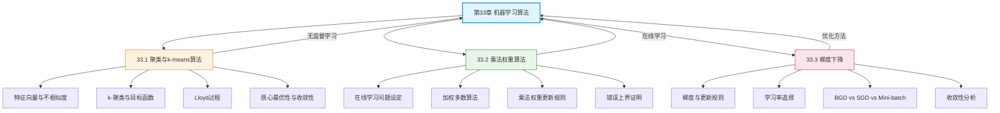

## 相关笔记

**本章节笔记：**
- [[33.1 聚类与k-means算法]] — 特征向量、k-聚类、Lloyd过程、质心最优性、收敛性分析
- [[33.2 乘法权重算法]] — 在线学习、加权多数算法、乘法权重更新规则、错误上界证明
- [[33.3 梯度下降]] — 梯度定义、更新规则、学习率选择、BGD/SGD/Mini-batch GD、收敛性分析

**前置章节汇总：**
- [[第32章_字符串匹配-章节汇总]] — 字符串匹配（前一章）
- [[第27章_在线算法-章节汇总]] — 在线算法（乘法权重算法的理论基础）

**后续章节：**
- 第34章 NP完全性（待学习）

---

> [!abstract] 概览
> 第33章是CLRS第4版==全新增加==的章节，系统介绍了三个重要的==机器学习算法==，分别对应机器学习的三个核心范式：==无监督学习==（聚类）、==在线学习==（乘法权重）和==优化方法==（梯度下降）。本章从算法视角出发，强调数学基础和算法分析，而非工程实现细节。
>
> 三篇笔记覆盖：(1) 33.1节介绍==k-means聚类==算法（Lloyd过程），通过==分配步==和==更新步==的交替迭代，将数据点划分为k个簇，使簇内平方距离最小化；(2) 33.2节介绍==乘法权重算法==，在==在线学习==设定下，通过指数级权重衰减机制，使算法的总错误次数接近最优专家；(3) 33.3节介绍==梯度下降==及其变体（SGD、Mini-batch GD），通过沿负梯度方向迭代更新参数，最小化损失函数。

---

## 知识结构总览

---

## 核心概念回顾

### 三篇笔记内容对比

| 维度 | 33.1 聚类与k-means | 33.2 乘法权重 | 33.3 梯度下降 |
|:---|:---|:---|:---|
| **学习范式** | 无监督学习 | 在线学习 | 优化方法 |
| **核心问题** | 如何将数据点分组 | 如何在线做出准确预测 | 如何最小化损失函数 |
| **核心方法** | Lloyd过程（分配+更新） | 乘法权重更新 | 梯度下降迭代 |
| **关键参数** | k（簇数）、初始中心 | β（惩罚因子）、n（专家数） | η（学习率） |
| **时间复杂度** | O(Iknd)（I为迭代次数） | O(Tn)（T为轮数） | O(Td)（T为迭代次数） |
| **最优性保证** | 局部最优（NP-hard） | 错误 ≤ 2.41(ln n + M) | 凸函数→全局最优 |

> [!def] 核心定理汇总
> 1. **k-means NP-hardness**：精确求解k-means问题是NP-hard的
> 2. **Lloyd过程单调性**：每次迭代f值单调递减，有限步终止于局部最优
> 3. **乘法权重错误上界**：算法错误次数L ≤ (ln n + M ln(1/β)) / ln(2/(1+β))，取β=1/2时L ≤ 2.41(ln n + M)
> 4. **梯度下降收敛性**：对L-Lipschitz凸函数，步长η=1/L时，经T步后f(x_T) - f(x*) ≤ ||x_0 - x*||² / (2ηT)

---

## 跨章关联

### 与第27章（在线算法）的关系

- 乘法权重算法本质上是==在线算法==，与第27章的竞争分析框架一致
- 第27章的==竞争比==概念可以用于分析乘法权重算法的性能：算法的错误次数与最优专家错误次数的比值
- 第27章的==缓存问题==可以视为在线学习的一种特殊形式

### 与第5章（概率分析与随机化算法）的关系

- 乘法权重算法的错误上界证明使用了==概率分析==技术
- k-means的随机初始化（如k-means++）依赖==随机化算法==保证期望质量
- SGD的随机性来源于随机采样训练样本

### 与第14章（动态规划）的关系

- 梯度下降可以视为动态规划的连续版本：都是通过==最优子结构==逐步逼近最优解
- 某些机器学习问题（如隐马尔可夫模型）既可以用动态规划求解，也可以用梯度下降优化

### 与第32章（字符串匹配）的关系

- k-means聚类可以用于文本分类（将文档表示为特征向量后聚类）
- 梯度下降是训练文本分类模型（如逻辑回归）的核心优化算法

---

## 综合复习题

> [!faq]- Q1：k-means算法、乘法权重算法和梯度下降分别属于什么学习范式？它们各自的核心"学习"机制是什么？
>
> **解答：**
>
> | 算法 | 学习范式 | 核心学习机制 |
> |:-----|:---------|:-------------|
> | k-means | 无监督学习 | 通过迭代优化簇内平方距离，自动发现数据中的分组结构 |
> | 乘法权重 | 在线学习 | 通过指数级权重衰减，从多个专家中"学习"哪些专家更可靠 |
> | 梯度下降 | 优化方法（监督学习的基础） | 通过沿负梯度方向迭代，"学习"使损失函数最小的参数 |
>
> 三者的共同点是都是==迭代优化==算法，每步都基于当前状态做出改进。不同点在于：k-means没有标签（无监督），乘法权重在线接收反馈（在线学习），梯度下降需要标注数据计算损失（监督学习的基础工具）。

> [!faq]- Q2：为什么k-means只能找到局部最优？有哪些改进方法？
>
> **解答：**
>
> **局部最优的原因：** Lloyd过程的每一步（分配步和更新步）都只保证不增加目标函数f的值，但每步的改进是贪心的——分配步只考虑当前中心，更新步只重新计算质心。这种贪心策略可能陷入局部最优，因为不同的初始中心可能导致不同的收敛结果。
>
> **改进方法：**
> 1. **多次随机初始化**：运行k-means多次（如20-50次），选择f值最小的结果
> 2. **k-means++初始化**（Arthur & Vassilvitskii 2007）：第一个中心随机选择，后续中心以与已有中心距离的概率分布选择，保证O(log k)的近似比
> 3. **层次聚类**：自底向上或自顶向下构建聚类树，不依赖随机初始化
> 4. **谱聚类**：利用图的拉普拉斯矩阵的特征向量进行聚类，可以处理非凸形状的簇

> [!faq]- Q3：梯度下降的三种变体（BGD、SGD、Mini-batch GD）各有什么优缺点？在实际中如何选择？
>
> **解答：**
>
> | 变体 | 每步使用的样本数 | 梯度估计质量 | 计算成本 | 收敛速度 | 适用场景 |
> |:-----|:---------------|:-----------|:---------|:---------|:---------|
> | BGD | 全部n个 | 精确 | O(nd)每步 | 慢但稳定 | 小数据集 |
> | SGD | 1个 | 高方差 | O(d)每步 | 快但震荡 | 大数据集 |
> | Mini-batch | b个（32-256） | 中等方差 | O(bd)每步 | 折中 | 实际最常用 |
>
> **实际选择建议：**
> - 数据集 < 10万：优先尝试BGD
> - 数据集 > 10万：使用Mini-batch GD（batch size 64-256）
> - 需要快速原型验证：SGD
> - 深度学习训练：Mini-batch GD + Adam优化器

---

## 常见误区

> [!warning] 误区1：k-means总能找到"正确的"聚类数量k
> k-means需要预先指定k值，算法本身不会自动确定最优的k。选择k的方法包括：==肘部法则==（elbow method，观察f值随k增大的下降拐点）、==轮廓系数==（silhouette coefficient，选择使轮廓系数最大的k）、以及基于领域知识的判断。不同的k值可能导致完全不同的聚类结果。

> [!warning] 误区2：乘法权重算法中的"专家"必须是高性能的AI模型
> 乘法权重算法中的"专家"可以是==任意预测器==，甚至可以是简单的规则（如"总是预测0"或"随机猜测"）。算法的强大之处在于：即使大部分专家很差，只要存在少数好的专家，算法就能通过权重更新自动"发现"并依赖这些好专家。错误上界只依赖最佳专家的错误次数M，而不依赖其他专家的表现。

> [!warning] 误区3：梯度下降一定比其他优化方法（如牛顿法）差
> 梯度下降是一阶方法（只使用梯度信息），牛顿法是二阶方法（使用Hessian矩阵）。牛顿法在理论上收敛更快（二次收敛 vs 线性收敛），但每次迭代的计算成本更高（需要计算和存储d×d的Hessian矩阵）。对于高维问题（如深度学习中的百万级参数），牛顿法不可行，梯度下降（及其变体SGD、Adam）是唯一实际可行的选择。

---

## 学习要点总结

| 学习目标 | 掌握程度 | 对应笔记 |
|:---|:---:|:---|
| 理解特征向量、不相似度、k-聚类的形式化定义 | ★★★★★ | [[33.1 聚类与k-means算法]] |
| 掌握Lloyd过程的分配步和更新步 | ★★★★★ | [[33.1 聚类与k-means算法]] |
| 理解质心最优性证明和收敛性分析 | ★★★★☆ | [[33.1 聚类与k-means算法]] |
| 了解k-means的局限性和改进方法 | ★★★★☆ | [[33.1 聚类与k-means算法]] |
| 理解在线学习问题设定和专家建议模型 | ★★★★★ | [[33.2 乘法权重算法]] |
| 掌握乘法权重更新规则和加权投票机制 | ★★★★★ | [[33.2 乘法权重算法]] |
| 理解乘法权重的错误上界证明 | ★★★★☆ | [[33.2 乘法权重算法]] |
| 理解梯度下降的基本思想和更新规则 | ★★★★★ | [[33.3 梯度下降]] |
| 掌握学习率的选择策略和影响 | ★★★★★ | [[33.3 梯度下降]] |
| 区分BGD、SGD、Mini-batch GD | ★★★★★ | [[33.3 梯度下降]] |
| 理解凸函数与全局最优的关系 | ★★★★☆ | [[33.3 梯度下降]] |
| 了解梯度下降在深度学习中的应用 | ★★★☆☆ | [[33.3 梯度下降]] |

---

## 参见Wiki

- [[算法导论/concepts/机器学习与算法]] — 机器学习与算法的关系
- [[算法导论/concepts/数据科学]] — 数据科学概述
- [[算法导论/concepts/在线算法]] — 在线算法
- [[算法导论/concepts/概率分析]] — 概率分析
- [[算法导论/concepts/随机化算法]] — 随机化算法
- [[离散数学/concepts/概率]] — 概率基础
- [[离散数学/concepts/蒙特卡洛方法]] — 蒙特卡洛方法

---

#学习/算法导论/第33章-机器学习算法 #学习/算法导论/机器学习算法/章节汇总
