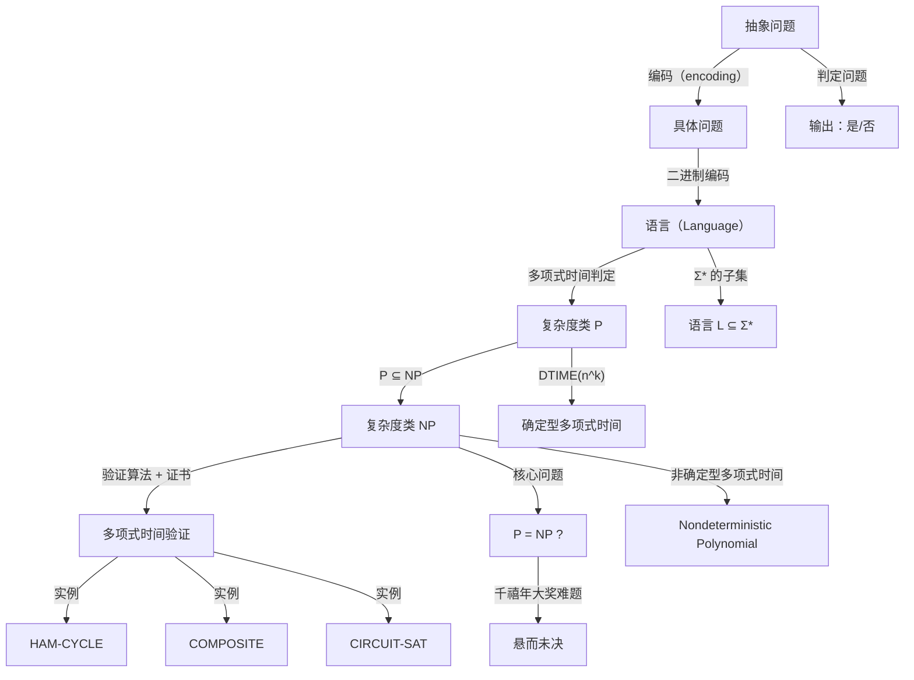

## 相关笔记
- 前置笔记：[[第33章_机器学习算法-章节汇总]]
- 关联概念：[[离散数学/concepts/算法复杂度]]、[[离散数学/concepts/大O记号]]、[[离散数学/concepts/算法]]、[[离散数学/concepts/可满足性]]、[[离散数学/concepts/布尔代数]]、[[离散数学/concepts/命题逻辑]]、[[离散数学/concepts/逻辑电路]]
- 章节汇总：[[第34章_NP完全性-章节汇总]]

> [!abstract] 概览
> 本节介绍计算复杂性理论（computational complexity theory）的两个核心概念：==多项式时间==（polynomial time）与==NP类==（NP class）。首先，我们建立抽象问题（abstract problem）到具体问题（concrete problem）的编码框架，定义==多项式时间算法==（polynomial-time algorithm），并论证多项式时间在不同计算模型上的==鲁棒性==（robustness）。在此基础上，我们定义复杂度类 ==$\mathbf{P}$==——所有能在多项式时间内求解的判定问题（decision problem）的集合。随后，我们引入==验证算法==（verification algorithm）的概念，通过"证书"（certificate）来验证给定解的正确性，并定义复杂度类 ==$\mathbf{NP}$==——所有能在多项式时间内被验证的判定问题的集合。最后，我们讨论 $\mathbf{P}$ 与 $\mathbf{NP}$ 之间的关系，以及这一关系所蕴含的深刻计算意义。



## 核心思想

### 34.1 多项式时间

#### 从抽象问题到具体问题

计算复杂性理论的研究对象是==问题==（problem）。一个==抽象问题==（abstract problem）是一个从问题实例集合（instance set） $I$ 到解集合（solution set） $S$ 的二元关系 $Q \subseteq I \times S$。

例如，最短路径问题（shortest-path problem）中：
- 实例 $i \in I$：一个图 $G = (V, E)$ 和两个顶点 $u, v \in V$
- 解 $s \in S$：从 $u$ 到 $v$ 的一条最短路径的顶点序列

我们特别关注==判定问题==（decision problem）：解集合 $S = \{\text{是}, \text{否}\}$，即问题的答案只有"是"或"否"。例如：
- PATH 问题：给定图 $G$ 和顶点 $u, v$，是否存在从 $u$ 到 $v$ 的路径？
- HAM-CYCLE 问题：给定图 $G$，是否包含经过所有顶点恰好一次的回路？

为了在计算机上处理抽象问题，我们需要将实例编码为计算机可以处理的字符串。==编码==（encoding）是一个从实例集合 $I$ 到二进制字符串集合 $\{0, 1\}^*$ 的映射 $e: I \to \{0, 1\}^*$。

通过编码，每个抽象问题 $Q$ 对应一个==具体问题==（concrete problem）$Q_e$，它是一个从二进制字符串集合到 $\{\text{是}, \text{否}\}$ 的映射。具体问题可以等价地表示为一个==语言==（language）：

$$L_Q = \{x \in \{0, 1\}^* : Q_e(x) = \text{是}\}$$

即语言 $L_Q$ 是所有编码后答案为"是"的实例的集合。求解判定问题等价于判定一个给定的二进制字符串是否属于某个语言。

> [!tip] 编码方案的选择
> 编码方案的选择（如二进制、一进制、ASCII等）会影响实例的编码长度，但只要编码是"合理的"（reasonable encoding），即编码长度与实例中数值的对数成正比，那么多项式时间的性质不会因编码方案的改变而改变。

#### 多项式时间算法的定义

==多项式时间算法==（polynomial-time algorithm）是指在输入规模为 $n$ 的最坏情况下，运行时间为 $O(n^k)$ 的算法，其中 $k$ 为某个常数。

输入规模（input size）的度量取决于具体问题：
- 对于图问题，输入规模通常是顶点数 $|V|$ 和边数 $|E|$
- 对于数值问题，输入规模通常是数值的二进制编码位数
- 对于字符串问题，输入规模通常是字符串的长度

我们使用==大O记号==（big-O notation）来描述运行时间的上界。多项式时间算法的运行时间具有如下形式：

$$O(n^k) = O(1) + O(n) + O(n^2) + O(n^3) + \cdots$$

常见的多项式时间复杂度包括：$O(1)$（常数时间）、$O(\log n)$（对数时间）、$O(n)$（线性时间）、$O(n \log n)$（线性对数时间）、$O(n^2)$（平方时间）、$O(n^3)$（立方时间）。

> [!tip] 为什么选择多项式时间
> 多项式时间被视为"高效算法"的合理标准，原因有三：(1) 多项式具有闭合性——多项式的多项式仍是多项式；(2) 多项式时间与具体计算机模型无关（鲁棒性）；(3) 实践中，多项式时间算法通常能在可接受的时间内解决实际问题。

【多项式时间的闭合性详解】多项式时间之所以成为复杂度理论的基石，一个重要原因是多项式函数在加法、乘法和复合运算下具有闭合性：

1. **多项式的加法闭合**：若 $f(n) = O(n^{k_1})$ 且 $g(n) = O(n^{k_2})$，则 $f(n) + g(n) = O(n^{\max(k_1, k_2)})$，仍然是多项式。这意味着两个多项式时间算法的串联（先执行 $A$，再执行 $B$）仍然是多项式时间。

2. **多项式的乘法闭合**：若 $f(n) = O(n^{k_1})$ 且 $g(n) = O(n^{k_2})$，则 $f(n) \times g(n) = O(n^{k_1 + k_2})$，仍然是多项式。这意味着两个多项式时间算法的嵌套（循环调用）仍然是多项式时间。

3. **多项式的复合闭合**：若 $f(n) = O(n^{k_1})$ 且 $g(n) = O(n^{k_2})$，则 $f(g(n)) = O((n^{k_2})^{k_1}) = O(n^{k_1 k_2})$，仍然是多项式。这意味着将多项式时间算法的输出作为另一个多项式时间算法的输入，整个过程仍然是多项式时间。

这一闭合性保证了：由多项式时间算法组合而成的复杂算法仍然是多项式时间的，不会因为组合而"跳出"多项式时间类。相比之下，指数时间不具备这一性质——两个指数时间算法的组合可能导致双指数时间。

#### 多项式时间的鲁棒性

多项式时间的一个关键性质是其==鲁棒性==（robustness）：在多种合理的计算模型上，多项式时间的定义保持一致。这意味着，如果一个问题在某一种计算模型上有多项式时间算法，那么在其他合理的计算模型上也存在多项式时间算法。

【鲁棒性的具体论证】考虑以下计算模型之间的多项式时间等价性：

1. **单带图灵机（single-tape Turing machine）与多带图灵机（multi-tape Turing machine）**：一个在多带图灵机上以 $O(n^k)$ 时间运行的算法，可以在单带图灵机上以 $O(n^{2k})$ 时间模拟。因为 $O(n^{2k})$ 仍然是多项式，所以多项式时间在这两种模型上是等价的。

2. **图灵机与随机访问机（Random Access Machine, RAM）**：RAM 是更接近实际计算机的计算模型，支持对内存的随机访问。图灵机模拟 RAM 操作的额外开销至多是多项式的，因此多项式时间在这两种模型上也是等价的。

3. **不同编码方案之间的等价性**：如果一种编码方案将实例编码为长度为 $n$ 的字符串，另一种"合理的"编码方案将同一实例编码为长度为 $n'$ 的字符串，则 $n' = O(n)$ 且 $n = O(n')$。因此，多项式时间不依赖于编码方案的具体选择。

> [!tip] 鲁棒性的意义
> 鲁棒性保证了复杂度类 P 的定义不依赖于具体的计算模型或编码方案，这使得 P 成为一个稳健的、有意义的复杂度类。

#### 复杂度类 P

==复杂度类 $\mathbf{P}$==（complexity class P）定义为所有能在多项式时间内被确定型图灵机（deterministic Turing machine）判定的语言的集合：

$$\mathbf{P} = \{L \subseteq \{0, 1\}^* : \text{存在确定型图灵机 } M \text{ 和常数 } k, \text{ 使得 } M \text{ 在 } O(n^k) \text{ 时间内判定 } L\}$$

等价地说，$\mathbf{P}$ 是所有存在多项式时间算法的判定问题的集合。

【$\mathbf{P}$ 类的形式化定义细节】设 $L$ 为一个语言。如果存在一个确定型图灵机 $M$ 和一个常数 $k \geq 0$，使得对于所有长度为 $n$ 的输入字符串 $x$：
- 若 $x \in L$，则 $M$ 在最多 $O(n^k)$ 步内接受 $x$
- 若 $x \notin L$，则 $M$ 在最多 $O(n^k)$ 步内拒绝 $x$

则称 $L \in \mathbf{P}$。

$\mathbf{P}$ 类中的典型问题包括：
- **排序问题**：$O(n \log n)$ 时间
- **最短路径问题**：Dijkstra 算法，$O(V^2)$ 或 $O(E + V \log V)$ 时间
- **最小生成树问题**：Prim 算法或 Kruskal 算法，$O(E \log V)$ 时间
- **最大流问题**：Ford-Fulkerson 方法的 Edmonds-Karp 实现，$O(VE^2)$ 时间
- **字符串匹配问题**：KMP 算法，$O(n + m)$ 时间

> [!tip] P 类的闭合性质
> P 类在多种运算下是闭合的（closed under）：如果 L_1, L_2 属于 P，则 L_1 与 L_2 的并集属于 P、交集属于 P、L_1 的补集属于 P、L_1 与 L_2 的连接属于 P。这些闭合性质是 P 作为复杂度类的基本结构特征。

### 34.2 NP类与验证算法

#### 验证算法

许多问题虽然难以在多项式时间内求解，但给定一个"候选解"，可以在多项式时间内验证该候选解是否正确。这一观察引出了==验证算法==（verification algorithm）的概念。

==验证算法==是一个两参数算法 $V$，其中：
- 第一个参数是问题描述的编码字符串 $x$
- 第二个参数是一个==证书==（certificate）或==见证==（witness）$y$，即候选解的编码

验证算法 $V$ 满足：
- 对于任意字符串 $x$，如果存在某个证书 $y$ 使得 $V(x, y) = \text{是}$，则 $x$ 的答案为"是"
- 对于任意字符串 $x$，如果 $x$ 的答案为"是"，则存在某个证书 $y$ 使得 $V(x, y) = \text{是}$

用形式化语言表达：语言 $L$ 的验证算法 $V$ 满足：

$$L = \{x \in \{0, 1\}^* : \text{存在证书 } y \text{ 使得 } V(x, y) = \text{是}\}$$

> [!tip] 证书的含义
> 证书是"答案正确性的证据"。验证算法不负责找到答案，只负责检查给定的证据是否确实证明了答案是"是"。类比：验证一道数学证明题时，证书就是完整的证明过程——检查证明是否正确通常比找到证明容易得多。

#### NP类的形式化定义

==复杂度类 $\mathbf{NP}$==（complexity class NP）定义为所有能在多项式时间内被验证的判定问题的集合：

$$\mathbf{NP} = \{L \subseteq \{0, 1\}^* : \text{存在多项式时间算法 } V \text{ 和多项式 } p, \text{ 使得 } L = \{x : \text{存在 } y, |y| \leq p(|x|), V(x, y) = \text{是}\}\}$$

【$\mathbf{NP}$ 定义的关键约束】
- **证书长度约束**：证书 $y$ 的长度 $|y|$ 必须不超过输入长度 $|x|$ 的某个多项式 $p(|x|)$。这一约束确保证书不会过长，使得验证过程无法在多项式时间内完成。
- **验证时间约束**：验证算法 $V$ 必须在 $|x| + |y|$ 的多项式时间内运行。由于 $|y| \leq p(|x|)$，这等价于要求 $V$ 在 $|x|$ 的多项式时间内运行。
- **存在性语义**：$\mathbf{NP}$ 中的"存在"是关键——只需存在某个证书使得验证通过，而不需要所有证书都通过验证。

> [!tip] NP 的名称来源
> NP 中的 "N" 代表 "Nondeterministic"（非确定型），"P" 代表 "Polynomial time"（多项式时间）。NP 可以等价地定义为：非确定型图灵机（nondeterministic Turing machine）在多项式时间内可以接受的所有语言的集合。非确定型图灵机在每一步可以"猜测"正确的转移，如果存在某个猜测序列导致接受状态，则输入被接受。这种"猜测"能力恰好对应于验证算法中"证书"的作用。

#### NP类的直观含义

$\mathbf{NP}$ 类的直观含义可以概括为一句话：==答案容易验证，但可能难以找到==。

考虑以下类比：
- **数独谜题**：给定一个已填好的数独网格，验证它是否满足数独规则（每行、每列、每个 $3 \times 3$ 宫格内数字 1-9 各出现恰好一次）非常容易，只需逐行、逐列、逐宫格检查即可。但要从空网格出发填出一个满足条件的解，则困难得多。
- **拼图游戏**：给定一幅完整的拼图，检查所有碎片是否正确拼合很容易；但将一堆散乱的碎片拼成完整图案则非常耗时。

这种"验证容易、求解困难"的模式正是 $\mathbf{NP}$ 类问题的特征。

#### P 与 NP 的关系

【$\mathbf{P} \subseteq \mathbf{NP}$ 的证明】$\mathbf{P} \subseteq \mathbf{NP}$ 是一个已知结论，证明如下：

设 $L \in \mathbf{P}$，则存在多项式时间算法 $A$ 判定 $L$。构造验证算法 $V(x, y)$ 如下：忽略证书 $y$，直接运行 $A(x)$ 并返回其结果。

- 若 $x \in L$，则 $A(x) = \text{是}$，因此 $V(x, y) = \text{是}$（对任意 $y$）
- 若 $x \notin L$，则 $A(x) = \text{否}$，因此 $V(x, y) = \text{否}$（对任意 $y$）
- $V$ 的运行时间与 $A$ 相同，为多项式时间
- 证书 $y$ 可以是空字符串，长度为 0，满足多项式约束

因此 $L \in \mathbf{NP}$，得证 $\mathbf{P} \subseteq \mathbf{NP}$。

【$\mathbf{P} = \mathbf{NP}$ 问题】$\mathbf{P}$ 是否等于 $\mathbf{NP}$ 是计算机科学中最著名的未解决问题之一，也是克雷数学研究所（Clay Mathematics Institute）于 2000 年设立的七个==千禧年大奖难题==（Millennium Prize Problems）之一，悬赏 100 万美元。

- 如果 $\mathbf{P} = \mathbf{NP}$，则所有"容易验证"的问题都"容易求解"，这将深刻改变密码学、优化、人工智能等领域
- 如果 $\mathbf{P} \neq \mathbf{NP}$，则存在一些问题，其验证虽然容易，但求解本质上需要超过多项式的时间
- 目前，大多数计算机科学家倾向于相信 $\mathbf{P} \neq \mathbf{NP}$，但尚无人能给出严格证明

【$\mathbf{P} = \mathbf{NP}$ 的深远影响】如果 $\mathbf{P} = \mathbf{NP}$ 被证明，其影响将是革命性的：

1. **密码学的根基动摇**：现代密码学（如 RSA、ECC）的安全性建立在"某些问题容易验证但难以求解"的假设之上。如果 $\mathbf{P} = \mathbf{NP}$，则大整数分解、离散对数等问题都可以在多项式时间内求解，现有的大多数公钥密码系统将不再安全。

2. **优化问题的突破**：旅行商问题、装箱问题、调度问题等大量 NP 优化问题都将有多项式时间算法，物流、制造业、资源分配等领域的效率将大幅提升。

3. **人工智能的加速**：许多 AI 搜索问题（如定理证明、规划）本质上是 NP 问题。$\mathbf{P} = \mathbf{NP}$ 意味着这些问题的求解效率将获得质的飞跃。

4. **数学证明的自动化**：如果 $\mathbf{P} = \mathbf{NP}$，则寻找数学证明（可以形式化为 SAT 问题）可以在多项式时间内完成，数学研究的面貌将彻底改变。

【$\mathbf{P} \neq \mathbf{NP}$ 的证据】虽然 $\mathbf{P} \neq \mathbf{NP}$ 尚未被严格证明，但存在大量间接证据支持这一猜想：

1. **数十年的失败尝试**：自 1971 年以来，无数优秀的理论计算机科学家尝试证明 $\mathbf{P} = \mathbf{NP}$ 或 $\mathbf{P} \neq \mathbf{NP}$，均未成功
2. **NP 完全问题的难度**：数千个 NP 完全问题经过数十年研究，没有找到多项式时间算法
3. **相对化障碍**：Baker-Gill-Solovay 定理（1975）表明，某些证明技术（如对角化）无法解决 $\mathbf{P}$ 与 $\mathbf{NP}$ 的问题
4. **自然证明障碍**：Razborov-Rudich 定理（1997）表明，某些常见的电路下界证明方法也无法解决这一问题

#### 实例：HAM-CYCLE 的 NP 验证

==哈密顿回路问题==（Hamiltonian Cycle Problem, HAM-CYCLE）是一个经典的 $\mathbf{NP}$ 问题。

**问题定义**：给定无向图 $G = (V, E)$，判断 $G$ 中是否存在一条经过所有顶点恰好一次的回路。

**验证算法**：
- 输入：图 $G$ 的编码 $x$，证书 $y$（一个顶点序列 $\langle v_1, v_2, \ldots, v_{|V|} \rangle$）
- 验证步骤：
  1. 检查证书中的顶点序列是否恰好包含 $V$ 中的每个顶点一次（无重复、无遗漏）
  2. 检查相邻顶点之间是否都有边相连：$(v_i, v_{i+1}) \in E$（$1 \leq i < |V|$）
  3. 检查最后一条边：$(v_{|V|}, v_1) \in E$
- 若以上检查全部通过，返回"是"；否则返回"否"

【验证复杂度分析】设 $|V| = n$，则：
- 步骤 1 需要 $O(n)$ 时间（检查每个顶点是否恰好出现一次）
- 步骤 2 需要 $O(n)$ 时间（检查 $n$ 条边）
- 步骤 3 需要 $O(1)$ 时间
- 总验证时间为 $O(n)$，是多项式时间

因此 HAM-CYCLE $\in \mathbf{NP}$。

【HAM-CYCLE 验证的具体实例】考虑一个简单的图 $G = (V, E)$，其中 $V = \{a, b, c, d\}$，$E = \{(a,b), (b,c), (c,d), (d,a), (a,c)\}$。

给定证书 $y = \langle a, b, c, d \rangle$，验证过程如下：
1. 检查顶点覆盖：$\{a, b, c, d\}$ 恰好包含 $V$ 中每个顶点一次 ✓
2. 检查相邻边：$(a,b) \in E$ ✓，$(b,c) \in E$ ✓，$(c,d) \in E$ ✓
3. 检查闭合边：$(d,a) \in E$ ✓
4. 所有检查通过，返回"是"

给定证书 $y' = \langle a, c, d, b \rangle$，验证过程如下：
1. 检查顶点覆盖：$\{a, c, d, b\}$ 恰好包含 $V$ 中每个顶点一次 ✓
2. 检查相邻边：$(a,c) \in E$ ✓，$(c,d) \in E$ ✓，$(d,b) \notin E$ ✗
3. 检查失败，返回"否"

注意：即使 $y'$ 不是合法的哈密顿回路，这并不意味着 $G$ 中不存在哈密顿回路——上面的 $y$ 就是一个合法的证书。验证算法只需要对给定的证书做出正确判断。

> [!tip] HAM-CYCLE 与 TSP 的关系
> 旅行商问题（Traveling Salesman Problem, TSP）的判定版本与 HAM-CYCLE 密切相关。TSP 问的是：给定完全图和边权，是否存在总权重不超过 k 的哈密顿回路？TSP 的判定版本同样是 NP 的——证书是路径序列，验证只需检查路径的合法性并计算总权重。

#### 实例：COMPOSITE 的 NP 验证

==合数判定问题==（Composite Problem, COMPOSITE）判断一个给定的正整数是否为合数。

**问题定义**：给定正整数 $x$，判断 $x$ 是否为合数（即 $x$ 是否可以表示为两个大于 1 的整数之积）。

**验证算法**：
- 输入：整数 $x$ 的二进制编码，证书 $y$（一个因数 $p$ 的编码，$1 < p < x$）
- 验证步骤：
  1. 检查 $1 < p < x$
  2. 检查 $p$ 是否整除 $x$（即 $x \bmod p = 0$）
- 若以上检查全部通过，返回"是"；否则返回"否"

【验证复杂度分析】设 $x$ 的二进制编码长度为 $n$，则 $x < 2^n$。
- 步骤 1 需要 $O(n)$ 时间（比较两个 $n$ 位二进制数）
- 步骤 2 的除法运算可以在 $O(n^2)$ 时间内完成（使用长除法）
- 总验证时间为 $O(n^2)$，是多项式时间

因此 COMPOSITE $\in \mathbf{NP}$。

【COMPOSITE 验证的具体实例】考虑 $x = 15$，其二进制编码为 $1111$（长度 $n = 4$）。

给定证书 $y = 5$（二进制 $101$），验证过程如下：
1. 检查 $1 < 5 < 15$ ✓
2. 计算 $15 \bmod 5 = 0$ ✓
3. 所有检查通过，返回"是"——15 确实是合数（$15 = 3 \times 5$）

考虑 $x = 17$（素数），给定任意证书 $y$（如 $y = 3$），验证过程如下：
1. 检查 $1 < 3 < 17$ ✓
2. 计算 $17 \bmod 3 = 2 \neq 0$ ✗
3. 检查失败，返回"否"

对于素数 $x = 17$，不存在任何满足条件的证书 $y$（因为素数没有大于 1 且小于自身的因数），因此验证算法对所有证书都返回"否"，正确地判定 17 不是合数。

> [!tip] COMPOSITE 实际上属于 P
> 2002 年，Agrawal、Kayal 和 Saxena 发明了 AKS 素性测试算法，证明了 COMPOSITE 属于 P。这意味着合数判定问题不仅可以在多项式时间内验证，也可以在多项式时间内直接求解。COMPOSITE 属于 P 且属于 NP 是 P 与 NP 关系的一个具体例证：一个问题同时属于 P 和 NP 并不矛盾。

#### 非确定型图灵机与 NP 的等价定义

为了更深入地理解 $\mathbf{NP}$，我们需要引入==非确定型图灵机==（nondeterministic Turing machine）的概念。

一台非确定型图灵机 $N$ 与确定型图灵机的区别在于其转移函数（transition function）。确定型图灵机在每一步只有一个可能的转移，而非确定型图灵机在每一步可以有多个可能的转移，机器可以"同时"沿所有可能的转移路径执行。

【非确定型图灵机的形式化定义】一台非确定型图灵机 $N$ 由以下要素组成：
- 一个有限的状态集合 $Q$
- 一个有限的带字母表 $\Gamma$
- 一个转移关系 $\delta: Q \times \Gamma \to \mathcal{P}(Q \times \Gamma \times \{L, R\})$

其中 $\mathcal{P}(S)$ 表示集合 $S$ 的幂集（power set），即所有子集的集合。转移关系 $\delta$ 允许从当前状态和当前符号出发，转移到多个可能的下一状态。

非确定型图灵机 $N$ **接受**输入 $x$，当且仅当存在至少一条计算路径（computation path）使得 $N$ 从初始配置出发，最终到达接受状态。

【$\mathbf{NP}$ 的非确定型定义】$\mathbf{NP}$ 可以等价地定义为：

$$\mathbf{NP} = \{L \subseteq \{0, 1\}^* : \text{存在非确定型图灵机 } N \text{ 和常数 } k, \text{ 使得 } N \text{ 在 } O(n^k) \text{ 时间内接受 } L\}$$

【两种定义的等价性论证】验证算法定义与非确定型图灵机定义之间的等价性可以通过以下对应关系建立：

1. **从验证算法到非确定型图灵机**：给定验证算法 $V(x, y)$，构造非确定型图灵机 $N$ 如下：对于输入 $x$，$N$ 非确定性地"猜测"一个证书 $y$（在每一步猜测 $y$ 的一个比特），然后运行 $V(x, y)$。如果 $V(x, y) = \text{是}$，则 $N$ 接受。由于 $|y| \leq p(|x|)$ 且 $V$ 在多项式时间内运行，$N$ 的总运行时间也是多项式的。

2. **从非确定型图灵机到验证算法**：给定非确定型图灵机 $N$，构造验证算法 $V(x, y)$ 如下：证书 $y$ 编码了 $N$ 在每一步所做的非确定性选择（即选择了哪条转移路径）。$V$ 模拟 $N$ 按照 $y$ 指定的选择执行，如果 $N$ 接受，则 $V$ 返回"是"。由于 $N$ 在多项式时间内运行，证书长度和验证时间都是多项式的。

> [!tip] 非确定性的直观理解
> 非确定型图灵机的"猜测"能力可以用一个形象的类比来理解：想象你在迷宫中寻找出口，确定型图灵机只能一条路一条路地尝试（回溯搜索），而非确定型图灵机可以在每个岔路口"分身"，同时探索所有可能的路径。只要有一条路径通向出口，非确定型图灵机就能找到。当然，这只是概念上的类比，实际的非确定型图灵机并不是真正地并行计算，而是通过"存在一条接受路径"的语义来定义接受。

#### NP 类中的其他重要问题

除了 HAM-CYCLE 和 COMPOSITE 之外，$\mathbf{NP}$ 类还包含许多重要的计算问题：

1. **可满足性问题**（Satisfiability Problem, SAT）：给定一个布尔公式，判断是否存在使其为真的赋值。证书是一个真值赋值。

2. **电路可满足性问题**（Circuit-Satisfiability Problem, CIRCUIT-SAT）：给定一个由逻辑门组成的布尔电路，判断是否存在一组输入使电路输出为 1。证书是输入向量的赋值。

3. **子集和问题**（Subset-Sum Problem）：给定一个整数集合 $S$ 和目标值 $t$，判断 $S$ 中是否存在一个子集，其元素之和恰好为 $t$。证书是满足条件的子集。

4. **图的着色问题**（Graph Coloring Problem）：给定图 $G$ 和整数 $k$，判断是否可以用 $k$ 种颜色对 $G$ 的顶点着色，使得相邻顶点颜色不同。证书是一种合法的着色方案。

5. **团问题**（Clique Problem）：给定图 $G$ 和整数 $k$，判断 $G$ 中是否存在大小为 $k$ 的完全子图（团）。证书是构成团的 $k$ 个顶点的集合。

> [!tip] NP 问题的共同特征
> 所有 NP 问题都共享一个结构特征：存在一个"短证书"（多项式长度），使得给定证书后，可以在多项式时间内验证答案的正确性。这一特征是理解 NP 类的关键。

### 复杂度类的层次关系

为了更全面地理解 $\mathbf{P}$ 和 $\mathbf{NP}$ 在计算复杂性理论中的位置，我们需要了解其他相关的复杂度类及其层次关系。

#### co-NP 类

==co-NP 类==（complement of NP）定义为 $\mathbf{NP}$ 中所有语言的补集：

$$\text{co-NP} = \{L \subseteq \{0, 1\}^* : \overline{L} \in \mathbf{NP}\}$$

co-NP 中的问题具有这样的特征：如果答案为"否"，则存在一个多项式长度的"反证书"（counter-certificate）可以在多项式时间内验证。

【co-NP 的直观含义】考虑命题逻辑中的==永真性问题==（Validity Problem, VALIDITY）：给定一个布尔公式 $\phi$，判断 $\phi$ 是否对**所有**可能的赋值都为真。这个问题属于 co-NP，因为：
- 如果 $\phi$ 不是永真的（答案为"否"），则存在一个使 $\phi$ 为假的赋值——这个赋值就是"反证书"
- 给定反证书，可以在多项式时间内验证 $\phi$ 在该赋值下确实为假

【$\mathbf{NP}$ 与 co-NP 的关系】目前已知：
- $\mathbf{P} \subseteq \mathbf{NP} \cap \text{co-NP}$（因为 $\mathbf{P}$ 在补运算下闭合）
- $\mathbf{NP} = \text{co-NP}$ 是否成立是一个未解决的开放问题
- 如果 $\mathbf{NP} \neq \text{co-NP}$，则存在一些问题，其"是"实例和"否"实例具有不对称的验证难度

> [!tip] NP ∩ co-NP 中的问题
> 有些问题同时属于 NP 和 co-NP，例如合数判定问题 COMPOSITE：COMPOSITE 属于 NP（因数作为证书），同时 COMPOSITE 属于 co-NP（因为素性可以在多项式时间内验证——Pratt 证书提供了素数的简短证明）。这类问题通常被认为不太可能是 NP 完全的。

#### EXPTIME 与更高级的复杂度类

==EXPTIME 类==（exponential time class）是所有能在确定型图灵机上以 $O(2^{n^k})$ 时间（$k$ 为常数）判定的语言的集合。

根据时间层次定理，我们有以下严格的包含关系：

$$\mathbf{P} \subseteq \mathbf{NP} \subseteq \text{EXPTIME}$$

并且 $\mathbf{P} \subsetneq \text{EXPTIME}$（严格包含，由时间层次定理保证）。然而，$\mathbf{P} \subsetneq \mathbf{NP}$ 和 $\mathbf{NP} \subsetneq \text{EXPTIME}$ 都尚未被证明。

#### 复杂度类层次总览

以下表格总结了本节涉及的主要复杂度类：

| 复杂度类 | 定义 | 直观含义 | 已知关系 |
|:---:|:---|:---|:---|
| $\mathbf{P}$ | 确定型多项式时间可判定 | "容易求解"的问题 | $\mathbf{P} \subseteq \mathbf{NP}$ |
| $\mathbf{NP}$ | 多项式时间可验证（或非确定型多项式时间可接受） | "容易验证"的问题 | $\mathbf{P} \subseteq \mathbf{NP} \subseteq \text{EXPTIME}$ |
| co-NP | NP 的补类 | "否"实例容易验证的问题 | $\mathbf{P} \subseteq \text{co-NP}$ |
| EXPTIME | 确定型指数时间可判定 | 指数时间内可求解的问题 | $\mathbf{NP} \subseteq \text{EXPTIME}$ |

> [!tip] 复杂度类的"全景图"
> 计算复杂性理论中存在一个丰富的复杂度类层次结构，包括 L（对数空间）、NL（非确定型对数空间）、P、NP、PSPACE（多项式空间）、EXPTIME 等。其中 L ⊆ NL ⊆ P ⊆ NP ⊆ PSPACE ⊆ EXPTIME，且由空间层次定理可知 NL 严格包含于 PSPACE，PSPACE 严格包含于 EXPTIME。这些层次关系中的许多严格包含性问题仍然悬而未决。

## 补充理解

> [!info] P vs NP：千禧年大奖难题
> P vs NP 问题被克雷数学研究所（Clay Mathematics Institute）列为七个千禧年大奖难题之一，悬赏 100 万美元。该问题问的是：如果一个问题可以在多项式时间内验证其解的正确性，是否也可以在多项式时间内找到解？这个问题自 1971 年 Stephen Cook 和 Leonid Levin 独立提出以来，至今悬而未决。尽管大量研究致力于此，目前既没有人证明 $\mathbf{P} = \mathbf{NP}$，也没有人证明 $\mathbf{P} \neq \mathbf{NP}$。该问题的解决将对密码学、优化、人工智能、生物学等众多领域产生深远影响。
> 参考：https://www.claymath.org/millennium-problems/

> [!info] 时间层次定理
> 时间层次定理（Time Hierarchy Theorem）是计算复杂性理论中的一个基本结果，它建立了不同时间界限之间的严格层次关系。具体而言，如果 $f(n)$ 和 $g(n)$ 是时间可构造函数（time-constructible function），且 $f(n) \log f(n) = o(g(n))$，则 $\text{DTIME}(f(n)) \subsetneq \text{DTIME}(g(n))$。这意味着存在一些计算问题，可以在 $g(n)$ 时间内解决，但不能在 $f(n)$ 时间内解决。时间层次定理为理解计算能力的界限提供了理论基础，也暗示了 $\mathbf{P}$ 严格包含于 $\text{EXPTIME}$（指数时间类）。
> 参考：https://www.endlesswiki.com/wiki/Time_Hierarchy_Theorem

> [!info] Cook-Levin 定理与 NP 完全性的起源
> 1971 年，Stephen Cook 和 Leonid Levin 各自独立证明了可满足性问题（SAT）是 $\mathbf{NP}$ 完全的，这一结果被称为 Cook-Levin 定理。这是 NP 完全性理论的奠基性结果，它证明了 SAT 是 $\mathbf{NP}$ 中"最难"的问题之一：如果 SAT 可以在多项式时间内求解，则 $\mathbf{NP}$ 中的所有问题都可以在多项式时间内求解。1972 年，Richard Karp 发表了具有里程碑意义的论文，证明了 21 个重要的组合优化问题都是 NP 完全的，极大地扩展了 NP 完全性的适用范围，确立了这一理论在计算机科学中的核心地位。
> 参考：http://www.emis.mi.sanu.ac.rs/EMIS/journals/DMJDMV/vol-ismp/50_johnson-david.pdf

> [!info] 交互式证明与 PCP 定理
> 交互式证明系统（Interactive Proof System, IP）是 $\mathbf{NP}$ 验证概念的推广：一个验证者（verifier）与一个全能的证明者（prover）进行多轮交互，验证者通过随机抛硬币和多项式时间的计算来判断输入是否属于语言。IP 类与 $\mathbf{NP}$ 的关系由 Shamir 定理揭示：$\text{IP} = \text{PSPACE}$，这是一个令人惊讶的结果。进一步地，PCP 定理（Probabilistically Checkable Proof Theorem）表明，$\mathbf{NP}$ 中的每个语言都有一个概率可检查证明：验证者只需读取证明中常数个随机位置，就能以高概率判断证明的正确性。PCP 定理在近似算法的不可近似性研究中发挥了核心作用。
> 参考：https://users.cms.caltech.edu/~vidick/teaching/286_qPCP/lecture1.pdf

## 易混淆点

> [!warning] NP 不代表 "Non-Polynomial"
> NP 中的 "N" 代表 "Nondeterministic"（非确定型），而非 "Non-Polynomial"（非多项式）。NP 是 "Nondeterministic Polynomial time" 的缩写，指的是非确定型图灵机在多项式时间内可以接受的语言类。许多初学者误以为 NP 代表"不能在多项式时间内求解的问题"，这是一个常见的误解。事实上，$\mathbf{P} \subseteq \mathbf{NP}$，所以所有多项式时间可解的问题也属于 NP。

> [!warning] P ⊆ NP 是已知的，但 P ≠ NP 尚未被证明
> $\mathbf{P} \subseteq \mathbf{NP}$ 是一个已被严格证明的结论（见上文证明）。然而，$\mathbf{P} \neq \mathbf{NP}$ 仍然是一个未被证明的猜想。虽然大多数计算机科学家相信 $\mathbf{P} \neq \mathbf{NP}$，但这一信念并非基于严格的数学证明。在讨论 P 与 NP 的关系时，必须严格区分"已证明的结论"和"广泛接受的猜想"，不能将 $\mathbf{P} \neq \mathbf{NP}$ 当作已知事实来使用。

> [!warning] 验证算法不是求解算法
> 验证算法（verification algorithm）和求解算法（solving algorithm）是两个不同的概念。验证算法需要额外的输入——证书（certificate），它只负责检查给定的证书是否正确，而不负责找到证书。一个问题属于 $\mathbf{NP}$ 只意味着存在多项式时间的验证算法，并不自动意味着存在多项式时间的求解算法。如果 $\mathbf{P} \neq \mathbf{NP}$，则存在一些 $\mathbf{NP}$ 问题没有多项式时间的求解算法。

## 习题精选

| 题号 | 题目描述 | 核心考点 |
|:---:|:---|:---|
| 34.1-1 | 定义最优化问题（optimization problem）和判定问题（decision problem）之间的关系 | 问题分类与归约 |
| 34.1-5 | 给出多项式时间算法判定一个图是否为二分图 | $\mathbf{P}$ 类算法设计 |
| 34.1-6 | 证明 $\mathbf{P}$ 在补运算下是闭合的 | $\mathbf{P}$ 类的闭合性质 |
| 34.2-1 | 考虑语言 GRAPH-ISOMORPHISM，证明其属于 $\mathbf{NP}$ | $\mathbf{NP}$ 类的验证算法构造 |

> [!faq]- 习题 34.1-1：最优化问题与判定问题的关系
> **题目**：定义最优化问题（optimization problem）和判定问题（decision problem）之间的关系。
>
> **解题思路**：最优化问题寻求"最优解"（如最短路径、最小代价），而判定问题只问"是否存在满足条件的解"（如是否存在长度不超过 $k$ 的路径）。它们之间的关系是：判定问题通常是最优化问题的"判定版本"。
>
> **标准答案**：
> 设最优化问题为：在所有可行解中找到使目标函数最优的解。其对应的判定问题为：给定一个阈值 $k$，判断是否存在目标函数值不超过（或至少为）$k$ 的可行解。
>
> 关系：
> 1. 判定问题不比最优化问题更难：如果我们能求解最优化问题（找到最优值 $opt$），则只需比较 $opt$ 与 $k$ 即可回答判定问题
> 2. 判定问题可以帮助求解最优化问题：通过二分搜索（binary search）对 $k$ 的值进行 $O(\log M)$ 次判定查询（$M$ 为目标值的范围），可以找到最优值
> 3. 在多项式时间归约的意义下，最优化问题与判定问题通常是多项式等价的

> [!faq]- 习题 34.1-5：二分图判定的多项式时间算法
> **题目**：给出一个多项式时间算法来判定一个无向图 $G = (V, E)$ 是否为二分图。
>
> **解题思路**：二分图（bipartite graph）的判定等价于检查图是否可以被 2-着色。可以使用广度优先搜索（BFS）或深度优先搜索（DFS）进行 2-着色尝试。
>
> **标准答案**：
> 算法 BIPARTITE($G$)：
> 1. 对每个顶点 $u \in V$，若 $u$ 尚未被着色：
>    a. 将 $u$ 着色为颜色 1
>    b. 使用 BFS 从 $u$ 出发遍历所有可达的未着色顶点
>    c. 对于 BFS 中访问的每条边 $(u, v)$：
>       - 若 $v$ 未着色，将 $v$ 着色为与 $u$ 不同的颜色
>       - 若 $v$ 已着色且颜色与 $u$ 相同，返回"不是二分图"
> 2. 若所有顶点处理完毕且未发现冲突，返回"是二分图"
>
> 复杂度分析：BFS 的时间复杂度为 $O(V + E)$，对每个连通分量执行一次 BFS，总时间为 $O(V + E)$，是多项式时间。因此二分图判定 $\in \mathbf{P}$。

> [!faq]- 习题 34.1-6：证明 P 在补运算下闭合
> **题目**：证明 $\mathbf{P}$ 在补运算下是闭合的，即若 $L \in \mathbf{P}$，则 $\overline{L} \in \mathbf{P}$。
>
> **解题思路**：利用确定型图灵机的性质——如果能在多项式时间内判定 $L$，也能在多项式时间内判定 $\overline{L}$。
>
> **标准答案**：
> 设 $L \in \mathbf{P}$，则存在确定型图灵机 $M$ 和常数 $k$，使得 $M$ 在 $O(n^k)$ 时间内判定 $L$。
>
> 构造图灵机 $M'$ 如下：对于输入 $x$，$M'$ 运行 $M(x)$，然后：
> - 若 $M$ 接受 $x$，则 $M'$ 拒绝 $x$
> - 若 $M$ 拒绝 $x$，则 $M'$ 接受 $x$
>
> 分析：
> 1. $M'$ 的运行时间与 $M$ 相同，为 $O(n^k)$，因此是多项式时间
> 2. $x \in \overline{L} \Leftrightarrow x \notin L \Leftrightarrow M \text{ 拒绝 } x \Leftrightarrow M' \text{ 接受 } x$
> 3. 因此 $M'$ 在多项式时间内判定 $\overline{L}$，即 $\overline{L} \in \mathbf{P}$
>
> 得证 $\mathbf{P}$ 在补运算下闭合。
>
> 注意：这一性质依赖于图灵机的确定性和完备性（对每个输入都停机）。对于 $\mathbf{NP}$，是否在补运算下闭合（即 $\mathbf{NP} = \text{co-NP}$）是一个未解决的开放问题。

> [!faq]- 习题 34.2-1：证明 GRAPH-ISOMORPHISM ∈ NP
> **题目**：考虑语言 GRAPH-ISOMORPHISM $= \{\langle G_1, G_2 \rangle : G_1 \text{ 和 } G_2 \text{ 是同构图}\}$。证明 GRAPH-ISOMORPHISM $\in \mathbf{NP}$。
>
> **解题思路**：要证明一个语言属于 $\mathbf{NP}$，需要给出一个多项式时间的验证算法和对应的证书。
>
> **标准答案**：
> 构造验证算法 $V(\langle G_1, G_2 \rangle, y)$：
> - 输入：两个图 $G_1 = (V_1, E_1)$ 和 $G_2 = (V_2, E_2)$ 的编码，证书 $y$（一个从 $V_1$ 到 $V_2$ 的映射 $f: V_1 \to V_2$ 的编码）
> - 验证步骤：
>   1. 检查 $f$ 是否为双射（bijection）：$|V_1| = |V_2|$，且 $f$ 将 $V_1$ 中每个顶点映射到 $V_2$ 中不同的顶点
>   2. 检查 $f$ 保持边关系：对于每条边 $(u, v) \in E_1$，检查 $(f(u), f(v)) \in E_2$；对于每条边 $(u', v') \in E_2$，检查存在 $(u, v) \in E_1$ 使得 $f(u) = u'$ 且 $f(v) = v'$
> - 若以上检查全部通过，返回"是"；否则返回"否"
>
> 复杂度分析：设 $|V_1| = |V_2| = n$，$|E_1| = |E_2| = m$。
> - 步骤 1 需要 $O(n)$ 时间
> - 步骤 2 需要 $O(m)$ 时间（检查每条边的映射）
> - 总验证时间为 $O(n + m)$，是多项式时间
>
> 证书 $y$ 的长度为 $O(n \log n)$（$n$ 个顶点的映射，每个顶点的像用 $O(\log n)$ 位编码），满足多项式长度约束。
>
> 因此 GRAPH-ISOMORPHISM $\in \mathbf{NP}$。

## 视频学习指南

| 资源名称 | 讲者/来源 | 覆盖内容 | 时长 | 推荐指数 |
|:---|:---|:---|:---:|:---:|
| MIT 6.045/18.400: Automata, Computability, and Complexity | Michael Sipser (MIT OCW) | 计算复杂性理论、P 与 NP 的定义、NP 完全性 | 多讲 | ★★★★★ |
| UC Berkeley CS 172: Computability and Complexity | Christos Papadimitriou | 复杂度类、层次定理、NP 验证 | 多讲 | ★★★★☆ |
| P vs NP and the Computational Complexity Zoo | HackerDashery (YouTube) | P、NP、NP-Hard、NP-Complete 的直观解释 | ~20 分钟 | ★★★★☆ |
| 算法导论第34章精讲 | 各中文 MOOC 平台 | NP 完全性理论、Cook-Levin 定理、归约 | 多讲 | ★★★☆☆ |
| Complexity Theory Basics | Easy Theory (YouTube) | P、NP、co-NP、EXPTIME 等复杂度类入门 | 多讲 | ★★★★☆ |

## 教材原文

> [!quote] CLRS 第4版 第34章 原文摘录
> "We can informally define a **polynomial-time algorithm** as one whose worst-case running time is bounded above by a polynomial function of its input size."
>
> "The class **P** is the set of all languages that are decidable in polynomial time by a deterministic single-tape Turing machine."
>
> "A **verification algorithm** is a two-argument algorithm $A$, where one argument is an ordinary input string $x$ and the other is a binary string $y$ called a **certificate**."
>
> "The class **NP** is the set of all languages for which there exists a polynomial-time verification algorithm."
>
> "We can't prove that P ≠ NP, but we also can't prove that P = NP. This question is one of the greatest unsolved problems in computer science and indeed in all of mathematics."

### 教材原文解读

上述摘录中，有几个关键表述值得深入理解：

1. **"bounded above by a polynomial function"**：这里强调的是"上界"，即最坏情况下的运行时间不超过某个多项式。一个算法的实际运行时间可能远小于多项式上界，但只要存在一个多项式上界，该算法就是多项式时间的。

2. **"deterministic single-tape Turing machine"**：虽然 $\mathbf{P}$ 的定义基于单带确定型图灵机，但由于多项式时间的鲁棒性，这一定义等价于在多带图灵机、RAM 等其他合理计算模型上的定义。

3. **"two-argument algorithm"**：验证算法的两个参数分别对应问题描述和候选解（证书）。这种两参数结构是验证算法区别于普通求解算法的关键特征。

4. **"one of the greatest unsolved problems"**：P vs NP 问题的重要性不仅限于计算机科学。2000 年，Clay 数学研究所将其列为七个千禧年大奖难题之一，奖金 100 万美元，足见其在整个数学领域的地位。

### 本节知识脉络

本节的知识按照以下逻辑链条展开：

```
抽象问题 → 编码 → 具体问题 → 语言 → 多项式时间判定 → P 类
                                              ↓
                                    验证算法 + 证书 → NP 类
                                              ↓
                                    P ⊆ NP → P = NP ?
```

这一逻辑链条体现了计算复杂性理论的基本方法论：从抽象到具体（编码），从具体到形式化（语言），从形式化到分类（复杂度类），从分类到关系（包含与等价）。掌握这一方法论，有助于理解后续关于 NP 完全性、归约（reduction）等内容。

---

## 参见Wiki
- **章节导航**：[[第34章_NP完全性-章节汇总]]
- **前置知识**：[[离散数学/concepts/算法复杂度]] | [[离散数学/concepts/大O记号]] | [[离散数学/concepts/算法]]
- **后续内容**：[[第34章_NP完全性/34.2 NP完全性与归约]] | [[第34章_NP完全性/34.3 经典NP完全问题]]

#学习/算法导论/第34章-NP完全性 #学习/算法导论/NP完全性/多项式时间
