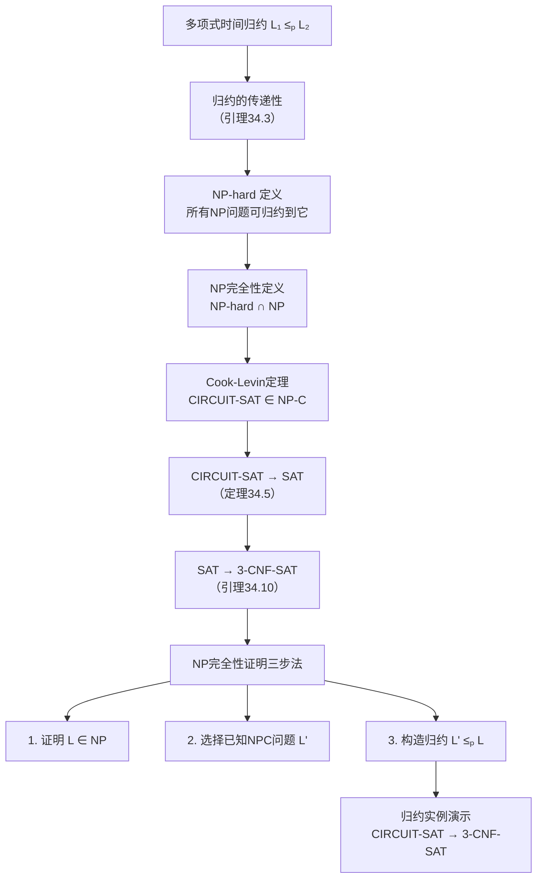
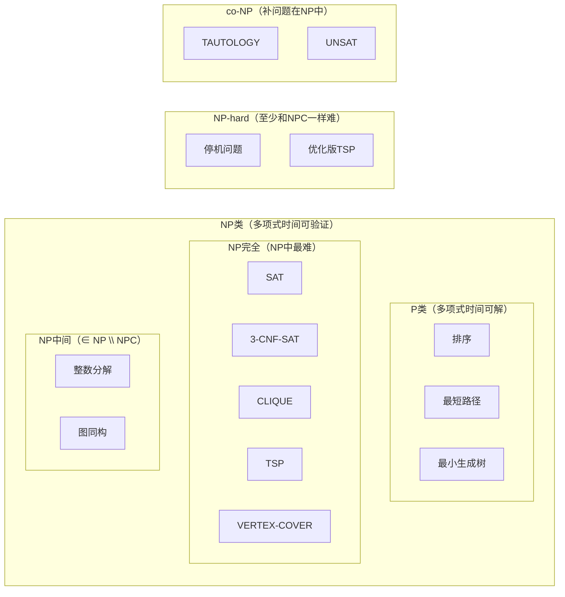

## 相关笔记
- 前置笔记：[[34.1 多项式时间与NP类]]、[[第33章_机器学习算法-章节汇总]]
- 关联概念：[[离散数学/concepts/可满足性]]、[[离散数学/concepts/布尔代数]]、[[离散数学/concepts/命题逻辑]]、[[离散数学/concepts/逻辑电路]]、[[离散数学/concepts/哈密顿路径]]、[[离散数学/concepts/图的着色]]
- 章节汇总：[[第34章_NP完全性-章节汇总]]

> [!abstract] 概览
> 本节系统阐述**NP完全性理论**的核心框架：通过**多项式时间归约**（polynomial-time reduction）建立问题之间的难度比较关系，定义**NP-hard**与**NP完全**（NP-complete）两个关键复杂性类，并介绍证明NP完全性的标准方法论。Cook-Levin定理确立了**CIRCUIT-SAT**作为"第一个"NP完全问题的地位，随后通过归约链将NP完全性传播到SAT、3-CNF-SAT等一系列经典问题。掌握归约的定义、传递性以及三步证明法，是理解计算复杂性理论基石的关键。



## 核心思想

### 34.3 多项式时间归约（Polynomial-Time Reduction）

#### 归约的直觉

在日常生活中，我们经常通过"转化"来解决新问题。比如，你不会直接计算一个复杂积分，而是先做一个变量替换，把它变成你已经会算的简单积分。**归约**正是这种思想在计算理论中的精确化：如果问题A可以"转化"为问题B，那么解决B的算法也能用来解决A。

形式化地说，归约让我们能够**比较问题的相对难度**。如果问题A可以归约到问题B，那么B至少和A一样难——因为任何能解决B的算法，配合归约过程，就能解决A。

#### 多项式时间归约的严格定义

**定义（多项式时间归约）**：设 $L_1$ 和 $L_2$ 是两个语言。如果存在一个多项式时间可计算的函数 $f: \{0,1\}^* \to \{0,1\}^*$，使得对所有 $x \in \{0,1\}^*$，有

$$x \in L_1 \iff f(x) \in L_2$$

则称 $L_1$ **多项式时间可归约**到 $L_2$，记为 $L_1 \le_p L_2$。函数 $f$ 称为**归约函数**。

让我们逐步拆解这个定义中的每个组成部分：

1. **函数 $f$ 的存在性**：归约的核心是一个变换函数，它把问题A的任意实例 $x$ 映射为问题B的某个实例 $f(x)$。
2. **多项式时间可计算**：计算 $f(x)$ 的时间必须是 $|x|$ 的多项式。这保证了归约本身不会引入过多的计算开销。
3. **保真性条件** $x \in L_1 \iff f(x) \in L_2$：这是归约的灵魂——$x$ 是"yes"实例当且仅当 $f(x)$ 也是"yes"实例。归约必须保持答案的正确性。

**直观理解**：$L_1 \le_p L_2$ 意味着"如果能高效解决 $L_2$，就能高效解决 $L_1$"。具体流程为：

```
给定 L₁ 的实例 x
    ↓ 计算 f(x)（多项式时间）
得到 L₂ 的实例 f(x)
    ↓ 用 L₂ 的算法求解
得到答案 → 即为 x 在 L₁ 中的答案
```

总时间 = 计算 $f(x)$ 的时间 + 求解 $L_2$ 的时间。如果 $L_2$ 有多项式时间算法，那么 $L_1$ 也有多项式时间算法。

#### 归约的传递性

**引理34.3（归约的传递性）**：如果 $L_1 \le_p L_2$ 且 $L_2 \le_p L_3$，则 $L_1 \le_p L_3$。

**证明**：

设 $f_1$ 是从 $L_1$ 到 $L_2$ 的多项式时间归约函数，$f_2$ 是从 $L_2$ 到 $L_3$ 的多项式时间归约函数。定义复合函数 $f(x) = f_2(f_1(x))$。我们需要验证 $f$ 满足归约的两个条件：

1. **保真性**：$x \in L_1 \iff f_1(x) \in L_2 \iff f_2(f_1(x)) \in L_3 \iff f(x) \in L_3$。这里第一步和第二步分别利用了 $f_1$ 和 $f_2$ 的保真性。

2. **多项式时间**：设 $|x| = n$，$f_1$ 的运行时间为 $O(n^{k_1})$，$f_2$ 的运行时间为 $O(m^{k_2})$，其中 $m = |f_1(x)|$。由于 $f_1$ 是多项式时间计算的，$m \leq c \cdot n^{k_1}$（输出长度不超过运行时间）。因此 $f_2(f_1(x))$ 的运行时间为 $O((c \cdot n^{k_1})^{k_2}) = O(n^{k_1 k_2})$，仍然是多项式的。$\blacksquare$

**传递性的意义**：归约的传递性使得我们可以建立**归约链**。一旦我们证明了 $A \le_p B$ 和 $B \le_p C$，就自动得到 $A \le_p C$，无需再单独证明。这正是NP完全性理论能够"批量"证明大量问题难度的数学基础。

#### NP-hard的定义

**定义（NP-hard）**：如果对于**每一个**语言 $L \in \text{NP}$，都有 $L \le_p L'$，则称语言 $L'$ 是**NP-hard**的。

这个定义的含义非常强大：NP-hard问题**至少和NP中任何一个问题一样难**。无论你从NP中挑出哪个问题，它都能被归约到这个NP-hard问题。

**生活类比**：想象NP-hard是一个"万能翻译器"——任何NP问题都可以被翻译成它的实例。如果你能高效解决这个NP-hard问题，你就能高效解决所有NP问题。

#### NP完全性的定义

**定义（NP完全性）**：如果语言 $L$ 同时满足以下两个条件，则称 $L$ 是**NP完全的**（NP-complete）：

1. $L \in \text{NP}$（$L$ 本身是一个NP问题）
2. $L$ 是NP-hard的（所有NP问题都可归约到 $L$）

NP完全问题就是NP类中**最难的问题**。它们既是NP问题（答案可以被高效验证），又是NP-hard问题（所有NP问题都可以归约到它们）。

**关键推论**：如果任何一个NP完全问题存在多项式时间算法，那么 $\text{P} = \text{NP}$。

**证明**：设 $L$ 是NP完全的，且 $L \in \text{P}$。对于任意 $L' \in \text{NP}$，由于 $L$ 是NP-hard的，存在多项式时间归约 $L' \le_p L$。将 $L$ 的多项式时间算法与归约函数组合，就得到 $L'$ 的多项式时间算法。因此 $\text{NP} \subseteq \text{P}$。又因为 $\text{P} \subseteq \text{NP}$ 是显然的，所以 $\text{P} = \text{NP}$。$\blacksquare$

这个推论解释了为什么NP完全性如此重要：**解决任何一个NP完全问题就等于解决了所有NP问题**。

#### Cook-Levin定理

**定理34.4（Cook-Levin定理）**：**CIRCUIT-SAT** 是NP完全的。

**CIRCUIT-SAT问题**：给定一个由与门（AND）、或门（OR）、非门（NOT）组成的布尔组合电路，判断是否存在一组输入赋值使得电路输出为1（即电路是否可满足）。

**证明思路**（分两部分）：

**第一部分：证明 CIRCUIT-SAT ∈ NP**

给定一个电路和一个候选的输入赋值，我们只需要将输入代入电路，逐门计算每个门的输出值，最终检查输出门的值是否为1。这个过程的时间与电路中门的数量成线性关系，因此是多项式时间的。验证算法如下：

```
验证算法：
输入：电路 C，候选赋值 a
1. 将 a 中的值赋给电路的输入线
2. 按拓扑序遍历电路中的每个门：
   - AND门：输出 = 所有输入的合取
   - OR门：输出 = 所有输入的析取
   - NOT门：输出 = 输入的否定
3. 检查输出门的值是否为1
4. 若为1则接受，否则拒绝
```

**第二部分：证明 CIRCUIT-SAT 是NP-hard的**

这是证明的核心。我们需要证明：对于**任意** $L \in \text{NP}$，存在多项式时间归约 $L \le_p \text{CIRCUIT-SAT}$。

由于 $L \in \text{NP}$，存在非确定型多项式时间图灵机 $M$ 和多项式 $p$，使得 $x \in L$ 当且仅当 $M$ 在输入 $x$ 上存在一条长度不超过 $p(|x|)$ 的接受计算路径。

关键思想是将 $M$ 在 $x$ 上的**整个计算过程编码为一个布尔电路**：

1. **计算格局（configuration）**：图灵机在每一步的完整状态可以用一个有限字符串表示，包括：磁带内容、磁头位置、当前状态。
2. **电路结构**：对于每一步 $i = 0, 1, \ldots, p(n)$，创建一组布尔变量来编码该步的格局。然后为每一步到下一步的转换创建一个子电路，验证转换是否合法。
3. **初始格局**：固定初始格局对应的变量值（输入 $x$、初始状态、磁头在起始位置）。
4. **接受条件**：最终格局的状态必须是接受状态。

整个电路的大小是 $O(p(n)^2)$（$p(n)$ 步，每步 $O(p(n))$ 个变量和门），因此构造时间是多项式的。

**保真性**：$M$ 接受 $x$ $\iff$ 存在一条接受路径 $\iff$ 电路存在满足的赋值（将非确定型选择编码为电路的自由变量）。$\blacksquare$

**Cook-Levin定理的历史意义**：1971年，Stephen Cook和独立地Leonid Levin证明了这一结果，奠定了NP完全性理论的基础。它表明NP完全问题确实存在，而且CIRCUIT-SAT就是第一个被发现的NP完全问题。

#### 归约的形式化讨论：Karp归约与图灵归约

CLRS中使用的归约是**Karp归约**（也称多一归约，many-one reduction），即通过一个多项式时间可计算的函数 $f$ 将一个问题的实例映射为另一个问题的实例。这是NP完全性理论中使用的标准归约类型。

另一种常见的归约是**图灵归约**（Turing reduction），它允许在解决目标问题的过程中多次调用"预言机"（oracle）来解决源问题。图灵归约比Karp归约更强（更一般），但在NP完全性证明中，我们通常使用Karp归约，因为它更简洁且足以建立NP-hard性。

**两种归约的区别**：

| 特性 | Karp归约（多一归约） | 图灵归约 |
|:---:|:---:|:---:|
| 调用次数 | 恰好1次 | 可以多次 |
| 计算模型 | 函数变换 | 预言机 |
| 符号 | $L_1 \le_p L_2$ | $L_1 \le_T L_2$ |
| NP完全性使用 | 是 | 否（用于NP-hard） |
| 强度 | 较弱 | 较强 |

在CLRS的NP完全性理论中，所有归约都是Karp归约。当说"归约"时，默认指多项式时间多一归约。

#### CIRCUIT-SAT → SAT 的归约

**定理34.5**：$\text{CIRCUIT-SAT} \le_p \text{SAT}$。

**SAT问题**：给定一个布尔公式（由变量、AND、OR、NOT和括号组成），判断是否存在一组变量赋值使公式为真。

**归约构造**：

给定一个电路 $C$，我们需要构造一个布尔公式 $\phi$，使得 $C$ 可满足当且仅当 $\phi$ 可满足。

1. **为每条线引入变量**：电路 $C$ 中有若干条线（输入线、门输出线、最终输出线）。为每条线 $l$ 引入一个布尔变量 $x_l$。
2. **为每个门添加约束子句**：
   - **AND门**（输出线 $l$，输入线 $a, b$）：添加约束 $x_l \leftrightarrow (x_a \wedge x_b)$
   - **OR门**（输出线 $l$，输入线 $a, b$）：添加约束 $x_l \leftrightarrow (x_a \vee x_b)$
   - **NOT门**（输出线 $l$，输入线 $a$）：添加约束 $x_l \leftrightarrow \neg x_a$
3. **添加输出约束**：$\phi$ 中还包含子句 $x_{\text{out}}$（要求输出线的值为1）。

公式 $\phi$ 就是所有约束的合取。电路 $C$ 可满足（存在使输出为1的输入赋值）当且仅当 $\phi$ 可满足（存在使所有约束同时满足的变量赋值）。

**多项式时间性**：每个门贡献常数个约束，每个约束的大小是常数，因此 $\phi$ 的大小与电路的大小成线性关系。构造时间是多项式的。$\blacksquare$

**推论**：SAT也是NP完全的。

**证明**：SAT ∈ NP 是显然的（给定赋值，直接代入公式求值即可验证）。又因为 CIRCUIT-SAT ≤_p SAT 且 CIRCUIT-SAT 是NP-hard的，由归约的传递性，SAT也是NP-hard的。因此 SAT 是NP完全的。$\blacksquare$

#### NP完全性的意义总结

NP完全性理论给出了一个深刻的结论：在NP类中存在"最难"的问题，而且大量自然出现的计算问题都属于这一类。这为我们理解计算的本质提供了重要框架：

- **如果 P ≠ NP**（普遍猜测）：NP完全问题不存在多项式时间算法，寻找精确解的努力应当转向近似算法或启发式方法。
- **如果 P = NP**（可能性极小）：所有NP完全问题都有多项式时间算法，计算世界将被彻底改变。

#### 复杂性类全景图

为了更直观地理解各复杂性类之间的关系，下面用集合关系图来展示：



**关键关系说明**：

| 关系 | 描述 | 是否已证明 |
|:---:|------|:--------:|
| $\text{P} \subseteq \text{NP}$ | 能在多项式时间解决的问题，也能在多项式时间内验证 | 是 |
| $\text{NP} \subseteq \text{NP-hard}$ | NP完全问题是最难的NP问题 | 是（NPC ⊆ NP-hard） |
| $\text{P} = \text{NP}$？ | 最大的开放问题 | 未解决 |
| $\text{NP} = \text{co-NP}$？ | "yes"和"no"实例能否同时高效验证 | 未解决 |
| $\text{NP} \cap \text{co-NP} \neq \emptyset$ | 存在同时在NP和co-NP中的问题 | 是（如整数分解） |

**关于NP中间问题的说明**：并非所有NP问题都是NP完全的。如果 $\text{P} \neq \text{NP}$，则NP中存在既不在P中也不是NP完全的问题，称为**NP中间问题**（NPI）。整数分解（FACTORING）和图同构（GRAPH-ISOMORPHISM）是两个著名的候选NP中间问题。

### 34.4 NP完全性证明方法

#### 三步证明法

证明一个问题 $L$ 是NP完全的，需要严格完成以下三个步骤：

**步骤1：证明 $L \in \text{NP}$**

给出一个多项式时间的**验证算法**（certificate verifier）。具体来说，需要说明：
- 证书（certificate）的形式是什么
- 验证算法如何工作
- 验证算法的运行时间为什么是多项式的

**步骤2：选择一个已知的NP完全问题 $L'$**

从已知的NP完全问题集合中选择一个合适的 $L'$ 作为归约的起点。选择的原则是：
- $L'$ 的结构与 $L$ 越相似越好（便于构造归约）
- 常用的归约起点包括：CIRCUIT-SAT、SAT、3-CNF-SAT

**步骤3：构造多项式时间归约 $L' \le_p L$**

这是最核心也最困难的一步。需要：
- 设计一个多项式时间可计算的变换函数 $f$，将 $L'$ 的任意实例映射为 $L$ 的实例
- 证明【保真性（$x \in L' \iff f(x) \in L$）】：变换保持"yes/no"答案
- 证明【多项式时间性（$f$ 的计算时间是多项式的）】：变换本身不会引入过多开销

> [!tip] 归约方向记忆口诀
> 证明X是NP完全时，归约方向是"从已知到未知"：已知NPC问题归约到要证明的问题。记住"**难归约到新**"——我们已经知道起点问题很难，现在要证明目标问题至少和起点一样难。

#### 3-CNF-SAT 的NP完全性证明

**3-CNF-SAT问题**：给定一个3-CNF公式（即合取范式，其中每个子句恰好包含3个文字），判断是否存在满足赋值。

**引理34.10**：$\text{SAT} \le_p \text{3-CNF-SAT}$。

由于SAT已经是NP完全的，如果这个归约成立，则3-CNF-SAT也是NP完全的。

**归约构造**：

给定一个布尔公式 $\phi$，我们需要将其转化为一个等价的3-CNF公式 $\phi'$。转化分为两个阶段：

**阶段一：将 $\phi$ 转化为逻辑电路，再转化为CNF**

1. 将 $\phi$ 解析为一棵**语法树**（parse tree），其中内部节点是布尔运算（AND、OR、NOT），叶子节点是变量或常数。
2. 为语法树中的每个内部节点引入一个新变量，表示该子树的输出。
3. 对每个节点，写出其输入与输出之间的等价约束。

**阶段二：将每个约束转化为3-CNF子句**

对于不同类型的门，约束的转化方式不同：

- **AND门**（$x = y \wedge z$）：
  等价条件为 $(x \vee \bar{y} \vee \bar{z}) \wedge (\bar{x} \vee y) \wedge (\bar{x} \vee z)$
  - 第一个子句：若 $x=1$ 则 $y=1$ 且 $z=1$
  - 第二个子句：若 $x=0$ 则 $y=0$ 或 $z=0$（这里用两个子句分别约束）
  - 第三个子句：同上

- **OR门**（$x = y \vee z$）：
  等价条件为 $(\bar{x} \vee y \vee z) \wedge (x \vee \bar{y}) \wedge (x \vee \bar{z})$

- **NOT门**（$x = \bar{y}$）：
  等价条件为 $(x \vee y) \wedge (\bar{x} \vee \bar{y})$，这已经是2-CNF子句。

**阶段三：处理不足3个文字的子句**

如果某个子句的文字数不足3个，通过**填充变量**使其恰好有3个文字：
- 1个文字的子句 $(l)$ → $(l \vee l \vee l)$（重复文字）
- 2个文字的子句 $(l_1 \vee l_2)$ → $(l_1 \vee l_2 \vee l_2)$（重复一个文字）

**阶段四：处理超过3个文字的子句**

如果一个子句有 $k > 3$ 个文字 $(l_1 \vee l_2 \vee \cdots \vee l_k)$，引入 $k-3$ 个新变量 $s_1, s_2, \ldots, s_{k-3}$，将其替换为：

$$
(l_1 \vee l_2 \vee s_1) \wedge (\bar{s}_1 \vee l_3 \vee s_2) \wedge (\bar{s}_2 \vee l_4 \vee s_3) \wedge \cdots \wedge (\bar{s}_{k-3} \vee l_{k-1} \vee l_k)
$$

**保真性分析**：这组子句可满足当且仅当原始子句可满足。
- 若原始子句可满足（某个 $l_i$ 为真），令 $s_1 = s_2 = \cdots = s_{i-2} = 0$，$s_{i-1} = s_i = \cdots = s_{k-3} = 1$，则所有新子句都被满足。
- 若新子句可满足，则从第一个子句开始推导：若 $s_1 = 0$，则 $l_1$ 或 $l_2$ 为真；若 $s_1 = 1$，则看下一个子句中 $s_1$ 的否定为假，需要 $l_3$ 或 $s_2$ 为真……以此类推，最终必有某个 $l_i$ 为真。

**多项式时间性**：转化过程中，每个门贡献常数个3-CNF子句，每个子句的文字数不超过3。填充和拆分操作只增加线性数量的子句。因此 $\phi'$ 的大小是 $|\phi|$ 的多项式，构造时间是多项式的。$\blacksquare$

#### 逐步执行归约实例

让我们通过一个具体例子来演示CIRCUIT-SAT到3-CNF-SAT的完整归约过程。

**例：给定电路 $C$**

```
输入：x₁, x₂
门1：AND(x₁, x₂) → g₁
门2：NOT(x₁) → g₂
门3：OR(g₁, g₂) → g₃（输出）
```

**第一步：为每条线引入变量**

变量集合：$\{x_1, x_2, g_1, g_2, g_3\}$

**第二步：为每个门写出约束**

- 门1（AND）：$g_1 \leftrightarrow (x_1 \wedge x_2)$
- 门2（NOT）：$g_2 \leftrightarrow \neg x_1$
- 门3（OR）：$g_3 \leftrightarrow (g_1 \vee g_2)$

**第三步：转化为3-CNF子句**

AND门约束展开：
$$
(g_1 \vee \bar{x}_1 \vee \bar{x}_2) \wedge (\bar{g}_1 \vee x_1) \wedge (\bar{g}_1 \vee x_2)
$$

NOT门约束展开：
$$
(g_2 \vee x_1) \wedge (\bar{g}_2 \vee \bar{x}_1)
$$

OR门约束展开：
$$
(\bar{g}_3 \vee g_1 \vee g_2) \wedge (g_3 \vee \bar{g}_1) \wedge (g_3 \vee \bar{g}_2)
$$

**第四步：添加输出约束**

$$g_3$$（即要求 $g_3 = 1$）

**最终3-CNF公式**：

$$
\phi' = (g_1 \vee \bar{x}_1 \vee \bar{x}_2) \wedge (\bar{g}_1 \vee x_1) \wedge (\bar{g}_1 \vee x_2) \wedge (g_2 \vee x_1) \wedge (\bar{g}_2 \vee \bar{x}_1) \wedge (\bar{g}_3 \vee g_1 \vee g_2) \wedge (g_3 \vee \bar{g}_1) \wedge (g_3 \vee \bar{g}_2) \wedge g_3
$$

**验证**：令 $x_1 = 0, x_2 = 1$。则 $g_1 = 0 \wedge 1 = 0$，$g_2 = \neg 0 = 1$，$g_3 = 0 \vee 1 = 1$。代入 $\phi'$ 验证每个子句：
- $(0 \vee 1 \vee 0) = 1$ ✓
- $(1 \vee 0) = 1$ ✓
- $(1 \vee 1) = 1$ ✓
- $(1 \vee 0) = 1$ ✓
- $(0 \vee 1) = 1$ ✓
- $(0 \vee 0 \vee 1) = 1$ ✓
- $(1 \vee 1) = 1$ ✓
- $(1 \vee 0) = 1$ ✓
- $g_3 = 1$ ✓

所有子句满足，电路确实可满足。

#### NP完全问题归约链总结

至此，我们已经建立了以下NP完全性归约链：

$$
\text{CIRCUIT-SAT} \le_p \text{SAT} \le_p \text{3-CNF-SAT}
$$

在CLRS后续内容中，这条链将继续延伸到更多经典问题：

$$
\text{3-CNF-SAT} \le_p \text{CLIQUE} \le_p \text{VERTEX-COVER} \le_p \text{HAM-CYCLE} \le_p \text{TSP} \le_p \cdots
$$

每一步归约都严格遵循三步证明法，确保新问题的NP完全性。

#### 归约构造的常见技巧总结

在实际证明NP完全性时，以下技巧经常被使用：

**技巧1：局部替换（Local Replacement）**

将问题实例中的每个"组件"（如电路中的门、图中的顶点或边）替换为另一个问题中的对应"小构件"。例如，在CIRCUIT-SAT到SAT的归约中，每个门被替换为一组等价的布尔约束。

**技巧2：约束设计（Gadget Construction）**

设计特殊的"小构件"（gadget）来模拟原问题中的某种约束或结构。例如，在3-SAT到CLIQUE的归约中，每个子句被转化为一个三角形（3个顶点的团），子句之间的不相容性通过不添加边来体现。

**技巧3：变量编码（Variable Encoding）**

将原问题中的变量或选择编码为新问题中的结构。例如，在SAT到3-CNF-SAT的归约中，原始公式的中间计算结果被编码为新引入的变量。

**技巧4：选择归约起点的原则**

选择归约起点时，应考虑以下因素：
- **结构相似性**：如果目标问题涉及图结构，优先选择图相关的NP完全问题（如3-SAT → CLIQUE比CIRCUIT-SAT → CLIQUE更直接）
- **约束匹配度**：归约起点的约束类型应与目标问题兼容
- **归约复杂度**：选择能使归约构造尽可能简单的起点

> [!tip] 归约证明的自检清单
> 完成归约证明后，应逐项检查以下几点：
> 1. 归约函数是否在多项式时间内可计算？
> 2. 是否严格证明了 yes 实例映射为 yes 实例？
> 3. 是否严格证明了 no 实例映射为 no 实例？
> 4. 归约方向是否正确（从已知NPC到待证明问题）？
> 5. 是否首先证明了目标问题属于NP？

---

## 补充理解

> [!info] Karp的21个NP完全问题
> 1972年，Richard Karp发表了划时代论文"Reducibility Among Combinatorial Problems"，证明了21个经典的组合优化问题都是NP完全的，包括**团问题（CLIQUE）**、**顶点覆盖（VERTEX-COVER）**、**哈密顿回路（HAM-CYCLE）**、**旅行商问题（TSP）**、**集合覆盖（SET-COVER）**等。Karp的工作将Cook-Levin定理从理论推到了实践层面，表明计算不可解性是组合问题中的普遍现象，而非例外。这篇论文与Cook 1971年的工作一起，奠定了NP完全性理论的基石，Karp也因此获得了1985年的图灵奖。
>
> 参考：https://courses.cs.cornell.edu/cs722/2000sp/karp.pdf

> [!info] 多项式时间归约的正确性证明技巧
> 在证明归约 $L' \le_p L$ 的正确性时，通常需要分别证明两个方向：(1) 若 $x \in L'$ 则 $f(x) \in L$（yes实例映射为yes实例）；(2) 若 $x \notin L'$ 则 $f(x) \notin L$（no实例映射为no实例）。这种双向论证确保了归约的保真性。在实际证明中，方向(2)有时可以通过证明逆否命题"若 $f(x) \in L$ 则 $x \in L'$"来完成。CLRS中的归约证明通常采用构造性方法——先给出变换函数的具体构造，然后验证其正确性和多项式时间性。
>
> 参考：https://templeton.host/tech-tree/np-completeness/

> [!info] NP-hard与NP-complete的区别
> NP-hard问题不要求自身属于NP类。经典的例子是**停机问题**（Halting Problem）：判断一个图灵机在给定输入上是否停机。停机问题是不可判定的（undecidable），因此不在NP中，但所有NP问题都可以归约到它（因为你可以构造一个图灵机来枚举所有可能的证书并验证），所以停机问题是NP-hard的但不是NP-complete的。另一个重要区别是**优化问题**（如"求最短哈密顿回路"）通常是NP-hard的判定版本（如"是否存在长度不超过k的哈密顿回路"）才是NP-complete的。
>
> 参考：https://geek-docs.com/algorithm/algo-ask-answer/the-difference-between-np-hard-and-np-complete-problems.html

> [!info] co-NP类与NP vs co-NP猜想
> **co-NP**类包含所有这样的语言 $L$：其补语言 $\bar{L} \in \text{NP}$。直观地说，co-NP中的问题的"no"实例可以被高效验证。例如，**布尔公式的永真性**（TAUTOLOGY，即公式对所有赋值都为真）是co-NP-complete的，因为它的补问题SAT是NP-complete的。目前**不知道NP是否等于co-NP**。如果 $\text{NP} = \text{co-NP}$，则对于NP中的每个问题，"yes"实例和"no"实例都存在多项式时间可验证的证书，这将导致**多项式层级**（polynomial hierarchy）坍缩到第二层。大多数研究者猜测 $\text{NP} \neq \text{co-NP}$。
>
> 参考：https://pages.cpsc.ucalgary.ca/~eberly/Courses/CPSC511/2024/3_Nondeterministic_Time/L10/L10_NP_and_co-NP.pdf

---

## 易混淆点

> [!warning] NP-hard ≠ NP-complete
> NP-hard只要求"所有NP问题都可归约到它"，**不要求**问题本身在NP中。NP-complete = NP-hard + NP。例如，停机问题是NP-hard但不是NP-complete（它甚至不可判定）。判断一个优化问题（如求最短路径的长度）通常是NP-hard的，但其判定版本（如"是否存在长度不超过k的路径"）才可能是NP-complete的。在文献和讨论中，这两个概念经常被混淆，需要特别注意区分。

> [!warning] 归约方向容易搞反
> 证明问题X是NP完全时，归约方向是**从已知的NP完全问题Y归约到X**（$Y \le_p X$），而不是反过来。直觉是：我们已知Y很难，现在要证明X至少和Y一样难。如果把方向搞反了（$X \le_p Y$），只能说明X不会比Y更难，但无法证明X的NP-hard性。记忆方法："**难归约到新**"——从已知的"难"问题归约到"新"问题。

> [!warning] NP完全性刻画的是"最坏情况"复杂性
> 一个问题是NP完全的，意味着它在**最坏情况下**不存在已知的多项式时间算法。但这并不意味着**所有实例**都很难。实际上，很多NP完全问题存在大量"容易"的实例。例如，2-SAT（每个子句恰好2个文字）虽然看起来和3-SAT很像，但2-SAT可以在多项式时间内解决。又如，图着色问题对二部图是平凡的。NP完全性是一个关于问题类的**最坏情况**复杂性分类，不排除对特定子类存在高效算法。

---

## 习题精选

| 题号 | 题目描述 | 考察重点 |
|:---:|---------|---------|
| 34.3-1 | 证明关系 $\le_p$ 是传递的：若 $L_1 \le_p L_2$ 且 $L_2 \le_p L_3$，则 $L_1 \le_p L_3$ | 归约的传递性（引理34.3） |
| 34.3-3 | 证明若 $L \in \text{P}$ 且 $L' \le_p L$，则 $L' \in \text{P}$ | 归约与P类的关系 |
| 34.4-1 | 考虑定理34.9中直接的（非多项式时间的）归约，描述一个大小为 $n$ 的电路，当用该方法转化为公式时，产生的公式大小为 $n$ 的指数 | 归约方法对公式大小的影响 |
| 34.4-4 | 证明：若一个问题 $L$ 满足 $L \in \text{co-NP}$ 且存在某个NP完全问题 $L'$ 使得 $L' \le_p L$，则 $\text{NP} = \text{co-NP}$ | NP与co-NP的关系 |

> [!faq]- 34.3-1 证明归约的传递性
> **证明**：
>
> 设 $f_1$ 是 $L_1$ 到 $L_2$ 的多项式时间归约函数，$f_2$ 是 $L_2$ 到 $L_3$ 的多项式时间归约函数。
>
> 定义 $f(x) = f_2(f_1(x))$。
>
> **保真性**：$x \in L_1 \overset{f_1}{\iff} f_1(x) \in L_2 \overset{f_2}{\iff} f_2(f_1(x)) \in L_3$，即 $x \in L_1 \iff f(x) \in L_3$。
>
> **多项式时间**：设 $|x| = n$。$f_1$ 在 $O(n^{k_1})$ 时间内完成，输出长度 $|f_1(x)| \leq c_1 n^{k_1}$。$f_2$ 在 $O(|f_1(x)|^{k_2}) = O((c_1 n^{k_1})^{k_2}) = O(n^{k_1 k_2})$ 时间内完成。复合函数 $f$ 的总运行时间为 $O(n^{k_1}) + O(n^{k_1 k_2}) = O(n^{k_1 k_2})$，是多项式的。
>
> 因此 $L_1 \le_p L_3$。$\blacksquare$

> [!faq]- 34.3-3 证明归约保持P类成员资格
> **证明**：
>
> 设 $L \in \text{P}$，即存在多项式时间算法 $A$ 判定 $L$。设 $L' \le_p L$，归约函数为 $f$，$f$ 的运行时间为 $O(n^k)$。
>
> 构造 $L'$ 的判定算法 $A'$：
> 1. 给定输入 $x$，计算 $f(x)$（耗时 $O(|x|^k)$）
> 2. 在 $f(x)$ 上运行算法 $A$（耗时 $O(|f(x)|^d)$，其中 $d$ 是 $A$ 的多项式次数）
> 3. 输出 $A$ 的结果
>
> 由于 $|f(x)| \leq c \cdot |x|^k$（输出长度不超过运行时间），步骤2的耗时为 $O((c|x|^k)^d) = O(|x|^{kd})$。
>
> 总时间 = $O(|x|^k) + O(|x|^{kd}) = O(|x|^{kd})$，是多项式的。
>
> 因此 $L' \in \text{P}$。$\blacksquare$
>
> **推论**：若 $L \in \text{P}$ 且 $L$ 是NP-hard的，则 $\text{P} = \text{NP}$。

> [!faq]- 34.4-1 指数大小公式的构造
> **分析**：
>
> 定理34.9中描述的"直接"归约方法是将电路的每个门展开为完整的真值表约束。对于一个有 $n$ 个输入的电路：
>
> - 一个AND门有2个输入，其真值表有4行。直接编码需要将4种情况全部列出。
> - 如果电路有 $m$ 个门，且某些门有多个扇入（fan-in），则展开后每个门的约束大小可能随输入数量指数增长。
>
> 具体地，考虑一个具有 $n$ 个输入的OR门。直接编码其真值表需要 $2^n$ 行约束（因为需要枚举所有 $2^n$ 种输入组合），每行约束对应一个子句。
>
> 因此，一个大小为 $n$ 的电路（包含一个大扇入门），用直接方法转化为公式时，公式大小可达 $O(2^n)$，即 $n$ 的指数。
>
> 这正是为什么我们需要更精细的归约方法（如逐门分解为3-CNF子句），而不是简单的真值表展开。

> [!faq]- 34.4-4 NP与co-NP的关系
> **证明**：
>
> 已知 $L \in \text{co-NP}$，即 $\bar{L} \in \text{NP}$。又已知 $L'$ 是NP完全的，且 $L' \le_p L$。
>
> 由 $L' \le_p L$，根据补语言的归约性质，$\bar{L'} \le_p \bar{L}$。
>
> 由于 $L'$ 是NP完全的，$\bar{L'} \in \text{co-NP}$。又 $\bar{L} \in \text{NP}$（因为 $L \in \text{co-NP}$）。
>
> 对于任意 $L'' \in \text{NP}$，由于 $L'$ 是NP-hard的，$L'' \le_p L'$。因此 $\bar{L''} \le_p \bar{L'} \le_p \bar{L}$。由传递性，$\bar{L''} \le_p \bar{L}$。
>
> 这说明 $\bar{L}$ 是NP-hard的。又 $\bar{L} \in \text{NP}$，所以 $\bar{L}$ 是NP完全的。
>
> 但 $\bar{L} \in \text{NP}$ 且 $L \in \text{co-NP}$ 意味着 $\bar{L} \in \text{NP}$ 且 $\bar{L} \in \text{co-NP}$（因为 $\bar{\bar{L}} = L \in \text{co-NP}$ 的补 $\bar{L} \in \text{NP}$）。
>
> 更直接地：$L' \le_p L$ 意味着 $L$ 是NP-hard的。又 $L \in \text{co-NP}$。如果NP-hard问题同时属于co-NP，则所有NP问题都可以在多项式时间内归约到一个co-NP问题，这意味着 $\text{NP} \subseteq \text{co-NP}$。类似地，取补可得 $\text{co-NP} \subseteq \text{NP}$。因此 $\text{NP} = \text{co-NP}$。$\blacksquare$

---

## 视频学习指南

| 视频主题 | 推荐来源 | 对应知识点 | 建议观看顺序 |
|---------|---------|-----------|:----------:|
| NP完全性理论概述 | MIT 6.046J Lecture 15 | NP-hard、NP-complete定义 | 1 |
| 多项式时间归约 | UC Berkeley CS 170 | 归约定义、传递性、方向 | 2 |
| Cook-Levin定理 | Stanford CS 254 | CIRCUIT-SAT的NP完全性证明 | 3 |
| NP完全性证明实践 | CMU 15-451 | 三步法、SAT到3-CNF-SAT | 4 |
| 归约链与经典NPC问题 | MIT 6.046J Lecture 16 | CLIQUE、VERTEX-COVER归约 | 5 |

**观看建议**：

1. **第一遍**（建立直觉）：先观看MIT 6.046J的Lecture 15，建立对NP完全性整体框架的直觉理解。重点关注"为什么NP完全性很重要"这一动机性问题。
2. **第二遍**（掌握定义）：观看UC Berkeley CS 170的归约专题，严格掌握 $\le_p$ 的定义和传递性证明。动手跟随视频中的归约实例进行推导。
3. **第三遍**（深入证明）：观看Stanford CS 254中关于Cook-Levin定理的完整证明，理解如何将图灵机的计算编码为电路。这是整个理论最核心也最技术性的部分。
4. **第四遍**（动手实践）：观看CMU 15-451的证明实践，学习如何独立构造归约。暂停视频，尝试自己完成归约构造后再对照答案。

---

## 教材原文

> [!quote] CLRS 第4版 34.3节
> "A language $L_1$ is **polynomial-time reducible** to a language $L_2$, written $L_1 \le_p L_2$, if there exists a polynomial-time computable function $f : \{0,1\}^* \to \{0,1\}^*$ such that for all $x \in \{0,1\}^*$,
> $$x \in L_1 \iff f(x) \in L_2.$$
> We call the function $f$ a **reduction function**, and a polynomial-time algorithm $F$ that computes $f$ is a **reduction algorithm**."

> [!quote] CLRS 第4版 34.3节
> "A language $L \subseteq \{0,1\}^*$ is **NP-complete** if
> 1. $L \in \text{NP}$, and
> 2. $L' \le_p L$ for every $L' \in \text{NP}$."

> [!quote] CLRS 第4版 34.3节
> "If any NP-complete problem is polynomial-time solvable, then $\text{P} = \text{NP}$. Conversely, if any problem in NP is not polynomial-time solvable, then no NP-complete problem is polynomial-time solvable."

> [!quote] CLRS 第4版 34.4节
> "We can use polynomial-time reductions to show that a problem is NP-complete by reducing a known NP-complete problem to it. That is, to prove that a language $L$ is NP-complete, we can show that $L \in \text{NP}$ and that some NP-complete language $L'$ polynomial-time reduces to $L$."

> [!quote] CLRS 第4版 34.4节
> "The key idea behind the reduction is to simulate the computation of a nondeterministic polynomial-time Turing machine by a boolean circuit. The circuit has one output, and it outputs TRUE if and only if the Turing machine accepts the input."

---

## 参见Wiki

- [[第34章_NP完全性/第34章_NP完全性-章节汇总|第34章 NP完全性 - 章节汇总]]
- [[算法导论/theorems/Cook-Levin定理]]

-------

## 本节关键词索引

| 关键词 | 首次出现位置 | 核心含义 |
|:-----:|:----------:|---------|
| 多项式时间归约 | 归约的严格定义 | 通过多项式时间函数 $f$ 将问题A的实例映射为问题B的实例 |
| 保真性 | 归约的严格定义 | $x \in L_1 \iff f(x) \in L_2$，答案保持一致 |
| 传递性 | 引理34.3 | $L_1 \le_p L_2 \wedge L_2 \le_p L_3 \Rightarrow L_1 \le_p L_3$ |
| NP-hard | NP-hard的定义 | 所有NP问题都可归约到它 |
| NP完全 | NP完全性的定义 | NP-hard ∩ NP，NP中最难的问题 |
| Cook-Levin定理 | 定理34.4 | CIRCUIT-SAT是NP完全的 |
| CIRCUIT-SAT | Cook-Levin定理 | 布尔电路可满足性问题 |
| SAT | 定理34.5推论 | 布尔公式可满足性问题 |
| 3-CNF-SAT | 引理34.10 | 3-合取范式可满足性问题 |
| 三步证明法 | NP完全性证明方法 | 证明NP完全性的标准流程 |
| Karp归约 | 形式化讨论 | 多一归约，NP完全性理论的标准归约 |

#学习/算法导论/第34章-NP完全性 #学习/算法导论/NP完全性/归约
