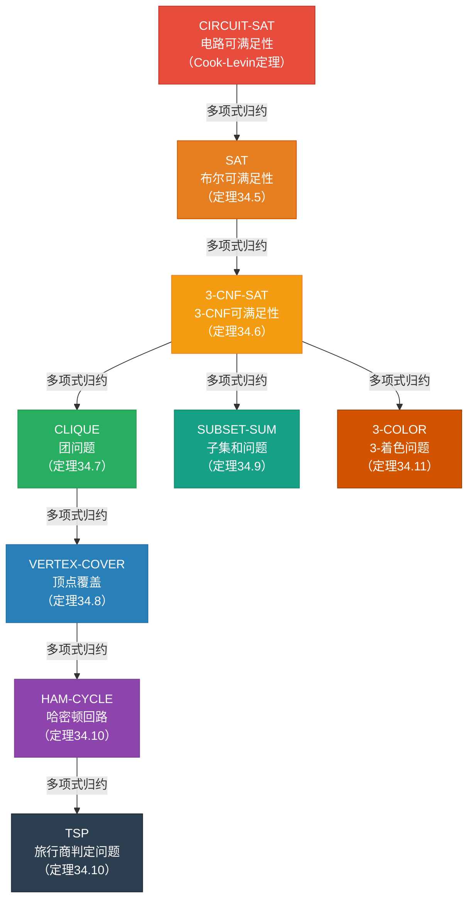

## 相关笔记
- 前置笔记：[[34.2 NP完全性与归约]]、[[34.1 多项式时间与NP类]]
- 关联概念：[[离散数学/concepts/可满足性]]、[[离散数学/concepts/布尔代数]]、[[离散数学/concepts/哈密顿路径]]、[[离散数学/concepts/图的着色]]、[[离散数学/concepts/二部图]]、[[离散数学/concepts/平面图]]
- 章节汇总：[[第34章_NP完全性-章节汇总]]

> [!abstract] 概览
> 本节系统介绍计算复杂性理论中最重要的几个**NP完全问题**，并展示它们之间通过**多项式时间归约**构成的完整归约链。从电路可满足性问题（CIRCUIT-SAT）出发，依次归约到布尔可满足性问题（SAT）、3-CNF可满足性问题（3-CNF-SAT）、团问题（CLIQUE）、顶点覆盖问题（VERTEX-COVER）、哈密顿回路问题（HAM-CYCLE）、旅行商问题（TSP）、子集和问题（SUBSET-SUM）以及3-着色问题（3-COLOR）。每一步归约都严格遵循多项式时间可计算的要求，从而将所有问题统一纳入NP完全性的框架之中。理解这些经典问题及其归约关系，是掌握NP完全性理论的核心环节，也为后续学习近似算法、参数化复杂性等高级主题奠定基础。

## 知识结构总览

## 核心思想

### NP完全问题归约链总览

NP完全性理论的核心力量在于：一旦我们证明了某个问题是NP完全的，就可以通过归约将这一"难解性"传播到其他问题。CLRS第4版第34.5节精心构建了一条从CIRCUIT-SAT出发的归约链，将多个看似不相关的计算问题串联在一起，揭示它们在计算复杂性上的等价关系。下面逐一介绍每个问题的形式化定义和关键归约构造。

---

### 1. CIRCUIT-SAT（电路可满足性）

**问题定义：**
- **输入**：一个由与门（AND）、或门（OR）、非门（NOT）组成的布尔组合电路 $C$，具有指定的输入和唯一的输出。
- **判定问题**：是否存在一组输入赋值使得 $C$ 的输出为真？

**地位**：CIRCUIT-SAT是整个NP完全性理论的起点。[[34.2 NP完全性与归约]]中通过Cook-Levin定理证明了CIRCUIT-SAT是NP完全的——任何NP问题都可以在多项式时间内归约到CIRCUIT-SAT。其证明思路是：对于NP语言 $L$ 的验证算法 $A$ 和输入 $x$，构造一个电路 $C$ 来模拟 $A$ 在 $x$ 上对所有可能证书 $y$ 的验证过程，使得 $C$ 可满足当且仅当存在使 $A$ 接受的证书。

**直观理解**：可以将CIRCUIT-SAT想象为一个"黑箱调试"问题——给定一个由逻辑门组成的电路板，我们能否找到一组输入开关的设置，使得最终的输出灯亮起？这类似于调试一个复杂的电子电路：输入是各个开关的状态，电路内部是固定的逻辑门连接，输出是一个指示灯。问题是：是否存在一种开关设置使指示灯亮起？Cook-Levin定理的深刻之处在于，它证明了**任何**可以在多项式时间内验证答案的计算问题，都可以"编译"成这样一个电路可满足性问题。

**NP成员性**：CIRCUIT-SAT属于NP类，因为给定一组输入赋值（证书），只需按照电路的拓扑排序逐门计算输出值，即可在 $O(|C|)$ 时间内验证电路是否输出为真。

---

### 2. SAT（布尔可满足性）—— 定理34.5

**问题定义：**
- **输入**：一个布尔公式 $\phi$，由布尔变量、逻辑与（$\wedge$）、逻辑或（$\vee$）、逻辑非（$\neg$）和括号组成。
- **判定问题**：是否存在一组对 $\phi$ 中变量的真值赋值，使得 $\phi$ 的值为真？

**归约：CIRCUIT-SAT $\le_P$ SAT（定理34.5）**

**核心转换技巧**：将电路中的每个逻辑门逐一"展开"为等价的布尔子公式，然后将所有子公式用合取（AND）连接起来。

**详细构造过程**：

给定电路 $C$，为 $C$ 中的每条连线 $g$ 引入一个**输出变量** $x_g$，然后为每个逻辑门构造一个约束子公式：

1. **输入门**：若输入变量为 $x_i$，则连线 $g$ 对应变量 $x_g = x_i$，约束为 $(x_g \leftrightarrow x_i)$，展开为 $(x_g \vee \neg x_i) \wedge (\neg x_g \vee x_i)$。

2. **NOT门**：若NOT门的输入为连线 $g$，输出为 $h$，则约束为 $(x_h \leftrightarrow \neg x_g)$，展开为 $(x_h \vee x_g) \wedge (\neg x_h \vee \neg x_g)$。

3. **AND门**：若AND门的输入为连线 $g$ 和 $h$，输出为 $j$，则约束为 $(x_j \leftrightarrow x_g \wedge x_h)$，展开为 $(\neg x_g \vee \neg x_h \vee x_j) \wedge (x_g \vee \neg x_j) \wedge (x_h \vee \neg x_j)$。

4. **OR门**：若OR门的输入为连线 $g$ 和 $h$，输出为 $j$，则约束为 $(x_j \leftrightarrow x_g \vee x_h)$，展开为 $(x_g \vee x_h \vee \neg x_j) \wedge (\neg x_g \vee x_j) \wedge (\neg x_h \vee x_j)$。

最终，将所有门的约束子公式用AND连接，再合取上输出变量 $x_{out} = \text{TRUE}$ 的条件，得到公式 $\phi$。

**正确性论证**：
- 【方向一（$\Rightarrow$）】：若电路 $C$ 可满足，则存在输入赋值使 $C$ 输出为真。将每条连线上传播的值赋给对应的变量 $x_g$，则每个门的约束子公式都被满足，且 $x_{out} = \text{TRUE}$，故 $\phi$ 可满足。
- 【方向二（$\Leftarrow$）】：若 $\phi$ 可满足，则存在变量赋值使所有约束子公式为真。将输入门的变量值作为电路输入，由于每个门的约束子公式保证了门输出的正确性，电路的输出必然为真。

**多项式时间性**：公式 $\phi$ 的长度与电路 $C$ 的大小成线性关系，每个门只产生常数个子句，因此归约在 $O(|C|)$ 时间内完成。

---

### 3. 3-CNF-SAT（3-CNF可满足性）—— 定理34.6

**问题定义：**
- **输入**：一个布尔公式 $\phi$，要求 $\phi$ 是**合取范式**（CNF）形式，即 $\phi = C_1 \wedge C_2 \wedge \cdots \wedge C_k$，其中每个子句 $C_i$ 是若干文字的析取；进一步要求每个子句恰好包含**3个文字**（3-CNF）。
- **判定问题**：是否存在一组变量赋值使 $\phi$ 为真？

**归约：SAT $\le_P$ 3-CNF-SAT（定理34.6）**

**核心转换技巧**：分两步——先将任意布尔公式转化为CNF，再将CNF中长度不为3的子句转化为等价的3-CNF子句。

**步骤一：从布尔公式到CNF**

使用以下恒等式将公式转化为CNF：
- 德摩根定律：$\neg(x \wedge y) \equiv \neg x \vee \neg y$，$\neg(x \vee y) \equiv \neg x \wedge \neg y$
- 分配律：$x \vee (y \wedge z) \equiv (x \vee y) \wedge (x \vee z)$

转化过程中引入的变量个数至多线性增长。

**步骤二：从CNF到3-CNF**

对于每个子句 $C_i$，根据其包含的文字数量分别处理：

- **子句恰好有3个文字**：保持不变。
- **子句有1个文字** $(l)$：替换为 $(l \vee s_1 \vee s_2) \wedge (l \vee s_1 \vee \neg s_2) \wedge (l \vee \neg s_1 \vee s_2) \wedge (l \vee \neg s_1 \vee \neg s_2)$，其中 $s_1, s_2$ 是新引入的辅助变量。
- **子句有2个文字** $(l_1 \vee l_2)$：替换为 $(l_1 \vee l_2 \vee s) \wedge (l_1 \vee l_2 \vee \neg s)$，其中 $s$ 是新引入的辅助变量。
- **子句有 $k > 3$ 个文字** $(l_1 \vee l_2 \vee \cdots \vee l_k)$：替换为 $(l_1 \vee l_2 \vee s_1) \wedge (\neg s_1 \vee l_3 \vee s_2) \wedge (\neg s_2 \vee l_4 \vee s_3) \wedge \cdots \wedge (\neg s_{k-3} \vee l_{k-1} \vee l_k)$。

**正确性论证**：
- 对于1个文字的情况：无论 $s_1, s_2$ 取何值，4个子句中恰好有一半要求 $l$ 为真。具体地，当 $s_1, s_2$ 遍历所有4种组合时，$(s_1 \vee s_2)$、$(s_1 \vee \neg s_2)$、$(\neg s_1 \vee s_2)$、$(\neg s_1 \vee \neg s_2)$ 中恰好有一个为假，因此4个子句全部为真当且仅当 $l$ 为真。
- 对于 $k > 3$ 个文字的情况：辅助变量 $s_i$ 充当"传递"角色——若 $s_1 = \text{FALSE}$，则第一个子句迫使 $l_1 \vee l_2$ 为真，同时 $\neg s_1 = \text{TRUE}$ 使得第二个子句退化为 $l_3 \vee s_2$，依此类推，形成链式约束。

**多项式时间性**：每个子句的扩展产生至多 $O(k)$ 个3-CNF子句和 $O(k)$ 个辅助变量，总规模至多线性增长。

---

### 4. CLIQUE（团问题）—— 定理34.7

**问题定义：**
- **输入**：无向图 $G = (V, E)$ 和整数 $k$。
- **判定问题**：$G$ 中是否存在大小为 $k$ 的**完全子图**（团），即是否存在 $V$ 的子集 $V' \subseteq V$，$|V'| = k$，使得 $V'$ 中任意两个不同顶点之间都有边相连？

**归约：3-CNF-SAT $\le_P$ CLIQUE（定理34.7）**

**核心转换技巧**：将3-CNF公式的可满足性转化为图中寻找团的问题。关键在于构造一个图，使得图中的团恰好对应于公式的一组满足赋值。

**详细构造过程**：

给定3-CNF公式 $\phi = C_1 \wedge C_2 \wedge \cdots \wedge C_k$，其中每个子句 $C_i$ 恰好有3个文字。构造无向图 $G = (V, E)$ 如下：

- **顶点集**：为每个子句中的每个文字创建一个顶点。具体地，对于子句 $C_i = (l_{i1} \vee l_{i2} \vee l_{i3})$，创建3个顶点 $v_{i1}, v_{i2}, v_{i3}$，分别对应文字 $l_{i1}, l_{i2}, l_{i3}$。总共有 $3k$ 个顶点，按子句分为 $k$ 个**三元组**（triples）。
- **边集**：在两个顶点 $v_{ij}$ 和 $v_{pq}$ 之间添加边，当且仅当满足以下两个条件：
  1. $i \neq p$（两个顶点来自不同的子句）；
  2. $l_{ij}$ 不是 $l_{pq}$ 的否定（即两个文字不矛盾，不会同时要求一个变量既为真又为假）。

设 $k$ 为公式中子句的个数。

**正确性论证**：
- 【方向一（$\Rightarrow$）】：若 $\phi$ 可满足，设满足赋值为 $v$。对于每个子句 $C_i$，至少有一个文字 $l_{ij}$ 在赋值 $v$ 下为真。从每个子句中选取一个这样的文字对应的顶点 $v_{ij}$，共选出 $k$ 个顶点。由于这些顶点来自不同子句（条件1满足），且同一变量在不同子句中取值一致（不会同时出现 $x$ 和 $\neg x$，条件2满足），这 $k$ 个顶点之间两两有边，构成大小为 $k$ 的团。
- 【方向二（$\Leftarrow$）】：若 $G$ 中存在大小为 $k$ 的团，则团中 $k$ 个顶点必须分别来自 $k$ 个不同的子句（否则同一子句的两个顶点之间没有边）。为每个变量赋值：若团中包含变量 $x$ 对应的顶点，则令 $x = \text{TRUE}$；若包含 $\neg x$ 对应的顶点，则令 $x = \text{FALSE}$。由于团中不会同时包含 $x$ 和 $\neg x$ 的顶点（条件2），赋值是一致的。每个子句中至少有一个文字在团中，因此每个子句都被满足。

**多项式时间性**：图 $G$ 有 $3k$ 个顶点和至多 $\binom{3k}{2} = O(k^2)$ 条边，构造时间为 $O(k^2)$。

**CLIQUE归约的实例演示**：

考虑3-CNF公式 $\phi = (x_1 \vee \neg x_2 \vee x_3) \wedge (\neg x_1 \vee x_2 \vee x_3) \wedge (x_1 \vee x_2 \vee \neg x_3)$。

构造的图 $G$ 包含9个顶点，分为3个三元组：
- 子句1：$v_{11}$（$x_1$），$v_{12}$（$\neg x_2$），$v_{13}$（$x_3$）
- 子句2：$v_{21}$（$\neg x_1$），$v_{22}$（$x_2$），$v_{23}$（$x_3$）
- 子句3：$v_{31}$（$x_1$），$v_{32}$（$x_2$），$v_{33}$（$\neg x_3$）

边集的构建遵循两条规则：来自不同子句的顶点之间，若文字不矛盾则有边。例如，$v_{11}$（$x_1$）与 $v_{21}$（$\neg x_1$）之间**没有边**（矛盾），但 $v_{11}$（$x_1$）与 $v_{22}$（$x_2$）之间**有边**（不矛盾）。

赋值 $x_1 = \text{TRUE}, x_2 = \text{TRUE}, x_3 = \text{TRUE}$ 满足 $\phi$。对应地，从每个子句中选取一个为真的文字：子句1选 $x_1$（$v_{11}$），子句2选 $x_2$（$v_{22}$），子句3选 $x_1$（$v_{31}$）。这三个顶点两两之间都有边（$x_1$ 与 $x_2$ 不矛盾，$x_1$ 与 $x_1$ 相同），构成大小为3的团。

---

### 5. VERTEX-COVER（顶点覆盖）—— 定理34.8

**问题定义：**
- **输入**：无向图 $G = (V, E)$ 和整数 $k$。
- **判定问题**：是否存在大小为 $k$ 的顶点子集 $V' \subseteq V$，使得 $G$ 中每条边至少有一个端点在 $V'$ 中？

**归约：CLIQUE $\le_P$ VERTEX-COVER（定理34.8）**

**核心转换技巧**：利用**补图**的概念。图 $G$ 中团的大小与补图 $\overline{G}$ 中顶点覆盖的大小之间存在精确的互补关系。

**详细构造过程**：

给定CLIQUE的实例 $(G, k)$，构造补图 $\overline{G} = (V, \overline{E})$，其中 $\overline{E} = \{(u, v) : u, v \in V, u \neq v, (u, v) \notin E\}$。输出VERTEX-COVER的实例 $(\overline{G}, |V| - k)$。

**正确性论证**：
- 【方向一（$\Rightarrow$）】：若 $G$ 中存在大小为 $k$ 的团 $V'$，则 $V'$ 中任意两个顶点在 $G$ 中都有边相连，因此在 $\overline{G}$ 中 $V'$ 内部没有任何边。设 $V'' = V \setminus V'$，则 $|V''| = |V| - k$。$\overline{G}$ 中的每条边至少有一个端点在 $V''$ 中（因为 $V'$ 内部无边，$\overline{G}$ 的边不可能两端都在 $V'$ 中），故 $V''$ 是 $\overline{G}$ 的大小为 $|V| - k$ 的顶点覆盖。
- 【方向二（$\Leftarrow$）】：若 $\overline{G}$ 中存在大小为 $|V| - k$ 的顶点覆盖 $V''$，则 $V' = V \setminus V''$ 的大小为 $k$。由于 $V''$ 覆盖了 $\overline{G}$ 的所有边，$V'$ 内部没有 $\overline{G}$ 中的边，即 $V'$ 中任意两个顶点在 $G$ 中都有边相连，故 $V'$ 是 $G$ 中大小为 $k$ 的团。

**多项式时间性**：补图的构造需要遍历所有顶点对，时间为 $O(|V|^2)$。

**VERTEX-COVER归约的实例演示**：

考虑图 $G = (V, E)$，其中 $V = \{1, 2, 3, 4\}$，$E = \{(1,2), (1,3), (2,3), (3,4)\}$。$G$ 中存在大小为2的团 $\{1, 2, 3\}$（注意：$\{1,2\}$、$\{1,3\}$、$\{2,3\}$ 之间都有边）。

构造补图 $\overline{G}$：$\overline{E} = \{(1,4), (2,4)\}$（原图中不存在的边）。

在 $\overline{G}$ 中，$V'' = V \setminus \{1, 2, 3\} = \{4\}$，$|V''| = 4 - 3 = 1$。检查 $\overline{G}$ 的边 $(1,4)$ 和 $(2,4)$，端点4覆盖了所有边，因此 $\{4\}$ 是大小为1的顶点覆盖。

反过来，若已知 $\overline{G}$ 有大小为1的顶点覆盖 $\{4\}$，则 $V' = V \setminus \{4\} = \{1, 2, 3\}$，在 $\overline{G}$ 中 $\{1,2,3\}$ 内部没有边（因为 $\overline{E} = \{(1,4), (2,4)\}$），因此 $\{1,2,3\}$ 在 $G$ 中是团。

**直观理解**：团和顶点覆盖之间的互补关系可以用一个生活化类比来理解。想象一个社交网络：团是一群互相认识的人（每两个人之间都有"认识"这条边），顶点覆盖是一组人，使得社交网络中的每条"认识"关系至少有一端在这组人中。在补网络（将"认识"变为"不认识"）中，团的大小加上顶点覆盖的大小恰好等于总人数——因为团中的人互不认识（在补网络中），所以团之外的人必须覆盖所有"不认识"关系。

---

### 6. SUBSET-SUM（子集和问题）—— 定理34.9

**问题定义：**
- **输入**：有限集合 $S$，每个元素 $s \in S$ 关联一个正整数权重 $w(s) \in \mathbb{Z}^+$；以及一个目标正整数 $t$。
- **判定问题**：是否存在子集 $S' \subseteq S$，使得 $\sum_{s \in S'} w(s) = t$？

**归约：3-CNF-SAT $\le_P$ SUBSET-SUM（定理34.9）**

**核心转换技巧**：将3-CNF公式的变量选择和子句满足条件编码为十进制数的子集和问题。利用十进制数字的各位来独立约束不同子句的满足性。

**详细构造过程**：

给定3-CNF公式 $\phi$，包含 $n$ 个变量 $x_1, x_2, \ldots, x_n$ 和 $k$ 个子句 $C_1, C_2, \ldots, C_k$。构造子集和实例如下：

- **集合 $S$**：为每个变量 $x_i$ 创建两个数 $v_i$ 和 $v_i'$，分别代表"令 $x_i = \text{TRUE}$"和"令 $x_i = \text{FALSE}$"。为每个子句 $C_j$ 创建两个"松弛数" $s_j$ 和 $s_j'$。
- **数字构造**：每个数用一个 $(k+1)$ 位的十进制数表示。最低位（第0位）用于保证每个变量恰好选择一个赋值；第 $j$ 位（$1 \le j \le k$）用于保证子句 $C_j$ 被满足。

  具体地：
  - $v_i$ 的第0位为1，第 $j$ 位为1当且仅当 $x_i$ 出现在子句 $C_j$ 中（作为正文字）。
  - $v_i'$ 的第0位为1，第 $j$ 位为1当且仅当 $\neg x_i$ 出现在子句 $C_j$ 中（作为负文字）。
  - $s_j$ 的第 $j$ 位为1，其余位为0。
  - $s_j'$ 的第 $j$ 位为1，其余位为0。

- **目标值 $t$**：$t$ 的第0位为 $n$（确保每个变量恰好选一个赋值），第 $j$ 位为4（因为每个子句有3个文字，选中的赋值中至少有1个文字满足该子句，再加上至多2个松弛数来补足到4）。

**正确性论证**：
- 【方向一（$\Rightarrow$）】：若 $\phi$ 可满足，对每个变量 $x_i$，若 $x_i = \text{TRUE}$ 则选 $v_i$，否则选 $v_i'$。第0位之和为 $n$（每个变量贡献1）。对于每个子句 $C_j$，至少有一个满足的文字，贡献至少1；若满足的文字数为1，则添加 $s_j$ 和 $s_j'$ 使第 $j$ 位达到4；若满足的文字数为2，则添加 $s_j$ 或 $s_j'$ 使第 $j$ 位达到4；若满足的文字数为3，则不需要松弛数。
- 【方向二（$\Leftarrow$）】：若存在子集 $S'$ 使和为 $t$，则第0位为 $n$ 意味着每个变量恰好选了一个赋值（$v_i$ 或 $v_i'$）。第 $j$ 位为4意味着该子句中至少有一个被选中的文字满足它（因为松弛数至多贡献2，被选中的赋值至少贡献2才能达到4，而每个子句恰好有3个文字，被选中的赋值中至少有1个满足该子句）。

**多项式时间性**：集合 $S$ 的大小为 $2n + 2k$，每个数的位数为 $k+1$，构造时间为多项式。

---

### 7. HAM-CYCLE（哈密顿回路）—— 定理34.10（前半部分）

**问题定义：**
- **输入**：无向图 $G = (V, E)$。
- **判定问题**：$G$ 中是否存在一条经过每个顶点恰好一次的简单回路？

**归约：VERTEX-COVER $\le_P$ HAM-CYCLE（定理34.10）**

**核心转换技巧**：使用精心设计的**子图构件（widget）**将顶点覆盖的约束编码为哈密顿回路的存在性。这是整条归约链中构造最为复杂的一步。

**详细构造思路**：

给定VERTEX-COVER的实例 $(G, k)$，其中 $G = (V, E)$，$|V| = n$，$|E| = m$。构造图 $G'$ 如下：

1. **选择构件**：创建 $k$ 个选择顶点 $s_1, s_2, \ldots, s_k$，排列成一个环（$s_i$ 与 $s_{i+1}$ 相连，$s_k$ 与 $s_1$ 相连）。每个选择顶点代表顶点覆盖中的一个顶点。

2. **边构件**：对于 $G$ 中的每条边 $(u, v) \in E$，创建一个边构件子图。该子图有入口和出口，哈密顿回路必须以特定方式穿过它。边构件的设计确保：回路穿过边构件时，必须"选择"该边的某个端点对应的变量。

3. **连接结构**：通过标签和连接线将选择构件与边构件连接起来，使得哈密顿回路的存在性等价于原图存在大小为 $k$ 的顶点覆盖。

由于边构件的构造涉及复杂的子图设计（CLRS中使用了一种基于"穿越方向"的构件），这里概述其核心原理：每个边构件要求哈密顿回路从某个选择顶点"进入"并"离开"，而选择顶点的使用次数恰好为 $k$ 次，对应顶点覆盖的大小约束。

**多项式时间性**：$G'$ 的大小为 $O(k + m)$ 的多项式级别。

---

### 8. TSP（旅行商问题）—— 定理34.10（后半部分）

**问题定义：**
- **输入**：完全图 $G = (V, E)$，每条边 $(u, v) \in E$ 关联一个正整数权重 $d(u, v) \in \mathbb{Z}^+$；以及一个整数界限 $D$。
- **判定问题**：是否存在一条经过所有顶点恰好一次的**哈密顿回路**（旅行），其总权重不超过 $D$？

**归约：HAM-CYCLE $\le_P$ TSP（定理34.10）**

**核心转换技巧**：将一般图上的哈密顿回路问题转化为完全图上带权重的旅行商问题。通过赋予边权为1或2，将"是否存在哈密顿回路"转化为"是否存在总权重不超过 $|V|$ 的旅行"。

**详细构造过程**：

给定HAM-CYCLE的实例——无向图 $G = (V, E)$，$|V| = n$。构造TSP的实例——完全图 $G' = (V, E')$ 如下：

- $E' = V \times V$（所有顶点对之间都有边，即完全图）。
- 边权定义：
  - 若 $(u, v) \in E$（原图中有这条边），则 $d(u, v) = 1$。
  - 若 $(u, v) \notin E$（原图中没有这条边），则 $d(u, v) = 2$。
- 设界限 $D = n$。

**正确性论证**：
- 【方向一（$\Rightarrow$）】：若 $G$ 中存在哈密顿回路，则该回路使用 $n$ 条边，每条边都在 $E$ 中，因此每条边的权重为1，总权重恰好为 $n = D$。故TSP实例的答案为"是"。
- 【方向二（$\Leftarrow$）】：若 $G'$ 中存在总权重不超过 $n$ 的旅行，则该旅行使用 $n$ 条边，总权重 $\le n$。由于每条边的权重至少为1，总权重恰好为 $n$，且每条边的权重必须恰好为1，即每条边都属于 $E$。因此该旅行是 $G$ 中的哈密顿回路。

**多项式时间性**：完全图 $G'$ 有 $\binom{n}{2}$ 条边，构造时间为 $O(n^2)$。

**TSP归约的实例演示**：

考虑图 $G = (V, E)$，其中 $V = \{a, b, c, d\}$，$E = \{(a,b), (b,c), (c,d), (d,a), (a,c)\}$。$|V| = 4$，$G$ 中存在哈密顿回路 $a \to b \to c \to d \to a$。

构造完全图 $G'$，边权如下：
- $d(a,b) = 1$，$d(b,c) = 1$，$d(c,d) = 1$，$d(d,a) = 1$，$d(a,c) = 1$（原图中的边）
- $d(b,d) = 2$（原图中不存在的边）

界限 $D = 4$。哈密顿回路 $a \to b \to c \to d \to a$ 的总权重为 $1 + 1 + 1 + 1 = 4 = D$，因此TSP实例的答案为"是"。

若从 $G$ 中删除边 $(a,c)$，则 $G$ 中不存在哈密顿回路（因为 $G$ 退化为一条路径）。此时 $G'$ 中任何旅行都至少使用一条权重为2的边，总权重 $\ge 5 > 4 = D$，TSP实例的答案为"否"。

---

### 9. 3-COLOR（3-着色问题）—— 定理34.11

**问题定义：**
- **输入**：无向图 $G = (V, E)$。
- **判定问题**：是否存在一种用3种颜色对 $V$ 中每个顶点着色的方案，使得相邻顶点颜色不同？

**归约：3-CNF-SAT $\le_P$ 3-COLOR（定理34.11）**

**核心转换技巧**：构造一个图，使得图的3-着色对应于3-CNF公式的一组满足赋值。使用"调色板三角形"固定三种颜色的语义，用"线"传播变量赋值，用"OR-构件"实现子句的析取约束。

**详细构造思路**：

给定3-CNF公式 $\phi$，包含 $n$ 个变量和 $k$ 个子句。构造图 $G'$ 如下：

1. **调色板三角形**：创建三个顶点 $T, F, C$（分别代表TRUE、FALSE和"控制色"），形成三角形。由于三角形需要三种不同颜色，这固定了三种颜色的语义。

2. **变量构件**：对于每个变量 $x_i$，创建两个顶点 $x_i$ 和 $\neg x_i$，用一条边相连（确保它们颜色不同）。将 $x_i$ 连接到 $F$，$\neg x_i$ 连接到 $T$。这样，若 $x_i$ 着TRUE色，则 $\neg x_i$ 必须着非TRUE色（且由于与 $T$ 相连，不能着TRUE色，故着 $C$ 色或 $F$ 色，但与 $x_i$ 不同），形成变量赋值的一致性约束。

3. **子句构件（OR-构件）**：对于每个子句 $C_j = (l_{j1} \vee l_{j2} \vee l_{j3})$，构造一个OR-构件子图，将三个文字的顶点连接到该构件。OR-构件的设计确保：至少有一个文字顶点着TRUE色时，构件可以被正确着色。

**正确性论证**：
- 【方向一（$\Rightarrow$）】：若 $\phi$ 可满足，将满足赋值中为TRUE的变量顶点着TRUE色，为FALSE的着FALSE色。每个子句中至少有一个满足的文字，其对应顶点着TRUE色，OR-构件因此可以被正确着色。
- 【方向二（$\Leftarrow$）】：若 $G'$ 可以被3-着色，则由调色板三角形和变量构件的约束，可以读出每个变量的赋值。OR-构件的可着色性保证每个子句中至少有一个文字的顶点着TRUE色，即该子句被满足。

**多项式时间性**：图 $G'$ 的大小为 $O(n + k)$，构造时间为多项式。

---

### 归约关系总结

以上归约构成了一条完整的NP完全性证明链：

$$\text{CIRCUIT-SAT} \le_P \text{SAT} \le_P \text{3-CNF-SAT} \le_P \begin{cases} \text{CLIQUE} \le_P \text{VERTEX-COVER} \le_P \text{HAM-CYCLE} \le_P \text{TSP} \\ \text{SUBSET-SUM} \\ \text{3-COLOR} \end{cases}$$

每个归约都是多项式时间的，因此根据NP完全性的传递性，上述所有问题都是NP完全的。

---

### 实际意义

**密码学安全**：NP完全问题为现代密码学提供了计算安全性的基础。例如，子集和问题是Merkle-Hellman背包密码系统的理论基础。若P $\neq$ NP，则基于NP完全（或NP困难）问题的密码系统在多项式时间内不可破解。

**近似算法设计**：由于NP完全问题难以精确求解，研究者转而设计近似算法。例如，顶点覆盖问题有简单的2-近似算法，满足三角不等式的TSP有1.5-近似算法（Christofides算法）。然而，一般TSP和团问题不存在常数因子近似算法（除非P = NP）。

**问题分类指导**：NP完全性告诉我们哪些问题"本质上"是困难的，从而指导算法设计者将精力投入到以下方向：
1. 对特殊情况的精确算法（如二部图上的顶点覆盖可在多项式时间内求解）；
2. 近似算法和启发式算法；
3. 参数化算法和固定参数可 tractable（FPT）算法；
4. 指数时间精确算法（如分支限界法）。

**NP完全问题一览表**：

| 问题名称 | 输入格式 | 判定问题 | 归约来源 | 定理编号 |
|:---|:---|:---|:---|:---:|
| CIRCUIT-SAT | 布尔电路 $C$ | $C$ 是否可满足？ | Cook-Levin定理 | — |
| SAT | 布尔公式 $\phi$ | $\phi$ 是否可满足？ | CIRCUIT-SAT | 定理34.5 |
| 3-CNF-SAT | 3-CNF公式 $\phi$ | $\phi$ 是否可满足？ | SAT | 定理34.6 |
| CLIQUE | 图 $G$，整数 $k$ | $G$ 中是否有大小为 $k$ 的团？ | 3-CNF-SAT | 定理34.7 |
| VERTEX-COVER | 图 $G$，整数 $k$ | $G$ 中是否有大小为 $k$ 的顶点覆盖？ | CLIQUE | 定理34.8 |
| SUBSET-SUM | 集合 $S$，目标 $t$ | $S$ 是否有子集之和为 $t$？ | 3-CNF-SAT | 定理34.9 |
| HAM-CYCLE | 图 $G$ | $G$ 中是否有哈密顿回路？ | VERTEX-COVER | 定理34.10 |
| TSP | 完全图 $G$，权重，界限 $D$ | 是否有总权重 $\le D$ 的旅行？ | HAM-CYCLE | 定理34.10 |
| 3-COLOR | 图 $G$ | $G$ 是否可以3-着色？ | 3-CNF-SAT | 定理34.11 |

## 补充理解

> [!info] HAM-CYCLE到TSP的归约详解
> HAM-CYCLE到TSP的归约是NP完全性证明中最简洁优雅的归约之一。其核心思想是将"图中是否存在哈密顿回路"转化为"完全图中是否存在总权重不超过 $n$ 的旅行"。通过将原图中的边赋权为1、非边赋权为2，我们巧妙地让TSP的权重约束等价于"只使用原图中的边"。这一归约展示了如何通过**权重设计**将存在性问题转化为优化判定问题。详细证明过程参见：
> https://opendsa.cs.vt.edu/ODSA/Books/Everything/html/hamiltonianCycle_to_TSP.html

> [!info] 子集和问题的密码学应用
> 子集和问题不仅在理论计算机科学中具有重要地位，还在密码学中有直接应用。Merkle-Hellman背包密码系统（1978年）就是基于子集和问题的困难性设计的公钥密码系统。其核心思想是：利用"超递增序列"作为私钥（可以高效求解子集和），通过模乘变换将其伪装为普通子集和实例作为公钥（公开后难以求解）。虽然该原始方案已被Shamir在1982年攻破，但其思想深刻影响了后续密码学的发展，特别是格密码学中的最短向量问题（SVP）与子集和问题的内在联系。更多内容参见：
> https://blog.csdn.net/qq_37589805/article/details/135981606

> [!info] NP完全问题的近似算法
> 并非所有NP完全问题都同样"难以近似"。顶点覆盖问题存在简单的2-近似算法（反复选取边，将两端点加入覆盖），且在不假设P $\neq$ NP的前提下，2-近似已是多项式时间内可达的最佳常数因子。对于满足三角不等式的TSP（$\Delta$-TSP），Christofides算法（1976年）给出了1.5-近似比，这是该问题长达近半个世纪的最佳已知结果，直到2020年才被微幅改进。然而，一般TSP（不满足三角不等式）不存在任何常数因子近似算法，除非P = NP。更多近似算法的分析参见：
> https://www.cs.umd.edu/class/fall2025/cmsc451-0101/Lects/lect18-apx-vc-tsp.pdf

> [!info] 参数化复杂性：超越NP完全性
> 参数化复杂性理论（由Downey和Fellows于1999年系统建立）提供了一种更精细的问题分类框架。其核心思想是将问题实例的输入大小 $n$ 和一个参数 $k$ 分开考虑。若问题可以在 $f(k) \cdot n^{O(1)}$ 时间内求解（其中 $f$ 是仅依赖于 $k$ 的函数），则称该问题是**固定参数可 tractable**（FPT）的。例如，顶点覆盖问题是FPT的（参数为覆盖大小 $k$，可用 $O(2^k \cdot n)$ 时间的分支算法求解），而团问题在参数为解大小 $k$ 时是W[1]-完全的（极不可能FPT）。这一理论为"NP完全问题并非完全无望"提供了精确的数学刻画。经典教材参见：
> https://www.springer.com/book/9781447171645

## 易混淆点

> [!warning] 最优化问题 vs 判定问题
> NP完全性只针对**判定问题**（答案是"是"或"否"），而非最优化问题（求最优解）。例如，"求图中最大团的大小"是最优化问题，而"图中是否存在大小为 $k$ 的团"是判定问题。我们证明的是判定版本的NP完全性。最优化版本通常比判定版本更难（NP困难），但两者之间存在密切联系：如果能在多项式时间内求解最优化版本，自然也能在多项式时间内求解判定版本（只需比较最优解与 $k$）。反过来，通过二分搜索，如果能在多项式时间内求解判定版本，也往往能在多项式时间内求解最优化版本（前提是解的值域是多项式大小的）。

> [!warning] TSP的判定版本 vs 最优化版本
> TSP的**判定版本**（"是否存在总权重不超过 $D$ 的旅行？"）是NP完全的，而TSP的**最优化版本**（"求总权重最小的旅行"）是NP困难的。注意：NP困难的定义不要求问题本身属于NP类。判定版本属于NP是因为给定一个旅行（证书），可以在多项式时间内验证其总权重是否不超过 $D$。最优化版本不属于NP（因为NP只包含判定问题），但它是NP困难的，因为判定版本可以多项式归约到它。此外，若TSP满足三角不等式（$\Delta$-TSP），则其判定版本仍然是NP完全的，但近似算法的表现会好得多。

> [!warning] NP完全问题的特殊情况可以在多项式时间内求解
> 一个问题是NP完全的，并不意味着它的**所有实例**都难以求解。许多NP完全问题在特定限制条件下可以在多项式时间内求解。例如：
> - **2-CNF-SAT**（每个子句恰好2个文字）可以在多项式时间内求解（通过构造蕴含图并检测强连通分量）；
> - **2-COLOR**（二着色问题）等价于二部图判定，可在 $O(V + E)$ 时间内求解；
> - **顶点覆盖**在**二部图**上可以在多项式时间内求解（通过最大匹配与Konig定理）；
> - **哈密顿回路**在**有向无环图**上可以在多项式时间内求解（因为DAG中不存在哈密顿回路，除非是单顶点）。
>
> NP完全性刻画的是问题的**最坏情况**复杂度，而非平均情况或特殊情况。这一区别在实际应用中至关重要——很多实际遇到的问题实例可能远比最坏情况容易。

## 习题精选

| 题号 | 题目描述 | 核心考点 |
|:---:|:---|:---|
| 34.5-1 | 给定一个团问题的实例 $(G, k)$，其中 $G$ 是一个二部图。说明如何利用二部图的结构在多项式时间内判断该实例。 | 二部图中团的大小至多为2，直接检查是否存在至少一条边即可 |
| 34.5-2 | 给定子集和问题的实例 $(S, t)$，说明如何在 $O(nt)$ 时间内用动态规划求解该问题，其中 $n = \|S\|$。 | 动态规划求解子集和，构造布尔表 $T[i, j]$ 表示前 $i$ 个元素是否能凑出和 $j$ |
| 34.5-4 | 证明：若P $\neq$ NP，则多项式时间内不存在对一般TSP的常数因子近似算法。 | 通过归约哈密顿回路到TSP，说明近似算法将能判定HAM-CYCLE |
| 34.5-7 | 给定一个3-CNF公式 $\phi$，其中每个变量最多出现3次。证明该受限版本的3-CNF-SAT仍然是NP完全的。 | 修改标准归约，通过引入辅助变量来控制变量出现次数 |

> [!faq]- 习题 34.5-1 参考答案
> **解题思路**：利用二部图的性质——二部图中的团大小至多为2（因为二部图中不存在奇数长度的环，特别地，不存在三角形）。
>
> **完整解答**：
> 在二部图 $G = (V_1 \cup V_2, E)$ 中，任何团中的顶点必须两两相连。由于二部图中 $V_1$ 内部没有边、$V_2$ 内部也没有边，一个团中最多包含一个来自 $V_1$ 的顶点和一个来自 $V_2$ 的顶点，即团的大小至多为2。
>
> 因此：
> - 若 $k = 1$：答案恒为"是"（任何单个顶点构成大小为1的团）。
> - 若 $k = 2$：答案为"是"当且仅当 $G$ 中至少存在一条边（只需检查 $E$ 是否为空）。
> - 若 $k \ge 3$：答案恒为"否"。
>
> 以上判断均可在 $O(|V| + |E|)$ 时间内完成。

> [!faq]- 习题 34.5-2 参考答案
> **解题思路**：使用动态规划，定义布尔表 $T[i, j]$ 表示"使用集合 $S$ 中前 $i$ 个元素是否能凑出和恰好为 $j$"。
>
> **完整解答**：
> 设 $S = \{s_1, s_2, \ldots, s_n\}$，令 $w_i = w(s_i)$ 为第 $i$ 个元素的权重。
>
> **递推关系**：
> - 基础情况：$T[0, 0] = \text{TRUE}$，$T[0, j] = \text{FALSE}$（$j > 0$）。
> - 递推步骤：$T[i, j] = T[i-1, j] \vee T[i-1, j - w_i]$（当 $j \ge w_i$ 时；否则 $T[i, j] = T[i-1, j]$）。
>
> **含义**：$T[i-1, j]$ 表示不选第 $i$ 个元素就能凑出 $j$；$T[i-1, j-w_i]$ 表示选了第 $i$ 个元素后，前 $i-1$ 个元素需要凑出 $j - w_i$。
>
> **最终答案**：$T[n, t]$ 的值即为判定结果。
>
> **时间复杂度**：表的大小为 $(n+1) \times (t+1)$，每项计算时间为 $O(1)$，总时间为 $O(nt)$。空间复杂度同样为 $O(nt)$（可通过滚动数组优化至 $O(t)$）。

> [!faq]- 习题 34.5-4 参考答案
> **解题思路**：通过反证法，假设存在常数因子近似算法，则利用HAM-CYCLE到TSP的归约导出矛盾。
>
> **完整解答**：
> 假设存在多项式时间的 $c$-近似算法 $A$ 用于一般TSP（$c \ge 1$ 为常数）。
>
> 给定HAM-CYCLE的实例——图 $G = (V, E)$，$|V| = n$。构造TSP实例：完全图 $G'$，原图中的边权为1，非边权为2，界限 $D = n$。
>
> 分析两种情况：
> - **情况一**：$G$ 中存在哈密顿回路。此时TSP的最优解为 $n$（使用原图中的 $n$ 条边，每条权重1）。近似算法 $A$ 的输出 $\le c \cdot n$。
> - **情况二**：$G$ 中不存在哈密顿回路。此时TSP的最优解 $\ge n + 1$（任何旅行至少使用一条权重为2的边）。近似算法 $A$ 的输出 $\ge n + 1$。
>
> 若 $c \cdot n < n + 1$，即 $c < 1 + 1/n$，则可以通过比较 $A$ 的输出与 $n + 1$ 来判定HAM-CYCLE。但对于固定的常数 $c$，当 $n$ 足够大时（$n > 1/(c-1)$），$c \cdot n \ge n + 1$，无法直接区分。
>
> 更严格的论证：假设存在 $c$-近似算法，我们可以构造归约。设 $G'$ 中非边权重为 $c \cdot n$（而非2），则：
> - 存在哈密顿回路时，最优解为 $n$，近似算法输出 $\le c \cdot n$。
> - 不存在哈密顿回路时，最优解 $\ge n + (c \cdot n - 1) > c \cdot n$，近似算法输出 $> c \cdot n$。
>
> 因此，比较近似算法的输出与 $c \cdot n$ 即可在多项式时间内判定HAM-CYCLE，与P $\neq$ NP矛盾。

> [!faq]- 习题 34.5-7 参考答案
> **解题思路**：证明受限版本的3-CNF-SAT仍然是NP完全的，需要修改标准归约使得每个变量最多出现3次。
>
> **完整解答**：
> 我们从3-CNF-SAT归约到受限版本。给定3-CNF公式 $\phi$，其中某些变量可能出现超过3次。需要将 $\phi$ 转化为等价的公式 $\phi'$，使得 $\phi'$ 中每个变量最多出现3次，且 $\phi'$ 可满足当且仅当 $\phi$ 可满足。
>
> **变量替换技术**：对于出现次数超过3次的变量 $x$，设 $x$ 出现 $m > 3$ 次。引入新变量 $x_1, x_2, \ldots, x_{m-1}$，并添加约束：
> $$(x \leftrightarrow x_1) \wedge (x_1 \leftrightarrow x_2) \wedge \cdots \wedge (x_{m-2} \leftrightarrow x_{m-1})$$
>
> 每个等价式 $x_i \leftrightarrow x_{i+1}$ 可以用3-CNF表示为：
> $$(x_i \vee \neg x_{i+1}) \wedge (\neg x_i \vee x_{i+1})$$
>
> 然后将 $\phi$ 中 $x$ 的第 $i$ 次出现替换为 $x_{i-1}$（第1次保持为 $x$，第2次替换为 $x_1$，依此类推）。
>
> **正确性**：约束链 $(x \leftrightarrow x_1) \wedge (x_1 \leftrightarrow x_2) \wedge \cdots$ 迫使所有新变量与 $x$ 取值相同。因此 $\phi'$ 可满足当且仅当 $\phi$ 可满足。
>
> **变量出现次数分析**：每个新变量 $x_i$ 在约束中出现2次（一次正文字，一次负文字），加上在 $\phi$ 中替换后的1次出现，共3次。原变量 $x$ 在约束中出现2次（$x \leftrightarrow x_1$ 中），加上在 $\phi$ 中的第1次出现，共3次。因此每个变量恰好出现3次。
>
> **多项式时间性**：每个出现次数为 $m$ 的变量引入 $m-1$ 个新变量和 $2(m-1)$ 个子句，总规模为线性增长。

## 视频学习指南

| 视频主题 | 推荐来源 | 核心内容 | 建议时长 |
|:---|:---|:---|:---:|
| NP完全性概述与Cook-Levin定理 | MIT 6.045 / MIT OCW | 可满足性问题与计算的通用性 | 60 min |
| SAT到3-SAT的归约 | UC Berkeley CS 170 | CNF转换与子句扩展技巧 | 30 min |
| 3-SAT到CLIQUE的归约 | CLRS配套讲解 | 图构造与正确性证明 | 30 min |
| CLIQUE到VERTEX-COVER的归约 | 算法导论读书会 | 补图技巧与互补关系 | 20 min |
| VERTEX-COVER到HAM-CYCLE的归约 | CMU 15-451 | 子图构件的详细构造 | 45 min |
| HAM-CYCLE到TSP的归约 | Stanford CS 161 | 权重设计与正确性论证 | 20 min |
| 子集和问题与密码学 | MIT 6.046 | 十进制编码技巧与应用 | 40 min |
| 近似算法导论 | Cornell CS 4820 | 顶点覆盖2-近似与TSP近似 | 50 min |

## 教材原文

> [!quote] CLRS第4版 34.5节
> "The NP-completeness of many problems has been established by reducing some known NP-complete problem to the new problem. In this section, we use this approach to show that several well-known problems are NP-complete, including the circuit-satisfiability problem, the satisfiability problem, the 3-CNF satisfiability problem, the clique problem, the vertex-cover problem, the Hamiltonian-cycle problem, the traveling-salesman problem, the subset-sum problem, and the 3-colorability problem."

> [!quote] CLRS第4版 34.5节（归约的意义）
> "The key to proving that a problem is NP-complete is to find a polynomial-time reduction from a known NP-complete problem. Once we have established that a problem is NP-complete, we can use it to prove that other problems are NP-complete by reducing from it."

> [!quote] CLRS第4版 34.5节（NP完全问题的实际影响）
> "Although no polynomial-time algorithm has yet been discovered for an NP-complete problem, the fact that no one has yet proven that such an algorithm does not exist is a source of hope for algorithm designers. Perhaps an efficient algorithm for one of these problems will be discovered, or perhaps someone will prove that no efficient algorithm exists for any of them."

> [!quote] CLRS第4版 34.5节（归约的传递性）
> "If we can reduce a known NP-complete problem to a new problem in polynomial time, then the new problem is also NP-complete. This property of NP-completeness allows us to build up a rich theory of NP-complete problems by chaining reductions together."

> [!tip] 学习建议
> 理解NP完全问题归约链的关键不在于死记硬背每个归约的具体构造细节，而在于掌握归约的**核心思想**和**通用技巧**。建议按以下顺序学习：
> 1. 先理解每个问题的形式化定义（输入什么，问什么）
> 2. 理解归约的"核心转换技巧"（用什么方法将一个问题转化为另一个问题）
> 3. 通过实例验证归约的正确性
> 4. 最后再关注多项式时间性的证明细节

---

## 参见Wiki

- [[第34章_NP完全性/34.2 NP完全性与归约]] — NP完全性的定义与Cook-Levin定理
- [[第34章_NP完全性/34.1 多项式时间与NP类]] — P类与NP类的形式化定义
- [[离散数学/concepts/可满足性]] — 布尔可满足性的数学基础
- [[离散数学/concepts/布尔代数]] — 布尔运算与逻辑等价
- [[离散数学/concepts/哈密顿路径]] — 哈密顿路径与回路的图论基础
- [[离散数学/concepts/图的着色]] — 图着色问题的一般理论
- [[第34章_NP完全性-章节汇总]] — 全章知识点汇总

#学习/算法导论/第34章-NP完全性 #学习/算法导论/NP完全性/经典问题
