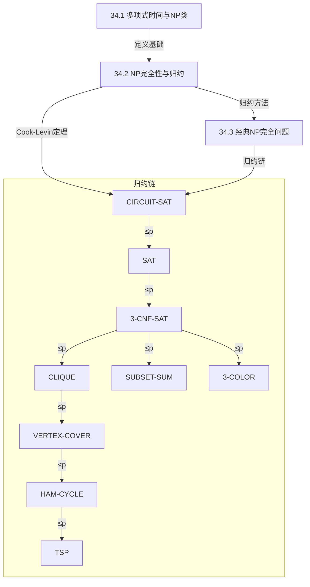

## 相关笔记

- [[34.1 多项式时间与NP类]]
- [[34.2 NP完全性与归约]]
- [[34.3 经典NP完全问题]]
- 前置章节：[[第33章_机器学习算法-章节汇总]]

> [!abstract] 概览
> 第34章系统阐述了计算复杂性理论的核心框架——**NP完全性理论**。全章从**多项式时间**的计算模型出发，严格定义了 **P类**（确定型多项式时间可判定）、**NP类**（多项式时间可验证）等复杂度类，进而引入**多项式时间归约**（$\leq_p$）作为问题难度比较的工具。在此基础上，定义了 **NP-hard** 与 **NP-complete** 两个关键概念，并通过 **Cook-Levin定理** 证明了 SAT 问题是 NP 完全的——这是整个 NP 完全性理论的基石。随后，章节构建了一条从 CIRCUIT-SAT 出发的经典归约链：CIRCUIT-SAT $\leq_p$ SAT $\leq_p$ 3-CNF-SAT $\leq_p$ CLIQUE $\leq_p$ VERTEX-COVER $\leq_p$ HAM-CYCLE $\leq_p$ TSP，以及 3-CNF-SAT 到 SUBSET-SUM、3-COLOR 的分支归约，展示了如何通过归约不断扩展已知 NP 完全问题的集合。全章的核心结论是：若 P $\neq$ NP，则所有 NP 完全问题都不存在多项式时间算法。

## 知识结构图

## 核心概念回顾

| 复杂度类 | 定义 | 直观含义 | 代表问题 |
|:---:|:---|:---|:---|
| **P** | 确定型多项式时间可判定 | "容易求解" | 排序、最短路径、字符串匹配 |
| **NP** | 多项式时间可验证 | "容易验证" | SAT、CLIQUE、HAM-CYCLE |
| **NP-hard** | 所有NP问题可归约到它 | "至少和NP一样难" | 停机问题、优化版TSP |
| **NP-complete** | NP-hard $\cap$ NP | "NP中最难" | SAT、3-CNF-SAT、CLIQUE、VERTEX-COVER |
| **co-NP** | NP的补类 | "否实例容易验证" | TAUTOLOGY、UNSAT |

## 跨章关联

- **Ch31 数论算法**：RSA安全性基于整数分解的困难性（NP中间问题候选）。整数分解既未被证明属于 P，也未被证明是 NP 完全的，它很可能处于 P 与 NP-complete 之间的"中间地带"，这一地位直接支撑了现代密码学的安全假设。
- **Ch32 字符串匹配**：字符串匹配 $\in$ P，与 NP 完全的子串问题形成鲜明对比。字符串匹配问题（如 KMP 算法、Rabin-Karp 算法）可以在 $O(n+m)$ 时间内求解，而寻找最长公共子序列（LCS）虽然是多项式时间的，但许多字符串相关的优化问题（如最长公共超序列的某些变体）则是 NP 完全的。
- **Ch33 机器学习**：许多ML优化问题（如k-means）是NP困难的。k-means聚类的最优解在一般维度下已被证明是 NP 困难的，这意味着实际应用中依赖启发式算法（如Lloyd算法）只能找到局部最优解，而非全局最优解。
- **Ch6 堆排序 / Ch22 最短路径**：P类问题的典型代表。堆排序在 $O(n \lg n)$ 时间内完成排序，Dijkstra算法和Bellman-Ford算法分别在 $O(V^2)$（或 $O((V+E)\lg V)$）和 $O(VE)$ 时间内求解单源最短路径问题，这些都是"容易求解"的P类问题的经典范例。
- **Ch35 近似算法**：NP完全问题的实际求解策略。由于NP完全问题（在P $\neq$ NP的前提下）不存在精确的多项式时间算法，近似算法提供了一种折中方案：在多项式时间内找到"足够好"的解。例如，顶点覆盖问题有2-近似算法，旅行商问题（满足三角不等式时）有1.5-近似算法。

---

## 综合复习题

> [!faq]- 题1：证明若 $L \in P$ 且 $L$ 是 NP-hard 的，则 $P = NP$
> **题目描述**：设语言 $L$ 同时满足 $L \in P$ 和 $L$ 是 NP-hard 的，证明 $P = NP$。
>
> **解题思路提示**：利用 NP-hard 的定义——每个 NP 问题都可以在多项式时间内归约到 $L$；再利用 $L \in P$ 意味着 $L$ 可以在多项式时间内求解。将这两步串联起来。
>
> **完整标准答案**：
>
> 证明如下：
>
> 1. 任取一个语言 $L' \in NP$。
> 2. 因为 $L$ 是 NP-hard 的，根据定义，存在多项式时间归约 $L' \leq_p L$，即存在多项式时间可计算的函数 $f$，使得对所有 $x$，有 $x \in L' \iff f(x) \in L$。
> 3. 因为 $L \in P$，存在多项式时间算法 $A$ 判定 $L$。
> 4. 构造判定 $L'$ 的算法：对输入 $x$，先计算 $f(x)$（多项式时间），再用算法 $A$ 判定 $f(x) \in L$（多项式时间）。两步串联仍为多项式时间。
> 5. 因此 $L' \in P$。
> 6. 由 $L'$ 的任意性，$NP \subseteq P$。
> 7. 又已知 $P \subseteq NP$（多项式时间算法本身就是验证算法），故 $P = NP$。$\blacksquare$

> [!faq]- 题2：给定归约链 SAT $\leq_p$ 3-CNF-SAT $\leq_p$ CLIQUE，证明 CLIQUE 是 NP-hard 的
> **题目描述**：已知 SAT $\leq_p$ 3-CNF-SAT 且 3-CNF-SAT $\leq_p$ CLIQUE，证明 CLIQUE 是 NP-hard 的。
>
> **解题思路提示**：NP-hard 的定义是"所有 NP 问题都可多项式时间归约到它"。利用多项式时间归约的传递性，从已知的 NP-hard 问题出发。
>
> **完整标准答案**：
>
> 证明如下：
>
> 1. 由 Cook-Levin 定理，SAT 是 NP-hard 的，即对所有 $L \in NP$，有 $L \leq_p$ SAT。
> 2. 已知 SAT $\leq_p$ 3-CNF-SAT，即存在多项式时间归约将 SAT 实例转化为 3-CNF-SAT 实例。
> 3. 已知 3-CNF-SAT $\leq_p$ CLIQUE，即存在多项式时间归约将 3-CNF-SAT 实例转化为 CLIQUE 实例。
> 4. 由多项式时间归约的**传递性**（若 $L_1 \leq_p L_2$ 且 $L_2 \leq_p L_3$，则 $L_1 \leq_p L_3$），可得 SAT $\leq_p$ CLIQUE。
> 5. 综合步骤1和步骤4：对所有 $L \in NP$，有 $L \leq_p$ SAT $\leq_p$ CLIQUE，即 $L \leq_p$ CLIQUE。
> 6. 由 NP-hard 的定义，CLIQUE 是 NP-hard 的。$\blacksquare$
>
> **补充说明**：要证明 CLIQUE 是 NP-complete 的，还需要额外证明 CLIQUE $\in$ NP。这可以通过构造多项式时间的验证算法完成：给定图 $G$ 和整数 $k$，以及一个"证书"（候选团中的顶点集合），只需验证该集合中的顶点两两相邻且数量 $\geq k$，这一验证可在 $O(k^2)$ 时间内完成。

> [!faq]- 题3：解释为什么 2-SAT $\in$ P 而 3-SAT 是 NP-complete，这一差异说明了什么
> **题目描述**：2-SAT（每个子句恰好包含2个文字的可满足性问题）属于 P 类，而 3-SAT（每个子句恰好包含3个文字的可满足性问题）是 NP 完全的。请解释造成这一差异的原因，并讨论这一现象的深层含义。
>
> **解题思路提示**：从问题结构的差异入手——2-SAT 的约束图具有特殊的结构性质（强连通分量），而 3-SAT 的约束图不具备这种性质。思考"增加一个文字"为何会导致计算复杂度的本质飞跃。
>
> **完整标准答案**：
>
> **差异原因**：
>
> 2-SAT 可以在多项式时间内求解，其核心算法基于**蕴含图（implication graph）**：
> - 将每个变量 $x_i$ 拆为两个顶点 $x_i$ 和 $\neg x_i$。
> - 每个子句 $(l_1 \lor l_2)$ 等价于两个蕴含：$\neg l_1 \Rightarrow l_2$ 和 $\neg l_2 \Rightarrow l_1$。
> - 在蕴含图中求强连通分量（SCC），2-SAT 可满足当且仅当没有任何变量及其否定在同一 SCC 中。
> - 使用 Kosaraju 或 Tarjan 算法求 SCC，时间复杂度为 $O(V+E)$，其中 $V = 2n$，$E = 2m$（$n$ 为变量数，$m$ 为子句数）。
>
> 3-SAT 是 NP 完全的，因为：
> - 3-SAT 是 SAT 的限制版本（SAT $\leq_p$ 3-CNF-SAT 已被证明），且 3-SAT $\in$ NP。
> - 3-SAT 的蕴含图不再具有 2-SAT 那样的"每个子句恰好产生两条蕴含边"的结构，导致强连通分量方法失效。
>
> **深层含义**：
>
> 这一差异揭示了计算复杂性理论中一个深刻的现象——**约束松紧度的微小变化可以导致问题难度的质变**。从2个文字增加到3个文字，看似只是量的变化，实则使得问题的组合搜索空间从可控变为指数级爆炸。这也说明，在 NP 完全性理论中，问题的精确参数化至关重要；对 NP 完全问题进行适当的限制，有可能将其"降级"到 P 类。

> [!faq]- 题4：判断以下命题的真假并说明理由："如果 P $\neq$ NP，则不存在任何 NP 问题的多项式时间算法"
> **题目描述**：判断命题"如果 P $\neq$ NP，则不存在任何 NP 问题的多项式时间算法"的真假，并给出严格论证。
>
> **解题思路提示**：仔细审视 NP 的定义。P $\neq$ NP 意味着什么？NP 中是否包含 P 的问题？
>
> **完整标准答案**：
>
> 该命题为**假**。
>
> **论证**：
>
> 1. 已知 $P \subseteq NP$（任何多项式时间可判定的问题，都可以用其判定算法本身作为验证算法，因此也属于 NP）。
> 2. P $\neq$ NP 意味着 $NP \not\subseteq P$，即存在至少一个 NP 问题不属于 P。
> 3. 但 P $\neq$ NP **并不排除** P 中的问题仍然属于 NP。事实上，P 中的所有问题（如排序、最短路径、字符串匹配等）仍然属于 NP，并且它们都有多项式时间算法。
> 4. 因此，"不存在任何 NP 问题的多项式时间算法"这一结论是错误的。
>
> **正确的表述**应为："如果 P $\neq$ NP，则存在至少一个 NP 问题不存在多项式时间算法"，或者更精确地说："如果 P $\neq$ NP，则所有 NP 完全问题都不存在多项式时间算法"。

---

## 常见误区

> [!warning] NP $\neq$ NP-complete
> NP-hard 不要求问题本身属于 NP。一个问题是 NP-hard 的，意味着所有 NP 问题都可以归约到它，但该问题本身可能不在 NP 中。例如，**停机问题**是 NP-hard 的（甚至更严格地，它是不可判定的），但它不属于 NP。NP-complete 是 NP-hard 与 NP 的交集，即同时满足"至少和NP一样难"和"本身属于NP"两个条件。因此，NP-complete $\subsetneq$ NP-hard，NP-complete $\subsetneq$ NP，三者是不同的集合。

> [!warning] P = NP 尚未被证明
> P 与 NP 是否相等是计算机科学中最著名的开放问题之一，也是克雷数学研究所七大千禧年难题之一（奖金100万美元）。截至当前，P = NP 既未被证明也未被证伪。在学术写作和问题分析中，**不能将 P = NP 或 P $\neq$ NP 当作已知事实使用**。所有基于"P $\neq$ NP"的结论（如"NP完全问题不存在多项式时间算法"）都是有条件的结论，必须明确标注前提假设。

> [!warning] NP完全性是最坏情况分类
> NP完全性是对问题**最坏情况**下的计算难度的分类。一个问题是 NP 完全的，并不意味着它的**所有实例**都很难求解。事实上，许多 NP 完全问题存在大量"容易"的特殊实例。例如：
> - SAT 问题中，如果公式本身不可满足或存在明显的单元传播（unit propagation）可以推导出赋值，求解可能非常快。
> - 在实际应用中，现代 SAT 求解器（如 DPLL 算法及其改进）能够在合理时间内求解包含数百万变量的工业级 SAT 实例。
> - 图着色问题对于平面图（四色定理保证4-可着色）有特殊的多项式时间算法。
>
> NP 完全性告诉我们的是"不存在对所有实例都有效的多项式时间算法"（在 P $\neq$ NP 的前提下），而非"每个实例都很难"。

## 学习要点总结

| 节号 | 主题 | 核心要点 | 掌握标准 |
|:---:|:---|:---|:---|
| 34.1-34.2 | 多项式时间与NP类 | P类定义、NP类定义、验证算法、$P \subseteq NP$ | 能构造验证算法证明问题 $\in$ NP |
| 34.3 | NP完全性与归约 | 多项式时间归约、NP-hard/NP-complete定义、Cook-Levin定理 | 能用三步法证明NP完全性 |
| 34.4 | NP完全性的证明 | CIRCUIT-SAT $\to$ SAT $\to$ 3-CNF-SAT归约链 | 能独立完成简单归约构造 |
| 34.5 | 经典NP完全问题 | CLIQUE/VERTEX-COVER/HAM-CYCLE/TSP/SUBSET-SUM/3-COLOR | 理解归约链和各问题定义 |

## 参见Wiki
- [[第34章_NP完全性/34.1 多项式时间与NP类]] — P类与NP类的形式化定义
- [[第34章_NP完全性/34.2 NP完全性与归约]] — NP完全性理论与Cook-Levin定理
- [[第34章_NP完全性/34.3 经典NP完全问题]] — 经典NPC问题归约链
- [[离散数学/concepts/可满足性]] — 布尔可满足性
- [[离散数学/concepts/布尔代数]] — 布尔运算基础

#学习/算法导论/第34章-NP完全性
