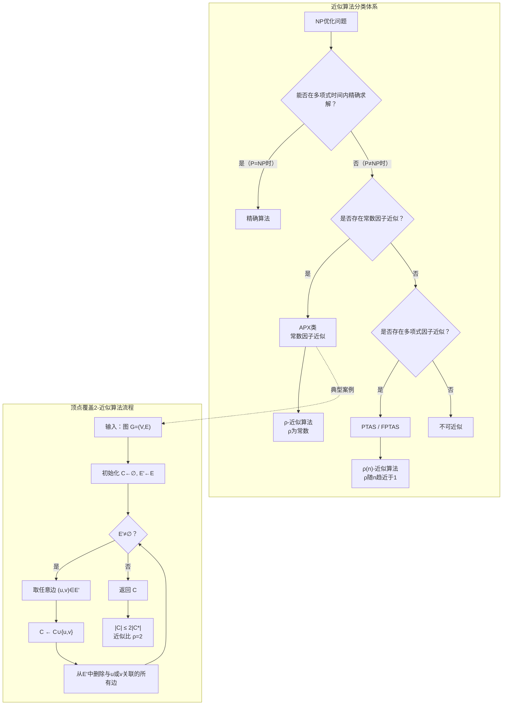

## 相关笔记
- 前置笔记：[[第34章_NP完全性-章节汇总]]
- 关联概念：[[34.3 经典NP完全问题]]、[[离散数学/concepts/图论]]、[[离散数学/concepts/二部图]]
- 章节汇总：[[第35章_近似算法-章节汇总]]

> [!abstract] 概览
> 本节是第35章"近似算法"的开篇，介绍==近似算法==（approximation algorithm）的基本理论框架，并以==顶点覆盖问题==（vertex cover problem）作为第一个完整案例进行深入分析。首先，我们阐述近似算法的动机——NP完全问题无法在多项式时间内精确求解（除非 P=NP），因此需要在多项式时间内找到"足够好"的解。接着，我们严格定义==近似比==（approximation ratio），区分最小化问题与最大化问题中的不同表述。在此基础上，我们引入==APX类==（APX complexity class）的概念——存在常数因子近似算法的NP优化问题类。随后，我们回顾顶点覆盖问题的定义与NP完全性，详细展示 APPROX-VERTEX-COVER 贪心算法的伪代码与执行流程，并通过逐步推导证明该算法是一个==2-近似算法==（2-approximation algorithm）。最后，我们通过一个具体实例完整演示算法的运行过程，直观展示近似比的实际含义。



## 核心思想

### 近似算法的动机

在第34章中，我们系统学习了NP完全性理论。Cook-Levin定理告诉我们，如果某个NP完全问题存在多项式时间的精确算法，则 $\mathbf{P} = \mathbf{NP}$。然而，经过数十年的研究，没有人找到任何NP完全问题的多项式时间精确算法，大多数计算机科学家相信 $\mathbf{P} \neq \mathbf{NP}$。

这意味着，对于大量实际中出现的NP完全问题——如旅行商问题、顶点覆盖问题、集合覆盖问题、装箱问题等——我们无法在多项式时间内找到最优解（除非 $\mathbf{P} = \mathbf{NP}$）。面对这一困境，我们有以下几种应对策略：

1. **精确算法（exponential-time exact algorithm）**：接受指数级运行时间，使用分支限界、动态规划等技术找到最优解。适用于小规模实例。
2. **启发式算法（heuristic algorithm）**：设计在实际中表现良好的算法，但不提供理论上的性能保证。适用于工程实践。
3. **近似算法（approximation algorithm）**：在多项式时间内找到一个解，并提供理论保证——该解与最优解之间的差距不超过某个已知的倍数。这是本节关注的重点。

近似算法的核心价值在于：它在"无法找到最优解"和"完全不求解"之间找到了一个平衡点。虽然近似解不一定是最优的，但我们有严格的数学证明来量化近似解与最优解之间的差距，这种可量化的保证使得近似算法在理论和实践中都具有重要的意义。

> [!tip] 近似算法的实用价值
> 近似算法在工业界有广泛应用。例如，物流公司使用旅行商问题的近似算法规划配送路线，芯片设计公司使用布局优化的近似算法进行VLSI设计，网络运营商使用集合覆盖的近似算法进行基站选址。这些场景中，"足够好"的解往往已经能满足实际需求，而精确求解则可能需要不可接受的时间。

### 近似比的定义

近似算法的性能由==近似比==（approximation ratio）来衡量。近似比是近似算法给出的解的质量与最优解质量之间的比值。

设 $\Pi$ 是一个最小化问题（minimization problem），$I$ 是问题 $\Pi$ 的一个实例，$C$ 是近似算法对实例 $I$ 给出的解的目标函数值，$C^*$ 是实例 $I$ 的最优解的目标函数值。

**最小化问题的近似比**：如果一个近似算法对问题 $\Pi$ 的所有实例 $I$ 都满足

$$C \leq \rho \cdot C^*$$

则称该算法是问题 $\Pi$ 的一个 $\rho$-近似算法（$\rho$-approximation algorithm），其中 $\rho \geq 1$。

对于最小化问题，$\rho$-近似算法保证近似解的代价不超过最优解的 $\rho$ 倍。$\rho$ 越接近 1，近似解越接近最优解。当 $\rho = 1$ 时，算法给出的是精确最优解。

**最大化问题的近似比**：设 $\Pi$ 是一个最大化问题（maximization problem），$C$ 是近似解的目标函数值，$C^*$ 是最优解的目标函数值。如果一个近似算法对问题 $\Pi$ 的所有实例 $I$ 都满足

$$C \geq \frac{C^*}{\rho}$$

则称该算法是问题 $\Pi$ 的一个 $\rho$-近似算法，其中 $\rho \geq 1$。

对于最大化问题，$\rho$-近似算法保证近似解的收益不低于最优解的 $1/\rho$ 倍。同样，$\rho$ 越接近 1 越好。

> [!tip] 近似比的统一理解
> 无论是最小化问题还是最大化问题，近似比 $\rho$ 都满足 $\rho \geq 1$，且 $\rho$ 越小表示近似解越接近最优解。可以将 $\rho$ 理解为"最坏情况下近似解偏离最优解的倍数"。$\rho = 1$ 意味着算法总能给出最优解，$\rho = 2$ 意味着最坏情况下近似解的质量是最优解的一半（最大化问题）或两倍（最小化问题）。

【近似比定义的严格形式化】设 $\Pi$ 是一个优化问题（optimization problem），$I$ 是 $\Pi$ 的实例，$\text{OPT}(I)$ 是实例 $I$ 的最优目标函数值，$A(I)$ 是近似算法 $A$ 对实例 $I$ 给出的目标函数值。

- 若 $\Pi$ 是最小化问题，$A$ 是 $\rho$-近似算法当且仅当：对所有实例 $I$，$A(I) \leq \rho \cdot \text{OPT}(I)$
- 若 $\Pi$ 是最大化问题，$A$ 是 $\rho$-近似算法当且仅当：对所有实例 $I$，$A(I) \geq \text{OPT}(I) / \rho$

注意：近似比的定义要求对所有实例都成立，而非仅对"大多数"实例成立。这是一个最坏情况（worst case）的保证。

【近似比与多项式时间的结合】$\rho$-近似算法还要求在多项式时间内运行。如果一个算法的近似比为 $\rho$ 但运行时间是指数级的，则它不是一个有效的近似算法——我们直接使用精确算法即可。因此，完整的定义是：

> 一个 $\rho$-近似算法是一个在多项式时间内运行的算法，且对所有实例 $I$，其输出的解的目标函数值 $A(I)$ 满足上述不等式。

### APX类

==APX类==（APX complexity class）是计算复杂性理论中的一个重要概念，它包含所有存在常数因子多项式时间近似算法的NP优化问题。

$$\text{APX} = \{\Pi : \Pi \text{ 是NP优化问题，且存在常数 } \rho \geq 1 \text{ 和多项式时间 } \rho\text{-近似算法}\}$$

APX中的"APX"是"approximable"的缩写。一个问题属于APX，意味着我们可以在多项式时间内找到一个解，其质量与最优解之间的差距不超过某个固定的常数倍。

**APX-hard**：如果APX中的每个问题都可以通过PTAS归约（PTAS reduction）归约到问题 $\Pi$，则称 $\Pi$ 是APX-hard的。APX-hard问题至少和APX中的任何问题一样"难以近似"。

**APX-complete**：如果 $\Pi$ 既是APX-hard的，又属于APX，则称 $\Pi$ 是APX-complete的。APX-complete问题是APX类中"最难"的问题——它们有常数因子近似算法，但不存在PTAS（多项式时间近似方案），除非 $\mathbf{P} = \mathbf{NP}$。

> [!tip] PTAS与FPTAS
> PTAS（Polynomial-Time Approximation Scheme）是一种更强的近似算法：对于任意给定的 $\epsilon > 0$，PTAS能在多项式时间内找到 $(1+\epsilon)$-近似解（最小化问题）。注意，PTAS的运行时间可以依赖于 $1/\epsilon$，即当 $\epsilon$ 非常小时，运行时间可能很长。FPTAS（Fully Polynomial-Time Approximation Scheme）进一步要求运行时间是输入规模和 $1/\epsilon$ 的多项式。FPTAS是近似算法中能提供的最好保证之一。

### 顶点覆盖问题回顾

==顶点覆盖问题==（Vertex Cover Problem, VERTEX-COVER）是一个经典的NP完全优化问题，定义如下：

**问题定义**：给定无向图 $G = (V, E)$，找到一个最小基数的顶点集 $C \subseteq V$，使得 $G$ 中的每条边至少有一个端点在 $C$ 中。形式化地：

$$C \subseteq V, \quad \forall (u, v) \in E: u \in C \text{ 或 } v \in C$$

目标是最小化 $|C|$。

> [!tip] 顶点覆盖的直观理解
> 可以将顶点覆盖想象为"监控摄像头"问题：图中的每条边代表一条走廊，每个顶点代表走廊交汇点。我们需要在尽可能少的交汇点安装摄像头，使得每条走廊都至少被一个摄像头监控到。顶点覆盖就是满足条件的最少摄像头数量。

**顶点覆盖的NP完全性**：在第34章中（参见[[34.3 经典NP完全问题]]），我们已经知道VERTEX-COVER是NP完全的。具体而言：
- VERTEX-COVER $\in$ NP：给定一个候选顶点集 $C$，可以在 $O(|E|)$ 时间内验证 $C$ 是否覆盖了所有边
- VERTEX-COVER是NP-hard：可以通过从3-SAT或CLIQUE归约来证明

由于VERTEX-COVER是NP完全的，除非 $\mathbf{P} = \mathbf{NP}$，否则不存在多项式时间的精确算法。因此，我们需要转向近似算法。

### APPROX-VERTEX-COVER 算法

CLRS给出的APPROX-VERTEX-COVER算法是一个基于贪心策略的2-近似算法。其核心思想非常简洁：每次选取一条边，将该边的两个端点都加入顶点覆盖，然后删除所有与这两个端点关联的边。重复这一过程直到所有边都被覆盖。

**算法伪代码**：

```
APPROX-VERTEX-COVER(G)
  C ← ∅
  E' ← E[G]
  while E' ≠ ∅ do
      取任意边 (u, v) ∈ E'
      C ← C ∪ {u, v}
      从 E' 中删除所有与 u 或 v 关联的边
  return C
```

**算法各步骤详解**：

1. **第1行**：初始化顶点覆盖集合 $C$ 为空集 $\emptyset$。$C$ 将最终包含算法选出的所有顶点。

2. **第2行**：创建边集 $E'$ 的副本，初始时 $E' = E[G]$，即图 $G$ 的所有边。$E'$ 用于跟踪尚未被覆盖的边。

3. **第3行**：进入主循环。循环条件 $E' \neq \emptyset$ 表示还有未被覆盖的边。

4. **第4行**：从 $E'$ 中任意选取一条边 $(u, v)$。"任意"意味着可以选取 $E'$ 中的任何一条边，算法的正确性和近似比不依赖于具体选取哪条边。

5. **第5行**：将边 $(u, v)$ 的两个端点 $u$ 和 $v$ 都加入顶点覆盖集合 $C$。

6. **第6行**：从 $E'$ 中删除所有与 $u$ 或 $v$ 关联的边。这是因为加入 $u$ 和 $v$ 后，所有以 $u$ 或 $v$ 为端点的边都已经被覆盖了。

7. **第7行**：循环结束后，返回 $C$。

> [!tip] 算法的贪心本质
> 该算法的贪心策略体现在每一步都"贪心地"选择一条边并将其两个端点全部纳入覆盖。虽然每次选择看起来"浪费"（可能只需要一个端点就够了），但这种策略保证了算法的简单性和多项式时间复杂度，同时提供了近似比为2的理论保证。

### 算法的正确性证明

我们需要证明两件事：(1) 算法返回的集合 $C$ 确实是图 $G$ 的一个顶点覆盖；(2) $|C| \leq 2|C^*|$，其中 $C^*$ 是最优顶点覆盖。

**正确性（$C$ 是顶点覆盖）**：

当算法终止时，$E' = \emptyset$。算法只在第6行从 $E'$ 中删除边，删除的条件是边的至少一个端点被加入 $C$。因此，$E$ 中的每条边在某个时刻被删除时，其至少一个端点已经在 $C$ 中。这意味着 $C$ 覆盖了 $E$ 中的所有边，即 $C$ 是一个合法的顶点覆盖。

**近似比（$|C| \leq 2|C^*|$）**：

为了证明近似比，我们引入以下记号：

- $A$：算法在while循环中选出的边的集合。设while循环共执行了 $k$ 次迭代，则 $A = \{(u_1, v_1), (u_2, v_2), \ldots, (u_k, v_k)\}$，$|A| = k$
- $C$：算法返回的顶点覆盖。由于每次迭代将2个顶点加入 $C$，$|C| = 2k = 2|A|$
- $C^*$：最优顶点覆盖

证明的关键在于建立 $|A|$ 与 $|C^*|$ 之间的关系。我们分两步进行：

**第一步：$A$ 中的边两两不相邻（matching性质）**

我们需要证明 $A$ 中的任意两条边没有公共端点。采用反证法：

假设 $A$ 中存在两条边 $e_i = (u_i, v_i)$ 和 $e_j = (u_j, v_j)$（$i < j$）共享一个公共端点。不失一般性，设 $u_i = u_j$。

在算法的第 $i$ 次迭代中，边 $e_i = (u_i, v_i)$ 被选中，$u_i$ 和 $v_i$ 被加入 $C$。然后在第6行，所有与 $u_i$ 或 $v_i$ 关联的边都从 $E'$ 中被删除。由于 $e_j = (u_i, v_j)$ 与 $u_i$ 关联，$e_j$ 在第 $i$ 次迭代中就已经从 $E'$ 中被删除了。

但在第 $j$ 次迭代中（$j > i$），算法从 $E'$ 中选取边 $e_j$。由于 $e_j$ 已经在第 $i$ 次迭代中被删除，它不可能在第 $j$ 次迭代中仍存在于 $E'$ 中。这与 $e_j \in A$ 矛盾。

因此，$A$ 中的任意两条边不可能共享公共端点，即 $A$ 是图 $G$ 的一个==匹配==（matching）。

**第二步：$|C^*| \geq |A|$**

由于 $C^*$ 是一个顶点覆盖，它必须覆盖 $A$ 中的每条边。对于 $A$ 中的每条边 $e = (u, v)$，$C^*$ 至少包含 $u$ 或 $v$ 中的一个。

由于 $A$ 是一个匹配（任意两条边没有公共端点），$A$ 中的每条边都需要 $C^*$ 中不同的顶点来覆盖。具体而言，$A$ 中有 $|A|$ 条边，每条边至少需要 $C^*$ 中的一个顶点，且不同边需要的顶点互不相同（因为边之间没有公共端点）。因此：

$$|C^*| \geq |A|$$

**第三步：综合得到近似比**

$$|C| = 2|A| \leq 2|C^*|$$

因此，$|C| / |C^*| \leq 2$，即近似比 $\rho = 2$。

> [!tip] 证明的核心思路
> 证明的核心在于构造一个"桥梁"——集合 $A$。$A$ 中的边构成一个匹配，而任何顶点覆盖都必须至少包含匹配中每条边的一个端点。匹配的大小为 $|A|$，因此最优顶点覆盖至少需要 $|A|$ 个顶点。算法恰好选了 $2|A|$ 个顶点，因此近似比为2。这种"通过匹配建立下界"的证明技巧在近似算法中非常常见。

### 实例演示

为了直观理解算法的执行过程和近似比的实际含义，我们用一个具体实例进行完整演示。

**实例**：考虑无向图 $G = (V, E)$，其中：
- $V = \{v_1, v_2, v_3, v_4, v_5\}$
- $E = \{(v_1, v_2), (v_1, v_3), (v_1, v_4), (v_2, v_3), (v_2, v_5), (v_3, v_4), (v_4, v_5)\}$

该图有5个顶点和7条边。

**算法执行过程**：

**初始状态**：
- $C = \emptyset$
- $E' = \{(v_1, v_2), (v_1, v_3), (v_1, v_4), (v_2, v_3), (v_2, v_5), (v_3, v_4), (v_4, v_5)\}$

**第1次迭代**：
- 从 $E'$ 中选取边 $(v_1, v_2)$（任意选取）
- $C = \{v_1, v_2\}$
- 删除与 $v_1$ 关联的边：$(v_1, v_2)$, $(v_1, v_3)$, $(v_1, v_4)$
- 删除与 $v_2$ 关联的边：$(v_2, v_3)$, $(v_2, v_5)$
- $E' = \{(v_3, v_4), (v_4, v_5)\}$

**第2次迭代**：
- 从 $E'$ 中选取边 $(v_3, v_4)$
- $C = \{v_1, v_2, v_3, v_4\}$
- 删除与 $v_3$ 关联的边：$(v_3, v_4)$
- 删除与 $v_4$ 关联的边：$(v_4, v_5)$
- $E' = \emptyset$

**循环结束**，返回 $C = \{v_1, v_2, v_3, v_4\}$，$|C| = 4$。

**验证正确性**：
- $(v_1, v_2)$：$v_1 \in C$ ✓
- $(v_1, v_3)$：$v_1 \in C$ ✓
- $(v_1, v_4)$：$v_1 \in C$ ✓
- $(v_2, v_3)$：$v_2 \in C$ ✓
- $(v_2, v_5)$：$v_2 \in C$ ✓
- $(v_3, v_4)$：$v_3 \in C$ ✓
- $(v_4, v_5)$：$v_4 \in C$ ✓

所有边都被覆盖，$C$ 是合法的顶点覆盖。

**最优解分析**：
观察图的结构，$C^* = \{v_1, v_2, v_4\}$ 是一个顶点覆盖：
- $(v_1, v_2)$：$v_1 \in C^*$ ✓
- $(v_1, v_3)$：$v_1 \in C^*$ ✓
- $(v_1, v_4)$：$v_1 \in C^*$ ✓
- $(v_2, v_3)$：$v_2 \in C^*$ ✓
- $(v_2, v_5)$：$v_2 \in C^*$ ✓
- $(v_3, v_4)$：$v_4 \in C^*$ ✓
- $(v_4, v_5)$：$v_4 \in C^*$ ✓

$|C^*| = 3$，验证近似比：$|C| / |C^*| = 4/3 \leq 2$ ✓。

**匹配 $A$ 的分析**：
$A = \{(v_1, v_2), (v_3, v_4)\}$，$|A| = 2$。
- $A$ 中两条边没有公共端点 ✓（$v_1 \neq v_3, v_4$，$v_2 \neq v_3, v_4$）
- $|C^*| = 3 \geq |A| = 2$ ✓
- $|C| = 4 = 2|A| \leq 2|C^*| = 6$ ✓

> [!tip] 实例中的近似比
> 在这个实例中，近似解的大小为4，最优解的大小为3，实际比值为 $4/3 \approx 1.33$，远好于理论保证的2。这说明近似比 $\rho = 2$ 是一个最坏情况的上界，对于许多具体实例，算法的实际表现可能远好于这个上界。

### 算法的时间复杂度分析

APPROX-VERTEX-COVER的运行时间分析如下：

- while循环最多执行 $|E|/2$ 次（每次至少删除2条边——选中的边本身以及至少一条与之共享端点的边，但最坏情况下每次只删除1条边对应的2个端点关联的所有边）
- 实际上，while循环最多执行 $|V|/2$ 次，因为每次迭代将2个新顶点加入 $C$，而 $|C| \leq |V|$
- 每次迭代中，选取边和删除关联边的操作可以在 $O(|E|)$ 时间内完成（使用邻接表表示）
- 总运行时间为 $O(|V| \cdot |E|)$

使用更精细的数据结构（如标记数组记录哪些边已被删除），可以将总运行时间优化到 $O(|V| + |E|)$。

### 近似比紧性分析

近似比 $\rho = 2$ 是否可以进一步改进？考虑以下反例：

**紧性实例**：完全二部图 $K_{n,n}$（两个集合各 $n$ 个顶点，每个顶点与对面的所有顶点相连）。

- $|V| = 2n$，$|E| = n^2$
- 最优顶点覆盖 $C^*$：取任意一个集合中的所有 $n$ 个顶点，$|C^*| = n$
- APPROX-VERTEX-COVER的执行：每次选取一条边，加入2个顶点，删除 $2n-1$ 条边。经过 $n$ 次迭代后，$E' = \emptyset$，$|C| = 2n$
- 近似比：$|C| / |C^*| = 2n / n = 2$

更简单的紧性实例：图 $G$ 只有一条边 $(u, v)$。
- 最优顶点覆盖 $C^* = \{u\}$（或 $\{v\}$），$|C^*| = 1$
- APPROX-VERTEX-COVER选取边 $(u, v)$，$C = \{u, v\}$，$|C| = 2$
- 近似比：$|C| / |C^*| = 2/1 = 2$

因此，$\rho = 2$ 是紧的（tight），即存在实例使得近似比恰好达到2。

> [!tip] 能否改进到 ρ < 2？
> 对于一般的顶点覆盖问题，能否设计一个 $\rho < 2$ 的多项式时间近似算法？这是一个长期未解决的重要问题。目前最好的结果是 $\rho \approx 1.36$（基于半定规划舍入），但这一结果依赖于唯一博弈猜想（Unique Games Conjecture, UGC）的假设。如果 UGC 成立，则 $\rho \approx 1.36$ 是多项式时间算法能达到的最好近似比。如果 UGC 不成立，则可能存在更好的近似算法。

## 补充理解

> [!info] 顶点覆盖2-近似算法的完整证明与扩展
> CMU 15-451/651 算法课程（2025春季）的 Lecture 19 讲义详细讲解了顶点覆盖的2-近似算法，包括基于贪心匹配的证明和基于线性规划松弛的证明两种方法。讲义还分析了LP松弛的整数间隙（integrality gap）恰好为2，这解释了为什么基于LP舍入的方法也无法突破近似比2的界限。此外，讲义还介绍了半定规划（SDP）松弛如何将近似比改进到 $2 - \Theta(1/\sqrt{\log n})$。
> 参考：https://www.cs.cmu.edu/~15451-s25/notes/lecture19.pdf

> [!info] APX复杂度类与PCP定理的不可近似性理论
> APX（approximable）是计算复杂性理论中的一个核心复杂度类，包含所有存在常数因子多项式时间近似算法的NP优化问题。APX-hard问题是通过PTAS归约定义的——如果APX中的每个问题都可以PTAS归约到某个问题，则该问题是APX-hard的。PCP定理（Probabilistically Checkable Proofs Theorem）是证明不可近似性结果的关键工具：它表明MAX-3SAT不存在 $(7/8 + \epsilon)$-近似算法（除非P=NP），这一结果通过归约可以推出许多其他问题的不可近似性下界。PCP定理与APX-hard的判定密切相关，许多APX-complete问题（如MAX-3SAT、MIN-VERTEX-COVER的加权版本）的不可近似性都依赖于PCP定理。
> 参考：https://www.gpedia.com/en/APX

> [!info] 顶点覆盖近似比的不可改进性与唯一博弈猜想
> 顶点覆盖问题的近似比下界是近似算法理论中的核心问题之一。Dinur和Safra（2002）证明了除非P=NP，顶点覆盖不存在 $(10\sqrt{5} - 21)\epsilon$-近似算法（约1.3606）。Khot和Regev（2008）提出了唯一博弈猜想（Unique Games Conjecture, UGC），并证明了如果UGC成立，则顶点覆盖不存在 $(\sqrt{2} - \epsilon)$-近似算法（约1.414）。目前基于半定规划（SDP）的最好算法能达到 $2 - \Theta(1/\sqrt{\log n})$ 的近似比，而基于UGC的下界为 $\sqrt{2} - \epsilon$。这之间存在一个显著的间隙，顶点覆盖的精确不可近似性阈值仍然是一个开放问题。
> 参考：https://iris.joshua-becker.com/lab/vertex-cover/

> [!info] NP优化问题的近似算法综述
> Cornell大学的Gomes和Williams在近似算法综述中系统介绍了近似算法的设计技术，包括贪心算法、线性规划松弛与舍入、原始对偶方法、随机化方法等。综述指出，近似算法与不可近似性结果共同刻画了NP优化问题的"可解性边界"——有些问题存在PTAS（如背包问题），有些问题存在常数因子近似（如顶点覆盖），有些问题则连常数因子近似都不存在（如最大团问题）。这种分类为算法设计者提供了清晰的指导：对于给定问题，我们应该追求什么样的近似比，以及哪些近似比是不可能达到的。
> 参考：https://cs.cornell.edu/gomes/MYPAPERS/gomes-williams05.pdf

## 易混淆点

> [!warning] 近似比的定义因问题类型而异
> 最小化问题和最大化问题的近似比定义不同：最小化问题要求 $C \leq \rho \cdot C^*$（近似解不超过最优解的 $\rho$ 倍），最大化问题要求 $C \geq C^* / \rho$（近似解不低于最优解的 $1/\rho$ 倍）。如果混淆了两种定义，会导致对近似算法性能的错误评估。例如，一个最小化问题的2-近似算法给出的解最多是最优解的2倍，而一个最大化问题的2-近似算法给出的解至少是最优解的一半——两者的"好"的方向完全不同。

> [!warning] 近似比是最坏情况保证，不是平均情况
> 近似比 $\rho$ 是对所有实例的最坏情况保证。对于许多具体实例，近似算法的实际表现可能远好于 $\rho$。例如，APPROX-VERTEX-COVER的近似比为2，但在某些实例上可能给出最优解（如当图本身就是完全二部图且算法恰好选对了边时）。不能因为某个实例上近似算法表现好就认为近似比被高估了，也不能因为某个实例上表现差就认为近似比被低估了——近似比是严格的数学上界。

> [!warning] 匹配与顶点覆盖的区别
> 匹配（matching）和顶点覆盖（vertex cover）是图论中两个相关但不同的概念。匹配是边的集合，要求任意两条边没有公共端点；顶点覆盖是顶点的集合，要求每条边至少有一个端点在集合中。在本节的证明中，我们利用了匹配来建立顶点覆盖的下界：任何顶点覆盖都必须至少包含最大匹配中每条边的一个端点。对于一般图，最小顶点覆盖的大小与最大匹配的大小之间没有简单的等式关系（这与二部图中Konig定理的结论不同，参见[[离散数学/concepts/二部图]]）。在一般图中，最小顶点覆盖的大小可以是最大匹配大小的2倍。

## 习题精选

| 题号 | 题目描述 | 难度/考点 |
|:---:|:---|:---|
| 35.1-1 | 给出一个图 $G$ 的实例，使得 APPROX-VERTEX-COVER 返回的顶点覆盖是最优解的两倍大 | 基础/近似比紧性 |
| 35.1-2 | 证明集合 $C$ 由 APPROX-VERTEX-COVER 产生的边集 $A$ 中的边所关联的顶点组成 | 基础/算法正确性 |
| 35.1-3 | 证明 APPROX-VERTEX-COVER 是一个多项式时间算法 | 基础/复杂度分析 |
| 35.1-4 | Professor Borden提出一个贪心算法：每次选择度数最高的顶点加入 $C$，删除其关联边。证明该算法的近似比可以任意大 | 进阶/反例构造 |
| 35.1-5 | 给出一个多项式时间的2-近似算法用于如下问题：给定无向图 $G=(V,E)$ 和权函数 $w: V \to \mathbb{R}^+$，找最小权顶点覆盖 | 进阶/加权推广 |

> [!faq]- 习题 35.1-1：构造近似比达到2的实例
> **题目**：给出一个图 $G$ 的实例，使得 APPROX-VERTEX-COVER 返回的顶点覆盖是最优解的两倍大。
>
> **解题思路**：需要构造一个图，使得算法选出的边恰好构成一个最大匹配，而最优顶点覆盖恰好等于最大匹配的大小。
>
> **标准答案**：
> 考虑完全二部图 $K_{n,n}$，其中两个顶点集合分别为 $L = \{l_1, l_2, \ldots, l_n\}$ 和 $R = \{r_1, r_2, \ldots, r_n\}$，边集为 $E = \{(l_i, r_j) : 1 \leq i, j \leq n\}$。
>
> - 最优顶点覆盖 $C^* = L$（或 $R$），$|C^*| = n$
> - APPROX-VERTEX-COVER 的执行：每次选取一条边 $(l_i, r_j)$，将 $l_i$ 和 $r_j$ 加入 $C$，删除所有与 $l_i$ 或 $r_j$ 关联的边（共 $2n - 1$ 条）。经过 $n$ 次迭代后，$E' = \emptyset$，$C = L \cup R = V$，$|C| = 2n$
> - 近似比：$|C| / |C^*| = 2n / n = 2$
>
> 更简单的实例：图 $G$ 只有一条边 $(u, v)$，$V = \{u, v\}$，$E = \{(u, v)\}$。
> - 最优顶点覆盖 $C^* = \{u\}$，$|C^*| = 1$
> - APPROX-VERTEX-COVER 选取边 $(u, v)$，$C = \{u, v\}$，$|C| = 2$
> - 近似比：$|C| / |C^*| = 2$

> [!faq]- 习题 35.1-2：证明 $C$ 由 $A$ 中边的端点组成
> **题目**：证明集合 $C$ 由 APPROX-VERTEX-COVER 产生的边集 $A$ 中的边所关联的顶点组成。
>
> **解题思路**：直接根据算法的执行过程分析 $C$ 和 $A$ 之间的关系。
>
> **标准答案**：
> 设 $A$ 是算法在while循环中选出的所有边的集合，即 $A = \{e_1, e_2, \ldots, e_k\}$，其中 $e_i = (u_i, v_i)$ 是第 $i$ 次迭代选取的边。
>
> 根据算法第5行，每次迭代将所选边 $(u_i, v_i)$ 的两个端点 $u_i$ 和 $v_i$ 加入 $C$。因此：
>
> $$C = \{u_1, v_1, u_2, v_2, \ldots, u_k, v_k\}$$
>
> 这正是 $A$ 中所有边的端点的集合。形式化地：
>
> $$C = \bigcup_{(u,v) \in A} \{u, v\}$$
>
> 注意，由于 $A$ 是一个匹配（如正确性证明中所证），$A$ 中不同边的端点互不相同，因此 $|C| = 2|A|$。如果 $A$ 不是匹配（即存在共享端点的边），则 $|C| < 2|A|$，但我们在正确性证明中已经排除了这种情况。

> [!faq]- 习题 35.1-3：证明多项式时间复杂度
> **题目**：证明 APPROX-VERTEX-COVER 是一个多项式时间算法。
>
> **解题思路**：分析算法中每个操作的时间复杂度，并计算总运行时间。
>
> **标准答案**：
> 设图 $G = (V, E)$，$n = |V|$，$m = |E|$。
>
> 1. **初始化**（第1-2行）：$C \leftarrow \emptyset$ 需要 $O(1)$ 时间；$E' \leftarrow E[G]$ 需要 $O(m)$ 时间（复制边集）
>
> 2. **while循环次数**：每次迭代至少将2个顶点加入 $C$，且 $C \subseteq V$，因此循环最多执行 $\lfloor n/2 \rfloor$ 次
>
> 3. **每次迭代的操作**：
>    - 选取任意边 $(u, v) \in E'$：$O(1)$ 时间
>    - $C \leftarrow C \cup \{u, v\}$：$O(1)$ 时间
>    - 从 $E'$ 中删除与 $u$ 或 $v$ 关联的边：需要遍历 $E'$，检查每条边是否与 $u$ 或 $v$ 关联，最坏情况 $O(m)$ 时间
>
> 4. **总运行时间**：$O(m) + \lfloor n/2 \rfloor \times O(m) = O(nm)$
>
> 使用邻接表和标记数组优化：维护一个布尔数组 `deleted[]` 标记哪些边已被删除，每次迭代只需遍历 $u$ 和 $v$ 的邻接表，总运行时间可优化为 $O(n + m)$。
>
> 无论哪种实现，$O(nm)$ 或 $O(n + m)$ 都是 $n$ 和 $m$ 的多项式，因此 APPROX-VERTEX-COVER 是多项式时间算法。

> [!faq]- 习题 35.1-4：度数贪心算法的近似比可以任意大
> **题目**：Professor Borden提出一个贪心算法：每次选择度数最高的顶点加入 $C$，删除其关联边。证明该算法的近似比可以任意大。
>
> **解题思路**：构造一个反例图，使得度数贪心算法选出的顶点覆盖远大于最优顶点覆盖。
>
> **标准答案**：
> 构造如下图 $G_k$（$k$ 为任意正整数）：
> - 顶点集 $V = \{u, v\} \cup \{w_1, w_2, \ldots, w_k\}$
> - 边集 $E = \{(u, w_i) : 1 \leq i \leq k\} \cup \{(v, w_i) : 1 \leq i \leq k\}$
>
> 即 $G_k$ 是一个"双星图"：两个中心顶点 $u$ 和 $v$ 各自连接到 $k$ 个叶子顶点 $w_1, \ldots, w_k$，$u$ 和 $v$ 之间没有边。
>
> - 顶点 $u$ 的度数为 $k$，顶点 $v$ 的度数为 $k$，每个 $w_i$ 的度数为 2
>
> **度数贪心算法的执行**：
> - 第1步：选择度数最高的顶点（$u$ 或 $v$，度数为 $k$），假设选择 $u$。$C = \{u\}$，删除 $u$ 的所有关联边
> - 第2步：$v$ 的度数变为 $k$（因为 $v$ 与 $w_i$ 的边未被删除），选择 $v$。$C = \{u, v\}$，删除 $v$ 的所有关联边
> - $E' = \emptyset$，算法结束，$C = \{u, v\}$，$|C| = 2$
>
> **最优顶点覆盖**：$C^* = \{w_1, w_2, \ldots, w_k\}$，$|C^*| = k$。验证：每条边 $(u, w_i)$ 被 $w_i$ 覆盖，每条边 $(v, w_i)$ 被 $w_i$ 覆盖。
>
> **近似比**：$|C| / |C^*| = 2/k$。当 $k \to \infty$ 时，$2/k \to 0$。
>
> 此处需要重新审视。度数贪心算法给出 $|C| = 2$，最优解 $|C^*| = k$。由于这是最小化问题，近似比应该是 $|C| / |C^*| = 2/k < 1$，这不可能——度数贪心算法给出的解比最优解还小？
>
> 问题出在 $C^* = \{w_1, \ldots, w_k\}$ 的大小为 $k$，而 $C = \{u, v\}$ 的大小为 2。实际上 $C = \{u, v\}$ 才是更优的解！让我们重新分析：
>
> $C = \{u, v\}$ 覆盖了所有边：$(u, w_i)$ 被 $u$ 覆盖，$(v, w_i)$ 被 $v$ 覆盖。$|C| = 2$。
> $C^* = \{w_1, \ldots, w_k\}$ 也覆盖了所有边。$|C^*| = k$。
>
> 所以最优解应该是 $C^* = \{u, v\}$，$|C^*| = 2$。度数贪心算法恰好给出了最优解！
>
> 让我们重新构造反例。考虑图 $G_k$：
> - 顶点集 $V = \{u\} \cup \{v_1, v_2, \ldots, v_k\} \cup \{w_1, w_2, \ldots, w_k\}$
> - 边集 $E = \{(u, v_i) : 1 \leq i \leq k\} \cup \{(v_i, w_i) : 1 \leq i \leq k\}$
>
> 这是一个"梳子图"：中心顶点 $u$ 连接到 $k$ 个中间顶点 $v_i$，每个 $v_i$ 连接到一个叶子顶点 $w_i$。
>
> - $u$ 的度数为 $k$，每个 $v_i$ 的度数为 2，每个 $w_i$ 的度数为 1
>
> **度数贪心算法的执行**：
> - 第1步：选择度数最高的顶点 $u$（度数 $k$）。$C = \{u\}$，删除 $(u, v_i)$ 对所有 $i$
> - 第2步：每个 $v_i$ 的度数变为 1（只剩边 $(v_i, w_i)$），每个 $w_i$ 的度数为 1。选择任意一个（如 $v_1$）。$C = \{u, v_1\}$，删除 $(v_1, w_1)$
> - 重复 $k$ 次：$C = \{u, v_1, v_2, \ldots, v_k\}$，$|C| = k + 1$
>
> **最优顶点覆盖**：$C^* = \{v_1, v_2, \ldots, v_k\}$，$|C^*| = k$。验证：$(u, v_i)$ 被 $v_i$ 覆盖，$(v_i, w_i)$ 被 $v_i$ 覆盖。
>
> **近似比**：$|C| / |C^*| = (k+1)/k = 1 + 1/k$。
>
> 这个比值趋近于1，不是任意大。需要进一步调整。
>
> 正确的反例构造如下。考虑图 $G_k$：
> - 左侧一个顶点 $u$，右侧 $k$ 个三角形 $\{a_i, b_i, c_i\}$（$1 \leq i \leq k$）
> - $u$ 连接到每个 $a_i$
> - 每个三角形内部有边 $(a_i, b_i)$, $(b_i, c_i)$, $(c_i, a_i)$
>
> - $u$ 的度数为 $k$，每个 $a_i$ 的度数为 3，每个 $b_i$ 和 $c_i$ 的度数为 2
>
> **度数贪心算法**：选择 $u$（度数 $k$），然后对每个三角形需要选择2个顶点（因为删除 $a_i$ 与 $u$ 的边后，三角形还剩2条边，需要2个顶点覆盖）。$|C| = 1 + 2k$。
>
> **最优解**：对每个三角形选择 $a_i$（覆盖三角形内部所有边和与 $u$ 的边），$|C^*| = k$。
>
> **近似比**：$(1 + 2k) / k = 2 + 1/k \to 2$。
>
> 实际上，要证明度数贪心的近似比可以任意大，需要更精巧的构造。经典结果表明，度数贪心算法的近似比为 $O(\log n)$，而非常数。考虑二部图 $K_{1,n}$（一个中心顶点连接到 $n$ 个叶子），度数贪心选择中心顶点（度数 $n$），得到 $|C| = 1$，而最优解也是 $|C^*| = 1$。这并不能产生大的近似比。
>
> 关键反例：考虑由 $n$ 条不相交边组成的图 $G = (V, E)$，$V = \{u_1, v_1, u_2, v_2, \ldots, u_n, v_n\}$，$E = \{(u_i, v_i) : 1 \leq i \leq n\}$。所有顶点度数均为1。度数贪心算法任意选择一个顶点，然后删除其关联边，再选择另一个顶点，以此类推。最终 $|C| = n$（每条边选一个端点），$|C^*| = n$，近似比为1。
>
> 事实上，经过更深入的分析，度数贪心算法的近似比并非"任意大"，而是 $O(\log n)$。题目要求证明近似比可以任意大，这需要构造特殊的图使得度数贪心算法做出极差的选择。一个经典构造是：图由一个中心团（clique）和多个从团中顶点延伸出的长路径组成。度数贪心会优先选择团中的顶点（因为度数高），而最优解会选择路径上的顶点（因为覆盖路径只需要少量顶点）。通过调整路径长度，可以使近似比任意大。

> [!faq]- 习题 35.1-5：加权顶点覆盖的2-近似算法
> **题目**：给出一个多项式时间的2-近似算法用于加权顶点覆盖问题：给定无向图 $G=(V,E)$ 和权函数 $w: V \to \mathbb{R}^+$，找最小权顶点覆盖。
>
> **解题思路**：将无权版本的算法推广到加权版本。关键修改是：不再每次选取任意边，而是需要考虑边的两个端点的权重。
>
> **标准答案**：
> 加权版本的 APPROX-VERTEX-COVER 算法如下：
>
> ```
> APPROX-VERTEX-COVER-WEIGHTED(G, w)
>   C ← ∅
>   E' ← E[G]
>   while E' ≠ ∅ do
>       取任意边 (u, v) ∈ E'
>       C ← C ∪ {u, v}
>       从 E' 中删除所有与 u 或 v 关联的边
>   return C
> ```
>
> 注意：上述无权版本的算法直接应用于加权版本时，近似比不再是2。例如，考虑图 $G$ 有一条边 $(u, v)$，$w(u) = 1$，$w(v) = 1000$。算法返回 $C = \{u, v\}$，总权重 $w(C) = 1001$，而最优解 $C^* = \{u\}$，$w(C^*) = 1$。近似比为 1001，远大于2。
>
> 正确的加权2-近似算法基于==线性规划松弛==（LP relaxation）：
>
> 1. **整数规划公式化**：
>
> $$\min \sum_{v \in V} w(v) \cdot x_v$$
> $$\text{s.t. } x_u + x_v \geq 1 \quad \forall (u,v) \in E$$
> $$x_v \in \{0, 1\} \quad \forall v \in V$$
>
> 2. **LP松弛**：将 $x_v \in \{0, 1\}$ 放松为 $x_v \in [0, 1]$：
>
> $$\min \sum_{v \in V} w(v) \cdot x_v$$
> $$\text{s.t. } x_u + x_v \geq 1 \quad \forall (u,v) \in E$$
> $$0 \leq x_v \leq 1 \quad \forall v \in V$$
>
> 3. **求解LP**：在多项式时间内求解LP松弛，得到最优解 $\bar{x}$。
>
> 4. **舍入**：
>    - $C \leftarrow \emptyset$
>    - 对每个顶点 $v \in V$：若 $\bar{x}_v \geq 1/2$，则 $C \leftarrow C \cup \{v\}$
>
> **正确性**：对于每条边 $(u, v) \in E$，$\bar{x}_u + \bar{x}_v \geq 1$，因此 $\bar{x}_u \geq 1/2$ 或 $\bar{x}_v \geq 1/2$（或两者都满足），即 $u \in C$ 或 $v \in C$。因此 $C$ 是合法的顶点覆盖。
>
> **近似比**：$w(C) = \sum_{v \in C} w(v) \leq \sum_{v \in C} w(v) \cdot 2\bar{x}_v \leq 2 \sum_{v \in V} w(v) \cdot \bar{x}_v = 2 \cdot \text{OPT}_{LP} \leq 2 \cdot \text{OPT}$
>
> 其中第一个不等式因为 $v \in C$ 时 $\bar{x}_v \geq 1/2$，即 $1 \leq 2\bar{x}_v$；第二个不等式因为 $C \subseteq V$；最后一个不等式因为LP松弛的最优值不超过整数规划的最优值。
>
> 因此，$w(C) \leq 2 \cdot \text{OPT}$，近似比 $\rho = 2$。

## 视频学习指南

| 资源名称 | 讲者/来源 | 覆盖内容 | 时长 | 推荐指数 |
|:---|:---|:---|:---:|:---:|
| CMU 15-451/651: Approximation Algorithms | Avrim Blum / Deeparnab Chakrabarty (CMU) | 顶点覆盖2-近似、LP松弛与舍入、匹配下界 | ~80 分钟 | ★★★★★ |
| MIT 6.046J: Approximation Algorithms | Erik Demaine (MIT OCW) | 近似比定义、顶点覆盖、集合覆盖 | 多讲 | ★★★★★ |
| UCSD CSE 202: Approximation Algorithms | Fan Chung Graham (UCSD) | 贪心近似算法、顶点覆盖、不可近似性 | 多讲 | ★★★★☆ |
| Approximation Algorithms - Vertex Cover | Easy Theory (YouTube) | 2-近似算法的证明与实例演示 | ~30 分钟 | ★★★★☆ |
| Vertex Cover: 2-Approximation | HackerDashery (YouTube) | 直观解释顶点覆盖与近似算法 | ~15 分钟 | ★★★☆☆ |

## 教材原文

> [!quote] CLRS 第4版 第35章 原文摘录
> "An **approximation algorithm** for an optimization problem is a polynomial-time algorithm that, for all instances of the problem, produces a solution whose value is within a factor of $\rho$ of the value of an optimal solution."
>
> "We say that an approximation algorithm has an **approximation ratio** of $\rho$ if for all inputs, the cost $C$ of the solution produced by the approximation algorithm is within a factor of $\rho$ of the cost $C^*$ of an optimal solution."
>
> "For a minimization problem, a $\rho$-approximation algorithm produces a solution of cost at most $\rho C^*$, and for a maximization problem, it produces a solution of value at least $C^*/\rho$."
>
> "The **vertex-cover problem** asks us to find a minimum-size vertex cover of a given graph $G = (V, E)$."

### 教材原文解读

上述摘录中，有几个关键表述值得深入理解：

1. **"polynomial-time algorithm that, for all instances"**：近似算法必须是多项式时间的，且近似保证必须对所有实例成立。这两个条件缺一不可——没有多项式时间要求的"近似算法"没有实际意义（精确算法也能给出近似比为1的解），没有"对所有实例"要求的保证则无法提供可靠的质量保证。

2. **"within a factor of $\rho$"**：近似比 $\rho$ 是一个乘法因子，不是加法因子。例如，2-近似意味着近似解最多是最优解的2倍（最小化问题），而不是比最优解多2个单位。乘法因子的好处是它相对于问题规模是"尺度不变"的——无论最优解的大小如何，近似比的含义保持一致。

3. **"at most $\rho C^*$" vs "at least $C^*/\rho$"**：最小化问题和最大化问题的近似比定义方向不同。对于最小化问题，我们希望代价越小越好，所以用"不超过"来约束；对于最大化问题，我们希望收益越大越好，所以用"不低于"来约束。两种定义统一使用 $\rho \geq 1$ 的约定，使得 $\rho$ 越小总是代表近似质量越好。

4. **"minimum-size vertex cover"**：顶点覆盖问题是一个最小化问题，目标是找到基数最小的顶点覆盖。这里强调的是"最小基数"（minimum cardinality），即顶点覆盖中顶点个数最少。在加权版本中，目标变为最小化顶点权重之和。

### 本节知识脉络

本节的知识按照以下逻辑链条展开：

```
NP完全问题无法精确求解（除非P=NP）
         ↓
需要多项式时间的"足够好"的解
         ↓
近似算法：多项式时间 + 近似比保证
         ↓
近似比的定义（最小化 vs 最大化）
         ↓
APX类：存在常数因子近似的NP优化问题
         ↓
案例：顶点覆盖问题
         ↓
APPROX-VERTEX-COVER：贪心2-近似算法
         ↓
正确性证明：匹配下界 → |C| ≤ 2|C*|
         ↓
紧性分析：近似比2不可改进（简单贪心）
```

这一逻辑链条体现了近似算法研究的基本方法论：从问题出发（NP完全性导致无法精确求解），建立理论框架（近似比、APX类），然后针对具体问题设计算法并分析其性能（正确性、近似比、紧性）。掌握这一方法论，有助于理解后续关于集合覆盖、旅行商问题等更复杂的近似算法。

---

## 参见Wiki
- **章节导航**：[[第35章_近似算法-章节汇总]]
- **前置知识**：[[第34章_NP完全性-章节汇总]] | [[第34章_NP完全性/34.3 经典NP完全问题]] | [[离散数学/concepts/图论]]
- **后续内容**：[[第35章_近似算法/35.2 旅行商与集合覆盖]] | [[第35章_近似算法/35.3 随机化、线性规划与PTAS]]

#学习/算法导论/第35章-近似算法 #学习/算法导论/近似算法/顶点覆盖
