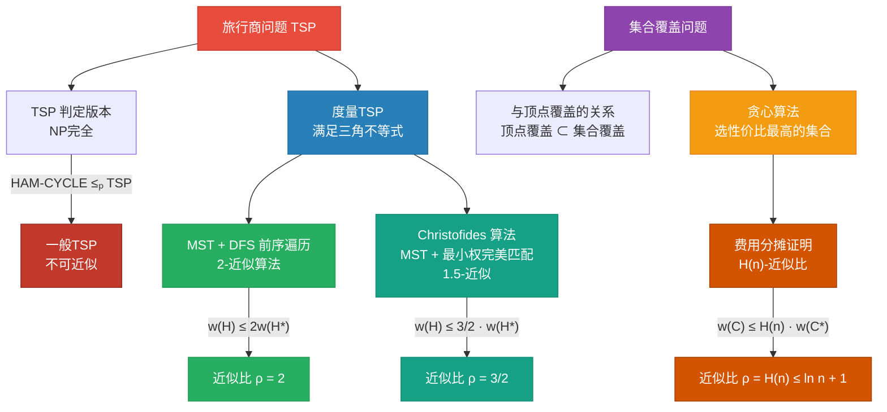

## 相关笔记
- 前置笔记：[[35.1 近似算法基础与顶点覆盖]]、[[第34章_NP完全性-章节汇总]]
- 关联概念：[[34.3 经典NP完全问题]]、[[离散数学/concepts/哈密顿路径]]、[[离散数学/concepts/完全图]]、[[离散数学/concepts/贪心算法]]、[[离散数学/concepts/集合]]
- 章节汇总：[[第35章_近似算法-章节汇总]]

> [!abstract] 概览
> 本节深入探讨两个经典的NP困难优化问题——**旅行商问题（TSP）**和**集合覆盖问题**——的近似算法设计。对于满足**三角不等式**的度量TSP（Metric TSP），我们给出基于**最小生成树**的2-近似算法和基于**最小权完美匹配**的Christofides 1.5-近似算法，并完整推导近似比证明。对于一般TSP，我们通过从[[离散数学/concepts/哈密顿路径|哈密顿回路问题]]的归约证明其不可近似性。对于集合覆盖问题，我们设计**贪心算法**并利用**费用分摊论证（charging argument）**严格证明其 $H(n)$-近似比，其中 $H(n) \leq \ln n + 1$ 为第 $n$ 个**调和数**。这两个问题展示了近似算法设计的两种核心范式：结构化利用问题特有性质（三角不等式）与贪心策略的系统性分析。

## 知识结构总览



## 核心思想

### 35.2 旅行商问题（TSP）

#### 问题定义

**旅行商问题（Traveling Salesman Problem, TSP）** 是组合优化中最著名的问题之一。其形式化定义如下：

- **输入**：一个**完全图** $G = (V, E)$，其中 $|V| = n$，以及一个**边权函数** $w: E \to \mathbb{Z}^+$（正整数权重）
- **输出**：一条经过 $V$ 中所有顶点**恰好一次**并**回到起点**的**哈密顿回路** $H$，使得 $H$ 的总权重最小

用数学语言表述，TSP 要求找到顶点的一个排列 $\pi = (v_{\pi(1)}, v_{\pi(2)}, \ldots, v_{\pi(n)})$，使得

$$
\min_{\pi} \sum_{i=1}^{n-1} w(v_{\pi(i)}, v_{\pi(i+1)}) + w(v_{\pi(n)}, v_{\pi(1)})
$$

其中 $\pi$ 是 $\{1, 2, \ldots, n\}$ 的一个排列。

**生活化类比**：想象一个快递员需要从仓库出发，把包裹送到 $n$ 个不同的客户地址，每个客户恰好送一次，最后回到仓库。城市之间的道路距离就是边权，快递员要找到总路程最短的路线。这就是TSP的直观含义。

#### NP完全性分析

TSP的判定版本（是否存在总权重不超过 $k$ 的哈密顿回路）是**NP完全**的。CLRS在第34章中已经给出了归约：

$$
\text{HAM-CYCLE} \leq_p \text{TSP}
$$

**归约构造**（回顾）：

给定一个无向图 $G = (V, E)$ 的哈密顿回路判定实例，构造TSP实例如下：

1. 构造完全图 $G' = (V, E')$，其中 $E' = V \times V$（所有可能的边）
2. 定义边权函数：
$$
w(u, v) = \begin{cases} 1 & \text{若 } (u, v) \in E \\ 2 & \text{若 } (u, v) \notin E \end{cases}
$$
3. 令 $k = |V|$

**正确性论证**：

- **充分性**（$G$ 有哈密顿回路 $\Rightarrow$ $G'$ 有权重 $\leq |V|$ 的TSP回路）：若 $G$ 存在哈密顿回路 $C$，则 $C$ 使用了 $|V|$ 条边，每条边的权重为 $1$，因此 $w(C) = |V| = k$。

- **必要性**（$G'$ 有权重 $\leq |V|$ 的TSP回路 $\Rightarrow$ $G$ 有哈密顿回路）：若 $G'$ 存在权重 $\leq |V|$ 的回路 $C'$，由于 $C'$ 恰好包含 $|V|$ 条边，而每条边的权重至少为 $1$，因此 $C'$ 中每条边的权重必须恰好为 $1$。这意味着 $C'$ 中每条边都属于 $E$，所以 $C'$ 就是 $G$ 中的一条哈密顿回路。

这个归约可以在 $O(|V|^2)$ 时间内完成，因此是多项式时间归约。

#### 三角不等式与度量TSP

由于一般TSP是NP困难的，我们无法在多项式时间内找到精确解（除非P=NP）。然而，如果对边权函数施加额外约束——**三角不等式**——就可以设计出有保证的近似算法。

**定义（三角不等式）**：对于完全图 $G = (V, E)$ 上的边权函数 $w$，若对所有 $u, v, x \in V$，满足

$$
w(u, x) \leq w(u, v) + w(v, x)
$$

则称 $w$ 满足**三角不等式**。

**满足三角不等式的TSP**称为**度量TSP（Metric TSP）**。

**为什么三角不等式如此重要？** 三角不等式意味着"直达"永远不比"绕路"更远。这个性质在很多实际场景中自然成立：

- **欧几里得距离**：平面上两点之间的直线距离满足三角不等式（三角形的两边之和大于第三边）
- **曼哈顿距离**：城市网格中的出租车距离满足三角不等式
- **道路网络距离**：实际道路距离通常满足三角不等式（虽然有时由于单行道等因素可能不严格满足）

**不满足三角不等式的例子**：考虑机票价格——从北京飞上海可能比从北京飞广州再飞上海更贵（因为直飞航线需求大），此时机票价格就不满足三角不等式。

#### MST + DFS 前序遍历：2-近似算法

这是度量TSP最经典的近似算法，由多种来源独立发现（Rosenkrantz, Stearns, Lewis 1977; Serdyukov 1978）。

**算法描述**：

```
APPROX-TSP-TOUR(G, w)
  1  选取任意顶点 r ∈ V 作为根
  2  用 Prim 算法（或 Kruskal 算法）构造以 r 为根的最小生成树 T
  3  对 T 进行前序遍历，得到顶点序列 L
  4  令 H 为按 L 中顶点顺序访问的哈密顿回路
  5  return H
```

**逐步执行示例**：

考虑一个包含5个顶点的完全图，边权满足三角不等式。设顶点集为 $V = \{a, b, c, d, e\}$，边权如下：

| 边 | 权重 | 边 | 权重 | 边 | 权重 |
|:---:|:---:|:---:|:---:|:---:|:---:|
| (a,b) | 2 | (a,c) | 3 | (a,d) | 5 |
| (a,e) | 7 | (b,c) | 4 | (b,d) | 6 |
| (b,e) | 8 | (c,d) | 2 | (c,e) | 5 |
| (d,e) | 3 | | | | |

**步骤1**：选取 $r = a$ 作为根。

**步骤2**：用Prim算法构造最小生成树 $T$。

Prim算法执行过程：
- 从 $a$ 开始，$T = \{a\}$
- 距离最近的未加入顶点：$b$（距离 $2$），加入 $b$，$T = \{a, b\}$，$w(T) = 2$
- 距离最近的未加入顶点：$c$（从 $a$ 距离 $3$，从 $b$ 距离 $4$），加入 $c$，$T = \{a, b, c\}$，$w(T) = 2 + 3 = 5$
- 距离最近的未加入顶点：$d$（从 $c$ 距离 $2$），加入 $d$，$T = \{a, b, c, d\}$，$w(T) = 5 + 2 = 7$
- 距离最近的未加入顶点：$e$（从 $d$ 距离 $3$），加入 $e$，$T = \{a, b, c, d, e\}$，$w(T) = 7 + 3 = 10$

最小生成树 $T$ 的边为：$(a,b), (a,c), (c,d), (d,e)$，总权重 $w(T) = 10$。

**步骤3**：对 $T$ 进行前序遍历。

以 $a$ 为根的前序遍历：$a \to b \to c \to d \to e$

得到顶点序列 $L = (a, b, c, d, e)$。

**步骤4**：按 $L$ 的顺序构造哈密顿回路 $H$。

$$
H = a \to b \to c \to d \to e \to a
$$

总权重：$w(a,b) + w(b,c) + w(c,d) + w(d,e) + w(e,a) = 2 + 4 + 2 + 3 + 7 = 18$

#### 2-近似比的完整证明

**定理**：对于满足三角不等式的TSP实例，APPROX-TSP-TOUR 是一个**近似比为2**的多项式时间近似算法。

**证明**（逐步推导）：

设 $H^*$ 为最优TSP回路（即权重最小的哈密顿回路），$T$ 为算法构造的最小生成树，$W$ 为对 $T$ 进行完整DFS遍历得到的**行走路径（walk）**（即每条树边被遍历两次），$H$ 为算法输出的哈密顿回路。

**引理1**：$w(H^*) \geq w(T)$

**证明**：从 $H^*$ 中删除任意一条边，得到一条生成树 $T'$（因为 $H^*$ 是包含所有顶点的回路，删除一条边后仍然连通且无环，故为生成树）。由于 $T$ 是最小生成树，有

$$
w(T) \leq w(T')
$$

而 $T'$ 是 $H^*$ 去掉一条边得到的，因此 $w(T') = w(H^*) - w(e)$，其中 $e$ 是被删除的边。由于所有边权为正（$w: E \to \mathbb{Z}^+$），有 $w(e) > 0$，因此

$$
w(T') < w(H^*)
$$

结合 $w(T) \leq w(T')$，得到

$$
w(T) \leq w(T') < w(H^*)
$$

即 $w(T) < w(H^*)$，当然也有 $w(T) \leq w(H^*)$。 $\blacksquare$

**引理2**：$w(W) = 2w(T)$

**证明**：$W$ 是对 $T$ 进行完整DFS遍历得到的行走路径。在DFS遍历中，每条树边恰好被经过**两次**（一次向下访问子节点，一次向上回溯）。因此

$$
w(W) = \sum_{e \in T} 2 \cdot w(e) = 2 \sum_{e \in T} w(e) = 2w(T) \quad \blacksquare
$$

**引理3**：利用三角不等式，可以从 $W$ 得到哈密顿回路 $H$，且 $w(H) \leq w(W)$

**证明**：$W$ 是一个可能多次访问某些顶点的行走路径（因为DFS回溯会重复经过顶点）。我们从 $W$ 中按访问顺序提取顶点序列，去除重复出现的顶点（只保留第一次出现的位置），得到哈密顿回路 $H$。

具体地，设 $W$ 的顶点访问序列为 $L_W = (v_1, v_2, \ldots, v_{2n-1})$（一棵有 $n$ 个顶点的树有 $n-1$ 条边，DFS遍历经过每条边两次，共访问 $2(n-1) + 1 = 2n - 1$ 个顶点）。$H$ 的顶点序列是 $L_W$ 去重后的结果。

关键观察：$H$ 中任意两个连续顶点 $v_i, v_j$（在 $W$ 中它们之间可能经过其他顶点），由于三角不等式：

$$
w(v_i, v_j) \leq \sum_{k=i}^{j-1} w(v_k, v_{k+1})
$$

即 $H$ 中直接连接的边权不超过 $W$ 中对应路径的边权之和。将 $H$ 中所有边逐一与 $W$ 中的对应子路径比较，累加得到

$$
w(H) \leq w(W) \quad \blacksquare
$$

**综合三个引理，完成定理证明**：

$$
w(H) \leq w(W) = 2w(T) \leq 2w(H^*)
$$

因此 $w(H) \leq 2w(H^*)$，即近似比 $\rho = 2$。 $\blacksquare$

**算法复杂度分析**：
- Prim算法构造MST：$O(E \log V) = O(V^2 \log V)$（完全图有 $O(V^2)$ 条边）
- DFS前序遍历：$O(V)$
- 构造哈密顿回路：$O(V)$
- 总时间复杂度：$O(V^2 \log V)$

#### Christofides 算法：1.5-近似

Christofides算法（1976年，独立由Serdyukov于1978年发现）将度量TSP的近似比从2改进到1.5，这是该领域近40年来最好的结果，直到2020年才被Karlin, Klein和Oveis Gharan首次突破。

**算法描述**：

```
CHRISTOFIDES(G, w)
  1  选取任意顶点 r ∈ V 作为根
  2  用 Prim 算法构造最小生成树 T
  3  令 O 为 T 中度数为奇数的顶点集合
  4  在 O 上求最小权完美匹配 M
  5  将 T 和 M 的边合并，得到多重图 H' = T ∪ M
  6  在 H' 中找欧拉回路（因为 H' 中所有顶点度数均为偶数）
  7  利用三角不等式，将欧拉回路 shortcut 为哈密顿回路 H
  8  return H
```

**关键步骤详解**：

**步骤3：找奇数度顶点**。在任何图中，度数为奇数的顶点个数一定是**偶数**（握手引理：$\sum_{v \in V} \deg(v) = 2|E|$，因此奇数度顶点的个数必须是偶数）。设 $O = \{v \in V : \deg_T(v) \text{ 为奇数}\}$，则 $|O|$ 为偶数。

**步骤4：最小权完美匹配**。在完全图 $G$ 的顶点子集 $O$ 上求最小权完美匹配 $M$。由于 $|O|$ 为偶数，完美匹配一定存在。最小权完美匹配可以在 $O(|V|^3)$ 时间内求出（使用Edmonds的"花算法"的加权版本）。

**步骤5-6：构造欧拉回路**。将 $T$ 和 $M$ 合并得到多重图 $H'$。对于 $H'$ 中每个顶点 $v$：

- 若 $v \notin O$，则 $\deg_T(v)$ 为偶数，$\deg_M(v) = 0$，故 $\deg_{H'}(v) = \deg_T(v)$ 为偶数
- 若 $v \in O$，则 $\deg_T(v)$ 为奇数，$\deg_M(v) = 1$（匹配中每个顶点恰好关联一条匹配边），故 $\deg_{H'}(v) = \deg_T(v) + 1$ 为偶数

因此 $H'$ 中所有顶点的度数都是偶数，且 $H'$ 连通（因为 $T$ 连通），所以 $H'$ 存在**欧拉回路**。

**步骤7：Shortcut**。利用三角不等式，将欧拉回路中重复出现的顶点跳过（与2-近似算法中的shortcut相同），得到哈密顿回路 $H$。

#### Christofides 算法近似比证明

**定理**：对于满足三角不等式的TSP实例，Christofides算法是一个**近似比为3/2**的多项式时间近似算法。

**证明**（逐步推导）：

设 $H^*$ 为最优TSP回路，$T$ 为最小生成树，$M$ 为奇数度顶点上的最小权完美匹配，$H$ 为算法输出的哈密顿回路。

**引理4**：$w(M) \leq \frac{1}{2} w(H^*)$

**证明**：考虑最优TSP回路 $H^*$。从 $H^*$ 中删除 $O$ 之外的所有顶点（即只保留 $O$ 中的顶点），$H^*$ 被分割成若干条路径。由于 $H^*$ 是一个回路，删除某些顶点后，$O$ 中每个顶点在剩余路径中的度数恰好为 $0$ 或 $2$。

更精确地说，$H^*$ 限制在 $O$ 上的子图由若干条不相交的路径组成（可能还有环），每条路径连接 $O$ 中的两个顶点。这些路径的端点（度数为1的顶点）恰好是 $O$ 中的所有顶点（因为 $H^*$ 中每个顶点度数为2，删除非 $O$ 顶点后，$O$ 中顶点的度数变为 $0$ 或 $2$ 或 $1$——实际上，由于 $H^*$ 是回路，$O$ 中顶点在限制子图中的度数之和等于 $|O|$，且每个顶点度数为 $0$ 或 $2$，但 $|O|$ 是偶数，度数为 $2$ 的顶点成对出现，度数为 $0$ 的也成对出现...）

让我们换一个更清晰的论证方式：

$H^*$ 是一个经过所有顶点的回路。考虑 $H^*$ 在 $O$ 上的"投影"：沿着 $H^*$ 走，只记录属于 $O$ 的顶点，得到一个 $O$ 中顶点的序列。由于 $H^*$ 是回路，这个序列首尾相接。在这个序列中，相邻的 $O$ 顶点之间由 $H^*$ 中的一条路径连接。

利用三角不等式，每对相邻 $O$ 顶点之间的直接连接权重不超过 $H^*$ 中对应路径的权重。因此，如果我们取 $H^*$ 在 $O$ 上投影后得到的边（相邻 $O$ 顶点之间的直接边），这些边构成 $O$ 上的一个**完美匹配**的**超集**（实际上是一个2-正则子图，即若干不相交的圈的并集）。

从一个2-正则子图中，我们可以提取出一个完美匹配（每个圈取交替的边），其总权重不超过原2-正则子图的总权重。而原2-正则子图的总权重不超过 $w(H^*)$（由三角不等式）。因此

$$
w(M) \leq \frac{1}{2} w(H^*)
$$

这是因为2-正则子图的总权重不超过 $w(H^*)$，而从中取一半的边（完美匹配），权重不超过一半。 $\blacksquare$

**综合证明**：

$$
w(H) \leq w(T) + w(M) \leq w(H^*) + \frac{1}{2} w(H^*) = \frac{3}{2} w(H^*)
$$

其中第一个不等式是因为 $H$ 通过shortcut从 $T \cup M$ 的欧拉回路得到，由三角不等式，$w(H) \leq w(T \cup M) = w(T) + w(M)$。第二个不等式分别使用了引理1（$w(T) \leq w(H^*)$）和引理4（$w(M) \leq \frac{1}{2} w(H^*)$）。 $\blacksquare$

**算法复杂度分析**：
- Prim算法构造MST：$O(V^2 \log V)$
- 找奇数度顶点：$O(V)$
- 最小权完美匹配：$O(V^3)$
- 求欧拉回路：$O(V + E) = O(V^2)$
- Shortcut：$O(V)$
- 总时间复杂度：$O(V^3)$

#### 一般TSP的不可近似性

**定理**：除非 $\text{P} = \text{NP}$，对于一般TSP（不要求三角不等式），不存在任何**常数近似比**的多项式时间近似算法。

**证明思路**（通过从HAM-CYCLE归约）：

假设存在一个近似比为 $\rho$ 的多项式时间近似算法 $A$。我们用 $A$ 来解决HAM-CYCLE问题：

1. 给定HAM-CYCLE实例 $G = (V, E)$
2. 构造TSP实例（与NP完全性归约相同）：
   - 完全图 $G' = (V, E')$
   - $w(u,v) = 1$ 若 $(u,v) \in E$，否则 $w(u,v) = 2$
   - 令 $k = |V|$
3. 用算法 $A$ 求解TSP实例，得到回路 $H$，权重 $w(H)$
4. 若 $w(H) = |V|$，则 $H$ 中所有边权重为1，对应 $G$ 中的哈密顿回路，回答"是"
5. 若 $w(H) > |V|$，则 $G$ 中不存在哈密顿回路，回答"否"

**关键分析**：若 $G$ 存在哈密顿回路，则最优TSP回路权重为 $|V|$；若 $G$ 不存在哈密顿回路，则任何TSP回路至少包含一条权重为2的边，因此最优TSP回路权重 $\geq |V| + 1$。

若算法 $A$ 的近似比为 $\rho$，则：
- 当 $G$ 存在哈密顿回路时：$w(H) \leq \rho \cdot |V|$
- 当 $G$ 不存在哈密顿回路时：$w(H) \geq |V| + 1$

要区分这两种情况，需要 $\rho \cdot |V| < |V| + 1$，即 $\rho < 1 + 1/|V|$。当 $|V|$ 足够大时，$1/|V|$ 任意小，因此 $\rho$ 必须小于任意大于1的常数。这意味着**不存在**常数近似比的多项式时间近似算法。

更严格地说，对于任意 $\rho > 1$，当 $|V| > 1/(\rho - 1)$ 时，$\rho \cdot |V| \geq |V| + 1$，此时无法区分两种情况。因此，除非 $\text{P} = \text{NP}$，对一般TSP不存在近似比为 $\rho$ 的多项式时间近似算法（对任意常数 $\rho > 1$）。 $\blacksquare$

---

### 35.3 集合覆盖问题

#### 问题定义

**集合覆盖问题（Set Cover Problem）** 是另一个经典的NP困难优化问题，在资源分配、设施选址、数据库查询优化等领域有广泛应用。

- **输入**：
  - 一个**有限全集** $U = \{e_1, e_2, \ldots, e_n\}$，$|U| = n$
  - 一个**子集族** $\mathcal{S} = \{S_1, S_2, \ldots, S_m\}$，其中每个 $S_i \subseteq U$
  - 一个**权重函数** $w: \mathcal{S} \to \mathbb{R}^+$（每个子集有一个非负权重）
- **输出**：一个**子覆盖** $\mathcal{C} \subseteq \mathcal{S}$，使得 $\bigcup_{S \in \mathcal{C}} S = U$，且总权重 $w(\mathcal{C}) = \sum_{S \in \mathcal{C}} w(S)$ 最小

**特殊情形——无权集合覆盖**：当所有 $w(S_i) = 1$ 时，问题简化为找覆盖 $U$ 所需的最少集合个数。

**生活化类比**：假设你是一个消防站站长，城市有 $n$ 个区域需要消防覆盖，有 $m$ 个可选的消防站位置，每个消防站可以覆盖一定范围的区域，建设每个消防站的费用不同。你要选择最少的消防站（或总费用最低的消防站组合），使得所有区域都被覆盖。这就是集合覆盖问题。

#### 与顶点覆盖的关系

**顶点覆盖是集合覆盖的特例**。回顾[[35.1 近似算法基础与顶点覆盖|顶点覆盖问题]]：

- 给定无向图 $G = (V, E)$，找最小顶点子集 $C \subseteq V$，使得 $G$ 的每条边至少有一个端点在 $C$ 中

将顶点覆盖转化为集合覆盖：
- 全集 $U = E$（所有边）
- 对每个顶点 $v \in V$，定义集合 $S_v = \{e \in E : e \text{ 与 } v \text{ 关联}\}$（即 $v$ 覆盖的所有边）
- 子集族 $\mathcal{S} = \{S_v : v \in V\}$

则 $G$ 的顶点覆盖恰好对应 $\mathcal{S}$ 中覆盖 $U = E$ 的子集族。因此，顶点覆盖 $\leq_p$ 集合覆盖。

这个关系说明：集合覆盖至少和顶点覆盖一样难。顶点覆盖有2-近似算法，但集合覆盖的贪心算法只能保证 $H(n)$-近似比（$H(n)$ 可以远大于2），这反映了集合覆盖是比顶点覆盖更一般、更困难的问题。

#### 贪心算法

集合覆盖的贪心算法思想简单而自然：每一步选择"性价比最高"的集合——即单位权重能覆盖最多未覆盖元素的集合。

**算法伪代码**：

```
GREEDY-SET-COVER(U, S, w)
  1  C ← ∅
  2  U' ← U
  3  while U' ≠ ∅ do
  4      对每个 S ∈ S \ C，计算 cost(S) = w(S) / |S ∩ U'|
  5      选 S* ∈ S \ C 使 cost(S*) 最小
  6      C ← C ∪ {S*}
  7      U' ← U' \ S*
  8  return C
```

**逐步执行示例**：

设 $U = \{1, 2, 3, 4, 5, 6\}$，$\mathcal{S} = \{S_1, S_2, S_3, S_4\}$，所有集合权重为 $1$（无权情形）：

- $S_1 = \{1, 2, 3\}$，$w(S_1) = 1$
- $S_2 = \{2, 4\}$，$w(S_2) = 1$
- $S_3 = \{3, 5, 6\}$，$w(S_3) = 1$
- $S_4 = \{4, 5, 6\}$，$w(S_4) = 1$

**迭代1**：$U' = \{1, 2, 3, 4, 5, 6\}$
- $|S_1 \cap U'| = 3$，cost = $1/3$
- $|S_2 \cap U'| = 2$，cost = $1/2$
- $|S_3 \cap U'| = 3$，cost = $1/3$
- $|S_4 \cap U'| = 3$，cost = $1/3$

选择 $S_1$（或 $S_3$ 或 $S_4$，平局时任选）。假设选 $S_1$。

$C = \{S_1\}$，$U' = \{4, 5, 6\}$

**迭代2**：$U' = \{4, 5, 6\}$
- $|S_1 \cap U'| = 0$，已选
- $|S_2 \cap U'| = 1$，cost = $1/1 = 1$
- $|S_3 \cap U'| = 2$，cost = $1/2$
- $|S_4 \cap U'| = 3$，cost = $1/3$

选择 $S_4$。

$C = \{S_1, S_4\}$，$U' = \emptyset$

**结果**：贪心解 $\mathcal{C} = \{S_1, S_4\}$，总权重 $w(\mathcal{C}) = 2$。

**最优解**：$\mathcal{C}^* = \{S_1, S_4\}$ 或 $\{S_1, S_2, S_3\}$（权重3）或 $\{S_3, S_2, S_1\}$（权重3）。最优解也是 $\{S_1, S_4\}$，权重为2。此例中贪心解恰好等于最优解。

#### 调和数

在证明贪心算法的近似比之前，先回顾**调和数（Harmonic Number）**的定义：

$$
H(d) = \sum_{i=1}^{d} \frac{1}{i} = 1 + \frac{1}{2} + \frac{1}{3} + \cdots + \frac{1}{d}
$$

**引理**：$H(d) \leq \ln d + 1$

**证明**：利用积分对调和数进行上下界估计：

$$
\int_1^{d+1} \frac{1}{x} \, dx \leq H(d) \leq 1 + \int_1^d \frac{1}{x} \, dx
$$

下界：$\int_1^{d+1} \frac{1}{x} \, dx = \ln(d+1) \leq H(d)$

上界：$1 + \int_1^d \frac{1}{x} \, dx = 1 + \ln d$

因此 $\ln(d+1) \leq H(d) \leq 1 + \ln d$。特别地，$H(d) \leq \ln d + 1$。 $\blacksquare$

对于 $d = n$（全集大小），$H(n) \leq \ln n + 1$。当 $n$ 较大时，$H(n) \approx \ln n + \gamma$，其中 $\gamma \approx 0.5772$ 是欧拉-马斯刻若尼常数。

#### 贪心算法近似比证明（费用分摊论证）

**定理**：GREEDY-SET-COVER 是集合覆盖问题的一个 $H(n)$-近似算法，其中 $n = |U|$，$H(n) = \sum_{i=1}^{n} 1/i \leq \ln n + 1$。

**证明**（费用分摊论证 / Charging Argument，逐步推导）：

**核心思想**：将贪心解的总费用"分摊"到最优解中的每个集合上，证明每个最优集合被分摊的费用不超过 $H(|S|) \cdot w(S)$，从而贪心解的总费用不超过 $H(\max_{S \in \mathcal{C}^*} |S|) \cdot w(\mathcal{C}^*) \leq H(n) \cdot w(\mathcal{C}^*)$。

**详细证明**：

设贪心算法按顺序选择了集合 $S_1, S_2, \ldots, S_k$（注意这里 $S_i$ 表示第 $i$ 步选择的集合，与输入中的集合编号无关）。设 $c_i = w(S_i)$ 为第 $i$ 个被选集合的权重。

设 $\mathcal{C}^*$ 为最优覆盖。对每个 $S \in \mathcal{C}^*$，我们需要将贪心解的费用中的一部分"分配"给 $S$，然后证明分配给 $S$ 的总费用不超过 $H(|S|) \cdot w(S)$。

**费用分配方案**：

对于最优覆盖中的每个集合 $S \in \mathcal{C}^*$，考虑 $S$ 中的元素被贪心算法覆盖的过程。设 $S$ 中有 $|S|$ 个元素，它们在贪心算法的不同迭代中被覆盖。设 $S$ 中的元素按被覆盖的时间排序为 $e_1, e_2, \ldots, e_{|S|}$，其中 $e_j$ 是 $S$ 中第 $j$ 个被覆盖的元素。

当 $e_j$ 被覆盖时（在贪心算法的第 $t_j$ 次迭代中），设此时 $S$ 中还有 $|S| - j + 1$ 个元素未被覆盖。贪心算法在第 $t_j$ 次迭代选择了某个集合 $S_{t_j}$，其"单位费用"为：

$$
\text{cost}(S_{t_j}) = \frac{w(S_{t_j})}{|S_{t_j} \cap U'_{t_j}|}
$$

其中 $U'_{t_j}$ 是第 $t_j$ 次迭代开始时仍未被覆盖的元素集合。

**关键观察**：在第 $t_j$ 次迭代时，$S$ 中仍有 $|S| - j + 1$ 个元素未被覆盖，因此 $S$ 本身可以覆盖 $|S| - j + 1$ 个未覆盖元素。贪心算法选择了性价比最高的集合，所以：

$$
\frac{w(S_{t_j})}{|S_{t_j} \cap U'_{t_j}|} \leq \frac{w(S)}{|S| - j + 1}
$$

我们将 $e_j$ 被"覆盖"的费用定义为：

$$
\text{price}(e_j) = \frac{w(S_{t_j})}{|S_{t_j} \cap U'_{t_j}|} \leq \frac{w(S)}{|S| - j + 1}
$$

注意：$w(S_{t_j})$ 被均匀分摊到 $S_{t_j}$ 在第 $t_j$ 次迭代覆盖的所有元素上，每个元素分到的费用恰好是 $\text{price}(e_j)$。

**将费用分配给最优集合 $S$**：

对于 $S \in \mathcal{C}^*$，$S$ 中的每个元素 $e_j$ 都在某个时刻被贪心算法覆盖，对应的费用为 $\text{price}(e_j)$。我们将这些费用累加：

$$
\text{charge}(S) = \sum_{j=1}^{|S|} \text{price}(e_j) \leq \sum_{j=1}^{|S|} \frac{w(S)}{|S| - j + 1} = w(S) \sum_{j=1}^{|S|} \frac{1}{j} = w(S) \cdot H(|S|)
$$

这里利用了替换 $i = |S| - j + 1$，则当 $j$ 从 $1$ 到 $|S|$ 时，$i$ 从 $|S|$ 到 $1$，所以 $\sum_{j=1}^{|S|} \frac{1}{|S|-j+1} = \sum_{i=1}^{|S|} \frac{1}{i} = H(|S|)$。

**汇总所有最优集合的费用**：

贪心解的总费用等于所有被覆盖元素的费用之和（因为每个贪心步骤的费用被完全分摊到该步骤覆盖的元素上）：

$$
w(\mathcal{C}) = \sum_{i=1}^{k} w(S_i) = \sum_{e \in U} \text{price}(e)
$$

另一方面，每个元素 $e \in U$ 恰好属于最优覆盖 $\mathcal{C}^*$ 中的某个集合 $S$（因为 $\mathcal{C}^*$ 是一个覆盖）。因此：

$$
\sum_{e \in U} \text{price}(e) = \sum_{S \in \mathcal{C}^*} \sum_{e \in S} \text{price}(e) \leq \sum_{S \in \mathcal{C}^*} w(S) \cdot H(|S|)
$$

由于 $|S| \leq n$ 对所有 $S$ 成立，且 $H(\cdot)$ 是单调递增函数：

$$
\sum_{S \in \mathcal{C}^*} w(S) \cdot H(|S|) \leq \sum_{S \in \mathcal{C}^*} w(S) \cdot H(n) = H(n) \cdot w(\mathcal{C}^*)
$$

因此：

$$
w(\mathcal{C}) \leq H(n) \cdot w(\mathcal{C}^*)
$$

即贪心算法的近似比为 $H(n) \leq \ln n + 1$。 $\blacksquare$

**更紧的界**：实际上，上述证明给出了一个更紧的界：

$$
w(\mathcal{C}) \leq H\left(\max_{S \in \mathcal{C}^*} |S|\right) \cdot w(\mathcal{C}^*)
$$

如果最优覆盖中最大的集合大小为 $d$（$d \leq n$），则近似比为 $H(d)$ 而非 $H(n)$。当 $d \ll n$ 时，这个界要好得多。

**算法复杂度分析**：
- 每次迭代需要扫描所有未选集合，计算覆盖数量：$O(mn)$（$m$ 个集合，每个最多 $n$ 个元素）
- 最多迭代 $n$ 次（每次至少覆盖一个新元素）
- 总时间复杂度：$O(mn^2)$（可以通过优先队列优化到 $O(mn)$）

#### 集合覆盖的不可近似性

Dinur和Steurer（2014）证明了：除非 $\text{NP} \not\subseteq \text{DTIME}(n^{O(\log \log n)})$（比P≠NP稍强的假设），集合覆盖问题不存在近似比优于 $(1 - o(1)) \ln n$ 的多项式时间算法。这意味着贪心算法的 $H(n) \approx \ln n$ 近似比在本质上是**最优的**（在相差一个 $o(1)$ 因子的意义下）。

---

### 两个问题的对比总结

| 维度 | 度量TSP | 集合覆盖 |
|:-----|:---------|:---------|
| **问题类型** | 图论优化问题 | 集合系统优化问题 |
| **核心约束** | 三角不等式 | 覆盖约束 |
| **最优算法** | Christofides (1.5-近似) | 贪心 ($H(n)$-近似) |
| **证明技术** | 结构分解 + 三角不等式 | 费用分摊论证 |
| **不可近似性** | 一般TSP无常数近似 | 不优于 $(1-o(1))\ln n$ |
| **实际应用** | 物流配送、芯片钻孔、DNA测序 | 资源分配、设施选址、特征选择 |

> [!info] Christofides算法的历史与最新突破
> **来源：** [Karlin, Klein, Oveis Gharan (2020) — A (Slightly) Improved Approximation Algorithm for Metric TSP](https://arxiv.org/pdf/2007.01409v3)
>
> Christofides算法自1976年提出以来，1.5的近似比保持了超过40年未被改进。2020年，Karlin、Klein和Oveis Gharan取得了突破性进展：他们证明了一种基于**最大熵采样**的随机化算法可以达到 $(3/2 - \epsilon)$-近似比，其中 $\epsilon > 10^{-36}$。虽然改进幅度极小，但这是首次在一般度量TSP上超越Christofides算法的理论结果。2022年，同一团队进一步证明了这个 $\epsilon$ 值可以通过分析**子回路线性规划松弛的积分间隙**来改进。这些工作揭示了连接组合优化、线性规划与概率方法的深层联系。

> [!info] 贪心集合覆盖的 $H(n)$-近似比完整证明
> **来源：** [MIT 6.854/18.415 — Advanced Algorithms, Lecture 3: Greedy Set Cover](https://people.csail.mit.edu/ghaffari/AA18/Notes/S3.pdf)
>
> 费用分摊论证（charging argument）是近似算法分析中最优雅的技术之一。其核心思想是将近似解的费用"分摊"到最优解的各个部分上，通过局部分析（每个最优集合被分摊的费用）推导全局界（近似解的总费用）。对于集合覆盖，关键观察是：当贪心算法覆盖最优集合 $S$ 中的第 $j$ 个元素时，$S$ 中仍有 $|S| - j + 1$ 个未覆盖元素，而贪心选择的性价比不低于 $S$ 的性价比。这一观察直接导出 $H(|S|)$ 的界。费用分摊技术也被广泛应用于其他问题的近似比分析中，如设施选址问题、在线缓存问题等。

> [!info] 一般TSP的不可近似性——从哈密顿回路归约
> **来源：** [堵丁柱、葛可一、胡晓东 — 近似算法的设计与分析，第十章：不可近似性](https://academic.hep.com.cn/pac/CN/chapter/978-7-04-031967-5/chapter10)
>
> 一般TSP（不满足三角不等式）的不可近似性是**归约证明**的经典范例。通过将哈密顿回路问题（HAM-CYCLE）归约到TSP的判定版本，可以证明：除非P=NP，对任意常数 $\rho > 1$，都不存在近似比为 $\rho$ 的多项式时间TSP算法。这个结果的意义在于：它清晰地展示了三角不等式这一"结构性假设"在近似算法设计中的关键作用。没有三角不等式，问题变得"过于无结构"，以至于连最粗略的近似保证都无法给出。这一思想在不可近似性理论中被广泛推广：通过从Gap版本的Label-Cover或PCP定理出发，可以证明许多问题在更精细的不可近似性下界。

> [!info] 度量TSP近似算法综述
> **来源：** [Travelling Salesman Problem: Algorithms and Approaches — A Comprehensive Survey (2025)](https://zenodo.org/records/15825858/files/TSPApproaches2025.pdf?download=1)
>
> 度量TSP的近似算法研究经历了多个里程碑。1976年Christofides提出1.5-近似算法后，研究者从多个角度尝试改进：(1) **图TSP**（graphic TSP，边权来自某个图的距离）：Mömke和Svensson (2011) 达到1.461-近似，Mucha (2012) 改进到 $1.44$-近似；(2) **子回路LP松弛**（subtour LP）：其积分间隙长期被猜测为 $4/3$，但直到2020年才被证明严格小于 $3/2$；(3) **半整数cycle cut实例**：2022年有工作给出了 $4/3$-近似算法。当前度量TSP的最大公开问题是：能否在多项式时间内达到 $4/3$-近似？这被认为是该领域最重要的开放问题之一。

> [!warning] 三角不等式不是可有可无的附加条件
> **误区**：三角不等式只是一个"锦上添花"的额外假设，去掉它只是让近似比变差一些。
>
> **正确理解**：三角不等式是度量TSP近似算法存在的**根本前提**。没有三角不等式，TSP不仅没有常数近似比，而且实际上**不可能有任何有意义的近似保证**。这是因为一般TSP中，最优解和次优解之间的"间隙"可以任意小（最优解权重为 $n$，次优解权重为 $n+1$），任何近似算法都必须精确区分这两种情况，而这等价于解决NP完全问题。三角不等式赋予了问题足够的"结构"，使得近似算法可以利用这种结构来获得质量保证。

> [!warning] Christofides算法的1.5-近似比不是通过"改进"2-近似得到的
> **误区**：Christofides算法是在MST+DFS算法的基础上做了一些优化，把近似比从2改进到1.5。
>
> **正确理解**：虽然Christofides算法确实以MST为基础，但其核心创新——在奇数度顶点上求最小权完美匹配——是一个**质的飞跃**，而非量的改进。MST+DFS算法的问题在于：DFS遍历中每条树边被走两次，而"回溯"的那一次是"浪费"的。Christofides算法通过添加匹配边，使得所有顶点度数变为偶数，从而可以直接走欧拉回路（每条边只走一次），消除了回溯的浪费。匹配的权重不超过最优TSP的一半，因此总权重不超过 $w(T) + w(M) \leq w(H^*) + w(H^*)/2 = 3w(H^*)/2$。这个证明的结构与2-近似证明完全不同，不是简单的"优化改进"。

> [!warning] 集合覆盖的贪心算法不是"每次选最大的集合"
> **误区**：贪心算法每次选择覆盖元素最多的集合。
>
> **正确理解**：在**无权**集合覆盖中，贪心算法确实每次选择覆盖最多未覆盖元素的集合（因为所有集合权重相同，最大化 $|S \cap U'|$ 等价于最小化 $w(S)/|S \cap U'|$）。但在**加权**集合覆盖中，贪心算法选择的是**性价比最高**的集合，即 $|S \cap U'| / w(S)$ 最大的集合。一个覆盖很多元素但权重极高的集合，可能不如一个覆盖较少元素但权重极低的集合"划算"。加权贪心策略是保证 $H(n)$-近似比的关键——如果简单地每次选最大的集合，在加权情形下近似比将失去保证。

## 习题精选

> [!todo] 习题概览
> | 题号 | 来源 | 核心考点 | 难度 |
> |:-----|:-----|:---------|:-----|
> | 1 | CLRS 35.2-1 | MST+DFS 2-近似算法执行与正确性 | ⭐⭐ |
> | 2 | CLRS 35.2-3 | Christofides算法步骤与奇数度顶点 | ⭐⭐⭐ |
> | 3 | CLRS 35.3-1 | 贪心集合覆盖算法执行 | ⭐⭐ |
> | 4 | CLRS 35.3-2 | 费用分摊论证的应用 | ⭐⭐⭐ |
> | 5 | 扩展题 | 一般TSP不可近似性证明 | ⭐⭐⭐ |

### 题1：MST+DFS近似算法的执行

> [!problem] 题目
> 考虑一个4个顶点的完全图 $G = (V, E)$，其中 $V = \{a, b, c, d\}$，边权如下：
>
> | 边 | 权重 |
> |:---:|:---:|
> | (a,b) | 1 |
> | (a,c) | 2 |
> | (a,d) | 3 |
> | (b,c) | 2 |
> | (b,d) | 3 |
> | (c,d) | 1 |
>
> 假设边权满足三角不等式。使用MST+DFS前序遍历算法求近似TSP回路，并计算近似比。

> [!faq]- 解答
> **[步骤1] 构造最小生成树**
>
> 使用Kruskal算法，按边权排序：$(a,b)=1, (c,d)=1, (a,c)=2, (b,c)=2, (a,d)=3, (b,d)=3$
>
> - 加入 $(a,b)$，权重 $1$，无环
> - 加入 $(c,d)$，权重 $1$，无环
> - 加入 $(a,c)$，权重 $2$，无环（连接 $\{a,b\}$ 和 $\{c,d\}$）
> - 加入 $(b,c)$，权重 $2$，会形成环 $a$-$b$-$c$-$a$，跳过
> - 加入 $(a,d)$，权重 $3$，会形成环，跳过
> - 加入 $(b,d)$，权重 $3$，会形成环，跳过
>
> 最小生成树 $T$ 的边为 $\{(a,b), (c,d), (a,c)\}$，$w(T) = 1 + 1 + 2 = 4$
>
> **[步骤2] 前序遍历**
>
> 以 $a$ 为根，$T$ 的结构为：$a$ 的子节点为 $b$ 和 $c$，$c$ 的子节点为 $d$。
>
> 前序遍历序列：$a \to b \to a \to c \to d \to c \to a$
>
> 去重后（保留首次出现）：$L = (a, b, c, d)$
>
> **[步骤3] 构造哈密顿回路**
>
> $H = a \to b \to c \to d \to a$
>
> $w(H) = w(a,b) + w(b,c) + w(c,d) + w(d,a) = 1 + 2 + 1 + 3 = 7$
>
> **[步骤4] 计算近似比**
>
> 最优TSP回路需要枚举所有 $(4-1)!/2 = 3$ 种不同的哈密顿回路：
> - $a \to b \to c \to d \to a$：$1 + 2 + 1 + 3 = 7$
> - $a \to b \to d \to c \to a$：$1 + 3 + 1 + 2 = 7$
> - $a \to c \to b \to d \to a$：$2 + 2 + 3 + 3 = 10$
>
> 最优解 $w(H^*) = 7$。
>
> 近似比 $= w(H)/w(H^*) = 7/7 = 1$。此例中近似解恰好等于最优解。
>
> $\blacksquare$

> [!tip] 解题思路提示
> 关键在于正确构造最小生成树，并注意前序遍历的"去重"操作——只保留每个顶点第一次出现的位置。验证三角不等式可以帮助确认结果的正确性。

### 题2：Christofides算法的奇数度顶点

> [!problem] 题目
> 在Christofides算法中，为什么最小生成树 $T$ 中奇数度顶点的个数一定是偶数？如果 $T$ 中所有顶点的度数都是偶数，算法应如何处理？

> [!faq]- 解答
> **[第一部分] 奇数度顶点个数为偶数**
>
> 由**握手引理**（Handshaking Lemma）：在任何无向图中，所有顶点的度数之和等于边数的两倍：
>
> $$\sum_{v \in V} \deg(v) = 2|E|$$
>
> 因此度数之和是偶数。将度数分为奇数度和偶数度两组：
>
> $$\sum_{v: \deg(v) \text{ 为奇数}} \deg(v) + \sum_{v: \deg(v) \text{ 为偶数}} \deg(v) = 2|E|$$
>
> 第二项（偶数度之和）是偶数，$2|E|$ 也是偶数，因此第一项（奇数度之和）也必须是偶数。而若干个奇数之和为偶数，当且仅当奇数的个数为偶数。因此奇数度顶点的个数 $|O|$ 为偶数。
>
> **[第二部分] 所有顶点度数均为偶数的情况**
>
> 如果 $T$ 中所有顶点度数都是偶数，则 $O = \emptyset$（空集）。此时：
>
> - 最小权完美匹配 $M = \emptyset$（空匹配，权重为0）
> - $H' = T \cup M = T$
> - $T$ 本身就是欧拉图（所有顶点度数为偶数且连通）
> - 直接在 $T$ 中找欧拉回路，然后shortcut为哈密顿回路
>
> 此时 $w(H) \leq w(T) \leq w(H^*)$，近似比为1（即找到最优解）。
>
> 这说明当MST恰好是欧拉图时，Christofides算法退化为MST+欧拉回路，效果更好。
>
> $\blacksquare$

> [!tip] 解题思路提示
> 握手引理是图论中最基本的计数工具之一。考虑度数之和的奇偶性是证明"奇数度顶点个数为偶数"的标准方法。

### 题3：贪心集合覆盖的执行

> [!problem] 题目
> 给定全集 $U = \{a, b, c, d, e\}$ 和子集族 $\mathcal{S}$（所有集合权重为1）：
> - $S_1 = \{a, b\}$
> - $S_2 = \{b, c, d\}$
> - $S_3 = \{a, c, e\}$
> - $S_4 = \{d, e\}$
>
> 执行贪心集合覆盖算法，给出每一步的选择和结果，并分析近似比。

> [!faq]- 解答
> **[迭代1]** $U' = \{a, b, c, d, e\}$
>
> - $|S_1 \cap U'| = 2$，cost = $1/2$
> - $|S_2 \cap U'| = 3$，cost = $1/3$
> - $|S_3 \cap U'| = 3$，cost = $1/3$
> - $|S_4 \cap U'| = 2$，cost = $1/2$
>
> $S_2$ 和 $S_3$ 并列最优（cost = $1/3$）。假设选 $S_2$。
>
> $C = \{S_2\}$，$U' = \{a, e\}$
>
> **[迭代2]** $U' = \{a, e\}$
>
> - $|S_1 \cap U'| = 1$（$a$），cost = $1/1 = 1$
> - $|S_2 \cap U'| = 0$，已选
> - $|S_3 \cap U'| = 2$（$a, e$），cost = $1/2$
> - $|S_4 \cap U'| = 1$（$e$），cost = $1/1 = 1$
>
> 选择 $S_3$。
>
> $C = \{S_2, S_3\}$，$U' = \emptyset$
>
> **[结果]** 贪心解 $\mathcal{C} = \{S_2, S_3\}$，$w(\mathcal{C}) = 2$。
>
> **[最优解分析]** 枚举所有可能的覆盖：
> - $\{S_1, S_2, S_4\}$：权重3，覆盖 $\{a,b\} \cup \{b,c,d\} \cup \{d,e\} = U$ ✓
> - $\{S_1, S_3, S_4\}$：权重3，覆盖 $U$ ✓
> - $\{S_2, S_3\}$：权重2，覆盖 $\{b,c,d\} \cup \{a,c,e\} = U$ ✓
> - $\{S_1, S_2, S_3\}$：权重3，覆盖 $U$ ✓
> - $\{S_1, S_4\}$：权重2，覆盖 $\{a,b\} \cup \{d,e\} = \{a,b,d,e\} \neq U$ ✗
>
> 最优解 $\mathcal{C}^* = \{S_2, S_3\}$，$w(\mathcal{C}^*) = 2$。
>
> 近似比 $= 2/2 = 1$。此例中贪心解恰好是最优解。
>
> $\blacksquare$

> [!tip] 解题思路提示
> 在枚举最优解时，注意检查每种组合是否真正覆盖了全集。贪心算法在许多"友好"的实例上能找到最优解，但最坏情况下近似比可达 $H(n)$。

### 题4：费用分摊论证的应用

> [!problem] 题目
> 考虑一个集合覆盖实例：$U = \{1, 2, 3, 4\}$，$\mathcal{S} = \{S_1, S_2, S_3\}$，所有权重为1：
> - $S_1 = \{1, 2, 3\}$
> - $S_2 = \{2, 3, 4\}$
> - $S_3 = \{1, 4\}$
>
> 已知最优解为 $\mathcal{C}^* = \{S_1, S_2\}$，$w(\mathcal{C}^*) = 2$。假设贪心算法选择了 $\mathcal{C} = \{S_1, S_3\}$。使用费用分摊论证的方法，验证 $w(\mathcal{C}) \leq H(\max|S|) \cdot w(\mathcal{C}^*)$ 是否成立。

> [!faq]- 解答
> **[步骤1] 确定参数**
>
> $n = |U| = 4$，$H(4) = 1 + 1/2 + 1/3 + 1/4 = 25/12 \approx 2.083$
>
> $\max_{S \in \mathcal{C}^*} |S| = \max\{|S_1|, |S_2|\} = \max\{3, 3\} = 3$
>
> $H(3) = 1 + 1/2 + 1/3 = 11/6 \approx 1.833$
>
> **[步骤2] 费用分摊分析**
>
> 贪心解 $\mathcal{C} = \{S_1, S_3\}$，$w(\mathcal{C}) = 2$。
>
> 对 $S_1 \in \mathcal{C}^*$：$S_1 = \{1, 2, 3\}$，$|S_1| = 3$
> - 元素1被 $S_1$（贪心第一步）覆盖，此时 $S_1$ 中3个元素均未覆盖，$\text{price}(1) \leq 1/3$
> - 元素2被 $S_1$（贪心第一步）覆盖，此时 $S_1$ 中3个元素均未覆盖，$\text{price}(2) \leq 1/3$
> - 元素3被 $S_1$（贪心第一步）覆盖，此时 $S_1$ 中3个元素均未覆盖，$\text{price}(3) \leq 1/3$
> - $\text{charge}(S_1) = 1/3 + 1/3 + 1/3 = 1 = w(S_1) \cdot H(3)/H(3) \leq w(S_1) \cdot H(3) = 11/6$
>
> 对 $S_2 \in \mathcal{C}^*$：$S_2 = \{2, 3, 4\}$，$|S_2| = 3$
> - 元素2被 $S_1$（贪心第一步）覆盖，$\text{price}(2) \leq 1/3$
> - 元素3被 $S_1$（贪心第一步）覆盖，$\text{price}(3) \leq 1/3$
> - 元素4被 $S_3$（贪心第二步）覆盖，此时 $S_2$ 中只有元素4未覆盖（元素2、3已被覆盖），$\text{price}(4) \leq 1/1 = 1$
> - $\text{charge}(S_2) = 1/3 + 1/3 + 1 = 5/3 \leq w(S_2) \cdot H(3) = 11/6$
>
> **[步骤3] 验证总费用**
>
> $w(\mathcal{C}) = 2 \leq H(3) \cdot w(\mathcal{C}^*) = (11/6) \times 2 = 11/3 \approx 3.667$ ✓
>
> 也满足 $w(\mathcal{C}) = 2 \leq H(4) \cdot w(\mathcal{C}^*) = (25/12) \times 2 = 25/6 \approx 4.167$ ✓
>
> $\blacksquare$

> [!tip] 解题思路提示
> 费用分摊的关键是跟踪每个最优集合中元素被覆盖的"时间顺序"。第 $j$ 个被覆盖的元素的分摊费用不超过 $w(S)/(|S| - j + 1)$，将所有元素的分摊费用求和得到 $w(S) \cdot H(|S|)$。

### 题5：一般TSP不可近似性

> [!problem] 题目
> 证明：对于一般TSP（不要求三角不等式），即使只要求近似比 $\rho = 100$，也不存在多项式时间近似算法，除非P=NP。

> [!faq]- 解答
> **证明**（反证法）：
>
> 假设存在近似比为 $\rho = 100$ 的多项式时间TSP近似算法 $A$。
>
> 给定HAM-CYCLE实例 $G = (V, E)$，构造TSP实例：
> - 完全图 $G' = (V, V \times V)$
> - $w(u,v) = 1$ 若 $(u,v) \in E$，否则 $w(u,v) = 2$
> - 设 $n = |V|$
>
> **情况1**：$G$ 存在哈密顿回路。
>
> 则最优TSP回路权重 $w(H^*) = n$（使用 $n$ 条权重为1的边）。算法 $A$ 的输出满足：
>
> $$w(A(G')) \leq \rho \cdot w(H^*) = 100n$$
>
> **情况2**：$G$ 不存在哈密顿回路。
>
> 则任何TSP回路至少包含一条权重为2的边（因为不存在全部由权重1的边组成的哈密顿回路），因此：
>
> $$w(H^*) \geq n + 1$$
>
> 算法 $A$ 的输出满足：
>
> $$w(A(G')) \geq w(H^*) \geq n + 1$$
>
> **区分两种情况**：我们需要 $100n < n + 1$，即 $99n < 1$，即 $n < 1/99$。
>
> 这意味着当 $n \geq 1$ 时，$100n \geq n + 1$，我们**无法**通过算法 $A$ 的输出来区分两种情况！
>
> 具体地，当 $n \geq 1$ 时：
> - 情况1中 $w(A(G'))$ 可能高达 $100n$
> - 情况2中 $w(A(G'))$ 可能低至 $n + 1$
> - 当 $n \geq 1$ 时，$100n \geq n + 1$，两个范围重叠
>
> 因此，即使 $\rho = 100$ 这样大的近似比，也无法用于区分HAM-CYCLE的"是"和"否"实例。对任意 $\rho > 1$，当 $n > 1/(\rho - 1)$ 时，同样的论证成立。 $\blacksquare$

> [!tip] 解题思路提示
> 不可近似性证明的核心是构造一个"间隙"（gap）：当答案为"是"时最优解权重为 $n$，当答案为"否"时最优解权重至少为 $n+1$。近似算法的误差必须小于这个间隙才能区分两种情况，而间隙 $1/n$ 随 $n$ 增大趋于0，任何固定近似比 $\rho > 1$ 最终都无法满足要求。

## 视频学习指南

| 资源 | 链接 | 对应内容 | 备注 |
|:-----|:-----|:---------|:-----|
| MIT 6.046J — Approximation Algorithms: TSP | [YouTube](https://www.youtube.com/watch?v=18oqQnMaDHA) | 度量TSP的MST+DFS 2-近似算法 | MIT算法导论课程，讲解清晰 |
| Christofides Algorithm Explained | [YouTube](https://www.youtube.com/watch?v=c7EuS8zQYj4) | Christofides算法步骤与证明 | 可视化演示欧拉回路构造 |
| Approximation Algorithms — Set Cover | [YouTube](https://www.youtube.com/watch?v=jQKlVPuVMEs) | 贪心集合覆盖与费用分摊 | 包含完整证明推导 |
| UC Berkeley CS 270 — TSP Approximation | [YouTube](https://www.youtube.com/watch?v=SBdSmSs1ASs) | Christofides算法与不可近似性 | 研究生级别，理论深入 |
| Erik Demaine — Advanced Data Structures | [MIT OCW](https://ocw.mit.edu/courses/6-854j-advanced-algorithms-fall-2008/) | 集合覆盖的原始对偶算法 | 进阶内容，超越贪心算法 |

> [!quote] 教材原文
> **来源：** 算法导论（第4版），第35章第2节，第35.2节
>
> "Although no polynomial-time approximation algorithm with a constant ratio bound is known for the general traveling-salesman problem, we can use a clever trick to obtain one for a special case of the problem in which the edge weights satisfy the triangle inequality."
>
> **来源：** 算法导论（第4版），第35章第3节，第35.3节
>
> "The greedy heuristic works well in practice, and it is the best polynomial-time approximation algorithm that is known for the set-covering problem. We can prove that the greedy algorithm returns a set cover that is not too much larger than an optimal set cover."

## 参见Wiki

- [[第35章_近似算法/35.1 近似算法基础与顶点覆盖]] — 近似算法的基本概念与顶点覆盖的2-近似算法
- [[第34章_NP完全性/34.3 经典NP完全问题]] — TSP和集合覆盖的NP完全性证明
- [[离散数学/concepts/哈密顿路径]] — 哈密顿回路与哈密顿路径
- [[离散数学/concepts/完全图]] — 完全图的定义与性质
- [[离散数学/concepts/贪心算法]] — 贪心算法设计范式
- [[离散数学/concepts/集合]] — 集合的基本概念与运算
- [[第35章_近似算法-章节汇总]] — 第35章完整知识体系
- [[算法导论/theorems/Christofides定理]]
- [[算法导论/theorems/集合覆盖贪心近似定理]]

#学习/算法导论/第35章-近似算法
