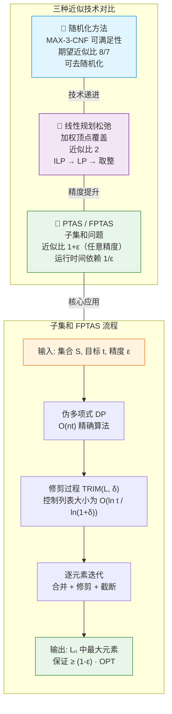

## 相关笔记

**前置依赖**：
- [[35.1 近似算法基础与顶点覆盖]] — 近似比的定义、顶点覆盖的贪心2-近似算法
- [[35.2 旅行商与集合覆盖]] — TSP的近似困难性、集合覆盖的 $\ln n$-近似
- [[第34章_NP完全性-章节汇总]] — NP完全性理论、归约方法

**关联知识**：
- [[34.3 经典NP完全问题]] — 3-CNF可满足性（3-SAT）的NP完全性证明
- [[34.2 NP完全性与归约]] — 多项式时间归约、NP类的定义
- [[29.1 线性规划的表述与算法]] — 线性规划的标准形式与单纯形法
- [[29.2 将问题表述为线性规划]] — 整数规划与线性规划的关系
- [[第05章_概率分析与随机化算法/5.4 概率分析与指示器随机变量的进一步应用]] — 指示器随机变量的定义与期望的线性性
- [[5.4 概率分析与指示器随机变量的进一步应用]] — 随机化算法的基本概念
- [[14.3 动态规划设计要素]] — 动态规划的基本范式
- [[离散数学/concepts/二项分布]] — 二项分布的概率计算

**章节汇总**：
- [[第35章_近似算法-章节汇总]]

---

> [!abstract] 概览
> 本节探讨三种重要的近似算法设计技术：**随机化方法**、**线性规划松弛与取整**，以及**多项式时间近似方案（PTAS）**。
>
> - **35.4 随机化和线性规划**：首先用最简单的随机赋值算法为 MAX-3-CNF 可满足性问题给出期望 $8/7$-近似，然后通过条件期望方法去随机化，得到确定性近似算法；接着将加权顶点覆盖问题公式化为整数规划，通过LP松弛与取整技术获得2-近似。
> - **35.5 子集和问题的PTAS**：在伪多项式时间精确算法的基础上，引入修剪（trimming）过程来控制列表规模，构造出完全多项式时间近似方案（FPTAS），使得对任意 $\varepsilon > 0$，都能在关于 $n$ 和 $1/\varepsilon$ 的多项式时间内找到 $(1-\varepsilon)$-近似解。
>
> 这三种技术代表了近似算法从"固定近似比"到"任意精度逼近"的递进层次，是NP困难问题算法设计的核心工具箱。

---

---

## 核心思想

### 35.4 随机化和线性规划

#### 35.4.1 MAX-3-CNF 可满足性的随机近似

**问题定义**

给定一个 3-CNF 布尔公式 $\phi$，其中包含 $n$ 个布尔变量 $x_1, x_2, \ldots, x_n$ 和 $m$ 个子句 $C_1, C_2, \ldots, C_m$。每个子句 $C_j$ 恰好由 3 个文字（literal）通过 OR 连接而成，每个文字要么是某个变量 $x_i$，要么是其否定 $\neg x_i$。目标是找到一个真值赋值（truth assignment），使得被满足的子句数量最大化。

**与判定版本的关系**

回顾 [[34.3 经典NP完全问题]] 中的内容，3-SAT 的判定版本（是否存在满足所有子句的赋值）是 NP 完全的。MAX-3-CNF 可满足性是其优化版本：即使无法满足所有子句，我们也要尽可能多地满足子句。由于判定版本是 NP 困难的，优化版本自然也是 NP 困难的。

**随机算法**

考虑以下极其简单的随机化算法：

> **算法 RANDOM-3-CNF-SAT($\phi$)**
> 对每个变量 $x_i$（$i = 1, 2, \ldots, n$），独立地以概率 $1/2$ 赋值为 TRUE，以概率 $1/2$ 赋值为 FALSE。

这个算法的运行时间是 $O(n)$——只需要生成 $n$ 个随机比特。关键问题在于：它的期望表现如何？

**期望分析（逐步推导）**

为了分析这个随机算法，我们使用 [[5.4 概率分析与指示器随机变量的进一步应用]] 的方法。

**第一步：定义指示器随机变量**

对每个子句 $C_j$（$j = 1, 2, \ldots, m$），定义指示器随机变量：

$$Y_j = \begin{cases} 1 & \text{如果子句 } C_j \text{ 被满足} \\ 0 & \text{如果子句 } C_j \text{ 不被满足} \end{cases}$$

**第二步：分析单个子句被满足的概率**

考虑任意一个子句 $C_j = (l_{j,1} \lor l_{j,2} \lor l_{j,3})$，其中 $l_{j,1}, l_{j,2}, l_{j,3}$ 是三个文字。子句 $C_j$ 不被满足，当且仅当三个文字全部为假。

由于每个变量的赋值是独立均匀随机的（TRUE 和 FALSE 各以 $1/2$ 概率出现），而每个文字要么是某个变量本身，要么是其否定，因此每个文字为假的概率也是 $1/2$。三个文字相互独立（因为它们涉及不同的变量——在 3-CNF 中，同一子句内的文字通常涉及不同变量），所以：

$$P(Y_j = 0) = P(\text{所有3个文字为假}) = \left(\frac{1}{2}\right)^3 = \frac{1}{8}$$

因此，子句 $C_j$ 被满足的概率为：

$$P(Y_j = 1) = 1 - P(Y_j = 0) = 1 - \frac{1}{8} = \frac{7}{8}$$

**第三步：计算单个子句的期望**

由于 $Y_j$ 是指示器随机变量：

$$E[Y_j] = 1 \cdot P(Y_j = 1) + 0 \cdot P(Y_j = 0) = \frac{7}{8}$$

**第四步：计算总满足子句数的期望**

定义总满足子句数为：

$$Y = \sum_{j=1}^{m} Y_j$$

由 [[5.4 概率分析与指示器随机变量的进一步应用]] 中期望的线性性（linearity of expectation），无论 $Y_j$ 之间是否独立，都有：

$$E[Y] = E\left[\sum_{j=1}^{m} Y_j\right] = \sum_{j=1}^{m} E[Y_j] = \sum_{j=1}^{m} \frac{7}{8} = \frac{7m}{8}$$

**第五步：建立近似比**

设 OPT 为最优赋值满足的子句数。显然 OPT $\leq m$（最多满足所有 $m$ 个子句），因此：

$$E[Y] = \frac{7m}{8} \geq \frac{7}{8} \cdot \text{OPT}$$

这说明随机赋值的期望满足子句数至少是最优解的 $7/8$。由于 MAX-3-CNF 可满足性是最大化问题，近似比定义为 $\text{OPT} / E[Y]$（或更一般地，我们要求 $E[Y] \geq \alpha \cdot \text{OPT}$，其中 $\alpha < 1$），因此期望近似比为：

$$\frac{\text{OPT}}{E[Y]} \leq \frac{\text{OPT}}{\frac{7}{8}\text{OPT}} = \frac{8}{7}$$

**推论：存在性保证**

由期望的定义，$E[Y] = \frac{7m}{8}$ 意味着至少存在一个赋值满足至少 $\frac{7m}{8}$ 个子句（否则期望不可能达到 $\frac{7m}{8}$）。由此可以得出一个有趣的推论：**每个最多包含 7 个子句的 3-CNF 公式都是可满足的**。因为如果所有赋值最多只能满足 6 个子句（即 $< 7$），那么 $E[Y] < 7 \leq \frac{7}{8} \cdot 8 = 7$，与 $E[Y] = \frac{7m}{8} = \frac{7 \cdot 7}{8} = \frac{49}{8} > 6$ 矛盾。

**去随机化：条件期望方法**

上面的算法是随机的，每次运行可能产生不同结果。我们可以通过**条件期望方法**（method of conditional expectations）将其转化为确定性算法，同时保证结果至少和期望一样好。

核心思想是：逐个确定每个变量的赋值，每次选择使条件期望不降低的值。

> **算法 DERANDOMIZE-3-CNF-SAT($\phi$)**
> 1. 令 $E_0 = 7m/8$（无条件期望）
> 2. 对 $i = 1, 2, \ldots, n$：
>    - 计算条件期望 $E[Y \mid x_i = \text{TRUE}]$ 和 $E[Y \mid x_i = \text{FALSE}]$
>    - 选择使条件期望较大的赋值，固定 $x_i$ 的值
>    - 更新期望值
> 3. 返回确定的赋值

**正确性论证**：

设已确定前 $i-1$ 个变量的赋值后，剩余 $n - i + 1$ 个变量未确定。此时条件期望为：

$$E[Y \mid x_1 = a_1, \ldots, x_{i-1} = a_{i-1}]$$

由全期望公式（law of total expectation）：

$$E[Y \mid x_1 = a_1, \ldots, x_{i-1} = a_{i-1}] = \frac{1}{2} E[Y \mid x_1 = a_1, \ldots, x_{i-1} = a_{i-1}, x_i = \text{TRUE}] + \frac{1}{2} E[Y \mid x_1 = a_1, \ldots, x_{i-1} = a_{i-1}, x_i = \text{FALSE}]$$

因此，两个条件期望中至少有一个大于等于当前期望。我们选择较大的那个，就能保证期望不降。经过 $n$ 步后，所有变量都已确定，条件期望就等于实际满足的子句数，而这个值始终 $\geq E_0 = 7m/8$。

**计算复杂度**：每步需要计算条件期望，可以在 $O(m)$ 时间内完成（遍历所有子句，统计在当前部分赋值下已确定满足的子句数，加上未确定子句的期望贡献）。总共 $n$ 步，总时间为 $O(nm)$。

---

#### 35.4.2 加权顶点覆盖的 LP 松弛

**问题回顾**

在 [[35.1 近似算法基础与顶点覆盖]] 中，我们用贪心算法给出了（无权）顶点覆盖的 2-近似。现在考虑**加权版本**：给定无向图 $G = (V, E)$，每个顶点 $v \in V$ 有一个正权重 $w(v) > 0$，目标是找到一个顶点覆盖 $C \subseteq V$（即每条边至少有一个端点在 $C$ 中），使得总权重 $w(C) = \sum_{v \in C} w(v)$ 最小化。

**整数规划公式化**

加权顶点覆盖可以自然地公式化为一个**整数线性规划**（Integer Linear Program, ILP）问题。引入决策变量 $x_v$（对每个 $v \in V$）：

$$x_v = \begin{cases} 1 & \text{如果顶点 } v \text{ 被选入覆盖} \\ 0 & \text{否则} \end{cases}$$

整数规划如下：

$$
\begin{align}
\text{最小化} \quad & \sum_{v \in V} w(v) \cdot x_v \tag{目标函数} \\
\text{满足} \quad & x_u + x_v \geq 1 \quad \text{（对每条边 } (u,v) \in E \text{）} \tag{覆盖约束} \\
& x_v \in \{0, 1\} \quad \text{（对每个 } v \in V \text{）} \tag{整数约束}
\end{align}
$$

**约束的直观含义**：对于每条边 $(u,v)$，约束 $x_u + x_v \geq 1$ 要求至少有一个端点被选中（$x_u = 1$ 或 $x_v = 1$），这正是顶点覆盖的定义。

设这个整数规划的最优解值为 $w^*$，则 $w^*$ 就是加权顶点覆盖问题的最优值。

**LP 松弛**

整数规划（ILP）通常是 NP 困难的。LP 松弛的核心思想是：**将整数约束放松为连续约束**，从而得到一个可以在多项式时间内求解的线性规划（LP）。

将 $x_v \in \{0, 1\}$ 放松为 $0 \leq x_v \leq 1$，得到松弛后的 LP：

$$
\begin{align}
\text{最小化} \quad & \sum_{v \in V} w(v) \cdot x_v \tag{LP 目标函数} \\
\text{满足} \quad & x_u + x_v \geq 1 \quad \text{（对每条边 } (u,v) \in E \text{）} \tag{覆盖约束} \\
& 0 \leq x_v \leq 1 \quad \text{（对每个 } v \in V \text{）} \tag{松弛约束}
\end{align}
$$

**LP 松弛的关键性质**：由于 ILP 的可行解集合是 LP 可行解集合的子集（每个 0-1 解也是满足 $0 \leq x_v \leq 1$ 的解），而 ILP 和 LP 的目标函数相同，因此：

$$w_{LP}^* \leq w^*$$

其中 $w_{LP}^*$ 是 LP 的最优解值。这意味着 LP 的最优解给出了原问题最优解的一个**下界**。这个下界是整个方法的基础。

**取整算法**

用 [[29.1 线性规划的表述与算法]] 中的方法（如单纯形法或内点法）在多项式时间内求解 LP，得到最优解 $x^*$。然后执行取整：

> **算法 LP-VERTEX-COVER($G, w$)**
> 1. 求解上述 LP，得到最优解 $x^*$
> 2. 构造覆盖：$C = \{v \in V : x_v^* \geq 1/2\}$
> 3. 返回 $C$

**正确性证明**：$C$ 确实是一个顶点覆盖。

对任意边 $(u,v) \in E$，由 LP 的覆盖约束：

$$x_u^* + x_v^* \geq 1$$

如果 $x_u^* < 1/2$ 且 $x_v^* < 1/2$，则 $x_u^* + x_v^* < 1$，矛盾。因此至少有一个端点满足 $x^* \geq 1/2$，即至少有一个端点在 $C$ 中。

**2-近似证明（逐步推导）**

现在证明 $w(C) \leq 2 \cdot w^*$。

**第一步：分析取整后的权重**

对每个被选入覆盖的顶点 $v \in C$，由于 $x_v^* \geq 1/2$，我们有：

$$w(v) = w(v) \cdot 1 \leq w(v) \cdot 2x_v^* = 2w(v)x_v^*$$

这里的关键步骤是：因为 $x_v^* \geq 1/2$，所以 $1 \leq 2x_v^*$，两边同乘 $w(v)$ 得到 $w(v) \leq 2w(v)x_v^*$。

**第二步：求和得到覆盖的总权重**

$$w(C) = \sum_{v \in C} w(v) \leq \sum_{v \in C} 2w(v)x_v^* = 2\sum_{v \in C} w(v)x_v^*$$

**第三步：扩展到所有顶点**

由于 $w(v) > 0$ 且 $x_v^* \geq 0$，添加 $v \notin C$ 的项只会增加求和值：

$$2\sum_{v \in C} w(v)x_v^* \leq 2\sum_{v \in V} w(v)x_v^*$$

**第四步：利用 LP 最优性**

$\sum_{v \in V} w(v)x_v^*$ 正是 LP 的目标函数在最优解 $x^*$ 处的值，即 $w_{LP}^*$：

$$2\sum_{v \in V} w(v)x_v^* = 2w_{LP}^*$$

**第五步：利用松弛的下界性质**

由于 $w_{LP}^* \leq w^*$：

$$2w_{LP}^* \leq 2w^*$$

**综合所有步骤**：

$$w(C) \leq 2\sum_{v \in C} w(v)x_v^* \leq 2\sum_{v \in V} w(v)x_v^* = 2w_{LP}^* \leq 2w^*$$

因此，$w(C) \leq 2w^*$，即这个算法是加权顶点覆盖的 **2-近似算法**。

**LP 松弛方法的一般框架**

LP 松弛与取整是一种通用的近似算法设计范式，其一般流程为：

1. **公式化**：将优化问题写成整数规划（ILP）
2. **松弛**：将整数约束放松为连续约束，得到 LP
3. **求解**：在多项式时间内求解 LP（得到分数最优解）
4. **取整**：将分数解转换为整数可行解
5. **分析**：证明取整后的解与 LP 最优解（进而与 ILP 最优解）之间的近似比

这种方法的强大之处在于：LP 的最优解自动提供了原问题最优解的一个下界（最小化问题）或上界（最大化问题），使得近似比的分析变得系统化。

---

### 35.5 子集和问题的 PTAS

#### 35.5.1 问题定义

**子集和问题**（Subset Sum）：给定一个包含 $n$ 个正整数的有限集 $S = \{s_1, s_2, \ldots, s_n\}$ 和一个目标正整数 $t$，找到一个子集 $S' \subseteq S$，使得：

$$\sum_{x \in S'} x \leq t$$

并且最大化 $\sum_{x \in S'} x$。

**与NP完全性的关系**：子集和的判定版本（是否存在子集之和恰好等于 $t$）是 NP 完全的（见 [[34.3 经典NP完全问题]]）。优化版本自然也是 NP 困难的。

**与背包问题的关系**：子集和是 0-1 背包问题的特例——每个物品的权重等于其价值，背包容量为 $t$。

#### 35.5.2 精确算法（伪多项式时间）

子集和问题有一个基于 [[14.3 动态规划设计要素]] 中动态规划思想的精确算法，运行时间为 $O(nt)$。

**算法思想**：维护一个列表 $L_i$，包含使用 $S$ 中前 $i$ 个元素 $\{s_1, \ldots, s_i\}$ 所能构成的所有可能的子集和。

> **算法 EXACT-SUBSET-SUM($S, t$)**
> 1. $n \leftarrow |S|$
> 2. $L_0 \leftarrow \langle 0 \rangle$
> 3. for $i \leftarrow 1$ to $n$ do
>    - $L_i \leftarrow \text{MERGE-LISTS}(L_{i-1},\; L_{i-1} + s_i)$
>    - 从 $L_i$ 中删除所有 $> t$ 的元素
> 4. return $L_n$ 中的最大元素

其中 $L_{i-1} + s_i$ 表示将 $L_{i-1}$ 中每个元素加上 $s_i$ 得到的新列表，MERGE-LISTS 合并两个有序列表并去除重复元素。

**正确性**：$L_i$ 包含了使用前 $i$ 个元素能构成的所有 $\leq t$ 的子集和。由数学归纳法易证。

**时间复杂度**：$|L_i|$ 最多为 $t + 1$（因为所有元素都是 $\leq t$ 的非负整数），每次 MERGE-LISTS 耗时 $O(|L_{i-1}|)$，总共 $n$ 次迭代，总时间为 $O(nt)$。

**伪多项式性**：当 $t$ 关于输入规模（即 $\log t$）是指数大时，这个算法不是多项式时间的。例如，如果 $t = 2^n$，则运行时间为 $O(n \cdot 2^n)$，远非多项式。

#### 35.5.3 修剪过程（Trimming Procedure）

精确算法的瓶颈在于列表 $L_i$ 可能太大。**修剪**（trimming）的核心思想是：在列表中去除"过于接近"的元素，只保留彼此之间有足够间距的代表元素，从而控制列表大小。

**修剪算法**

> **TRIM($L, \delta$)** — 给定有序列表 $L = \langle y_1, y_2, \ldots, y_m \rangle$（$y_1 < y_2 < \cdots < y_m$）和修剪参数 $\delta > 0$
> 1. $L' \leftarrow \langle y_1 \rangle$（总是保留最小元素）
> 2. $last \leftarrow y_1$
> 3. for $i \leftarrow 2$ to $m$ do
>    - if $y_i > last \cdot (1 + \delta)$ then
>      - 将 $y_i$ 追加到 $L'$
>      - $last \leftarrow y_i$
> 4. return $L'$

**修剪的直观理解**：想象你在数轴上选点，要求相邻两个选中点之间的距离至少是前一个点的 $\delta$ 倍。如果两个数 $a < b$ 满足 $b \leq a(1+\delta)$，那么 $b$ 和 $a$ 的相对差距不超过 $\delta$，保留 $a$ 就足以"代表"这个区间内的所有值。

**修剪后列表大小的上界**

**引理**：设 $L$ 中所有元素 $\leq t$，则修剪后的列表 $L'$ 满足：

$$|L'| \leq \left\lceil \frac{\ln t}{\ln(1+\delta)} \right\rceil + 1$$

**证明**：

设 $L' = \langle z_1, z_2, \ldots, z_k \rangle$，其中 $z_1 < z_2 < \cdots < z_k$。由修剪规则，对 $j = 2, 3, \ldots, k$：

$$z_j > z_{j-1}(1+\delta)$$

递推可得：

$$z_j > z_1(1+\delta)^{j-1}$$

由于 $z_1 \geq 1$（$L$ 中最小元素为 0，但 $z_1$ 至少为 0；若 $z_1 = 0$，则 $z_2 > 0$，我们从 $z_2$ 开始分析），且 $z_k \leq t$：

$$(1+\delta)^{k-1} < z_k \leq t$$

两边取自然对数：

$$(k-1)\ln(1+\delta) < \ln t$$

因此：

$$k - 1 < \frac{\ln t}{\ln(1+\delta)}$$

$$k < \frac{\ln t}{\ln(1+\delta)} + 1$$

由于 $k$ 是整数：

$$k \leq \left\lceil \frac{\ln t}{\ln(1+\delta)} \right\rceil + 1$$

即 $|L'| \leq \left\lceil \frac{\ln t}{\ln(1+\delta)} \right\rceil + 1$。$\blacksquare$

**利用近似 $\ln(1+\delta) \approx \delta$**（当 $\delta$ 很小时）：$|L'| = O\left(\frac{\ln t}{\delta}\right)$。

#### 35.5.4 PTAS 算法

将修剪过程嵌入到精确算法中，得到近似方案：

> **APPROX-SUBSET-SUM($S, t, \varepsilon$)**
> 1. $n \leftarrow |S|$
> 2. $L_0 \leftarrow \langle 0 \rangle$
> 3. for $i \leftarrow 1$ to $n$ do
>    - $L_i \leftarrow \text{MERGE-LISTS}(L_{i-1},\; L_{i-1} + s_i)$
>    - $L_i \leftarrow \text{TRIM}(L_i,\; \varepsilon / 2n)$
>    - 从 $L_i$ 中删除所有 $> t$ 的元素
> 4. return $L_n$ 中的最大元素

**与精确算法的区别**：仅在每次迭代后增加了一步修剪，修剪参数为 $\delta = \varepsilon / 2n$。

#### 35.5.5 正确性分析

**目标**：证明算法返回值 $z$ 满足 $(1 - \varepsilon) y^* \leq z \leq y^*$，其中 $y^*$ 是最优解。

**上界 $z \leq y^*$** 是显然的：算法只考虑 $S$ 中元素的子集和，且删除了所有 $> t$ 的元素，因此返回值不可能超过最优解。

**下界的证明**是核心难点。我们需要证明修剪过程不会丢失太多精度。

**关键引理**：设 $P_i$ 为使用前 $i$ 个元素能构成的所有 $\leq t$ 的子集和的集合（即精确算法中 $L_i$ 对应的集合），$L_i$ 为近似算法中第 $i$ 次迭代后的列表。则对 $P_i$ 中的每个元素 $y$，存在 $L_i$ 中的元素 $z$ 满足：

$$(1 - \varepsilon/2n)^i y \leq z \leq y$$

**证明（对 $i$ 进行数学归纳法）**：

**基础情况（$i = 0$）**：$P_0 = \{0\}$，$L_0 = \langle 0 \rangle$。$y = 0$，$z = 0$，显然 $(1 - \varepsilon/2n)^0 \cdot 0 = 0 \leq 0 \leq 0$。成立。

**归纳步骤**：假设引理对 $i-1$ 成立，证明对 $i$ 也成立。

考虑 $P_i$ 中的任意元素 $y$。$y$ 要么属于 $P_{i-1}$（不使用 $s_i$），要么等于 $y' + s_i$，其中 $y' \in P_{i-1}$（使用 $s_i$）。

**情况1**：$y \in P_{i-1}$。

由归纳假设，存在 $z' \in L_{i-1}$ 满足 $(1 - \varepsilon/2n)^{i-1} y \leq z' \leq y$。

在构造 $L_i$ 时，首先执行 MERGE-LISTS($L_{i-1}$, $L_{i-1} + s_i$)，$z'$ 被包含在合并结果中。然后执行 TRIM($L_i$, $\varepsilon/2n$)。

修剪可能删除 $z'$，但修剪的性质保证了：如果 $z'$ 被删除，那么存在一个保留的元素 $z \leq z'$（因为修剪只删除与前一个保留元素"太近"的元素，保留的元素是更大的那个）。更准确地说，修剪后 $L_i$ 中存在元素 $z$ 满足：

$$z \leq z' \cdot (1 + \varepsilon/2n)$$

且 $z \geq z'$ 对应的被保留的前驱元素。但更精确的分析如下：

设修剪后的列表为 $L_i' = \text{TRIM}(\text{合并结果}, \varepsilon/2n)$。由修剪的定义，$L_i'$ 中最后一个 $\leq z'$ 的元素 $z$ 满足 $z \geq z' / (1 + \varepsilon/2n)$（因为如果 $z < z' / (1 + \varepsilon/2n)$，则 $z' > z(1+\varepsilon/2n)$，$z$ 和 $z'$ 之间不会被删除更多元素）。

因此：

$$z \geq \frac{z'}{1 + \varepsilon/2n}$$

结合归纳假设 $z' \geq (1 - \varepsilon/2n)^{i-1} y$：

$$z \geq \frac{(1 - \varepsilon/2n)^{i-1} y}{1 + \varepsilon/2n}$$

利用不等式 $\frac{1}{1+x} \geq 1 - x$（对 $x > -1$）：

$$z \geq (1 - \varepsilon/2n)^{i-1} y \cdot (1 - \varepsilon/2n) = (1 - \varepsilon/2n)^i y$$

同时 $z \leq z' \leq y$。故 $(1 - \varepsilon/2n)^i y \leq z \leq y$。成立。

**情况2**：$y = y' + s_i$，其中 $y' \in P_{i-1}$。

由归纳假设，存在 $z' \in L_{i-1}$ 满足 $(1 - \varepsilon/2n)^{i-1} y' \leq z' \leq y'$。

令 $\hat{z} = z' + s_i$。由于 MERGE-LISTS 的操作，$\hat{z}$ 被包含在合并结果中。

由 $z' \leq y'$ 可得 $\hat{z} = z' + s_i \leq y' + s_i = y$。

由 $z' \geq (1 - \varepsilon/2n)^{i-1} y'$ 可得：

$$\hat{z} = z' + s_i \geq (1 - \varepsilon/2n)^{i-1} y' + s_i$$

这里需要更精细的分析。注意到 $y = y' + s_i$，所以 $y' = y - s_i$。代入上式：

$$\hat{z} \geq (1 - \varepsilon/2n)^{i-1}(y - s_i) + s_i = (1 - \varepsilon/2n)^{i-1} y + s_i(1 - (1 - \varepsilon/2n)^{i-1})$$

由于 $s_i > 0$ 且 $(1 - \varepsilon/2n)^{i-1} < 1$，第二项为正，因此 $\hat{z} \geq (1 - \varepsilon/2n)^{i-1} y$。

经过修剪后（与情况1类似的分析），$L_i$ 中存在 $z$ 满足：

$$z \geq \frac{\hat{z}}{1 + \varepsilon/2n} \geq \frac{(1 - \varepsilon/2n)^{i-1} y}{1 + \varepsilon/2n} \geq (1 - \varepsilon/2n)^i y$$

且 $z \leq \hat{z} \leq y$。成立。

**归纳完成**。$\blacksquare$

**最终近似比的推导**

设最优解为 $y^*$，则 $y^* \in P_n$。由关键引理，$L_n$ 中存在 $z$ 满足：

$$(1 - \varepsilon/2n)^n y^* \leq z \leq y^*$$

算法返回 $L_n$ 中的最大元素，这个最大值至少为 $z$，因此返回值 $\geq (1 - \varepsilon/2n)^n y^*$。

现在估计 $(1 - \varepsilon/2n)^n$。利用不等式 $(1 - x)^k \geq 1 - kx$（对 $0 < x < 1$）：

$$(1 - \varepsilon/2n)^n \geq 1 - n \cdot \frac{\varepsilon}{2n} = 1 - \varepsilon/2$$

因此返回值 $\geq (1 - \varepsilon/2) y^*$。

但我们可以得到更紧的界。利用不等式 $e^{-x} \geq 1 - x$（对所有实数 $x$）以及 $(1 - x)^k \geq e^{-2kx}$（对 $0 < x < 1/2$）：

$$(1 - \varepsilon/2n)^n \geq e^{-2n \cdot \varepsilon/2n} = e^{-\varepsilon} \geq 1 - \varepsilon$$

因此返回值 $\geq (1 - \varepsilon) y^*$，即算法是 $(1 - \varepsilon)$-近似的。

#### 35.5.6 运行时间分析

**每次迭代的列表大小**：修剪参数为 $\delta = \varepsilon / 2n$，列表中元素 $\leq t$，因此：

$$|L_i| \leq \left\lceil \frac{\ln t}{\ln(1 + \varepsilon/2n)} \right\rceil + 1 = O\left(\frac{n \ln t}{\varepsilon}\right)$$

**MERGE-LISTS 的耗时**：$O(|L_{i-1}|) = O\left(\frac{n \ln t}{\varepsilon}\right)$。

**TRIM 的耗时**：$O(|L_i|) = O\left(\frac{n \ln t}{\varepsilon}\right)$。

**总运行时间**：$n$ 次迭代，每次 $O\left(\frac{n \ln t}{\varepsilon}\right)$：

$$T(n, \varepsilon) = O\left(\frac{n^2 \ln t}{\varepsilon}\right)$$

**FPTAS 的判定**：运行时间是 $n$ 的多项式（$n^2$），也是 $1/\varepsilon$ 的多项式（$1/\varepsilon$）。但注意 $\ln t$ 项——$t$ 是输入数值的一部分，$\ln t$ 是输入规模的多项式（因为 $t$ 用 $\lceil \log_2 t \rceil$ 个比特表示）。因此，运行时间关于输入规模和 $1/\varepsilon$ 都是多项式的。

**结论**：子集和问题有一个**完全多项式时间近似方案（FPTAS）**。

#### 35.5.7 PTAS 与 FPTAS 的对比

**定义对比**：

| 性质 | PTAS | FPTAS |
|:---|:---|:---|
| 全称 | 多项式时间近似方案 | 完全多项式时间近似方案 |
| 对任意 $\varepsilon > 0$ | 提供 $(1+\varepsilon)$-近似 | 提供 $(1+\varepsilon)$-近似 |
| 运行时间 | $\text{poly}(n) \cdot f(1/\varepsilon)$ | $\text{poly}(n, 1/\varepsilon)$ |
| $f(1/\varepsilon)$ 的限制 | 可以是任意函数（如指数函数） | 必须是多项式 |
| 实际意义 | $\varepsilon$ 越小，时间可能急剧增长 | $\varepsilon$ 变小，时间增长平缓 |

**关系**：FPTAS $\subset$ PTAS。每个 FPTAS 都是一个 PTAS，但反之不然。

**拥有 PTAS 但没有 FPTAS 的问题**：一些 NP 困难问题有 PTAS 但被证明不存在 FPTAS（除非 P = NP），例如：
- 带权完成时间和的调度问题（某些变体）
- 多维背包问题

**拥有 FPTAS 的问题**：
- 子集和问题（本节内容）
- 0-1 背包问题
- 单机加权完成时间和调度

**没有 PTAS 的问题**：如果 P $\neq$ NP，以下问题不存在 PTAS：
- 一般的旅行商问题（TSP）
- 集合覆盖问题（除非 P = NP）
- 最大团问题

**生活化类比**：

- **PTAS** 就像用普通相机拍照——你可以通过增加曝光时间来获得更清晰的照片，但曝光时间可能从 1 秒增长到 1 小时甚至更长。精度越高，代价可能指数增长。
- **FPTAS** 就像用数码相机调分辨率——从 100 万像素调到 1000 万像素，处理时间只增加几倍，而不会爆炸式增长。精度提升的代价是"可控的"。

---

> [!info] 随机化近似算法与去随机化
> 随机化方法是近似算法设计中的重要工具。通过先设计一个期望表现良好的随机算法，再利用条件期望或概率方法（如 pairwise independence、discrepancy theory）进行去随机化，可以得到确定性的近似保证。Chalmers 大学的高级算法课程详细讲解了 MAX-SAT 的 7/8 近似算法及其去随机化过程。
>
> **参考资源**：[Advanced Algorithms - Probability and Randomized Algorithms (Chalmers University)](https://www.cse.chalmers.se/edu/year/2016/course/TDA251/AdvAlgo2016-lec-9-10.pdf)

> [!info] LP 松弛与取整方法
> 线性规划松弛是近似算法中最系统化的设计范式之一。其核心思想是：将 NP 困难的整数规划放松为多项式时间可解的线性规划，利用 LP 最优解作为原问题最优解的界，然后通过取整将分数解转换为整数解。Wisconsin 大学 CS787 课程提供了 LP 松弛与取整的系统讲解。
>
> **参考资源**：[CS787: Advanced Algorithms - LP Relaxation and Rounding (UW-Madison)](http://pages.cs.wisc.edu/~shuchi/courses/787-F09/scribe-notes/lec10.pdf)

> [!info] PTAS 与 FPTAS 的理论背景
> 多项式时间近似方案（PTAS）和完全多项式时间近似方案（FPTAS）代表了近似算法可以达到的最高精度。Princeton 大学的算法课程讲义清晰地定义了 PTAS、FPTAS 以及它们之间的层次关系，并讨论了哪些 NP 困难问题拥有 PTAS 或 FPTAS。
>
> **参考资源**：[Approximation Algorithms - Princeton CS423](https://www.cs.princeton.edu/~wayne/cs423/lectures/approx-alg.pdf)

> [!info] FPTAS 在背包问题与调度中的应用
> FPTAS 不仅适用于子集和问题，在背包问题、单机调度问题等多个领域都有重要应用。2023 年的研究工作将背包问题的 FPTAS 运行时间推进到接近 $O(n^2)$，展示了这一领域的持续进展。ACM 数字图书馆收录了大量关于 FPTAS 在调度和装箱问题中应用的文献。
>
> **参考资源**：[A Nearly Quadratic-Time FPTAS for Knapsack (arXiv)](https://arxiv.org/html/2308.07821v2)

---

> [!warning] 期望近似比与高概率近似比的区别
> 随机化近似算法分析的是**期望**近似比，即 $E[\text{ALG}] \geq \alpha \cdot \text{OPT}$。这并不意味着每次运行都能达到这个保证——单次运行的结果可能远差于期望。如果需要高概率保证（如以 $1 - 1/n^c$ 的概率达到 $\alpha$-近似），通常需要重复运行并取最优结果，利用 Chernoff 界或 Markov 不等式进行放大分析。在学术写作和考试中，必须明确区分"期望近似比"和"高概率近似比"。

> [!warning] LP 松弛的取整方案不是万能的
> 并非所有 LP 松弛都能通过简单的阈值取整（如 $x_v \geq 1/2$ 则取 1）获得好的近似比。取整方案的设计高度依赖问题结构。例如，对于集合覆盖问题的 LP 松弛，需要使用**随机化取整**（每个 $x_v$ 以概率 $x_v^*$ 选中）结合 Chernoff 界分析，才能获得 $O(\ln n)$-近似比。直接取整可能产生不可行解或极差的近似比。设计取整方案时，必须首先验证可行性（取整后的解是否满足所有约束），然后再分析近似比。

> [!warning] PTAS 不意味着问题容易
> 拥有 PTAS 并不意味着问题在实践中有高效算法。PTAS 的运行时间中隐藏在 $f(1/\varepsilon)$ 里的常数或指数可能非常大，使得对较小的 $\varepsilon$（如 $\varepsilon = 0.001$）算法在实际上不可行。此外，PTAS 的存在性是一个理论性质——它告诉我们"原则上可以任意逼近最优解"，但并不保证实际效率。FPTAS 提供了更强的实用性保证，但即使 FPTAS 的多项式次数也可能很高（如 $O(n^3/\varepsilon^2)$），在大规模实例上仍可能面临挑战。

---

## 习题精选

| 题号 | 题目描述 | 难度 | 考察重点 |
|:---:|:---|:---:|:---|
| 35.4-1 | 证明将随机赋值算法应用于 MAX-2-CNF 可满足性时，期望近似比为 4/3 | ★★☆ | 随机化分析、指示器随机变量 |
| 35.4-2 | 给出加权顶点覆盖 LP 松弛的一个实例，使得取整后 $w(C) = 2w^*$（近似比紧） | ★★☆ | LP 松弛紧性分析 |
| 35.5-1 | 证明 TRIM 过程的正确性：修剪后的列表大小上界 | ★★☆ | 修剪过程分析 |
| 35.5-2 | 对 $S = \{1, 2, 3, 4, 5\}$, $t = 9$, $\varepsilon = 0.5$，手动执行 APPROX-SUBSET-SUM | ★★★ | 算法手动模拟 |
| 35.5-3 | 证明如果 P $\neq$ NP，则 TSP 不存在 PTAS | ★★★☆ | PTAS 的局限性、Gap 技术 |
| 35.5-4 | 分析 APPROX-SUBSET-SUM 中将 $\varepsilon/2n$ 改为 $\varepsilon/n$ 后的近似比 | ★★★ | 误差累积分析 |

> [!faq]- 35.4-1 解答：MAX-2-CNF 的期望近似比
>
> **题目**：证明将随机赋值算法应用于 MAX-2-CNF 可满足性时，期望近似比为 $4/3$。
>
> **分析**：
>
> MAX-2-CNF 公式中每个子句恰好包含 2 个文字。
>
> 设指示器随机变量 $Y_j$ 表示子句 $C_j$ 被满足。
>
> 子句 $C_j$ 不被满足当且仅当两个文字都为假：
>
> $$P(Y_j = 0) = \left(\frac{1}{2}\right)^2 = \frac{1}{4}$$
>
> $$P(Y_j = 1) = 1 - \frac{1}{4} = \frac{3}{4}$$
>
> $$E[Y_j] = \frac{3}{4}$$
>
> 总期望满足子句数：
>
> $$E[Y] = \sum_{j=1}^{m} E[Y_j] = \frac{3m}{4} \geq \frac{3}{4} \cdot \text{OPT}$$
>
> 期望近似比为 $\text{OPT}/E[Y] \leq 4/3$。
>
> **结论**：随机赋值算法对 MAX-2-CNF 给出期望 $4/3$-近似。

> [!faq]- 35.4-2 解答：LP 松弛的紧性实例
>
> **题目**：给出一个加权顶点覆盖实例，使得 LP 松弛取整后的 $w(C) = 2w^*$。
>
> **构造**：
>
> 考虑图 $G = (V, E)$，其中 $V = \{u, v\}$，$E = \{(u, v)\}$（单条边）。设 $w(u) = w(v) = 1$。
>
> **ILP 最优解**：$x_u = 1, x_v = 0$（或反之），$w^* = 1$。
>
> **LP 最优解**：$x_u = x_v = 1/2$，$w_{LP}^* = 1 \cdot (1/2) + 1 \cdot (1/2) = 1$。
>
> **取整结果**：$x_u = 1/2 \geq 1/2$，$x_v = 1/2 \geq 1/2$，所以 $C = \{u, v\}$，$w(C) = 2$。
>
> **近似比**：$w(C)/w^* = 2/1 = 2$。
>
> **结论**：2-近似的界是紧的（tight），存在实例恰好达到近似比 2。

> [!faq]- 35.5-2 解答：手动执行 APPROX-SUBSET-SUM
>
> **题目**：对 $S = \{1, 2, 3, 4, 5\}$, $t = 9$, $\varepsilon = 0.5$，手动执行 APPROX-SUBSET-SUM。
>
> **参数计算**：$n = 5$，$\delta = \varepsilon/2n = 0.5/10 = 0.05$。
>
> **初始**：$L_0 = \langle 0 \rangle$
>
> **$i = 1$, $s_1 = 1$**：
> - 合并：$L_{i-1} + s_1 = \langle 1 \rangle$
> - MERGE-LISTS($\langle 0 \rangle$, $\langle 1 \rangle$) = $\langle 0, 1 \rangle$
> - TRIM($\langle 0, 1 \rangle$, $0.05$)：$1 > 0 \times 1.05 = 0$，保留。$L_1 = \langle 0, 1 \rangle$
> - 无元素 $> 9$
>
> **$i = 2$, $s_2 = 2$**：
> - $L_1 + s_2 = \langle 2, 3 \rangle$
> - MERGE-LISTS($\langle 0, 1 \rangle$, $\langle 2, 3 \rangle$) = $\langle 0, 1, 2, 3 \rangle$
> - TRIM($\langle 0, 1, 2, 3 \rangle$, $0.05$)：
>   - 保留 0，last = 0
>   - $1 > 0 \times 1.05 = 0$？是，保留 1，last = 1
>   - $2 > 1 \times 1.05 = 1.05$？是，保留 2，last = 2
>   - $3 > 2 \times 1.05 = 2.1$？是，保留 3，last = 3
> - $L_2 = \langle 0, 1, 2, 3 \rangle$
>
> **$i = 3$, $s_3 = 3$**：
> - $L_2 + s_3 = \langle 3, 4, 5, 6 \rangle$
> - MERGE-LISTS($\langle 0, 1, 2, 3 \rangle$, $\langle 3, 4, 5, 6 \rangle$) = $\langle 0, 1, 2, 3, 4, 5, 6 \rangle$
> - TRIM($\langle 0, 1, 2, 3, 4, 5, 6 \rangle$, $0.05$)：
>   - 保留 0, last = 0
>   - $1 > 0$？是，保留 1, last = 1
>   - $2 > 1.05$？是，保留 2, last = 2
>   - $3 > 2.1$？是，保留 3, last = 3
>   - $4 > 3.15$？是，保留 4, last = 4
>   - $5 > 4.2$？是，保留 5, last = 5
>   - $6 > 5.25$？是，保留 6, last = 6
> - $L_3 = \langle 0, 1, 2, 3, 4, 5, 6 \rangle$
>
> **$i = 4$, $s_4 = 4$**：
> - $L_3 + s_4 = \langle 4, 5, 6, 7, 8, 9, 10 \rangle$
> - MERGE-LISTS = $\langle 0, 1, 2, 3, 4, 5, 6, 7, 8, 9, 10 \rangle$
> - TRIM：类似分析，所有相邻元素间距 > 5%，全部保留
> - 删除 $> 9$ 的元素：删除 10
> - $L_4 = \langle 0, 1, 2, 3, 4, 5, 6, 7, 8, 9 \rangle$
>
> **$i = 5$, $s_5 = 5$**：
> - $L_4 + s_5 = \langle 5, 6, 7, 8, 9, 10, 11, 12, 13, 14 \rangle$
> - MERGE-LISTS = $\langle 0, 1, 2, 3, 4, 5, 6, 7, 8, 9, 10, 11, 12, 13, 14 \rangle$
> - TRIM：修剪后保留大部分元素（$\delta = 0.05$ 很小）
> - 删除 $> 9$ 的元素
> - $L_5$ 中最大元素为 9
>
> **结果**：返回 9。最优解为 $4 + 5 = 9$（或 $1 + 3 + 5 = 9$），近似比 $= 9/9 = 1$。
>
> **注意**：由于 $\varepsilon = 0.5$ 较大且实例规模小，修剪几乎不生效，算法返回了精确最优解。

> [!faq]- 35.5-3 解答：TSP 不存在 PTAS（除非 P = NP）
>
> **题目**：证明如果 P $\neq$ NP，则度量 TSP 的一般版本（不满足三角不等式）不存在 PTAS。
>
> **证明思路**（Gap 技术）：
>
> 假设一般 TSP 存在 PTAS，则对任意 $\varepsilon > 0$，存在多项式时间算法 $A_\varepsilon$ 使得 $A_\varepsilon$ 的输出代价 $\leq (1+\varepsilon) \cdot \text{OPT}$。
>
> 取 $\varepsilon = 1/2$，则 $A_{1/2}$ 给出 $3/2$-近似。
>
> 给定哈密顿回路问题的实例（判定是否存在哈密顿回路），构造 TSP 实例：
> - 同一个图 $G = (V, E)$
> - 边权：$w(e) = 1$（若 $e \in E$），$w(e) = 2$（若 $e \notin E$）
>
> 分析：
> - 如果 $G$ 有哈密顿回路，则 $\text{OPT} = n$（使用 $n$ 条权为 1 的边）
> - 如果 $G$ 没有哈密顿回路，则 $\text{OPT} \geq n + 1$（至少需要一条权为 2 的边）
>
> 运行 $A_{1/2}$：
> - 若 $A_{1/2}$ 返回代价 $\leq 3n/2$，则 $\text{OPT} \leq 3n/2 < n + 1$（当 $n \geq 3$ 时），说明 $G$ 有哈密顿回路
> - 若 $A_{1/2}$ 返回代价 $> 3n/2$，则 $\text{OPT} > n$，说明 $G$ 没有哈密顿回路
>
> 因此 $A_{1/2}$ 可以在多项式时间内判定哈密顿回路问题，而后者是 NP 完全的。矛盾。
>
> **结论**：除非 P = NP，一般 TSP 不存在 PTAS。

> [!faq]- 35.5-4 解答：修改修剪参数后的近似比
>
> **题目**：将 APPROX-SUBSET-SUM 中的修剪参数从 $\varepsilon/2n$ 改为 $\varepsilon/n$，分析近似比如何变化。
>
> **分析**：
>
> 修剪参数变为 $\delta = \varepsilon/n$。关键引理变为：对 $P_i$ 中每个 $y$，存在 $L_i$ 中的 $z$ 满足：
>
> $$(1 - \varepsilon/n)^i y \leq z \leq y$$
>
> 对 $i = n$：
>
> $$(1 - \varepsilon/n)^n y^* \leq z \leq y^*$$
>
> 利用 $(1 - \varepsilon/n)^n \geq e^{-\varepsilon}$（当 $n$ 足够大时）：
>
> $$z \geq e^{-\varepsilon} y^* \geq (1 - \varepsilon) y^*$$
>
> 近似比仍然为 $(1 - \varepsilon)$-近似。
>
> **运行时间变化**：$\delta$ 增大为原来的 2 倍，列表大小变为原来的约 $1/2$，MERGE-LISTS 和 TRIM 的耗时减半。总运行时间变为 $O(n^2 \ln t / (2\varepsilon)) = O(n^2 \ln t / \varepsilon)$，与原来同阶。
>
> **结论**：修改后近似比不变，但列表更小，实际运行更快。这说明 $\varepsilon/2n$ 的选择留有安全余量。

---

## 视频学习指南

| 资源 | 讲者/来源 | 主题 | 时长 | 推荐指数 |
|:---|:---|:---|:---:|:---:|
| MIT 6.046J Lecture 12 | Prof. Erik Demaine | Approximation Algorithms: Randomized & LP | ~80min | ★★★★★ |
| CMU 15-451 Lecture 23 | Prof. Anupam Gupta | LP Relaxations and Rounding | ~75min | ★★★★★ |
| Stanford CS261 Lecture 8 | Prof. Tim Roughgarden | Randomized Rounding | ~60min | ★★★★☆ |
| Princeton COS 521 Lecture 5 | Prof. Moses Charikar | Subset Sum and FPTAS | ~70min | ★★★★☆ |
| UC Berkeley CS 170 Lecture 34 | Prof. Satish Rao | Approximation Algorithms Overview | ~50min | ★★★☆☆ |

---

> [!quote] 教材原文
> "We can derive a randomized 8/7-approximation algorithm for MAX-3-CNF satisfiability. The algorithm is simple: assign each variable the value TRUE with probability 1/2 and the value FALSE with probability 1/2, independently. By linearity of expectation, the expected number of satisfied clauses is 7m/8, and therefore the expected approximation ratio is 8/7."
>
> — CLRS, Chapter 35, Section 35.4

> [!quote] 教材原文
> "A polynomial-time approximation scheme (PTAS) is an algorithm that takes as input not only an instance of an optimization problem but also a value ε > 0, and that produces a solution that is within a factor of 1 + ε of being optimal. For a maximization problem, a PTAS is a (1 - ε)-approximation algorithm."
>
> — CLRS, Chapter 35, Section 35.5

> [!quote] 教材原文
> "A fully polynomial-time approximation scheme (FPTAS) is a PTAS whose running time is polynomial in both the size of the instance and 1/ε. The approximation scheme for the subset-sum problem is in fact an FPTAS."
>
> — CLRS, Chapter 35, Section 35.5

> [!quote] 教材原文
> "The key idea is that we can trim the lists by removing elements that are close to each other in value. Since we are looking for an approximate answer, we do not need to maintain all possible sums."
>
> — CLRS, Chapter 35, Section 35.5

---

## 参见Wiki

- [[第35章_近似算法/35.1 近似算法基础与顶点覆盖]] — 近似比的定义与基本概念
- [[第35章_近似算法/35.2 旅行商与集合覆盖]] — 贪心近似算法
- [[第35章_近似算法-章节汇总]] — 全章知识体系
- [[第29章_线性规划/29.1 线性规划的表述与算法]] — LP 求解方法
- [[第34章_NP完全性/34.3 经典NP完全问题]] — 3-SAT 的 NP 完全性
- [[5.4 概率分析与指示器随机变量的进一步应用]] — 期望的线性性

#学习/算法导论/第35章-近似算法
