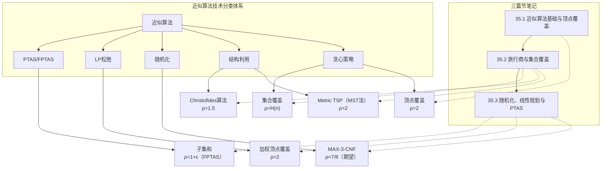

## 相关笔记

- [[35.1 近似算法基础与顶点覆盖]] — 近似比定义与顶点覆盖2-近似
- [[35.2 旅行商与集合覆盖]] — TSP与集合覆盖的近似算法
- [[35.3 随机化、线性规划与PTAS]] — 随机化、LP松弛与PTAS
- 前置章节：[[第34章_NP完全性-章节汇总]]

> [!abstract] 概览
> 第35章系统介绍了**近似算法**——当问题为NP困难因而无法在多项式时间内精确求解时，退而求其次寻找"足够好"的解的策略。全章围绕一个核心问题展开：**如何用多项式时间算法给出与最优解差距有界的解？** 章节依次介绍了五种主要的近似技术：
>
> 1. **贪心策略**：以顶点覆盖的2-近似贪心算法为代表，通过局部最优选择获得全局有界近似比；
> 2. **结构利用**：利用三角不等式等特殊结构，给出Metric TSP的2-近似（基于MST）和Christofides的1.5-近似算法；
> 3. **随机化**：对MAX-3-CNF可满足性问题，通过随机赋值获得期望至少7/8最优的近似比；
> 4. **线性规划松弛**：将整数规划约束放松为线性规划，求解后取整，以加权顶点覆盖为例展示2-近似；
> 5. **PTAS（多项式时间近似方案）**：对子集和问题，通过修剪状态空间实现任意精度 $(1+\varepsilon)$ 的近似，且运行时间为 $\mathrm{poly}(n, 1/\varepsilon)$（即FPTAS）。
>
> 各问题的近似比汇总：顶点覆盖 $\rho=2$、Metric TSP $\rho=2$（Christofides $\rho=1.5$）、集合覆盖 $\rho=H(n)$、MAX-3-CNF $\rho=7/8$（期望）、加权顶点覆盖 $\rho=2$、子集和 $\rho=1+\varepsilon$（FPTAS）。

## 核心概念回顾

| 概念 | 定义 | 典型问题 | 近似比 |
|:-----|:-----|:---------|:-------|
| $\rho$-近似算法 | 多项式时间内给出不超过最优解 $\rho$ 倍的解 | 顶点覆盖 | $\rho=2$ |
| APX类 | 存在常数因子近似的NP优化问题 | 顶点覆盖、Metric TSP | $O(1)$ |
| PTAS | 对任意 $\varepsilon>0$ 存在 $(1+\varepsilon)$-近似的算法 | 子集和 | $1+\varepsilon$ |
| FPTAS | 运行时间为 $\mathrm{poly}(n, 1/\varepsilon)$ 的PTAS | 子集和、背包 | $1+\varepsilon$ |
| 不可近似 | 不存在多项式时间近似算法（除非P=NP） | 一般TSP | — |

> [!info] 近似比的方向性
> - **最小化问题**（如顶点覆盖）：$\rho$-近似算法保证 $C \leq \rho \cdot C^*$，其中 $C$ 为算法输出代价，$C^*$ 为最优代价。$\rho \geq 1$，$\rho$ 越小越好。
> - **最大化问题**（如MAX-3-CNF）：$\rho$-近似算法保证 $C \geq \rho \cdot C^*$。$\rho \leq 1$，$\rho$ 越大越好。

## 跨章关联

- **Ch34 NP完全性**：近似算法的理论动机——NP完全问题无法在多项式时间内精确求解（除非P=NP），因此近似算法成为处理NP困难优化问题的主要实用手段。[[第34章_NP完全性-章节汇总]]
- **Ch21 MST / Kruskal / Prim**：TSP近似算法的基础——Metric TSP的2-近似算法通过先构造最小生成树（MST），再执行前序遍历来构造哈密顿回路，MST的性质保证了近似比。
- **Ch29 线性规划**：LP松弛技术的基础——将整数线性规划的整数约束放松为连续约束，利用多项式时间线性规划求解器获得分数最优解，再通过取整策略获得整数可行解。[[离散数学/concepts/贪心算法]]
- **Ch5 概率分析**：随机化近似算法的期望分析工具——MAX-3-CNF的随机赋值近似算法通过分析每个子句被满足的概率，利用期望的线性性质推导期望近似比。
- **Ch16 贪心算法**：贪心近似策略的设计范式——顶点覆盖和集合覆盖的近似算法均采用贪心策略，通过局部最优选择获得全局有界近似比。

## 综合复习题

> [!faq]- 题1：证明若存在一般TSP的 $\rho$-近似算法（$\rho$ 为常数），则P=NP
> **题目描述**：一般TSP（不满足三角不等式）中，若存在一个多项式时间的 $\rho$-近似算法（$\rho$ 为常数），证明P=NP。
>
> **解题思路**：利用TSP的判定版本（哈密顿回路问题）的NP完全性，构造归约。关键在于：如果能近似求解一般TSP，就能判定哈密顿回路是否存在。
>
> **标准答案**：
> 1. 给定哈密顿回路问题的实例 $G=(V,E)$，构造一般TSP实例：完全图 $K_n$（$n=|V|$），边权定义为
>    $$w(u,v) = \begin{cases} 1 & \text{若 } (u,v) \in E \\ 1 + \rho n & \text{若 } (u,v) \notin E \end{cases}$$
> 2. 若 $G$ 存在哈密顿回路，则TSP最优解代价为 $n$（仅使用权为1的边）。
> 3. 若 $G$ 不存在哈密顿回路，则任何回路至少包含一条权为 $1+\rho n$ 的边，最优解代价 $\geq n - 1 + 1 + \rho n = n + \rho n$。
> 4. 若 $\rho$-近似算法输出代价 $\leq \rho \cdot n$，则最优解代价 $\leq \rho n < n + \rho n$，故 $G$ 存在哈密顿回路。
> 5. 若 $\rho$-近似算法输出代价 $> \rho \cdot n$，则最优解代价 $> n$，故 $G$ 不存在哈密顿回路。
> 6. 因此，$\rho$-近似算法可在多项式时间内判定哈密顿回路问题，即NP=co-NP=P。

> [!faq]- 题2：对比顶点覆盖的两种2-近似算法（贪心 vs LP松弛），分析各自优劣
> **题目描述**：分别描述顶点覆盖的贪心2-近似算法和基于LP松弛的2-近似算法，对比它们的时间复杂度、近似比紧性、可扩展性和实际表现。
>
> **解题思路**：分别回顾两种算法的执行流程和近似比证明，然后从多个维度进行对比分析。
>
> **标准答案**：
>
> **贪心算法**：重复选取一条边，将其两端点加入覆盖集，删除所有关联边。时间复杂度 $O(V+E)$。
>
> **LP松弛算法**：将顶点覆盖形式化为整数线性规划 $\min \sum x_v$，s.t. $x_u + x_v \geq 1$，$x_v \in \{0,1\}$。放松为LP后求解，对满足 $\bar{x}_v \geq 1/2$ 的顶点取 $x_v=1$。时间复杂度取决于LP求解器。
>
> **对比**：
>
> | 维度 | 贪心算法 | LP松弛算法 |
> |:-----|:---------|:-----------|
> | 时间复杂度 | $O(V+E)$，非常高效 | 依赖LP求解器，通常较慢 |
> | 近似比 | 2 | 2 |
> | 近似比紧性 | 紧（存在达到2倍的最坏实例） | 紧 |
> | 可扩展性 | 难以推广到加权版本 | 自然推广到加权版本 |
> | 理论价值 | 简单直观，适合教学 | 展示了LP松弛的一般方法论 |
> | 实际表现 | 对稀疏图效果好 | 在加权场景下更优 |

> [!faq]- 题3：解释为什么集合覆盖的贪心算法近似比是 $H(n)$ 而非常数，这一结果是否紧？
> **题目描述**：集合覆盖的贪心算法每次选取覆盖最多未覆盖元素的集合。解释为什么其近似比为 $H(n) = \sum_{i=1}^{n} 1/i$（第 $n$ 个调和数）而非一个更小的常数，并说明这一上界是否紧。
>
> **解题思路**：回顾近似比证明中的charging argument，理解为什么需要用到调和数的求和。然后构造达到该近似比的紧实例。
>
> **标准答案**：
>
> **近似比为 $H(n)$ 的原因**：证明采用charging argument。将最优解中每个集合 $S_i^*$ 的代价 $c(S_i^*)$ 分摊到它所覆盖的元素上。对于被 $S_i^*$ 覆盖的元素 $e$，设 $e$ 在贪心算法执行到第 $k$ 步时被首次覆盖，此时 $e$ 是某个被选集合 $S_k$ 的成员。由于贪心策略选择覆盖最多未覆盖元素的集合，$S_k$ 至少覆盖了 $|S_i^* \cap U_k|$ 个元素（$U_k$ 为第 $k$ 步时仍未覆盖的元素集）。通过逐步分析，每个元素分摊到的代价不超过 $c(S_k) / |S_k \cap U_k|$，累加后总代价不超过 $H(n) \cdot \mathrm{OPT}$。
>
> **紧性**：该结果是紧的。可以构造一族实例使得贪心算法的输出代价恰好为 $H(n) \cdot \mathrm{OPT}$。经典构造使用集合系统 $\{S_1, S_2, \ldots, S_n\}$，其中 $S_k$ 恰好覆盖 $n - k + 1$ 个"新"元素，贪心算法按 $S_1, S_2, \ldots, S_n$ 的顺序选取，而最优解只需选取一个精心设计的 $O(\log n)$ 个集合即可覆盖全部元素。

> [!faq]- 题4：区分PTAS和FPTAS，给出各自的存在性条件和代表问题
> **题目描述**：准确定义PTAS和FPTAS，说明两者的关键区别，并分别给出存在PTAS但不存FPTAS的问题实例、以及存在FPTAS的问题实例。
>
> **解题思路**：从定义出发，聚焦于运行时间对 $1/\varepsilon$ 的依赖关系。然后回顾各类问题的近似性分类。
>
> **标准答案**：
>
> **PTAS（多项式时间近似方案）**：对任意固定的 $\varepsilon > 0$，算法在 $O(n^{f(1/\varepsilon)})$ 时间内给出 $(1+\varepsilon)$-近似解，其中 $f$ 可以是任意函数。关键特征：$\varepsilon$ 固定后，运行时间是关于 $n$ 的多项式，但多项式的次数可能随 $1/\varepsilon$ 增大而急剧增长。
>
> **FPTAS（完全多项式时间近似方案）**：PTAS的加强版，要求运行时间为 $\mathrm{poly}(n, 1/\varepsilon)$，即对 $n$ 和 $1/\varepsilon$ 都是多项式的。关键特征：即使 $1/\varepsilon$ 很大，运行时间仍然可控。
>
> **关键区别**：PTAS中 $1/\varepsilon$ 可以出现在多项式的指数位置（如 $n^{1/\varepsilon}$），而FPTAS中 $1/\varepsilon$ 只能出现在多项式的底数位置（如 $n^2 / \varepsilon$）。
>
> **代表问题**：
> - 存在FPTAS：子集和问题（通过修剪状态空间的动态规划实现）、背包问题
> - 存在PTAS但不确定FPTAS：某些几何问题（如Euclidean TSP存在PTAS——Arora算法）
> - 不存在PTAS（除非P=NP）：一般TSP、最大团问题

---

## 常见误区

> [!warning] 常见误区
> 1. **近似比定义因最小化/最大化问题而异**：最小化问题的 $\rho$-近似保证 $C \leq \rho \cdot C^*$（$\rho \geq 1$，越小越好），最大化问题的 $\rho$-近似保证 $C \geq \rho \cdot C^*$（$\rho \leq 1$，越大越好）。混淆两者的方向会导致对近似比优劣的完全误判。
>
> 2. **PTAS不意味着实际可用**：PTAS的运行时间可能是 $O(n^{1/\varepsilon})$，当 $\varepsilon$ 较小时（如 $\varepsilon = 0.001$），运行时间为 $O(n^{1000})$，在实际中完全不可行。只有FPTAS才保证对所有合理的 $\varepsilon$ 值都能在可接受的时间内完成。
>
> 3. **近似比是最坏情况保证**：近似比 $\rho$ 描述的是算法在最坏输入上的表现上界。在实际应用中，算法的平均表现可能远优于 $\rho$ 所保证的界限。例如，顶点覆盖的2-近似算法在随机图上的期望表现通常远好于2倍最优。

## 学习要点总结

| 节号 | 主题 | 核心要点 | 掌握标准 |
|:-----|:-----|:---------|:---------|
| 35.1 | 近似算法基础与顶点覆盖 | 近似比定义、APX/PTAS/FPTAS分类、顶点覆盖2-近似贪心算法 | 能证明近似比、区分各类近似算法 |
| 35.2 | 旅行商与集合覆盖 | Metric TSP 2-近似（MST法）/ Christofides 1.5-近似、集合覆盖 $H(n)$-近似贪心 | 能推导近似比证明、理解charging argument |
| 35.3 | 随机化、LP与PTAS | MAX-3-CNF随机近似（期望7/8）、LP松弛取整、子集和PTAS/FPTAS | 能分析期望近似比、理解修剪过程 |

## 参见Wiki

- [[第35章_近似算法/35.1 近似算法基础与顶点覆盖]] — 近似比定义与顶点覆盖2-近似
- [[第35章_近似算法/35.2 旅行商与集合覆盖]] — TSP与集合覆盖的近似算法
- [[第35章_近似算法/35.3 随机化、线性规划与PTAS]] — 随机化、LP松弛与PTAS
- [[第34章_NP完全性-章节汇总]] — NP完全性理论（近似算法的理论动机）
- [[离散数学/concepts/贪心算法]] — 贪心算法设计范式

#学习/算法导论/第35章-近似算法
