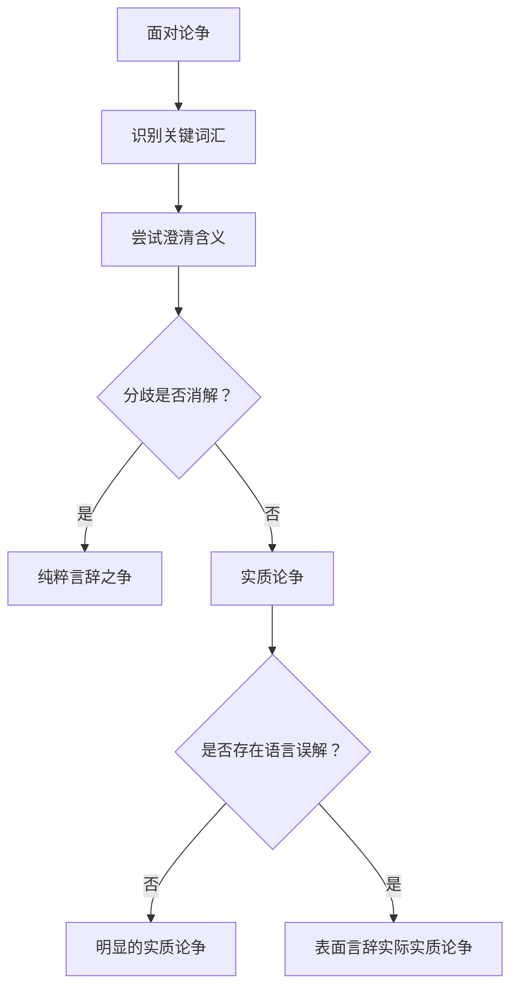

# 实质论争 vs 言辞之争

> [!abstract] 一句话总结
> 实质论争的分歧==不依赖词语含义==（涉及事实或态度的根本分歧），言辞之争的分歧==仅源于词语含义的误解==（统一词义即可消解）。

## 共同点

- 都表现为双方在某个话题上的对立立场
- 都可能涉及对关键词汇的不同理解
- 都需要通过分析来判定其真实性质

## 关键区别

| 维度 | 实质论争 | 言辞之争 |
|:-----|:---------|:---------|
| 分歧来源 | 事实或态度的根本分歧 | 词语含义的误解 |
| 统一词义后 | 分歧==仍然存在== | 分歧==完全消解== |
| 解决途径 | 经验调查（事实）/ 价值讨论（态度） | 澄清词义即可 |
| 示例 | A支持扬基队，B支持红袜队 | "声音"=空气震动 vs 听觉体验 |

## 实质论争的两种子类型

| 子类型 | 分歧维度 | 示例 |
|:-------|:---------|:-----|
| 事实上的实质论争 | 对事实的不同信念 | C认为迈阿密在里约南部，D不这么认为 |
| 态度上的实质论争 | 对相同事实的不同态度 | A支持扬基队，B支持红袜队 |

## 第三种论争：表面言辞实际实质论争

> [!warning] 最隐蔽的类型
> 论争中==确实包含==对词项用法的误解，但即使言辞层面被澄清，仍然存在==超出语词含义的实质分歧==。这是最常见的论争类型，也是最容易被误判的。

| 步骤 | 操作 | 结果 |
|:-----|:-----|:-----|
| 1 | 识别语言误解 | 发现"色情作品"定义不同 |
| 2 | 澄清词义 | 统一定义 |
| 3 | 检验分歧 | ==分歧仍然存在==——对影片评价的实质争议未消解 |

## 诊断流程

## 深层联系

> [!info] 维特根斯坦的"意义即使用"
> **来源：** Wittgenstein, L. (1953). *Philosophical Investigations*
>
> 维特根斯坦提出，词语的意义不在于它所指称的固定对象，而在于它在语言游戏中的==使用方式==。许多论争之所以产生，正是因为同一个词在不同语境中被以不同方式"使用"——争论双方实际上在不同的语言游戏中使用同一个词，却误以为自己在讨论同一个问题。理解"意义即使用"，就能更深刻地理解为什么纯粹言辞之争如此普遍。

## 参见

- [[3.3 论争与含混性]] — 详细讨论与习题
- [[情感语言与中性语言]] — 情感语言在论争中的角色
- [[语言的功能]] — 语言的多重功能是理解论争的基础
- [[论证]] — 论争是论证的一种特殊形式
