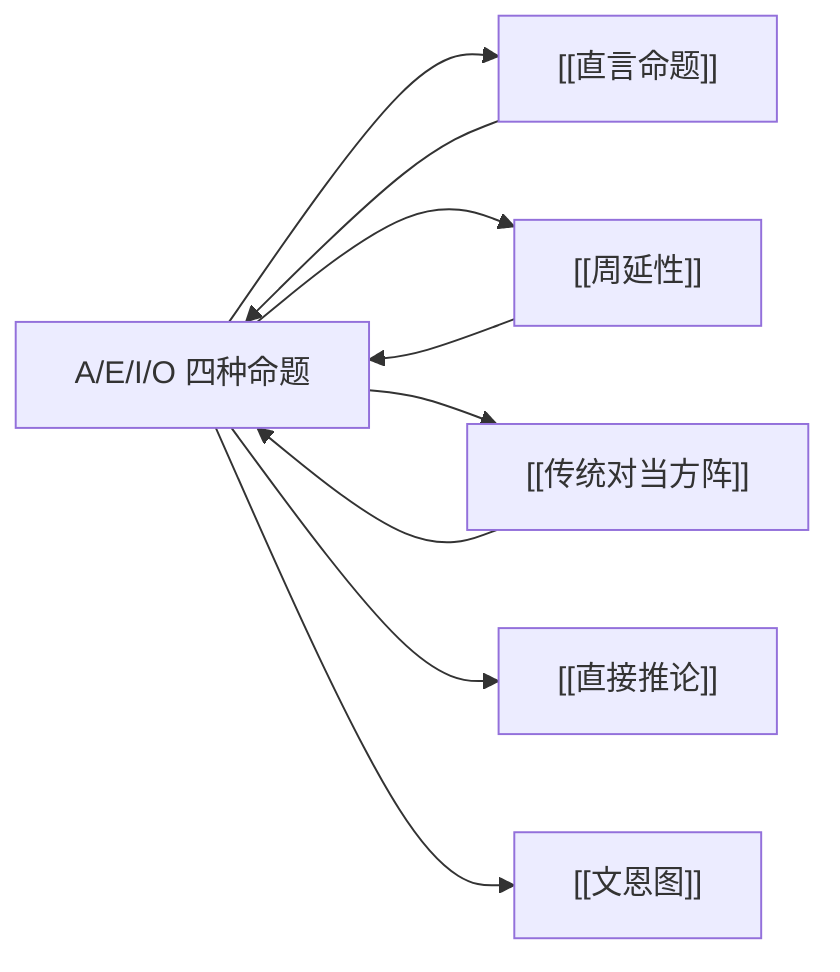

# A/E/I/O 四种命题

> [!abstract] 概述
> A、E、I、O 是[[直言命题]]的四种标准形式，由"质"（肯定/否定）与"量"（全称/特称）的 2 x 2 组合穷尽，每种形式对应一种特定的类与类之间的关系。

## 定义

> [!def] 四种标准直言命题（The Four Standard Forms）
> 每一个标准直言命题都属于以下四种形式之一，由质（联项"是/不是"）和量（量词"所有/没有/有"）的组合唯一确定。

| 类型 | 名称 | 标准形式 | 质 | 量 | 字母来源 |
|:-----|:-----|:---------|:---|:---|:---------|
| **A** | 全称肯定 | 所有 S 是 P | 肯定 | 全称 | 拉丁语 **A**ffirmo（我肯定）的第一个元音 |
| **E** | 全称否定 | 没有 S 是 P | 否定 | 全称 | 拉丁语 N**e**go（我否定）的第一个元音 |
| **I** | 特称肯定 | 有 S 是 P | 肯定 | 特称 | 拉丁语 Aff**i**rmo（我肯定）的第二个元音 |
| **O** | 特称否定 | 有 S 不是 P | 否定 | 特称 | 拉丁语 Neg**o**（我否定）的第二个元音 |

> [!info] 字母的由来
> A 和 I 取自拉丁语动词 *Affirmo*（我肯定）的两个元音字母，E 和 O 取自拉丁语动词 *Nego*（我否定）的两个元音字母。这一命名传统可追溯至中世纪逻辑学家，沿用至今。

## 核心性质

| 性质 | 陈述 |
|:-----|:-----|
| 穷尽性 | 质与量的 2 x 2 组合穷尽了所有标准直言命题形式 |
| 互斥性 | 每个标准直言命题恰好属于四种形式之一 |
| "有"的含义 | "有"（some）= ==至少有一个==（at least one），不暗示恰好一个，也不暗示多数 |
| 类关系对应 | 每种命题形式对应 S 类与 P 类之间的一种或多种集合关系 |

## "有"的精确含义

> [!warning] "有"不等于"有些"
> 在日常语言中，"有些"往往暗示"有些但不是全部"。但在逻辑学中，"有"（some）仅仅意味着==至少有一个==（at least one），它==不排除=="所有"的可能性。
>
> - "有S是P"为真时，"所有S是P"也可能为真
> - "有S是P"为真时，恰好只有一个S是P也可以，全部S都是P也可以
>
> 这一点对于理解传统对当方阵中的"差等关系"至关重要。

## 四种命题的类关系与集合论表达

### A 命题：所有 S 是 P

- **断定**：S 类的全部对象都包含在 P 类之中
- **集合论**：$S \subseteq P$（S 是 P 的子集）
- **欧拉图描述**：代表 S 的圆完全包含在代表 P 的圆内部
- **可能对应的类关系**：
  - S 类与 P 类完全相同（同一关系）
  - S 类是 P 类的真子集（包含于关系）
- **为假的情况**：S 类中有至少一个对象不在 P 类中

### E 命题：没有 S 是 P

- **断定**：S 类的全部对象都被排斥在 P 类之外
- **集合论**：$S \cap P = \emptyset$（S 与 P 的交集为空）
- **欧拉图描述**：代表 S 的圆与代表 P 的圆完全分离，没有重叠
- **可能对应的类关系**：
  - S 类与 P 类互斥（全异关系）
- **为假的情况**：S 类与 P 类有至少一个共同对象

### I 命题：有 S 是 P

- **断定**：S 类中至少有一个对象包含在 P 类之中
- **集合论**：$S \cap P \neq \emptyset$（S 与 P 的交集非空）
- **欧拉图描述**：代表 S 的圆与代表 P 的圆至少有部分重叠
- **可能对应的类关系**：
  - S 类与 P 类完全相同（同一关系）
  - S 类是 P 类的真子集（包含于关系）
  - P 类是 S 类的真子集（包含关系）
  - S 类与 P 类部分重叠（交叉关系）
- **为假的情况**：S 类与 P 类完全没有共同对象

### O 命题：有 S 不是 P

- **断定**：S 类中至少有一个对象被排斥在 P 类之外
- **集合论**：$S \not\subseteq P$（S 不是 P 的子集），即 $S - P \neq \emptyset$
- **欧拉图描述**：代表 S 的圆中有一部分落在代表 P 的圆之外
- **可能对应的类关系**：
  - S 类与 P 类互斥（全异关系）
  - P 类是 S 类的真子集（包含关系）
  - S 类与 P 类部分重叠（交叉关系）
- **为假的情况**：S 类的全部对象都在 P 类中

## 四种命题与五种类关系的对应总表

| 类关系 | A | E | I | O |
|:-------|:--:|:--:|:--:|:--:|
| S = P（同一） | 真 | 假 | 真 | 假 |
| S ⊂ P（真包含于） | 真 | 假 | 真 | 假 |
| S ⊃ P（真包含） | 假 | 假 | 真 | 真 |
| S ∩ P ≠ ∅ 且 S ⊄ P 且 P ⊄ S（交叉） | 假 | 假 | 真 | 真 |
| S ∩ P = ∅（全异） | 假 | 真 | 假 | 真 |

> [!tip] 记忆方法
> - A 命题只在 S 被 P 包含时为真（前两种关系）
> - E 命题只在 S 与 P 完全分离时为真（最后一种关系）
> - I 命题只在 S 与 P 完全分离时为假（最后一种关系除外都真）
> - O 命题只在 S 被 P 完全包含时为假（前两种关系除外都真）

## 与其他概念的关系

- **[[直言命题]]**：A/E/I/O 是直言命题的四种标准形式
- **[[周延性]]**：不同类型的命题中，主项 S 和谓项 P 的周延情况不同——A 命题 S 周延 P 不周延，E 命题都周延，I 命题都不周延，O 命题 S 不周延 P 周延
- **[[传统对当方阵]]**：描述 A、E、I、O 四种命题之间的矛盾、反对、下反对和差等关系
- **[[直接推论]]**：基于 A/E/I/O 的形式特征进行的推理操作（换位、换质、换质位等）
- **[[文恩图]]**：用图形方式表示 A/E/I/O 四种命题所断定的类关系

## 补充

> [!info] 欧拉图与文恩图
> 欧拉图（Euler Diagram）用圆的包含、排斥和重叠关系来表示具体的类关系。文恩图（Venn Diagram）在欧拉图的基础上引入了"阴影"（表示空集）和"X"（表示非空）标记，能够更精确地表示 A/E/I/O 四种命题的断定内容。文恩图的优势在于：它使用统一的图式，通过不同的标记方式来区分四种命题，而欧拉图需要为每种命题画出不同的图形。
>
> 例如，A 命题"所有 S 是 P"在文恩图中表示为：S 与 P 的重叠区域之外的部分（即 S - P）被涂上阴影，表示该区域为空。

## 应用

1. **直言三段论**（第6章）：三段论由三个直言命题（两个前提、一个结论）组成，每个命题都是 A/E/I/O 形式
2. **逻辑有效性检验**：通过判定三段论中各命题的 A/E/I/O 类型，可以检验三段论的有效性
3. **日常论证分析**：将自然语言论断转化为 A/E/I/O 标准形式，以揭示其逻辑结构

### 第10章：量化符号化

第10章将A/E/I/O四种命题转化为谓词逻辑的标准符号化形式：

| 命题 | 符号化 | 联结词 | 量词 |
|:-----|:-------|:-------|:-----|
| A：所有S是P | $(x)(Sx \supset Px)$ | 蕴涵 $\supset$ | 全称 $\forall$ |
| E：所有S不是P | $(x)(Sx \supset \sim Px)$ | 蕴涵+否定 | 全称 $\forall$ |
| I：有些S是P | $(\exists x)(Sx \cdot Px)$ | 合取 $\cdot$ | 存在 $\exists$ |
| O：有些S不是P | $(\exists x)(Sx \cdot \sim Px)$ | 合取+否定 | 存在 $\exists$ |

> [!tip] 为什么全称用蕴涵、特称用合取？
> - 全称命题（A/E）==无存在含义==，用蕴涵表示条件关系："如果x是S，那么x是P"
> - 特称命题（I/O）==有存在含义==，用合取表示断言："存在x，x是S且x是P"
>
> 这一差异是理解 [[存在含义]] 问题的核心。参见 [[量词]]。

## 参见

- [[直言命题]] — 四种命题的上位概念
- [[周延性]] — 各命题中词项的周延情况
- [[传统对当方阵]] — A、E、I、O 之间的逻辑关系网络
- [[直接推论]] — 基于命题形式的推理操作
- [[文恩图]] — 类关系的图形表示方法
