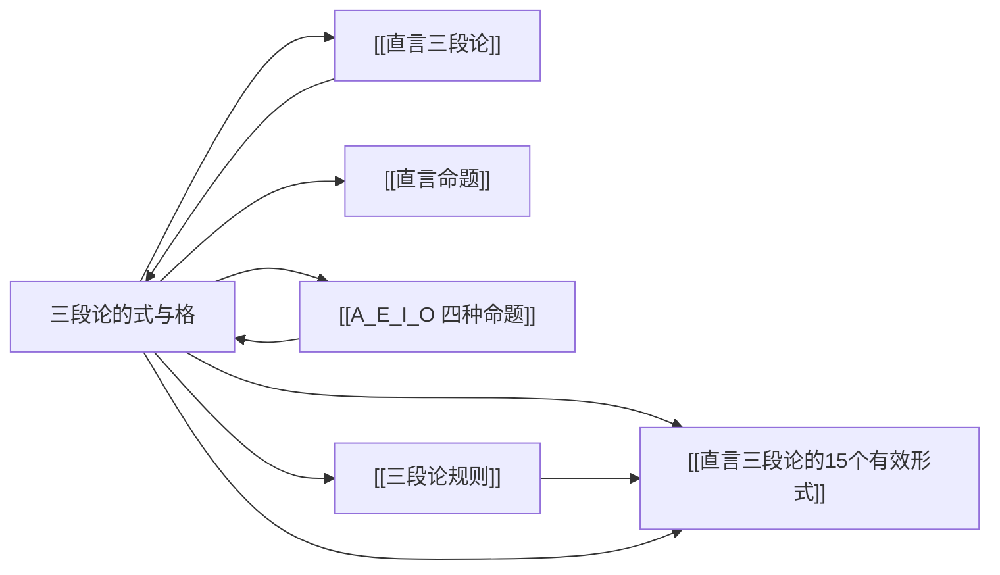

# 三段论的式与格

> [!abstract] 概述
> 式（mood）与格（figure）共同精确地刻画了[[直言三段论]]的形式结构——式描述三个命题的 A/E/I/O 类型序列，格描述中项 M 在前提中的位置。二者组合产生 256 种可能的三段论形式。

## 定义

> [!def] 式（Mood）
> 一个直言三段论的==式==是指其三个命题（大前提、小前提、结论）按顺序排列的 A/E/I/O 类型字母序列。

> [!def] 格（Figure）
> 一个直言三段论的==格==是指其中项 M 在两个前提中的位置排列方式。

## 式（Mood）

式由三个字母组成，分别对应大前提、小前提和结论的命题类型。由于每个命题有 A/E/I/O 四种可能，因此式共有 $4 \times 4 \times 4 = $ ==64 种==。

> [!example] 式的示例
> - **AAA**：大前提是 A 命题，小前提是 A 命题，结论是 A 命题
> - **EIO**：大前提是 E 命题，小前提是 I 命题，结论是 O 命题
> - **AOO**：大前提是 A 命题，小前提是 O 命题，结论是 O 命题

## 格（Figure）

格由中项 M 在大前提和小前提中的位置决定。中项在前提中可以充当主项或谓项，因此共有 $2 \times 2 = $ ==4 种==格。

| 格 | 名称 | 大前提中 M 的位置 | 小前提中 M 的位置 | 模式 |
|:--:|:-----|:------------------|:------------------|:-----|
| **第一格** | — | ==主项== | ==谓项== | M — P, S — M |
| **第二格** | — | ==谓项== | ==谓项== | P — M, S — M |
| **第三格** | — | ==主项== | ==主项== | M — P, M — S |
| **第四格** | — | ==谓项== | ==主项== | P — M, M — S |

> [!tip] 记忆方法
> 可以通过中项 M 在两个前提中的位置来记忆四种格：
> - 第一格：M 分别做主项和谓项（==左-右==）
> - 第二格：M 都做谓项（==右-右==）
> - 第三格：M 都做主项（==左-左==）
> - 第四格：M 分别做谓项和主项（==右-左==）

### 四种格的详细说明

**第一格：M — P, S — M**

```
大前提：M — P    （M 是主项，P 是谓项）
小前提：S — M    （S 是主项，M 是谓项）
结论：  S — P
```

- 中项在大前提中做==主项==，在小前提中做==谓项==
- 亚里士多德认为第一格的三段论是"完善的"（perfect），因为其有效性是自明的
- 经典示例："所有人都是会死的（M—P），苏格拉底是人（S—M），∴ 苏格拉底是会死的（S—P）"

**第二格：P — M, S — M**

```
大前提：P — M    （P 是主项，M 是谓项）
小前提：S — M    （S 是主项，M 是谓项）
结论：  S — P
```

- 中项在两个前提中都做==谓项==
- 第二格的三段论常用于证明某个事物不属于某一类（==区分==功能）
- 示例："所有蝙蝠都是哺乳动物（P—M），没有鸟是哺乳动物（S—M），∴ 没有鸟是蝙蝠（S—P）"

**第三格：M — P, M — S**

```
大前提：M — P    （M 是主项，P 是谓项）
小前提：M — S    （M 是主项，S 是谓项）
结论：  S — P
```

- 中项在两个前提中都做==主项==
- 第三格的三段论常用于反驳全称命题（==反驳==功能）
- 示例："有些哲学家是数学家（M—P），所有哲学家是逻辑学家（M—S），∴ 有些逻辑学家是数学家（S—P）"

**第四格：P — M, M — S**

```
大前提：P — M    （P 是主项，M 是谓项）
小前提：M — S    （M 是主项，S 是谓项）
结论：  S — P
```

- 中项在大前提中做==谓项==，在小前提中做==主项==
- 第四格是中世纪逻辑学家补充的，亚里士多德本人未专门讨论
- 示例："没有懒汉是成功者（P—M），所有成功者都是勤奋的人（M—S），∴ 没有勤奋的人是懒汉（S—P）"

## 256 种可能形式

式有 64 种，格有 4 种，因此三段论的总形式数为：

$$64 \times 4 = 256$$

在这 256 种形式中，只有 ==15 种==是有效的（在布尔解释下；在亚里士多德解释下有更多）。参见[[直言三段论的15个有效形式]]。

> [!info] 形式的表示方法
> 三段论的形式通常用"式 + 格编号"来表示。例如：
> - **AAA-1**：第一格，式为 AAA
> - **EIO-2**：第二格，式为 EIO
> - **OAO-3**：第三格，式为 OAO
> - **AEE-4**：第四格，式为 AEE

## 形式决定有效性

> [!def] 形式有效性（Formal Validity）
> 一个三段论是==有效的==，当且仅当它具有有效的形式。三段论的有效性完全由其式和格决定，==与具体内容无关==。

这一性质具有重要的实践意义：

| 性质 | 说明 |
|:-----|:-----|
| ==形式检验== | 要检验一个三段论是否有效，只需确定其式和格，然后查表即可 |
| ==同类判定== | 所有具有相同式和格的三段论，有效性完全相同 |
| ==反例构造== | 要证明某形式无效，只需构造一个具有相同形式但前提真、结论假的反例 |

> [!example] 反例方法演示
> 要证明 AAA-2（第二格，式为 AAA）无效，可构造如下反例：
> ```
> 大前提：所有狗（P）是哺乳动物（M）    —— 真
> 小前提：所有猫（S）是哺乳动物（M）      —— 真
> ∴ 结论：所有猫（S）是狗（P）            —— 假！
> ```
> 前提都为真但结论为假，因此 AAA-2 形式无效。任何具有 AAA-2 形式的三段论都是无效的。

## 核心性质

| 性质 | 陈述 |
|:-----|:-----|
| 式的种类 | 64 种（$4^3$） |
| 格的种类 | 4 种（中项在前提中的位置排列） |
| 总形式数 | 256 种（$64 \times 4$） |
| 有效形式数 | 15 种（布尔解释下） |
| 内容无关性 | 有效性完全由形式决定，与词项的具体含义无关 |
| 批量判定 | 检验一个形式等于检验所有同形式的三段论 |

## 与其他概念的关系



- **[[直言三段论]]**：式与格是描述三段论形式的两个维度
- **[[直言命题]]**：式由三个直言命题的 A/E/I/O 类型决定
- **[[A_E_I_O 四种命题]]**：式的每个字母都取自 A/E/I/O 四种命题类型
- **[[三段论规则]]**：六条基本规则可用于检验任意式与格组合的有效性
- **[[直言三段论的15个有效形式]]**：256 种形式中经过筛选后确认的 15 种有效形式

## 补充

> [!info] 亚里士多德与格的分类
> 亚里士多德在《前分析篇》中主要系统地讨论了第一格的三段论，并间接涉及了第二格和第三格。第四格的明确表述归功于亚里士多德的学生==德奥弗拉斯特斯==（Theophrastus）以及后来的中世纪逻辑学家。亚里士多德将第一格视为"完善的"格，因为其有效性是直接自明的，而其他格的三段论需要通过第一格来"化归"（reduce）才能证明其有效性。

> [!tip] 如何快速确定格
> 给定一个标准形式的三段论，确定格的步骤：
> 1. 找出中项 M（只在前提中出现、不在结论中出现的词项）
> 2. 检查 M 在大前提中的位置：主项还是谓项？
> 3. 检查 M 在小前提中的位置：主项还是谓项？
> 4. 根据位置组合确定格的编号

## 应用

1. **三段论有效性检验**（第6章）：确定三段论的式和格后，查表或应用[[三段论规则]]判定有效性
2. **反例构造**：对于无效的形式，构造具体反例来证明其无效性
3. **论证分析**：将自然语言论证化为标准形式后，通过式与格快速评估其逻辑质量
4. **有效形式记忆**：系统掌握 15 个有效形式的式与格组合

## 参见

- [[直言三段论]] — 式与格所描述的对象
- [[直言命题]] — 式的构成基块
- [[A_E_I_O 四种命题]] — 式中每个字母的含义
- [[三段论规则]] — 检验式与格有效性的六条规则
- [[直言三段论的15个有效形式]] — 所有有效的式与格组合
