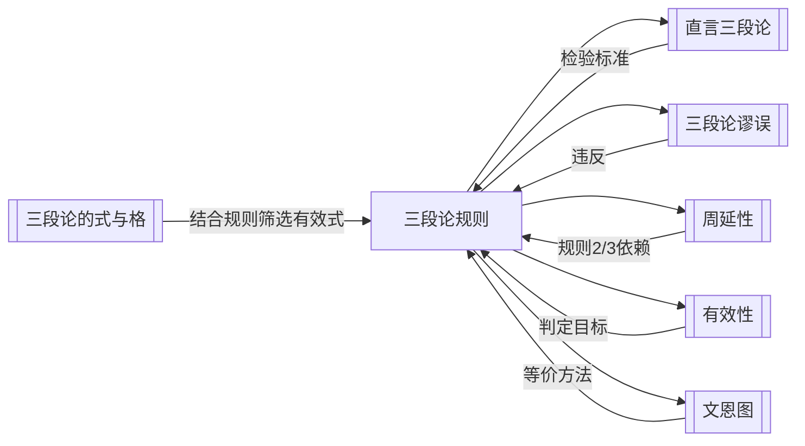

# 三段论规则

> [!abstract] 概述
> 检验标准式直言三段论有效性的==6条基本规则==，违反任一条即判定三段论无效。6条规则与文恩图检验法完全等价，但更为快捷。

## 定义

> [!def] 三段论规则（Rules of Categorical Syllogism）
> 一组用于检验标准式直言三段论有效性的形式规则，共6条。一个标准式直言三段论是==有效的==，当且仅当它满足全部6条规则。违反其中任何一条规则的三段论都是==无效的==。

## 六条规则

### 规则1：恰好三个项，含义一致

> [!def] 规则1
> 一个有效的标准式直言三段论必须恰好包含==三个词项==——小项（S）、大项（P）和中项（M），且每个词项在所有出现处必须保持==相同的含义==。

- 三段论的本质是通过中项 M 来连接小项 S 和大项 P，因此必须有且仅有三个项
- 若同一个词语在不同前提中含义不同，则实质上出现了四个项，连接关系断裂

### 规则2：中项至少在一个前提中周延

> [!def] 规则2
> 在有效的三段论中，==中项（M）至少必须在一个前提中是周延的==。

- 中项的功能是"桥梁"——如果中项在两个前提中都不周延，则中项只涉及了各自类的部分对象，无法保证小项和大项通过中项建立有效连接
- 详见[[周延性]]中关于周延性的定义与判定方法

### 规则3：结论中周延的项在前提中也须周延

> [!def] 规则3
> 在有效的三段论中，==任何在结论中周延的词项，在前提中也必须是周延的==。

- 核心原则：==结论不能断定比前提更多的东西==
- 前提中周延的项在结论中可以不周延（前提可以说得比结论多），但反之不行
- 此规则产生两种谬误：大项不当周延和小项不当周延，详见[[三段论谬误]]

### 规则4：不能两个否定前提

> [!def] 规则4
> 在有效的三段论中，==不能两个前提都是否定命题==。

- 否定命题的作用是"排斥"——断言两个类之间没有交集
- 两个否定前提分别排斥了不同的交集，但无法传递地建立小项与大项之间的确定关系

### 规则5：有否定前提则结论须否定

> [!def] 规则5
> 在有效的三段论中，如果==有一个前提是否定命题，那么结论也必须是否定命题==。

- 否定前提排除了某些可能性，结论不能在前提所排除的范围之外做出肯定断言
- 推论：若结论是否定的，则恰好有一个前提是否定的（由规则4和规则5共同保证）

### 规则6：两全称前提不得特称结论（仅布尔解释）

> [!def] 规则6（布尔解释）
> 在布尔解释下，==两个全称前提不能有效地推出特称结论==。

- 在布尔解释下，全称命题（A、E）==不具有存在含义==，不承诺词项所指称的类非空
- 特称命题（I、O）==具有存在含义==，断言至少存在一个对象
- 从无存在含义的前提无法合法地推出有存在含义的结论
- ==此规则仅适用于布尔解释==，在亚里士多德传统解释下不成立。详见[[布尔解释]]和[[存在谬误]]

## 规则速查表

| 规则 | 内容 | 对应谬误 |
|:---:|:-----|:---------|
| 1 | 恰好三个项，含义一致 | 四项谬误 |
| 2 | 中项至少在一个前提中周延 | 中项不周延谬误 |
| 3 | 结论中周延的项在前提中也须周延 | 大项不当周延 / 小项不当周延 |
| 4 | 不能两个否定前提 | 排斥前提谬误 |
| 5 | 有否定前提则结论须否定 | 从否定推肯定谬误 |
| 6 | 两全称前提不得特称结论（布尔） | 存在谬误 |

## 核心性质

| 性质 | 陈述 |
|:-----|:-----|
| 充要性 | 满足全部6条规则 $\Leftrightarrow$ 三段论有效 |
| 检验方式 | 逐条检查，违反任一条即可判定无效，无需继续 |
| 规则3产生两种谬误 | 大项不当周延和小项不当周延，分别对应大项和小项 |
| 规则6的解释依赖性 | 仅在布尔解释下适用，传统解释下不适用 |
| 与文恩图法等价 | 两种方法的检验结果完全一致，一个三段论通过规则检验当且仅当通过文恩图检验 |

## 与文恩图法的等价性

> [!info] 两种检验方法的对比
> 三段论规则检验法和[[文恩图]]检验法是两种==完全等价==的判定方法：
>
> | 维度 | 规则法 | 文恩图法 |
> |:-----|:-------|:---------|
> | 优势 | ==快捷==——逐条检查即可定位违反的规则 | ==直观==——图形化展示无效的原因 |
> | 操作 | 检查词项数量、周延性、否定关系等 | 画三圆文恩图，标注前提后检查结论 |
> | 定位错误 | 直接指出违反了哪条规则 | 通过 x 位置或阴影关系展示问题 |
> | 适用场景 | 快速判定、教学练习 | 深入理解、展示推理过程 |
>
> 实际应用中，规则法更适合快速判定，文恩图法更适合理解"为什么无效"。

## 与其他概念的关系

- **[[直言三段论]]**：三段论规则是检验直言三段论有效性的核心标准
- **[[三段论谬误]]**：每条规则对应一种或多种谬误，违反规则即犯相应谬误
- **[[周延性]]**：规则2和规则3直接依赖于周延性概念
- **[[有效性]]**：三段论规则是实现有效性判定的具体操作工具
- **[[文恩图]]**：与规则法等价的另一种检验方法，更直观但较慢
- **[[三段论的式与格]]**：结合三段论规则可从256种可能的式中筛选出有效式

## 补充

> [!info] Flage 的系统表述
> **来源：** Flage, D.E. (1995). *Essentials of Logic*
>
> Flage 将三段论规则系统表述为一个判定程序：给定标准式直言三段论，依次检查6条规则。这一程序性表述强调了规则法的==算法性==——它是一个可以机械执行的判定过程，不需要直觉或额外的语义判断。这正是规则法相对于文恩图法的核心优势：一旦掌握了周延性的判定方法，规则检验可以完全机械化地进行。

> [!tip] 检验流程建议
> 推荐按以下顺序逐条检查，可在最早发现违规时即停止：
> 1. 先检查规则1（项的数量和含义）——最基础，错误最明显
> 2. 再检查规则4和规则5（否定关系）——快速扫描即可判断
> 3. 然后检查规则2和规则3（周延性）——需要逐项分析周延情况
> 4. 最后检查规则6（存在含义）——仅在布尔解释下、且前5条均通过时才需检查

## 应用

1. **三段论有效性检验**：对给定的标准式直言三段论逐条检查6条规则，违反任一条即判定无效
2. **有效式筛选**：结合[[三段论的式与格]]，从256种可能的式中筛选出满足全部规则的15个有效式（布尔解释下）
3. **谬误诊断**：通过识别违反的规则编号，快速定位三段论所犯的具体谬误类型
4. **逻辑教学**：作为入门级的形式判定工具，帮助学生建立对有效性检验的直观理解

## 参见

- [[直言三段论]] — 三段论规则所检验的对象
- [[三段论谬误]] — 违反每条规则所犯的具体谬误
- [[周延性]] — 规则2和规则3的核心依赖概念
- [[有效性]] — 三段论规则所判定的目标属性
- [[文恩图]] — 与规则法等价的图形化检验方法
- [[三段论的式与格]] — 结合规则筛选有效三段论形式
- [[存在谬误]] — 规则6所针对的特殊谬误
