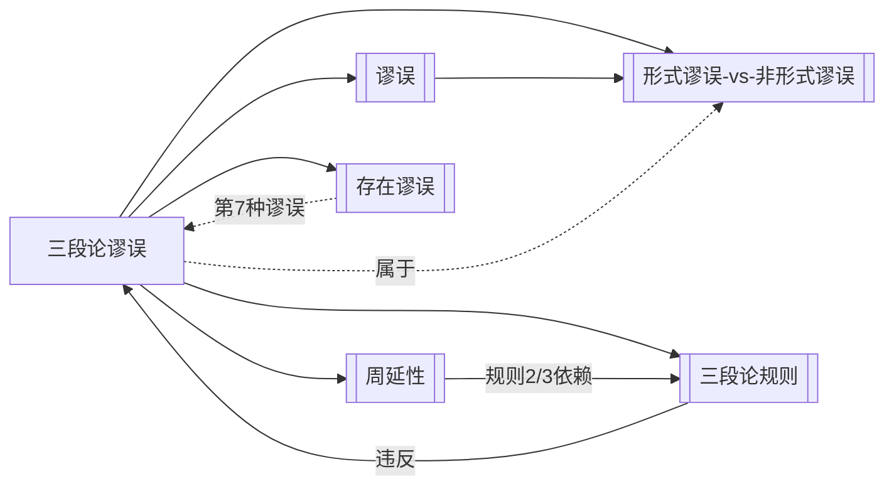

# 三段论谬误

> [!abstract] 概述
> 违反直言三段论6条基本规则所犯的==形式谬误==，共7种。每种谬误对应一条（或半条）被违反的规则，可通过检查三段论的形式结构直接识别。

## 定义

> [!def] 三段论谬误（Syllogistic Fallacies）
> 在标准式直言三段论中，因违反[[三段论规则]]的6条基本规则之一而产生的形式谬误。三段论谬误共有==7种==（规则3产生2种），每一种都可通过检查论证的逻辑形式来识别，==无需理解论证的具体内容==。

## 七种谬误

### 1. 四项谬误（Fallacy of Four Terms）

> [!def] 四项谬误（Four Terms）
> 违反==规则1==（恰好三个项，含义一致）。三段论中出现了四个不同的词项，通常因==语词歧义==（equivocation）导致同一个词语在不同前提中含义不同。

> [!example] 经典例子
> - 大前提：所有狗（动物）是哺乳动物。
> - 小前提：所有猫（动物）是哺乳动物。
> - 结论：所有猫是狗。
>
> 中项"动物"在两个前提中实际指代不同的类（"属于狗类的动物"与"属于猫类的动物"），实质上构成了四个项，连接关系断裂。

### 2. 中项不周延谬误（Fallacy of the Undistributed Middle）

> [!def] 中项不周延谬误（Undistributed Middle）
> 违反==规则2==（中项至少在一个前提中周延）。中项 M 在两个前提中==都不周延==，无法有效连接小项 S 和大项 P。

> [!example] 经典例子
> - 大前提：所有教授是学者。（A命题，"学者"是谓项，==不周延==）
> - 小前提：所有知识分子是学者。（A命题，"学者"是谓项，==不周延==）
> - 结论：所有知识分子是教授。
>
> 中项"学者"在两个前提中都是 A 命题的谓项，均不周延。两个前提只说明"教授"和"知识分子"都与"学者"有交集，但交集部分可能完全不同。

> [!tip] 直观理解
> 中项不周延谬误就像说"所有北京人是中国人，所有上海人是中国人，所以所有上海人是北京人"——两个类都与第三个类有重叠，但重叠的部分可能完全不同。

### 3. 大项不当周延（Illicit Major）

> [!def] 大项不当周延（Illicit Major）
> 违反==规则3==（结论中周延的项在前提中也须周延）。大项 P 在==结论中周延==，但在==前提中不周延==。

> [!example] 经典例子
> - 大前提：所有狗是动物。（A命题，"动物"是谓项，==不周延==）
> - 小前提：没有猫是狗。（E命题）
> - 结论：没有猫是动物。（E命题，"动物"是谓项，==周延==）
>
> 大项"动物"在结论中是 E 命题的谓项，周延；但在大前提中是 A 命题的谓项，不周延。结论断定了"动物"的全部，但前提只涉及了"动物"的部分。

### 4. 小项不当周延（Illicit Minor）

> [!def] 小项不当周延（Illicit Minor）
> 违反==规则3==（结论中周延的项在前提中也须周延）。小项 S 在==结论中周延==，但在==前提中不周延==。

> [!example] 经典例子
> - 大前提：所有鸟有翅膀。（A命题）
> - 小前提：所有鸟是动物。（A命题，"动物"是谓项，==不周延==）
> - 结论：所有动物有翅膀。（A命题，"动物"是主项，==周延==）
>
> 小项"动物"在结论中是 A 命题的主项，周延；但在小前提中是 A 命题的谓项，不周延。结论断定了所有动物都有翅膀，但前提只涉及了动物中属于鸟的那部分。

### 5. 排斥前提谬误（Fallacy of Exclusive Premises）

> [!def] 排斥前提谬误（Exclusive Premises）
> 违反==规则4==（不能两个否定前提）。三段论的两个前提==都是否定命题==，无法建立有效连接。

> [!example] 经典例子
> - 大前提：没有鱼是哺乳动物。（E命题，否定）
> - 小前提：没有鲸是鱼。（E命题，否定）
> - 结论：所有鲸是哺乳动物。
>
> 两个否定前提只告诉我们"鱼"和"哺乳动物"之间没有交集，以及"鲸"和"鱼"之间没有交集。但"鲸"和"哺乳动物"之间可能完全没有关系——两个排斥无法产生一个肯定关系。

### 6. 从否定推肯定谬误（Affirmative from Negative）

> [!def] 从否定推肯定谬误（Drawing an Affirmative Conclusion from a Negative Premise）
> 违反==规则5==（有否定前提则结论须否定）。有一个前提是否定命题，但结论却是==肯定命题==。

> [!example] 经典例子
> - 大前提：没有诗人是会计。（E命题，否定）
> - 小前提：有些诗人是艺术家。（I命题，肯定）
> - 结论：有些艺术家是会计。（I命题，肯定）
>
> 大前提是否定的，排除了"诗人"和"会计"之间的交集。但结论却肯定了"艺术家"和"会计"之间有交集。否定前提排除了某些可能性，结论不能在前提所排除的范围之外做出肯定断言。

### 7. 存在谬误（Existential Fallacy）

> [!def] 存在谬误（Existential Fallacy）
> 违反==规则6==（两全称前提不得特称结论）。在布尔解释下，从两个全称前提推出特称结论，==隐含地假定了某类对象的存在==，但从全称前提（无存在含义）无法得出这一存在性断言。

> [!example] 经典例子
> - 大前提：所有独角兽是神话生物。（A命题，全称）
> - 小前提：所有神话生物是虚构的。（A命题，全称）
> - 结论：有些独角兽是虚构的。（I命题，特称）
>
> 在布尔解释下，两个全称前提不承诺独角兽存在。如果独角兽不存在，"有些独角兽是虚构的"为假（"有些"蕴涵存在）。因此从两个无存在含义的前提无法推出有存在含义的结论。

> [!warning] 解释依赖性
> 存在谬误==仅适用于布尔解释==。在亚里士多德传统解释下，全称命题蕴涵主项存在，因此某些从两个全称前提推出特称结论的三段论在传统解释下是有效的（如 AAI-1、EAO-1 等弱化式）。详见[[存在谬误]]和[[布尔解释]]。

## 谬误速查表

| 编号 | 谬误名称 | 英文 | 违反规则 | 核心错误 |
|:---:|:---------|:-----|:-------:|:---------|
| 1 | 四项谬误 | Four Terms | 规则1 | 出现四个不同的词项 |
| 2 | 中项不周延谬误 | Undistributed Middle | 规则2 | 中项在两个前提中都不周延 |
| 3 | 大项不当周延 | Illicit Major | 规则3 | 大项在结论中周延但前提中不周延 |
| 4 | 小项不当周延 | Illicit Minor | 规则3 | 小项在结论中周延但前提中不周延 |
| 5 | 排斥前提谬误 | Exclusive Premises | 规则4 | 两个前提都是否定命题 |
| 6 | 从否定推肯定谬误 | Affirmative from Negative | 规则5 | 有否定前提但结论为肯定 |
| 7 | 存在谬误 | Existential Fallacy | 规则6 | 两全称前提推特称结论（布尔） |

## 核心性质

| 性质 | 陈述 |
|:-----|:-----|
| 谬误类型 | 全部属于==形式谬误==——检查论证的逻辑形式即可发现 |
| 数量 | 共7种（规则3产生2种：大项不当周延和小项不当周延） |
| 识别方式 | 检查三段论的形式结构（词项数量、周延性、否定关系等），无需理解内容 |
| 与规则的一一对应 | 每种谬误对应一条被违反的规则（规则3对应两种） |
| 规则6的特殊性 | 存在谬误仅在布尔解释下成立，传统解释下不视为谬误 |

## 形式谬误 vs 非形式谬误

> [!info] 三段论谬误是形式谬误
> 三段论谬误属于==形式谬误==的范畴，与第4章讨论的[[非形式谬误的四大类]]有本质区别：
>
> | 维度 | 三段论谬误（形式谬误） | 非形式谬误 |
> |:-----|:---------------------|:-----------|
> | 错误来源 | ==推理形式==本身的错误 | 语言运用中的错误 |
> | 识别方式 | 检查逻辑形式即可发现 | 需理解论证内容和语境 |
> | 内容依赖 | ==不依赖==具体内容 | 依赖具体内容和语境 |
> | 修正方式 | 修改论证形式 | 澄清语言或补充前提 |
> | 典型例子 | 中项不周延、大项不当周延 | 诉诸人身、滑坡谬误 |
>
> 形式谬误的"形式性"意味着：只要论证具有相同的逻辑形式，无论内容如何，都犯同一种谬误。例如，任何具有"所有M是P，所有S是M，∴所有P是S"这一形式的三段论都犯大项不当周延谬误，无论M、S、P具体指什么。

## 与其他概念的关系

- **[[谬误]]**：三段论谬误是谬误总类下的一种具体类型，属于形式谬误
- **[[三段论规则]]**：每种三段论谬误对应一条被违反的规则，规则是谬误的判定标准
- **[[周延性]]**：第2、3、4种谬误（中项不周延、大项不当周延、小项不当周延）直接涉及周延性概念
- **[[存在谬误]]**：第7种谬误即存在谬误，在概念页中有更详细的讨论
- **[[形式谬误-vs-非形式谬误]]**：三段论谬误属于形式谬误，与第4章的非形式谬误形成对比

## 补充

> [!info] 规则3为何产生两种谬误？
> 规则3说"结论中周延的项在前提中也须周延"，这条规则涉及两个不同的词项——大项 P 和小项 S。大项在结论中周延但前提中不周延，就是大项不当周延；小项在结论中周延但前提中不周延，就是小项不当周延。两种情况虽然违反的是同一条规则，但涉及不同的词项，因此被视为两种独立的谬误。这也是7种谬误中唯一一条规则产生两种谬误的情况。

> [!tip] 快速诊断技巧
> 对给定的三段论，可按以下优先级快速诊断谬误：
> 1. **先看否定**：两个否定前提？→ 排斥前提谬误（规则4）。有否定前提但结论肯定？→ 从否定推肯定谬误（规则5）
> 2. **再看周延**：中项在两个前提中都不周延？→ 中项不周延谬误（规则2）。结论中周延的项在前提中不周延？→ 大项/小项不当周延（规则3）
> 3. **然后看项数**：是否有语词歧义导致四个项？→ 四项谬误（规则1）
> 4. **最后看存在**（仅布尔解释）：两全称前提推特称结论？→ 存在谬误（规则6）

## 应用

1. **三段论有效性检验**：通过识别谬误来判定三段论无效——发现任何一种三段论谬误即可判定无效
2. **论证批判**：在日常论证中识别三段论谬误，如政治辩论中常见的中项不周延谬误
3. **逻辑教学**：作为形式谬误的经典案例，帮助学生理解"形式错误"与"内容错误"的区别
4. **自我纠错**：在构造三段论论证时，逐条检查规则以避免犯谬误

## 参见

- [[三段论规则]] — 每种谬误所违反的规则
- [[谬误]] — 谬误的总概念与分类
- [[周延性]] — 第2、3、4种谬误的核心依赖概念
- [[存在谬误]] — 第7种谬误的详细讨论
- [[形式谬误-vs-非形式谬误]] — 三段论谬误作为形式谬误的定位
- [[直言三段论]] — 三段论谬误所出现的论证类型
- [[有效性]] — 谬误论证违反了有效性要求
