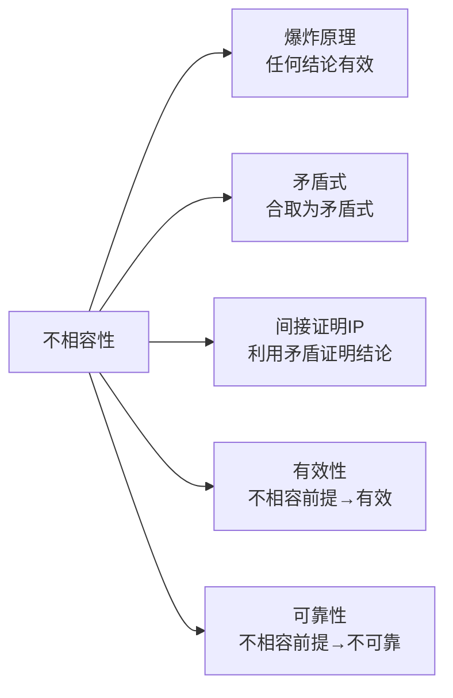

# 不相容性

> [!abstract] 概述
> **不相容性**（Inconsistency）是指一组命题==不可能同时为真==的性质。如果一个论证的前提集是不相容的，那么根据==爆炸原理==（Ex Contradictione Quodlibet），==任何结论==都可以从这组前提中有效地推出。不相容性是逻辑学中的核心概念之一，它与有效性、矛盾式和间接证明都有着深刻的联系。

## 定义

> [!def] 不相容性
> 一组命题是**不相容的**（inconsistent），当且仅当==不存在==任何真值指派使得这组命题==同时为真==。等价地说，一组命题是不相容的，当且仅当它们的合取是一个==矛盾式==。

> [!def] 爆炸原理（Ex Contradictione Quodlibet）
> 如果一组前提是不相容的，那么==任何结论==都可以从这组前提中有效地推出。即：从矛盾中可以推出任何命题。

## 核心性质

| 性质 | 描述 |
|:-----|:-----|
| **与有效性的关系** | 不相容前提 ⟹ 任何结论都有效推出 |
| **与矛盾式的关系** | 命题集不相容 ⟺ 命题集的合取是矛盾式 |
| **判定方法** | 1. 真值表法（合取列为全F）2. 形式证明法（推导出矛盾）3. STTT法 |
| **与IP的关系** | IP正是利用不相容性来证明结论（假设结论否定→推导矛盾→得到结论） |

## 关系网络

## 跨章节应用

### 第8章：命题逻辑Ⅰ
第8章引入了矛盾式的概念（8.9节），矛盾式是在所有真值指派下都为假的陈述形式。不相容命题集的合取就是矛盾式。

### 第9章：命题逻辑Ⅱ（核心章节）
- **9.10节**：系统讨论不相容性，包括爆炸原理的标准证明模式
- 不相容性的三种判定方法：真值表、形式证明、STTT
- "不可抗拒的力量遇到不可移动的物体"悖论的逻辑解答

## 参见

- [[有效性]] — 不相容前提使任何论证有效
- [[重言式与矛盾式]] — 不相容集的合取是矛盾式
- [[间接证明]] — IP利用不相容性证明结论
- [[自然演绎]] — 用形式证明判定不相容性
- [[可靠性]] — 不相容前提的论证不可能是可靠的
