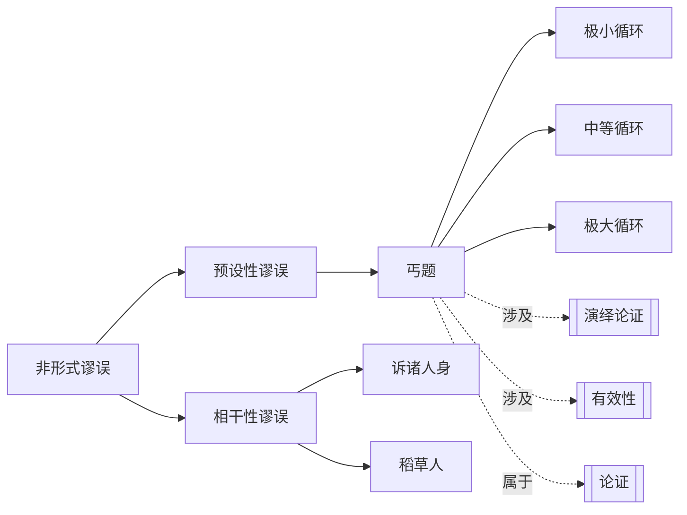

# 丐题

> [!abstract] 概述
> 在论证中==假定所要证明的结论为真==，将其作为前提使用，使得论证看似成立实则空洞无物。

## 定义

> [!def] 丐题（Petitio Principii / Begging the Question）
> 一种非形式谬误（具体属于预设性谬误），其特征是：论证的==前提==暗中==假定了结论为真==，因此结论并没有从前提中获得独立的逻辑支持。论证者绕了一个圈子，但起点和终点是同一个地方——结论被"偷运"进了前提之中。

## 名称辨析

> [!warning] 常见误解
> "丐题"的英文名 "Begging the Question" 常被误解为"引起问题"或"提出问题"，例如 "This begs the question: why?" 这种日常用法实际上是==对原义的误用==。
>
> 其正确含义源于拉丁语 *Petitio Principii*，意为"==请求初始命题=="（即把需要证明的命题当作已知前提来使用）。在现代逻辑学中，更准确的翻译是"丐题"或"窃取论点"。

## 核心性质

| 性质 | 陈述 |
|------|------|
| 谬误类型 | 非形式谬误 / 预设性谬误 |
| 错误机制 | 前提暗中假定了结论为真，结论未获得独立支持 |
| 逻辑根源 | 违反了"前提必须为结论提供独立支持"的原则 |
| 与循环论证的关系 | 每个丐题都是==循环论证==，但循环可能很大且具迷惑性 |
| 有效性 | 技术上通常是==有效的==（如果前提为真则结论为真），但==无意义==（因为前提和结论本质相同） |

> [!tip] 有效性 vs 无意义
> 丐题在形式逻辑中往往是有效的论证——如果前提为真，结论确实为真。但问题在于：前提和结论说的是==同一件事==，所以这个论证没有提供任何新的信息或理由来支持结论。它就像一个人说"X 是对的，因为 X 是对的"——逻辑上没错，但毫无意义。

## 经典例子

### Whately 的自由言论论证

> [!example] Whately (1826)
> "我们应该允许自由言论，因为==言论自由是一项基本权利==。"
>
> 表面上看这是一个论证，但仔细分析：前提"言论自由是一项基本权利"和结论"我们应该允许自由言论"表达的是==同一个主张==。前提只是用不同的措辞重述了结论，并没有为"为什么应该允许自由言论"提供任何独立的理由。

### 休谟对归纳原理的批判

> [!example] Hume 对归纳的质疑
> 大卫·休谟指出，归纳推理（从过去的经验推导未来的规律）依赖于一个隐含的前提：==未来将与过去一样==。但这个前提本身是如何得到辩护的？
>
> 如果我们说"未来将与过去一样，因为==过去总是如此=="，那么我们就陷入了丐题：我们用过去的经验来证明"过去可以预测未来"这一原理，而这正是需要证明的东西。
>
> 休谟的这一批判揭示了归纳推理的深层困境，是哲学史上最具影响力的论证之一。

## 循环的大小与迷惑性

丐题中的循环论证可以表现为不同的规模：

| 循环规模 | 说明 | 迷惑性 |
|----------|------|--------|
| ==极小循环== | 前提与结论几乎完全相同，只是换了措辞 | 低——容易被识别 |
| ==中等循环== | 前提和结论使用了不同的概念，但概念之间存在隐含的等价关系 | 中——需要仔细分析才能发现 |
| ==极大循环== | 前提和结论之间隔了多个步骤，但最终追溯回去，整个论证链依赖于结论为真 | 高——极具迷惑性，可能需要深入分析才能揭示循环 |

> [!quote] 识别要点
> 检验一个论证是否构成丐题，核心方法是：==尝试在不使用结论所表达内容的情况下，独立地证明前提是否为真==。如果前提的真值依赖于结论已经为真，那么这个论证就是丐题。

## 与其他概念的关系

## 补充

> [!info] 学术背景
> - Richard Whately 在 *Elements of Logic* (1826) 中对丐题进行了经典分析，其自由言论论证的例子至今仍被广泛引用。
> - 大卫·休谟在《人性论》(1739-1740) 中对归纳原理的批判，揭示了一种深刻的、哲学层面的丐题问题，至今仍是认识论讨论的核心议题。
> - 在现代逻辑学中，丐题与"循环定义"（circular definition）有密切关联——循环定义是在定义中使用了被定义的概念本身，丐题则是在论证中使用了需要证明的结论本身。

## 应用

- **哲学论证**：许多哲学论证被批评为丐题，例如某些关于上帝存在的本体论论证。
- **科学方法论**：确保理论的前提不预设结论是科学论证的基本要求。
- **日常推理**：在日常生活中，"因为……所以……"的论证如果前提只是结论的重述，就构成了丐题。例如："这部电影很好看，因为它非常精彩。"
- **批判性思维**：识别丐题有助于我们区分"真正提供了理由的论证"和"只是重复了结论的伪论证"。

## 参见

- [[论证]] —— 理解论证结构是识别丐题的基础
- [[谬误]] —— 丐题是谬误的一种具体类型
- [[演绎论证]] —— 丐题在形式上往往是有效的演绎论证，但缺乏实质内容
- [[有效性]] —— 理解有效性与合理性（soundness）的区别，有助于理解为何丐题"有效但无意义"
- [[非形式谬误的四大类]] —— 丐题属于预设性谬误这一大类
