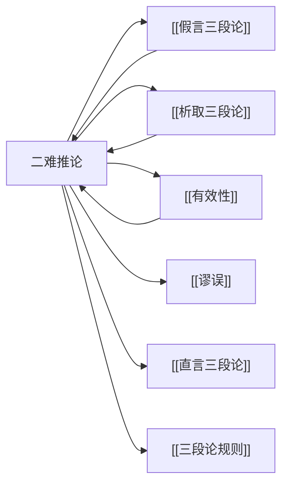

# 二难推论

> [!abstract] 概述
> 二难推论是迫使对手在两个（或多个）不利选项中做出选择的论证形式，通过==条件命题==与==析取命题==的组合推导出令人难以接受的结论。

## 定义

> [!def] 二难推论（Dilemma）
> 二难推论是一种[[演绎论证]]形式，由两个（或多个）条件命题（假言前提）和一个析取命题（选言前提）构成，推导出一个结论。其核心策略是：无论选择哪条路径，都会导向不利后果，从而将对手逼入"两难"境地。

## 四种类型

二难推论根据条件命题的前件/后件是否相同，以及构成方式（构成式/破坏式），可分为四种有效形式：

| 类型 | 结构形式 | 特征 |
|:-----|:---------|:-----|
| **简单构成式** | $p \to r, \quad q \to r, \quad p \lor q, \quad \therefore r$ | 后件相同，通过肯定前件得出共同后件 |
| **简单破坏式** | $p \to q, \quad p \to r, \quad \neg q \lor \neg r, \quad \therefore \neg p$ | 前件相同，通过否定后件得出共同前件的否定 |
| **复杂构成式** | $p \to r, \quad q \to s, \quad p \lor q, \quad \therefore r \lor s$ | 前件和后件均不同，通过肯定前件得出析取后件 |
| **复杂破坏式** | $p \to q, \quad r \to s, \quad \neg q \lor \neg s, \quad \therefore \neg p \lor \neg r$ | 前件和后件均不同，通过否定后件得出析取前件的否定 |

> [!tip] 记忆方法
> - **构成式**：从"前件"出发，肯定前件（$p \lor q$）来肯定后件
> - **破坏式**：从"后件"出发，否定后件（$\neg q \lor \neg r$）来否定前件
> - **简单**：结论是单一命题（因为前件或后件中有相同部分）
> - **复杂**：结论是析取命题（因为前件和后件都不同）

> [!example] 简单构成式示例
> ```
> 如果你承认（p），你就会自相矛盾（r）
> 如果你不承认（q），你也会自相矛盾（r）
> 你要么承认，要么不承认（p ∨ q）
> ∴ 你总会自相矛盾（r）
> ```

> [!example] 复杂构成式示例
> ```
> 如果我们增加投资（p），就会面临通货膨胀风险（r）
> 如果我们减少投资（q），就会面临经济衰退风险（s）
> 我们要么增加投资，要么减少投资（p ∨ q）
> ∴ 我们要么面临通货膨胀风险，要么面临经济衰退风险（r ∨ s）
> ```

## 三种驳斥方法

面对二难推论，有三种标准的驳斥策略：

### 1. 绕过死角法（Going Between the Horns）

==拒斥析取前提==，指出析取命题并未穷尽所有可能性，存在第三种（或更多）选择。

> [!example] 绕过死角法示例
> ```
> 原二难：你要么支持战争（p），要么支持投降（q）
> 驳斥：还可以选择和平谈判——析取前提不成立
> ```

### 2. 直击一角法（Grasping One Horn）

==拒斥某个条件前提==，指出某个条件命题中前件到后件的推导不成立，即后果并非必然。

> [!example] 直击一角法示例
> ```
> 原二难：如果削减开支（p），就会损害教育质量（r）
> 驳斥：削减行政开支并不必然损害教育质量——条件前提不成立
> ```

### 3. 构造反二难法（Constructing a Counter-Dilemma）

构造一个结论相反的二难推论，引入不同的视角或后果，展示同一选择可以导向不同结论。

> [!example] 构造反二难法示例
> ```
> 原二难：
>   如果结婚（p），就有烦恼（r）
>   如果不结婚（q），就孤独（s）
>   p ∨ q，∴ r ∨ s（要么烦恼，要么孤独）
>
> 反二难：
>   如果结婚（p），就有伴侣（r'）
>   如果不结婚（q），就自由（s'）
>   p ∨ q，∴ r' ∨ s'（要么有伴侣，要么自由）
> ```

> [!warning] 构造反二难 ≠ 驳倒原论证
> 构造反二难只是展示了同一情境下的另一面，==并不等于驳倒了原论证==。原二难推论和反二难推论可能同时有效——它们只是从不同角度揭示了不同后果。要真正驳倒原论证，仍需使用绕过死角法或直击一角法。

## 核心性质

| 性质 | 陈述 |
|:-----|:-----|
| 命题基础 | 由[[假言三段论]]和[[析取三段论]]的推理规则组合而成 |
| 推理类型 | 属于[[演绎论证]]，有效形式保证前提真则结论必真 |
| 策略本质 | 通过穷尽选项来限定论证空间，是一种"封闭式"论证策略 |
| 驳斥可能性 | 每个二难推论都可以被驳斥（三种方法），没有不可驳斥的二难 |

## 与其他概念的关系



- **[[假言三段论]]**：二难推论中的条件命题依赖假言推理规则（肯定前件式/否定后件式）
- **[[析取三段论]]**：二难推论中的析取前提依赖析取推理
- **[[有效性]]**：四种标准形式都是有效的论证形式
- **[[谬误]]**：不正确的二难推论可能构成谬误（如虚假二难）
- **[[直言三段论]]**：二难推论是直言三段论在命题逻辑层面的扩展

## 补充

> [!info] Protagoras-Euathlus 悖论
> 古希腊最著名的二难推论悖论涉及智者 ==Protagoras== 与其学生 ==Euathlus== 之间的法律纠纷：
>
> Protagoras 教授 Euathlus 法律，约定：Euathlus 赢得第一场官司后支付学费。Euathlus 毕业后迟迟不接案子，Protagoras 遂起诉他。
>
> - **Protagoras 的二难**：
>   - 如果 Euathlus 输了这场官司（p），按判决须付款（r）
>   - 如果 Euathlus 赢了这场官司（q），按合同约定须付款（r）
>   - $p \lor q$，$\therefore r$（简单构成式——无论输赢都须付款）
>
> - **Euathlus 的反二难**：
>   - 如果 Euathlus 输了这场官司（p），按合同约定不需付款（$\neg r$）
>   - 如果 Euathlus 赢了这场官司（q），按判决不需付款（$\neg r$）
>   - $p \lor q$，$\therefore \neg r$（简单构成式——无论输赢都不需付款）
>
> 这个悖论展示了二难推论中==法律标准与合同标准==之间的冲突，两种论证形式上都是有效的，但它们依赖于不同的判定标准。参见 Rescher (2001) *Paradoxes*。

> [!info] 二难推论的历史渊源
> 二难推论在古希腊修辞学和哲学中已有广泛应用。==芝诺悖论==的某些论证形式可以视为二难推论的变体。在中世纪经院逻辑中，二难推论被系统化为命题逻辑的重要推理形式。

## 应用

1. **日常论证**：在辩论和讨论中，二难推论常被用来迫使对方承认某种不利结论
2. **伦理决策**：道德困境（如电车问题）本质上都是二难推论的应用
3. **法律论证**：控辩双方经常构造对立的二难推论来支持各自的立场
4. **哲学论证**：许多哲学悖论（如自由意志与决定论）以二难推论的形式呈现

## 参见

- [[假言三段论]] — 二难推论中条件命题的推理基础
- [[析取三段论]] — 二难推论中析取前提的推理基础
- [[谬误]] — 虚假二难是一种常见的非形式谬误
- [[有效性]] — 四种标准二难推论形式都是有效的
- [[直言三段论]] — 二难推论在词项逻辑层面的对应形式
- [[三段论规则]] — 检验论证有效性的基本规则
