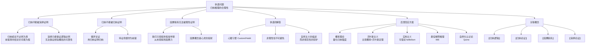

# 休谟问题

> [!abstract] 概述
> ==休谟问题==（The Problem of Induction）是苏格兰哲学家大卫·休谟于1748年在《人类理解研究》中提出的对归纳推理合理性的根本性哲学质疑：==我们凭什么认为过去观察到的规律在未来也会成立？== 休谟指出，归纳推理既不能被演绎地证明（因为归纳结论本就不是必然的），也不能被归纳地证明（因为那将陷入循环论证）。这一问题深刻揭示了归纳推理与演绎推理的根本差异，至今仍是科学哲学和认识论的核心议题。

## 定义

> [!def] 休谟问题（The Problem of Induction）
> ==休谟问题==是对==归纳推理的合理性==提出的根本性哲学挑战。休谟追问：我们有什么理由相信归纳推理是可靠的？即，我们有什么理由认为从已观察到的案例中归纳出的规律适用于未观察到的案例？

### 归纳的合理性问题

休谟将人类推理分为两类：

| 推理类型 | 休谟的术语 | 特征 | 示例 |
|:---------|:-----------|:-----|:-----|
| ==观念之间的关系==（Relations of Ideas） | 演绎推理 | 必然为真，否定会导致矛盾 | $2+2=4$；所有单身汉都是未婚的 |
| ==实际的事情==（Matters of Fact） | 归纳推理 | 可以为真也可以为假，其反面并不蕴含矛盾 | 太阳明天会升起；面包有营养 |

> [!tip] 休谟的核心洞察
> 关于"实际的事情"的所有推理——包括因果推理、科学预测、日常经验判断——最终都依赖于==归纳==。但归纳推理本身的合理性无法通过演绎来证明（因为归纳结论不必然为真），也无法通过归纳来证明（因为那将==循环论证==）。因此，归纳推理的合理性基础是一个深刻的哲学难题。

### 归纳怀疑论

> [!def] 归纳怀疑论（Inductive Skepticism）
> ==归纳怀疑论==是休谟问题所引出的一种哲学立场：在严格的理性分析下，我们==没有理性依据==相信归纳推理是可靠的。我们对归纳的信赖实际上源于==心理习惯==（custom or habit），而非理性推导的结果。

## 核心性质

| 性质 | 说明 |
|:-----|:-----|
| ==归纳不能被演绎证明== | 归纳论证的结论不必然为真（前提真时结论仍可能为假），因此演绎逻辑无法保证归纳推理的可靠性 |
| ==归纳不能被归纳证明== | 用归纳来证明归纳的可靠性是==循环论证==（circular reasoning）——这相当于用"归纳是可靠的"这一待证命题来证明"归纳是可靠的" |
| ==因果联系本身无法被理性证明== | 休谟认为，我们从未真正"观察"到因果联系——我们只观察到事件的==恒常伴随==（constant conjunction），因果概念是心灵将习惯性预期投射到世界的结果 |
| ==归纳依赖心理习惯而非理性== | 休谟的最终结论是：我们对归纳的信赖源于==心理习惯==——反复观察到事件 A 伴随事件 B 后，心灵便形成了"A 导致 B"的预期，但这并非理性推导的结果 |
| ==揭示了演绎与归纳的根本鸿沟== | 休谟问题表明，演绎推理和归纳推理之间存在不可弥合的认识论鸿沟——演绎有自明的理性基础，而归纳没有 |

## 关系网络

## 章节扩展

### 第11章：归纳与演绎再探中的哲学基础

第11章在回顾归纳与演绎的根本区别时，休谟问题构成了其==哲学背景==：

- **演绎的确定性**：有效演绎论证中，前提真则结论==必定==为真——结论只是揭示前提已经隐含的东西
- **归纳的或然性**：归纳论证中，前提真只使结论==可能==为真——结论==超越==了前提所含信息
- **休谟问题的当代意义**：休谟问题解释了==为什么==归纳论证不能达到演绎的确定性——这不是归纳论证的"缺陷"，而是归纳推理的==本质特征==

> [!info] 休谟问题在教材中的角色
> Copi 在第11章中并未直接以"休谟问题"为标题展开讨论，但休谟的思想渗透在整个第三部分（归纳逻辑）的背景中。Copi 引用休谟的术语"实际的事情"（matters of fact）来刻画归纳推理的领域，并指出演绎推理处理的是"观念之间的关系"（relations of ideas）。第11章对归纳与演绎根本区别的系统阐述，正是以休谟的经典区分为哲学基础的。

> [!quote] 教材中的休谟引用
> "用大卫·休谟的术语来说，演绎推理处理的是观念之间的关系（relations of ideas），而归纳推理处理的是'实际的事情'（matters of fact）。关于实际的事情的知识，我们必须依靠归纳来确立。"

## 补充

> [!info] 休谟的原初论证
> **来源：** Hume, D. (1748). *An Enquiry Concerning Human Understanding*, Section IV.
>
> 休谟在《人类理解研究》第四节"关于人类理解力的怀疑论的疑问"中提出了如下论证：
>
> 1. 所有关于"实际的事情"的推理都建立在==因果联系==的基础上
> 2. 因果联系的知识只能通过==经验==获得（不能通过先验推理获得）
> 3. 经验本身只能告诉我们过去发生了什么（事件 A 伴随事件 B），不能告诉我们==未来==也会如此
> 4. 从"过去 A 伴随 B"推出"未来 A 也会伴随 B"，这一步是一个==归纳推理==
> 5. 这个归纳推理的合理性需要证明——但演绎证明不适用（结论不必然），归纳证明是循环的
> 6. 因此，==我们没有理性依据==相信因果推理或任何归纳推理是可靠的
>
> 休谟的最终结论是：我们对归纳的信赖源于"==习惯=="（custom）——"习惯是伟大的引导者"。反复观察到事件 A 伴随事件 B 后，心灵便形成了条件反射式的预期。这不是理性的产物，而是==自然的产物==。

> [!info] 对归纳逻辑发展的推动
> **来源：** Stanford Encyclopedia of Philosophy. (2024). *The Problem of Induction*.
>
> 休谟问题虽然是对归纳推理的挑战，但它在客观上==极大地推动了归纳逻辑的发展==。主要回应方案包括：
>
> 1. **概率理论路径**（Keynes, Carnap）：将归纳强度量化为概率值，建立归纳逻辑的公理系统。Carnap 试图证明归纳概率满足特定的逻辑约束，从而为归纳推理提供"逻辑基础"。
>
> 2. **贝叶斯主义路径**（de Finetti, Savage, Jeffrey）：将概率解释为==主观确信度==（degree of belief），通过贝叶斯定理 $P(H \mid E) = \frac{P(E \mid H) \cdot P(H)}{P(E)}$ 更新信念。贝叶斯主义的核心论证是：虽然归纳不能提供确定性，但==贝叶斯更新是理性信念修正的唯一一致性方法==（Dutch Book 论证）。
>
> 3. **实用主义路径**（Peirce）：通过"==可错论=="（fallibilism）回应休谟——归纳虽然不能提供确定性，但它是我们在不确定世界中理性行动的==最佳工具==。Peirce 认为休谟问题的错误在于要求归纳提供演绎级别的确定性，这是不合理的期望。
>
> 4. **最佳解释推理路径**（Harman, Lipton）：归纳推理可以理解为"==推断最佳解释=="（Inference to the Best Explanation）——我们选择那个能最好地解释已知证据的假说。虽然这不提供演绎确定性，但它是科学推理的实际模式。
>
> 5. **自然化认识论路径**（Quine）：Quine 认为休谟问题的提法本身就是错误的——归纳不需要"哲学辩护"，它只需要==心理学和科学描述==。我们使用归纳是因为进化选择了这种认知策略，它在生存竞争中是有效的。

> [!warning] 休谟问题的不可消解性
> 需要注意的是，上述回应方案都==没有完全"解决"休谟问题==。它们要么将问题转化为其他形式（如贝叶斯主义将"归纳是否可靠"转化为"贝叶斯更新是否理性"），要么降低了对归纳的期望（如实用主义接受归纳的可错性），要么改变了问题的框架（如自然化认识论将规范性问题转化为描述性问题）。休谟问题之所以经久不衰，正是因为它触及了人类理性最深层的一个张力：我们==必须依赖归纳来认识世界==，但我们==无法为这种依赖提供终极的理性辩护==。

## 应用

休谟问题在以下领域有重要的应用和影响：

- **科学哲学**：科学理论的确证问题——科学归纳法能否提供可靠的真理？波普尔的证伪主义、拉卡托斯的科学研究纲领等都是对休谟问题的回应
- **人工智能**：机器学习中的归纳偏置（inductive bias）问题——学习算法如何选择泛化策略？这与休谟问题有深刻的结构相似性
- **统计学**：统计推断的哲学基础——从样本推断总体是否合理？频率学派和贝叶斯学派的不同立场反映了不同的归纳哲学
- **法律推理**："排除合理怀疑"标准——法律上的归纳推理需要达到什么程度的确定性？这涉及归纳强度的阈值问题
- **决策论**：在不确定性下如何做出理性决策？期望效用理论假设我们可以为事件赋予概率，但休谟问题质疑这种概率赋值的理性基础

### 第12章：因果律与自然齐一性的哲学挑战

第12章揭示了休谟问题对因果推理的具体影响：

- 因果律与==自然齐一性==原理面临休谟问题的根本挑战——我们无法证明"未来将类似过去"
- 密尔五法虽然强大，但其运作依赖齐一性假设，而该假设本身无法被理性证明
- 塞麦尔维斯案例说明：即使密尔方法正确，如果错误识别了"相关事态"，也会得出错误结论

参见 [[自然齐一性]]、[[密尔五法]]。

### 第13章：休谟问题与科学说明

第13章从科学方法论视角回应了休谟问题：

- 休谟对因果推理的质疑意味着科学说明永远不具有绝对的确定性
- ==可证伪性==提供了对休谟问题的部分回应：虽然不能证实，但可以证伪
- 科学的非教条态度正是对休谟问题的实践回应

参见 [[科学说明]]、[[可证伪性]]。

### 第14章：概率理论对休谟问题的回应

第14章展示了概率理论如何回应归纳推理的合理性问题：

- ==概率理论==为归纳推理提供了定量评价框架，部分回应了休谟问题
- ==赌徒谬误==揭示了人们对概率的直觉理解常常出错，支持了休谟对归纳推理的质疑
- 贝叶斯主义通过概率更新机制为归纳推理的合理性提供了新的辩护

参见 [[概率]]、[[赌徒谬误]]。

## 参见

- [[归纳逻辑]] — 休谟问题所质疑的推理类型
- [[归纳论证]] — 归纳论证的基本概念和评价标准
- [[因果联系]] — 休谟对因果推理的哲学分析
- [[演绎论证]] — 与归纳相对的推理类型，休谟问题不适用于演绎
- [[演绎论证-vs-归纳论证]] — 两种推理类型的系统对比
- [[11.1 归纳与演绎再探]] — 归纳与演绎的系统性回顾，休谟思想的当代呈现
