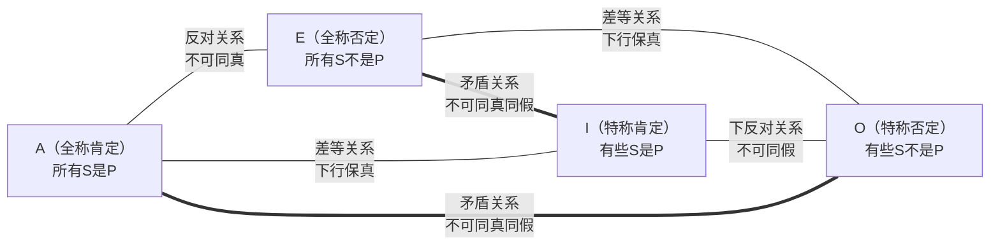
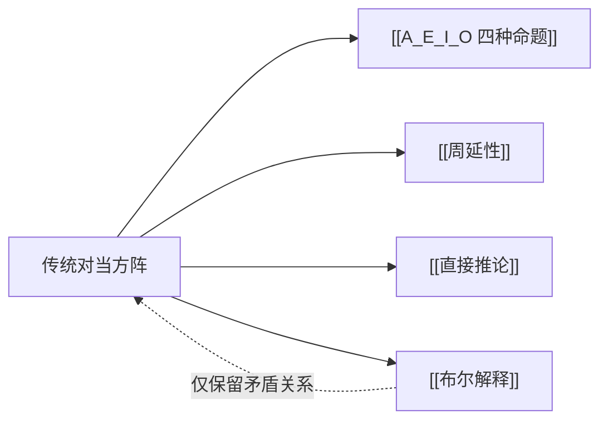

# 传统对当方阵

> [!abstract] 概述
> 传统对当方阵以正方形图示展示 A/E/I/O 四种直言命题之间的四种逻辑关系，是亚里士多德逻辑学中判断命题之间真假制约关系的核心工具。

## 定义

> [!def] 传统对当方阵（Traditional Square of Opposition）
> 传统对当方阵是一种以正方形图示展示 [[A_E_I_O 四种命题]] 之间逻辑关系的工具。方阵的四条边和两条对角线分别表示四种不同的真假制约关系，使得已知某一命题的真假即可推断其他三种命题的真假。

## 四种对当关系

### 1. 矛盾关系（Contradictory）

| 组合 | 规则 |
|:-----|:-----|
| A ↔ O | ==不可同真，不可同假== |
| E ↔ I | ==不可同真，不可同假== |

矛盾关系是方阵中==最强==的逻辑关系。若一个命题为真，其矛盾命题必为假；若一个命题为假，其矛盾命题必为真。

> [!example] 矛盾关系示例
> - A：所有学生都及格了（真）→ O：有些学生没及格（假）
> - E：所有学生都没及格（假）→ I：有些学生及格了（真）

### 2. 反对关系（Contrary）

| 组合 | 规则 |
|:-----|:-----|
| A ↔ E | ==不可同真，但可同假== |

若 A 为真，则 E 必为假；若 E 为真，则 A 必为假。但当 A 为假时，E 可真可假（反之亦然）。

> [!example] 反对关系示例
> - A：所有鸟都会飞（假）→ E：所有鸟都不会飞（假）——两者可同假
> - A：所有猫都是动物（真）→ E：所有猫都不是动物（假）——不可同真

### 3. 下反对关系（Subcontrary）

| 组合 | 规则 |
|:-----|:-----|
| I ↔ O | ==不可同假，但可同真== |

若 I 为假，则 O 必为真；若 O 为假，则 I 必为真。但当 I 为真时，O 可真可假（反之亦然）。

> [!example] 下反对关系示例
> - I：有些猫是动物（真）→ O：有些猫不是动物（真）——两者可同真
> - I：有些正方形是圆（假）→ O：有些正方形不是圆（真）——不可同假

### 4. 差等关系（Subalternation）

| 组合 | 规则 |
|:-----|:-----|
| A → I | 上位真 → 下位必真；下位假 → 上位必假 |
| E → O | 上位真 → 下位必真；下位假 → 上位必假 |

A 是 I 的"上位"（全称→特称），E 是 O 的"上位"。差等关系规定了全称命题与对应特称命题之间的真假传递方向。

> [!tip] 差等关系的记忆口诀
> - **下行保真**：上位真 → 下位必真（A真则I真，E真则O真）
> - **上行保假**：下位假 → 上位必假（I假则A假，O假则E假）
> - 反方向不成立：A假不能推出I假，I真不能推出A真

## 核心性质

| 性质 | 陈述 |
|:-----|:-----|
| 适用范围 | 仅适用于==相同主项和谓项==的 A/E/I/O 命题 |
| 前提假设 | 传统方阵假设主项 S 所指称的类==非空==（有存在含义） |
| 最强关系 | 矛盾关系——唯一在布尔解释下仍完全成立的关系 |
| 历史渊源 | 源自亚里士多德《前分析篇》，经中世纪逻辑学家系统化 |

## 方阵图示

> [!info] 图中实线与虚线
> - 实线（`---`）：反对、下反对、差等关系——在布尔解释下==不再普遍有效==
> - 虚线（`===`）：矛盾关系——在布尔解释下==仍然成立==

## 与其他概念的关系

- **[[A_E_I_O 四种命题]]**：方阵的操作对象，四种命题构成方阵的四个顶点
- **[[周延性]]**：理解对当关系的基础——命题中词项的周延情况影响推理有效性
- **[[直接推论]]**：对当关系是直接推论的重要方法之一
- **[[布尔解释]]**：现代逻辑的标准立场，在布尔解释下传统方阵==仅保留矛盾关系==

## 补充

> [!warning] 布尔解释下的方阵缩减
> 在 [[布尔解释]] 下，全称命题（A、E）没有存在含义。这意味着：
> - 反对关系失效：当 S 为空类时，A 和 E 可同时为真
> - 下反对关系失效：当 S 为空类时，I 和 O 可同时为假
> - 差等关系失效：A 真不再保证 I 真（因为 A 可在 S 为空时为真，而 I 此时为假）
>
> ==唯一完整保留的是对角线上的矛盾关系==。

> [!info] 历史背景
> 对当方阵的理论基础可追溯至亚里士多德的《前分析篇》（Prior Analytics），其中讨论了命题之间的对立关系。中世纪逻辑学家将其系统化为正方形图示，并命名了四种关系（contradictory、contrary、subcontrary、subalternation）。19世纪，乔治·布尔（George Boole）提出全称命题无存在含义的解释，导致传统方阵中除矛盾关系外的三种关系不再普遍有效。

## 应用

1. **命题真假推断**：已知一个命题的真假，利用方阵推断其他同素材命题的真假
2. **检验论证有效性**：识别论证中是否依赖了在布尔解释下不成立的对当关系
3. **逻辑教学**：作为理解直言命题逻辑关系的入门工具

## 参见

- [[A_E_I_O 四种命题]] — 方阵的四个顶点
- [[直接推论]] — 利用对当关系进行推理的方法
- [[布尔解释]] — 现代逻辑对全称命题的重新解释
- [[周延性]] — 命题中词项的周延情况
