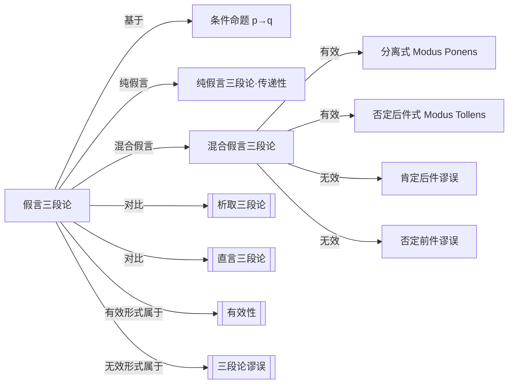

# 假言三段论

> [!abstract] 概述
> 假言三段论是基于条件命题（$p \to q$）的推理形式，涵盖纯假言三段论（条件传递）和混合假言三段论（分离式与否定后件式）等多种有效推理模式。

## 定义

> [!def] 假言三段论（Hypothetical Syllogism）
> 一种基于==条件命题==（conditional proposition, $p \to q$）的演绎推理。"假言"即"假设性的"，指前提中包含"如果……那么……"形式的条件命题。假言三段论分为==纯假言三段论==和==混合假言三段论==两大类。

## 核心性质

| 性质 | 陈述 |
| --- | --- |
| 基本元素 | 条件命题 $p \to q$，其中 $p$ 为前件（antecedent），$q$ 为后件（consequent） |
| 纯假言三段论 | 所有前提和结论都是条件命题，体现条件的==传递性== |
| 混合假言三段论 | 前提中既有条件命题又有直言命题，结论为直言命题 |
| 核心口诀 | ==肯前肯后有效，否后否前有效；肯后和否前都无效== |

## 纯假言三段论

### 定义

纯假言三段论（Pure Hypothetical Syllogism）中，所有前提和结论都是条件命题，其有效性依赖于条件关系的==传递性==。

### 形式

$$p \to q$$
$$q \to r$$
$$\therefore p \to r$$

> [!example] 纯假言三段论示例
> - 前提1：如果天下雨，地面就会湿。（$p \to q$）
> - 前提2：如果地面湿，比赛就会取消。（$q \to r$）
> - 结论：如果天下雨，比赛就会取消。（$\therefore p \to r$）

> [!tip] 传递性的直觉
> 纯假言三段论的本质是一条==推理链条==：$p$ 导致 $q$，$q$ 导致 $r$，因此 $p$ 导致 $r$。就像多米诺骨牌，推倒第一块就会导致最后一块倒下。

## 混合假言三段论

混合假言三段论（Mixed Hypothetical Syllogism）包含一个条件命题前提和一个直言命题前提，结论为直言命题。共有四种可能的形式，其中两种==有效==、两种==无效==。

### 有效形式

#### 分离式（Modus Ponens）

$$p \to q$$
$$p$$
$$\therefore q$$

> [!def] 分离式（Modus Ponens）
> ==肯定前件==从而肯定后件的推理形式。"Modus Ponens"为拉丁语，意为"肯定的方式"。这是命题逻辑中==最基本==的推理规则之一。

> [!example] 分离式示例
> - 前提1：如果气温低于零度，水就会结冰。（$p \to q$）
> - 前提2：气温低于零度。（$p$）
> - 结论：水会结冰。（$\therefore q$）——==有效==

#### 否定后件式（Modus Tollens）

$$p \to q$$
$$\neg q$$
$$\therefore \neg p$$

> [!def] 否定后件式（Modus Tollens）
> ==否定后件==从而否定前件的推理形式。"Modus Tollens"为拉丁语，意为"否定的方式"。其有效性基于条件命题的逻辑等价式：$p \to q \equiv \neg q \to \neg p$（逆否命题）。

> [!example] 否定后件式示例
> - 前提1：如果这是一只哺乳动物，它就是温血的。（$p \to q$）
> - 前提2：它不是温血的。（$\neg q$）
> - 结论：它不是哺乳动物。（$\therefore \neg p$）——==有效==

### 无效形式

#### 肯定后件谬误（Fallacy of Affirming the Consequent）

$$p \to q$$
$$q$$
$$\therefore p$$

> [!warning] 肯定后件谬误
> 条件命题 $p \to q$ 只告诉我们"若 $p$ 则 $q$"，但==不保证"只有 $p$ 才导致 $q$"==。$q$ 为真可能由其他原因导致，因此不能反推 $p$ 为真。

> [!example] 肯定后件谬误示例
> - 前提1：如果下雨，地面会湿。（$p \to q$）
> - 前提2：地面湿了。（$q$）
> - 结论：下雨了。（$\therefore p$）——==无效==，地面湿可能是因为洒水车经过。

#### 否定前件谬误（Fallacy of Denying the Antecedent）

$$p \to q$$
$$\neg p$$
$$\therefore \neg q$$

> [!warning] 否定前件谬误
> 条件命题 $p \to q$ 只在 $p$ 为真时保证 $q$ 为真，但==当 $p$ 为假时，$q$ 可真可假==。否定前件并不能否定后件。

> [!example] 否定前件谬误示例
> - 前提1：如果是鸟，它就会飞。（$p \to q$）
> - 前提2：企鹅不是鸟。（$\neg p$）——事实上企鹅是鸟，但假设这个前提
> - 结论：企鹅不会飞。（$\therefore \neg q$）——==无效==，即使前件为假，后件也可能因其他原因而为真。

### 四种形式汇总

| 形式 | 操作 | 有效性 | 记忆口诀 |
| --- | --- | --- | --- |
| 分离式（Modus Ponens） | 肯定前件 $\to$ 肯定后件 | ==有效== | 肯前肯后 |
| 否定后件式（Modus Tollens） | 否定后件 $\to$ 否定前件 | ==有效== | 否后否前 |
| 肯定后件谬误 | 肯定后件 $\to$ 肯定前件 | ==无效== | 肯后否前——无效 |
| 否定前件谬误 | 否定前件 $\to$ 否定后件 | ==无效== | 否前否后——无效 |

> [!tip] 记忆口诀
> ==肯前肯后有效，否后否前有效；肯后和否前都无效==。
> 直觉理解：条件命题 $p \to q$ 只建立了一个方向的保证（$p$ 通向 $q$），反向操作（从 $q$ 推回 $p$）或绕过前件都不能得到有效结论。

## 与其他概念的关系



## 与第8章命题逻辑的关系

假言三段论是==命题逻辑==的核心推理规则的自然语言表达：

- **分离式（Modus Ponens）**：在命题逻辑形式系统中记为 $\to E$（蕴含消去），是最基本的推理规则之一。几乎所有命题逻辑的自然演绎系统都将其作为原始规则。
- **否定后件式（Modus Tollens）**：可由分离式和否定引入规则推导得出，但在许多系统中也被列为基本规则。
- **纯假言三段论**：对应命题逻辑中的==假言三段论规则==（Hypothetical Syllogism, HS）：$\frac{p \to q \quad q \to r}{p \to r}$。

这些规则在第8章中将作为命题逻辑形式化推理系统的基石，与[[析取三段论]]中的析取消去规则共同构成命题逻辑的基本推理工具集。

## 历史注记

> [!quote] 斯多葛学派的贡献
> 假言三段论的理论渊源可追溯至古希腊==斯多葛学派==（Stoics）。与亚里士多德专注于词项逻辑（直言三段论）不同，斯多葛学派发展了命题逻辑的雏形，系统研究了条件命题的推理规则，包括 Modus Ponens 和 Modus Tollens。Chrysippus（约公元前279—前206年）被认为是这一传统中最杰出的逻辑学家。

## 应用

- **数学证明**：条件语句的证明广泛使用分离式（假设前件成立，推导后件）和否定后件式（反证法的一种形式）。
- **法律论证**："如果行为符合构成要件，则构成犯罪"（$p \to q$），结合"行为符合构成要件"（$p$），推出"构成犯罪"（$q$）——典型的分离式推理。
- **日常推理**：天气预报、医学诊断、工程决策等领域中大量使用条件推理，识别有效与无效形式对避免推理错误至关重要。

## 命题逻辑形式化（第8章扩展）

> [!info] 符号化与真值表验证
> 第8章将假言三段论用符号逻辑精确表述：
> - ==分离式(Modus Ponens)==：$p \supset q,\; p,\; \therefore q$
> - ==否定后件式(Modus Tollens)==：$p \supset q,\; \sim q,\; \therefore \sim p$
> - ==纯假言三段论==：$p \supset q,\; q \supset r,\; \therefore p \supset r$
>
> 每种形式都可以用[[真值表]]验证有效性——有效论证的真值表中不存在"前提全T结论F"的行。

> [!warning] 两种无效形式（第8章精确化）
> - ==肯定后件谬误==：$p \supset q,\; q,\; \therefore p$（后件真不保证前件真）
> - ==否定前件谬误==：$p \supset q,\; \sim p,\; \therefore \sim q$（前件假不保证后件假）

### 第9章：作为推论规则HS

第9章将假言三段论正式纳入自然演绎系统，作为第3条基本推论规则==假言三段论（H.S.）==。

- **规则形式**：$p \supset q,\; q \supset r,\; \therefore p \supset r$
- **缩写**：H.S.（Hypothetical Syllogism）
- **应用**：只能应用于==整行==陈述，不能应用于子表达式
- **与其他规则配合**：HS常与MP、MT、DS等规则配合使用，构成多步证明中的关键推理环节

> [!example] 形式证明示例
> ```
> 1. A ⊃ B        前提
> 2. B ⊃ C        前提
> 3. A ⊃ C        1, 2, H.S.
> ```
> 第3行通过HS从第1行和第2行推出 $A \supset C$（参见[[推论规则]]、[[自然演绎]]）。

参见：[[真值函项性]] [[实质蕴涵]] [[真值表]] [[重言式与矛盾式]]

## 参见

- [[析取三段论]]：基于析取命题的三段论
- [[直言三段论]]：基于直言命题的三段论
- [[有效性]]：演绎论证的核心评估标准
- [[三段论谬误]]：三段论中的形式谬误
