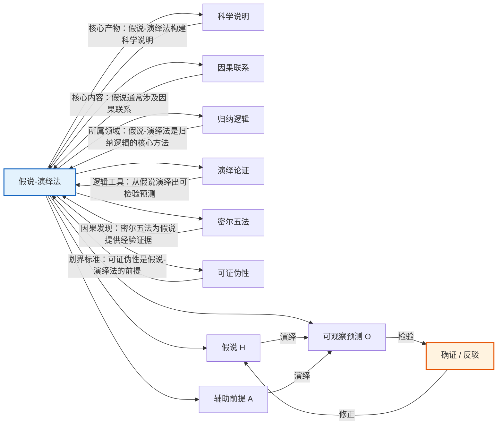

# 假说-演绎法

> [!abstract] 概述
> ==假说-演绎法==（hypothetico-deductive method）是科学探究的==核心方法论==，其基本思想是：从假说中==演绎==出可检验的预测，然后通过观察或实验来==确证==（confirm）或==证伪==（falsify）这些预测，从而评估假说的可信度。假说-演绎法将[[演绎论证]]和[[归纳论证]]有机结合——演绎步骤确保从假说到预测的逻辑严密性，归纳步骤则从检验结果反推假说的可靠性。这一方法不仅是现代科学研究的标准操作程序，也是区分科学与非科学的关键方法论标志。

## 定义

> [!def] 假说-演绎法（Hypothetico-Deductive Method）
> ==假说-演绎法==是一种科学探究方法，其核心结构为：
>
> $$H \wedge A \vdash O$$
>
> 其中：
> - $H$（Hypothesis）是被检验的==假说==
> - $A$（Auxiliary premises）是==辅助前提==（包括背景知识、初始条件、已确认的理论等）
> - $O$（Observation）是从 $H$ 和 $A$ 中==演绎==出的==可观察预测==
>
> 通过检验 $O$ 是否与实际观察一致，来评估假说 $H$ 的可信度：
> - 若 $O$ 被证实 → $H$ 得到==确证==（confirmation），但并非被证明为真
> - 若 $O$ 被否证 → $H$ 受到==反驳==（refutation），面临被修正或抛弃的压力

### 科学探究的七步骤

> [!def] 科学探究七步骤
> 第13章将假说-演绎法展开为科学探究的==七个步骤==，构成了从发现问题到应用理论的完整循环：
>
> | 步骤 | 名称 | 内容 | 逻辑类型 |
> |:-----|:-----|:-----|:---------|
> | 1 | ==确定问题== | 明确需要解释的现象或需要解决的问题 | 问题识别 |
> | 2 | ==构建初步假说== | 根据已有知识和直觉，提出对问题的初步解释 | ==归纳/溯因== |
> | 3 | ==收集额外事实== | 为假说收集更多的经验证据 | ==归纳==（观察与实验） |
> | 4 | ==形成说明性假说== | 在初步假说和额外事实的基础上，形成更精确、更系统的假说 | ==归纳/演绎== |
> | 5 | ==推导进一步结果== | 从说明性假说中演绎出新的、可检验的预测 | ==演绎== |
> | 6 | ==对推论进行检验== | 通过观察或实验检验演绎出的预测 | ==经验检验== |
> | 7 | ==应用该理论== | 将经过检验的理论应用于实际问题的解决 | ==实践应用== |
>
> **步骤2和3的紧密关联：** 步骤2（构建初步假说）和步骤3（收集额外事实）之间存在==紧密的互动循环==——初步假说指导我们收集哪些事实，新收集到的事实又反过来修正和完善假说。这一循环是科学探究中==创造性==最集中的环节，也是[[密尔五法]]等归纳方法发挥关键作用的环节。

> [!tip] 七步骤中的假说-演绎循环
> 七步骤的核心是步骤4→5→6构成的==假说-演绎循环==：
>
> $$\text{假说 } H \xrightarrow{\text{演绎}} \text{预测 } O \xrightarrow{\text{检验}} \text{结果} \xrightarrow{\text{评估}} \text{修正 } H$$
>
> 这一循环可以反复进行——每次循环都可能修正假说、产生新的预测、接受新的检验，使科学理论逐步逼近真理。这一迭代过程体现了科学的==自我修正==特征。

### 假说-演绎法的逻辑结构

> [!def] 确证与反驳的逻辑
> 假说-演绎法的逻辑结构包含两个方向：
>
> **确证方向（归纳的）：**
> $$H \wedge A \vdash O$$
> $$O \text{ 为真}$$
> $$\therefore H \text{ 更可信（但非必然为真）}$$
>
> 这一步是==归纳的==——即使预测 $O$ 被证实，也不能演绎地推出 $H$ 为真，因为可能有其他假说 $H'$ 也能推出 $O$（==理论欠确定==问题）。
>
> **反驳方向（演绎的）：**
> $$H \wedge A \vdash O$$
> $$O \text{ 为假}$$
> $$\therefore H \wedge A \text{ 中至少有一个为假}$$
>
> 这一步是==演绎有效的==（否定后件推理，modus tollens），但反驳的矛头不一定指向 $H$——也可能是辅助前提 $A$ 出了问题（==迪昂-蒯因问题==）。

> [!warning] 假说-演绎法的逻辑限度
> 1. **确证的非穷尽性**：预测被证实不能证明假说为真，因为可能有多个假说都能推出同一预测
> 2. **反驳的不确定性**：预测被否证不一定意味着假说为假，可能是辅助前提出了问题
> 3. **观察的理论负载**："可观察预测"的判断本身依赖理论背景，纯粹的"中性观察"是不存在的
> 4. **归纳跳跃**：从检验结果到假说可信度的评估，本质上是一个归纳推理，不能达到演绎确定性

## 核心性质

| 性质 | 说明 |
|:-----|:-----|
| ==演绎与归纳的结合== | 假说-演绎法将演绎推理（从假说到预测）和归纳推理（从检验结果评估假说）有机结合，是科学方法论的核心特征 |
| ==预测驱动== | 假说的价值取决于其==预测力==——一个好的假说不仅能说明已知事实，还能预测尚未观察到的新事实 |
| ==可证伪性== | 科学假说必须至少在原则上能被经验证据反驳，这是区分科学与非科学的关键标准（[[可证伪性]]） |
| ==迭代性== | 假说-演绎法是一个==循环迭代==的过程——假说被检验、被修正、再检验，逐步逼近对现象的准确说明 |
| ==创造性== | 步骤2（构建初步假说）和步骤3（收集额外事实）的互动循环是科学探究中创造性最集中的环节 |
| ==自我修正== | 通过反复的假说-演绎循环，科学理论能够自我修正错误、逐步完善，体现了科学的非教条态度 |

## 关系网络

- **[[科学说明]]**：假说-演绎法是构建[[科学说明]]的==核心方法论==——通过假说-演绎循环，科学理论得以建立、检验和完善
- **[[因果联系]]**：科学假说通常涉及==因果联系==的断言——假说-演绎法是检验因果假说的标准方法
- **[[归纳逻辑]]**：假说-演绎法是[[归纳逻辑]]在第13章的核心内容——从检验结果评估假说的可信度，本质上是归纳推理
- **[[演绎论证]]**：假说-演绎法中的"演绎"步骤——从假说和辅助前提演绎出可检验预测——是[[演绎论证]]在科学方法论中的直接应用
- **[[密尔五法]]**：[[密尔五法]]在假说-演绎法中扮演==辅助角色==——在步骤2和3的互动循环中，密尔五法帮助科学家系统地收集因果证据，为假说的构建和修正提供经验基础
- **[[可证伪性]]**：[[可证伪性]]是假说-演绎法的==方法论前提==——只有可证伪的假说才能进入假说-演绎循环，不可证伪的命题不属于科学探究的范围

## 第13章：假说-演绎法的应用

### 经典实例

#### 埃拉托色尼测量地球周长（公元前3世纪）

==埃拉托色尼==（Eratosthenes）通过巧妙的假说-演绎法测量了地球的周长：

- **确定问题（步骤1）：** 地球有多大？
- **构建初步假说（步骤2）：** 太阳光是平行光；地球是球体
- **收集额外事实（步骤3）：** 夏至日正午，赛伊尼（Syene）的阳光直射井底（太阳在天顶），而亚历山大城的阳光与垂直方向成7.2度角；两城距离约5000斯塔迪亚
- **形成说明性假说（步骤4）：** 地球是球体，太阳光是平行光，因此两城阳光入射角的差异等于两地在地球表面所对的圆心角
- **推导进一步结果（步骤5）：** 圆心角7.2度对应弧长5000斯塔迪亚 → 地球周长 = $5000 \times \frac{360}{7.2} = 250{,}000$ 斯塔迪亚
- **检验（步骤6）：** 后续测量基本一致（现代换算约39,375公里，与实际值40,008公里极为接近）

**假说-演绎分析：**
$$H: \text{地球是球体，太阳光是平行光}$$
$$A: \text{赛伊尼与亚历山大距离5000斯塔迪亚，入射角差7.2°}$$
$$\therefore O: \text{地球周长} = 5000 \times \frac{360}{7.2} = 250{,}000 \text{ 斯塔迪亚}$$

#### 大爆炸理论与COBE卫星（20世纪）

==大爆炸理论==（Big Bang Theory）的假说-演绎检验是现代宇宙学的里程碑：

- **假说：** 宇宙起源于约138亿年前的一次"大爆炸"，爆炸后宇宙持续膨胀和冷却
- **预测：** 如果大爆炸理论正确，宇宙中应存在温度约3K的==宇宙微波背景辐射==（Cosmic Microwave Background, CMB）
- **检验：** 1964年彭齐亚斯和威尔逊意外发现了3.5K的微波背景噪声；1992年COBE卫星精确测量了CMB的温度为2.725K，并发现了微小的温度涨落
- **确证：** CMB的存在和性质与大爆炸理论的预测高度一致，成为该理论最有力的证据之一

**假说-演绎分析：**
$$H: \text{大爆炸理论}$$
$$A: \text{辐射在膨胀宇宙中冷却的物理定律}$$
$$\therefore O: \text{存在温度约3K的各向同性微波背景辐射}$$
$$O \text{ 被COBE卫星证实} \Rightarrow H \text{ 得到强确证}$$

#### 广义相对论与日全食观测（1919）

==爱因斯坦==（Einstein）的广义相对论提供了一个经典的假说-演绎案例：

- **假说：** 引力是时空弯曲的表现；光线在引力场中会弯曲
- **预测：** 星光经过太阳附近时会发生偏折，偏折角度为 $1.75''$（牛顿力学的预测值为 $0.87''$）
- **检验：** 1919年5月29日日全食期间，爱丁顿率领的考察队在非洲普林西比岛观测到恒星位置的偏移与爱因斯坦的预测一致
- **确证：** 观测结果与广义相对论的预测吻合，使该理论获得广泛接受

**假说-演绎分析：**
$$H: \text{广义相对论（光线在引力场中弯曲，偏折角1.75''）}$$
$$A: \text{日全食期间的观测条件}$$
$$\therefore O: \text{恒星视位置偏移1.75''}$$
$$O \text{ 被爱丁顿观测证实} \Rightarrow H \text{ 得到强确证}$$

#### 弦理论与LHC实验（21世纪）

==弦理论==（String Theory）展示了假说-演绎法中假说尚待充分检验的情形：

- **假说：** 基本粒子不是点状的，而是微小的振动弦；弦的不同振动模式对应不同的粒子
- **预测：** 弦理论预测了==超对称粒子==（supersymmetric particles）的存在
- **检验：** 欧洲大型强子对撞机（LHC）被部分设计为寻找超对称粒子的实验装置
- **当前状态：** 截至2026年，LHC尚未发现超对称粒子的证据。这一结果对弦理论构成了==弱反驳==——但弦理论的支持者指出，超对称粒子可能存在于更高的能量范围

**假说-演绎分析：**
$$H: \text{弦理论（预测超对称粒子）}$$
$$A: \text{LHC的能量范围足以产生超对称粒子}$$
$$\therefore O: \text{LHC应观测到超对称粒子}$$
$$O \text{ 未被观测到} \Rightarrow H \wedge A \text{ 受到质疑}$$

> [!warning] 反驳的不确定性
> 这一案例展示了假说-演绎法中反驳的==不确定性==——预测未被证实不一定意味着假说为假。可能是辅助前提 $A$ 出了问题（LHC的能量范围不够高），而非假说 $H$ 本身为假。这就是著名的==迪昂-蒯因问题==（Duhem-Quine Problem）。

#### 进化论与洛索斯蜥蜴实验（1990s）

==洛索斯蜥蜴实验==（Losos Lizard Experiment）为进化论提供了精美的假说-演绎检验：

- **假说：** 自然选择可以快速驱动适应性进化——蜥蜴被引入没有竞争者的岛屿后，会在较短时间内进化出适应新环境的特征
- **预测：** 如果自然选择驱动进化，那么被引入新岛屿的蜥蜴种群应该在相对较短的时间内（数年到数十年）进化出与长期定居岛屿蜥蜴相似的特征（如后腿长度适应不同的栖木直径）
- **检验：** Jonathan Losos 将一种蜥蜴引入加勒比海的若干小岛，并在数年后测量其后腿长度的变化
- **确证：** 被引入新岛屿的蜥蜴种群确实在较短时间内进化出了与长期定居种群相似的后腿长度变化模式

**假说-演绎分析：**
$$H: \text{自然选择驱动快速适应性进化}$$
$$A: \text{蜥蜴后腿长度与栖木直径之间存在选择压力关系}$$
$$\therefore O: \text{引入新岛屿的蜥蜴种群将进化出与栖木相适应的后腿长度}$$
$$O \text{ 被观测证实} \Rightarrow H \text{ 得到确证}$$

## 补充

> [!info] 波普尔的证伪主义
> **来源：** Popper, K. (1959). *The Logic of Scientific Discovery*. London: Hutchinson.
>
> ==卡尔·波普尔==（Karl Popper）的==证伪主义==（falsificationism）是假说-演绎法的哲学基础之一。波普尔的核心论点：
>
> 1. **科学理论不能被最终证实**：无论多少次观察与理论预测一致，都不能证明理论为真——因为总有下一个观察可能与之矛盾（==归纳问题==）
> 2. **科学理论可以被证伪**：只要有一次观察与理论预测矛盾，理论就被证伪（否定后件推理是演绎有效的）
> 3. **可证伪性是科学与非科学的分界标准**：一个理论如果不可证伪（如占星术），它就不属于科学
> 4. **科学通过"猜想与反驳"进步**：科学家提出大胆的假说（猜想），然后尽力证伪它们（反驳），通过淘汰被证伪的假说，科学逐步逼近真理
>
> **波普尔对假说-演绎法的贡献：**
> - 强调了==证伪==在科学方法中的核心地位
> - 将==可证伪性==确立为科学假说的必要条件
> - 揭示了科学知识增长的==试错机制==——大胆猜想、严格检验、无情反驳

> [!info] 迪昂-蒯因问题
> **来源：** Duhem, P. (1906). *The Aim and Structure of Physical Theory*; Quine, W.V.O. (1951). "Two Dogmas of Empiricism."
>
> ==迪昂-蒯因问题==（Duhem-Quine Problem）揭示了假说-演绎法的一个深层困难：
>
> 当预测 $O$ 被否证时，否定后件推理告诉我们 $H \wedge A$ 中至少有一个为假，但==无法确定是 $H$ 还是 $A$ 出了问题==。因为科学假说从不单独接受检验，而是与一整套背景假设（辅助前提）一起接受检验。
>
> **实际后果：**
> - 科学家面对反驳时，通常不会立即放弃假说，而是首先检查辅助前提是否有误
> - 这使得科学理论的==韧性==（tenacity）成为可能——好的理论能够经受住暂时的"反驳"
> - 但这也意味着==教条主义==的风险——如果科学家总是通过修改辅助前提来保护核心假说，假说就变成了不可证伪的教条
>
> 这一问题至今仍是科学哲学的核心议题之一。

## 应用

假说-演绎法在以下领域有广泛的应用：

- **物理学**：从爱因斯坦的广义相对论到粒子物理学的标准模型，物理学通过假说-演绎法构建和检验理论
- **生物学**：进化论、遗传学、分子生物学等领域的理论构建和检验都遵循假说-演绎法的框架
- **医学**：药物研发中的"假说→临床试验→疗效评估"流程是假说-演绎法的直接应用
- **心理学**：实验心理学通过提出假说、设计实验、统计分析来检验关于心理过程的假说
- **社会科学**：经济学、社会学等学科通过构建理论模型、推导预测、用数据检验来发展理论
- **工程学**：工程设计中的"假设→仿真→验证"流程是假说-演绎法的工程化应用
- **人工智能**：机器学习中的"模型假设→训练验证→性能评估"流程也体现了假说-演绎法的思想

### 第14章：假说确证的概率量化

第14章为假说-演绎法提供了概率量化工具：

- 假说的确证程度可以用==概率==来量化：预测被证实的概率越高，假说越可信
- ==期望值==帮助评估在不确定条件下选择哪个假说进行检验
- ==条件概率==是贝叶斯更新的数学基础：$P(H|E) = \frac{P(E|H) \times P(H)}{P(E)}$

参见 [[概率]]、[[期望值]]、[[条件概率]]。

## 参见

- [[科学说明]] — 假说-演绎法是构建科学说明的核心方法论
- [[因果联系]] — 科学假说通常涉及因果联系的断言，假说-演绎法是检验因果假说的标准方法
- [[归纳逻辑]] — 假说-演绎法所属的逻辑学分支，从检验结果评估假说可信度本质上是归纳推理
- [[演绎论证]] — 假说-演绎法中的"演绎"步骤，从假说和辅助前提演绎出可检验预测
- [[归纳论证]] — 假说-演绎法中的"归纳"步骤，从检验结果反推假说的可靠性
- [[密尔五法]] — 因果发现的系统方法，在假说-演绎法的步骤2和3中为假说构建提供经验证据
- [[可证伪性]] — 区分科学与非科学的关键标准，是假说-演绎法的方法论前提
