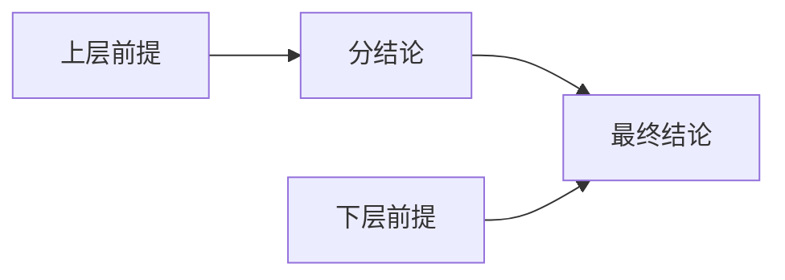
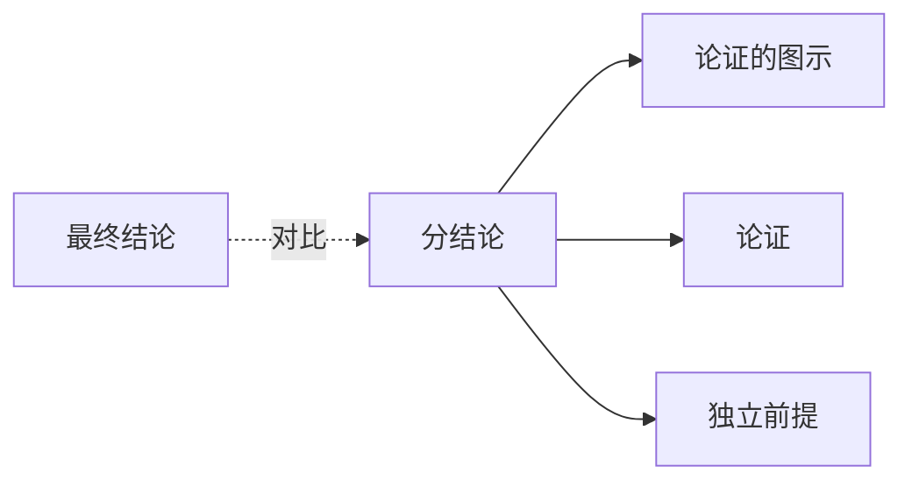

# 分结论

> [!abstract] 概述
> 分结论是既作为前提又作为结论的命题，是连接推理链中不同层级的关键枢纽——它承接上层推理的结果，又作为下层推理的出发点。

## 定义

> [!def] 分结论（Intermediate Conclusion / Sub-conclusion）
> 分结论是指在复杂论证中==既作为某个推理步骤的结论==，又==作为另一个推理步骤的前提==的命题。它是推理链条中的关键枢纽节点。

## 识别方法

> [!tip] 识别分结论的追问法
> 对论证中的每个命题追问：**"这个命题支持什么？"**
> - 如果该命题支持另一个命题 → 它充当了前提的角色
> - 同时，如果它又被其他命题所支持 → 它充当了结论的角色
> - 同时满足两者 → 它就是==分结论==

### 识别示例

**论证：**
> (1) 所有哺乳动物都是恒温动物。
> (2) 鲸鱼是哺乳动物。
> ∴ (3) 鲸鱼是恒温动物。← 分结论
> (4) 恒温动物需要维持体温。
> ∴ (5) 鲸鱼需要维持体温。

**追问分析：**
- 命题 (3) 被 (1)(2) 支持 → (3) 是结论
- 命题 (3) 与 (4) 一起支持 (5) → (3) 是前提
- 因此，(3) 是分结论

## 在推理链中的角色

分结论在推理链中承担双重角色：



1. **承接上层推理的结果**：分结论是上层前提推导出的结论
2. **作为下层推理的前提**：分结论参与支持最终结论的推理

## 分结论 vs 最终结论

| 维度 | 分结论 | 最终结论 |
|:-----|:-----|:-----|
| **角色** | 既是结论又是前提 | 仅是结论 |
| **位置** | 推理链的中间层级 | 推理链的最末端 |
| **数量** | 可以有多个 | 通常只有一个 |
| **被支持** | 被上层前提支持 | 被分结论和/或前提支持 |
| **支持其他命题** | 支持最终结论或下一个分结论 | 不支持任何命题 |

## 图示中的表示

在论证图示中，分结论位于推理链的中间位置，既有箭头指向它（作为结论），又有箭头从它出发（作为前提）：

```
(1) ──┐
     ├──→ (3) ──┐
(2) ──┘         ├──→ (5)
       (4) ─────┘
```

(3) 是分结论：被 (1)(2) 支持，又与 (4) 一起支持 (5)。

## 与其他概念的关系



- **[[论证的图示]]**：图示法能直观展示分结论在推理链中的枢纽位置
- **[[论证]]**：分结论是复杂论证区别于简单论证的关键特征
- **[[独立前提]]**：分结论可以拥有自己的独立前提

## 补充

> [!info] Snoeck Henkemans 的分结论识别三标准
> **来源：** Snoeck Henkemans, A. F. (2000). *State-of-the-Art: The Reconstruction of Argumentative Discourse*
>
> Snoeck Henkemans 提出了识别分结论的三个标准：
> 1. **句法标准**：该命题在文本中是否既出现在某个推理的结论位置，又出现在另一个推理的前提位置？
> 2. **语义标准**：该命题的内容是否既是某个推理的结果，又是支持另一个命题的理由？
> 3. **语用标准**：在对话语境中，该命题是否既被用来回应某个问题，又被用来支持进一步的论断？
>
> 三个标准相互补充，共同确保分结论识别的准确性。

## 参见

- [[2.3 复杂的论证性语段]] — 包含分结论的复杂论证分析
- [[论证]] — 分结论所属的论证结构
- [[论证的图示]] — 分结论在图示中的表示方法
- [[分结论-vs-最终结论]] — 两种结论类型的详细对比
