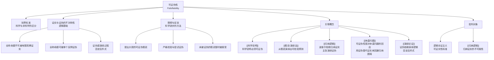

# 可证伪性

> [!abstract] 概述
> ==可证伪性==（falsifiability）是奥地利裔英国哲学家卡尔·波普尔（Karl Popper）提出的==科学划界标准==（criterion of demarcation）——一个理论如果==至少在原则上==能被经验观察所证伪，它就是科学的；反之，如果没有任何可能的经验观察能与之矛盾，它就不是科学的。可证伪性理论是对逻辑实证主义"可证实性"标准的直接回应，也是对[[休谟问题]]中归纳推理困境的一种解决方案：波普尔认为科学不需要通过归纳来证实理论，而只需要通过演绎来==证伪==理论。

## 定义

> [!def] 可证伪性（Falsifiability）
> ==可证伪性==是指一个命题或理论==在逻辑上==存在被经验观察反驳的可能性。形式化地说，对于理论 $T$，如果存在至少一个可能的经验陈述 $O$（基本陈述），使得 $T \land O$ 产生逻辑矛盾，即 $T \vdash \neg O$，则 $T$ 是可证伪的。

### 可证实与可证伪的不对称性

> [!def] 证实与证伪的逻辑不对称性（Asymmetry of Verification and Falsification）
> 波普尔指出了一个根本性的==逻辑不对称性==：
>
> - **全称命题无法被有限观察完全证实**：无论观察到多少只白天鹅，都不能证明"所有天鹅都是白的"（$\forall x(S(x) \to W(x))$），因为总可能存在一只未观察到的黑天鹅
> - **全称命题可以被单个反例证伪**：只需观察到==一只==黑天鹅，就能推翻"所有天鹅都是白的"
>
> 形式化表示：
> - 证实：$\neg \Diamond(\exists x \neg W(x) \mid \text{观察到 } n \text{ 只白天鹅})$ —— 有限观察不能排除反例
> - 证伪：$\Diamond(\exists x(S(x) \land \neg W(x))) \to \neg \forall x(S(x) \to W(x))$ —— 一个反例即可推翻全称命题

> [!tip] 不对称性的逻辑根源
> 这一不对称性源于==演绎逻辑==的有效性：从 $\exists x(S(x) \land \neg W(x))$ 推出 $\neg \forall x(S(x) \to W(x))$ 是一个==演绎有效==的推理（根据量词否定规则）。因此，证伪是一个演绎过程，具有逻辑必然性；而证实是一个归纳过程，只具有或然性。这就是为什么波普尔认为==证伪而非证实==才是科学方法的核心。

### 划界问题

> [!def] 划界问题（Demarcation Problem）
> ==划界问题==是科学哲学的核心问题之一：==什么区分了科学与非科学（或伪科学）？== 波普尔的可证伪性标准是对这一问题的回答。
>
> | 类型 | 特征 | 示例 |
> |:-----|:-----|:-----|
> | ==科学== | 可证伪——存在可能的观察能与之矛盾 | 爱因斯坦的广义相对论："星光在太阳引力场中会弯曲"（可被日食观测检验） |
> | ==伪科学== | 不可证伪——任何观察都能被"解释掉" | 占星术：任何预测失败都可以通过"星位计算误差"来辩护 |
> | ==非科学（非声称科学）== | 不涉及经验检验 | 数学、哲学、神学——它们有价值，但不是经验科学 |
> | ==形而上学== | 不可证伪但可能启发科学 | 决定论、唯物主义——波普尔认为它们不是无意义的，只是不是科学 |

> [!warning] 可证伪性 ≠ 假
> 一个理论是"可证伪的"并不意味着它是"假的"。可证伪性说的是理论==有可能==被证伪，而不是说它==已经被==证伪。事实上，科学史上最成功的理论（如牛顿力学、进化论）都是高度可证伪的——它们做出了大量精确的、可被检验的预测——但它们至今（在各自适用范围内）尚未被证伪。

## 核心性质

| 性质 | 说明 |
|:-----|:-----|
| ==证实与证伪的不对称性== | 有限观察不能证实全称命题，但单个反例可以证伪全称命题。这是可证伪性标准的逻辑基础 |
| ==可错性（Fallibility）== | 科学理论永远是==试探性的==（tentative），永远有可能被未来的观察证伪。科学不追求绝对真理，而追求"目前最佳的解释" |
| ==经验可检验性== | 科学理论必须做出==可被经验观察检验==的预测。不能被经验检验的理论不属于科学范畴 |
| ==科学vs非科学的划界功能== | 可证伪性提供了一个==清晰的操作性标准==来区分科学与非科学：一个理论是否科学，取决于它是否做出了可被检验的经验预测 |
| ==演绎的证伪力量== | 证伪是一个==演绎过程==：从理论 $T$ 推出预测 $P$，观察到 $\neg P$，由否定后件式（Modus Tollens）$T \supset P, \neg P \vdash \neg T$ 推出 $\neg T$ |
| ==科学进步的驱动力== | 科学通过==猜想与反驳==（conjectures and refutations）进步：科学家提出大胆的可证伪假说，然后通过严格的检验尝试证伪它们；未被证伪的假说暂时被接受 |

> [!info] 否定后件式与证伪的逻辑结构
> 证伪的逻辑结构本质上是==否定后件式==（Modus Tollens）：
> $$T \supset P, \quad \neg P \vdash \neg T$$
>
> 其中 $T$ 是被检验的理论，$P$ 是从 $T$ 中演绎出的预测。如果观察到 $\neg P$（预测不成立），则可以演绎地推出 $\neg T$（理论不成立）。
>
> 但波普尔承认，实际科学中证伪并非如此简单——因为理论检验通常涉及==辅助假设==（auxiliary hypotheses），所以被证伪的可能是辅助假设而非核心理论本身。这被称为==迪昂-蒯因论题==（Duhem-Quine thesis）。

## 关系网络

## 章节扩展

### 第13章：科学说明的经验可证实性

第13章在讨论科学说明的评价标准时，涉及了可证伪性的核心关切：

- **科学说明必须可检验**：一个好的科学说明不仅要在逻辑上自洽，还必须做出==可被经验检验==的预测。如果一个"说明"不能做出任何可检验的预测——即它是==不可证伪的==——那么它就不是一个真正的科学说明
- **间接检验中证伪的力量**：第13章讨论了科学假说的间接检验——当假说不能被直接检验时，我们从假说中演绎出可观察的推论，然后检验这些推论。如果推论被证伪，则假说受到严重质疑。这正是波普尔==假说-演绎法==的核心思想
- **非科学说明 vs 科学说明**：第13章区分了科学说明和非科学说明。不可证伪的"说明"（如"因为上帝的旨意"、"因为星象如此排列"）不属于科学说明的范畴——它们看似解释了一切，实际上什么也没有解释

> [!quote] 教材中的相关讨论
> Copi 在第13章中指出，科学说明的评价标准之一是==可检验性==（testability）。一个科学假说必须能够做出可以被经验证据支持或反驳的预测。这与波普尔的可证伪性标准高度一致——虽然 Copi 的表述更为温和（他使用"可检验性"而非"可证伪性"），但两者的核心精神相同：科学理论必须向经验证据开放，必须"冒被反驳的风险"。

## 补充

> [!info] 波普尔对逻辑实证主义的批判
> **来源：** Popper, K. (1959). *The Logic of Scientific Discovery*.
>
> 波普尔提出可证伪性标准的直接动机是==批判逻辑实证主义的可证实性标准==。维也纳学派的逻辑实证主义者（如 Carnap、Schlick）主张：一个命题如果有意义，它必须是==可证实的==（verifiable）——即可以通过经验观察来证实。
>
> 波普尔对此提出了三点根本性批评：
>
> 1. **可证实性标准会排除科学理论本身**：科学理论通常是全称命题（如"所有物体在引力作用下加速"），而全称命题不可能被有限观察完全证实。因此，如果坚持可证实性标准，那么==所有科学理论都是"无意义的"==——这显然是荒谬的
>
> 2. **可证实性标准无法排除伪科学**：占星术的拥护者可以声称他们的预测已经被"证实"了（通过选择性引用成功案例、忽略失败案例）。可证实性标准无法有效区分科学与伪科学
>
> 3. **科学不需要证实**：波普尔认为，科学理论的真正力量不在于它能被证实，而在于它==敢于被证伪==。一个理论越精确、越大胆，它就越容易被证伪——而正是这种"冒险"精神使它成为科学

> [!info] 拉卡托斯对可证伪性的修正
> **来源：** Lakatos, I. (1970). "Falsification and the Methodology of Scientific Research Programmes."
>
> 匈牙利裔哲学家伊姆雷·拉卡托斯（Imre Lakatos）认为波普尔的"==朴素证伪主义=="（naive falsificationism）过于简单化。拉卡托斯提出了"==精致证伪主义=="（sophisticated falsificationism）和"==科学研究纲领=="（Methodology of Scientific Research Programmes）的概念：
>
> - **研究纲领的结构**：一个科学研究纲领由==硬核==（hard core）和==保护带==（protective belt）组成。硬核是纲领的核心假设（如牛顿力学的三大定律），保护带是辅助假设和初始条件
> - **反面启发法**（negative heuristic）：禁止直接攻击硬核——当遇到反例时，科学家应该调整保护带而非放弃硬核
> - **正面启发法**（positive heuristic）：指导科学家如何发展纲领、预测新现象
> - **进步的 vs 退化的研究纲领**：一个纲领是==进步的==（progressive），如果它不断预测新事实；是==退化的==（degenerating），如果它只能事后"解释"已知事实而不能预测新事实
>
> 拉卡托斯的核心洞见是：==单个反例不能证伪一个理论==，因为科学家总是可以通过调整辅助假设来"消化"反例。科学理论的取舍不是基于单个实验的成败，而是基于==研究纲领的长期进步性==。参见 [[科学革命]]。

> [!warning] 可证伪性标准的局限
> 可证伪性标准虽然影响深远，但也面临若干批评：
>
> 1. **迪昂-蒯因论题**：科学理论从来不是孤立检验的——检验总是涉及一整套背景假设。当预测失败时，我们无法确定是核心理论错了，还是某个辅助假设错了
> 2. **概率性理论的可证伪性**：许多科学理论（如量子力学、进化论）做出的是统计性预测，而非确定性预测。统计性理论不能被单个反例证伪——只能被大量数据在统计上证伪
> 3. **观察的理论负载**（theory-ladenness of observation）：所有观察都渗透着理论——不存在纯粹的"中性观察"。因此，"用观察来证伪理论"这一理想化的图景需要修正
> 4. **科学史的反例**：拉卡托斯和库恩指出，科学史上的理论转换并不遵循波普尔描述的"猜想-证伪"模式——科学家通常不会因为反例就立即放弃理论

## 应用

可证伪性概念在以下领域有重要影响：

- **科学方法论**：为科学理论的评价提供了一个清晰的标准——好的科学理论必须做出精确的、可检验的预测
- **医学研究**：双盲随机对照试验的设计理念与可证伪性一致——研究者必须预先设定什么样的结果将否定假说
- **人工智能**：机器学习模型的评估依赖可证伪性思想——模型必须做出可被数据检验的预测，而非事后"解释"一切
- **日常批判性思维**：可证伪性标准可以帮助我们识别伪科学论证——如果一个主张不能被任何可能的观察所反驳，它就不是科学主张

## 参见

- [[科学说明]] — 科学说明必须具备可检验性（可证伪性）
- [[假说-演绎法]] — 从假说演绎出可检验预测的方法，与可证伪性密切相关
- [[归纳逻辑]] — 波普尔拒绝归纳证实，主张以演绎证伪替代
- [[休谟问题]] — 可证伪性是对休谟归纳问题的回应之一
- [[演绎论证]] — 证伪依赖演绎逻辑（否定后件式）
- [[科学革命]] — 库恩和拉卡托斯对可证伪性标准的修正与发展
