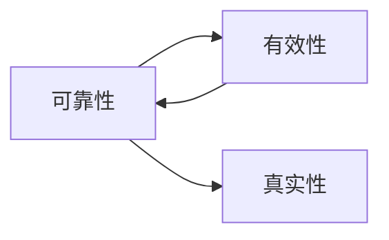

# 可靠性

> [!abstract] 概述
> 可靠性是演绎论证质量的终极标准——一个论证既有效（形式正确）又所有前提为真（内容正确），则结论==必然为真==。只有可靠论证才能建立其结论的真实性。

## 定义

> [!def] 可靠性（Soundness）
> 若一个论证有效，并且其所有前提都为真，我们就称它为==可靠的论证==（sound argument）。

> [!tip] 可靠论证的保真性
> 一个可靠论证的结论一定是真的——并且只有可靠的论证才能建立其结论的真实性。

## 核心性质

| 属性 | 有效性 | 可靠性 |
|:-----|:-------|:-------|
| 定义 | 不可能前提真结论假 | 有效 + 所有前提为真 |
| 保证结论为真？ | 否（前提可能为假） | ==是== |
| 可独立判定？ | 是（纯形式分析） | 否（需判定前提真实性） |

## 有效但不可靠的例子

> "所有鸟都会飞。企鹅是鸟。所以企鹅会飞。"
> - 有效？✅（Barbara式三段论）
> - 前提全真？❌（前提1"所有鸟都会飞"为假）
> - 可靠？❌
> - 结论为假？✅（企鹅不会飞）

这个例子说明：有效但不可靠的论证==不能建立==其结论的真实性。

## 与其他概念的关系

- **[[有效性]]**：可靠性的必要条件（可靠→有效，但有效不一定可靠）
- **[[演绎论证]]**：可靠性只适用于演绎论证
- **[[论证]]**：可靠性是论证评估的最高标准

## 应用

1. **学术论证评估**：不仅要检查推理是否正确（有效性），还要检查前提是否为真（可靠性）
2. **林肯的德雷德·斯科特分析**：推理完全正确（有效），但第二个前提为假→不可靠→结论得不到证明

### 第9章：可靠性论证与笃证性论证

第9章（9.13节）进一步精确化了可靠性的概念，并引入了==笃证性论证==（Demonstrative Argument）的区分。

- **可靠性论证**：一个论证是可靠的，当且仅当它是==有效的==并且==所有前提都为真==
- **笃证性论证**：一个论证是笃证性的，当且仅当它的前提是==相容的==并且结论是一个==偶真陈述==（既非重言式也非矛盾式）
- **三步评估法**：①检验有效性 → ②检验前提真假 → ③检验结论类型

> [!warning] 有效 ≠ 可靠
> 一个论证可以是有效的但不可靠的（前提有假）。一个论证甚至可以前提不相容（此时任何结论都有效推出，但论证毫无意义）。可靠性是比有效性更强的要求。

### 第10章：量化论证的可靠性

第10章将可靠性概念扩展到谓词逻辑领域：

- **量化论证的可靠性**：一个谓词逻辑论证是可靠的，当且仅当（1）所有前提为真，且（2）论证形式有效
- **与命题逻辑一致**：可靠性的定义在命题逻辑和谓词逻辑中完全相同——==前提真+形式有效==
- **存在含义的影响**：在评估可靠性时，需要注意全称前提在布尔解释下无存在含义，不能从全称前提推出存在结论
- **解释方法**：通过构造解释（模型）可以同时检验论证的有效性和前提的真值

参见 [[量词]]。

## 参见

- [[1.6 有效性与真实性]] — 七种真值组合和可靠性的详细讨论
- [[有效性]] | [[有效性-vs-可靠性]] — 两个概念的对比
- [[演绎论证]] — 可靠性适用的论证类型
