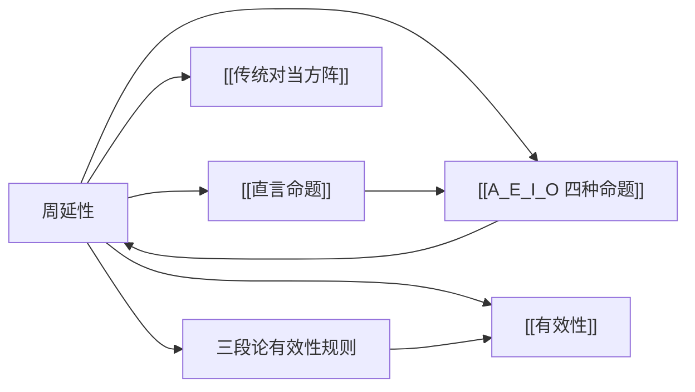

# 周延性

> [!abstract] 概述
> 周延性描述的是：在一个直言命题中，该命题是否==断定了某个词项所指类的全部对象==。它是判定直言三段论有效性的核心概念。

## 定义

> [!def] 周延（Distributed）
> 在一个直言命题中，如果该命题==断定了==某个词项所指==类的全部对象==，则称该词项在该命题中是==周延的==（distributed）。

> [!def] 不周延（Undistributed）
> 在一个直言命题中，如果该命题==未断定==某个词项所指==类的全部对象==（即只涉及了该类的部分对象），则称该词项在该命题中是==不周延的==（undistributed）。

> [!tip] 关键理解
> 周延性是==词项在命题中==的属性，而不是词项本身的属性。同一个词项在不同的命题中可能有不同的周延情况。例如，"学生"在"所有学生是人"中是周延的，但在"有学生是运动员"中是不周延的。

## 核心性质

| 性质 | 陈述 |
|:-----|:-----|
| 依赖于命题形式 | 周延性由命题的 A/E/I/O 类型决定，而非由词项内容决定 |
| 是词项在命题中的属性 | 同一词项在不同命题中可能有不同的周延情况 |
| 与真假无关 | 周延性是形式概念，与命题实际为真还是为假没有关系 |
| 推理有效性的基础 | 三段论的多条有效性规则都直接依赖于周延性 |

## 四种命题的周延情况

| 命题类型 | 标准形式 | 主项 S | 谓项 P | 说明 |
|:---------|:---------|:------:|:------:|:-----|
| **A**（全称肯定） | 所有 S 是 P | ==周延== | 不周延 | 断定了 S 的全部，但未断定 P 的全部 |
| **E**（全称否定） | 没有 S 是 P | ==周延== | ==周延== | 断定了 S 的全部和 P 的全部都被互相排斥 |
| **I**（特称肯定） | 有 S 是 P | 不周延 | 不周延 | 只涉及 S 和 P 的各一部分 |
| **O**（特称否定） | 有 S 不是 P | 不周延 | ==周延== | 谓项 P 的全部都被用来排斥 S 的某部分 |

### 逐项分析

**A 命题："所有 S 是 P"**
- 主项 S：==周延==——命题断定了 S 类的==每一个==对象都在 P 类中
- 谓项 P：不周延——命题只说 S 的全部在 P 中，但==没有说== P 的全部都被涉及。例如，"所有猫是动物"为真，但并非所有动物都是猫

**E 命题："没有 S 是 P"**
- 主项 S：==周延==——命题断定了 S 类的==每一个==对象都不在 P 类中
- 谓项 P：==周延==——命题断定了 P 类的==每一个==对象都不在 S 类中。"没有 S 是 P"等价于"没有 P 是 S"，两个类被完全互相排斥

**I 命题："有 S 是 P"**
- 主项 S：不周延——命题只涉及 S 类的==至少一个==对象，而非全部
- 谓项 P：不周延——命题只涉及 P 类的==至少一个==对象，而非全部

**O 命题："有 S 不是 P"**
- 主项 S：不周延——命题只涉及 S 类的==至少一个==对象，而非全部
- 谓项 P：==周延==——命题断定 S 的某部分被==排斥于 P 的全部之外==。"有S不是P"意味着 P 的全部对象中没有一个等于那个不在P中的S对象，因此 P 的全部都被涉及了

## 记忆口诀

> [!tip] 周延性的两条规则
> 1. **全称命题的主项总是周延的**——"所有"和"没有"都断定了主项的全部对象
> 2. **否定命题的谓项总是周延的**——"不是"意味着谓项的全部对象都被用来排斥主项的某部分
>
> 由此可直接推出四种命题的周延情况：
> - A：主项周延（全称），谓项不周延（肯定）
> - E：主项周延（全称），谓项周延（否定）
> - I：主项不周延（特称），谓项不周延（肯定）
> - O：主项不周延（特称），谓项周延（否定）

## 在三段论有效性规则中的角色

周延性是第6章直言三段论有效性判定的核心概念。三段论的六条基本规则中，有多条直接涉及周延性：

| 规则编号 | 规则内容 | 与周延性的关系 |
|:---------|:---------|:---------------|
| 规则2 | 中项在前提中至少==周延一次== | 如果中项在两个前提中都不周延，就无法建立有效连接 |
| 规则3 | 在前提中不周延的词项，在结论中==不得周延== | 结论不能断定比前提更多的东西（"非法周延"谬误） |

> [!warning] 非法周延（Illicit Distribution）
> 当一个词项在前提中不周延，却在结论中变为周延时，就犯了"非法周延"谬误。这违反了演绎推理的基本原则：结论不能断定前提所未断定的内容。
>
> - **非法大项周延**（Illicit Major）：大项在前提中不周延，在结论中却周延了
> - **非法小项周延**（Illicit Minor）：小项在前提中不周延，在结论中却周延了

## 与其他概念的关系

- **[[直言命题]]**：周延性是直言命题中词项的形式属性
- **[[A_E_I_O 四种命题]]**：命题类型决定词项的周延情况
- **[[传统对当方阵]]**：对当方阵中的某些推理关系（如换位）受周延性约束
- **[[有效性]]**：三段论的有效性判定以周延性规则为必要条件

## 补充

> [!info] 布尔的贡献
> **来源：** Boole, G. (1854). *An Investigation of the Laws of Thought*
>
> 乔治·布尔在《思维的规律研究》中用代数方法重新表述了类逻辑，将周延性精确化为集合论语言。在布尔看来，"所有 S 是 P"意味着 $S \cap \overline{P} = \emptyset$（S 与非 P 的交集为空），而"没有 S 是 P"意味着 $S \cap P = \emptyset$。这种代数化表述使得周延性的判定变得完全机械化，为后来的文恩图方法和现代符号逻辑奠定了基础。

> [!quote] 周延性与换位推理
> 周延性直接约束了换位推理（conversion）的合法性：
> - E 命题可以简单换位："没有S是P" → "没有P是S"（两个词项都周延，交换不改变周延情况）
> - I 命题可以简单换位："有S是P" → "有P是S"（两个词项都不周延，交换不改变周延情况）
> - A 命题不能简单换位："所有S是P" → "所有P是S"（S周延而P不周延，换位后P变为周延，犯了非法周延）
> - O 命题不能简单换位："有S不是P" → "有P不是S"（P周延而S不周延，换位后S变为周延，犯了非法周延）

## 应用

1. **三段论有效性检验**（第6章）：检查中项是否至少周延一次、结论中周延的词项在前提中是否也周延
2. **直接推论的合法性判定**（第5章）：判断换位、换质位等推理操作是否合法
3. **谬误识别**：识别"非法周延"等形式谬误

## 参见

- [[直言命题]] — 周延性所描述的对象
- [[A_E_I_O 四种命题]] — 各命题类型的周延情况表
- [[传统对当方阵]] — 对当关系中的周延性约束
- [[有效性]] — 周延性规则是有效性的必要条件
- [[直接推论]] — 换位推理的合法性依赖于周延性
