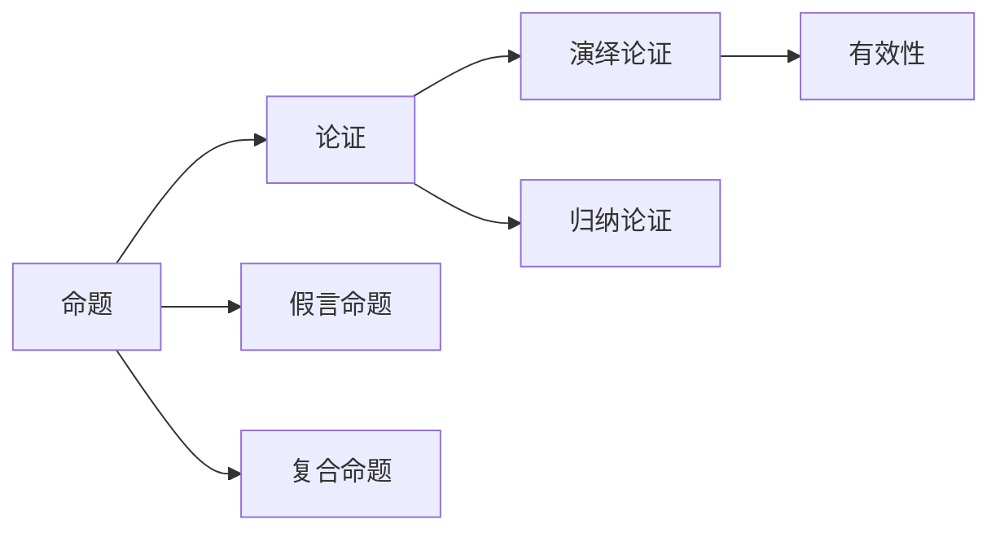

# 命题

> [!abstract] 概述
> 命题是推理的构建基块——一个断定事情是或不是如此这般的陈述，==每个命题都或真或假==（二值性）。

## 定义

> [!def] 命题（Proposition）
> 一个命题断定事情是如此这般或者不是如此这般。每一个命题都是或真或假的。命题的真值（truth value）为真（T）或假（F）。

**关键属性：**
- 二值性：每个命题恰好有一个真值（真或假）
- 真值可能未知，但不会"既不真也不假"
- 命题是推理的最小单位——论证由命题构成

## 核心性质

| 性质 | 陈述 | 条件 |
|:-----|:-----|:-----|
| 二值性 | 每个命题或真或假 | 无例外 |
| 非空性 | 问题、命令、感叹不是命题 | 必须做出断定 |
| 跨语言性 | 同一命题可用不同语句表达 | "It rains" = "下雨了" |
| 语境敏感性 | 同一语句在不同语境可表达不同命题 | 取决于说话者和时间 |

## 复合命题的三种类型

| 类型 | 联结词 | 断定力度 | 示例 |
|:-----|:-------|:---------|:-----|
| 合取命题 | 并且（∧） | 断定所有分支 | "A并且B并且C" |
| 析取命题 | 或者（∨） | 不断定任何分支 | "A或者B" |
| 假言命题 | 如果-那么（→） | 不断定任何分支 | "如果A那么B" |

> [!warning] 注意
> 析取命题和假言命题==不断定==任何一个分支命题为真。断定一个析取命题不等于断定其某个分支。

## 与其他概念的关系

- **[[论证]]**：由命题构成——前提和结论都是命题
- **[[实质蕴涵|假言命题]]**：复合命题的一种，"如果A那么B"
- **[[演绎论证]]**：断言前提必然支持结论，结论的真由前提的真保证

## 应用

1. **命题逻辑的基础**（第8章）：将命题符号化为 p, q, r...，用逻辑联结词构建复合命题
2. **谓词逻辑的扩展**（第10章）：将命题分析为内部结构（主词+谓词+量词）
3. **跨学科应用**：[[离散数学/notes/第01章_逻辑学的基本概念/1.1 什么是逻辑学]] 中用命题逻辑分析电路和程序

## 参见

- [[1.2 命题与论证]] — 命题和论证的详细讨论
- [[命题-vs-语句]] — 命题与语句的哲学区分
- [[论证]] — 由命题构成的推理结构
- [[有效性]] — 演绎论证的核心评估标准
- [[演绎论证]] — 命题在演绎论证中的角色
- [[语言的功能]] — 命题是语言信息性功能的核心产物
- [[外延与内涵]] — 命题的真值判定依赖词项定义的精确性
- [[定义的类型]] — 不同类型的定义影响命题含义的澄清
