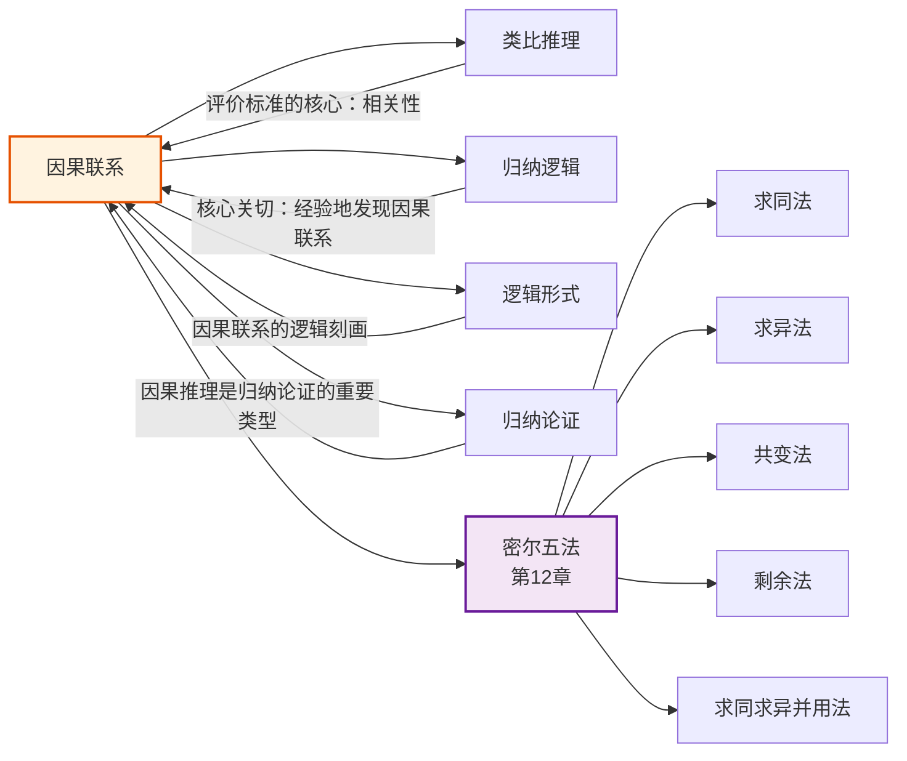

# 因果联系

> [!abstract] 概述
> ==因果联系==（causal connection / causal relation）是事件之间"原因—结果"的关系，是类比论证评价标准中"相关性"的==核心基础==。当一个属性与另一个属性之间存在因果联系时，它们之间存在相关——这正是为什么确定因果联系在类比论证中是关键的原因。因果联系只能通过观察和实验经验地发现，是[[归纳逻辑]]的核心关切，也是第12章密尔五法的主题。

## 定义

> [!def] 因果联系（Causal Connection）
> ==因果联系==是指两个（或多个）事件之间的"原因—结果"关系。当事件 $A$ 的发生导致（或有助于导致）事件 $B$ 的发生时，我们说 $A$ 是 $B$ 的==原因==（cause），$B$ 是 $A$ 的==结果==（effect），$A$ 与 $B$ 之间存在因果联系。
>
> 形式化表述：若在条件 $C$ 下，$A$ 的出现使得 $B$ 的出现概率增加，且这种概率增加不是由于其他混杂因素造成的，则 $A$ 是 $B$ 的（在条件 $C$ 下的）原因。

> [!def] 原因与结果的定义
> - **原因**（cause）：产生某个结果的条件或事件。原因可以是==充分条件==（sufficient condition，即 $A \rightarrow B$，$A$ 出现则 $B$ 必然出现）、==必要条件==（necessary condition，即 $B \rightarrow A$，$B$ 出现则 $A$ 必然已出现），或两者兼具
> - **结果**（effect）：由原因产生的事件或状态
> - **因果条件**（causal condition）：一个事件成为某个结果的充分或必要条件

> [!warning] 因果联系 vs 逻辑联系 vs 时间联系
> | 区分维度 | 因果联系 | 逻辑联系 | 时间联系 |
> |:---------|:---------|:---------|:---------|
> | **本质** | 事件之间的产生与被产生关系 | 命题之间的推导关系 | 事件之间的先后关系 |
> | **方向性** | 不对称（因→果，不可逆） | 可以对称（如逻辑等价） | 不对称（先→后） |
> | **必然性** | 概率性的（归纳发现） | 确定性的（演绎推导） | 无必然性（先发生的不一定是原因） |
> | **发现方法** | 观察与实验（密尔五法） | 逻辑分析（[[有效性]]、[[推论规则]]） | 经验观察 |
> | **核心误区** | ==在先的不一定是原因==（post hoc 不等于 propter hoc） | 逻辑蕴涵不等于因果联系 | 时间顺序不等于因果关系 |
>
> **关键区分：** 时间上的先后顺序是因果联系的==必要条件==但==非充分条件==——$A$ 在 $B$ 之前发生，并不意味着 $A$ 是 $B$ 的原因。这一区分是避免"在此之后，因而由此造成"（post hoc ergo propter hoc）谬误的关键。

## 核心性质

| 性质 | 说明 |
|:-----|:-----|
| ==因果三方向== | 因果联系可以沿三个方向运作：因→果、果→因、共同因 |
| ==不对称性== | 因果联系具有方向性——$A$ 是 $B$ 的原因，不意味着 $B$ 是 $A$ 的原因 |
| ==传递性== | 若 $A$ 是 $B$ 的原因，$B$ 是 $C$ 的原因，则 $A$ 是 $C$ 的原因 |
| ==概率性== | 因果联系只能通过观察和实验==经验地==发现，具有概率性而非确定性 |
| ==条件性== | 因果联系通常依赖于特定条件——在条件 $C$ 下 $A$ 导致 $B$，在条件 $C'$ 下可能不导致 |
| ==可多重性== | 一个结果可以有多种原因（多重因果），一个原因也可以产生多种结果 |

### 因果联系的三个方向

因果联系在类比论证中可以表现为三种形式（参见 11.3 节）：

| 方向 | 形式 | 说明 | 示例 |
|:-----|:-----|:-----|:-----|
| ==因→果== | 从原因到结果 | 已知 $A$ 导致 $B$，观察到 $c$ 具有 $A$，预测 $c$ 也将具有 $B$ | 已知该厂商工艺好（因）→鞋子合脚（果）；新鞋也是该厂商的（因）→预测合脚（果） |
| ==果→因== | 从结果到原因 | 已知 $A$ 和 $B$ 都是 $C$ 的结果，观察到 $c$ 具有 $B$，推断 $c$ 也具有 $A$ | 医生注意到症状 $B$，预测症状 $A$——因为同一病因 $C$ 造成了它们的共同出现 |
| ==共同因== | 同一原因的不同结果 | $A$ 和 $B$ 都是 $C$ 的结果，$A$ 和 $B$ 之间无直接因果关系，但通过 $C$ 相关联 | 产品的颜色与功能无关，但如果该颜色是某制造商生产过程的属性，可作为相关方面 |

## 关系网络

- **[[类比推理]]**：因果联系是评价类比论证==相关性==标准的核心——共有属性与结论属性之间有因果联系时，论证最强
- **[[归纳逻辑]]**：因果联系只能通过观察和实验经验地发现，这是归纳逻辑的核心关切
- **[[逻辑形式]]**：因果联系可以用条件语句的形式刻画（$A \rightarrow B$），但逻辑蕴涵不等于因果联系
- **[[归纳论证]]**：因果推理（从已知因果联系推出未知事件）是归纳论证的重要类型

## 第11章：因果联系作为类比论证评价的核心

因果联系在类比论证评价中扮演着==最关键==的角色。在六大评价标准中，==相关性==（relevance）是最重要的一个，而相关性的本质就是因果联系。

### 因果联系与相关性的关系

> [!tip] 核心原理
> 当共有属性与结论属性之间存在==因果联系==时，类比论证的强度达到最高。教材明确指出：
>
> "当一个属性与另外一个相关联的时候，即当它们之间存在某种因果联系的时候，它们之间存在相关，那就是为什么确定因果联系在类比论证中是关键的原因。"

**具体表现：**

1. **高相关因素 > 大量不相关因素**：单个与结论属性有因果联系的共有属性，比大量与结论属性无关的共有属性对论证的贡献更大
2. **因果方向决定推理方向**：从原因到结果的类比（因→果）通常比从结果到原因的类比（果→因）更强，因为原因对结果的控制力更强
3. **因果联系的强度决定论证的强度**：共有属性与结论属性之间的因果联系越强（即因果关系的概率越高），类比论证越强

### 评价类比论证时的因果分析

在运用六大标准评价类比论证时，因果分析贯穿始终：

| 评价标准 | 因果分析的视角 |
|:---------|:---------------|
| 实体数量 | 更多实例 → 更多因果证据 → 因果联系更可靠 |
| 实例多样性 | 多样性消解偶然因素 → 确认真正起作用的因果因素 |
| 相似方面数 | 更多相似方面 → 更多因果线索 → 因果联系更可能 |
| ==相关性== | ==直接判断：共有属性与结论属性之间是否有因果联系？== |
| 差异性 | 差异是否表明因果条件发生了变化？ |
| 结论适度性 | 因果联系越强，结论可以越大胆；因果联系越弱，结论应越适度 |

## 第12章预告：密尔五法

> [!info] 从类比评价到因果发现
> 第11章将因果联系作为评价类比论证的==标准==来使用——我们假设某些因果联系已知，然后据此判断类比论证的强度。第12章则转向因果联系的==发现==问题：我们如何通过系统化的观察和实验方法来确定因果联系？
>
> **密尔五法**（Mill's Methods）是 John Stuart Mill 在《逻辑体系》（*A System of Logic*, 1843）中系统阐述的五种==归纳方法==，用于从经验观察中发现事件之间的因果联系：

| 方法 | 英文名 | 核心思想 | 基本形式 |
|:-----|:-------|:---------|:---------|
| ==求同法== | Method of Agreement | 如果在不同情况下被研究现象都出现，且这些情况只有一个共同条件，则该条件是被研究现象的原因（或结果） | $A$ 出现时 $a$ 总出现 → $A$ 是 $a$ 的原因 |
| ==求异法== | Method of Difference | 如果两种情况只有一点不同，且被研究现象在一种情况中出现、在另一种中不出现，则该不同点是被研究现象的原因（或结果） | 有 $A$ 时有 $a$，无 $A$ 时无 $a$ → $A$ 是 $a$ 的原因 |
| ==共变法== | Method of Concomitant Variation | 如果一个现象的变化总是伴随着另一个现象的变化，则两者之间存在因果联系 | $A$ 增加时 $a$ 也增加 → $A$ 与 $a$ 有因果联系 |
| ==剩余法== | Method of Residues | 如果已知若干原因产生了某个复合结果，减去已知原因产生的部分，剩余部分的原因可以确定 | 总结果 - 已知原因的结果 = 剩余原因 |
| ==求同求异并用法== | Joint Method of Agreement and Difference | 结合求同法和求异法，既考察现象出现的场合（求同），又考察现象不出现的场合（求异），增强结论的可靠性 | 正面场合求同 + 反面场合求同 + 正反对比求异 |

> [!tip] 密尔五法与类比论证的关联
> 密尔五法本质上都是==受控比较==的方法——通过系统地变化条件、控制变量，从经验观察中提取因果联系。这与类比论证的评价逻辑一脉相承：类比论证的强度取决于因果联系，而密尔五法正是发现因果联系的系统工具。掌握密尔五法，就掌握了为类比论证提供==因果证据==的科学方法。

## 补充

> [!info] 因果联系的概率论表述
> **来源：** Suppes, P. (1970). *A Probabilistic Theory of Causality*.
>
> 当代因果推理理论通常采用概率论框架来刻画因果联系。Patrick Suppes 提出：
>
> - **概率因果**：事件 $A$ 是事件 $B$ 的原因，当且仅当 $P(B|A) > P(B)$——即 $A$ 的出现提高了 $B$ 出现的概率
> - **虚假因果**（spurious causality）：如果 $P(B|A) > P(B)$，但这种概率提高是由于某个共同原因 $C$ 造成的，则 $A$ 与 $B$ 之间的因果联系是虚假的
> - **因果链条**：如果 $A$ 导致 $B$，$B$ 导致 $C$，则 $A$ 通过 $B$ 间接导致 $C$，形成因果链条
>
> 这一概率论框架为密尔五法提供了更精确的数学基础，也解释了为什么因果联系只能被==概率地==确定，而不能被演绎地证明。

> [!info] 因果联系与"在此之后"谬误
> **来源：** Copi, §4.3 不当归纳谬误
>
> 最常见的因果推理谬误是=="在此之后，因而由此造成"==（post hoc ergo propter hoc）：仅仅因为事件 $A$ 在事件 $B$ 之前发生，就断定 $A$ 是 $B$ 的原因。这一谬误混淆了==时间联系==与==因果联系==——时间上的先后是因果联系的必要条件，但绝非充分条件。
>
> 例如："我吃了药之后病就好了，所以药治好了我的病"——这个推理忽略了自愈的可能性（混杂因素），可能犯了 post hoc 谬误。密尔五法（尤其是求异法和共变法）正是为了系统性地排除这类错误而设计的。

### 第12章：密尔五法与因果分析

第12章将因果联系理论化为系统化的分析方法：

- ==密尔五法==是因果分析的核心工具，其中求异法最接近受控实验
- 因果三方向在密尔方法中的体现：因→果（求异法）、果→因（剩余法）、共同因（求同法）
- 因果律与==自然齐一性==原理是密尔方法运作的哲学前提
- 密尔方法的真正价值在于==检验假说==而非发现假说

参见 [[密尔五法]]、[[必要条件与充分条件]]、[[自然齐一性]]。

### 第13章：科学说明中的因果联系

第13章将因果联系置于科学说明的框架中：

- ==科学说明==的目标是发现普遍真理（主要是因果联系），据此事实可以得到说明
- 假说确证中的因果推理：科学探究通过==假说-演绎法==检验因果假说
- 因果联系是科学说明中最常见的说明类型

参见 [[科学说明]]、[[假说-演绎法]]。

### 第14章：因果推断的概率基础

第14章揭示了因果联系的概率性质：

- 因果律也仅是==概然的==，不具有演绎的确定性
- ==概率==是因果推断的基础工具：密尔五法的结论是概率性的
- ==条件概率==用于评估因果假说在新证据下的可信度

参见 [[逻辑学/concepts/概率]]、[[逻辑学/concepts/条件概率]]。

## 参见

- [[类比推理]] — 因果联系是评价类比论证相关性的核心基础
- [[归纳逻辑]] — 因果联系是归纳逻辑的核心关切
- [[归纳论证]] — 因果推理是归纳论证的重要类型
- [[逻辑形式]] — 因果联系的条件语句刻画
- [[11.3 类比论证的评价]] — 因果联系在六大评价标准中的核心地位
- [[12.1 原因与结果|12.1 因果联系与密尔方法]] — 密尔五法的系统阐述
