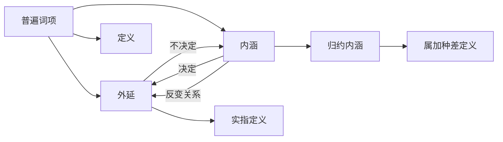

# 外延与内涵

> [!abstract] 概述
> 普遍词项具有两个语义维度——**外延**回答"指哪些东西？"，**内涵**回答"凭什么指这些东西？"。==内涵决定外延，但外延不决定内涵==，二者之间存在反变关系。

## 定义

> [!def] 普遍词项（Universal Term）
> 可以运用于一个以上对象的类的词项。例如"人"、"行星"、"三角形"都是普遍词项。

> [!def] 外延（Extension）
> 一个普遍词项==正确适用的所有对象的汇集==。外延回答的问题是："这个词项指哪些东西？"

> [!def] 内涵（Intension）
> 一个普遍词项==指谓的所有对象并且仅仅那些对象共同拥有的属性集==。内涵回答的问题是："凭什么指这些东西？"

## 核心性质

| 性质 | 陈述 | 条件 |
|:-----|:-----|:-----|
| 内涵决定外延 | 知道内涵即可确定外延 | 属性集决定对象集合 |
| 外延不决定内涵 | 相同外延可有不同内涵 | 如"等边三角形"与"等角三角形" |
| 反变关系 | 内涵增加→外延非递增（缩小或不变） | 见下方详细说明 |
| 空外延可能 | 外延可为空，但内涵仍可理解 | 如"吐火怪物"、"独角兽" |

## 核心定理：内涵决定外延

> [!info] 内涵与外延的决定关系
> - **内涵决定外延**：知道一个词项的内涵（属性集），就能确定哪些对象属于它的外延
> - **外延不决定内涵**：两个词项可以指谓完全相同的对象集合，但凭借不同的属性
>   - 经典例子："等边三角形"和"等角三角形"——==外延相同但内涵不同==
> - **推论**：具有不同外延的词项==不可能==有同样的内涵

## 反变关系

> [!tip] 反变关系（Inverse Variation）
> 内涵增加→外延非递增（缩小或不变）。这不是严格的反比例关系，而是"不递增"的单调约束。

**外延递减的例子：**

| 词项 | 内涵 | 外延 |
|:-----|:-----|:-----|
| 人 | 两足无毛的理性动物 | 所有人 |
| 活着的人 | +活着 | 活着的人 |
| 活着的20岁以上的人 | +20岁以上 | 活着的20岁以上的人 |

**外延不变的例子：**

| 词项 | 内涵 | 外延 |
|:-----|:-----|:-----|
| 活着的人 | 活着的人 | 活着的人 |
| 活着的有脊骨的人 | +有脊骨 | 活着的人（不变） |

> [!warning] 注意
> 反变关系是==单向的==：内涵增加时外延不会增大，但外延增大时内涵不一定减少。不能将反变关系理解为严格的对称关系。

## 空外延

> [!example] 空外延词项
> 有些词项的外延是空的——不存在满足其内涵的对象。例如：
> - "吐火怪物"——不存在吐火的怪物
> - "独角兽"——不存在长着独角的马
> - "最大的素数"——数学上可证明不存在
>
> 但这些词项的内涵完全可以理解——我们知道"吐火怪物"指的是什么样的东西，只是现实中不存在这样的东西。

## 内涵的三种含义

| 含义 | 定义 | 特点 |
|:-----|:-----|:-----|
| 主观内涵（subjective intension） | 说话者==个人==认为该词项所拥有的属性集 | 因人而异，不稳定 |
| 客观内涵（objective intension） | 该词项所指对象==共同拥有的全部属性== | 完整但往往不可穷尽 |
| 归约内涵（connotative intension） | ==普遍接受的公共标准==，定义所用的属性集 | 逻辑学关注的重点 |

> [!info] 逻辑学关注归约内涵
> 在逻辑学中，当我们谈论"内涵"时，通常指的是==归约内涵==——即一个词项被普遍接受的公共标准。这是定义操作的基础，也是判断论证中词项是否一致使用的关键。

## 六种定义方法

| 类型 | 方式 | 语义维度 |
|:-----|:-----|:---------|
| 示范定义（ostensive definition） | 通过展示实例来定义 | 外延 |
| 实指定义（denotative definition） | 通过列举外延中的全部成员来定义 | 外延 |
| 准实指定义（quasi-ostensive definition） | 通过指向+语境限定来定义 | 外延 |
| 同义定义（synonymous definition） | 通过给出同义词来定义 | 内涵 |
| 操作定义（operational definition） | 通过描述操作/测试程序来定义 | 内涵 |
| 属加种差定义（definition by genus and difference） | 通过属+种差来定义 | 内涵 |

> [!quote] 外延方法的局限
> 外延定义（示范、实指、准实指）只能用于==外延非空且有限==的词项。对于外延为空或外延无穷的词项，必须使用内涵定义方法。

## 与其他概念的关系

- **[[属加种差定义]]**：基于内涵的定义方法，使用归约内涵
- **[[命题]]**：命题中的词项需要明确其内涵和外延，以避免歧义
- **[[论证]]**：论证中词项含义的一致性依赖于内涵的稳定性

## 学术来源

> [!quote] Porphyry (3rd century), *Isagoge*（波菲利树）
> 波菲利提出了经典的属种层级结构（波菲利树），展示了从最高的"属"到最低的"种"的逐层划分，每一层划分都体现了内涵增加、外延缩小的反变关系。

> [!quote] Mill (1843), *A System of Logic*, Book I, Ch. II & VIII
> 密尔系统阐述了词项的外延和内涵理论，认为内涵是逻辑学更根本的概念——通过内涵可以确定外延，但外延不能反过来确定内涵。

## 应用

1. **直言逻辑的核心**（第5-6章）：直言命题（A、E、I、O）中的词项需要明确其外延，以判定命题的真假和推理的有效性
2. **词项歧义分析**（第7章）：当论证中的词项在不同含义间切换时，往往是因为内涵发生了变化，导致外延也发生了变化——这是"歧义谬误"的根源

## 参见

- [[3.5 定义的结构：外延与内涵]] — 详细讨论
- [[属加种差定义]] — 基于内涵的经典定义方法
- [[外延-vs-内涵]] — 外延与内涵的对比页
