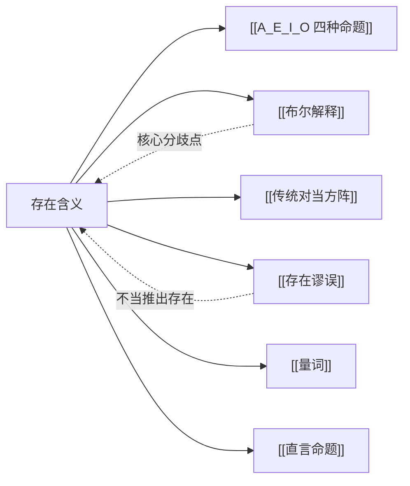

# 存在含义

> [!abstract] 概述
> 存在含义（existential import）是指一个命题是否==预设其主词所指称的类非空==。在布尔解释下，全称命题（A、E）没有存在含义，而特称命题（I、O）有存在含义。这一区分是现代逻辑与传统逻辑的根本分歧所在，直接影响对当方阵和直接推论的有效性。

## 定义

> [!def] 存在含义（Existential Import）
> 一个命题具有存在含义，当且仅当该命题为真时，==其主词所指称的类中至少有一个元素存在==。换言之，命题的真蕴涵了主词指称对象的存在。

## 核心性质

| 性质 | 陈述 |
|:-----|:-----|
| A 命题 | 在布尔解释下==无==存在含义；在亚里士多德解释下==有== |
| E 命题 | 在布尔解释下==无==存在含义；在亚里士多德解释下==有== |
| I 命题 | ==有==存在含义（两种解释一致） |
| O 命题 | ==有==存在含义（两种解释一致） |
| 现代逻辑立场 | 采用布尔解释，全称命题无存在含义 |
| 关键后果 | 差等关系、反对关系、下反对关系在布尔解释下失效 |

## 两种解释对比

| 比较维度 | 亚里士多德解释 | 布尔解释 |
|:---------|:---------------|:---------|
| A/E 的存在含义 | ==有==（隐含 S 非空） | ==无==（不承诺 S 存在） |
| I/O 的存在含义 | 有 | 有 |
| A 真能否推出 I 真 | 能（差等关系有效） | ==不能==（差等关系失效） |
| A 和 E 能否同真 | 不能 | ==能==（S 为空时） |
| 空类处理 | 不予考虑 | 正式处理 |

## 关系网络

- **[[A_E_I_O 四种命题]]**：存在含义区分了全称命题与特称命题的语义
- **[[布尔解释]]**：布尔解释的核心主张就是全称命题无存在含义
- **[[传统对当方阵]]**：存在含义决定了方阵中哪些关系有效
- **[[存在谬误]]**：从无存在含义的命题不当推出存在断言
- **[[量词]]**：全称量词 $\forall$ 不承诺存在，存在量词 $\exists$ 断言存在
- **[[直言命题]]**：存在含义是理解直言命题语义的关键

## 第5章：存在含义与直言命题解释

第5章（5.7节）首次引入了存在含义问题。核心争论是：当我们说"所有 S 是 P"时，是否隐含了"S 存在"这一断言？

- **亚里士多德解释**：认为全称命题隐含地断言了主项类的非空性
- **布尔解释**：全称命题只是条件性的概括，不承诺主项的存在
- **对传统方阵的影响**：在布尔解释下，[[传统对当方阵]] 中仅==矛盾关系==仍然有效，反对关系、下反对关系和差等关系全部失效
- **对直接推论的影响**：限制换位（A→I）和限制换质位（E→O）在布尔解释下无效

## 第10章：存在含义在谓词逻辑中的体现

第10章（10.4节）从谓词逻辑的符号化角度揭示了存在含义的深层机制：

- **A 命题用蕴涵** $\supset$：$(x)(Sx \supset Px)$ 是一个条件句，当 $Sx$ 为假时空虚为真，==不承诺 S 存在==
- **I 命题用合取** $\cdot$：$(\exists x)(Sx \cdot Px)$ 断言确实存在满足条件的个体，==承诺 S 存在==
- **量词是关键区分**：全称量词 $\forall$ 不断言存在，存在量词 $\exists$ 断言存在
- **空类示例**：对于空类（如"人首马身的怪物"），A 命题为真而 I 命题为假，这直接证明了 A 命题无存在含义

> [!tip] 记忆口诀
> - **全称用蕴涵**（$\supset$）→ 条件性的 → ==无==存在含义
> - **特称用合取**（$\cdot$）→ 断言性的 → ==有==存在含义

## 补充

> [!info] 斯特劳森的预设理论
> P.F. Strawson（1952）区分了语句（sentence）和命题（statement），提出自然语言中的主谓语句通常==预设==主项存在。如果预设不满足，语句既不真也不假（缺乏真值）。这一分析揭示了布尔解释虽然逻辑自洽，但偏离了自然语言直觉，推动了自由逻辑（free logic）等非经典逻辑的发展。

## 应用

1. **论证有效性检验**：识别推理中是否隐含了不当的存在假设
2. **三段论评估**：判断三段论推理是否依赖亚里士多德的存在假设
3. **谓词逻辑符号化**：正确选择蕴涵（全称）或合取（特称）来符号化直言命题
4. **哲学分析**：分析存在断言的逻辑结构和语义预设

## 参见

- [[A_E_I_O 四种命题]] — 存在含义区分了四种命题的语义
- [[布尔解释]] — 现代逻辑的标准立场：全称命题无存在含义
- [[传统对当方阵]] — 存在含义决定了方阵的有效关系
- [[存在谬误]] — 不当推出存在断言的谬误
- [[量词]] — 全称量词与存在量词的存在含义差异
- [[直言命题]] — 存在含义是直言命题语义的核心问题
