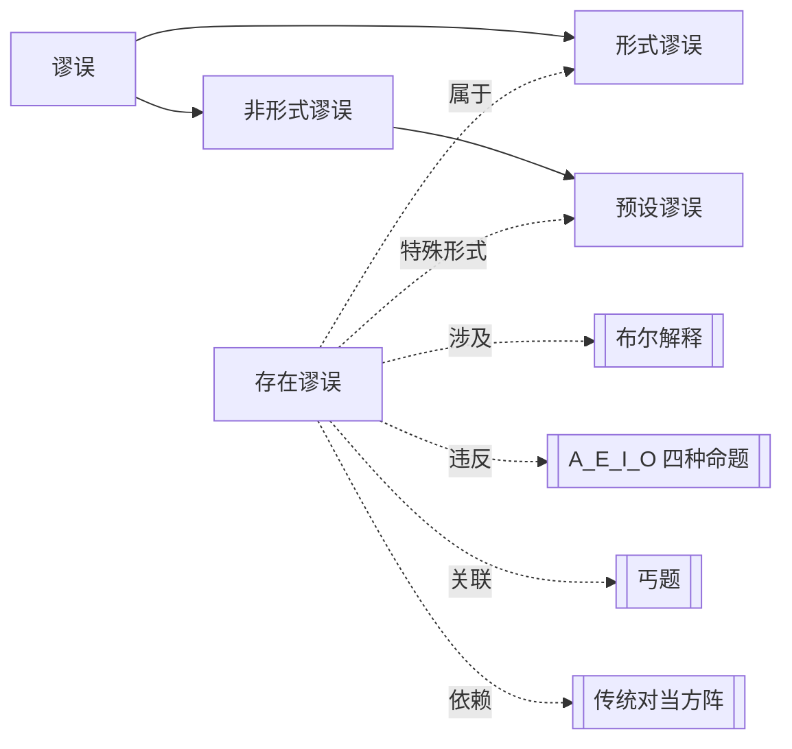

# 存在谬误

> [!abstract] 概述
> ==不恰当地假定某类元素存在==，从没有存在含义的全称前提推出有存在含义的特称结论，导致推理无效。

## 定义

> [!def] 存在谬误（Existential Fallacy）
> 一种形式谬误，指在推理中==隐含地假定了某类对象的存在==，但从给定的前提中无法合理地得出这一存在性断言。最典型的模式是从全称命题（在布尔解释下无存在含义）推出特称命题（有存在含义），例如从 A 命题推出 I 命题（差等关系 $A \rightarrow I$），在布尔解释下这种推论是无效的。

## 典型模式

> [!warning] 核心无效模式：$A \rightarrow I$（差等关系）
> 在布尔解释下，全称命题没有存在含义，而特称命题有存在含义。因此，从全称命题推出特称命题的差等关系==不普遍有效==：
>
> - $A \rightarrow I$：从"所有S是P"推出"有S是P"——无效
> - $E \rightarrow O$：从"没有S是P"推出"有S不是P"——无效
>
> 当S类为空时，前提（A或E）为真，但结论（I或O）为假，推理因此无效。

## 经典例子

> [!example] 独角兽推理
> - 前提："所有独角兽都是白色的。"（A命题——在布尔解释下无存在含义，独角兽不存在时为真）
> - 结论："有独角兽是白色的。"（I命题——有存在含义，断言独角兽存在）
>
> 当独角兽==不存在==时，前提为真（条件句"如果有独角兽，那么它是白色的"前件为假，整个命题为真），但结论为假（断言了独角兽存在，而实际不存在）。因此该推理无效，犯了==存在谬误==。

> [!example] 完美社会推理
> - 前提1：所有完美的社会都是公正的。（A命题）
> - 前提2：没有完美的社会是压迫性的。（E命题）
> - 结论：有公正的社会不是压迫性的。（O命题）
>
> 两个前提都是全称命题，在布尔解释下没有存在含义。结论是O命题，有存在含义。从两个无存在含义的前提无法推出有存在含义的结论，犯了==存在谬误==。

## 核心性质

| 性质 | 陈述 |
|:-----|:-----|
| 谬误类型 | 形式谬误（推理形式本身的错误） |
| 错误机制 | 从无存在含义的前提隐含地引入了存在预设 |
| 依赖解释 | 仅在布尔解释下成立；在亚里士多德解释下差等关系有效 |
| 典型形式 | $A \rightarrow I$、$E \rightarrow O$（差等关系推理） |
| 与预设谬误的关系 | 存在谬误是==预设谬误==的一种特殊形式——隐含地预设了词项指称的类不为空 |

> [!tip] 存在谬误与丐题的关联
> 存在谬误与[[丐题]]有深层联系：两者都涉及==将未证明的假设偷运进推理==。丐题是将结论本身当作前提使用，存在谬误则是将"某类对象存在"这一未证明的假设隐含地引入推理。两者都是"预设性"的错误——推理的有效性依赖于一个没有得到前提支持的前提。

## 与其他概念的关系

## 补充

> [!info] 历史背景
> 存在谬误的识别依赖于布尔解释的引入。乔治·布尔（George Boole, 1815–1864）在1854年的《思维的规律研究》（*An Investigation of the Laws of Thought*）中系统阐述了全称命题不具有存在含义的观点，从而揭示了传统逻辑中从全称命题推出特称命题的推理在空类情况下失效的问题。存在谬误这一概念正是布尔解释对传统逻辑批判的核心产物之一。

> [!info] 何时差等关系有效？
> 在布尔解释下，差等关系 $A \rightarrow I$ 和 $E \rightarrow O$ 并非总是无效。如果能够==额外确认主项S类不为空==（即 $S \neq 0$），那么差等关系就变为有效。问题在于，仅凭全称前提本身无法提供这一存在性保证。因此，在不知道S类是否为空的一般情况下，差等关系不普遍有效。

## 应用

- **三段论有效性检验**：在用文恩图检验三段论时，如果两个前提都是全称命题而结论是特称命题，且文恩图中没有x标记，则该三段论犯了存在谬误。
- **日常推理批判**：识别日常论证中隐含的存在预设，例如"所有天才都是孤独的，所以有孤独的人是天才"——如果天才不存在，这个推理就犯了存在谬误。
- **科学定律的理解**：科学定律通常是全称命题（如"所有不受外力的物体保持匀速直线运动"），它们不预设所涉对象的存在。将科学定律直接推出特称命题需要额外的经验证据。

## 参见

- [[谬误]] —— 存在谬误是谬误的一种具体类型
- [[非形式谬误的四大类]] —— 存在谬误与预设谬误的关联
- [[布尔解释]] —— 存在谬误的识别依赖于布尔解释的立场
- [[丐题]] —— 存在谬误与丐题的深层联系
- [[A_E_I_O 四种命题]] —— 理解全称命题与特称命题在存在含义上的差异
