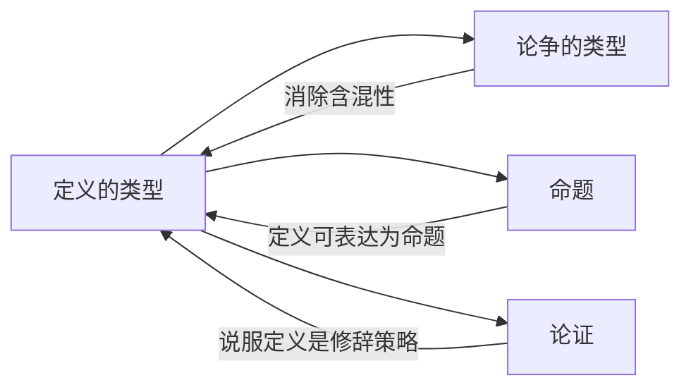

# 定义的类型

> [!abstract] 概述
> 定义总是对符号（而非对象）的定义，由==被定义项==（definiendum）与==定义项==（definiens）两部分组成。不同类型的定义服务于不同功能：引入新符号、报告已有用法、消除模糊性、概括理论理解、或影响态度。

## 定义

> [!def] 定义的本质
> 定义总是对符号（而非对象）的定义。被定义的符号为**被定义项**（definiendum），用来说明被定义项意义的符号为**定义项**（definiens）。

> [!tip] 关键区分
> 定义的对象是符号而非事物。定义"椅子"不是在定义那个木制的物理对象，而是在定义"椅子"这个词的含义。

## 五种定义类型

### 1. 规定定义（Stipulative Definition）

> [!def] 规定定义
> 将意义指派给某符号。引进新符号的人有指派意义的自由。==规定定义既不真也不假==。

> [!example] 示例
> "googol" = $10^{100}$

### 2. 词典定义（Lexical Definition）

> [!def] 词典定义
> 报告被定义项已经具有的意义。==词典定义可真可假==，取决于它是否忠实于被定义项的实际使用方式。

> [!example] 示例
> "'bird'指的是有羽毛的温血脊椎动物"

### 3. 精确定义（Precising Definition）

> [!def] 精确定义
> 消除歧义或模糊性。==在已有用法的范围内选择或构建一个更精确的标准==，以服务于特定目的。

> [!example] 示例
> "马力" = 745.7瓦

### 4. 理论定义（Theoretical Definition）

> [!def] 理论定义
> 概括对某理论的理解，试图捕捉概念的==本质特征==。

> [!example] 示例
> IAU 2006年行星定义：一个天体要成为行星，必须同时满足三个条件——在环绕太阳的轨道上运行、有足够质量呈现流体静力平衡形状、清除了轨道附近区域。

### 5. 说服定义（Persuasive Definition）

> [!def] 说服定义
> 通过影响态度或激发情感以解决争论。==表面上看似客观的定义，实际上暗含价值判断==。

> [!example] 示例
> 左派将"社会主义"定义为"延伸至经济领域的民主"——正面框架；反对者可能将同样的术语定义为负面概念。

## 核心性质

| 类型 | 功能 | 真值条件 | 评估标准 |
|:-----|:-----|:---------|:---------|
| 规定定义 | 引入新符号 | 既不真也不假 | 是否有用、是否便利 |
| 词典定义 | 报告已有用法 | 可真可假 | 是否符合实际用法 |
| 精确定义 | 消除模糊性 | 合理性标准 | 是否有效消除模糊性 |
| 理论定义 | 概括理论理解 | 取决于理论 | 是否准确反映理论 |
| 说服定义 | 影响态度 | 不适用 | 修辞效果如何 |

> [!warning] 注意
> 混淆定义类型会导致逻辑错误——例如，将规定定义当作词典定义来批评其"不正确"，或未能识别说服定义中的价值偏见。

## 与其他概念的关系

- **[[论争的类型]]**：定义是消除论争中含混性的主要工具
- **[[命题]]**：定义本身可以被表达为命题，但定义的功能不同于普通的描述性命题
- **[[论证]]**：说服定义是论证中常见的修辞策略

## 补充

> [!info] Robinson 的定义分类理论
> **来源：** Robinson (1950), *Definition*, Oxford University Press
>
> Robinson 指出，定义在历史上至少有五种不同的功能：指示（指出对象）、陈述本质（给出本质特征）、说明用法（报告语言习惯）、规定意义（建立语言约定）以及激发情感（说服性用途）。Robinson 更加强调定义的社会性和语境依赖性——脱离具体语境讨论"正确定义"是没有意义的。

## 应用

1. **第5章（直言命题定义）**：词项的定义影响直言命题的真值判定
2. **第6章（三段论词项定义）**：三段论的有效性依赖于词项的清晰定义
3. **第8章（联结词精确定义）**：逻辑联结词（如"如果-那么"、"或"）需要精确定义以避免歧义

## 参见

- [[3.4 定义及其用途]] — 详细讨论
- [[论争的类型]] — 定义是消除论争中含混性的工具
- [[规定定义-vs-词典定义]] — 两种定义类型的深入对比
