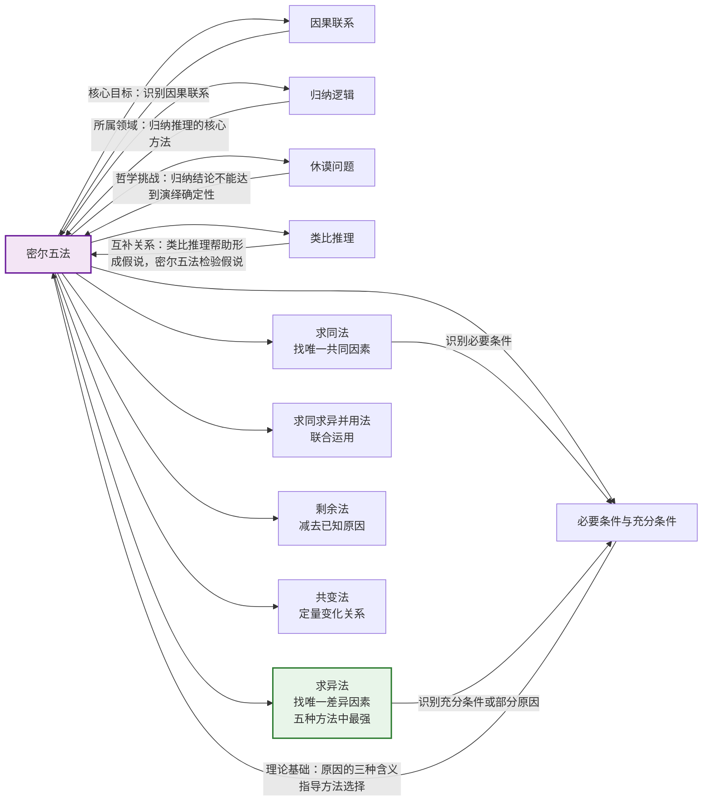

# 密尔五法

> [!abstract] 概述
> ==密尔五法==（Mill's Methods）是英国哲学家约翰·斯图亚特·密尔（John Stuart Mill）在《逻辑学体系》（*A System of Logic*, 1843）中系统阐述的五种==因果分析方法==，是[[归纳逻辑]]中从经验观察识别因果联系的基本工具。五种方法分别是==求同法==（Method of Agreement）、==求异法==（Method of Difference）、==求同求异并用法==（Joint Method of Agreement and Difference）、==剩余法==（Method of Residues）和==共变法==（Method of Concomitant Variation）。密尔五法的共同目标是从观察到的现象中识别因果联系，其中前四种方法本质上是==排除性==的，共变法则是==定量==的。它们构成了科学探究因果律的通用方法论基础，至今仍是现代受控实验、随机对照试验（RCT）的底层逻辑。

## 定义

> [!def] 密尔五法（Mill's Methods）
> ==密尔五法==是五种从经验观察中==识别因果联系==的系统归纳方法。密尔在《逻辑学体系》第三卷第八章中对这些方法进行了精确的公式化。这些技术本身并非密尔发明——其思想渊源可追溯到弗兰西斯·培根的《新工具》（1620）乃至亚里士多德——但密尔首次将它们系统化为五种可操作的推理模式。密尔五法的本质是==增强的排除归纳法==（enhanced eliminative induction）：通过系统地排除不可能的原因来支持因果假说。

### 1. 求同法（Method of Agreement）

> [!def] 求同法
> 如果被研究的现象的两个或更多实例==只有一个共同的事态==，那么这个事态就是给定现象的==原因（或结果）==。
>
> **密尔原文：** "如果被研究的现象的两个或更多的实例只有一个共同的事态，那么，这个事态——所有实例仅在该事态上相契合——就是给定现象的原因（或结果）。"
>
> **形式模式：**
> $$ABCD \to wxyz$$
> $$AEFG \to wtu v$$
> $$\therefore A \to w$$
>
> **推理结构：**
> - 前提1：在事态集合 $\{A, B, C, D\}$ 下，现象 $w$ 发生
> - 前提2：在事态集合 $\{A, E, F, G\}$ 下，现象 $w$ 再次发生
> - 两组事态中唯一的共同因素是 $A$
> - 结论：$A$ 是 $w$ 的原因（或结果）

**求同法的排除逻辑：** 求同法本质上是排除法——在现象 $w$ 未出现的某些情况下也出现的事态不可能是 $w$ 的原因。只有那些在 $w$ 出现的所有实例中都存在的因素，才有资格成为候选原因。

### 2. 求异法（Method of Difference）

> [!def] 求异法
> 如果一个实例下被考察的现象发生了，在另一个实例下该现象没有发生，两个实例下的事态==除了一个事态不同外其他均相同==，该事态就是该现象的结果或原因，或者为原因的一个不可缺少的部分。
>
> **密尔原文：** "如果在一个实例下一个考察的现象发生了，在另外一个实例下该现象没有发生，两个实例下的事态除了一个事态不同外（该事态仅发生在前一个实例中）其他均相同，该事态（只有它使两个实例产生差别）是该现象的结果或原因，或者为原因的一个不可缺少的部分。"
>
> **形式模式：**
> $$ABCD \to wxyz$$
> $$BCD \to xyz \quad (\text{无 } w)$$
> $$\therefore A \to w$$
>
> **推理结构：**
> - 前提1：事态 $\{A, B, C, D\}$ 下，现象 $w$ 发生
> - 前提2：事态 $\{B, C, D\}$ 下（无 $A$），现象 $w$ 不发生
> - 两组事态的唯一差异是 $A$ 的有无
> - 结论：$A$ 是 $w$ 的原因或结果，或原因中不可缺少的部分

**求异法的特殊地位：** 求异法是密尔五法中==最有力的==一种，最接近现代科学中的==受控实验==。它通过主动制造差异（实验干预）来识别因果联系，而非被动观察共同点。

### 3. 求同求异并用法（Joint Method of Agreement and Difference）

> [!def] 求同求异并用法
> 将求同法和求异法在同一个研究中==联合运用==。在现象出现的多个实例中寻找共同因素（求同），同时考察现象不出现的实例中该因素是否也不存在（求异）。两种方法各自对结论提供概率支持，联合运用给结论提供了==较高的概率==。
>
> **形式模式：**
> $$ABC \to xyz$$
> $$ABC \to xyz$$
> $$ADE \to xtw$$
> $$BC \to yz \quad (\text{无 } x)$$
> $$\therefore A \to x$$
>
> **推理结构：**
> - **求同部分**（前三行）：在现象 $x$ 发生的多个实例中，事态 $A$ 是共同因素
> - **求异部分**（第四行）：在现象 $x$ 不发生的实例中，事态 $A$ 也不存在
> - 结论：$A$ 是 $x$ 的原因或部分原因

**并用法的优势：** 求同法单独使用时，可能存在多个共同因素；求异法单独使用时，两组之间可能存在未被注意的差异。==联合使用时==，两种方法互相补充、互相验证，使结论的概率显著高于任何一种方法单独使用时的概率。

### 4. 剩余法（Method of Residues）

> [!def] 剩余法
> 从任意一个现象中==减去==以前归纳中被认为是特定先行事件结果的那部分，那么该现象==剩余的部分==为剩余的先行事件的结果。
>
> **密尔原文：** "从任意一个现象中减去以前归纳中被认为是特定先行事件结果的那部分，那么该现象剩余的部分为剩余的先行事件的结果。"
>
> **形式模式：**
> $$ABC \to abc$$
> $$A \to a$$
> $$B \to b$$
> $$\therefore C \to c$$
>
> **推理结构：**
> - 前提1：事态 $\{A, B, C\}$ 共同产生了现象 $\{a, b, c\}$
> - 前提2：已知 $A$ 导致 $a$，$B$ 导致 $b$
> - 结论：剩余的现象 $c$ 必定由剩余的事态 $C$ 导致

**剩余法的独特性：** 剩余法==仅需对一个事例的考察==，而其他方法要求至少两个事例。但它==依赖预先建立的因果律==——必须已知部分原因与结果的关系才能进行"减法"操作。

### 5. 共变法（Method of Concomitant Variation）

> [!def] 共变法
> 无论什么现象，每当另外一个现象以某种特定方式发生变化时，它也以某种方式发生变化，那么它或者是那个现象的一个原因，或者是一个结果，或者通过某因果事实与之相关联。
>
> **密尔原文：** "无论什么现象，每当另外一个现象以某种特定方式发生变化时，它也以任何方式发生变化，那么，它或者是那个现象的一个原因，或者是一个结果，或者通过某因果事实与之相关联。"
>
> **形式模式：**
> $$A_1 \to a_1$$
> $$A_2 \to a_2$$
> $$A_3 \to a_3$$
> $$\therefore A \leftrightarrow a$$
>
> **推理结构：**
> - 前提1：当 $A$ 处于水平 $A_1$ 时，$x$ 处于水平 $a_1$
> - 前提2：当 $A$ 处于水平 $A_2$ 时，$x$ 处于水平 $a_2$
> - 前提3：当 $A$ 处于水平 $A_3$ 时，$x$ 处于水平 $a_3$
> - 结论：$A$ 与 $x$ 之间存在因果联系（$A \leftrightarrow a$）
>
> 共变法允许==直接共变==（同向变化，$A$ 增加时 $a$ 也增加）和==反方向共变==（反向变化，$A$ 增加时 $a$ 减少）。

**共变法的独特性：** 共变法是密尔五法中唯一的==定量==方法——前四种方法本质上是定性的（判断因素的有无），而共变法利用现象间变化的==程度==作为因果证据。它特别适用于==不可能排除某因素==的情境（如不能排除人的饮食）。

## 核心性质

| 性质 | 说明 |
|:-----|:-----|
| ==排除法本质== | 前四种方法本质上是排除性归纳——通过排除不可能的原因来支持因果假说。共变法是定量方法，利用变化程度作为因果证据 |
| ==依赖在先假说== | 密尔五法不能独立运作。使用前必须预先确定哪些因素是"相关的"，这需要背景知识和科学假说。方法本身不能告诉我们哪些因素是相关的 |
| ==概率性结论== | 五种方法的结论都是==或然的==（probable）而非必然的——它们产生归纳结论，不能从前提中有效演绎出来。无论观察多么精确，结论永远不能达到演绎的确定性 |
| ==求异法最强== | 求异法是五种方法中==最有力的==，因为它最接近受控实验——通过主动制造差异来识别因果联系，而非被动观察 |
| ==检验而非发现== | 密尔五法的真正力量在于==检验假说==，而非从零开始发现因果关系。假说的形成依赖于科学直觉、背景理论和创造性洞察 |
| ==对照实验的逻辑基础== | 五种方法合起来描述了==对照实验==（controlled experiment）的普遍方法，是现代科学中不可缺少的工具 |

> [!warning] 密尔五法的共同局限
> 1. **多因果性问题**：当一个现象有多个原因时，单一方法可能无法识别所有原因
> 2. **因果方向问题**：方法本身不能确定因果方向（$A \to B$ 还是 $B \to A$）
> 3. **混淆变量问题**：未被观察到的第三方因素可能同时影响"原因"和"结果"
> 4. **交互效应问题**：多个因素可能产生交互作用，单独考察每个因素会遗漏这种效应
> 5. **事态不可穷尽**：任何两个事物都有无数相同点和不同点，我们只能关注"相关事态"

## 关系网络

- **[[因果联系]]**：密尔五法的==核心目标==是从经验观察中识别因果联系。因果联系的三种方向（因→果、果→因、共同因）和原因的三种含义（必要条件、充分条件、关键因素）为密尔五法的应用提供了理论基础
- **[[归纳逻辑]]**：密尔五法是[[归纳逻辑]]的核心方法，其结论具有概率性而非确定性，用归纳强度而非有效性来评价
- **[[休谟问题]]**：密尔五法作为"证明的方法"的失败是[[休谟问题]]的具体体现——归纳推理的合理性无法被演绎地证明，其结论"充其量是高度概然的，绝不是笃证的"
- **[[类比推理]]**：类比推理帮助==形成因果假说==（如从同事死亡类比推断脏手传播疾病），密尔五法则==检验这些假说==。两者在科学探究中形成互补关系
- **[[归纳论证]]**：密尔五法产生的论证是[[归纳论证]]的典型形式——前提为真使结论可能为真，但非必然为真
- **[[演绎论证]]**：密尔五法的排除步骤本身可以是演绎有效的（如果分析正确，则某因素不可能是原因），但整个论证的可靠性取决于假定的先行分析的正确性
- **[[必要条件与充分条件]]**：求同法倾向于识别==必要条件==（现象发生时始终存在的因素），求异法倾向于识别==充分条件或部分原因==（现象发生与不发生的唯一差异）

## 第12章：五种方法的应用实例

### 求异法——黄热病蚊子实验（Walter Reed, 1900）

美国军医==瓦尔特·里德==（Walter Reed）、詹姆斯·卡罗尔和杰西·拉齐尔在1900年进行了确证黄热病真正原因的实验：

- **实验设计：** 建造了一个杜绝蚊子出入的小房子，用金属丝蚊帐将房间分为两个空间，向其中一个空间释放15只叮咬过黄热病病人的蚊子
- **实验组：** 一个没有免疫力的志愿者进入有蚊子的房间，被7只蚊子叮咬，四天后得了黄热病
- **对照组：** 另外两个没有免疫力的人在没有蚊子的空间里睡了13个晚上，没有任何不适
- **补充实验：** 在另一个无蚊子的房子里放置黄热病病人的衣物、床上用品和被排泄物污染的器具，让没有免疫力的人住在里面（严格隔离以免遭蚊子叮咬），==没有一个感染上黄热病==
- **结论：** ==蚊子传播是黄热病的原因==，而非接触病人或其物品

**密尔方法分析：**
$$\{A(\text{蚊子叮咬}), B(\text{居住环境}), C(\text{饮食}), D(\text{年龄})\} \to w(\text{黄热病})$$
$$\{B, C, D\} \to \sim w$$
$$\therefore A \to w$$

这是==求异法==的经典应用——两组实例仅在蚊子叮咬的有无上不同，其余条件基本相同。

### 求同法与求异法——饮水氟化（Newburgh-Kingston, 1940s）

在寻找某些城市蛀牙率异常低的原因时，研究者发现这些城市有一个共同事态：==供水中的含氟量非常高==（求同法）。为确证这一因果联系，纽约州纽堡市和金斯顿市（哈德逊河沿岸两个类似大小的城市）接受了严密研究：

- **实验组（纽堡市）：** 供水被加了氟
- **对照组（金斯顿市）：** 供水没有加氟
- **结果：** 纽堡市的孩子们到14岁时蛀牙减少了70%，而两个城市在患癌率、先天缺陷率或心脏病率上都没有任何差别

**密尔方法分析：** 这一研究同时运用了==求同法==（低蛀牙率城市的共同因素是高含氟量）和==求异法==（唯一差异是是否加氟），是==求同求异并用法==的典型应用。

### 求同求异并用法——糙皮病研究（Goldberger, 1914）

美国公共卫生局的==约瑟夫·戈德berger==（Joseph Goldberger）通过系统的密尔方法研究，确定了糙皮病（pellagra）的原因：

- **求同法：** 在糙皮病高发的机构（孤儿院、精神病院）中，患者饮食的共同特征是缺乏新鲜肉类和奶制品
- **求异法：** 在同样条件下但饮食中添加了新鲜肉类的机构中，糙皮病发病率大幅降低
- **并用法结论：** 饮食缺乏（而非感染或卫生条件）是糙皮病的原因

戈德berger甚至在自己、妻子和同事身上进行了实验（口服糙皮病患者的分泌物），证明该病不是传染性的。这一案例展示了密尔方法在公共卫生研究中的强大力量。

### 剩余法——海王星的发现（Le Verrier & Galle, 1846）

1821年，巴黎的布瓦发表了天王星的运动数据表。他发现根据1800年以后的观察数据计算出的轨道与根据天王星刚被发现时的数据计算的轨道不一致。到1844年，差值总计达到2分钟弧度。

- **已知部分：** 所有其他已知行星的运动与计算结果一致
- **剩余物：** 天王星轨道中存在无法解释的摄动
- **推理：** ==天王星轨道的异常摄动必定由一颗未知行星的引力造成==

1845年，年轻的==勒维耶==（Le Verrier）着手解决这个问题。他检查了布瓦的计算，发现基本正确，于是推断存在一颗未知行星。1846年9月，他写信给柏林的==迦勒==（Galle），请求在天空的特定区域寻找新行星。9月23日，迦勒在不到一小时的时间里就找到了这颗新行星——后来被命名为==海王星==，在预测位置的1度范围内被发现。

**密尔方法分析：**
$$\{A(\text{未知行星引力}), B(\text{已知行星引力}), C(\text{太阳引力})\} \to \{x(\text{异常摄动}), y, z\}$$
$$B \to y, \quad C \to z$$
$$\therefore A \to x$$

这是==剩余法==的辉煌成就——通过减去已知原因的效果，发现了"剩余物"的原因。

### 共变法——波义耳定律（Boyle's Law, 1662）

==波义耳定律==（Boyle's Law）是共变法的经典科学应用：

$$PV = k \quad (\text{恒温条件下})$$

当气体的体积 $V$ 减小时，其压强 $P$ 按反比例增大；当体积增大时，压强按反比例减小。这种精确的==反方向共变关系==揭示了气体的体积与压强之间存在因果联系。

**密尔方法分析：**
$$V_1 \to P_1$$
$$V_2 \to P_2 \quad (V_2 < V_1, \; P_2 > P_1)$$
$$V_3 \to P_3 \quad (V_3 < V_2, \; P_3 > P_2)$$
$$\therefore V \leftrightarrow P$$

波义耳定律展示了共变法在物理学中的力量——通过系统的定量变化观察，揭示自然规律。

## 补充

> [!info] 密尔五法在当代科学方法中的地位
> **来源：** Stanford Encyclopedia of Philosophy. (2024). *Scientific Method*.
>
> 密尔五法并非过时的19世纪产物，而是当代科学因果推理的==底层逻辑==。现代科学方法与密尔五法的对应关系如下：
>
> | 密尔方法 | 当代对应 | 核心逻辑 |
> |:---------|:---------|:---------|
> | ==求同法== | 多案例比较研究（case-control study） | 在不同条件下寻找共同因素 |
> | ==求异法== | ==随机对照试验==（Randomized Controlled Trial, RCT） | 控制组与实验组的唯一差异 |
> | ==求同求异并用法== | 多组对照设计、交叉实验 | 结合求同和求异的逻辑 |
> | ==剩余法== | 多因素回归分析、残差分析 | 控制已知因素后考察剩余效应 |
> | ==共变法== | 剂量-反应研究（dose-response study）、相关性分析 | 系统变化一个因素观察效应变化 |
>
> **关键发展：**
> - ==随机化==（randomization）：通过随机分配实验对象来控制混淆变量，弥补了密尔方法"相关事态问题"的局限
> - ==双盲设计==（double-blind design）：消除实验者和被试者的期望偏差
> - ==重复实验==（replication）：通过多次独立实验来验证结论的可靠性
> - ==统计控制==（statistical control）：使用多元回归等方法控制多个变量
> - ==元分析==（meta-analysis）：综合多个独立研究的结果，提高因果推断的可靠性
>
> **核心认识：** 现代科学论文中声称使用的"方法论"，本质上仍是密尔方法的一种或组合。对照实验的逻辑基础仍然是密尔的求异法——控制组与实验组的唯一差异。但现代方法通过随机化、双盲设计和统计控制等手段，大大提高了密尔方法在实践中的可靠性。

> [!info] 密尔五法的历史渊源
> **来源：** Mill, J.S. (1843). *A System of Logic*, Vol. III, Ch. VIII.
>
> 密尔五法有着深厚的思想史脉络：
> - **古代萌芽：** 亚里士多德已初步认识到通过观察和排除来寻找原因的方法
> - **近代奠基：** 弗兰西斯·培根在《新工具》（1620）中对排除归纳法进行了初步概括，提出"三表法"（本质和存在表、差异表、程度表）
> - **系统化：** 密尔在《逻辑学体系》（1843）第三卷第八章中给出了五种方法的精确公式化，使之成为逻辑学的标准内容
> - **现代发展：** 密尔五法成为现代受控实验、随机对照试验（RCT）的方法论基础，并被整合进统计学因果推断框架（如 Judea Pearl 的因果图模型）
>
> 密尔本人对其方法寄予了过高的期望——他声称这些方法既是"发现因果关系的工具"，又是"证明因果联系的准则"。但如12.5节所论证的，这两点主张都不能完全成立：密尔方法==不是发现的通路==（需要背景知识和创造性假说），也==不是证明的规则==（结论是概率性的）。它们的真正力量在于==检验假说==。

## 应用

密尔五法在以下领域有广泛的应用：

- **医学研究：** 随机对照试验（RCT）是求异法的直接继承，是评估药物疗效和疫苗安全性的金标准
- **流行病学：** 病因调查（如甲肝暴发溯源）广泛使用求同法和求同求异并用法
- **物理学与天文学：** 海王星的发现（剩余法）、波义耳定律（共变法）等经典成就
- **社会科学：** 政策评估通过比较干预组与对照组来识别政策效果（求异法）
- **经济学：** 供需关系的共变分析、自然实验中的因果推断
- **工程质量控制：** 通过系统地变化生产条件来识别缺陷原因（求同法、共变法）
- **日常生活：** 食物中毒溯源（求同法）、排除电器故障（求异法）

### 第13章：密尔五法在科学探究中的角色

第13章将密尔五法置于科学探究的方法论框架中：

- 密尔五法是==科学探究==中建立因果联系的归纳工具
- 在科学探究七步骤中，密尔五法主要用于步骤C（收集额外事实）和步骤F（对推论进行检验）
- 密尔五法与==假说-演绎法==互补：密尔方法帮助构建假说，假说-演绎法帮助检验假说

参见 [[科学说明]]、[[假说-演绎法]]。

### 第14章：密尔五法的概率评价

第14章为密尔五法的结论提供了概率评价工具：

- 密尔五法的归纳结论是==概率性的==，概率演算可以量化其强度
- ==条件概率==用于评估在已知某些条件时因果假说的可信度
- 乘法定理和加法定理为密尔方法的组合分析提供了数学基础

参见 [[概率]]、[[条件概率]]。

## 参见

- [[因果联系]] — 密尔五法的理论基础，因果联系的定义与类型
- [[归纳逻辑]] — 密尔五法所属的逻辑学分支
- [[休谟问题]] — 归纳推理合理性的哲学挑战，密尔方法局限的深层根源
- [[类比推理]] — 形成因果假说的互补方法，与密尔五法在科学探究中配合使用
- [[归纳论证]] — 密尔五法产生的论证是归纳论证的典型形式
- [[演绎论证]] — 与密尔五法的归纳性质形成对比
- [[必要条件与充分条件]] — 原因的三种含义，指导密尔方法的选择和解释
- [[12.1 原因与结果]] — 因果联系的基本概念，为密尔五法提供理论基础
- [[12.4 因果分析的方法]] — 密尔五法的详细阐述与习题
- [[12.5 归纳技术的局限]] — 密尔方法作为发现工具和证明工具的局限分析
